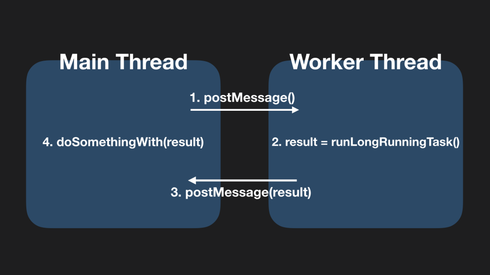
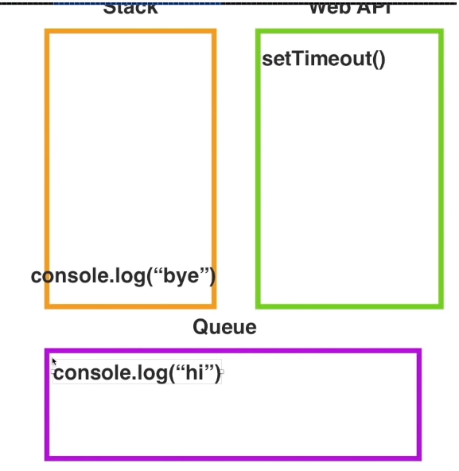
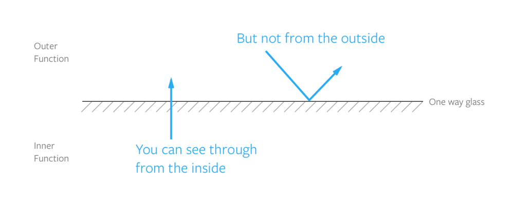
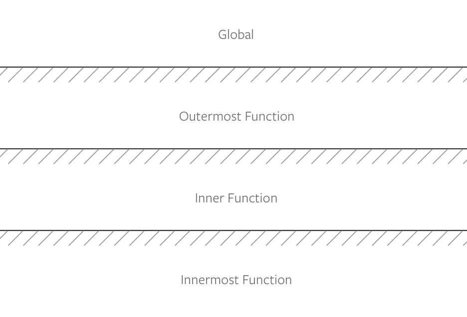
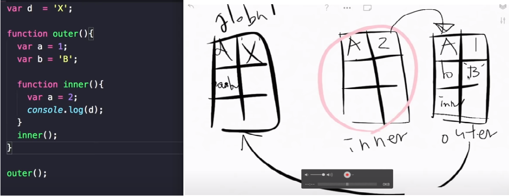
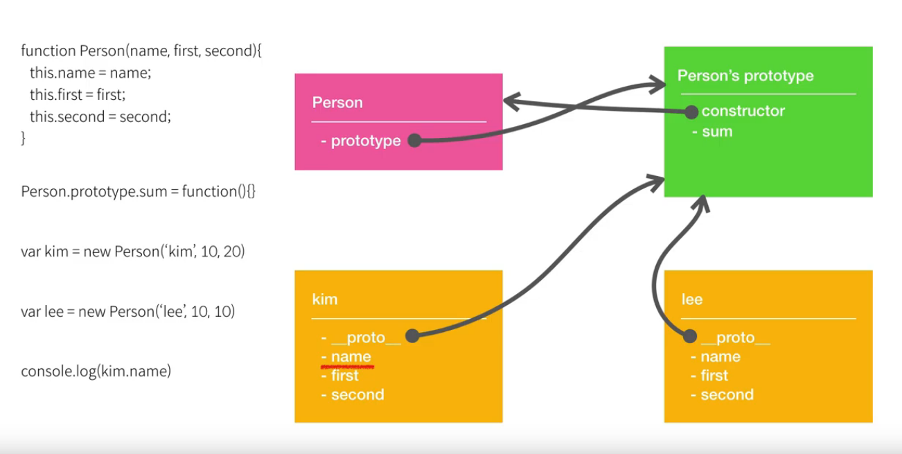

# CORS(Cross Domain)

서버와의 통신을 위해 ajax나 XMLHttpRequest를 사용하다보면 CORS 에러가 나오는 경우가 종종 발생합니다.
할때마다 설정 방법이나 우회 방법을 항상 찾다보니 매번 고생하는거 같아 정리해봅니다.

CORS 란?
CORS는 Cross-Origin Resource Sharing의 약자로 보안상의 이유로, 브라우저들은 스크립트 내에서 초기화되는 cross-origin HTTP 요청을 제한합니다. 예를 들면 다음과 같습니다.

위 예제에서 사이트의 도메인은 www.a.com인데 Ajax를 할 경우 www.b.com처럼 다른 도메인에 보낼 경우 CORS 관련 에러가 납니다.
아래는 Same-origin(<b>프로토콜, 호스트명, 포트</b>)이 되는 조건에 대해서 보여줍니다.

1. Access-Control-Allow-Origin response 헤더를 추가

```javascript
app.get('/data', (req, res) => {
  res.header('Access-Control-Allow-Origin', '*');
  res.send(data);
});
```

간단하게 모든 클라이언트에 요청에 대한 cross-origin HTTP 요청을 허가하는 헤더를 추가해 주었습니다.

그치만 rest.api의 모든 응답에 일일히 추가해주기 힘들겠죠?

2. node.js의 미들웨어 CORS 추가

이미 만들어진 node.js 미들웨어중 이를 해결해주는 미들웨어가 있는데 바로 CORS 입니다.

```batch
npm install --save cors

yarn add cors
//이것을 이용하면 더욱 간단하게 CORS를 허가해줄 수 있습니다
```

```javascript
const express = require('express');
const cors = require('cors');

const app = express();

app.use(cors()); // CORS 미들웨어 추가
```

하지만 위에 처럼 헤더를 추가 하거나 미들웨어를 적용하면 모든 요청에 대해 허가를 하게 됩니다.
보안적으로 취약해질 수 있겠죠?

그래서 cors 미들웨어에는 여러가지 설정할 수 있습니다.

```batch
const corsOptions = {
origin: 'http://localhost:3000', // 허락하고자 하는 요청 주소
credentials: true, // true로 하면 설정한 내용을 response 헤더에 추가 해줍니다.
};
```

```javascript
app.use(cors(corsOptions)); // config 추가
```

<h1 style="font-weight:bold">참고사이트</h1>

<a href="https://velog.io/@wlsdud2194/cors" target="_blank" style="font-size=30px; color: #4dabf7; text-decoration:underline;">https://velog.io/@wlsdud2194/cors</a>
<a href="https://velog.io/@jmkim87/%EC%A7%80%EA%B8%8B%EC%A7%80%EA%B8%8B%ED%95%9C-CORS-%ED%8C%8C%ED%97%A4%EC%B3%90%EB%B3%B4%EC%9E%90" target="_blank" style="font-size=30px; color: #4dabf7; text-decoration:underline;">https://velog.io/@jmkim87/%EC%A7%80%EA%B8%8B%EC%A7%80%EA%B8%8B%ED%95%9C-CORS-%ED%8C%8C%ED%97%A4%EC%B3%90%EB%B3%B4%EC%9E%90</a>

## CORS(Cross Domain) 예제

```javascript
// 직접 서버간의 통신으로는 cors error가 발생하지 않는다(브라우저 정책상 제한:domain,port,protocol)
// XMLHttpRequest get request
app.get('/serverTest', (req, res) => {
  var XMLHttpRequest = require('xmlhttprequest').XMLHttpRequest;
  var xmlHttp = new XMLHttpRequest();
  xmlHttp.onreadystatechange = function () {
    if (this.status == 200 && this.readyState == this.DONE) {
      console.log(xmlHttp.responseText);
    }
  };

  xmlHttp.open(
    'GET',
    'http://localhost:3000/corsTest?' + 'id=gmm117&pw=hongseungah',
  );

  xmlHttp.send();
  res.send('cors server success');
});

// XMLHttpRequest post request
app.get('/serverpostTest', (req, res) => {
  var XMLHttpRequest = require('xmlhttprequest').XMLHttpRequest;
  var xhr = new XMLHttpRequest();
  xhr.onreadystatechange = function () {
    if (this.status == 200 && this.readyState == this.DONE) {
      console.log(xhr.responseText);
    }
  };

  xhr.open('POST', 'http://localhost:3000/corspostTest', false);
  // xhr.setRequestHeader("Content-type", "application/json");
  // const data = JSON.stringify({
  //     id: 'gmm117',
  //     pw: 'hongseungah'
  // });
  xhr.setRequestHeader('Content-Type', 'application/x-www-form-urlencoded');
  xhr.send('id=gmm117&pw=hongseungah');
  res.send('cors client test');
});

// ajax post request
app.get('/serverpostajaxTest', (req, res) => {
  $.ajax({
    url: 'http://localhost:3000/corspostTest', // 요청 할 주소
    async: false, // false 일 경우 동기 요청으로 변경
    type: 'POST', // GET, PUT
    data: 'id=gmm117&pw=hongseungah', // 전송할 데이터
    dataType: 'text', // xml, json, script, html
    beforeSend: function (jqXHR) {}, // 서버 요청 전 호출 되는 함수 return false; 일 경우 요청 중단
    success: function (jqXHR) {}, // 요청 완료 시
    error: function (jqXHR) {}, // 요청 실패.
    complete: function (jqXHR) {}, // 요청의 실패, 성공과 상관 없이 완료 될 경우 호출
  });

  res.send('cors ajax client test');
});

// axios post request
app.get('/serverpostaxiosTest', (req, res) => {
  axios({
    url: 'http://localhost:3000/corspostTest',
    method: 'POST',
    data: 'id=gmm117&pw=hongseungah',
  });

  res.send('cors axios client test');
});

// fetch post request
app.get('/serverpostfetchTest', (req, res) => {
  fetch('http://localhost:3000/corspostTest', {
    method: 'POST',
    body: JSON.stringify({
      id: 'gmm117',
      pw: 'hongseungah',
    }),
    headers: { 'Content-Type': 'application/json' },
  }).then(response => console.log(response));

  res.send('cors fetch client test');
});

var port = 5000;
app.listen(port, () => {
  console.log('server on! http://localhost:', port);
});

// server
var express = require('express');
var bodyParser = require('body-parser');
var app = express();

app.get('/', (req, res) => {
  res.send('hello world');
});

app.get('/corsTest', (req, res) => {
  res.header('Access-Control-Allow-Origin', 'http://localhost:5000');

  res.send('cors success');
  console.log(req.query.id, req.query.pw);
});

app.use(bodyParser.urlencoded({ extended: true }));
app.use(bodyParser.json());

app.post('/corspostTest', (req, res) => {
  res.header('Access-Control-Allow-Origin', 'http://localhost:5000');
  res.send('cors post success');
  console.log(req.body);
});

var port = 3000;
app.listen(port, () => {
  console.log('server on! http://localhost:', port);
});
```

<h1 style="font-weight:bold">예제코드</h1>

<a href="https://github.com/gmm117/cors" target="_blank" style="font-size=30px; color: #4dabf7; text-decoration:underline;">https://github.com/gmm117/cors</a>

# 클라이언트 측의 저장소

## 쿠키

- 쿠키를 설정하면 이후 모든 웹 요청은 쿠키정보를 포함하여 서버로 전송
- 문자열만 저장, 4KB용량 제한
- 대개, 방문한 페이지를 저장하거나 유저의 로그인 정보를 저장
- Seesion cookies : 만료일이 포함되지 않는 쿠키(브라우저 탭이 열려 있는 동안만)
- Persistent cookies : 만료일을 가지는 쿠키(유저의 웹사이트의 행동기록등에 사용)

```javascript
document.cookie = "Hong's";
document.cookie = 'user_age=38';

// 읽기
console.log(document.cookie);

// 변경
document.cookie = 'user_age=37';

// 삭제
document.cookie = 'user_age=37;expires=Thu, 01 Jan 2000 00:00:01 GMT';

console.log(document.cookie);
```

## localstorage

- 오직 문자열만 저장가능
- JSON 데이터를 문자열로 변환하여서 문자열 저장하는 부분을 보완가능
- 브라우저가 종료해도 데이터가 유지
- 도메인이 다를 경우 로컬스토리지 접근 불가능
- 브라우저, 기기별 용량 제한(브라우저: 5MB~10MB, 모바일: 2.5MB)

```javascript
// 생성
const user = { name: "Hong's", age: 36 };
localStorage.setItem('user', JSON.stringify(user));

// 읽기 (단일)
const readUser = localStorage.getItem('user');
if (typeof readUser === 'string') {
  console.log(JSON.parse(readUser));
}

// 변경
const updatedUser = { name: "Hong's", age: 37 };
localStorage.setItem('user', JSON.stringify(updatedUser));

// 삭제
localStorage.removeItem('user');
```

## sessionstorage

- 오직 문자열만 저장가능
- JSON 데이터를 문자열로 변환하여서 문자열 저장하는 부분을 보완가능
- 각 세션마다 개별적으로 저장(예: 탭실행, 세션종료시 개별실행)
- 같은 도메인이라도 세션이 다르면 접근불가능
- 브라우저, 기기별 용량 제한(브라우저: 5MB~10MB, 모바일: 2.5MB)
- 사용법은 localstorage와 동일하다.

```javascript
// 생성
const user = { name: "Hong's", age: 36 };
sessionStorage.setItem('user', JSON.stringify(user));

// 읽기 (단일)
const readUser = sessionStorage.getItem('user');
if (typeof readUser === 'string') {
  console.log(JSON.parse(readUser));
}

// 변경
const updatedUser = { name: "Hong's", age: 37 };
sessionStorage.setItem('user', JSON.stringify(updatedUser));

// 삭제
sessionStorage.removeItem('user');
```

<h1 style="font-weight:bold">참고사이트</h1>

<a href="https://dongwoo.blog/2016/12/19/%ED%81%B4%EB%9D%BC%EC%9D%B4%EC%96%B8%ED%8A%B8-%EC%B8%A1%EC%9D%98-%EC%A0%80%EC%9E%A5%EC%86%8C-%EC%82%B4%ED%8E%B4%EB%B3%B4%EA%B8%B0/" target="_blank" style="font-size=30px; color: #4dabf7; text-decoration:underline;">https://dongwoo.blog/2016/12/19/%ED%81%B4%EB%9D%BC%EC%9D%B4%EC%96%B8%ED%8A%B8-%EC%B8%A1%EC%9D%98-%EC%A0%80%EC%9E%A5%EC%86%8C-%EC%82%B4%ED%8E%B4%EB%B3%B4%EA%B8%B0/</a>
<a href="https://tristan91.tistory.com/521" target="_blank" style="font-size=30px; color: #4dabf7; text-decoration:underline;">https://tristan91.tistory.com/521</a>

# this 핵심내용

- this는 함수를 호출하는 방법에 의해서 결정된다.

```javascript
const someone = {
  name: 'hong',
  consoleName: function () {
    console.log(this);
  },
};

// someone에 의해서 결정된다.
someone.consoleName();

const someonewindow = someone.consoleName;
// 내부적으로 someonewindow() 함수를 window가 호출됨으로 this는 window를 가리킨다.
someonewindow();

// html button dom에서 수행했으므로 this는 button이 된다.
// 동일하게 this는 button이 된다.
const btn = document.getElementById('btn');
btn.addEventListener('click', someone.consoleName);
btn.addEventListener('click', someone.someonewindow);
```

# 커링 함수 & Partial application

```javascript
var plus = function (a, b, c) {
  return a + b + c;
};

Function.prototype.partial = function () {
  var args = [].slice.apply(arguments);
  var self = this;
  return function () {
    return self.apply(null, args.concat([].slice.apply(arguments)));
  };
};

var plusa = plus.partial(1);
plusa(2, 3); // 6
var plusb = plusa.partial(2);
plusb(4); // 7
var plusab = plus.partial(1, 3);
plusab(5); // 9
```

이렇게 일부 인자만 받은 새로운 함수를 만들고, 나중에 새로운 함수에 인자를 넣어 완성합니다.

## Partial application

여러 개의 인자를 받는 함수가 있을 때 일부의 인자를 고정한 함수를 만드는 기법입니다

## 커링함수 개념

커링은 수학자 하스켈 커리로 부터 유래된 이름이고 함수를 변형하는 과정을 말한다.
함수의 전달인자 몇 개를 미리 채움으로써 더 간단한 함수를 만드는 방법입니다.
커링도 partial application처럼 인자를 미리 고정할 수 있지만 하나씩만 고정한다는 것이 특징입니다. 또한, 모든 인자를 받을 때까지 계속 함수를 생성합니다.
매 번 인자를 1개씩 고정하는 연속적인 partial application으로 볼 수도 있습니다.

## 커링을 사용하는 경우

어떤 함수를 호출할 때 대부분의 매개 변수가 항상 비슷하다면 커링을 사용할 만한 후보라고 할 수 있다.
매개변수 일부를 적용하여 새로운 함수를 동적으로 생성하면 이 동적 생성된 함수는 반복적으로 사용되는 매개변수를 내부적으로 저장하여, 매번 인자를 전달하지 않아도 원본함수가 기대하는 기능을 채워 놓게 될 것이다.

```javascript
// 커링된 add()
// 부분적인 인자의 목록을 받는다.
function add(x, y) {
  if (typeof y === 'undefined') {
    // 부분적인 적용
    return function (y) {
      return x + y;
    };
  }
  // 전체 인자를 적용
  return x + y;
}
console.log(add(3, 5));

console.log(add(10)(10));

var add10 = add(10);
console.log(add10(20));

function multiplyThree(x) {
  return function (y) {
    return function (z) {
      return x * y * z;
    };
  };
}
multiplyThree(4)(8)(2); // 64
```

```javascript
function multiplyThree(x) {
  return function(y) {
    return function(z) {
      return x _ y _ z;
    }
  };
}
multiplyThree(4)(8)(2); // 64

Function.prototype.curry = function(one) {
  var origFunc = this;
  var target = origFunc.length;
  var args = [];
  function next(nextOne) {
    args = args.concat(nextOne);
    if (args.length === target) {
      return origFunc.apply(null, args);
    } else {
      return function(nextOne) { return next(nextOne) };
    }
  }
  return next(one);
}

function multiplyFour(w, x, y, z) {
  return w _ x _ y \* z;
}
multiplyFour.curry(2)(3)(4)(5); // 120
```

<h1 style="font-weight:bold">참고사이트</h1>

<a href="https://www.zerocho.com/category/JavaScript/post/579236d08241b6f43951af18" target="_blank" style="font-size=30px; color: #4dabf7; text-decoration:underline;">https://www.zerocho.com/category/JavaScript/post/579236d08241b6f43951af18</a>
<a href="https://webclub.tistory.com/m/6" target="_blank" style="font-size=30px; color: #4dabf7; text-decoration:underline;">https://webclub.tistory.com/m/6</a>

---

# web worker

웹 워커
JavaScript에서 웹 워커(web worker)를 활용하면 멀티 스레딩이 가능합니다(참고). 웹 워커는 스크립트 수행을 메인 스레드가 아닌 별도 백그라운드 스레드에서 수행할 수 있게 해줍니다.

메인 스레드에서 워커 객체를 생성하면 워커 스레드와 메시지 기반으로 통신이 가능합니다. 워커 스레드에게 postMessage를 통해 처리하는 데 오래 걸리는 작업의 실행을 요청하면 워커 스레드는 이를 실행합니다. 이를 통해 메인 스레드가 블록되는 것을 막을 수 있습니다. 워커 스레드는 작업이 완료되면 역시 postmessage를 통해 결과 완료 메시지를 전송하고, 메인 스레드에선 이를 통해 또 다른 작업을 할 수 있게 됩니다.



<a href="https://engineering.linecorp.com/ko/blog/dont-block-the-event-loop/" target="_blank" style="font-size=30px; color: #4dabf7; text-decoration:underline;">https://engineering.linecorp.com/ko/blog/dont-block-the-event-loop/</a>

# time

## setTimeout

```javascript
// setTimeout은 시간이 지난후에 기능을 메시지(message queue)에 넣어줌(스택에 빌경우 실행)

setTimeout(() => console.log('setTimeout start'), 1000);
const helloT = setTimeout(console.log, 1000, 'setTimeout start');
clearTimeout(helloT);
```

## setInterval

```javascript
// Interval이 1초보다 적다면 크롬에서는 1초로 강제로 변경
const helloT = setInterval(console.log, 5000, 'setTimeout start');

clearInterval(helloT);
```

## requestAnimationFrame

```javascript
// 이전에는 사물의 움직이거나할 경우 setInterval을 사용했지만, cpu/그래픽카드 같은 물리적인 장치가 느릴 경우 Internal이 느려지는 문제가 있었음
// 브라우저가 자체 프레임을 업데이트(repaint) 하기전에 호출이되서 처리되도록 하는 기능(cpu, 그래픽카드 최적화, 현재탭에서만 처리)
requestAnimationFrame(() => console.log('animation frame'));
```

# Message Queue and Event Loop

```javascript
// 자바스크립트는 디폴트로 갖고 있는 않고 WebApi를 통해서 함수호출이 가능하다.
// stack -> webapi -> queue -> stack 비워질경우 queue에 데이터를 가져와서 stack에서 로딩 후 실행된다.
setTimeout(() => console.log('hi'), 0);
console.log('bye');
```



<a href="https://helloworldjavascript.net/pages/285-async.html" target="_blank" style="font-size=30px; color: #4dabf7; text-decoration:underline;">https://helloworldjavascript.net/pages/285-async.html</a>

---

# 프로그레시브 웹앱(Progressive Web Apps)

프로그레시브 웹앱(Progressive Web Apps)은 Google I/O 2016에서 소개된 미래의 웹기술이며, PWA라고 줄여서 부르기도 합니다.

먼저 구글에서 소개하는 PWA는 이러합니다.

> PWA는 최고의 웹과 최고의 앱을 결합한 경험이다. 브라우저를 통해 처음 방문한 사용자에게 유용하며, 설치가 필요하지 않다.
> 사용자가 PWA와 관계를 점진적으로 형성할수록 성능이 더욱 강력해 질 것이다. 느린 네트워크에서도 빠르게 로드되고, 관련된 푸시 알림을 전송한다.
> 모바일 앱처럼 전체 화면으로 로드되고, 홈 화면에 아이콘이 있다.

네이티브 앱은 느린 네트워크에서도 작동하며, 백그라운드에서 푸시 알람을 보내줍니다. 또한, 카메라, 마이크 등에도 쉽게 접근하여 다양한 기능을 수행할 수 있습니다. 즉, Capability(능력)가 뛰어나다라고 할 수 있죠.
웹은 URL을 통한 접근이 간단하고, 설치 과정이 없습니다. 즉, Reach(범위)가 넓다라고 할 수 있습니다.
이는 다음 그림처럼 시각화 할 수 있습니다.


그리고 네이티브 앱과 웹의 장점을 결합한 PWA는 이쯤에 위치시킬 수 있겠네요.


### 참조사이트

<a href="https://altenull.github.io/2018/02/25/%ED%94%84%EB%A1%9C%EA%B7%B8%EB%A0%88%EC%8B%9C%EB%B8%8C-%EC%9B%B9-%EC%95%B1-Progressive-Web-Apps-%EB%9E%80/" target="_blank" style="font-size=30px; color: #4dabf7; text-decoration:underline;">PWA</a>

# 화살표 함수없는 것 3가지

- this : 함수가 실행하는 주체가 this가 된다.
  - new로 생성할 수 없다. prototype도 존재하지 않는다.

```javascript
const btn = document.getElementById('btn');
var myobj = {
  count: 3,
  setCounter: function () {
    console.log(this.count);
    btn.addEventListener('click', function () {
      console.log(this);
    });

    btn.addEventListener(
      'click',
      function () {
        console.log(this);
      }.bind(this),
    ); // this를 강제로 변경가능

    btn.addEventListener('click', () => {
      console.log(this.counter);
    });
    // 화살표 함수는 this를 가지지 않고 현재는 선언된 위치상의 this를 가지므로 this가 myobj가 된다.
  },
};

myobj.setCounter(); // this -> myobj
```

---

- arguments

```javascript
function myFunc2() {
  console.log(arguments); // arguments args,callee...
}

const myFunc2 = () => {
  console.log(arguments); // arguments is not defined
};

function outer() {
  // arguments 회피방법(outer함수)
  const myFunc2 = () => {
    console.log(arguments); // outer의 arguments
  };
  myFunc2();
}

const myFunc2 = (...args) => {
  // arguments 회피방법(rest 문법사용)
  console.log(args);
};
myFunc2(1, 2, 3);
```

- 함수이름

```javascript
const tempFunc = function myFunc() {};

const tempFunc = () => {};
```

---

## call/bind/apply

### call, apply, bind 차이

call(), apply() 는 ECMA 3에서 추가 되었으며, bind()는 ECMA 5에서 추가 되었습니다.
call(), apply()는 invoke입니다. 함수 호출을 즉시 합니다.
bind()는 나중에 실행될때 사용 됩니다. 특정 이벤트를 함수를 호출해야 할때 유용합니다.

### call

func.call(this, arg1, arg2, … argN);
this 부분에 객체를 넣어주면 넣어준 객체를 가리키게 된다. 특이사항은 파라미터를 일일이 콤마로 구분해서 넣어줘야 하는 것.

```javascript
// call
var obj = { name: 'Niladri' };
var greeting = function (a, b, c) {
  return 'welcome ' + this.name + ' to ' + a + ' ' + b + ' in ' + c;
};
console.log(greeting.call(obj, 'Newtown', 'KOLKATA', 'WB'));
```

### apply

func.apply(this, arguments);
call()과 기능은 같지만 파라미터를 Array로 넘겨준다는 특징이 있다. 만약 함수에서 받은 모든 인자를 그대로 넘겨주는 경우, 가변 인자의 경우 유용하다. 또는 선택적으로 배열에 담아 전달할 수 있다.

```javascript
// apply
var obj = { name: 'Niladri' };
var greeting = function (a, b, c) {
  return 'welcome ' + this.name + ' to ' + a + ' ' + b + ' in ' + c;
};

// array of arguments to the actual function
var args = ['Newtown', 'KOLKATA', 'WB'];
console.log('Output using .apply() below ');
console.log(greeting.apply(obj, args));
```

### bind

bind()는 새로운 함수 인스턴스를 생성한다.

```javascript
// bind
var obj = { name: 'Niladri' };
var greeting = function (a, b, c) {
  return 'welcome ' + this.name + ' to ' + a + ' ' + b + ' in ' + c;
};

//creates a bound function that has same body and parameters
var bound = greeting.bind(obj);
console.dir(bound); ///returns a function
console.log('Output using .bind() below ');
console.log(bound('Newtown', 'KOLKATA', 'WB')); //call the bound function
```

### 참조사이트

<a href="https://bugtypekr.tistory.com/2" target="_blank" style="font-size=30px; color: #4dabf7; text-decoration:underline;">참조사이트</a>

## 실행 컨텍스트(Execution Context)에 대해 설명

## 함수 호이스팅(Function hoisting)과 스코프

- 함수가 함수 선언식(function declaration)으로 선언 - 현재 스코프의 최상단으로 호이스팅(hoist) 됩니다.

```javascript
// This is the same as the one below
sayHello();
function sayHello() {
  console.log('Hello CSS-Tricks Reader!');
}
// This is the same as the code above
function sayHello() {
  console.log('Hello CSS-Tricks Reader!');
}
sayHello();
```

- 함수가 함수 표현식(function expression)으로 선언 - 현재 스코프의 최상단으로 호이스팅되지 않습니다

```javascript
sayHello(); // Error, sayHello is not defined
const sayHello = function () {
  console.log(aFunction);
};
```

## 스코프

자바스크립트에서 스코프란 어떤 변수들에 접근할 수 있는지를 정의합니다.
스코프엔 두 가지 종류가 있는데요, 전역 스코프(global scope)와 지역 스코프(local scope)가 있죠.

### 전역 스코프(Global Scope)

변수가 함수 바깥이나 중괄호({}) 바깥에 선언되었다면, 전역스코프에 정의됨

```javascript
// 전역스코프 사용
const hello = 'Hello CSS-Tricks Reader!'; // 전역변수
function sayHello() {
  console.log(hello);
}
console.log(hello); // 'Hello CSS-Tricks Reader!'
sayHello(); // 'Hello CSS-Tricks Reader!'
```

- var 중복일경우 마지막 변수가 그위에 변수를 덮어쓰게 됨
- let, const 사용하여 선언할 경우, 이름충돌 에러발생

```javascript
// Don’t do this!
var thing = 'something';
var thing = 'something else'; // perhaps somewhere totally different in your code
console.log(thing); // ‘something else’

// Don’t do this!
let thing = 'something';
let thing = 'something else'; // Error, thing has already been declared
```

### 지역스코프(Local Scope)

- 함수 스코프(Function Scope)
  - 함수 내부에서 변수를 선언하면, 그 변수는 해당 함수내에서만 접근가능함.

```javascript
function sayHello() {
  var hello = 'Hello CSS-Tricks Reader!';
  console.log(hello);
}
sayHello(); // 'Hello CSS-Tricks Reader!'
console.log(hello); // Error, hello is not defined
```

- 블록 스코프(Block Scope)
  - 여러분이 중괄호({}) 내부에서 const 또는 let으로 변수를 선언하면, 그 변수들은 중괄호 블록 내부에서만 접근할 수 있습니다.

```javascript
{
  const hello = 'Hello CSS-Tricks Reader!';
  console.log(hello); // 'Hello CSS-Tricks Reader!'
}
console.log(hello); // Error, hello is not defined
```

### 네스팅된 스코프(Nested scopes)

자바스크립트에서는 함수가 선언될 때 자신이 접근할 수 있는 범위를 정하고 기억하고 있는데 이것을 렉시컬 스코프라고 합니다. 그리고 이런 렉시컬 스코프에 의해 외부 함수의 환경을 기억하고 있는 내부 함수가 클로저입니다.

하지만, 외부 함수는 내부 함수의 변수에 접근할 수 없습니다.

```javascript
function outerFunction() {
  const outer = 'I’m the outer function!';

  function innerFunction() {
    const inner = 'I’m the inner function!';
    console.log(outer); // I’m the outer function!
  }

  console.log(inner); // Error, inner is not defined
}
```




## 스코프체인



- 함수(setClick) 스코프만 존재할 경우
  

- 블록스코프(for문안에 {}) 스코프가 존재할 경우
  

<a href="https://www.youtube.com/watch?v=RZ3gXcI1MZY" target="_blank" style="font-size=30px; color: #4dabf7; text-decoration:underline;">참조사이트</a>

## 클로저(Closures)

클로저는 내부 함수가 정의될 때 외부 함수의 환경을 기억하고 있는 내부 함수를 말합니다. 외부 함수 안에서 선언된 내부 함수는 그 외부 함수의 지역 변수나 함수에 접근하여 사용할 수 있습니다.

```javascript
function outerFunction() {
  const outer = 'I see the outer variable!';

  return function innerFunction() {
    console.log(outer);
  };
}
outerFunction()(); // I see the outer variable!
```

- Private 변수와 클로저
  함수 내의 변수는 함수 바깥에서 접근할 수 없습니다. 그 변수들은 접근할 수 없기 때문에, private 변수라고 불립니다.
  하지만, 해당 변수들에 접근해야 할 필요가 종종 발생합니다. 이것 또한 클로저를 활용해서 할 수 있죠.

```javascript
function secret(secretCode) {
  return {
    saySecretCode() {
      console.log(secretCode);
    },
  };
}
const theSecret = secret('CSS Tricks is amazing');
theSecret.saySecretCode();
// 'CSS Tricks is amazing'
```

### 참조사이트

<a href="https://medium.com/@khwsc1/%EB%B2%88%EC%97%AD-%EC%9E%90%EB%B0%94%EC%8A%A4%ED%81%AC%EB%A6%BD%ED%8A%B8-%EC%8A%A4%EC%BD%94%ED%94%84%EC%99%80-%ED%81%B4%EB%A1%9C%EC%A0%80-javascript-scope-and-closures-8d402c976d19" target="_blank" style="font-size=30px; color: #4dabf7; text-decoration:underline;">참조사이트</a>

## 브라우저 동작원리

<a href="https://d2.naver.com/helloworld/59361" target="_blank" style="font-size=30px; color: #4dabf7; text-decoration:underline;">https://d2.naver.com/helloworld/59361</a>

## prototype, **proto**

### Object.prototype 이란?

Javascript에서 거의 모든 객체는 Object의 인스턴스이다. 일반적인 객체는 Object.prototype에서 속성과 메서드를 상속받으며, 그 일부는 숨겨질 수 있다. - MDN문서 정의

```javascript
function Person() {}
var Person = new Function();
// javascript에서는 함수 또한 객체이다.

function Person(name, first, second) {
  this.name = name;
  this.first = first;
  this.seconde = second;
}
// 객체생성 시 person, person prototype 객체 2개가 생긴다.
```

```javascript
// MDN 예시 코드
var Person = function () {
  // Person객체 생성
  this.canTalk = true;
};

Person.prototype.greet = function () {
  if (this.canTalk) {
    console.log('Hi, I am ' + this.name);
  }
};

var Employee = function (name, title) {
  Person.call(this); // Person객체의 this를 지칭
  this.name = name;
  this.title = title;
};

Employee.prototype = Object.create(Person.prototype); // Person객체를 참조
Employee.prototype.constructor = Employee; // 자신을 지칭

Employee.prototype.greet = function () {
  if (this.canTalk) {
    console.log('Hi, I am ' + this.name + ', the ' + this.title);
  }
};

var kim = new Employee('kim', 'student');
```

- 설명
  Person객체를 생성시 Person.prototype이 생성된다. 그리고 Person.prototype.constructor는 Person을 가리킨다. 그리고 Employee.prototype이 Person.prototype을 참조하게 한다면, 그의 constructor 또한 Person을 지칭하므로 자신을 지칭할 수 있도록 다시 Employee로 변경해준다. 그리고 새롭게 생성된 kim객체는 Employee.prototype를 가리킨다. 따라서 kim.proto 는 Employee.prototype를 가리킨다


함수 객체 앞에 new키워드를 사용하면 생성자가 되고, 이것으로 생성한 객체를 인스턴스라고 한다. 위 이미지에서는 kim이 Person객체의 인스턴스이다.

### **proto** vs prototype의 차이

- **proto**

  - **proto** 속성은 모든 객체가 가지고 있는 속성.
  - 객체가 생성될 때 자신의 생성한 객체에 프로토타입을 가리킽다.

- prototype
  - 함수 객체만이 가지는 프로토타입
  - 생성한 인스턴스가 가리키는 프로토타입을 의미한다.

### Prototype Chain

모든 프로토타입 체인의 끝은 항상 Object.prototype이다. 그래서 Object.prototype은 **proto**속성이 없다.

### 참조사이트

<a href="https://velog.io/@miniyoung37/-prototype-proto-Object.create-21k0w0txr4" target="_blank" style="font-size=30px; color: #4dabf7; text-decoration:underline;">prototype,proto</a>

## OOP

### OOP에 특징에 대해 설명(상속, 캡슐화 등등...)

### OOP의 개념으로 설계과정을 설명

## 함수형 프로그래밍(Function Programming)

### 함수형 프로그래밍에 대해 설명

### 순수함수, 불변성, 일급객체

1급 객체 (First Object, 또는 1급 시민)

- 1급 객체(First class object)란 다음과 같은 조건을 만족하는 객체
  - 변수나 데이터 구조안에 담을 수 있다.
  - 파라미터로 전달 할 수 있다.
  - 반환값(return value)으로 사용할 수 있다.
  - 동적으로 프로퍼티 할당이 가능하다.

고차 함수 (High-Order Function)

- 람다 계산법에서 만들어진 용어로 아래 조건을 만족하는 함수
  - 함수에 함수를 파라미터로 전달할 수 있다.
  - 함수의 반환값으로 함수를 사용할 수 있다.

불변성 (Immutablility)

- 함수형 프로그래밍에서는 데이터가 변할 수 없는데, 이를 불변성 데이터라고 한다. (자바스크립트는 가능하지만 불가능한 언어들이 있다)
- 데이터 변경이 필요한 경우, 원본 데이터 구조를 변경하지 않고 그 데이터를 복사본을 만들어 그 일부를 변경하고, 변경한 복사본을 사용해 작업을 진행한다.

```javascript
// 불변이 아닌 변하는(Mutatable) 데이터
function rateColor(color, rating) {
  color.rating = rating;
  return color;
}

console.log(rateColor(color_lawn, 5), rating); // 5
console.log(color_lawn.rating); // 5

// 불변성 데이터
function rateColor(color, ratring) {
  return Object.assign({}, color, { ratring: ratring });
}

console.log(rateColor(color * lawn, 5), rating); // 5
console.log(color_lawn.rating); // 0 *변하지 않음\_
```

순수 함수 (Pure function)

- 순수 함수란 함수형 프로그래밍에 필요한 개념으로 아래 조건을 만족하는 함수를 뜻한다.
  - 함수의 결과값이 오직 입력 인자 값들에 의해서만 결정
  - 부작용(side effects)이 없는 함수
  -

```javascript
var outadd = 2;

// 순수함수 아닌경우(외부요인에 따라서 값이 가변적이다.)
function add(first, second) {
  console.log(outadd + first + second);
}

// 순수함수인경우 (input 값에 따라서 output 값을 표현해준다. 외부요인이 없다.)
function pureadd(first, secode) {
  console.log(first, second);
}
```

<a href="https://velog.io/@kyusung/%ED%95%A8%EC%88%98%ED%98%95-%ED%94%84%EB%A1%9C%EA%B7%B8%EB%9E%98%EB%B0%8D-%EC%9A%94%EC%95%BD" target="_blank" style="font-size=30px; color: #4dabf7; text-decoration:underline;">함수형프로그램</a>

### OOP vs FP

## 비동기 프로그래밍

### AJAX

### Promise, Async/Await

## 타입스크립트

### 개념

### 타입스크립트의 장점 & 단점

---

```

```
