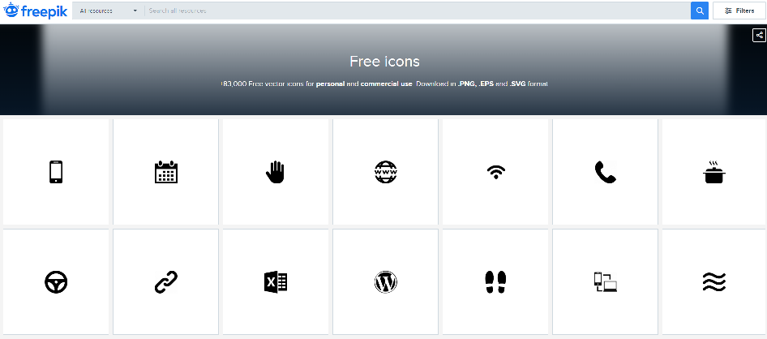
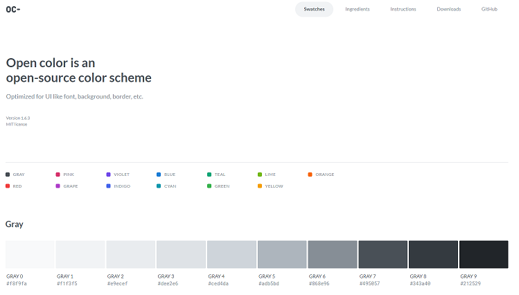

# Blog Theme

- Creating a personal blog using a Jekyll theme

  - <a href="https://theorydb.github.io/envops/2019/05/21/envops-blog-how-to-use-git/" target="_blank" style="font-size=30px; color: #4dabf7; text-decoration:underline;">Blog Theme 1</a>
  - <a href="https://theorydb.github.io/envops/2019/05/02/envops-blog-theme/#clean-blog-%ED%85%8C%EB%A7%88%EB%A5%BC-%EC%84%A0%ED%83%9D%ED%95%9C-%EC%9D%B4%EC%9C%A0" target="_blank" style="font-size=30px; color: #4dabf7; text-decoration:underline;">Blog Theme 2</a>

# Open Icon

- A page where you can download the icons you need for web development for free



- <a href="https://www.freepik.com/popular-icons" target="_blank" style="font-size=30px; color: #4dabf7; text-decoration:underline;">Icon 1</a>
- <a href="https://simpleicons.org/" target="_blank" style="font-size=30px; color: #4dabf7; text-decoration:underline;">Icon 2</a>

# Open Color

- A page that organizes a collection of colors used in UI, such as fonts, backgrounds, and borders



- <a href="https://yeun.github.io/open-color/" target="_blank" style="font-size=30px; color: #4dabf7; text-decoration:underline;">Open Color</a>
- <a href="https://www.npmjs.com/package/open-color" target="_blank" style="font-size=30px; color: #4dabf7; text-decoration:underline;">npm Open Color</a>

# Deploy a static web application for free with Surge.sh


Surge.sh is a hosting service for front-end developers that lets you deploy static web applications without a tedious sign-up process or complicated configuration. Its biggest feature is that you can deploy very easily with just a few commands from the command line, without ever leaving the IDE or terminal where you are currently writing code. On top of that, the pricing is perfectly fine even on the free plan for personal-scale projects. It is highly optimized for deploying static websites, web applications, SPAs, and the like—cases where you do not need a separate server or where the API server is hosted elsewhere. Despite these advantages, there is surprisingly little material about it in Korean, so I decided to introduce it myself.

- <a href="https://hudi.kr/surge-sh-%EB%A1%9C-%EB%AC%B4%EB%A3%8C%EB%A1%9C-%EC%A0%95%EC%A0%81-%EC%9B%B9-%EC%96%B4%ED%94%8C%EB%A6%AC%EC%BC%80%EC%9D%B4%EC%85%98-%EB%B0%B0%ED%8F%AC%ED%95%98%EA%B8%B0/" target="_blank" style="font-size=30px; color: #4dabf7; text-decoration:underline;">Reference site</a>

# Snippet

- A feature that automatically completes standardized code by typing a prefix is called a snippet.

## intellij

- How to use

* File-Setting-Live Templates-javascript
* abbreviation : prefix fc, Description : Function Componenets
* Template text : write the component to use as the template

```javascript
define(function (require) {
  'use strict';

  /**
   * @param
   * @constructor
   */
  function $FILE_NAME$() {}

  return $FILE_NAME$;
});
```

- Click Edit validables :
  - Register the Template ($FILE_NAME$)
  - Expression : select fileNameWithoutExtension()

## vs code

- How to use

* snippet text : write the javascript component to use

```javascript
define(function (require) {
	"use strict";

	/**
	 * @param
	 * @constructor
	 */
	function ${TM_FILENAME_BASE}() {
	}

    return ${TM_FILENAME_BASE};
});
```

- Convert a snippet suited for vscode on the <a href="https://snippet-generator.app/" target="_blank" style="font-size=30px; color: #4dabf7; text-decoration:underline;">https://snippet-generator.app</a> website
  - Description : Function Componenets
  - Tab trigger : fc
  - your snippet : paste the snippet text
- Copy the converted snippet text below
- File-Preferences-User Snippets-javascript.json
- Paste the converted snippet text
- After creating a js file, press fc + tab to use the registered snippet

---
