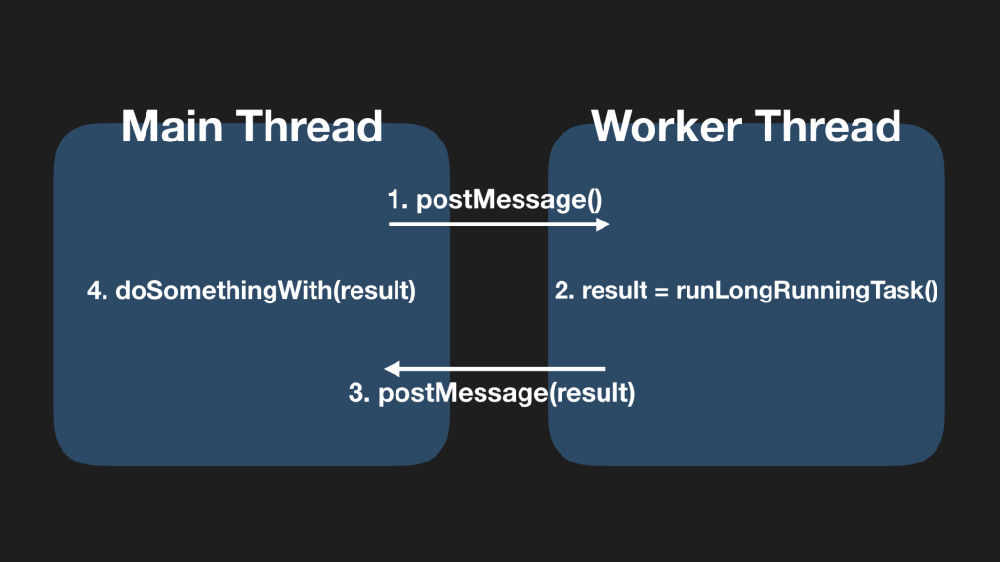
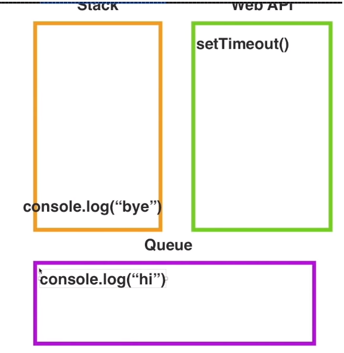
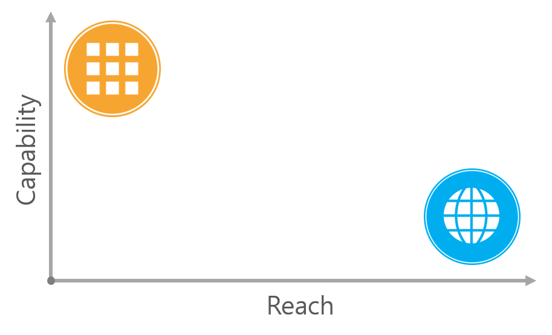
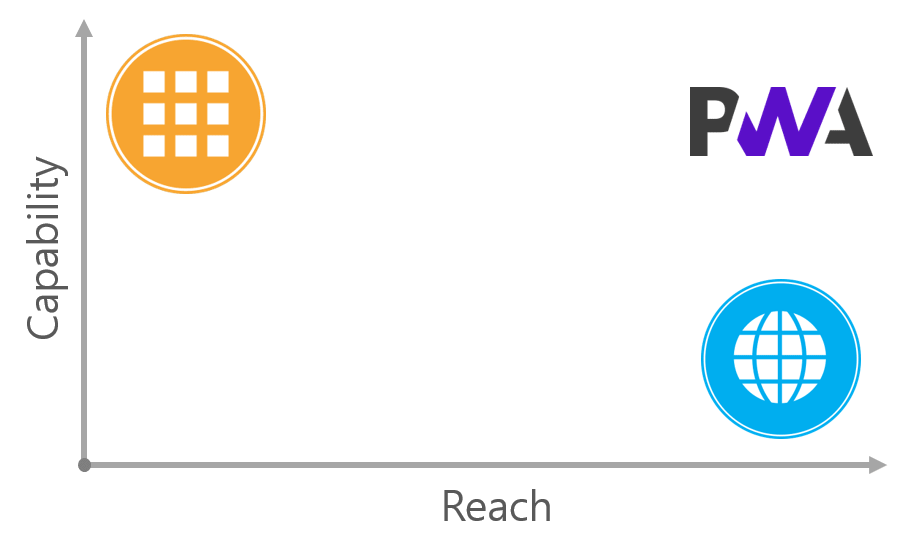
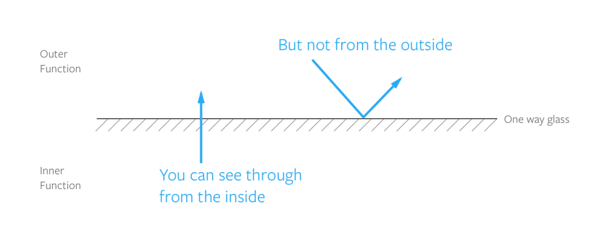
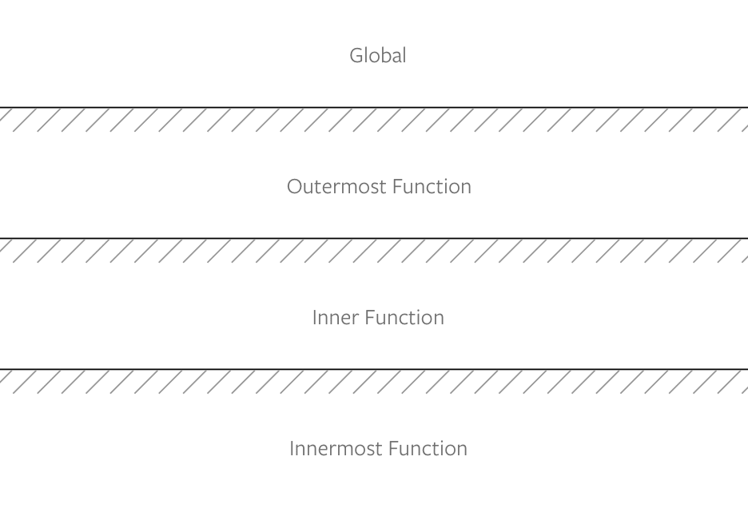
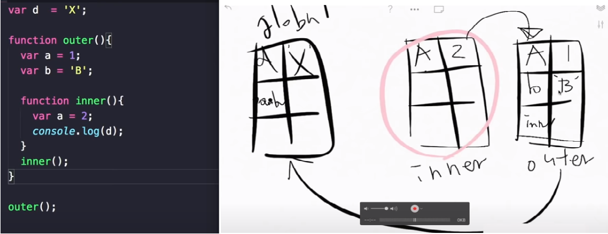
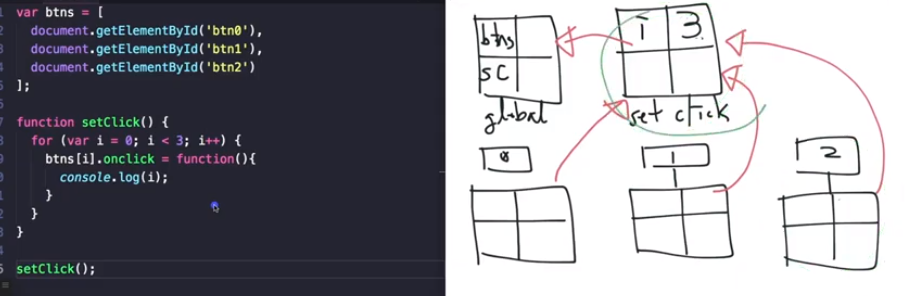
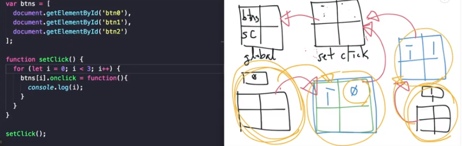
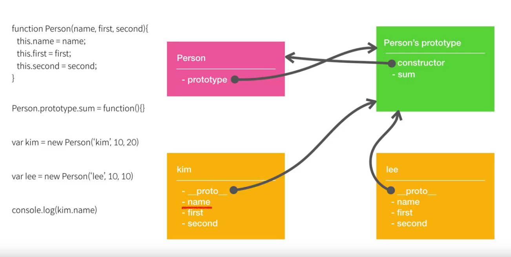

# Client-Side Storage

## Cookies

- Once a cookie is set, every subsequent web request is sent to the server including the cookie information
- Stores strings only, with a 4KB size limit
- Typically used to record visited pages or to store a user's login information
- Session cookies: cookies without an expiration date (they last only while the browser tab is open)
- Persistent cookies: cookies that have an expiration date (used, for example, to track a user's activity on a website)

```javascript
document.cookie = "Hong's";
document.cookie = 'user_age=38';

// 읽기
console.log(document.cookie);

// 변경
document.cookie = 'user_age=37';

// 삭제
document.cookie = 'user_age=37;expires=Thu, 01 Jan 2000 00:00:01 GMT';

console.log(document.cookie);
```

## localstorage

- Can store strings only
- You can work around the string-only limitation by converting JSON data into a string and storing it
- Data persists even after the browser is closed
- Local storage cannot be accessed across different domains
- Size limits vary by browser and device (browser: 5MB–10MB, mobile: 2.5MB)

```javascript
// 생성
const user = { name: "Hong's", age: 36 };
localStorage.setItem('user', JSON.stringify(user));

// 읽기 (단일)
const readUser = localStorage.getItem('user');
if (typeof readUser === 'string') {
  console.log(JSON.parse(readUser));
}

// 변경
const updatedUser = { name: "Hong's", age: 37 };
localStorage.setItem('user', JSON.stringify(updatedUser));

// 삭제
localStorage.removeItem('user');
```

## sessionstorage

- Can store strings only
- You can work around the string-only limitation by converting JSON data into a string and storing it
- Stored separately for each session (e.g., stored per tab, released individually when the session ends)
- Cannot be accessed from a different session even within the same domain
- Size limits vary by browser and device (browser: 5MB–10MB, mobile: 2.5MB)
- Its usage is identical to localstorage.

```javascript
// 생성
const user = { name: "Hong's", age: 36 };
sessionStorage.setItem('user', JSON.stringify(user));

// 읽기 (단일)
const readUser = sessionStorage.getItem('user');
if (typeof readUser === 'string') {
  console.log(JSON.parse(readUser));
}

// 변경
const updatedUser = { name: "Hong's", age: 37 };
sessionStorage.setItem('user', JSON.stringify(updatedUser));

// 삭제
sessionStorage.removeItem('user');
```

<h1 style="font-weight:bold">Reference Sites</h1>

<a href="https://dongwoo.blog/2016/12/19/%ED%81%B4%EB%9D%BC%EC%9D%B4%EC%96%B8%ED%8A%B8-%EC%B8%A1%EC%9D%98-%EC%A0%80%EC%9E%A5%EC%86%8C-%EC%82%B4%ED%8E%B4%EB%B3%B4%EA%B8%B0/" target="_blank" style="font-size=30px; color: #4dabf7; text-decoration:underline;">https://dongwoo.blog/2016/12/19/%ED%81%B4%EB%9D%BC%EC%9D%B4%EC%96%B8%ED%8A%B8-%EC%B8%A1%EC%9D%98-%EC%A0%80%EC%9E%A5%EC%86%8C-%EC%82%B4%ED%8E%B4%EB%B3%B4%EA%B8%B0/</a>
<a href="https://tristan91.tistory.com/521" target="_blank" style="font-size=30px; color: #4dabf7; text-decoration:underline;">https://tristan91.tistory.com/521</a>

# Key Points About this

- `this` is determined by how the function is called.

```javascript
const someone = {
  name: 'hong',
  consoleName: function () {
    console.log(this);
  },
};

// someone에 의해서 결정된다.
someone.consoleName();

const someonewindow = someone.consoleName;
// 내부적으로 someonewindow() 함수를 window가 호출됨으로 this는 window를 가리킨다.
someonewindow();

// html button dom에서 수행했으므로 this는 button이 된다.
// 동일하게 this는 button이 된다.
const btn = document.getElementById('btn');
btn.addEventListener('click', someone.consoleName);
btn.addEventListener('click', someone.someonewindow);
```

# Currying & Partial application

```javascript
var plus = function (a, b, c) {
  return a + b + c;
};

Function.prototype.partial = function () {
  var args = [].slice.apply(arguments);
  var self = this;
  return function () {
    return self.apply(null, args.concat([].slice.apply(arguments)));
  };
};

var plusa = plus.partial(1);
plusa(2, 3); // 6
var plusb = plusa.partial(2);
plusb(4); // 7
var plusab = plus.partial(1, 3);
plusab(5); // 9
```

In this way, you create a new function that has received only some of the arguments, and later complete it by passing the remaining arguments to the new function.

## Partial application

It's a technique for creating a function with some of its arguments fixed when you have a function that takes multiple arguments.

## The concept of currying

Currying is named after the mathematician Haskell Curry, and it refers to the process of transforming a function.
It's a way of creating a simpler function by pre-filling some of the function's arguments.
Like partial application, currying lets you fix arguments in advance, but its distinguishing feature is that it fixes them only one at a time. In addition, it keeps generating functions until all arguments have been received.
You can also view it as a series of partial applications that each fix one argument at a time.

## When to use currying

If most of the arguments are almost always similar whenever you call a certain function, it's a good candidate for currying.
When you dynamically create a new function by applying some of the arguments, that dynamically created function internally stores the repeatedly used arguments, so that without passing those arguments every time, it fulfills the functionality the original function expects.

```javascript
// 커링된 add()
// 부분적인 인자의 목록을 받는다.
function add(x, y) {
  if (typeof y === 'undefined') {
    // 부분적인 적용
    return function (y) {
      return x + y;
    };
  }
  // 전체 인자를 적용
  return x + y;
}
console.log(add(3, 5));

console.log(add(10)(10));

var add10 = add(10);
console.log(add10(20));

function multiplyThree(x) {
  return function (y) {
    return function (z) {
      return x * y * z;
    };
  };
}
multiplyThree(4)(8)(2); // 64
```

```javascript
function multiplyThree(x) {
  return function(y) {
    return function(z) {
      return x _ y _ z;
    }
  };
}
multiplyThree(4)(8)(2); // 64

Function.prototype.curry = function(one) {
  var origFunc = this;
  var target = origFunc.length;
  var args = [];
  function next(nextOne) {
    args = args.concat(nextOne);
    if (args.length === target) {
      return origFunc.apply(null, args);
    } else {
      return function(nextOne) { return next(nextOne) };
    }
  }
  return next(one);
}

function multiplyFour(w, x, y, z) {
  return w _ x _ y \* z;
}
multiplyFour.curry(2)(3)(4)(5); // 120
```

<h1 style="font-weight:bold">Reference Sites</h1>

<a href="https://www.zerocho.com/category/JavaScript/post/579236d08241b6f43951af18" target="_blank" style="font-size=30px; color: #4dabf7; text-decoration:underline;">https://www.zerocho.com/category/JavaScript/post/579236d08241b6f43951af18</a>
<a href="https://webclub.tistory.com/m/6" target="_blank" style="font-size=30px; color: #4dabf7; text-decoration:underline;">https://webclub.tistory.com/m/6</a>

---

# web worker

Web Worker
In JavaScript, using a web worker enables multithreading (for reference). A web worker lets you run script execution on a separate background thread rather than on the main thread.

When you create a worker object on the main thread, you can communicate with the worker thread through messages. If you request the execution of a time-consuming task from the worker thread via postMessage, the worker thread runs it. This prevents the main thread from being blocked. When the worker thread finishes the task, it likewise sends a completion result message via postMessage, which allows the main thread to move on to another task.



<a href="https://engineering.linecorp.com/ko/blog/dont-block-the-event-loop/" target="_blank" style="font-size=30px; color: #4dabf7; text-decoration:underline;">https://engineering.linecorp.com/ko/blog/dont-block-the-event-loop/</a>

# time

## setTimeout

```javascript
// setTimeout은 시간이 지난후에 기능을 메시지(message queue)에 넣어줌(스택에 빌경우 실행)

setTimeout(() => console.log('setTimeout start'), 1000);
const helloT = setTimeout(console.log, 1000, 'setTimeout start');
clearTimeout(helloT);
```

## setInterval

```javascript
// Interval이 1초보다 적다면 크롬에서는 1초로 강제로 변경
const helloT = setInterval(console.log, 5000, 'setTimeout start');

clearInterval(helloT);
```

## requestAnimationFrame

```javascript
// 이전에는 사물의 움직이거나할 경우 setInterval을 사용했지만, cpu/그래픽카드 같은 물리적인 장치가 느릴 경우 Internal이 느려지는 문제가 있었음
// 브라우저가 자체 프레임을 업데이트(repaint) 하기전에 호출이되서 처리되도록 하는 기능(cpu, 그래픽카드 최적화, 현재탭에서만 처리)
requestAnimationFrame(() => console.log('animation frame'));
```

# Message Queue and Event Loop

```javascript
// 자바스크립트는 디폴트로 갖고 있는 않고 WebApi를 통해서 함수호출이 가능하다.
// stack -> webapi -> queue -> stack 비워질경우 queue에 데이터를 가져와서 stack에서 로딩 후 실행된다.
setTimeout(() => console.log('hi'), 0);
console.log('bye');
```



<a href="https://helloworldjavascript.net/pages/285-async.html" target="_blank" style="font-size=30px; color: #4dabf7; text-decoration:underline;">https://helloworldjavascript.net/pages/285-async.html</a>

---

# Progressive Web Apps

Progressive Web Apps are a web technology of the future introduced at Google I/O 2016, sometimes shortened to PWA.

First, here is how Google introduces PWAs.

> A PWA is an experience that combines the best of the web and the best of apps. It's useful to a user from the very first visit through a browser, and requires no installation.
> As a user builds a relationship with the PWA over time, it becomes more and more powerful. It loads quickly even on slow networks, and sends relevant push notifications.
> It loads full-screen like a mobile app and has an icon on the home screen.

Native apps work even on slow networks and send push notifications in the background. They can also easily access the camera, microphone, and more to perform a variety of functions. In other words, they have outstanding Capability.
The web is simple to access via a URL and has no installation process. In other words, it has broad Reach.
This can be visualized as shown in the following figure.



And a PWA, which combines the strengths of native apps and the web, can be placed right around here.



### Reference Site

<a href="https://altenull.github.io/2018/02/25/%ED%94%84%EB%A1%9C%EA%B7%B8%EB%A0%88%EC%8B%9C%EB%B8%8C-%EC%9B%B9-%EC%95%B1-Progressive-Web-Apps-%EB%9E%80/" target="_blank" style="font-size=30px; color: #4dabf7; text-decoration:underline;">PWA</a>

# 3 Things Arrow Functions Don't Have

- this: the entity that executes the function becomes `this`.
  - It cannot be created with `new`. It also has no `prototype`.

```javascript
const btn = document.getElementById('btn');
var myobj = {
  count: 3,
  setCounter: function () {
    console.log(this.count);
    btn.addEventListener('click', function () {
      console.log(this);
    });

    btn.addEventListener(
      'click',
      function () {
        console.log(this);
      }.bind(this),
    ); // this를 강제로 변경가능

    btn.addEventListener('click', () => {
      console.log(this.counter);
    });
    // 화살표 함수는 this를 가지지 않고 현재는 선언된 위치상의 this를 가지므로 this가 myobj가 된다.
  },
};

myobj.setCounter(); // this -> myobj
```

---

- arguments

```javascript
function myFunc2() {
  console.log(arguments); // arguments args,callee...
}

const myFunc2 = () => {
  console.log(arguments); // arguments is not defined
};

function outer() {
  // arguments 회피방법(outer함수)
  const myFunc2 = () => {
    console.log(arguments); // outer의 arguments
  };
  myFunc2();
}

const myFunc2 = (...args) => {
  // arguments 회피방법(rest 문법사용)
  console.log(args);
};
myFunc2(1, 2, 3);
```

- Function name

```javascript
const tempFunc = function myFunc() {};

const tempFunc = () => {};
```

---

## call/bind/apply

### Differences between call, apply, and bind

call() and apply() were added in ECMA 3, while bind() was added in ECMA 5.
call() and apply() are invocations. They call the function immediately.
bind() is used when the function will be executed later. It's useful when you need to call a function on a specific event.

### call

func.call(this, arg1, arg2, … argN);
If you pass an object into the `this` position, it makes the function point to the object you passed in. A notable point is that you have to pass the parameters one by one, separated by commas.

```javascript
// call
var obj = { name: 'Niladri' };
var greeting = function (a, b, c) {
  return 'welcome ' + this.name + ' to ' + a + ' ' + b + ' in ' + c;
};
console.log(greeting.call(obj, 'Newtown', 'KOLKATA', 'WB'));
```

### apply

func.apply(this, arguments);
It works the same as call(), but has the distinction of passing the parameters as an Array. It's useful when you pass on all the arguments a function received as-is, or for variadic arguments. Alternatively, you can optionally pass them in an array.

```javascript
// apply
var obj = { name: 'Niladri' };
var greeting = function (a, b, c) {
  return 'welcome ' + this.name + ' to ' + a + ' ' + b + ' in ' + c;
};

// array of arguments to the actual function
var args = ['Newtown', 'KOLKATA', 'WB'];
console.log('Output using .apply() below ');
console.log(greeting.apply(obj, args));
```

### bind

bind() creates a new function instance.

```javascript
// bind
var obj = { name: 'Niladri' };
var greeting = function (a, b, c) {
  return 'welcome ' + this.name + ' to ' + a + ' ' + b + ' in ' + c;
};

//creates a bound function that has same body and parameters
var bound = greeting.bind(obj);
console.dir(bound); ///returns a function
console.log('Output using .bind() below ');
console.log(bound('Newtown', 'KOLKATA', 'WB')); //call the bound function
```

### Reference Site

<a href="https://bugtypekr.tistory.com/2" target="_blank" style="font-size=30px; color: #4dabf7; text-decoration:underline;">Reference Site</a>

## Explaining the Execution Context

## Function hoisting and scope

- When a function is declared as a function declaration - it's hoisted to the top of the current scope.

```javascript
// This is the same as the one below
sayHello();
function sayHello() {
  console.log('Hello CSS-Tricks Reader!');
}
// This is the same as the code above
function sayHello() {
  console.log('Hello CSS-Tricks Reader!');
}
sayHello();
```

- When a function is declared as a function expression - it's not hoisted to the top of the current scope

```javascript
sayHello(); // Error, sayHello is not defined
const sayHello = function () {
  console.log(aFunction);
};
```

## Scope

In JavaScript, scope defines which variables you can access.
There are two kinds of scope: global scope and local scope.

### Global Scope

If a variable is declared outside a function or outside curly braces ({}), it's defined in the global scope

```javascript
// 전역스코프 사용
const hello = 'Hello CSS-Tricks Reader!'; // 전역변수
function sayHello() {
  console.log(hello);
}
console.log(hello); // 'Hello CSS-Tricks Reader!'
sayHello(); // 'Hello CSS-Tricks Reader!'
```

- If `var` is duplicated, the last variable overwrites the one above it
- If you declare using `let` or `const`, a name-collision error occurs

```javascript
// Don’t do this!
var thing = 'something';
var thing = 'something else'; // perhaps somewhere totally different in your code
console.log(thing); // ‘something else’

// Don’t do this!
let thing = 'something';
let thing = 'something else'; // Error, thing has already been declared
```

### Local Scope

- Function Scope
  - If you declare a variable inside a function, that variable is accessible only within that function.

```javascript
function sayHello() {
  var hello = 'Hello CSS-Tricks Reader!';
  console.log(hello);
}
sayHello(); // 'Hello CSS-Tricks Reader!'
console.log(hello); // Error, hello is not defined
```

- Block Scope
  - When you declare a variable with `const` or `let` inside curly braces ({}), those variables can only be accessed inside the curly-brace block.

```javascript
{
  const hello = 'Hello CSS-Tricks Reader!';
  console.log(hello); // 'Hello CSS-Tricks Reader!'
}
console.log(hello); // Error, hello is not defined
```

### Nested scopes

In JavaScript, when a function is declared it determines and remembers the scope it can access, and this is called lexical scope. And an inner function that remembers the environment of its outer function through this lexical scope is a closure.

However, the outer function cannot access the inner function's variables.

```javascript
function outerFunction() {
  const outer = 'I’m the outer function!';

  function innerFunction() {
    const inner = 'I’m the inner function!';
    console.log(outer); // I’m the outer function!
  }

  console.log(inner); // Error, inner is not defined
}
```




## Scope Chain



- When only the function (setClick) scope exists
  

- When a block scope (the {} inside a for loop) exists
  

<a href="https://www.youtube.com/watch?v=RZ3gXcI1MZY" target="_blank" style="font-size=30px; color: #4dabf7; text-decoration:underline;">Reference Site</a>

## Closures

A closure is an inner function that, when defined, remembers the environment of its outer function. An inner function declared inside an outer function can access and use the outer function's local variables and functions.

```javascript
function outerFunction() {
  const outer = 'I see the outer variable!';

  return function innerFunction() {
    console.log(outer);
  };
}
outerFunction()(); // I see the outer variable!
```

- Private variables and closures
  Variables inside a function cannot be accessed from outside the function. Because those variables can't be accessed, they're called private variables.
  However, there are often times when you need to access those variables. This too can be done using closures.

```javascript
function secret(secretCode) {
  return {
    saySecretCode() {
      console.log(secretCode);
    },
  };
}
const theSecret = secret('CSS Tricks is amazing');
theSecret.saySecretCode();
// 'CSS Tricks is amazing'
```

### Reference Site

<a href="https://medium.com/@khwsc1/%EB%B2%88%EC%97%AD-%EC%9E%90%EB%B0%94%EC%8A%A4%ED%81%AC%EB%A6%BD%ED%8A%B8-%EC%8A%A4%EC%BD%94%ED%94%84%EC%99%80-%ED%81%B4%EB%A1%9C%EC%A0%80-javascript-scope-and-closures-8d402c976d19" target="_blank" style="font-size=30px; color: #4dabf7; text-decoration:underline;">Reference Site</a>

## How Browsers Work

<a href="https://d2.naver.com/helloworld/59361" target="_blank" style="font-size=30px; color: #4dabf7; text-decoration:underline;">https://d2.naver.com/helloworld/59361</a>

## prototype, **proto**

### What is Object.prototype?

In JavaScript, almost every object is an instance of Object. A typical object inherits properties and methods from Object.prototype, some of which may be hidden. - Definition from the MDN docs

```javascript
function Person() {}
var Person = new Function();
// javascript에서는 함수 또한 객체이다.

function Person(name, first, second) {
  this.name = name;
  this.first = first;
  this.seconde = second;
}
// 객체생성 시 person, person prototype 객체 2개가 생긴다.
```

```javascript
// MDN 예시 코드
var Person = function () {
  // Person객체 생성
  this.canTalk = true;
};

Person.prototype.greet = function () {
  if (this.canTalk) {
    console.log('Hi, I am ' + this.name);
  }
};

var Employee = function (name, title) {
  Person.call(this); // Person객체의 this를 지칭
  this.name = name;
  this.title = title;
};

Employee.prototype = Object.create(Person.prototype); // Person객체를 참조
Employee.prototype.constructor = Employee; // 자신을 지칭

Employee.prototype.greet = function () {
  if (this.canTalk) {
    console.log('Hi, I am ' + this.name + ', the ' + this.title);
  }
};

var kim = new Employee('kim', 'student');
```

- Explanation
  When you create a Person object, Person.prototype is created. And Person.prototype.constructor points to Person. Then, if you make Employee.prototype reference Person.prototype, its constructor would also point to Person, so you change it back to Employee so that it can point to itself. And the newly created kim object points to Employee.prototype. Therefore, kim.proto points to Employee.prototype.


When you use the `new` keyword before a function object, it becomes a constructor, and the object created with it is called an instance. In the image above, kim is an instance of the Person object.

### The difference between **proto** and prototype

- **proto**

  - The **proto** property is a property that every object has.
  - When an object is created, it points to the prototype of the object that created it.

- prototype
  - A prototype that only function objects have
  - It refers to the prototype that a created instance points to.

### Prototype Chain

The end of every prototype chain is always Object.prototype. That's why Object.prototype has no **proto** property.

### Reference Site

<a href="https://velog.io/@miniyoung37/-prototype-proto-Object.create-21k0w0txr4" target="_blank" style="font-size=30px; color: #4dabf7; text-decoration:underline;">prototype,proto</a>

## OOP

### Explaining the characteristics of OOP (inheritance, encapsulation, etc.)

### Explaining the design process in terms of OOP concepts

## Functional Programming

### Explaining functional programming

### Pure functions, immutability, first-class objects

First-Class Object (or first-class citizen)

- A first-class object is an object that satisfies the following conditions
  - It can be held in a variable or data structure.
  - It can be passed as a parameter.
  - It can be used as a return value.
  - Properties can be assigned to it dynamically.

Higher-Order Function

- A term originating from lambda calculus, referring to a function that satisfies the conditions below
  - A function can be passed to it as a parameter.
  - A function can be used as its return value.

Immutability

- In functional programming, data cannot change, and this is called immutable data. (JavaScript allows mutation, but there are languages where it's not possible.)
- When data needs to change, instead of altering the original data structure, you make a copy of that data, change part of it, and proceed with your work using the modified copy.

```javascript
// 불변이 아닌 변하는(Mutatable) 데이터
function rateColor(color, rating) {
  color.rating = rating;
  return color;
}

console.log(rateColor(color_lawn, 5), rating); // 5
console.log(color_lawn.rating); // 5

// 불변성 데이터
function rateColor(color, ratring) {
  return Object.assign({}, color, { ratring: ratring });
}

console.log(rateColor(color * lawn, 5), rating); // 5
console.log(color_lawn.rating); // 0 *변하지 않음\_
```

Pure Function

- A pure function is a concept needed for functional programming, referring to a function that satisfies the conditions below.
  - The function's return value is determined solely by its input argument values
  - A function with no side effects
  -

```javascript
var outadd = 2;

// 순수함수 아닌경우(외부요인에 따라서 값이 가변적이다.)
function add(first, second) {
  console.log(outadd + first + second);
}

// 순수함수인경우 (input 값에 따라서 output 값을 표현해준다. 외부요인이 없다.)
function pureadd(first, secode) {
  console.log(first, second);
}
```

<a href="https://velog.io/@kyusung/%ED%95%A8%EC%88%98%ED%98%95-%ED%94%84%EB%A1%9C%EA%B7%B8%EB%9E%98%EB%B0%8D-%EC%9A%94%EC%95%BD" target="_blank" style="font-size=30px; color: #4dabf7; text-decoration:underline;">Functional Programming</a>
