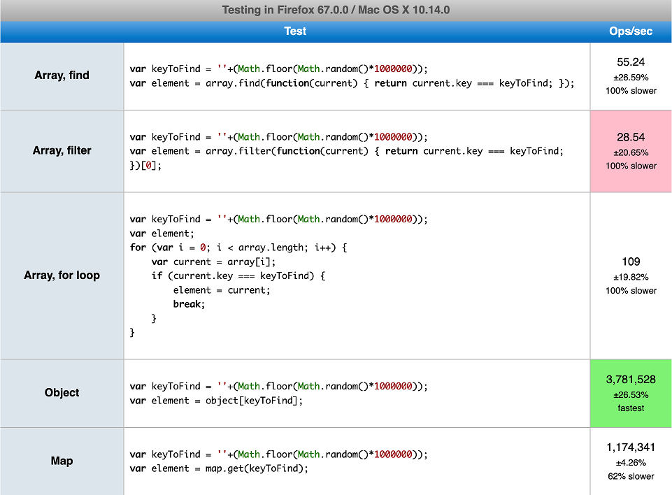
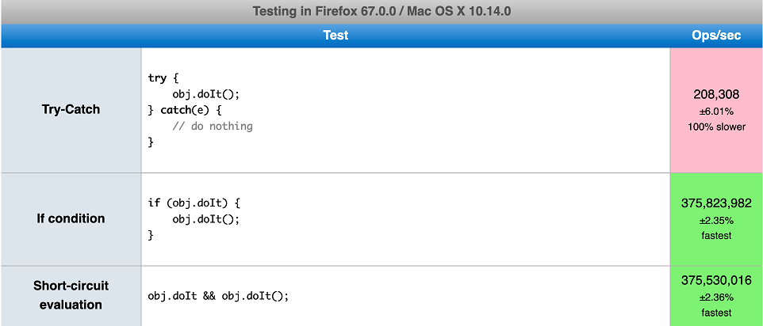
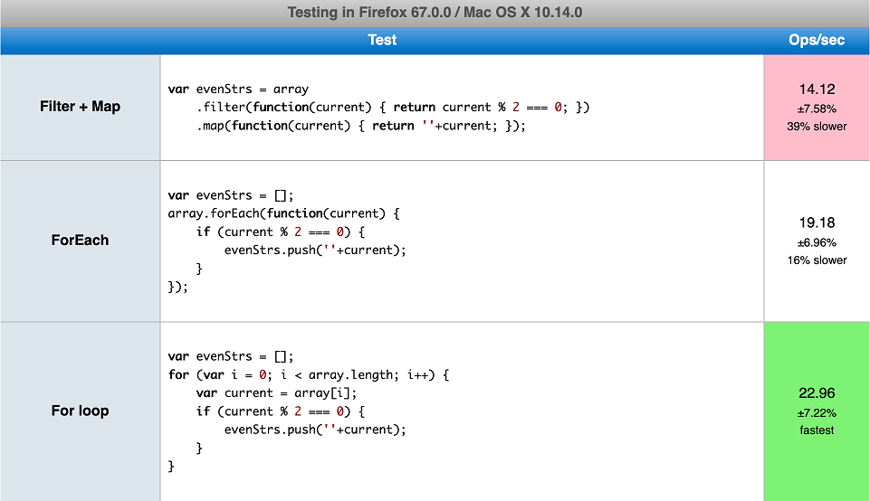
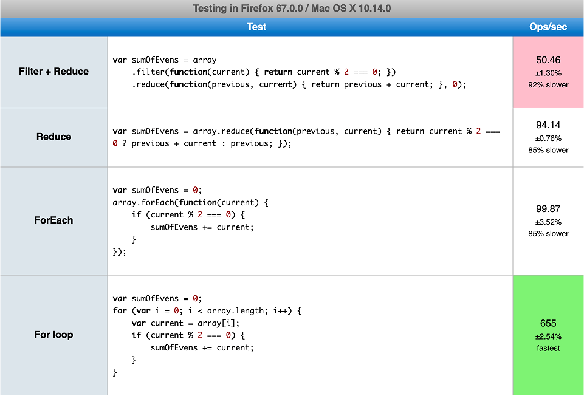
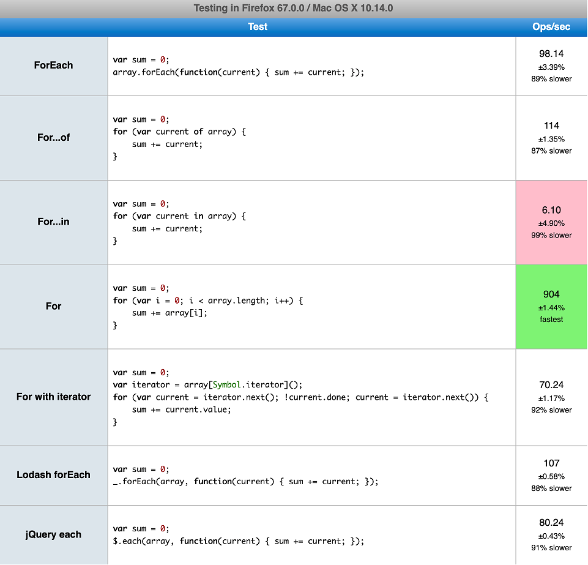
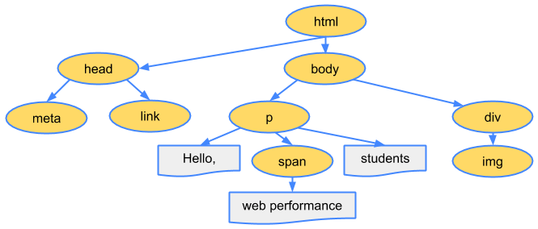
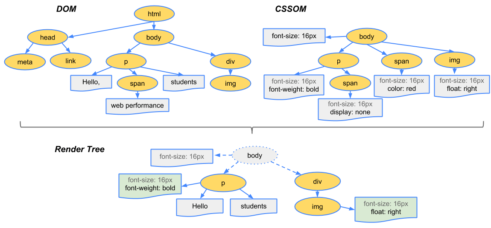
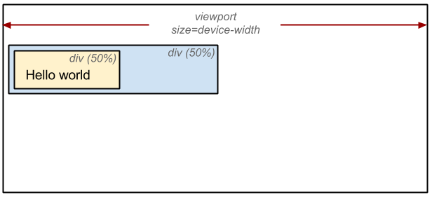

<h1 style="font-weight:bold">JavaScript Memory Leaks</h1>

## Accidental Global Variables

- Global variables cannot have their memory released (when they are not set to null or reassigned).

```javascript
// 브라우저의 경우 글로벌 객체는 window다.
function foo(arg) {
  bar = 'this is a hidden global variable';
}

function foo() {
  this.variable = 'potential accidental global';
}

// Foo가 호출되면, this는 글로벌 객체인 윈도우를 가리키게 된다.
foo();

// use strict 엄격한 모드로 선언해서 실수를 방지한다.
```

## Forgotten Timers or Callbacks

```javascript
var someResource = getData();
setInterval(function() {
    var node = document.getElementById('Node');
    if(node) {
        // Do stuff with node and someResource.
        node.innerHTML = JSON.stringify(someResource));
    }
}, 1000);


// 이 element는 onClick에서 참조됨
// 과거 특정 브라우저 (IE6)가 순환 참조를 잘 관리하지 못했기 때문에 이 부분은 특히 중요
var element = document.getElementById('button');

function onClick(event) {
    element.innerHtml = 'text';
}

element.addEventListener('click', onClick);

// 객체를 없애기전에 이러한 observer를 명시적으로 제거하는 것은 좋은 관례
element.removeEventListener('click', onClick);
element.parentNode.removeChild(element);
```

## References Outside the DOM

```javascript
//
var elements = {
  button: document.getElementById('button'),
  image: document.getElementById('image'),
  text: document.getElementById('text'),
};

function doStuff() {
  image.src = 'http://some.url/image';
  button.click();
  console.log(text.innerHTML);
}

function removeButton() {
  document.body.removeChild(document.getElementById('button'));

  // 이 시점에서도 여전히 elements에서 button의 참조를 가지고 있다.
  // 이 경우 button element는 여전히 메모리에 있으며, GC에 의해 해제 될 수 없다.
}
```

<h1 style="font-weight:bold">Front-End Performance Optimization</h1>

<h2 style="color:#ff6b6b">Rendering Optimization - Reducing Reflow and Repaint</h2>
So far we have looked at how a web page is rendered. So how can we optimize web performance? To understand this, we first need to cover Reflow and Repaint.

<h2 style="color:#ff6b6b">Reflow (Layout)</h2>
Just because the page is finally drawn after going through the rendering process described above does not mean that the rendering process is entirely finished. When some action or event modifies layout values such as the size or position of an HTML element, the Layout process is performed again, including the affected child nodes and parent nodes. When this happens, the Render Tree and the size and position of each element are recalculated. This process is called Reflow.

```javascript
// reflow 발생 예제
function reflow() {
  document.getElementById('content').style.width = '600px';
}
```

<h3 style="color:#ff6b6b">Typical cases where Reflow occurs are as follows.</h3>
- On the initial page rendering (the first Layout process)
- On window resizing (when the Viewport size changes)
- Adding or removing a node
- Changing an element's position or size (left, top, margin, padding, border, width, height, etc.)
- Font changes (text content) and image size changes (when switching to an image of a different size)

<h2 style="color:#ff6b6b">Repaint (Paint)</h2>

Performing only Reflow does not reflect the changes on the actual screen. Just like the rendering process described above, a process to draw the Render Tree back onto the screen is required. Ultimately, the Paint step is performed again, and this is called Repaint.

However, Repaint does not always require Reflow to occur first. When style properties that do not affect the layout, such as background-color or visibility, are changed, there is no need to perform Reflow, so only Repaint is performed.

<h2 style="color:#ff6b6b">Reducing Reflow and Repaint</h2>

The performance optimization covered in this post is simply about introducing ways to reduce Reflow and Repaint operations. The content below only covers what has been researched so far. In addition, since this is theoretical content and excerpted material rather than something actually tested, it needs verification. The content below will be continuously updated.

<h2 style="color:#ff6b6b">Use display: none instead of visibility: invisible for unused nodes</h2>
Since visibility: invisible still occupies layout space, it becomes a target for reflow. However, display: none does not occupy Layout space, so it is completely excluded from the Render Tree.

<h2 style="color:#ff6b6b">Avoid using properties that trigger Reflow and Repaint</h2>
Below are the CSS properties that trigger Reflow and Repaint respectively. Since Repaint inevitably occurs when Reflow occurs, it is better to use properties that only trigger Repaint rather than properties that trigger Reflow whenever possible.

<h3 style="color:#ff6b6b">Typical properties that trigger Reflow</h3>
<table>
    <tbody>
        <tr>
            <td style="border: 1px solid #444444; padding: 2px;">position</td>
            <td style="border: 1px solid #444444; padding: 2px;">width</td>
            <td style="border: 1px solid #444444; padding: 2px;">height</td>
            <td style="border: 1px solid #444444; padding: 2px;">left</td>
            <td style="border: 1px solid #444444; padding: 2px;">top</td>
        </tr>
        <tr>
            <td style="border: 1px solid #444444; padding: 2px;">right</td>
            <td style="border: 1px solid #444444; padding: 2px;">bottom</td>
            <td style="border: 1px solid #444444; padding: 2px;">margin</td>
            <td style="border: 1px solid #444444; padding: 2px;">padding</td>
            <td style="border: 1px solid #444444; padding: 2px;">border</td>
        </tr>
        <tr>
            <td style="border: 1px solid #444444; padding: 2px;">border-width</td>
            <td style="border: 1px solid #444444; padding: 2px;">clear</td>
            <td style="border: 1px solid #444444; padding: 2px;">display</td>
            <td style="border: 1px solid #444444; padding: 2px;">float</td>
            <td style="border: 1px solid #444444; padding: 2px;">font-family</td>
        </tr>
        <tr>
            <td style="border: 1px solid #444444; padding: 2px;">font-size</td>
            <td style="border: 1px solid #444444; padding: 2px;">font-weight</td>
            <td style="border: 1px solid #444444; padding: 2px;">line-height</td>
            <td style="border: 1px solid #444444; padding: 2px;">min-height</td>
            <td style="border: 1px solid #444444; padding: 2px;">overflow</td>
        </tr>
        <tr>
            <td style="border: 1px solid #444444; padding: 2px;">text-align</td>
            <td style="border: 1px solid #444444; padding: 2px;">vertical-align</td>
            <td style="border: 1px solid #444444; padding: 2px;">white-space</td>
            <td style="border: 1px solid #444444; padding: 2px;">...</td>
        </tr>
    </tbody>
</table>

<h3 style="color:#ff6b6b">Typical properties that trigger Repaint</h3>
<table>
    <tbody>
        <tr>
            <td style="border: 1px solid #444444; padding: 2px;">background</td>
            <td style="border: 1px solid #444444; padding: 2px;">background-image</td>
            <td style="border: 1px solid #444444; padding: 2px;">background-position</td>
            <td style="border: 1px solid #444444; padding: 2px;">background-repeat</td>
            <td style="border: 1px solid #444444; padding: 2px;">background-size</td>
        </tr>
        <tr>
            <td style="border: 1px solid #444444; padding: 2px;">border-radius</td>
            <td style="border: 1px solid #444444; padding: 2px;">border-style</td>
            <td style="border: 1px solid #444444; padding: 2px;">box-shadow</td>
            <td style="border: 1px solid #444444; padding: 2px;">color</td>
            <td style="border: 1px solid #444444; padding: 2px;">line-style</td>
        </tr>
        <tr>
            <td style="border: 1px solid #444444; padding: 2px;">outline</td>
            <td style="border: 1px solid #444444; padding: 2px;">outline-color</td>
            <td style="border: 1px solid #444444; padding: 2px;">outline-style</td>
            <td style="border: 1px solid #444444; padding: 2px;">outline-width</td>
            <td style="border: 1px solid #444444; padding: 2px;">text-decoration</td>
        </tr>
        <tr>
            <td style="border: 1px solid #444444; padding: 2px;">visibility</td>
            <td style="border: 1px solid #444444; padding: 2px;">....</td>
        </tr>
    </tbody>
</table>

- <a href="https://csstriggers.com/" target="_blank" style="font-size=30px; color: #4dabf7; text-decoration:underline;">CSS Trigger</a>
- <a href="https://docs.google.com/spreadsheets/u/0/d/1Hvi0nu2wG3oQ51XRHtMv-A_ZlidnwUYwgQsPQUg1R2s/pub?single=true&gid=0&output=html"  target="_blank" style="font-size=30px; color: #4dabf7; text-decoration:underline;">Reflow & Repaint</a>

There are also properties such as transform and opacity that trigger neither Reflow nor Repaint. Therefore, using transform instead of left, right, width, height, and using opacity instead of visibility/display, helps improve performance.

<h2 style="color:#ff6b6b">Reducing the number of affected nodes</h2>
For elements that have a lot of animation or frequent layout changes by combining JavaScript and CSS, you can reduce the number of affected surrounding nodes by using position: absolute or fixed. When there are no affected nodes at all, as with fixed, the Reflow process is not needed at all, so only the Repaint operation cost is incurred.

Another approach is to change the element to absolute or fixed when the animation starts and restore it to its original state when the animation ends, which also helps reduce Reflow and Repaint operations.

<h2 style="color:#ff6b6b">Reducing frames</h2>
Simply put, an element that moves 3px every 0.1 seconds reduces the Reflow and Repaint operation cost by a factor of three compared to an element that moves 1px every 0.1 seconds. Therefore, you can improve performance by slightly reducing the smoothness of the effect.

# Ways to avoid or minimize reflow

- When you want a style change based on a class change, add it to a node located as far down in the DOM structure as possible.

- Add the class to the node at the very bottom of the DOM tree
- For elements with animation, specify position: fixed or position: absolute whenever possible
  - Animations that implement positional movement (changing width or height values, etc.) cause reflow to occur repeatedly within a short period of time. So it is best not to use them, but if you must, apply the position: absolute or position: fixed property to the animated element. Since it does not affect other elements, reflow occurs only for that element rather than the entire page.
- When you need to make style changes through JS, handle them all at once whenever possible

```javascript
// style을 여러번 호출(7.7ms), 클래스를 통하여 스타일 변화(5.3ms)
var div = document.getElementsByTagName('div');
for (var i = 0; i < div.length; i++) {
  div[i].style.height = '80px';
  div[i].style.backgroundColor = '#00f';
  div[i].style.display = 'inline-block';
  div[i].style.overflow = 'hidden';
  div[i].style.fontSize = '40px';
  div[i].style.color = '#fff';
}

var div = document.getElementsByTagName('div');
for (var i = 0; i < div.length; i++) {
  div[i].className = 'block';
}
```

- Avoid inline styles as much as possible
  - Inline Style: a short, single-line style specified and used directly inside a tag. Used mixed with HTML

```javascript
<p style="color:#ff0a00">이 문장은 인라인 스타일이 적용되었습니다.</p>
```

- You should avoid table layouts.
  - When you use a table layout, the width is calculated according to the table values, so rendering becomes slower. Therefore, it is better not to use table layouts except when absolutely necessary. If you do use one, using the CSS property table-layout: fixed can make rendering a bit faster.

```text
10×10 테이블
table-layout: fixed 미 적용
table-layout: fixed 적용
table-layout: fixed 미 적용(0.6ms) < table-layout: fixed 적용(0.4ms)

100×100 테이블
table-layout: fixed 미 적용
table-layout: fixed 적용
table-layout:fixed 미 적용(35.4ms) < table-layout:fixed 적용(27.1ms)
```

- It is good to trim CSS descendant selectors down to only what is necessary.
  - This is relevant not so much to reflow itself, but to the CSS Recalculation that reflow triggers. CSS rules are evaluated from right to left. This process continues until there are no more matching rules or a non-matching rule is found. Therefore, using unnecessary selectors can degrade performance.

```html
<div class="reflow_box">
  <ul class="reflow_list">
    <li>
      <button type="button" class="btn">버튼</button>
    </li>

    <li></li>
    <li>
      <button type="button" class="btn">버튼</button>
    </li>

    <li></li>
  </ul>
</div>

/_ 잘못된 예 _/ .reflow_box .reflow_list li .btn{ display:block; } /_ 올바른 예
_/ .reflow_list .btn { display:block; }
```

- In the case of IE, avoid JS expressions in CSS.
  - The reason CSS expressions are so costly is that the expression is recalculated every time the entire document or part of the document is Reflowed.
  - This ultimately means that when a reflow occurs due to a change such as an animation, the expression may be recalculated thousands or tens of thousands of times per second depending on the case.

```css
.expression {
  width: expression(
    document.documentElement.clientWidth > 0 ? '1000px': 'auto'
  );
}
```

- Minimizing Reflow using caching

```javascript
.expression { width: expression(document.documentElement.clientWidth > 0 ? '1000px' : 'auto'); }
function collect() {
    var elem = document.getElementById('container');
    var cw = elem.style.width;

    return parseInt(cw, 10) * parseInt(cw + document.documentElement.clientWidth, 10);
    return false;
}
```

- Minimizing DOM usage
  - When adding nodes using a document fragment (document.createDocumentFragment), a node clone (elem.cloneNode), or a character array ([]), you can reduce cost by minimizing DOM access, as shown in the code below.

1. The basic way to add an element.

```javascript
function notReflow() {
  var elem = document.getElementById('container');

  for (var i = 0; i < 10; i++) {
    var a = document.createElement('a');
    a.href = '#';
    a.appendChild(document.createTextNode('test' + i));
    elem.appendChild(a);
  }

  return false;
}
```

2. Adding elements using a document fragment

```javascript
function notReflow() {
  var frag = document.createDocumentFragment();

  for (var i = 0; i < 10; i++) {
    var a = document.createElement('a');
    a.href = '#';
    a.appendChild(document.createTextNode('test' + i));
    frag.appendChild(a);
  }

  document.getElementById('container').appendChild(frag);

  return false;
}
```

3. Adding elements using a node clone

```javascript
function notReflow() {
  var elem = document.getElementById('container');
  var clone = elem.cloneNode(true);

  for (var i = 0; i < 10; i++) {
    var a = document.createElement('a');
    a.href = '#';
    a.appendChild(document.createTextNode('test' + i));
    clone.appendChild(a);
  }

  elem.appendChild(clone);

  return false;
}
```

4. Adding elements using a character array

```javascript
function notReflow() {
  var h = [];
  for (var i = 0; i < 10; i++) {
    h.push('test' + i + '');
  }
  document.getElementById('container').innerHTML = h;
  return false;
}
```

Test results by situation:

First situation: 153ms
Second situation: 136ms
Third situation: 129ms
Fourth situation: 127ms

- Except for the first situation, the remaining situations did not show a large difference in performance, but the character array approach using innerHTML, an element property, produced a somewhat faster result than the methods using object members (fragment, clone).

<h1 style="font-weight:bold">References</h1>

- <a href="https://mohwaproject.tistory.com/entry/ReflowLayout-%EA%B3%BC-Repaint-%EA%B3%BC%EC%A0%95-%EB%B0%8F-%EC%B5%9C%EC%A0%81%ED%99%94" target="_blank" style="font-size=30px; color: #4dabf7; text-decoration:underline;">https://mohwaproject.tistory.com/entry/ReflowLayout-%EA%B3%BC-Repaint-%EA%B3%BC%EC%A0%95-%EB%B0%8F-%EC%B5%9C%EC%A0%81%ED%99%94</a>
- <a href="https://wit.nts-corp.com/2017/06/05/4571" target="_blank" style="font-size=30px; color: #4dabf7; text-decoration:underline;">https://wit.nts-corp.com/2017/06/05/4571</a>
- <a href="https://mohwaproject.tistory.com/entry/DOM-%EC%82%AC%EC%9A%A9-%EC%B5%9C%EC%86%8C%ED%99%94-%ED%95%98%EA%B8%B0" target="_blank" style="font-size=30px; color: #4dabf7; text-decoration:underline;">https://mohwaproject.tistory.com/entry/DOM-%EC%82%AC%EC%9A%A9-%EC%B5%9C%EC%86%8C%ED%99%94-%ED%95%98%EA%B8%B0</a>

<h1 style="font-weight:bold">Coding techniques that improve front-end performance</h1>

- Use an object/Map instead of an array
  - <a href="https://jsperf.com/finding-element-object-vs-map-vs-array/1" target="_blank" style="font-size=30px; color: #4dabf7; text-decoration:underline;">Reference site</a>



- Use an IF statement instead of handling exceptions first
  - <a href="https://jsperf.com/try-catch-vs-conditions/1" target="_blank" style="font-size=30px; color: #4dabf7; text-decoration:underline;">Reference site</a>



- Use as few loops as possible
  - <a href="https://jsperf.com/array-function-chains-vs-single-loop-filter-map/1" target="_blank" style="font-size=30px; color: #4dabf7; text-decoration:underline;">Reference site</a>



- Use a basic loop
  - <a href="https://jsperf.com/for-loops-in-few-different-ways/" target="_blank" style="font-size=30px; color: #4dabf7; text-decoration:underline;">Reference site</a>



- Use built-in DOM methods
  - <a href="https://jsperf.com/native-dom-functions-vs-jquery/1" target="_blank" style="font-size=30px; color: #4dabf7; text-decoration:underline;">Reference site</a>



<h1 style="font-weight:bold">References</h1>

- <a href="https://gloriajun.github.io/frontend/2018/10/23/frontend-reflow-repaint.html" target="_blank" style="font-size=30px; color: #4dabf7; text-decoration:underline;">https://gloriajun.github.io/frontend/2018/10/23/frontend-reflow-repaint.html</a>
- <a href="https://junwoo45.github.io/2019-10-05-frontend-performance/" target="_blank" style="font-size=30px; color: #4dabf7; text-decoration:underline;">https://junwoo45.github.io/2019-10-05-frontend-performance/</a>
- <a href="https://www.slideshare.net/NHNFORWARD/2018-130108045" target="_blank" style="font-size=30px; color: #4dabf7; text-decoration:underline;">https://www.slideshare.net/NHNFORWARD/2018-130108045</a>
- <a href="https://ideveloper2.dev/blog/2019-05-18--front-end-%EC%84%B1%EB%8A%A5%EC%B5%9C%EC%A0%81%ED%99%94-%EA%B8%B0%EB%B3%B8/" target="_blank" style="font-size=30px; color: #4dabf7; text-decoration:underline;">https://ideveloper2.dev/blog/2019-05-18--front-end-%EC%84%B1%EB%8A%A5%EC%B5%9C%EC%A0%81%ED%99%94-%EA%B8%B0%EB%B3%B8/</a>
- <a href="https://ui.toast.com/fe-guide/ko_PERFORMANCE/#%EB%A0%88%EC%9D%B4%EC%95%84%EC%9B%83%EA%B3%BC-%EB%A6%AC%ED%8E%98%EC%9D%B8%ED%8A%B8" target="_blank" style="font-size=30px; color: #4dabf7; text-decoration:underline;">https://ui.toast.com/fe-guide/ko_PERFORMANCE/#%EB%A0%88%EC%9D%B4%EC%95%84%EC%9B%83%EA%B3%BC-%EB%A6%AC%ED%8E%98%EC%9D%B8%ED%8A%B8</a>
- <a href="https://boxfoxs.tistory.com/408" target="_blank" style="font-size=30px; color: #4dabf7; text-decoration:underline;">https://boxfoxs.tistory.com/408</a>
- <a href="http://bit.ly/2SQXLzY" target="_blank" style="font-size=30px; color: #4dabf7; text-decoration:underline;">http://bit.ly/2SQXLzY</a>
- <a href="https://github.com/wonism/TIL/blob/master/front-end/browser/reflow-repaint.md" target="_blank" style="font-size=30px; color: #4dabf7; text-decoration:underline;">https://github.com/wonism/TIL/blob/master/front-end/browser/reflow-repaint.md</a>
- <a href="https://gist.github.com/faressoft/36cdd64faae21ed22948b458e6bf04d5" target="_blank" style="font-size=30px; color: #4dabf7; text-decoration:underline;">https://gist.github.com/faressoft/36cdd64faae21ed22948b458e6bf04d5</a>

<h1 style="font-weight:bold">Improving Canvas Performance</h1>

<h2 style="color:#ff6b6b">Pre-render with an offscreen canvas</h2>
Anyone who has done image processing programming already knows this, but instead of rendering to the canvas immediately, render using RequestAnimationFrame, following a principle similar to an image buffer or double buffering.

<h2 style="color:#ff6b6b">Batch drawing operations into a single call</h2>
For example, when drawing lines such as a rectangle on the canvas, rather than calling beginPath() and stroke() for each line, call beginPath() once, finish all the drawing operations using moveTo and lineTo, and then call stroke(). This will make immediate sense when you look at the sample code.

<h2 style="color:#ff6b6b">Avoid unnecessary canvas state changes</h2>
This is similar to the point above about avoiding unnecessary operations.

<h2 style="color:#ff6b6b">Render only the changed part of the canvas state</h2>
This means finding the bounding box of the part of the image that changed and rendering only that part.

<h2 style="color:#ff6b6b">Compose the canvas in layers for complex scenes</h2>
This is similar to the offscreen canvas point mentioned at the beginning. Additionally, even if you compose canvases by stacking them and render them, the GPU renders them all at once through alpha compositing, so it is beneficial.

<h2 style="color:#ff6b6b">Avoid shadow blur effects</h2>
Obviously, this means turning off blur or shadow effects. By the way, I didn't know the canvas supported this out of the box.

<h2 style="color:#ff6b6b">Learn the various ways to clear the canvas</h2>
HTML5's canvas uses what is called Immediate mode, outputting directly to the display without image buffering. When you make something like an animation, you need to clear the previous frame in order to draw the next one. In this case, instead of clearing the entire canvas, track the bounding box of the part of the image that changed, as mentioned above, and use something like clearRect.

<h2 style="color:#ff6b6b">Avoid floating-point coordinates</h2>
When you place an image, if the coordinates are floating-point, anti-aliasing is applied automatically. Since we said to avoid blur effects above, it is best for coordinates to always land on integers.

<h2 style="color:#ff6b6b">Optimize using RequestAnimationFrame</h2>
If you have done Windows programming, you may have noticed that you can think of it as the UIThread. Unfortunately, however, not all browsers support it.

<h2 style="color:#ff6b6b">Creating the DOM (Document Object Model) and CSSOM (CSS Object Model)</h2>
The very first step is downloading the HTML and CSS received from the server. And since HTML and CSS files are just plain text, they are turned into an Object Model for easier computation and management. The HTML and CSS files are turned into the DOM Tree and CSSOM respectively.

- <a href="https://kuimoani.tistory.com/entry/HTML5-Canvas-%EC%84%B1%EB%8A%A5-%ED%96%A5%EC%83%81" target="_blank" style="font-size=30px; color: #4dabf7; text-decoration:underline;">https://kuimoani.tistory.com/entry/HTML5-Canvas-%EC%84%B1%EB%8A%A5-%ED%96%A5%EC%83%81</a>

<h1 style="font-weight:bold">The Rendering Process</h1>

<h2 style="color:#ff6b6b">Creating the DOM (Document Object Model) and CSSOM (CSS Object Model)</h2>
The very first step is downloading the HTML and CSS received from the server. And since HTML and CSS files are just plain text, they are turned into an Object Model for easier computation and management. The HTML and CSS files are turned into the DOM Tree and CSSOM respectively.



- <a href="http://bit.ly/3137pmh" target="_blank" style="font-size=30px; color: #4dabf7; text-decoration:underline;">A visualization of the DOM (left) and CSSOM (right) (source: http://bit.ly/3137pmh)</a>

You can find the detailed process of how each document (HTML, CSS) is parsed and how the DOM Tree is formed in Google's developer documentation.

To add a bit more TMI here, the rendering engine is built to display content as quickly as possible for a better user experience. Therefore, even before all HTML parsing is finished, it performs the subsequent steps to output some content that can be shown to the user in advance.

<h2 style="color:#ff6b6b">Creating the Render Tree</h2>
Once the DOM Tree and CSSOM Tree are built, the Render Tree is then created using the two. Unlike the DOM Tree, which contains only the structure and text of pure elements, the Render Tree has style information set on it and consists only of the nodes that are actually rendered on the screen.



- <a href="http://bit.ly/2Okn0fG" target="_blank" style="font-size=30px; color: #4dabf7; text-decoration:underline;">Render Tree diagram (source: http://bit.ly/2Okn0fG)</a>

So while you can understand that style information is set on each element here, you might question the statement that it consists only of the nodes actually rendered on the screen, thinking "Aren't all elements rendered on the screen?"

To get to the point: yes, they are not. As a simple example, a node with the display: none property set does not occupy any space on the screen, so it is excluded from the process of building the Render Tree. To give a bit more of a tip here, visibility: invisible behaves similarly to display: none, but since it occupies space and only makes the element invisible, it is included in the Render Tree.

<h2 style="color:#ff6b6b">Layout</h2>
The Layout step calculates the exact position and size of each node within the browser's Viewport. To put it plainly, it is the step that calculates at what position and what size each node of the generated Render Tree will be output on the browser screen, according to the styles and properties it holds. Through the Layout step, relative position and size properties such as %, vh, and vw are converted into pixel units that are actually drawn on the screen.



- <a href="http://bit.ly/3137pmh" target="_blank" style="font-size=30px; color: #4dabf7; text-decoration:underline;">Computation of elements relative to the Viewport (source: http://bit.ly/3137pmh)</a>

Here, the Viewport refers to the area and size of the browser in which graphics are displayed. The viewport varies depending on the display size for mobile and the browser window size for PC. And since the size and position of each element drawn on the screen are often computed relatively using %, vh, vw, etc., the calculation must be redone every time the viewport size changes.

<h2 style="color:#ff6b6b">Paint</h2>
Once the Layout calculation is complete, the elements are now drawn on the actual screen. Using the Render Tree, for which the position, size, and style calculations of the elements were already completed in the previous step, the actual pixel values are filled in. At this time, text, color, images, shadow effects, and so on are all processed and drawn.

At this point, the more complex the styles that need to be processed, the more time the Paint step takes. As a simple example, a plain solid background-color paints quickly, whereas gradients and shadow effects take comparatively longer to paint.
