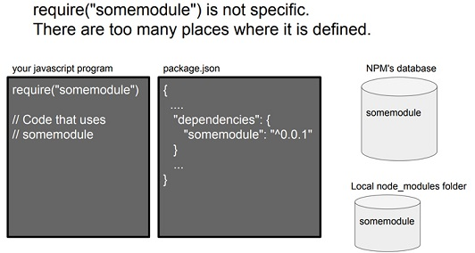

# deno

Ryan Dahl, the creator of node.js, introduced his new project, "Deno," at the JS Fest 2019 Spring conference. In this talk titled "A New Way to JavaScript," Ryan explains how Deno differs from node.js and what makes it new. For those interested in this ambitious project, I have summarized and organized the highlights below.


<p>At JSConf EU 2018, he gave a talk titled "10 Things I Regret About Node.js" and introduced Deno, a new server-side language.</p>

## The Technologies Behind Deno

- V8 JavaScript Runtime
- Rust (replacing C++)
- Tokio (used as the event loop)
- TypeScript

## Node vs Deno Differnce

```javascript
// node.js
var http = require('http');
http
  .createServer(function (req, res) {
    res.write('Hello World\n');
    res.end();
  })
  .listen(8000, function () {
    console.log('http://localhost:8000/');
  });
```

```javascript
// deno.js
import { http } from 'https://deno.land/std@v0.12/http/server.ts';
const body = new TextEncoder().encode('Hello World\n');
const s = http(':8000');
window.onload = async () => {
  console.log('http://localhost:8000/');
  for await (const req of s) {
    req.respond({ body });
  }
};
```

### module URL reference:

- Instead of a centralized package manager like npm, modules are loaded in a distributed manner. In node, external packages were fetched from the central npm server and installed under node_modules/ for use. In deno, by contrast, as shown in the code above, you specify the code location as a URL, and the module is automatically downloaded and installed at runtime. It also uses only ES modules as its module system.

### callback function vs. Promise (async, await):

- In the early days of node.js, callback functions were used, but as everyone knows, callback hell was notoriously bad. When Promises were introduced to JavaScript, node.js was able to use async and await instead of callback functions. Deno leverages Promises from the very beginning.

### browser compatibility (window):

- Code that ran on the server side can be run in the browser without any additional modifications.

## 10 Things I Regret About Node.js

- Not sticking with Promises
  Most people working with Node.js will relate to this 100%. Node.js's asynchronous calls are still based on the callback API. Promises were essential for providing Async and Await. Ryan Dahl mentioned that he added Promises in 2009 but removed them in 2010, and he regretted that if he had stuck with Promises, the community's codebase would have progressed to Async Await much faster.

- Security
  He noted that V8 itself has an excellent sandbox model, but he expressed regret that if he had considered how Node applications would be maintained and evolve, Node could have had a level of security that other languages lack. (V8 is Node.js's JavaScript engine, built by Google and also used in Chrome.)

- Build System (GYP) 1
  When he first built Node, the Chrome browser used a meta build system called GYP and later upgraded to GN, whereas Node.js did not switch to GN, which he regretted. For reference, Google's GN reportedly builds about 20 times faster than GYP. (A GYP meta build system is a build system used to build source code across multiple platforms such as Windows, Mac, and Linux.)

- Build System (GYP) 2
  While building the build system with GYP, he required users to do C++ bindings to make native calls, but he lamented that he should have provided an FFI (Foreign Function Interface).

- Package Manager File (package.json) 1
  Node.js has a module system. Recently, specifications for implementing this module system natively within the language have been announced for go and java. (go implemented it from the start.) It is common to separate the program that manages this module system into a 3rd party project. However, Node made the community dependent on npm because the package.json file, managed by the npm package manager, is looked up in the main() function. Recently, a package manager called yarn, created by Facebook, has been replacing npm, but it still uses package.json as is. Although not intended, package.json has effectively become the de facto standard.
  Additionally, this package.json file has the drawback of not being explicit when resolving modules. Please refer to the figure below for easier understanding.


[Figure 3] Find somemodule! (Source: <a href="http://tinyclouds.org/jsconf2018.pdf" target="_blank" style="font-size=30px; color: #4dabf7; text-decoration:underline;">http://tinyclouds.org/jsconf2018.pdf</a>)

- Package Manager File (package.json) 2
  Because the package.json module system was designed to be based on the file directory, it became too heavy by including information unnecessary for the module system itself, such as license, repository, and description.

- Module System (node_modules)
  Just like the weakness of the file directory-based module system mentioned above, the algorithm for importing modules became complex. It also didn't align with how the browser imports modules, making things extremely difficult. Despite this, he apologized to the community for the fact that it can no longer be undone.

- Allowing the js extension to be omitted when using Require syntax
  He mentioned that because this differs from the standard of how JavaScript works in the browser, the module loader has to put a lot of thought into figuring out the user's intent.

- index.js
  Because the browser has index.html as its default, specifying index.js seemed like a good idea at the time, but in the end it made the module loading system more complex.

- deno
  After finishing the 10 stories above, Ryan Dahl unveiled a new project he was building, which is the "deno" project. (Project link: <a href="https://github.com/ry/deno" target="_blank" style="font-size=30px; color: #4dabf7; text-decoration:underline;">https://github.com/ry/deno</a>)

- Youtube : <a href="https://www.youtube.com/watch?v=z6JRlx5NC9E&t=419s" target="_blank" style="font-size=30px; color: #4dabf7; text-decoration:underline;">https://bit.ly/2U0lQmZ</a>
- Presentation : <a href="https://bit.ly/2U0lQmZ" target="_blank" style="font-size=30px; color: #4dabf7; text-decoration:underline;">https://gocoder.tistory.com/1578</a>
- Facebook : <a href="https://www.facebook.com/JSFestua/" target="_blank" style="font-size=30px; color: #4dabf7; text-decoration:underline;">https://www.facebook.com/JSFestua/</a>

## References

- <a href="https://www.devpools.kr/2018/06/21/deno/" target="_blank" style="font-size=30px; color: #4dabf7; text-decoration:underline;">https://www.devpools.kr/2018/06/21/deno/</a>
- <a href="https://gocoder.tistory.com/1578" target="_blank" style="font-size=30px; color: #4dabf7; text-decoration:underline;">https://gocoder.tistory.com/1578</a>
- <a href="https://blog.ull.im/engineering/2019/04/14/deno-ryan-dahl-2019-04-04.html" target="_blank" style="font-size=30px; color: #4dabf7; text-decoration:underline;">https://blog.ull.im/engineering/2019/04/14/deno-ryan-dahl-2019-04-04.html</a>
