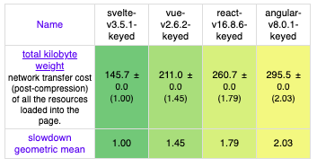

# SVELTE

Svelte is a frontend framework created by Rich Harris that takes a fresh approach.
Svelte introduces itself as a "framework without a framework" or a "compiler."
This means there is no Virtual DOM, and there is no framework to load at Runtime.
Because it is fundamentally a tool that compiles components at build time, you can render an app by loading a single bundle (bundle.js) on the page.

## SVELTE Features

### Svelte is fast

Svelte updates only the parts of the DOM that change, so its execution speed is extremely fast. Unlike frameworks such as React and Vue.js that rely on a virtual DOM, Svelte does not use a virtual DOM.

Virtual DOM frameworks spend time drawing components in an invisible tree before committing changes to the actual DOM, whereas Svelte skips this intermediate step and applies changes directly. DOM updates can be slow, but because Svelte knows exactly which element has changed, it can handle them quickly.

In addition, Svelte can make development itself very fast. In general, when building components with the same functionality, a Svelte component can be created with less code than in React.

```html
<script>
  export let name;
  let count = 1;
  $: double = count * 2;
</script>

<main>
  <h1 id="root">Hello {name}!</h1>
  <h1>count : {double}</h1>
  <button on:click="{()" ="">count += 1}>increase</button>
</main>
```

### Web framework speed comparison



## Svelte is small.

## Svelte is compiled.

The reason the bundle size can be this small is that Svelte is both a framework and a compiler.

You are probably familiar with running yarn build to compile a React Project. It invokes Webpack and Babel to bundle the project files, minifies them, adds the react and react-dom libraries to the bundle, minifies that as well, and produces a single output file (or a few files split into several chunks).

Svelte, on the other hand, can compile components on its own. The result is not (app) + (Svelte runtime environment), but (an app that Svelte has taught how to run on its own). Svelte leverages the tree-shaking benefits of Rollup (or Webpack) to build itself, including only the parts of the framework that my code actually uses.

The compiled app still contains a small amount of Svelte code in order to drive the components you wrote. That code does not magically disappear entirely. But this is the opposite of how other frameworks operate. Most frameworks must actually exist in order to run and display the app.

## Installing Svelte

```bash
$ npx degit sveltejs/template svelte
$ cd svelte
$ npm install
$ npm run dev
```

## Example code

<a href="https://github.com/gmm117/svelte" target="_blank" style="font-size=30px; color: #4dabf7; text-decoration:underline;">https://github.com/gmm117/svelte</a>

## References

- [https://heropy.blog/2019/09/29/svelte/](https://heropy.blog/2019/09/29/svelte/)
- [https://ui.toast.com/weekly-pick/ko_20191002/](https://ui.toast.com/weekly-pick/ko_20191002/)
