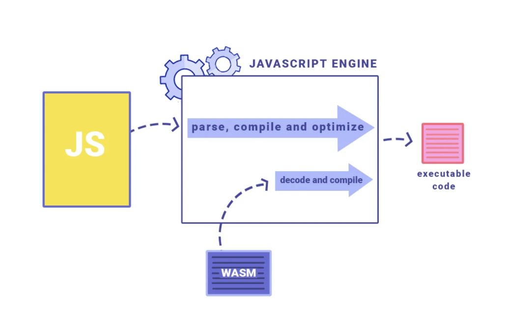
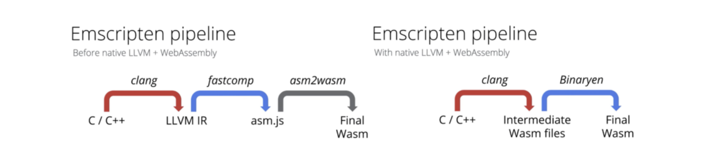
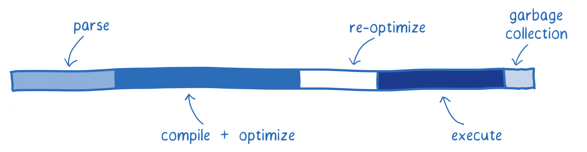
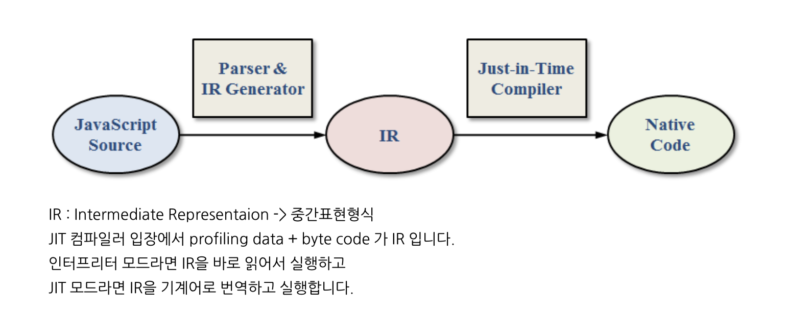

## Why WebAssembly Emerged

Various attempts to bring native machine code to the web and to execute it quickly—such as Google's [NaCI](https://developer.chrome.com/native-client)(Native Client) and Mozilla's [asm.js](http://asmjs.org/)(a subset of JavaScript)—eventually converged into WebAssembly (hereafter referred to as 'wasm'), which is where its development began.

In December 2019, the W3C officially recommended wasm—currently at [version 1.1](https://webassembly.github.io/spec/core/)—as the fourth language of the web, following HTML, CSS, and JavaScript.

## How WebAssembly Runs

The execution process of JavaScript code and wasm within a JavaScript engine

- The compiled binary-format wasm module does not replace JavaScript or run inside JavaScript; instead, it runs side by side with JavaScript within the JavaScript engine.



Emscripten takes C/C++ code, passes it through LLVM, and converts the LLVM-generated bytecode into JavaScript (specifically Asm.js, a subset of JavaScript).

WASM generation process

- C, C++ → [Clang tool (LLVM) → LLVM bytecode generation → Asm.js conversion]: Emscripten


The evolution of Emscripten

1. wasm compilation was handled on the backend by [fastcomp](https://github.com/emscripten-core/emscripten-fastcomp/)(LLVM plus Emscripten's asm.js backend)
2. C/C++ is compiled into an intermediate representation (IR)
3. It is then compiled into asm.js via fastcomp
4. A compilation pipeline that leads to wasm using [asm2wasm](https://github.com/WebAssembly/binaryen/blob/master/src/asm2wasm.h)



The V8 team announced that they achieved performance improvements across many areas by making the native LLVM wasm backend the default pipeline in Emscripten, bypassing the unnecessary asm.js compilation step.

[https://twitter.com/v8js/status/1145704863377981445](https://twitter.com/v8js/status/1145704863377981445)

## Why Use wasm?

The step-by-step workflow of the JavaScript engine



### Fetching

The process of loading the module/code to be executed

⇒ Since wasm is a binary file, its loading speed is improved even when JavaScript is minified and mangled.

### Parse

The process of parsing the downloaded source code so that the interpreter can understand it

JavaScript: JS → AST → generates bytecode the JavaScript engine can understand → execution

WSAM: intermediate representation via LLVM (asm.js) → decoding, error checking → execution

### Compile + Optimize

- The process of compilation through the baseline and optimizing compilers

JavaScript: compilation happens simultaneously during execution via the [JIT](https://en.wikipedia.org/wiki/Just-in-time_compilation)(Just-In-Time) compiler



WSAM

1. wasm itself is close to machine code and uses explicit types (the [four primitive types](https://webassembly.github.io/spec/core/syntax/types.html) composed of 32-bit and 64-bit Float and Integer - f32, f64, i32, i64)
2. No type checking is performed during JS engine compilation
3. Since many optimizations have already been applied through LLVM, there is little need to do heavy work during compilation and optimization.

### Re-optimize

The readjustment process of re-optimizing when the JIT compiler's prediction turns out to be wrong, or of discarding the optimized code and falling back to the baseline code

- When a variable's type differs from the previous iteration, requiring re-optimization
- WSAM: since it is already optimized and requires no type checking, the re-optimization cycle is unnecessary

### Execute

Execution of the code

WSAM: designed to target the compiler, so it outputs compiler-optimized results

JavaScript: whether optimized code is used depends on the developer's skill

### GC

The process of freeing memory regions that were allocated but are no longer used

WSAM: since memory allocation and deallocation are handled explicitly, GC is unnecessary.

Other improvements

Expanded memory usage (2GB -> 4GB)

Data sharing (data sharing between web workers → ShareArrayBuffer),

→ IPC communication is possible using C++ pthread

....

[https://d2.naver.com/helloworld/8257914](https://d2.naver.com/helloworld/8257914)

### Where Is WebAssembly Used?

[https://madewithwebassembly.com/](https://madewithwebassembly.com/)

### Installing Rust

[Install Rust](https://www.rust-lang.org/tools/install)

```bash
# https://www.rust-lang.org/tools/install
$ curl https://sh.rustup.rs -sSf | sh

# check rust version -> restart the command window
$ rustc --version
```

### Installing Packages

```bash
# compile Rust into WebAssembly and generate the JS interop code
# to build the package, an additional tool called wasm-pack is required. It compiles the code into WebAssembly and generates packaging suitable for npm.
$ cargo install wasm-pack

# a task runner like npm
$ cargo install cargo-make

# a build server like serve -s build in node
$ cargo install simple-http-server
```

### Creating a Project

```bash
$ cargo new --lib [project-name] && cd [project-name]
```

### Adding the yew Library

```bash
# add cargo.toml dependencies to build UI components

...

[lib]
crate-type = ["cdylib", "rlib"]

[dependencies]
yew = "0.17"
wasm-bindgen = "0.2"
```

### Adding Build Configuration

```bash
[tasks.build]
command = "wasm-pack"
args = ["build", "--dev", "--target", "web", "--out-name", "wasm", "--out-dir", "./static"]
watch = { ignore_pattern = "static/*" }

[tasks.serve]
command = "simple-http-server"
args = ["-i", "./static/", "-p", "3000", "--nocache", "--try-file", "./static/index.html"]
```

### Building WebAssembly

```bash
$ argo make build
```

### Creating index.html

```html
<!doctype html>
<!-- 서버에서 호출될 index.html 생성(static 폴더하위에 생성) -->
<html lang="en">
  <head>
    <meta charset="utf-8" />
    <title>[프로젝트명]</title>
    <script type="module">
      import init from '/wasm.js';
      init();
    </script>
    <link rel="shortcut icon" href="#" />
  </head>
  <body></body>
</html>
```

### Running the Server

```bash
$ cargo make serve
```

### Example Code

[https://github.com/seungahhong/webassembly-tutorial](https://github.com/seungahhong/webassembly-tutorial)

### Additional Notes

Yew:

A modern [Rust](https://www.rust-lang.org/) framework for building multi-threaded front-end web apps using [WebAssembly](https://webassembly.org/)

Minimizes DOM API calls

wasm_bindgen

js engine ↔ WebAssembly can only support numeric types (added to support other types beyond that)

The JavaScript file serves as the interface used when calling Rust

```rust
export function greet(s: string); // rust -> js

const rust = import("./wasm_greet"); // js -> rust
rust.then(m => m.greet("World!"));
```

lib.rs → in Rust, the executable is main.rs; when created as a library, lib.rs is generated (cargo new --lib [프로젝트명])

mod.rs → javascript index.js

Syntax

mod → javascript import

pub → typescript publish

use → equivalent to import { Home } from 'home'

type → typescript type

→ during the build, it is changed into \_bg.wasm optimized code

# References

- [https://www.sheshbabu.com/posts/rust-wasm-yew-single-page-application/](https://www.sheshbabu.com/posts/rust-wasm-yew-single-page-application/)
- [https://frontdev.tistory.com/entry/Rust로-SPA-만들기-1-리스트-만들기](https://frontdev.tistory.com/entry/Rust%EB%A1%9C-SPA-%EB%A7%8C%EB%93%A4%EA%B8%B0-1-%EB%A6%AC%EC%8A%A4%ED%8A%B8-%EB%A7%8C%EB%93%A4%EA%B8%B0)
- [https://johnresig.com/blog/asmjs-javascript-compile-target/](https://johnresig.com/blog/asmjs-javascript-compile-target/)
- [https://m.blog.naver.com/z1004man/221914280533](https://m.blog.naver.com/z1004man/221914280533)
- [https://d2.naver.com/helloworld/8257914](https://d2.naver.com/helloworld/8257914)
- [https://tech.kakao.com/2021/05/17/frontend-growth-08/](https://tech.kakao.com/2021/05/17/frontend-growth-08/)
- [https://ui.toast.com/weekly-pick/ko_20180411](https://ui.toast.com/weekly-pick/ko_20180411)
