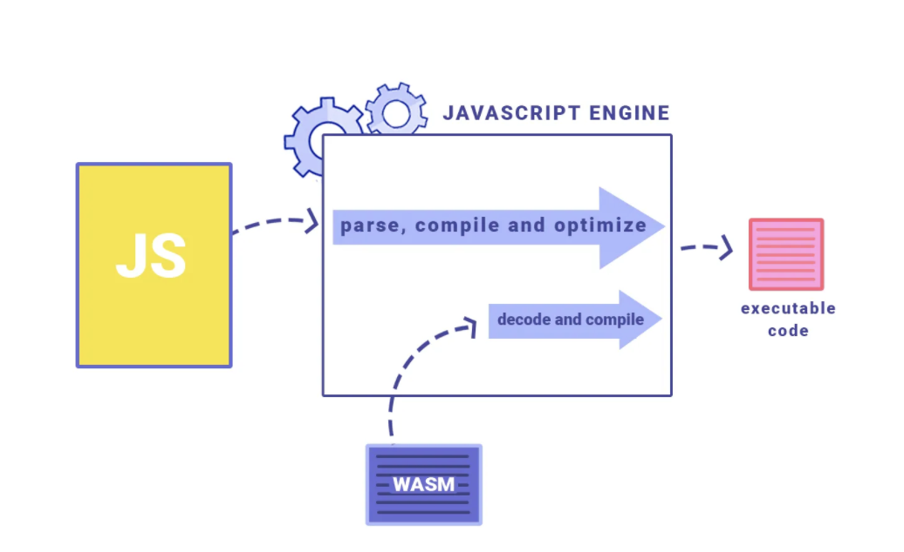
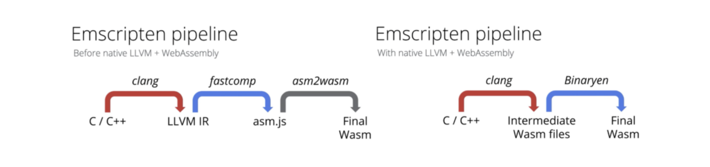
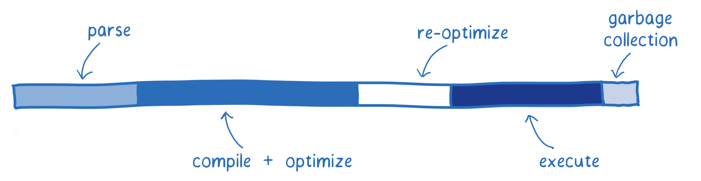
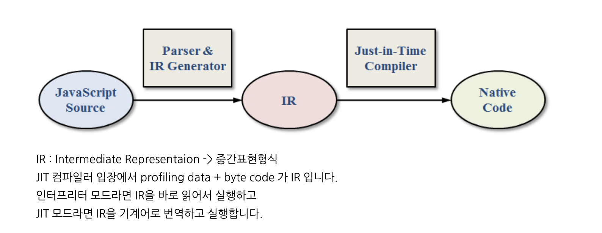

## 웹어셈블리 나온 이유

구글의 [NaCI](https://developer.chrome.com/native-client)(Native Client), 모질라의 [asm.js](http://asmjs.org/)(JavaScript 서브셋) 등 네이티브 머신 코드를 웹으로 가져오기 위한, 그리고 빠르게 실행하기 위한 시도들은 결과적으로 웹어셈블리(이하 'wasm'으로 표기)로 귀결되면서 개발이 시작되었다.

2019년 12월, W3C는 현재 [1.1 버전](https://webassembly.github.io/spec/core/) 상태인 wsam를 HTML, CSS 그리고 JavaScript에 이어 웹의 4번째 언어로 공식 권고함

## 웹어셈블리 구동방식

JavaScript 엔진 내에서 JavaScript 코드와 wasm의 실행 과정

- 컴파일된 바이너리 포맷의 wasm 모듈은 JavaScript를 대신하거나 JavaScript 내에서 실행되지 않고, JavaScript와 같이 JavaScript 엔진 내에서 나란히 실행



Emscripten은 C/C++ 코드를 가져와 LLVM을 통해 전달하고 LLVM 생성 바이트 코드를 JavaScript(특히 JavaScript의 하위 집합인 Asm.js)로 변환합니다.

WASM 생성과정

- C,C++ → [Clang툴(LLVM) → LLVM 바이트코드 생성 → Asm.js 변환]: Emscripten


emscripten 변천

1. wasm 컴파일은 [fastcomp](https://github.com/emscripten-core/emscripten-fastcomp/)(LLVM plus Emscripten's asm.js backend)가 백엔드를 담당
2. C/C++을 컴파일해 중간 표현식(IR)
3. fastcomp를 통해 asm.js로 컴파일
4. [asm2wasm](https://github.com/WebAssembly/binaryen/blob/master/src/asm2wasm.h)을 사용해 wasm으로 이어지는 컴파일 파이프라인



V8 팀은 Emscripten에서 불필요한 asm.js 컴파일 과정을 거치지 않고, 네이티브 LLVM wasm 백엔드가 기본 파이프라인이 되도록 개선해 많은 영역에서 성능 개선을 이뤄냈다고 밝혔다.

[https://twitter.com/v8js/status/1145704863377981445](https://twitter.com/v8js/status/1145704863377981445)

## wasm을 왜 사용하는걸까?

JavaScript 엔진의 단계별 작업 과정



### Fetching

실행할 모듈/코드를 로딩하는 과정

⇒ wasm은 바이너리 파일임으로, 자바스크립트 minify, magling을 하더라도 로딩속도는 향상

### Parse

다운로드한 소스 코드를 파싱해 인터프리터가 이해할 수 있도록 만드는 과정

Javacript: JS → AST → Javascript 엔진 이해할 수 있는 바이트코드 생성 → 실행

WSAM: LLVM을 통한 중간표현식(asm.js) → 디코딩, 오류여부 파악 → 실행

### Compile + Optimize

- 기준 및 최적화 컴파일러를 통해 컴파일되는 과정

Javascript : [JIT](https://en.wikipedia.org/wiki/Just-in-time_compilation)(Just-In-Time) 컴파일러를 통해 실행되는 동안 컴파일이 동시에 이뤄



WSAM

1. wasm 자체는 기계어에 가까우며, 명시적 타입(32 bit와 64 bit Float와 Integer로 구성된 [4가지 원시 타입](https://webassembly.github.io/spec/core/syntax/types.html) - f32, f64, i32, i64)이 사용
2. JS 엔진 컴파일 시 타입체킹X
3. LLVM을 통해 여러 가지 최적화가 적용된 상태이므로, 컴파일과 최적화에 많은 작업을 수행할 필요가 없다.

### Re-optimize

JIT 컴파일러의 예측이 틀렸을 때 재최적화하거나 최적화 코드를 구제해 다시 기준 코드로 전달하는 재조정 과정

- 이전 변수의 타입이 직전 반복과 다른 경우, 다시 최적화가 필요한 경우
- WSAM: 최적화 상태이고, 타입에 대한 체크가 필요없어 재최적화 사이크 불필요

### Execute

코드의 실행

WSAM : 컴파일러를 타겟으로 디자인되어 있어 컴파일러 최적화된 결과물을 출력

Javascript: 최적화된 코드사용은 개발자의 역량에 의존

### GC

할당되었지만 더는 사용되지 않는 메모리 영역을 해제하는 과정

WSAM: 메모리 생성,해제를 명시적으로 해주고 있기 때문에 GC가 불필요하다.

그외에 좋아진 점

사용 메모리 확장(2GB -> 4GB)

데이터 공유(web worker간 데이터 공유 → ShareArrayBuffer),

→ c++ pthread 이용해서 ipc 통신 가능

....

[https://d2.naver.com/helloworld/8257914](https://d2.naver.com/helloworld/8257914)

### 웹어셈블리는 어디에 사용되나?

[https://madewithwebassembly.com/](https://madewithwebassembly.com/)

### 러스트 설치

[Install Rust](https://www.rust-lang.org/tools/install)

```bash
# https://www.rust-lang.org/tools/install
$ curl https://sh.rustup.rs -sSf | sh

# rust version 확인 -> command창을 재실행
$ rustc --version
```

### 패키지 설치

```bash
# 러스트를 웹어셈블리로 컴파일하고 JS interop code를 생성
# 패키지를 빌드하기 위해, wasm-pack이라는 추가적인 툴이 필요합니다. 이것을 통해 코드를 WebAssembly로 컴파일하고, npm에 적합한 패키징을 생성합니다.
$ cargo install wasm-pack

# npm과 같은 task runner
$ cargo install cargo-make

# node에서 serve -s build와 같은 빌드 서버
$ cargo install simple-http-server
```

### 프로젝트 생성

```bash
$ cargo new --lib [프로젝트명] && cd [프로젝트명]
```

### yew 라이브러리 추가

```bash
# UI컴퍼넌트를 빌드를 위해서 cargo.toml 의존성 추가

...

[lib]
crate-type = ["cdylib", "rlib"]

[dependencies]
yew = "0.17"
wasm-bindgen = "0.2"
```

### build 환경설정 추가

```bash
[tasks.build]
command = "wasm-pack"
args = ["build", "--dev", "--target", "web", "--out-name", "wasm", "--out-dir", "./static"]
watch = { ignore_pattern = "static/*" }

[tasks.serve]
command = "simple-http-server"
args = ["-i", "./static/", "-p", "3000", "--nocache", "--try-file", "./static/index.html"]
```

### webassembly 빌드

```bash
$ argo make build
```

### index.html 생성

```html
<!DOCTYPE html>
<!-- 서버에서 호출될 index.html 생성(static 폴더하위에 생성) -->
<html lang="en">
  <head>
    <meta charset="utf-8" />
    <title>[프로젝트명]</title>
    <script type="module">
      import init from '/wasm.js';
      init();
    </script>
    <link rel="shortcut icon" href="#" />
  </head>
  <body></body>
</html>
```

### 서버실행

```bash
$ cargo make serve
```

### 예제코드

[https://github.com/seungahhong/webassembly-tutorial](https://github.com/seungahhong/webassembly-tutorial)

### 추가설명

Yew:

[WebAssembly](https://webassembly.org/)를 사용하여 다중 스레드 프론트 엔드 웹 앱을 만들기 위한 최신 [Rust](https://www.rust-lang.org/) 프레임워크

DOM API 호출을 최소화

wasm_bindgen

js engine ↔ 웹어셈블리는 숫자타입만 지원가능(그외에 타입을 지원하기 위해서 추가)

JavaScript 파일은 Rust를 호출할 때 사용될 인터페이스 역할

```rust
export function greet(s: string); // rust -> js

const rust = import("./wasm_greet"); // js -> rust
rust.then(m => m.greet("World!"));
```

lib.rs → rust에서 실행파일은 main.rs, 라이브러리로 생성 시 lib.rs 생성(cargo new --lib [프로젝트명])

mod.rs → javascript index.js

문법

mod → javascript import

pub → typescript publish

use → import { Home } from 'home' 동일

type → typescript type

→ 빌드 시 \_bg.wasm 최적화된 코드로 변경

# 참고사항

- [https://www.sheshbabu.com/posts/rust-wasm-yew-single-page-application/](https://www.sheshbabu.com/posts/rust-wasm-yew-single-page-application/)
- [https://frontdev.tistory.com/entry/Rust로-SPA-만들기-1-리스트-만들기](https://frontdev.tistory.com/entry/Rust%EB%A1%9C-SPA-%EB%A7%8C%EB%93%A4%EA%B8%B0-1-%EB%A6%AC%EC%8A%A4%ED%8A%B8-%EB%A7%8C%EB%93%A4%EA%B8%B0)
- [https://johnresig.com/blog/asmjs-javascript-compile-target/](https://johnresig.com/blog/asmjs-javascript-compile-target/)
- [https://m.blog.naver.com/z1004man/221914280533](https://m.blog.naver.com/z1004man/221914280533)
- [https://d2.naver.com/helloworld/8257914](https://d2.naver.com/helloworld/8257914)
- [https://tech.kakao.com/2021/05/17/frontend-growth-08/](https://tech.kakao.com/2021/05/17/frontend-growth-08/)
- [https://ui.toast.com/weekly-pick/ko_20180411](https://ui.toast.com/weekly-pick/ko_20180411)
