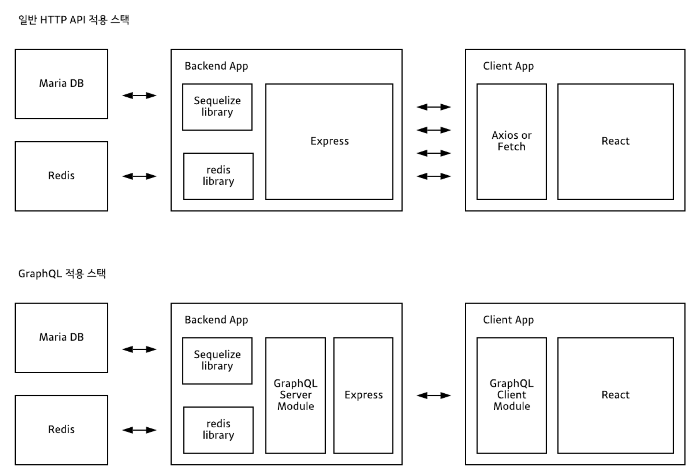
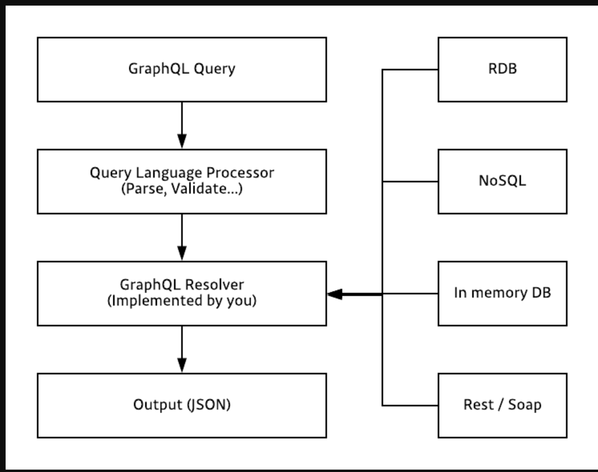
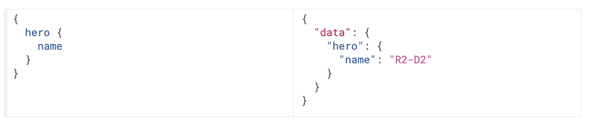
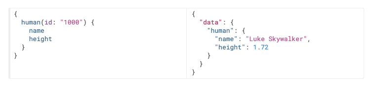
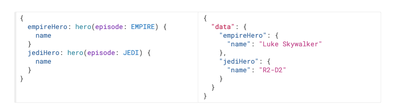
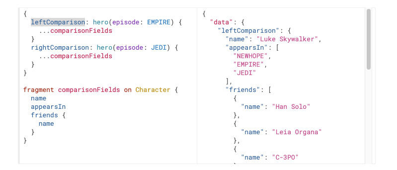
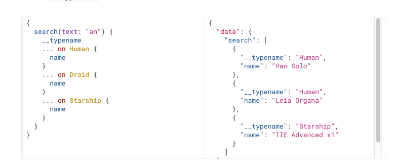
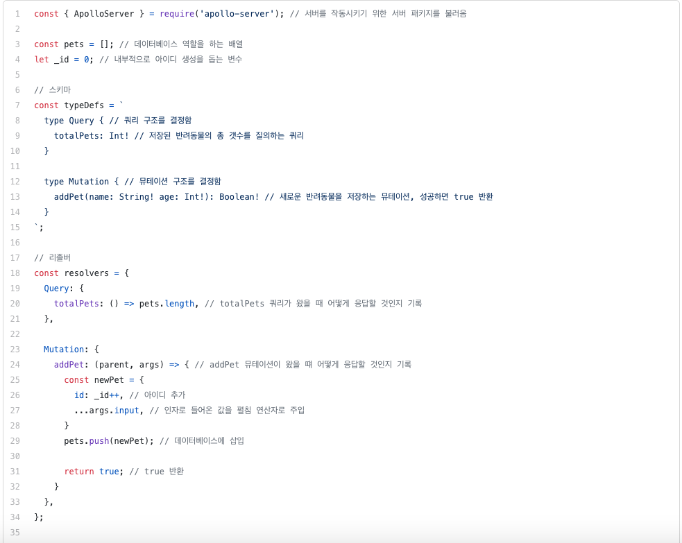
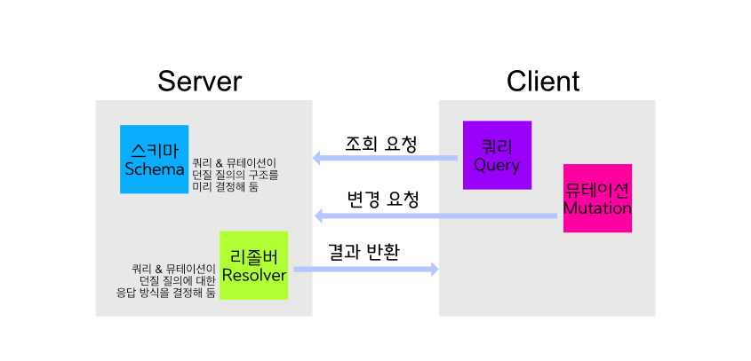
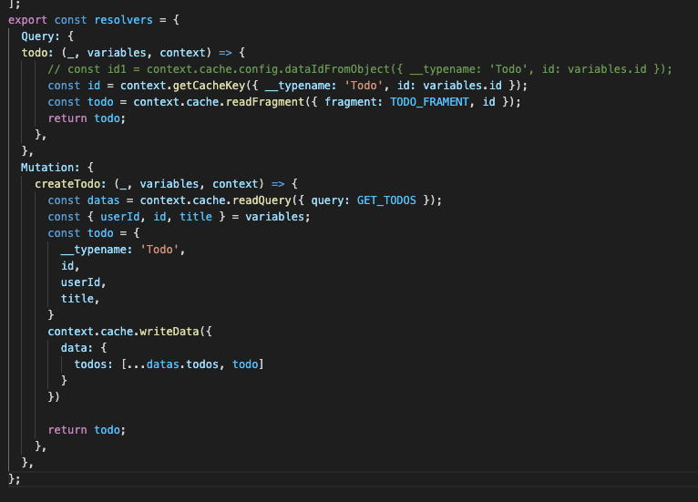

# What Is a REST API

- A format agreed upon between the parties that exchange data
  - GET: retrieve information
  - POST: submit information
  - PUT/PATCH: update information
  - DELETE: delete information

```json
localhost:3000/api/team
[
  {
    name: '30분짜장',
    category: 'chinese',
    tel: '##-####-####',
    rating: 4.6
  },
  {
    name: '피자파자마',
    category: 'italian',
    tel: '##-####-####',
    rating: 3.9
  },
  {
    name: '공중떡볶이',
    category: 'snack',
    tel: '##-####-####',
    rating: 4.9
  },
  ///...
]
```

# Limitations of REST APIs

- overfetching: You cannot retrieve only the information you actually need.

```json
localhost:3000/api/team
[
  {
    name: '30분짜장',
    category: 'chinese',
  },
  {
    name: '피자파자마',
    category: 'italian',
  },
  {
    name: '공중떡볶이',
    category: 'snack',
  },
  ///...
]
```

- underfetching: Wouldn't it be nice to retrieve all the information you need in a single request?

```json
'food' [{
    name: '30분짜장',
    category: 'chinese',
    tel: '##-####-####',
    rating: 4.9
  },
  {
    name: '피자파자마',
    category: 'italian',
    tel: '##-####-####',
    rating: 4.9
  },
  {
    name: '공중떡볶이',
    category: 'snack',
    tel: '##-####-####',
    rating: 4.9
  }],
'agency': {
   kt,
   skt,
   lg
}
```

```json
'food' [{
    name: '30분짜장',
    category: 'chinese',
    tel: '##-####-####',
    rating: 4.9
  },
  {
    name: '피자파자마',
    category: 'italian',
    tel: '##-####-####',
    rating: 4.9
  },
  {
    name: '공중떡볶이',
    category: 'snack',
    tel: '##-####-####',
    rating: 4.9
  }],
'agency': {
   kt,
   skt,
   lg
}
```

# Comparison with REST APIs

Because REST APIs combine URLs, methods, and so on, they expose many different endpoints. GraphQL, on the other hand, has a single endpoint. In a GraphQL API, the kinds of data you fetch are determined by how you compose your query.



# What Is GraphQL?

GraphQL is a query language created by Facebook, and like Structured Query Language (SQL), it is a query language.

The purpose of SQL is to efficiently retrieve data stored in a database system, whereas the purpose of GraphQL is to let a web client efficiently retrieve data from a server.

SQL statements are mainly written and invoked on the backend system, whereas GraphQL statements are mainly written and invoked on the client system.

```jsx
// sql
SELECT plot_id, species_id, weight, ROUND(weight / 1000.0, 2) FROM surveys;

// gql
{
  hero {
    name
    friends {
      name
    }
  }
}
```

# Server-Side GraphQL Application



# The Structure of GraphQL

## Query/Mutation

The structure of queries, mutations, and their response payloads is remarkably intuitive. The structure of the query you send and the structure of the response you receive are nearly identical.



GraphQL deliberately distinguishes between queries and mutations, but internally the two are practically no different. It is merely a conceptual convention: queries are used to read data (R), while mutations are used to modify data (CUD).

## Arguments



## Aliases



## Fragments: Reusability



## Meta Fields

Added so that when a situation arises in which the type to be returned from the GraphQL service is unknown, the client can decide how to handle that data.



## Mutations (Create, Update, Delete)





# Schema/Type

## Object Types and Fields

```jsx
type Character {
  name: String!
  appearsIn: [Episode!]!
}
```

- Object type: Character
- Fields: name, appearsIn
- Scalar types: String, ID, Int, Float, Boolean, etc.
- Exclamation mark (!): denotes a required value (non-nullable)
- Square brackets ([ ]): denote an array

## Resolver

Parsing of GraphQL query statements is handled by most GraphQL libraries, but the concrete process of fetching data in GraphQL is the responsibility of the resolver, which you must implement yourself.



# References

[https://tech.kakao.com/2019/08/01/graphql-basic/](https://tech.kakao.com/2019/08/01/graphql-basic/)

[https://graphql-kr.github.io/learn/queries/](https://graphql-kr.github.io/learn/queries/)
