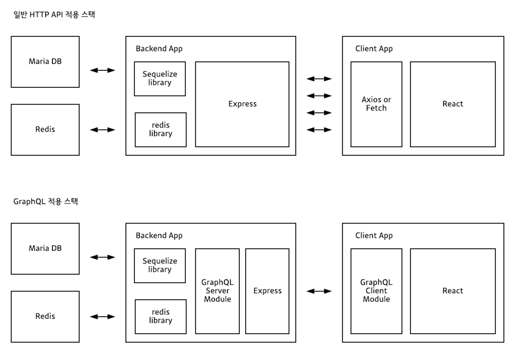
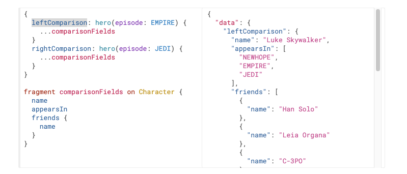
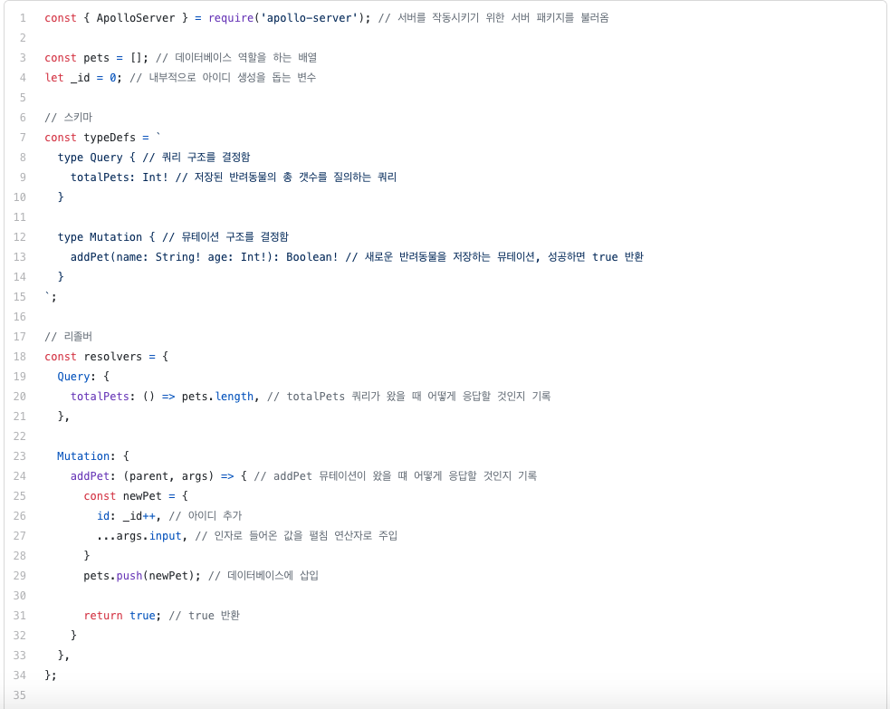
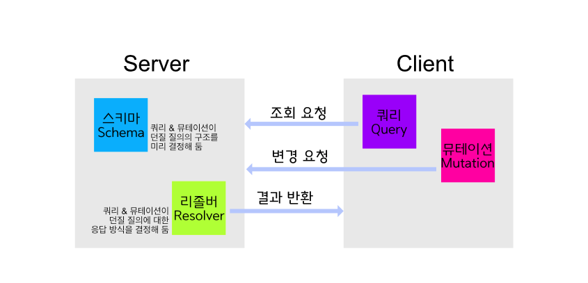
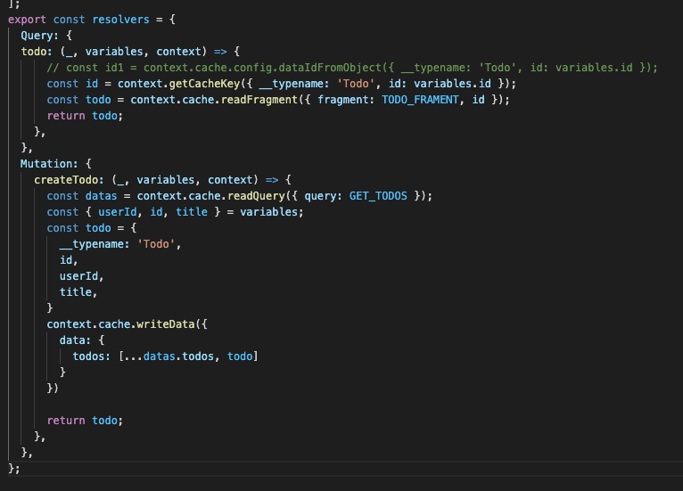

# RestAPI란

- 데이터를 주고받을 주체들간 약속된 형식
  - GET: 정보 받아오기
  - POST: 정보 입력하기
  - PUT/PATCH: 정보 수정하기
  - DELETE: 정보 삭제하기

```json
localhost:3000/api/team
[
  {
    name: '30분짜장',
    category: 'chinese',
    tel: '##-####-####',
    rating: 4.6
  },
  {
    name: '피자파자마',
    category: 'italian',
    tel: '##-####-####',
    rating: 3.9
  },
  {
    name: '공중떡볶이',
    category: 'snack',
    tel: '##-####-####',
    rating: 4.9
  },
  ///...
]
```

# RestAPI의 한계

- overfetching: 필요한 정보들만 받아올 수가 없다.

```json
localhost:3000/api/team
[
  {
    name: '30분짜장',
    category: 'chinese',
  },
  {
    name: '피자파자마',
    category: 'italian',
  },
  {
    name: '공중떡볶이',
    category: 'snack',
  },
  ///...
]
```

- underfetching: 필요한 정보들을 한번에 받아올수 없을까??

```json
'food' [{
    name: '30분짜장',
    category: 'chinese',
    tel: '##-####-####',
    rating: 4.9
  },
  {
    name: '피자파자마',
    category: 'italian',
    tel: '##-####-####',
    rating: 4.9
  },
  {
    name: '공중떡볶이',
    category: 'snack',
    tel: '##-####-####',
    rating: 4.9
  }],
'agency': {
   kt,
   skt,
   lg
}
```

```json
'food' [{
    name: '30분짜장',
    category: 'chinese',
    tel: '##-####-####',
    rating: 4.9
  },
  {
    name: '피자파자마',
    category: 'italian',
    tel: '##-####-####',
    rating: 4.9
  },
  {
    name: '공중떡볶이',
    category: 'snack',
    tel: '##-####-####',
    rating: 4.9
  }],
'agency': {
   kt,
   skt,
   lg
}
```

# REST API와 비교

REST API는 URL, METHOD등을 조합하기 때문에 다양한 Endpoint가 존재 합니다. 반면, gql은 단 하나의 Endpoint가 존재 합니다. 또한, gql API에서는 불러오는 데이터의 종류를 쿼리 조합을 통해서 결정 합니다.



# GraphQL이란?

GraphQL은 페이스북에서 만든 쿼리 언어이면서 Structed Query Language(이하 sql)와 마찬가지로 쿼리 언어입니다

sql은 데이터베이스 시스템에 저장된 데이터를 효율적으로 가져오는 것이 목적이고, gql은 웹 클라이언트가 데이터를 서버로 부터 효율적으로 가져오는 것이 목적입니다.

sql의 문장(statement)은 주로 백앤드 시스템에서 작성하고 호출 하는 반면, gql의 문장은 주로 클라이언트 시스템에서 작성하고 호출 합니다.

```jsx
// sql
SELECT plot_id, species_id, weight, ROUND(weight / 1000.0, 2) FROM surveys;

// gql
{
  hero {
    name
    friends {
      name
    }
  }
}
```

# 서버사이드 gql 어플리케이션


# GraphQL의 구조

## 쿼리/뮤테이션(query/mutation)

쿼리와 뮤테이션 그리고 응답 내용의 구조는 상당히 직관적 입니다. 요청하는 쿼리문의 구조와 응답 내용의 구조는 거의 일치 합니다


gql에서는 굳이 쿼리와 뮤테이션을 나누는데 내부적으로 들어가면 사실상 이 둘은 별 차이가 없습니다. 쿼리는 데이터를 읽는데(R) 사용하고, 뮤테이션은 데이터를 변조(CUD) 하는데 사용한다는 개념 적인 규약을 정해 놓은 것 뿐입니다.

## 인자


## 별칭


## 프래그먼트: 재사용성



## 메타 필드

GraphQL 서비스에서 리턴될 타입을 모르는 상황이 발생하면 클라이언트에서 해당 데이터를 처리하는 방법을 결정하기 위해서 추가


## 뮤테이션(Create, Update, Delete)





# 스키마/타입(schema/type)

## 오브젝트 타입과 필드

```jsx
type Character {
  name: String!
  appearsIn: [Episode!]!
}
```

- 오브젝트 타입 : Character
- 필드 : name, appearsIn
- 스칼라 타입 : String, ID, Int, Float, Boolean 등
- 느낌표(!) : 필수 값을 의미(non-nullable)
- 대괄호([ ]) : 배열을 의미(array)

## 리졸버(resolver)

gql 쿼리문 파싱은 대부분의 gql 라이브러리에서 처리를 하지만, gql에서 데이터를 가져오는 구체적인 과정은 resolver(이하 리졸버)가 담당하며 직접 구현해야함.



# 참고사이트

[https://tech.kakao.com/2019/08/01/graphql-basic/](https://tech.kakao.com/2019/08/01/graphql-basic/)

[https://graphql-kr.github.io/learn/queries/](https://graphql-kr.github.io/learn/queries/)
