# RxJS Concepts

RxJS is the Reactive Extensions For JavaScript library.

ReactiveX combines the Observer pattern, the Iterator pattern, and functional programming into a single offering.

It lets you manage and handle both synchronous and asynchronous processing as a single stream.

- Asynchronous programming: if you are reading this document, you probably do not need an explanation.
- Functional programming: pure functions, higher-order functions, first-class functions
- Data stream: a data-style representation, a companion to file streams, event streams, and http streams
- Iterator: the iterator pattern (ES6)

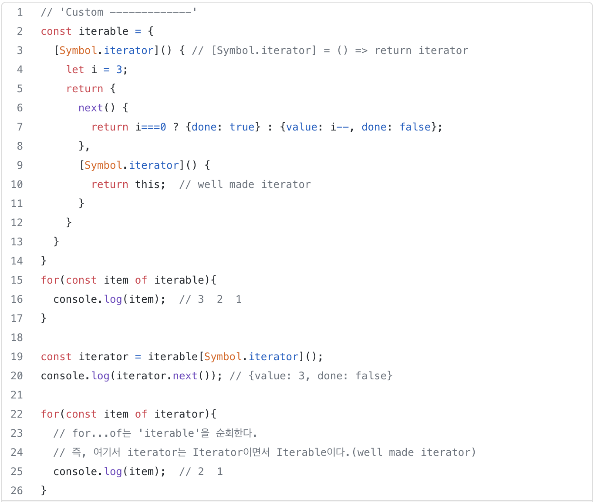

List data such as Array, Set, and Map are Iterable by default and have an Iterator, which means they satisfy the protocol. The spread/rest operations also follow the iterator syntax.

- Observer: refer to the Observer pattern chapter in design pattern books. In JavaScript, event listeners are already an example of the Observer pattern.
- Observable: responsible for propagating multiple events or values to observers that watch a particular object
- Pull: decides whether to receive data
- Push: decides whether to send data
- Single: handles a single value or event
- Multiple: handles multiple values or events

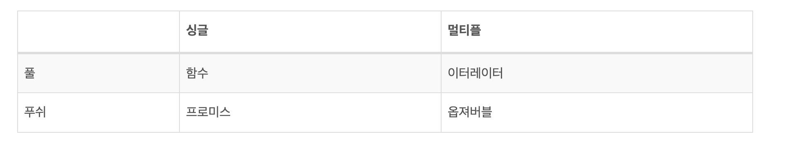

```jsx
import { Observable } from 'rxjs';

const observable$ = new Observable(subscriber => {
  subscriber.next(1);
  subscriber.next(2);
  subscriber.next(3);
  setTimeout(() => {
    subscriber.next(4);
    subscriber.complete();
  }, 1000);
});

console.log('just before subscribe');
observable$.subscribe({
  next(x) { console.log('got value ' + x); },
  error(err) { console.error('something wrong occurred: ' + err); },
  complete() { console.log('done'); }
});
console.log('just after subscribe');

---------------------------
just before subscribe
got value 1
got value 2
got value 3
just after subscribe
got value 4
done
```

## RxJS: A Consistent Approach to Input Values

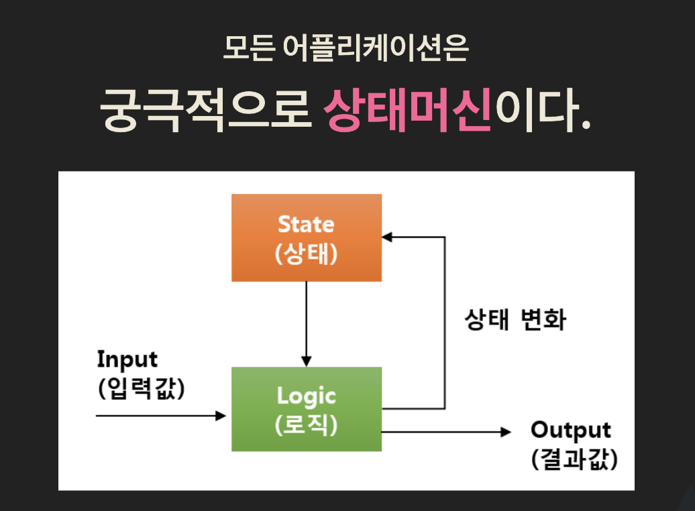

What kinds of input values are there?

1. JavaScript: array data, function return values
2. Events: keyboard, mouse, wheel, touch
3. Server data: ajax, file

...

→ Input values come with the hassle of having to handle synchronous and asynchronous processing separately.

Example) There is branching logic for many different kinds of input values, such as function calls, events, callbacks/promises, and push/pull approaches.

RxJS can process input values in a consistent synchronous/asynchronous manner by handling them through the data stream approach (unifying the interface).

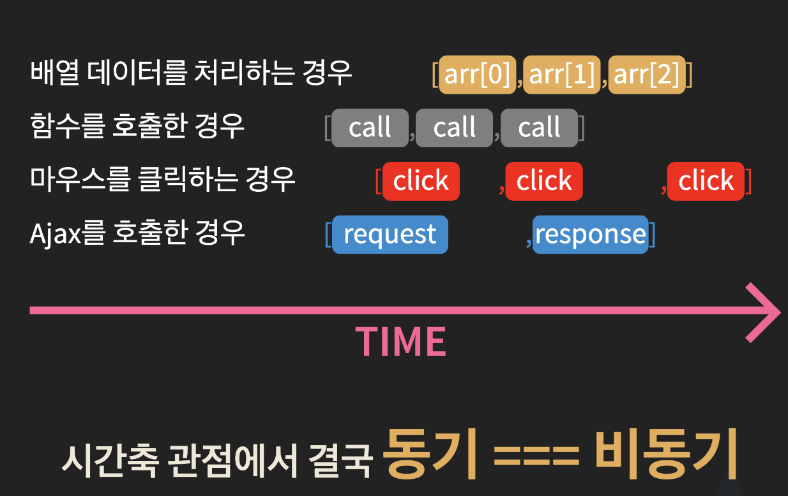

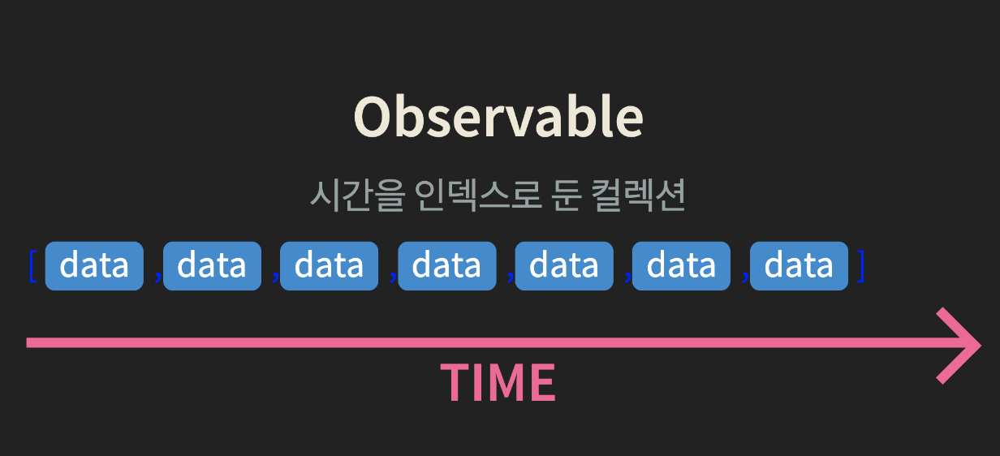

- It resolves the hassle of having to handle synchronous and asynchronous processing separately.

## Concepts Built into RxJS

### Reactive Programming

- It means that changes to the base execution model are automatically propagated (pushed) through a data flow (observable), rather than by polling or a pull approach.

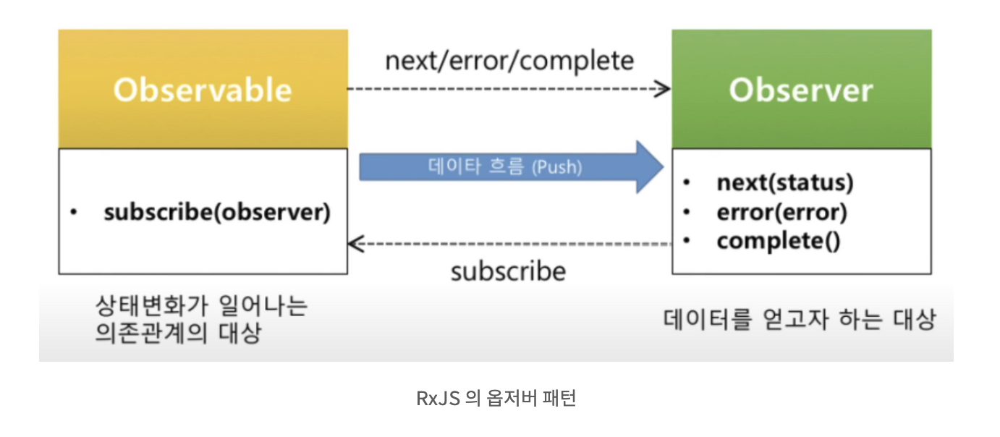

### Higher-Order Functions

- A function that takes a function as an argument or returns a function as its result
- RxJS provides operators (filter, map, reduce, etc.)

Data flow for passing data along

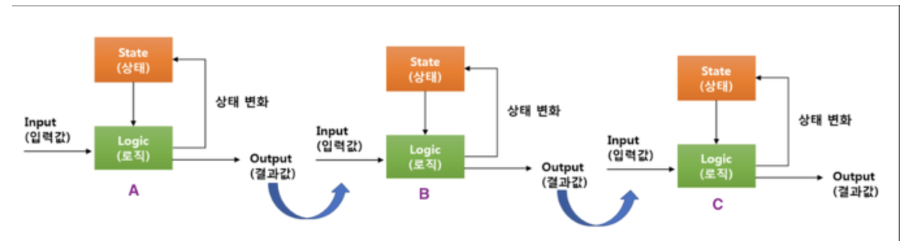

Example) A output → B input, B output → C input, C output

How can we pass data and obtain results in a consistent way?

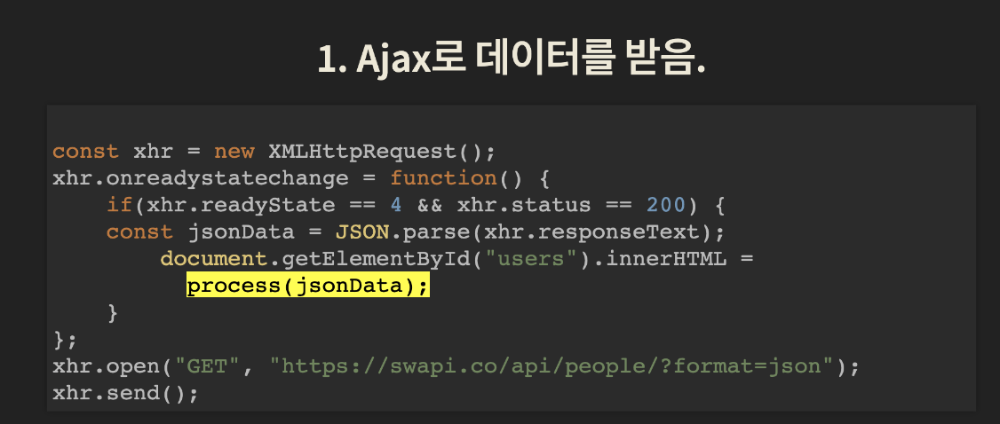

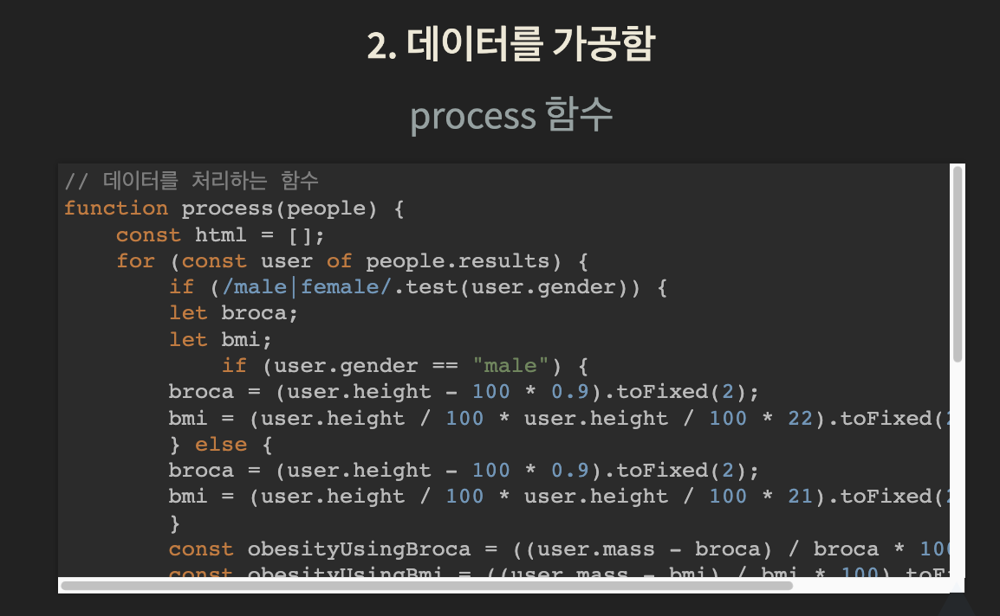

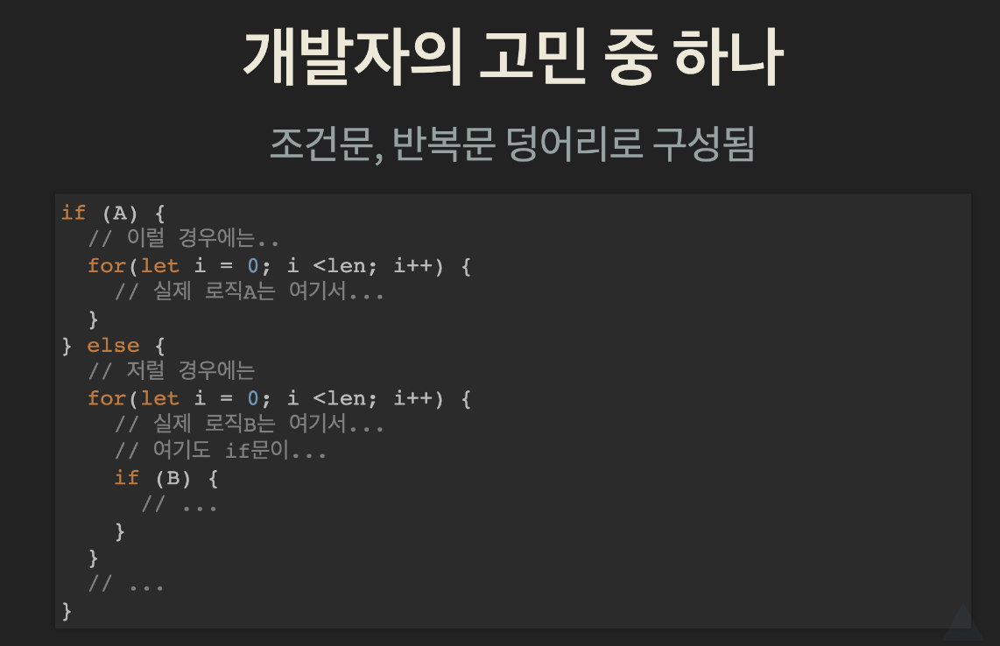

### Conditionals split the flow of the code / loops lower code readability / business logic gets buried

### Example of Using Higher-Order Functions

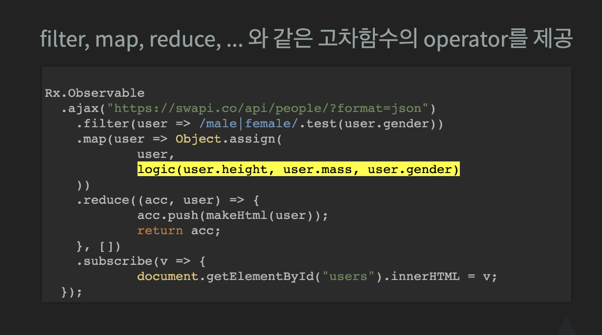

## Pure Functions (Embracing Functional Programming)

- Given the same input, they return the same output.
- They must have no side effects.
- They must not depend on external data.

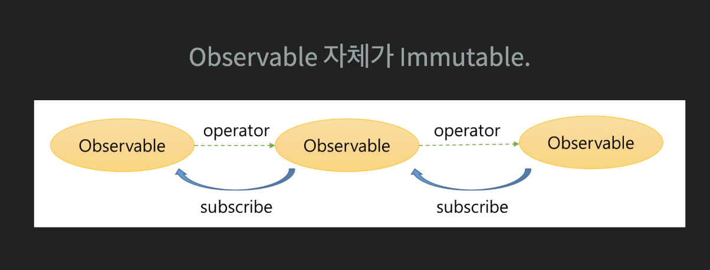

- The observable produced through an operator is also an independent object.

Rx

### **RxJS Development Process ⚙️**

> Memorize this one too..! After all, this is the cycle you use RxJS with.

- Convert the data source into an Observable. (from, of, fromEvent…)

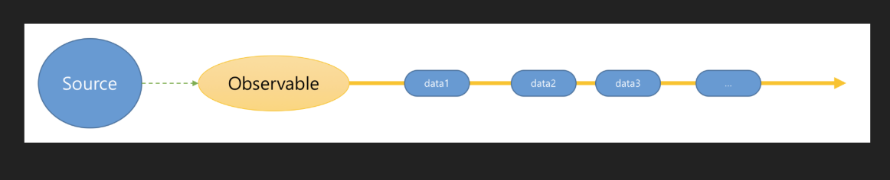

- Transform or extract data through operators.
  - Or merge multiple Observables into a single Observable,
  - or turn a single Observable into multiple Observables.

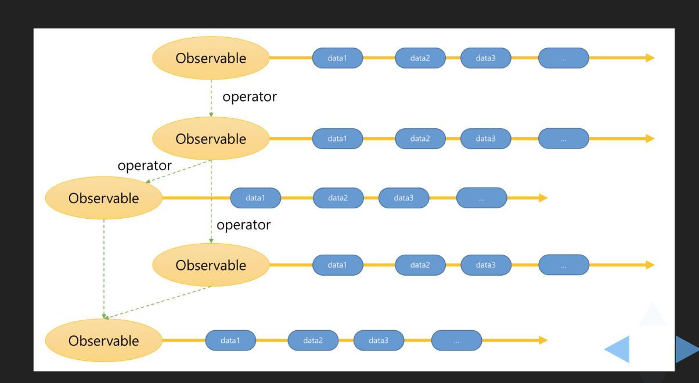

- Create an Observer that receives and processes the desired data.

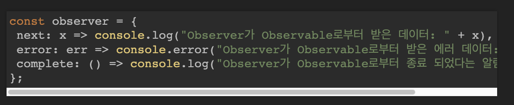

- Register the Observer through the Observable's subscribe.

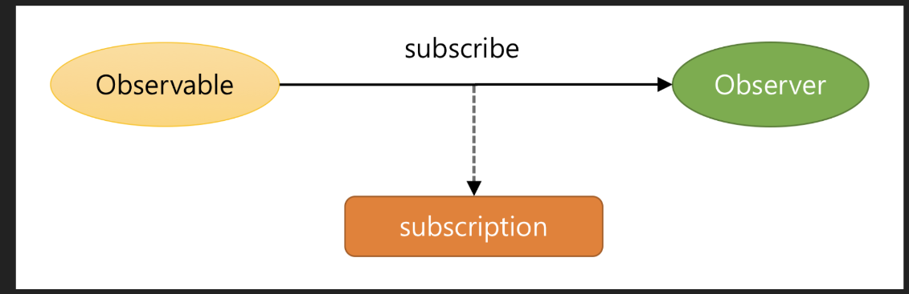

- Stop the Observable subscription and release the resources.

```jsx
subscription.unsubscribe();
```

## **RxJS Observable Lifecycle**

1. **Creation** Observable.create() No events are emitted at the time of creation.
2. **Subscription** Observable.subscribe() At the time of subscription, you can subscribe to events.
3. **Execution** observer.next() At the time of execution, values are delivered to the subscribers of the events.
4. **Unsubscription** observer.complete() Observable.unsubscribe() At the time of unsubscription, all subscriptions of every subscriber are terminated.

## RxJS Scheduler

- **JavaScript's asynchronous processing flow and the RxJS Scheduler**
  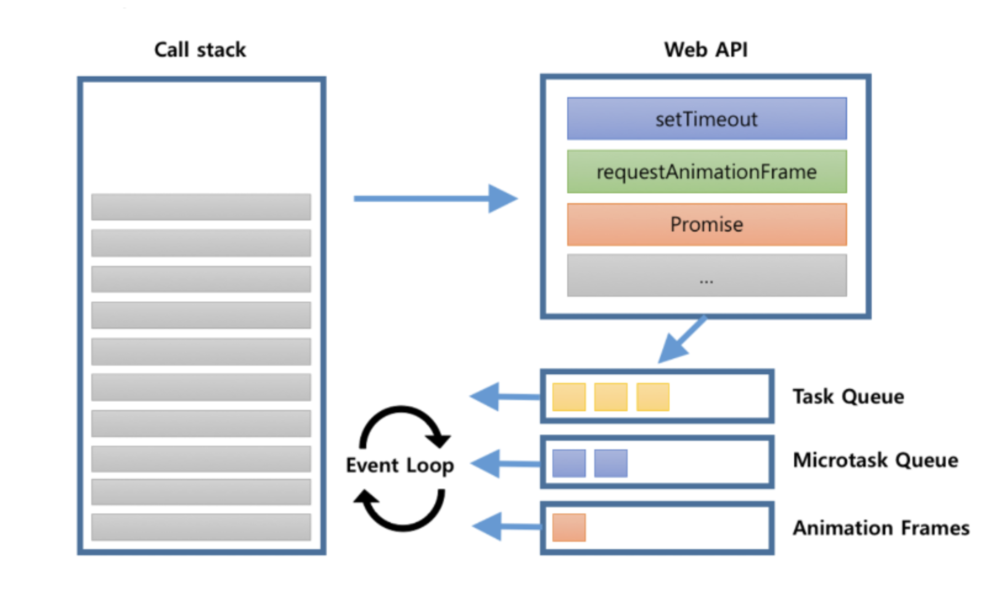

```jsx
console.log("script start");

setTimeout(function() {
  console.log("setTimeout");
}, 0);

Promise.resolve().then(function() {
  console.log("promise1");
}).then(function() {
  console.log("promise2");
});

requestAnimationFrame(function {
  console.log("requestAnimationFrame");
});
console.log("script end");

------
script start
script end
promise1
promose2
requestAnimationFrame
setTimeout
```

**RxJS Scheduler Explanation**

**queueScheduler** : the task queue. Easiest to think of it as setTimeout, setInterval.

**asapScheduler** : the microtask queue.

**animationFrameScheduler** : this is requestAnimationFrame.

**queueScheduler** : placed directly onto the call stack. Rarely used.

→ [https://minjung-jeon.github.io/scheduler/](https://minjung-jeon.github.io/scheduler/)

Functions for applying pipe

SubscribeOn: specifies the scheduler on which to run the **Observable** or the **operators** that process it

ObserveOn: specifies the scheduler to use when sending notifications to **subscribers**

```jsx
const { of, asyncScheduler } = rxjs
const { subscribeOn, observeOn, tap } = rxjs.operators

const tapper = x => console.log(`${x} IN`)
const observer = x => console.log(`${x} OUT`)

of(1, 2, 3).pipe(
  tap(tapper),
  subscribeOn(asyncScheduler)
).subscribe(observer)

of(4, 5, 6).pipe(
  tap(tapper),
).subscribe(observer)

of('A', 'B', 'C').pipe(
  tap(tapper),
  observeOn(asyncScheduler)
).subscribe(observer)

of('D', 'E', 'F').pipe(
  tap(tapper),
).subscribe(observer)

-----
"4 IN"
"4 OUT"
"5 IN"
"5 OUT"
"6 IN"
"6 OUT"
"A IN"
"B IN"
"C IN"
"D IN"
"D OUT"
"E IN"
"E OUT"
"F IN"
"F OUT"
"1 IN" -> subscribeOn
"1 OUT"
"2 IN"
"2 OUT"
"3 IN"
"3 OUT"
"A OUT" --> observeOn
"B OUT"
"C OUT"
```

## Promise vs. Observable

### **Execution Timing**

- A Promise runs as soon as the object is created and is loaded immediately, which is why it is called eager. Every `then()` shares the same computed value.

```jsx
// 최초 실행 (생성 및 실행)
let promise = new Promise((resolve, reject) => {
  // ...
});
promise.then(value => {
  // 결과 처리
});
```

- An Observable does not run until a consumer subscribes to it, which is why it is called lazy. `subscribe()` can be called multiple times, and each subscription has its own computed value.

```jsx
import { Observable } from 'rxjs';
// 선언 (생성)
const observable$ = new Observable(observer => {
  // ...
});

// 최초 실행 (구독)
observable$.subscribe(value => {
  // observer 처리
});
```

### **Number of Returns**

- A Promise can send only one value, and if you send several, the ones sent later are ignored.

```jsx
const promise = new Promise(resolve => {
  resolve(1);
  resolve(2); // 무시
});
promise.then(console.log); // output: 1
```

- An Observable can send multiple pieces of data.

```jsx
const observable$ = new Observable(observer => {
  observer.next(1);
  observer.next(2);
});
observable$.subscribe(console.log); // output: 1 2
```

### **Manipulation and Return**

- A Promise handles both manipulating and returning data with a single `then()`.

```jsx
promise.then(v => 2 * v);
```

- An Observable can separate manipulating and subscribing (returning) data. The subscriber function runs and computes its value only when there is a subscriber. If you need to process data in a complex way elsewhere, an Observable is more efficient.

```jsx
observable$.pipe(map(v => 2 * v));
```

### **Cancellation (Release)**

- A Promise cannot be cancelled mid-execution, but an Observable can cancel (release) its subscription. Cancelling a subscription removes the value the event listener would receive and tells the subscriber function to cancel.

```jsx
const subscription = observable$.subscribe(() => {
  // ...
});
subscription.unsubscribe();
```

## Operators

A pipeable operator is a function that takes an Observable as its input and returns another Observable.

- **An operator always creates a new Observable.**
- **An operator always returns an Observable.**
- **An operator must be immutable with respect to the source Observable that precedes it.**

```jsx
// ① 옵저버블 생성
const observable$ = from([1, 2, 3, 4, 5, 6, 7, 8, 9, 10]);

const subscription = observable$
  .pipe(
    // ② 오퍼레이터에 의한 옵저버블 변형
    map(item => item * 2), // 2, 4, 6, 8, 10
    filter(item => item > 5), // 6, 8, 10
    tap(item => console.log(item)), // 6, 8, 10
  )
  // ③ 옵저버블 구독
  .subscribe(
    // next
    value => this.values.push(value),
    // error
    error => console.log(error),
    // complete
    () => console.log('Streaming finished'),
  );
```

## Observable Stream Generator

[https://www.yalco.kr/@rxjs/1-1/](https://www.yalco.kr/@rxjs/1-1/)

## Subscribing an Observer (Subscriber) to Emissions

[https://www.yalco.kr/@rxjs/1-2/](https://www.yalco.kr/@rxjs/1-2/)

## Trying Out Operators

[https://www.yalco.kr/@rxjs/1-3/](https://www.yalco.kr/@rxjs/1-3/)

```jsx
const callFunc = (data) => {
  console.log(data);
};

function App() {
  range(1, 10).pipe(
    tap(n => console.log(n)),
    mergeMap(index => ajax(
      `https://jsonplaceholder.typicode.com/todos/${index}`
    ).pipe(
      pluck('response', 'title'),
      retry(3)
    )
    , 4),
    toArray()
  ).subscribe(callFunc);
}

------
1
2
3
4
5
6
7
8
9
10
[
0: "et porro tempora"
1: "quis ut nam facilis et officia qui"
2: "delectus aut autem"
3: "fugiat veniam minus"
4: "laboriosam mollitia et enim quasi adipisci quia provident illum"
5: "qui ullam ratione quibusdam voluptatem quia omnis"
6: "quo adipisci enim quam ut ab"
7: "illo expedita consequatur quia in"
8: "molestiae perspiciatis ipsa"
9: "illo est ratione doloremque quia maiores aut"
]
```

## Trying Out Subject

[https://www.yalco.kr/@rxjs/1-4/](https://www.yalco.kr/@rxjs/1-4/)

### **BehaviorSubject**

Stores the last value and then emits it to additional subscribers

```jsx
const { BehaviorSubject } = rxjs
const subject = new BehaviorSubject(0) // 초기값이 있음

subject.subscribe((x) => console.log('A: ' + x))

subject.next(1)
subject.next(2)
subject.next(3)

subject.subscribe((x) => console.log('B: ' + x))

subject.next(4)
subject.next(5)

--------
"A: 0"
"A: 1"
"A: 2"
"A: 3"
"B: 3"
"A: 4"
"B: 4"
"A: 5"
"B: 5"
```

### **ReplaySubject**

Stores the last N values and then emits them to additional subscribers

```jsx
const { ReplaySubject } = rxjs
const subject = new ReplaySubject(3) // 마지막 3개 값 저장

subject.subscribe((x) => console.log('A: ' + x))

subject.next(1)
subject.next(2)
subject.next(3)
subject.next(4)
subject.next(5)

subject.subscribe((x) => console.log('B: ' + x))

subject.next(6)
subject.next(7)

-------
"A: 1"
"A: 2"
"A: 3"
"A: 4"
"A: 5"
"B: 3"
"B: 4"
"B: 5"
"A: 6"
"B: 6"
"A: 7"
"B: 7"
```

### **AsyncSubject**

Emits only the last value after Complete

```jsx
const { AsyncSubject } = rxjs
const subject = new AsyncSubject()

subject.subscribe((x) => console.log('A: ' + x))

subject.next(1)
subject.next(2)
subject.next(3)

subject.subscribe((x) => console.log('B: ' + x))

subject.next(4)
subject.next(5)

subject.subscribe((x) => console.log('C: ' + x))

subject.next(6)
subject.next(7)
subject.complete()

----------
"A: 7"
"B: 7"
"C: 7"
```

# References

[https://pks2974.medium.com/rxjs-간단정리-41f67c37e028](https://pks2974.medium.com/rxjs-%EA%B0%84%EB%8B%A8%EC%A0%95%EB%A6%AC-41f67c37e028)

[https://gracefullight.dev/2019/04/30/RxJS의-모든-것/](https://gracefullight.dev/2019/04/30/RxJS%EC%9D%98-%EB%AA%A8%EB%93%A0-%EA%B2%83/)

[https://abelog.netlify.app/RxJS/rxjs-기초,-핵심-🐉/](https://abelog.netlify.app/RxJS/rxjs-%EA%B8%B0%EC%B4%88,-%ED%95%B5%EC%8B%AC-%F0%9F%90%89/)

[https://whitemackerel.tistory.com/54](https://whitemackerel.tistory.com/54)

[RxJS-1](https://www.notion.so/RxJS-1-aea361c049a146b4bd10c98eefc7aaa7)
