# RxJS 개념

RxJS는 Reactive Extensions For JavaScript 라이브러리이다.

ReactiveX 는 Observer 패턴, Iterator 패턴, 함수형 프로그래밍을 조합하여 제공한다.

동기와 비동기 처리를 하나의 스트림으로 관리하고 처리가 가능하다.

- 비동기 프로그래밍: 이 문서를 볼 정도면 설명이 필요 없을 것 같다.
- 함수형 프로그래밍: 순수함수, 고차함수, 일급 함수
- 데이터스트림: file stream, event stream, http stream 의 친구로 data 식 표현
- 이터레이터: iterator pattern(ES6)

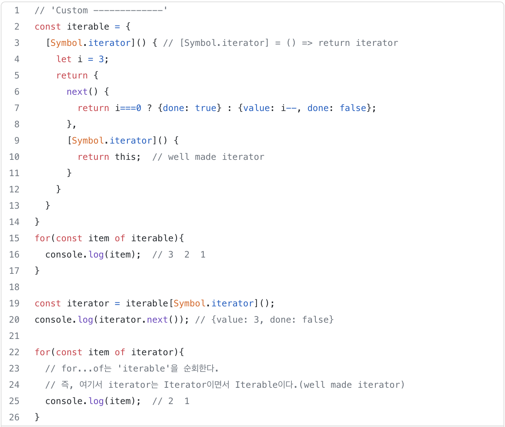

Array, Set, Map 과 같이 리스트 데이터들은 기본적으로 Iterable이며 Iterator를 가지고 있으며, 이는 곧 Protocol을 만족한다는 의미, spread/rest 연산도 iterator문법을 따름

- 옵져버: 디자인패턴 책의 옵져버패턴 단원 참조, 자바스크립트에선 이미 이벤트리스너가 옵져버 패턴이다.
- 옵져버블: 특정 객체를 관찰하는 옵저버에게 여러 이벤트나 값을 전파하는 역할
- 풀: 데이터를 받을지 결정
- 푸쉬: 데이터를 보낼지 결정
- 싱글: 하나의 값이나 이벤트를 다룸
- 멀티플: 여러 개의 값이나 이벤트를 다룸

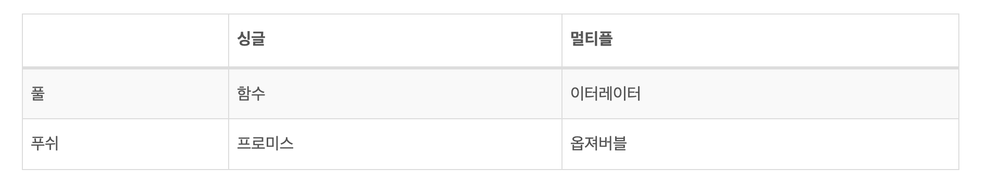

```jsx
import { Observable } from 'rxjs';

const observable$ = new Observable(subscriber => {
  subscriber.next(1);
  subscriber.next(2);
  subscriber.next(3);
  setTimeout(() => {
    subscriber.next(4);
    subscriber.complete();
  }, 1000);
});

console.log('just before subscribe');
observable$.subscribe({
  next(x) { console.log('got value ' + x); },
  error(err) { console.error('something wrong occurred: ' + err); },
  complete() { console.log('done'); }
});
console.log('just after subscribe');

---------------------------
just before subscribe
got value 1
got value 2
got value 3
just after subscribe
got value 4
done
```

## RxJs 입력값에 대한 일관된 방식

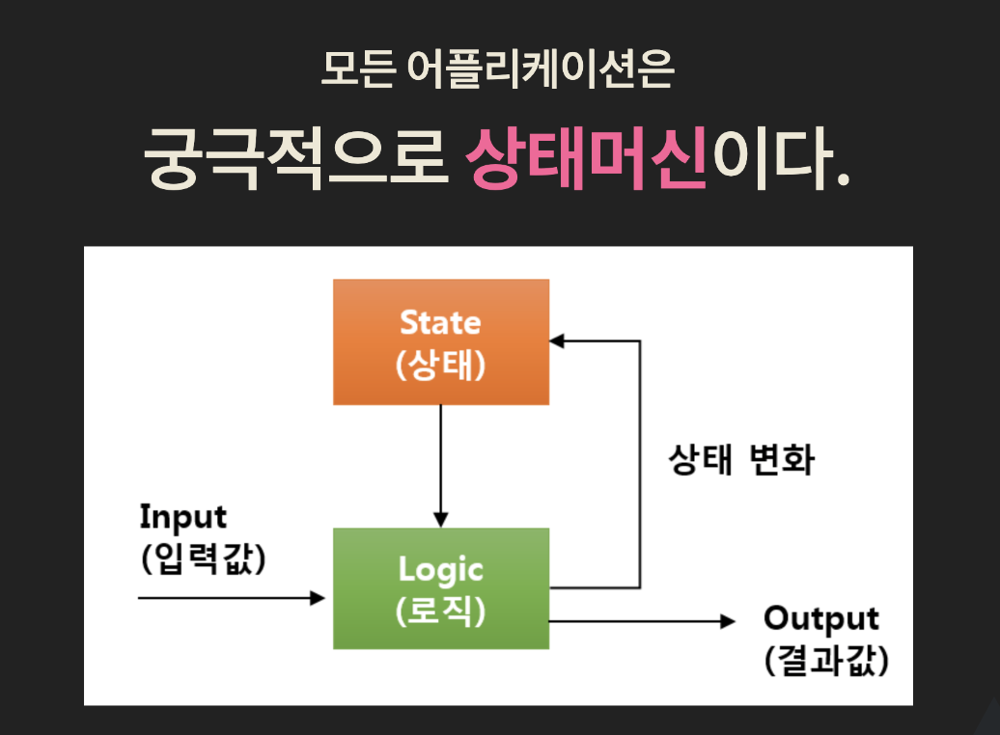

입력값들은 어떤 것들이 있을까?

1. 자바스크립트 : 배열 데이터, 함수 반환값
2. 이벤트: 키보드, 마우스, 휠, 터치
3. 서버데이터: ajax, file

...

→ 입력값들이 동기/비동기 처리를 따로 처리를 해줘야하는 번거로움이 있다.

예) 함수 호출(call), 이벤트(event), callback/promise, push/pull 방식 등 여러가지의 입력값들에 대한 분기처리 존재

RxJS 입력값들을 데이터 스트림을 방식을 통한 처리를 통해서 동기/비동기 일관된 방식으로 처리가 가능하다.(인터페이스의 단일화)

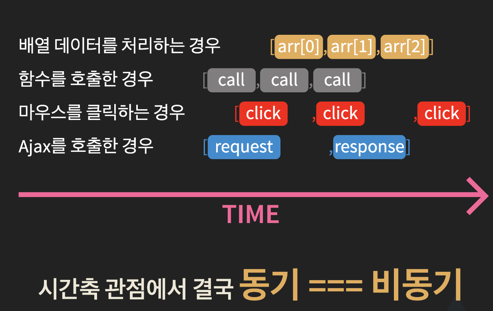

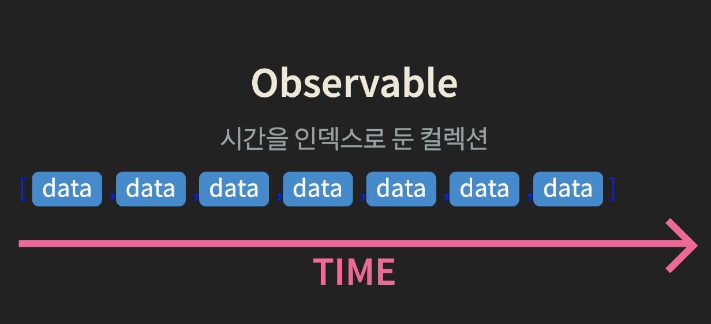

- 동기/비동기 처리를 따로 처리를 해줘야하는 번거로움을 해결이 가능하다.

## RxJS 내제된 개념

### Reactive Programing

- 기본 실행 모델의 변경사항을 데이터 흐름(observable)을 통해서 자동으로 전파(push)한다는 의미(polling, pull 방식X)

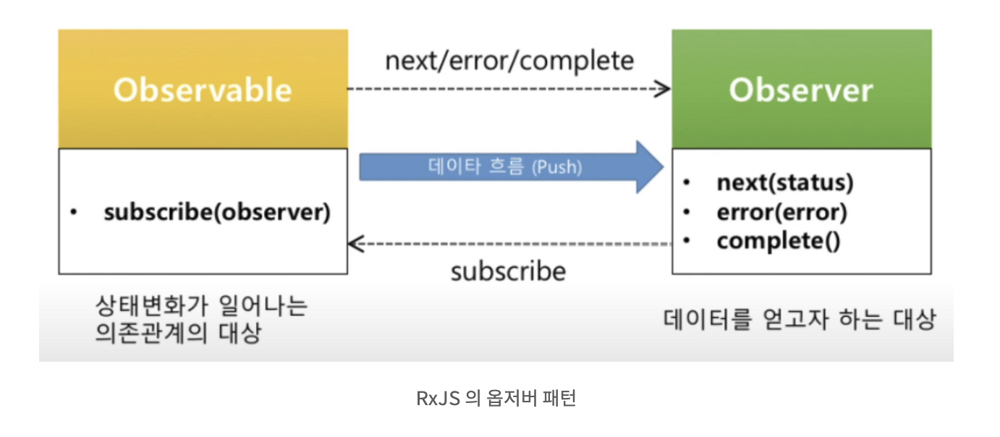

### 고차함수

- 함수를 인자로 받거나 결과를 함수로 반환하는 함수
- RxJs에서는 operator(filter, map, reduce 등등) 제공

데이터 전달에 대한 데이터 플로우

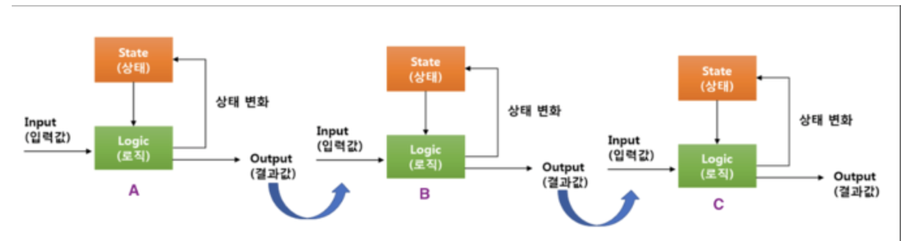

예) A output → B Input, B output → C Input, C output

어떻게 하면 일관된 방법으로 데이터를 전달하고 결과값을 얻어낼 수 있을까?

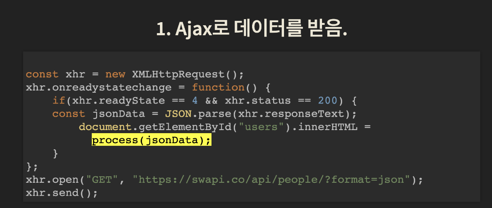

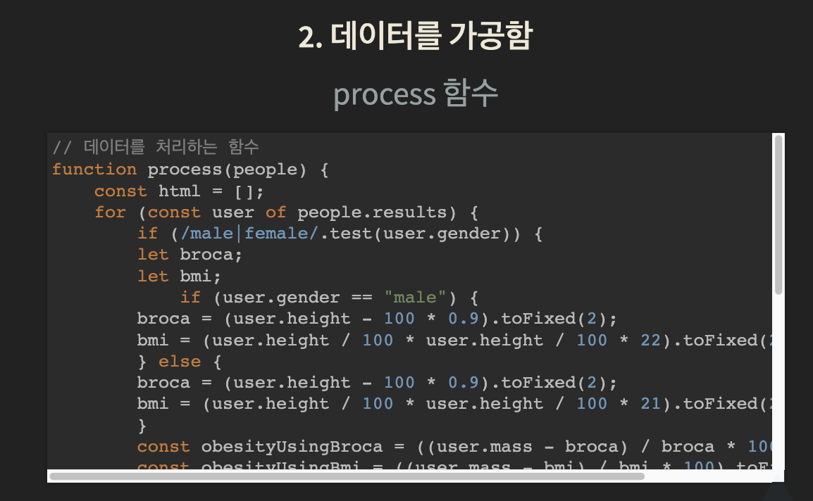

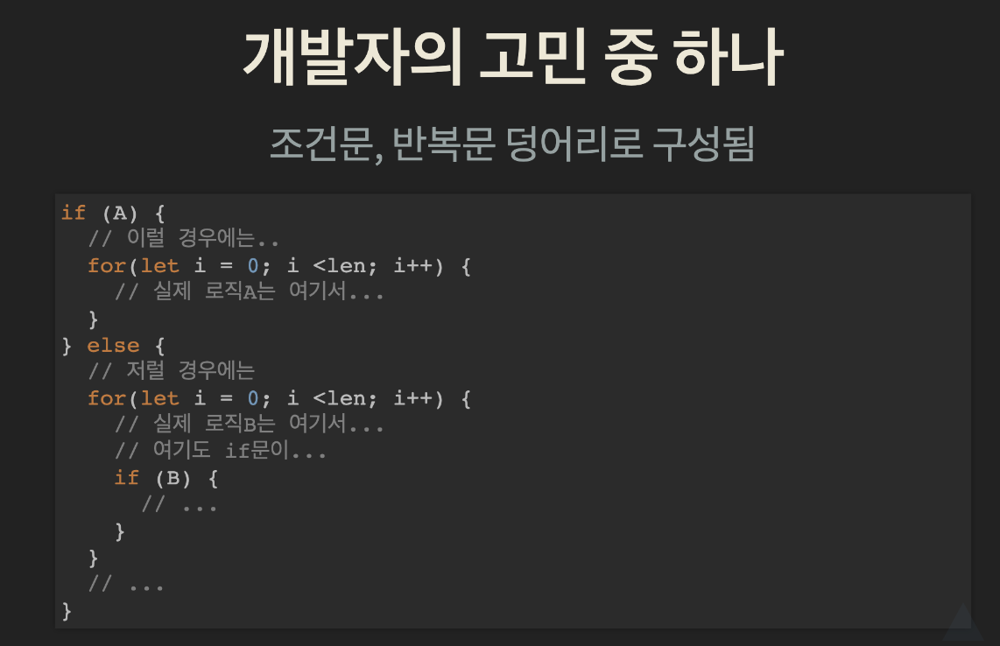

### 조건문은 코드의 흐름을 분리/반복문은 코드의 가독성 낮게/비즈니스 로직 코드에 파묻힘

### 고차함수 사용예)

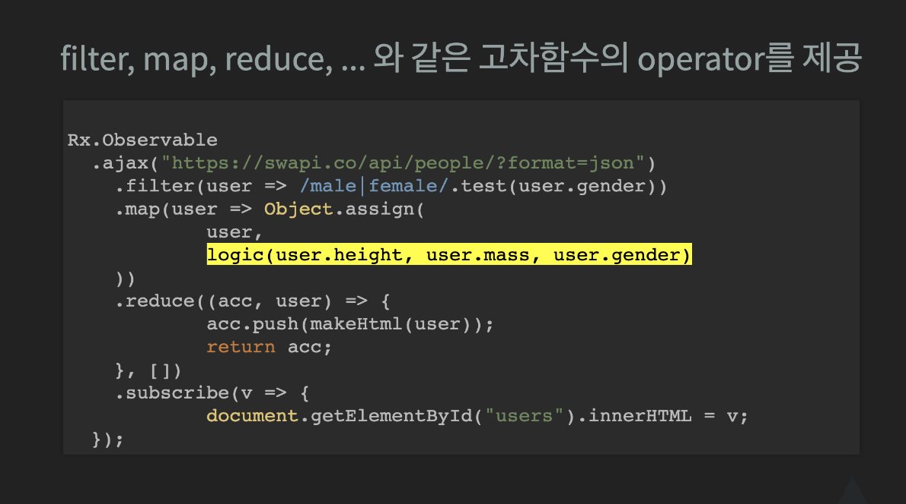

## 순수함수(함수형 프로그래밍을 지향한다.)

- 같은 입력이 주어지면, 같은 출력을 반환한다.
- Side Effect(부수적 효과) 없어야한다.
- 외부의 데이터에 의존하지 않아야 한다.

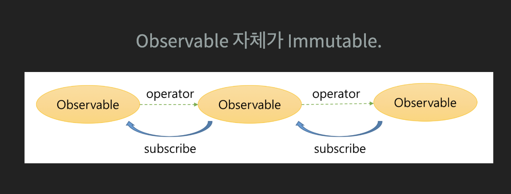

- operator를 통해서 나온 observable도 독립적인 객체이다.

Rx

### **RxJS 개발 프로세스 ⚙️**

> 이것 역시 외운다..! 결국 이 사이클로 RxJS를 사용하니까.

- 데이터 소스를 Observable로 변경한다. (from, of, fromEvent…)

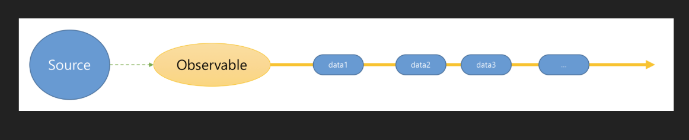

- 오퍼레이터를 통해 데이터를 변경하거나 추출한다.
  - 또는 여러개의 Observable을 하나의 Observable로 합치거나
  - 하나의 Observable을 여러 개의 Observable로 만든다.

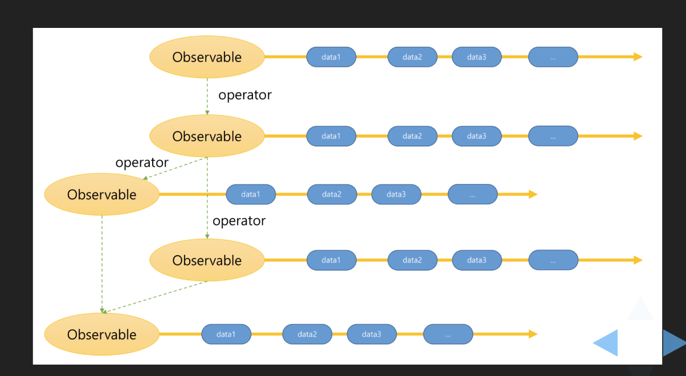

- 원하는 데이터를 받아 처리하는 Observer를 만든다.


- Observable의 subscribe를 통해 Observer를 등록한다.

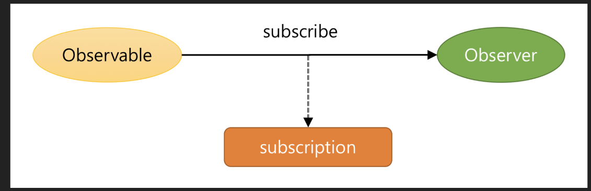

- Observable 구독을 정지하고 자원을 해지한다.

```jsx
subscription.unsubscribe();
```

## **RxJS Observable Lifecycle**

1. **생성**Observable.create()생성시점에는 어떠한 이벤트도 발생되지 않는다.
2. **구독**Observable.subscribe()구독시점에 이벤트를 구독할 수 있다.
3. **실행**observer.next()실행시점에 이벤트를 구독하고 있는 대상에게 값을 전달한다.
4. **구독 해제**observer.complete()Observable.unsubscribe()구독 해제 시점에 구독하고 있는 모든 대상의 구독을 종료한다.

## RxJS Scheduler

- **자바스크립트 비동기 처리 과정과 Rxjs Scheduler**
  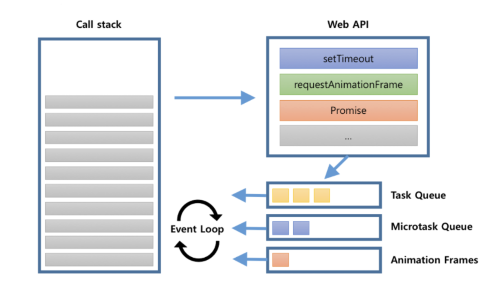

```jsx
console.log("script start");

setTimeout(function() {
  console.log("setTimeout");
}, 0);

Promise.resolve().then(function() {
  console.log("promise1");
}).then(function() {
  console.log("promise2");
});

requestAnimationFrame(function {
  console.log("requestAnimationFrame");
});
console.log("script end");

------
script start
script end
promise1
promose2
requestAnimationFrame
setTimeout
```

**Rxjs Scheduler 설명**

**queueScheduler** : 태스크 큐. setTimeout, setInteravl로 생각하면 편함.

**asapScheduler** : 마이크로 태스크 큐.

**animationFrameScheduler** : requestAnimationFrame임.

**queueScheduler** : 곧바로 콜스택에 담김. 사용할 일이 별로 없음.

→ [https://minjung-jeon.github.io/scheduler/](https://minjung-jeon.github.io/scheduler/)

pipe 적용을 위한 함수

SubscribeOn: **옵저버블** 또는 이를 처리할 **연산자**를 실행할 스케줄러 지정

ObserverOn: **구독자**에게 알림을 보낼 때 사용할 스케줄러 지정

```jsx
const { of, asyncScheduler } = rxjs
const { subscribeOn, observeOn, tap } = rxjs.operators

const tapper = x => console.log(`${x} IN`)
const observer = x => console.log(`${x} OUT`)

of(1, 2, 3).pipe(
  tap(tapper),
  subscribeOn(asyncScheduler)
).subscribe(observer)

of(4, 5, 6).pipe(
  tap(tapper),
).subscribe(observer)

of('A', 'B', 'C').pipe(
  tap(tapper),
  observeOn(asyncScheduler)
).subscribe(observer)

of('D', 'E', 'F').pipe(
  tap(tapper),
).subscribe(observer)

-----
"4 IN"
"4 OUT"
"5 IN"
"5 OUT"
"6 IN"
"6 OUT"
"A IN"
"B IN"
"C IN"
"D IN"
"D OUT"
"E IN"
"E OUT"
"F IN"
"F OUT"
"1 IN" -> subscribeOn
"1 OUT"
"2 IN"
"2 OUT"
"3 IN"
"3 OUT"
"A OUT" --> observeOn
"B OUT"
"C OUT"
```

## Promise vs. Observable

### **실행 시점**

- Promise는 객체를 생성할 때 바로 실행되어 즉시 로딩(eager)이라 부른다. 모든 `then()`은 같은 계산 값을 공유한다.

```jsx
// 최초 실행 (생성 및 실행)
let promise = new Promise((resolve, reject) => {
  // ...
});
promise.then(value => {
  // 결과 처리
});
```

- Observable은 소비자가 구독(subscription)하기 전까지는 실행되지 않아 지연 로딩(lazy)이라 부른다. `subscribe()`는 여러 번 호출될 수 있으며, 각각의 구독은 모두 자신만의 계산 값을 갖고 있다.

```jsx
import { Observable } from 'rxjs';
// 선언 (생성)
const observable$ = new Observable(observer => {
  // ...
});

// 최초 실행 (구독)
observable$.subscribe(value => {
  // observer 처리
});
```

### **return 개수**

- Promise는 하나만 보낼 수 있으며, 여러 개 보낼 경우 나중에 보낸 건 무시된다.

```jsx
const promise = new Promise(resolve => {
  resolve(1);
  resolve(2); // 무시
});
promise.then(console.log); // output: 1
```

- Observable은 데이터를 여러 개 보낼 수 있다.

```jsx
const observable$ = new Observable(observer => {
  observer.next(1);
  observer.next(2);
});
observable$.subscribe(console.log); // output: 1 2
```

### **조작과 반환**

- Promise는 `then()` 하나로 데이터의 조작과 반환을 같이 진행한다.

```jsx
promise.then(v => 2 * v);
```

- Observable은 데이터의 조작과 구독(반환)을 나눌 수 있다. 오직 구독자가 있을 때만 subscriber 함수가 실행되어 값을 계산한다. 다른 곳에서 데이터를 복잡하게 가공해야 한다면 Observable이 더 효율적이다.

```jsx
observable$.pipe(map(v => 2 * v));
```

### **취소(해제)**

- Promise는 실행 도중에 취소할 수 없지만, Observable은 구독을 취소(해제)할 수 있다. 구독 취소는 이벤트 리스터가 받을 값을 제거하고, subscriber 함수에게 취소하라고 알린다.

```jsx
const subscription = observable$.subscribe(() => {
  // ...
});
subscription.unsubscribe();
```

## 오퍼레이터(Operator)

파이프형 연산자는 Observable을 input처럼 취해서 다른 Observable을 반환하는 함수

- **Operator는 항상 새로운 Observable을 만든다.**
- **Operator는 항상 Observable을 반환 한다.**
- **Operator이전의 Source Observable에 대해서는 Immutable해야 한다.**

```jsx
// ① 옵저버블 생성
const observable$ = from([1, 2, 3, 4, 5, 6, 7, 8, 9, 10]);

const subscription = observable$
  .pipe(
    // ② 오퍼레이터에 의한 옵저버블 변형
    map(item => item * 2), // 2, 4, 6, 8, 10
    filter(item => item > 5), // 6, 8, 10
    tap(item => console.log(item)), // 6, 8, 10
  )
  // ③ 옵저버블 구독
  .subscribe(
    // next
    value => this.values.push(value),
    // error
    error => console.log(error),
    // complete
    () => console.log('Streaming finished'),
  );
```

## Observable 스트림 생성기

[https://www.yalco.kr/@rxjs/1-1/](https://www.yalco.kr/@rxjs/1-1/)

## Observer(구독자)에게 발행물 구독시키기

[https://www.yalco.kr/@rxjs/1-2/](https://www.yalco.kr/@rxjs/1-2/)

## Operator 사용해보기

[https://www.yalco.kr/@rxjs/1-3/](https://www.yalco.kr/@rxjs/1-3/)

```jsx
const callFunc = (data) => {
  console.log(data);
};

function App() {
  range(1, 10).pipe(
    tap(n => console.log(n)),
    mergeMap(index => ajax(
      `https://jsonplaceholder.typicode.com/todos/${index}`
    ).pipe(
      pluck('response', 'title'),
      retry(3)
    )
    , 4),
    toArray()
  ).subscribe(callFunc);
}

------
1
2
3
4
5
6
7
8
9
10
[
0: "et porro tempora"
1: "quis ut nam facilis et officia qui"
2: "delectus aut autem"
3: "fugiat veniam minus"
4: "laboriosam mollitia et enim quasi adipisci quia provident illum"
5: "qui ullam ratione quibusdam voluptatem quia omnis"
6: "quo adipisci enim quam ut ab"
7: "illo expedita consequatur quia in"
8: "molestiae perspiciatis ipsa"
9: "illo est ratione doloremque quia maiores aut"
]
```

## Subject 사용해보기

[https://www.yalco.kr/@rxjs/1-4/](https://www.yalco.kr/@rxjs/1-4/)

### **BehaviorSubject**

마지막 값을 저장 후 추가 구독자에게 발행

```jsx
const { BehaviorSubject } = rxjs
const subject = new BehaviorSubject(0) // 초기값이 있음

subject.subscribe((x) => console.log('A: ' + x))

subject.next(1)
subject.next(2)
subject.next(3)

subject.subscribe((x) => console.log('B: ' + x))

subject.next(4)
subject.next(5)

--------
"A: 0"
"A: 1"
"A: 2"
"A: 3"
"B: 3"
"A: 4"
"B: 4"
"A: 5"
"B: 5"
```

### **ReplaySubject**

마지막 N개 값을 저장 후 추가 구독자에게 발행

```jsx
const { ReplaySubject } = rxjs
const subject = new ReplaySubject(3) // 마지막 3개 값 저장

subject.subscribe((x) => console.log('A: ' + x))

subject.next(1)
subject.next(2)
subject.next(3)
subject.next(4)
subject.next(5)

subject.subscribe((x) => console.log('B: ' + x))

subject.next(6)
subject.next(7)

-------
"A: 1"
"A: 2"
"A: 3"
"A: 4"
"A: 5"
"B: 3"
"B: 4"
"B: 5"
"A: 6"
"B: 6"
"A: 7"
"B: 7"
```

### **AsyncSubject**

Complete 후의 마지막 값만 발행

```jsx
const { AsyncSubject } = rxjs
const subject = new AsyncSubject()

subject.subscribe((x) => console.log('A: ' + x))

subject.next(1)
subject.next(2)
subject.next(3)

subject.subscribe((x) => console.log('B: ' + x))

subject.next(4)
subject.next(5)

subject.subscribe((x) => console.log('C: ' + x))

subject.next(6)
subject.next(7)
subject.complete()

----------
"A: 7"
"B: 7"
"C: 7"
```

# 참고자료

[https://pks2974.medium.com/rxjs-간단정리-41f67c37e028](https://pks2974.medium.com/rxjs-%EA%B0%84%EB%8B%A8%EC%A0%95%EB%A6%AC-41f67c37e028)

[https://gracefullight.dev/2019/04/30/RxJS의-모든-것/](https://gracefullight.dev/2019/04/30/RxJS%EC%9D%98-%EB%AA%A8%EB%93%A0-%EA%B2%83/)

[https://abelog.netlify.app/RxJS/rxjs-기초,-핵심-🐉/](https://abelog.netlify.app/RxJS/rxjs-%EA%B8%B0%EC%B4%88,-%ED%95%B5%EC%8B%AC-%F0%9F%90%89/)

[https://whitemackerel.tistory.com/54](https://whitemackerel.tistory.com/54)

[RxJS-1](https://www.notion.so/RxJS-1-aea361c049a146b4bd10c98eefc7aaa7)
