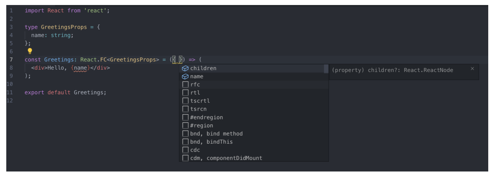
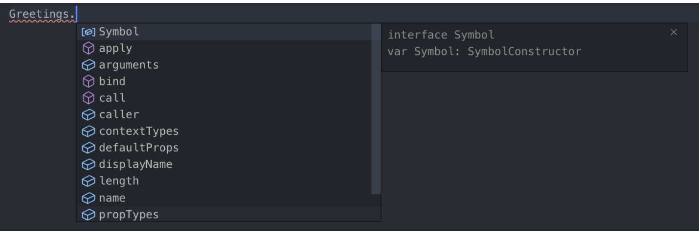

# Why should we use TypeScript?

**TypeScript makes code easier to read.**

- By explicitly annotating types for variables, return values, interfaces, and so on, the code becomes easier to understand.
  **TypeScript reduces developer mistakes.**
- It's easy to catch errors while writing code or during the compile step.
- You can respond to errors quickly and minimize side effects.
  **Make more active use of the IDE (autocompletion, type checking)**
- With TypeScript, autocompletion works remarkably well.
- When calling a function, you can tell what parameters it requires and what value it returns without having to open the code separately.
- For React components, you can know the props/state values in advance.
  **Support for object-oriented programming**
- Powerful object-oriented programming support such as interfaces, generics, and overloading/overriding makes it easy to structure the codebase of large, complex projects.

# TypeScript directory structure

```bash
┣ components
 ┃ ┣ types // types folder when defining types for multiple components,
 ┃ ┃ ┗ todos.ts
 ┃ ┗ TodosContentItemComponent.tsx // if it's limited to a component, declare it in the Component itself.
 ┣ containers
 ┃ ┣ types // types folder when defining types for multiple containers
 ┃ ┃ ┗ todos.ts
 ┃ ┣ RootContainer.tsx
 ┃ ┗ TodoContentContainer.tsx // if it's limited to a container, declare it in the Container itself.
 ┣ services
 ┃ ┣ __test__
 ┃ ┃ ┗ todo.service.tsx
 ┃ ┗ index.jsx
 ┣ states
 ┃ ┣ constants
 ┃ ┃ ┗ index.ts
 ┃ ┣ features
 ┃ ┃ ┣ __test__
 ┃ ┃ ┃ ┗ Todo.test.tsx
 ┃ ┃ ┗ index.ts
 ┃ ┣ store
 ┃ ┃ ┗ index.ts
 ┃ ┗ types // state types folder
 ┃ ┃ ┗ index.ts
 ┗ types
 ┃ ┗ index.ts // root path types folder
```

Reference pages

- [https://github.com/react-hook-form/react-hook-form/tree/master/src/types](https://github.com/react-hook-form/react-hook-form/tree/master/src/types)
- [https://github.com/mobxjs/mobx/blob/main/packages/mobx/flow-typed/mobx.js](https://github.com/mobxjs/mobx/blob/main/packages/mobx/flow-typed/mobx.js)

# interface vs type

```tsx
// type
(O) export type PrimitiveType = string | number | boolean | undefined | null | symbol;
(X) export type SomeMembmerType = {
  name: string;
  age: number;
  address: string;
  tier: string;
};

-----------------------------------------

// interface
(O) export interface ISomeMemberInterface {
  name: string;
  age: number;
  address: string;
  tier: string;
}
```

- Let's decide when to use type versus interface!!
  - The latest version of tslint provides a guide for this.
    - Use an interface instead of a type literal.tslint(interface-over-type-literal)
      - A guide was added recommending that you use type only for literal types and use interfaces for Object-shaped types.
  - **Let's use interfaces for everything except literal types (i.e., primitive types, custom values).**
  - Reference page: [https://luckyyowu.tistory.com/401](https://luckyyowu.tistory.com/401)

**Similarities**

- Named types are used the same way for both Type and Interface
- Index signatures can be used
- Function types can be declared
- Generics can be used
- Both can be extended
  - interface extends with the extends keyword, while type extends with &

**Differences**

- Union types
  - Possible with Type, but not with Interface
    - type yesOrNo = ‘yes’ | ‘no’
  - You cannot extend a union type with an interface
- Tuple and array types

  - type: easy to use and convenient to extend; interface: somewhat complicated and inconvenient

  ```tsx
  type Pair = [number, number];
  type StringList = string[];
  type NamedNums = [string, …number[]]

  interface Tuple {
    0: number;
    1: number;
    length: 2;
  }
  const t: Tuple =[10,20]
  ```

- Augmentation feature:

  - A feature available only in interfaces, allowing you to add properties.

  ```tsx
  interface IState {
    name: string;
    capital: string;
  }
  interface IState {
    population: number;
  }
  // doing this makes it include all three: name, capital, and population
  ```

# React.FC vs Function Component

```tsx
interface Props {
  name: string;
}

// React.FC(0)
// defaultprops does not work(
const PrintName: React.FC<Props> = ({ name = '' }) => {
  return (
    <div>
      <p style={ fontWeight: props.priority ? 'bold' : 'normal' }>{name}</p>
    </div>
  );
};

// React function
const PrintName2 = ({ name }: Props) => {
  return (
    <div>
      <p style={ fontWeight: props.priority ? 'bold' : 'normal' }>{name}</p>
    </div>
  );
};

PrintName2.defaultProps = {
  name: '',
};
```

**Pros and cons of React.FC**

- Pros
  - props includes children by default
    
  - You get autocompletion when setting defaultProps, propTypes, and contextTypes
    
- Cons
  - Because children is always included, the type isn't explicit
  - defaultProps does not work

```
const Greetings: React.FC<GreetingsProps> = ({ name, mark = '!' }) => (
  <div>
    Hello, {name} {mark}
  </div>
);

```

- Reference page: [https://velog.io/@velopert/create-typescript-react-component](https://velog.io/@velopert/create-typescript-react-component)

# TypeScript official page: Do's and Don'ts guide

**General Types**

- Don’t
  - Never use the Number, String, Boolean, or Object types. These types refer to non-primitive boxed objects that are almost never used appropriately in JavaScript code.
- Do
  - Use number, string, and boolean.

```
/* WRONG */
function reverse(s: String): String;

/* OK */
function reverse(s: string): string;
```

**Callback Types**
**Return Types of Callbacks**

- Don’t
  - Don't use any as the return type of a callback whose value will be ignored.
- Do
  - Use void as the return type of a callback whose value will be ignored.

```
/* WRONG */
function fn(x: () => any) {
  x();
}

/* OK */
function fn(x: () => void) {
  x();
}

// Why? Because using void is safer as it prevents the mistake of using x's return type in an unverified way.
function fn(x: () => void) {
  var k = x(); // oops! meant to do something else
  k.doSomething(); // error, but would be OK if the return type had been 'any'
}

```

**Function Overloads**

- Don’t
  - Don't put a general signature before a more specific one.
- Do
  - Order signatures so that the general signature comes after the more specific ones.

```
/* WRONG */
declare function fn(x: unknown): unknown;
declare function fn(x: HTMLElement): number;
declare function fn(x: HTMLDivElement): string;
var myElem: HTMLDivElement;
var x = fn(myElem); // x: unknown, wat?

/* OK */
declare function fn(x: HTMLDivElement): string;
declare function fn(x: HTMLElement): number;
declare function fn(x: unknown): unknown;
var myElem: HTMLDivElement;
var x = fn(myElem); // x: string, :)
```

**Use Optional Parameters**

- Don’t
  - Don't write multiple signatures that differ only in trailing parameters.
- Do
  - Use optional parameters whenever possible.

```
/* WRONG */
interface Example {
  diff(one: string): number;
  diff(one: string, two: string): number;
  diff(one: string, two: string, three: boolean): number;
}

/* OK */
interface Example {
  diff(one: string, two?: string, three?: boolean): number;
}
```

Note that this approach is only possible when all signatures have the same return type!!

### Use Union Types

- Don’t
  - Don't use overloading when only one parameter type differs.
- Do
  - Use union types whenever possible.

```
/* WRONG */
interface Moment {
  utcOffset(): number;
  utcOffset(b: number): Moment;
  utcOffset(b: string): Moment;
}

/* OK */
interface Moment {
  utcOffset(): number;
  utcOffset(b: number | string): Moment;
}
```

- Reference pages:

  - [https://www.typescriptlang.org/docs/handbook/declaration-files/do-s-and-don-ts.html](https://www.typescriptlang.org/docs/handbook/declaration-files/do-s-and-don-ts.html)
  - [https://nukeguys.github.io/dev/ts-do-and-dont/](https://nukeguys.github.io/dev/ts-do-and-dont/)

# type assertion

```tsx
// because it's inferred as an empty object with no properties..
var foo = {};
foo.bar = 123; // error: property 'bar' does not exist on `{}`
foo.bas = 'hello'; // error: property 'bar' does not exist on `{}`

interface Foo {
  bar: number;
  bas: string;
}
var foo = {} as Foo; // resolved with type assertion
foo.bar = 123;
foo.bas = 'hello';
```

# interface

**interface generic**

```tsx
interface Dropdown<T, G> {
  value: T;
  selected: G;
}

const obj2: Dropdown<string, boolean> = { value: 'abc', selected: false };
```

interface extends

```tsx
interface Person {
  name: string;
}
interface Drinker extends Person {
  drink: string;
}
interface Developer extends Drinker {
  skill: string;
}
let fe = {} as Developer;
fe.name = 'hong';
fe.skill = 'TypeScript';
fe.drink = 'Beer';
```

interface readonly

```tsx
interface ReadOnly {
  readonly test: string;
}

let params: ReadOnly = {
  test: 'test3',
};
params.test = 'test4'; // error!
```

# type-aliases

**generic**

```tsx
type Developer = {
  name: string;
  skill: string;
};

type typeGeneric<T> = {
  name: T;
};
```

A type alias doesn't create a brand-new type value; rather, it's like giving a name to a defined type so that developers can observe it more easily.
That's why when you define an interface and hover the cursor over it, it shows `interface xx`, whereas a type shows it in detail as `type xx = {xx: xx}`.
Extension

```tsx
type test1 = { name: string };

type test2 = test1 & { age: number };
```

Removing properties

```tsx
type XYZ = {
  x: number;
  y: number;
  z: number;
};
// suppose we want to exclude the y and z properties to make it look like below
type X = { x: number };

// ts 3.5 and above use omit
type X = Omit<XYZ, 'x' | 'y'>;
```

# null, undefined

**The postfix ! : the assertion operator asserts that the operand is not null or undefined**

```tsx
this.todosStore = props.store!; // the postfix exclamation mark (!) assertion operator asserts that the operand is not null or undefined
```

**Optional chaining**

```tsx
const deathsList = $('.deaths-list');
deathsList?.appendChild(li);
```

**Using type assertion**

```tsx
const deathsList = $('.deaths-list');
deathsList!.innerHTML = null; // using the type assertion !

// or use as to forcibly inject the type, telling ts that it's not null.
const deathsList = $('.deaths-list') as HTMLDivElement;
deathsList.innerHTML = null; // using the type assertion !
```

**Filtering out null with an if statement**

```tsx
const deathsList = $('.deaths-list');

if (!deathsList) return;

deathsList.innerHTML = null;
```

# utility type

## Partial<T>

    Lets you define a type that satisfies a subset of a specific type.

    ```tsx
    interface Address {
      email: string;
      address: string;
    }

    type MyEmail = Partial<Address>;
    const me: MyEmail = {}; // allowed
    const you: MyEmail = { email: 'gmm117@naver.com' }; // allowed
    const all: MyEmail = { email: 'gmm117@naver.com', address: 'seoul' }; // allowed
    ```

## Exclude<T, U>

    Constructs a type by excluding from T the intersecting properties that are assignable to U.
    ```tsx
    type T0 = Exclude<'a' | 'b' | 'c', 'a'>; // "b" | "c"
    type T1 = Exclude<'a' | 'b' | 'c', 'a' | 'b'>; // "c"
    type T2 = Exclude<string | number | (() => void), Function>; // string | number
    ```

## Extract<T, U>

    Constructs a type by extracting from T the intersecting properties that are assignable to U.
    ```tsx
    type T0 = Extract<'a' | 'b' | 'c', 'a' | 'f'>; // "a"
    type T1 = Extract<string | number | (() => void), Function>; // () => void
    ```

## NonNullable<T>

    Constructs a type by excluding null and undefined from T.
    ```tsx
    type T0 = NonNullable<string | number | undefined>; // string | number
    type T1 = NonNullable<string[] | null | undefined>; // string[]
    ```

## Readonly<T>

    Constructs a type with all properties of T set to readonly, meaning the properties of the resulting type cannot be reassigned.

    ```tsx
    interface Todo {
      title: string;
    }

    const todo: Readonly<Todo> = {
      title: 'Delete inactive users',
    };

    todo.title = 'Hello'; // error: cannot reassign a read-only property
    ```

## Pick<T>

    Defines a type by selecting a few properties from a specific type

    ```tsx
    interface Address {
      email: string;
      address: string;
    }

    type MyEmail = Pick<Address, 'email'>;
    // uses only part of it, the email property
    ```

## Omit<T>

    Defines a type with certain properties removed (the opposite of pick)

    ```tsx
    interface Address {
      email: string;
      address: string;
    }

    type MyEmail = Omit<Address, 'address'>;
    // removes the address property
    ```

## ReturnType<T>

    Constructs a type consisting of the return type of function T.
    ```tsx
    declare function f1(): { a: number; b: string };
    type T0 = ReturnType<() => string>; // string
    type T1 = ReturnType<(s: string) => void>; // void
    type T2 = ReturnType<<T>() => T>; // {}
    type T3 = ReturnType<<T extends U, U extends number[]>() => T>; // number[]
    type T4 = ReturnType<typeof f1>; // { a: number, b: string }
    type T5 = ReturnType<any>; // any
    type T6 = ReturnType<never>; // any
    ```

- InstanceType<T>
  Constructs a type consisting of the instance type of a constructor function type T.

  ```tsx
  class C {
    x = 0;
    y = 0;
  }

  type T0 = InstanceType<typeof C>; // C
  type T1 = InstanceType<any>; // any
  type T2 = InstanceType<never>; // any
  ```

- Required<T>
  Constructs a type with all properties of T set to required.

  ```tsx
  interface Props {
    a?: number;
    b?: string;
  }

  const obj: Props = { a: 5 }; // succeeds

  const obj2: Required<Props> = { a: 5 }; // error: property 'b' is missing
  ```

# Let's specify the essential tsconfig options

When the strictNullChecks option is on

```tsx
// when --strictNullChecks is turned off in the compiler options, null and undefined can each be used as values of different types.
"compilerOptions": {
    "strictNullChecks": true,
}

const a: null = null;
const b: string = a; // error when strictNullChecks is turned on
```

When the noImplicitAny option is on

```tsx
// if a type is not explicitly specified and TypeScript infers it as 'any', a compile error occurs.
"compilerOptions": {
    "noImplicitAny": true,
}

// error TS7006: Parameter 'a' implicitly has an 'any' type
function f3(a) {
  if(a > 0) {
    return a*38
  }
}
```

When the noImplicitReturns option is on

```tsx
// if not all code paths within a function return a value, a compile error is raised.
"compilerOptions": {
    "noImplicitReturns": true,
}

// you must explicitly return in all code paths.
// error TS7030: Not all code paths returns a value
function f5(a) {
  if(a > 0) {
    return a*38
  }
}
```

# Reference pages

- [https://radlohead.gitbook.io/typescript-deep-dive/type-system/type-assertion](https://radlohead.gitbook.io/typescript-deep-dive/type-system/type-assertion)
- [https://typescript-kr.github.io/pages/utility-types.html#readonlyt](https://typescript-kr.github.io/pages/utility-types.html#readonlyt)
