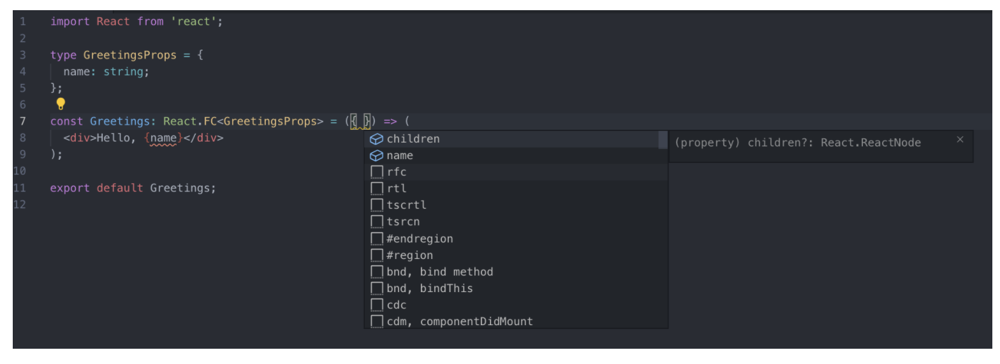
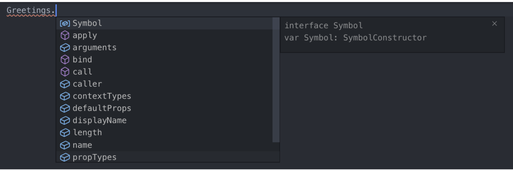

# 타입스크립트는 왜 사용해야하는 걸까??

**Typescript는 코드를 보다 읽기 쉽게 만든다.**

- 변수,리턴,인터페이스 등등 타입을 명시함으로써 코드에 대한 이해가 쉬워진다.
  **Typescript는 개발자의 실수를 줄여준다.**
- 코드 작성 중/컴파일 단계에서 에러 발견이 쉽다.
- 에러에 대한 대응을 빠르게 가능하며, 사이드 이펙트를 최소화 가능하다.
  **IDE 를 더욱 더 적극적으로 활용 (자동완성, 타입확인)**
- TypeScript 를 사용하면 자동완성이 굉장히 잘됩니다.
- 함수를 사용 할 때 해당 함수가 어떤 파라미터를 필요로 하는지, 그리고 어떤 값을 반환하는지 코드를 따로 열어보지 않아도 알 수 있습니다.
- 리액트 컴포넌트의 경우 props/state 값을 미리 알 수 있다.
  **객체지향 프로그래밍 지원**
- 인터페이스, 제네릭, 오버로딩/오버라이딩 등과 같은 강력한 객체지향 프로그래밍 지원은 크고 복잡한 프로젝트의 코드 기반을 쉽게 구성이 가능하다.

# 타입스크립트 디렉토리 구조

```bash
┣ components
 ┃ ┣ types // 다중 component type을 지정할 경우 types folder,
 ┃ ┃ ┗ todos.ts
 ┃ ┗ TodosContentItemComponent.tsx // 컴포넌트에 제한이 된다면 Component 자체에서 명시한다.
 ┣ containers
 ┃ ┣ types // 다중 container type을 지정할 경우 types folder
 ┃ ┃ ┗ todos.ts
 ┃ ┣ RootContainer.tsx
 ┃ ┗ TodoContentContainer.tsx // 컨테이너에 제한이 된다면 Container 자체에서 명시한다.
 ┣ services
 ┃ ┣ __test__
 ┃ ┃ ┗ todo.service.tsx
 ┃ ┗ index.jsx
 ┣ states
 ┃ ┣ constants
 ┃ ┃ ┗ index.ts
 ┃ ┣ features
 ┃ ┃ ┣ __test__
 ┃ ┃ ┃ ┗ Todo.test.tsx
 ┃ ┃ ┗ index.ts
 ┃ ┣ store
 ┃ ┃ ┗ index.ts
 ┃ ┗ types // state types folder
 ┃ ┃ ┗ index.ts
 ┗ types
 ┃ ┗ index.ts // root path types folder
```

참고페이지

- [https://github.com/react-hook-form/react-hook-form/tree/master/src/types](https://github.com/react-hook-form/react-hook-form/tree/master/src/types)
- [https://github.com/mobxjs/mobx/blob/main/packages/mobx/flow-typed/mobx.js](https://github.com/mobxjs/mobx/blob/main/packages/mobx/flow-typed/mobx.js)

# interface vs type

```tsx
// type
(O) export type PrimitiveType = string | number | boolean | undefined | null | symbol;
(X) export type SomeMembmerType = {
  name: string;
  age: number;
  address: string;
  tier: string;
};

-----------------------------------------

// interface
(O) export interface ISomeMemberInterface {
  name: string;
  age: number;
  address: string;
  tier: string;
}
```

- 어떤 상황일 때 type, interface로 사용할 지 여부를 결정해보자!!
  - lastest 버전의 tslint에서 가이드를 제공해주고 있다.
    - Use an interface instead of a type literal.tslint(interface-over-type-literal)
      - 타입은 리터럴 타입에서만 사용하고 Object 형태의 타입은 인터페이스를 쓰라는 가이드가 추가되었습니다.
  - **리터럴 타입(즉, primitive type, custom value)외에는 interface를 사용해 봅시다.**
  - 참고페이지: [https://luckyyowu.tistory.com/401](https://luckyyowu.tistory.com/401)

**동일한점**

- 명명된 타입은 Type, Interface 동일하게 사용됨
- 인덱스 시그니처 사용 가능
- 함수 타입 선언 가능
- 제네릭 사용가능
- 확장 가능
  - interface는 extends 키워드로 type은 & 로 확장

**다른점**

- 유니온 타입
  - Type으로는 가능 하지만, Interface는 할 수 없음
    - type yesOrNo = ‘yes’ | ‘no’
  - 유니온 타입을 확장하고 싶을때 interface로는 안됨
- 튜플과 배열 타입

  - type : 사용하기 쉽고 확장이 편함, interface: 다소 복잡하고 불편함

  ```tsx
  type Pair = [number, number];
  type StringList = string[];
  type NamedNums = [string, …number[]]

  interface Tuple {
    0: number;
    1: number;
    length: 2;
  }
  const t: Tuple =[10,20]
  ```

- 보강 augment 기능:

  - 인터페이스에만 있는 기능으로 속성을 추가할 수 있음.

  ```tsx
  interface IState {
    name: string;
    capital: string;
  }
  interface IState {
    population: number;
  }
  // 이렇게 하면 name, capital, population 세개를 모두 포함하게 됨
  ```

# React.FC vs Function Component

```tsx
interface Props {
  name: string;
}

// React.FC(0)
// defaultprops 동작하지 않음(
const PrintName: React.FC<Props> = ({ name = '' }) => {
  return (
    <div>
      <p style={{ fontWeight: props.priority ? 'bold' : 'normal' }}>{name}</p>
    </div>
  );
};

// React function
const PrintName2 = ({ name }: Props) => {
  return (
    <div>
      <p style={{ fontWeight: props.priority ? 'bold' : 'normal' }}>{name}</p>
    </div>
  );
};

PrintName2.defaultProps = {
  name: '',
};
```

**React.FC 의 장단점**

- 장점
  - props 에 기본적으로 children 이 들어가 있다는 것 있음
    
  - defaultProps, propTypes, contextTypes 를 설정 할 때 자동완성 됨
    
- 단점
  - children이 무조건 들어가 있기 때문에 타입이 명백하지 않음
  - defaultProps 동작하지 않음

```
const Greetings: React.FC<GreetingsProps> = ({ name, mark = '!' }) => (
  <div>
    Hello, {name} {mark}
  </div>
);

```

- 참고페이지: [https://velog.io/@velopert/create-typescript-react-component](https://velog.io/@velopert/create-typescript-react-component)

# typescript 공식페이지: Do's and Don'ts 가이드

**General Types**

- Don’t
  - Number, String, Boolean 또는 Object 타입을 절대 사용하지 마라. 이 타입들은 JavaScript 코드에서 대부분 적절하지 않게 사용되는 non-primitive boxed object1들을 의미한다.
- Do
  - number, string 그리고 boolean을 사용하라.

```
/* WRONG */
function reverse(s: String): String;

/* OK */
function reverse(s: string): string;
```

**Callback Types**
**Return Types of Callbacks**

- Don’t
  - 값이 무시될 콜백의 리턴타입으로 any를 사용하지 마라.
- Do
  - 값이 무시될 콜백의 리턴타입으로 void를 사용하라.

```
/* WRONG */
function fn(x: () => any) {
  x();
}

/* OK */
function fn(x: () => void) {
  x();
}

// 이유는? 확인되지 않는 방법으로 x의 리턴타입을 사용하는 실수를 방지해주기 때문에 void를 사용하는 것이 더 안전하다.
function fn(x: () => void) {
  var k = x(); // oops! meant to do something else
  k.doSomething(); // error, but would be OK if the return type had been 'any'
}

```

**Function Overloads**

- Don’t
  - 더 구체적인 시그니처 전에 일반적인 시그니처를 두지 마라.
- Do
  - 더 구체적인 시그니처 다음에 일반적인 시그니처를 두도록 정렬하라.

```
/* WRONG */
declare function fn(x: unknown): unknown;
declare function fn(x: HTMLElement): number;
declare function fn(x: HTMLDivElement): string;
var myElem: HTMLDivElement;
var x = fn(myElem); // x: unknown, wat?

/* OK */
declare function fn(x: HTMLDivElement): string;
declare function fn(x: HTMLElement): number;
declare function fn(x: unknown): unknown;
var myElem: HTMLDivElement;
var x = fn(myElem); // x: string, :)
```

**Use Optional Parameters**

- Don’t
  - 뒤에 나오는 매개변수들만 다른 경우 여러 시그니처를 작성하지 마라.
- Do
  - 가능한 경우에는 선택적 매개변수를 사용하라.

```
/* WRONG */
interface Example {
  diff(one: string): number;
  diff(one: string, two: string): number;
  diff(one: string, two: string, three: boolean): number;
}

/* OK */
interface Example {
  diff(one: string, two?: string, three?: boolean): number;
}
```

이 방법은 모든 시그니처의 리턴타입이 같은 경우에만 가능하다는 것을 주의!!

### Use Union Types

- Don’t
  - 오직 하나의 매개변수 타입이 다른 경우에는 오버로딩을 사용하지 마라.
- Do
  - 가능한 경우에는 유니온 타입을 사용하라.

```
/* WRONG */
interface Moment {
  utcOffset(): number;
  utcOffset(b: number): Moment;
  utcOffset(b: string): Moment;
}

/* OK */
interface Moment {
  utcOffset(): number;
  utcOffset(b: number | string): Moment;
}
```

- 참고페이지:

  - [https://www.typescriptlang.org/docs/handbook/declaration-files/do-s-and-don-ts.html](https://www.typescriptlang.org/docs/handbook/declaration-files/do-s-and-don-ts.html)
  - [https://nukeguys.github.io/dev/ts-do-and-dont/](https://nukeguys.github.io/dev/ts-do-and-dont/)

# type assertion

```tsx
// 속성이 하나도 없는 빈 객체로 타입 추론이 되기 때문..
var foo = {};
foo.bar = 123; // 오류: 속성 'bar'가 `{}`에 존재하지 않음
foo.bas = 'hello'; // 오류: 속성 'bar'가 `{}`에 존재하지 않음

interface Foo {
  bar: number;
  bas: string;
}
var foo = {} as Foo; // type assertion(타입 표명) 해결
foo.bar = 123;
foo.bas = 'hello';
```

# interface

**interface generic**

```tsx
interface Dropdown<T, G> {
  value: T;
  selected: G;
}

const obj2: Dropdown<string, boolean> = { value: 'abc', selected: false };
```

interface extends

```tsx
interface Person {
  name: string;
}
interface Drinker extends Person {
  drink: string;
}
interface Developer extends Drinker {
  skill: string;
}
let fe = {} as Developer;
fe.name = 'hong';
fe.skill = 'TypeScript';
fe.drink = 'Beer';
```

interface readonly

```tsx
interface ReadOnly {
  readonly test: string;
}

let params: ReadOnly = {
  test: 'test3',
};
params.test = 'test4'; // error!
```

# type-aliases(타입 별칭)

**generic**

```tsx
type Developer = {
  name: string;
  skill: string;
};

type typeGeneric<T> = {
  name: T;
};
```

타입 별칭은 새로운 타입 값을 하나 생성하는 것이 아니라 정의한 타입에 대해 개발자가 쉽게 관찰하도록 이름을 부여하는 것과 같습니다.
그래서 interface를 정의하고 커서를 hover하면 interface xx 이렇게 나오지만 type은 type xx = {xx: xx}이렇게 상세하게 나오게 됩니다.
확장

```tsx
type test1 = { name: string };

type test2 = test1 & { age: number };
```

속성 제거

```tsx
type XYZ = {
  x: number;
  y: number;
  z: number;
};
// y, z 속성을 제외하여 아래처럼 만들고 싶다
type X = { x: number };

// ts 3.5 이상은 omit
type X = Omit<XYZ, 'x' | 'y'>;
```

# null,undefined

**접미 ! : 연산자인 단언 연산자는 해당 피연산자가 null, undeifned가 아니라고 단언**

```tsx
this.todosStore = props.store!; // 접미에 붙는 느낌표(!) 연산자인 단언 연산자는 해당 피연산자가 null, undeifned가 아니라고 단언
```

**옵셔널체이닝**

```tsx
const deathsList = $('.deaths-list');
deathsList?.appendChild(li);
```

**타입 단언 사용 (type assertion)**

```tsx
const deathsList = $('.deaths-list');
deathsList!.innerHTML = null; // 타입 단언 ! 사용

// 또는 as를 이용해 강제로 타입을 주입하여 null이 아니라는 것을 ts에게 알려줍니다.
const deathsList = $('.deaths-list') as HTMLDivElement;
deathsList.innerHTML = null; // 타입 단언 ! 사용
```

**if문으로 null 걸러냄**

```tsx
const deathsList = $('.deaths-list');

if (!deathsList) return;

deathsList.innerHTML = null;
```

# utility type

## Partial<T>

    특정 타입의 부분 집합을 만족하는 타입을 정의할 수 있습니다.

    ```tsx
    interface Address {
      email: string;
      address: string;
    }

    type MyEmail = Partial<Address>;
    const me: MyEmail = {}; // 가능
    const you: MyEmail = { email: 'gmm117@naver.com' }; // 가능
    const all: MyEmail = { email: 'gmm117@naver.com', address: 'seoul' }; // 가능
    ```

## Exclude<T, U>

    T에서 U에 할당할 수 있는 교집합 속성을 제외한 타입을 구성합니다.
    ```tsx
    type T0 = Exclude<'a' | 'b' | 'c', 'a'>; // "b" | "c"
    type T1 = Exclude<'a' | 'b' | 'c', 'a' | 'b'>; // "c"
    type T2 = Exclude<string | number | (() => void), Function>; // string | number
    ```

## Extract<T, U>

    T에서 U에 할당 할 수 있는 교집합 속성을 추출하여 타입을 구성합니다.
    ```tsx
    type T0 = Extract<'a' | 'b' | 'c', 'a' | 'f'>; // "a"
    type T1 = Extract<string | number | (() => void), Function>; // () => void
    ```

## NonNullable<T>

    T에서 null 과 undefined를 제외한 타입을 구성합니다.
    ```tsx
    type T0 = NonNullable<string | number | undefined>; // string | number
    type T1 = NonNullable<string[] | null | undefined>; // string[]
    ```

## Readonly<T>

    T의 모든 프로퍼티를 읽기 전용(readonly)으로 설정한 타입을 구성합니다, 즉 생성된 타입의 프로퍼티는 재할당할 수 없습니다.

    ```tsx
    interface Todo {
      title: string;
    }

    const todo: Readonly<Todo> = {
      title: 'Delete inactive users',
    };

    todo.title = 'Hello'; // 오류: 읽기 전용 프로퍼티에 재할당할 수 없음
    ```

## Pick<T>

    특정 타입에서 몇 개의 속성을 선택하여 타입을 정의합니다

    ```tsx
    interface Address {
      email: string;
      address: string;
    }

    type MyEmail = Pick<Address, 'email'>;
    // email 속성 일부만 사용
    ```

## Omit<T>

    특정 속성만 제거한 타입을 정의(pick 반대)

    ```tsx
    interface Address {
      email: string;
      address: string;
    }

    type MyEmail = Omit<Address, 'address'>;
    // address 속성을 제거
    ```

## ReturnType<T>

    함수 T의 반환 타입으로 구성된 타입을 만듭니다.
    ```tsx
    declare function f1(): { a: number; b: string };
    type T0 = ReturnType<() => string>; // string
    type T1 = ReturnType<(s: string) => void>; // void
    type T2 = ReturnType<<T>() => T>; // {}
    type T3 = ReturnType<<T extends U, U extends number[]>() => T>; // number[]
    type T4 = ReturnType<typeof f1>; // { a: number, b: string }
    type T5 = ReturnType<any>; // any
    type T6 = ReturnType<never>; // any
    ```

- InstanceType<T>
  생성자 함수 타입 T의 인스턴스 타입으로 구성된 타입을 만듭니다.

  ```tsx
  class C {
    x = 0;
    y = 0;
  }

  type T0 = InstanceType<typeof C>; // C
  type T1 = InstanceType<any>; // any
  type T2 = InstanceType<never>; // any
  ```

- Required<T>
  T의 모든 프로퍼티가 필수로 설정된 타입을 구성합니다.

  ```tsx
  interface Props {
    a?: number;
    b?: string;
  }

  const obj: Props = { a: 5 }; // 성공

  const obj2: Required<Props> = { a: 5 }; // 오류: 프로퍼티 'b'가 없습니다
  ```

# tsconfig 필수옵션 지정해보자

strictNullChecks option 킬 경우

```tsx
// 컴파일러 옵션에서 --strictNullChecks 을 꺼둔 경우는 null과 undefined는 각각 다른 타입의 값으로 사용할 수 있습니다.
"compilerOptions": {
    "strictNullChecks": true,
}

const a: null = null;
const b: string = a; // strictNullChecks를 켜둔 경우에러
```

noImplicitAny option 킬 경우

```tsx
// 타입을 명시적으로 지정하지 않은경우, 타입스크립트가 추론을 'any'라고 판단하게 되면 컴파일 에러가 발생한다.
"compilerOptions": {
    "noImplicitAny": true,
}

// error TS7006: Parameter 'a' implicitly has an 'any' type
function f3(a) {
  if(a > 0) {
    return a*38
  }
}
```

noImplicitReturns option 킬 경우

```tsx
// 함수 내에서 모든 코드가 값을 리턴하지 않으면, 컴파일 에러를 발생시킨다.
"compilerOptions": {
    "noImplicitReturns": true,
}

// 모든 코드에서 리턴을 직접해야한다.
// error TS7030: Not all code paths returns a value
function f5(a) {
  if(a > 0) {
    return a*38
  }
}
```

# 참고페이지

- [https://radlohead.gitbook.io/typescript-deep-dive/type-system/type-assertion](https://radlohead.gitbook.io/typescript-deep-dive/type-system/type-assertion)
- [https://typescript-kr.github.io/pages/utility-types.html#readonlyt](https://typescript-kr.github.io/pages/utility-types.html#readonlyt)
