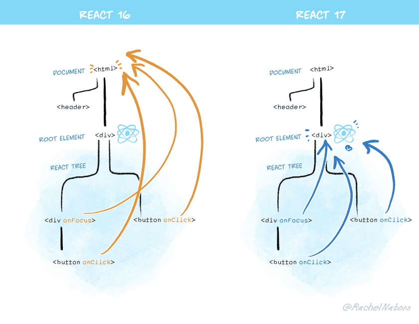

# v17

## Installation

```tsx
npm install react@17.0.0 react-dom@17.0.0

yarn add react@17.0.0 react-dom@17.0.0

// CDN을 통해 React의 UMD 빌드를 제공
<script crossorigin src="https://unpkg.com/react@17.0.0/umd/react.production.min.js"></script>
<script crossorigin src="https://unpkg.com/react-dom@17.0.0/umd/react-dom.production.min.js"></script>
```

## No more 'import React ...'

To use JSX, you always had to import React (even if you didn't reference it explicitly).

This was because JSX code was transpiled into plain JavaScript through tools like Babel or TypeScript.

- <= v16

  ```tsx
  import React from 'react';

  function App() {
    return <h1>Hello World</h1>;
  }

  // JSX -> 일반 자바스크립트
  function App() {
    return React.createElement('h1', null, 'Hello world');
  }
  ```

Starting from v17, you no longer need to type the **'import React ~'** statement directly.

- v17

  ```tsx
  function App() {
    return <h1>Hello World</h1>;
  }

  // Inserted by a compiler (don't import it yourself!)
  import { jsx as _jsx } from 'react/jsx-runtime';

  function App() {
    return _jsx('h1', { children: 'Hello world' });
  }
  ```

How to upgrade for the new JSX transform

CRA: v4.0.0 +

Next: v9.5.3 +

Gastby: v2.24.5 +

typescript: v4.1

ESLint

- eslint-plugin-react
  ```tsx
  {
    // ...
    "rules": {
      // ...
      "react/jsx-uses-react": "off",
      "react/react-in-jsx-scope": "off"
    }
  }
  ```

custom babel

- @babel/plugin-transform-react-jsx

  ```tsx
  # for npm users
  npm update @babel/core @babel/plugin-transform-react-jsx

  # for yarn users
  yarn upgrade @babel/core @babel/plugin-transform-react-jsx
  ```

- @babel/preset-react

  ```tsx
  # for npm users
  npm update @babel/core @babel/preset-react

  # for yarn users
  yarn upgrade @babel/core @babel/preset-react
  ```

- babel config

  ```tsx
  // If you are using @babel/preset-react
  {
    "presets": [
      ["@babel/preset-react", {
        "runtime": "automatic"
      }]
    ]
  }

  // If you're using @babel/plugin-transform-react-jsx
  {
    "plugins": [
      ["@babel/plugin-transform-react-jsx", {
        "runtime": "automatic"
      }]
    ]
  }
  ```

Bulk-removing unnecessary imports after upgrading to v17 (optional)

- react-codemod

  ```tsx
  // general react
  import React from 'react';

  function App() {
    return <h1>Hello World</h1>;
  }

  --transpile;
  function App() {
    return <h1>Hello World</h1>;
  }
  ```

  ```tsx
  // custom hook
  import React from 'react';

  function App() {
    const [text, setText] = React.useState('Hello World');
    return <h1>{text}</h1>;
  }

  import { useState } from 'react';

  function App() {
    const [text, setText] = useState('Hello World');
    return <h1>{text}</h1>;
  }
  ```

Reference page: [https://reactjs.org/blog/2020/09/22/introducing-the-new-jsx-transform.html](https://reactjs.org/blog/2020/09/22/introducing-the-new-jsx-transform.html)

## Consistent errors when returning undefined

In versions 16 and below, every component would always throw an error when it returned undefined.

However, due to a coding oversight, this error handling was missing for `forwardRef` and `memo` components, and it has now been added.

Starting from v17, `forwardRef` and `memo` components also throw an error when they return undefined.

```tsx
<= v16
function Button() {
  return; // Error: Nothing was returned from render
}

function Button() {
  // We forgot to write return, so this component returns undefined.
  // React surfaces this as an error instead of ignoring it.
  <button />;
}

v17 +
let Button = forwardRef(() => {
  // We forgot to write return, so this component returns undefined.
  // React 17 surfaces this as an error instead of ignoring it.
  <button />;
});

let Button = memo(() => {
  // We forgot to write return, so this component returns undefined.
  // React 17 surfaces this as an error instead of ignoring it.
  <button />;
});
```

If you intentionally want to render nothing, you must return null.

# Effect Cleanup Timing

React is making the cleanup timing of the **`useEffect`** lifecycle method behave consistently.

```tsx
<= v16
useEffect(() => {
  // effect -> asynchronous
  return () => {
    // cleanup -> synchronous
  }
}

v17 +
useEffect(() => {
  // effect -> asynchronous
  return () => {
    // cleanup -> asynchronous
  }
}
```

When the cleanup has to perform a lot of work, it can cause performance degradation in operations such as page transitions.

(If you do need effect/cleanup to run synchronously, use useLayoutEffect.)

After v17 is applied, the order is: component unmounts → component/screen updates → cleanup runs.

However, because cleanup runs after unmount, the code below can cause problems when a page transition occurs.

```tsx
useEffect(() => {
  someRef.current.someSetupMethod()
  return () => {
    someRef.current.someCleanupMethod()
  }
})

useEffect(() => {
  const instance = someRef.current -> closure를 통해서 unmounted 하더라도 gc가 사라지지 않게 처리
  instance.someSetupMethod()
  return () => {
    instance.someCleanupMethod()
  }
})
```

## **No Event Pooling**

- Event pooling
  Because there was an issue where using event objects in older browsers caused performance degradation, React created and managed a Synthetic Event pool.
  - When a user triggers a particular event
    - It passes a reference to a Synthetic Event object from the Synthetic Event pool (→ reducing object creation time)
    - It populates the Synthetic Event object with the event information
    - It runs the event listener defined by the user
    - It resets the Synthetic Event object (→ by assigning null so that GC can reclaim the memory, a step for memory efficiency)
      This feature can cause errors to occur in asynchronous operations.
  ```tsx
  onChange={
  (e)=>{
    console.log(e.type);
    console.log(e.target.value);
    setTimeout(()=>{
      console.warn(e.type); // 초기화로 인한 null
     })
   }
  }
  ```
  To resolve this issue, using React's persist to remove the event from the event pool and fall back to the traditional event approach works without any problems, but you give up the performance benefit.

Starting from v17, React decided to no longer support the behavior that compensated for performance issues in legacy browsers.

However, the event.persist() method still exists, though calling it does nothing (kept for backward compatibility).

## **Changes to event delegation**

First, let's look at the code that attaches an event handler in React.

```jsx
<button onClick={handleClick}>
```

In vanilla DOM, it would work like this.

```jsx
myButton.addEventListener('click', handleClick);
```

In React, event handlers are not attached to the actual declared DOM element but added to the document node.

This is called event delegation.

```jsx
document.addEventListener('click', (e) => { // 실행된 컴포넌트 찾게 됨 });
```

React's event delegation approach

- An event occurs on the document
- The React event system finds the component where the event actually occurred
- The event is propagated to parent components through event bubbling

The problem

When multiple React components are nested, a problem arises where stopPropagation, which is meant to block the event, does not work.

```jsx
// legacy react root
import React from 'react'; // 16.12
import ReactDOM from 'react-dom'; //16.12

function modernReact() {
  return ReactDOM.render(
    React.createElement(
      'div',
      {
        onClick: () => console.log('modern react!'),
      },
      null,
    ),
    document.getElementById('modernroot'),
  );
}

import React from 'react'; // 16.8
import ReactDOM from 'react-dom'; // 16.8

function legacyReact() {
  return ReactDOM.render(
    React.createElement(
      'div',
      {
        onClick: () => console.log('legacy react!'),
      },
      null,
    ),
    document.getElementById('legacyroot'),
  );
}

<html>
  <body>
    <div>
      <div id="modernroot">
        {' '}
        // click
        <div id="legacyroot"> // click -> stopPropagation</div>
      </div>
    </div>
  </body>
</html>;
```

- **Starting from React 17, events are delegated to the React Tree Root instead of the document.**



Even when multiple React components run, because events are handled at the base Root Element, the structure and event handling can operate independently.

This makes it easier to use React alongside other technologies. If jQuery exists on the outside and React exists on the inside, you can now stop event propagation down to the jQuery layer as expected.

However, there may be code that manually attaches an event using **`document.addEventListener`** on the DOM to detect all React events. This kind of code was possible in React 16, but starting from React 17 the propagation is blocked, so you cannot tell whether events are firing at the **`document`** level. This means you need to switch to the capture approach.

```jsx
// <= v16
document.addEventListener('click', function () {
  // This custom handler will no longer receive clicks
  // from React components that called e.stopPropagation()
});

// v17+
document.addEventListener(
  'click',
  function () {
    // Now this event handler uses the capture phase,
    // so it receives *all* click events below!
  },
  { capture: true },
);
```

# Reference pages

[https://reactjs.org/blog/2020/10/20/react-v17.html](https://reactjs.org/blog/2020/10/20/react-v17.html)

[https://leo.works/2012130](https://leo.works/2012130)

[https://yceffort.kr/2020/09/react-17-release-candidates#리액트-17에서는-점진적으로-업그레이드가-가능하다](https://yceffort.kr/2020/09/react-17-release-candidates#%EB%A6%AC%EC%95%A1%ED%8A%B8-17%EC%97%90%EC%84%9C%EB%8A%94-%EC%A0%90%EC%A7%84%EC%A0%81%EC%9C%BC%EB%A1%9C-%EC%97%85%EA%B7%B8%EB%A0%88%EC%9D%B4%EB%93%9C%EA%B0%80-%EA%B0%80%EB%8A%A5%ED%95%98%EB%8B%A4)
