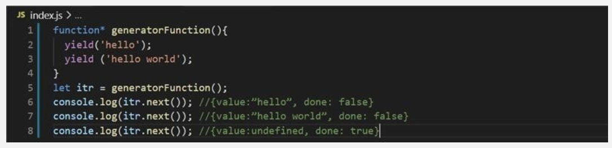
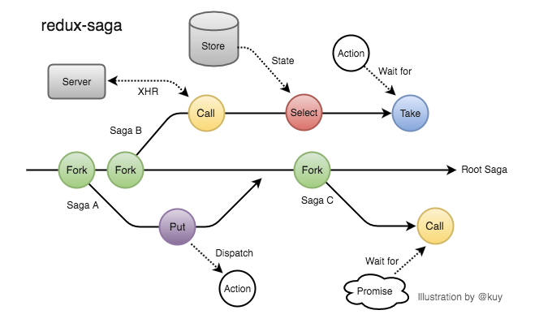
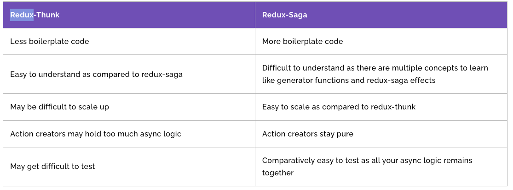
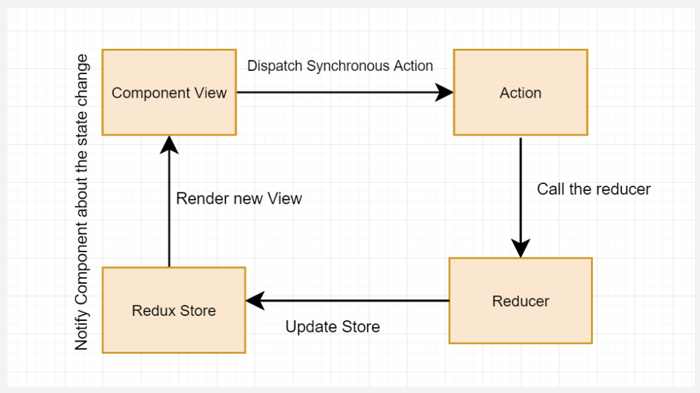
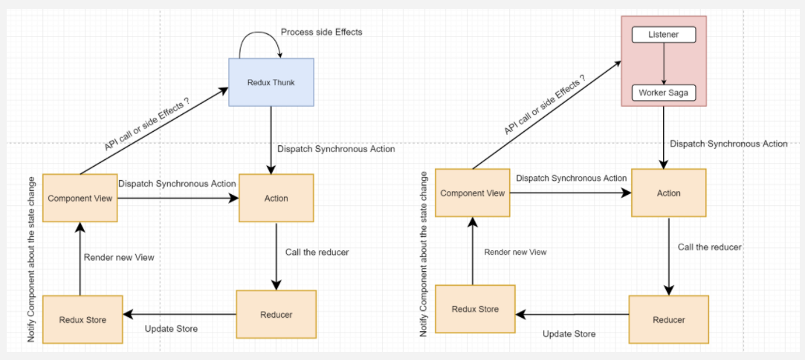
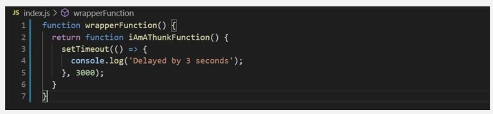
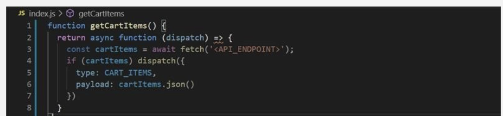

## What is redux-saga?

A middleware library whose purpose is to make handling side effects in React/Redux applications easier and cleaner.

## Installation

```
npm install redux-saga typesafe-actions
```

#### Installing typesafe-actions (v5) → optional

This is a TypeScript library similar to redux-actions. It lets you write and use action creators and reducers more conveniently.

**Sample code**

[GitHub - seungahhong/states-todos](https://github.com/seungahhong/states-todos)

## Generator



[https://react.vlpt.us/redux-middleware/10-redux-saga.html](https://react.vlpt.us/redux-middleware/10-redux-saga.html)

### Side Effect

When you use Redux in real-world projects, actions are dispatched simultaneously and in quick succession. In the middle of these actions, plain logic that isn't an actual Redux action gets executed, or server requests such as Ajax calls occur. When you use thunk, this logic can become complicated.

**Ajax calls**

**Async timers**

**Callbacks after animations**

**Cancellation during a request**

**Throttling**

**Debouncing**

**Page navigation**

These are a bit difficult to express with the ordinary Redux action flow, and for asynchronous work you have to keep a reference to the dispatch function somewhere and call it when needed.

If you use Redux-Saga, these side effects can be solved fairly simply and intuitively.

```jsx
/**
 * 유저 현금성 포인트를 로딩한다.
 */
const loadPoint = function* ({ userId }) {
    try {
        const followers = yield call(Point.load, userId);
        yield put({ type: 'END_USER_POINT_LOADING', payload: user })
    }
    catch(error) {
        yield put({ type: 'FAIL_USER_POINT_LOADING', payload: error })
    })
}

/**
 * 특정 유저의 팔로워를 로딩한다.
 */
const loadFollowers = function* ({ userId }) {
    try {
        const followers = yield call(Users.loadFollowersFrom, userId);
        yield put({ type: 'END_FOLLOWER_LOADING', payload: user })
    }
    catch(error) {
        yield put({ type: 'FAIL_FOLLOWER_LOADING', payload: error })
    })
}

/**
 * 유저 정보를 로딩한다.
 */
const loadUser = function* ({ userId }) {
    try {
        const user = yield call(Users.loadUser, userId)
        yield put(({ type: 'END_USER_LOADING', payload: user })
    }
    catch(error) {
        yield put(({ type: 'FAIL_USER_LOADING', payload: error })
    }
}

/**
 * 각 워커의 시작점을 관리
 */
const watcher = function* () {
    yield takeEvery('START_USER_LOADING', loadUser);
    yield takeEvery('END_USER_LOADING', loadFollowers);
    yield takeEvery('END_USER_LOADING', loadPoint);
}

saga.run(watcher)
```

Saga follows a structure of a Watcher that subscribes to actions and a Worker that performs the actual work.

- **Watcher**
  - **watcher function**
- **Worker**
  - **loadUser**
  - **loadFollowers**
  - **loadPoint**

First, define all the worker functions that will handle the actions. There are three: loadUser, loadFollowers, and loadPoint. Then define the watcher function that acts as the manager, and once you define the execution inside that function, you're done.

I'll explain more later, but the takeXXX family of functions watch for specific action(s), and put is the function that actually dispatches an action. It is the same as Redux's dispatch function. (In Saga, these are called Saga-Effects. I'll explain them later.)

### redux-saga/effects



# Key Concepts

## take

Blocks and waits until the action passed as an argument arrives.

- vs reducer

```jsx
import { select, take } from 'redux-saga/effects';

function* watchAndLog() {
  while (true) {
    const action = yield take('*');
    const state = yield select();

    console.log('action', action);
    console.log('state after', state);
  }
}
```

## s**elect**

A function for pulling data out of the state.

- vs getState, useSelector

```jsx
import { take, fork, select } from 'redux-saga/effects';
import { getCart } from './selectors';

function* checkout() {
  // query the state using the exported selector
  const cart = yield select(getCart);

  // ... call some API endpoint then dispatch a success/error action
}

export default function* rootSaga() {
  while (true) {
    yield take('CHECKOUT_REQUEST');
    yield fork(checkout);
  }
}
```

## p**ut**

Dispatches an action. This is an Effect you typically call to catch an action with take, execute an API call with call, and reflect the success/failure result into the Redux store.

vs dispatch, mapDispatchToProps

```jsx
export function* fetchData(action) {
  try {
    const data = yield call(Api.fetchUser, action.payload.url);
    yield put({ type: 'FETCH_SUCCEEDED', data });
  } catch (error) {
    yield put({ type: 'FETCH_FAILED', error });
  }
}
```

## call

**An effect that runs a function synchronously: `call(fn, ...args)`**

If the function passed to call returns a Promise, execution pauses at the point where call() was invoked until that Promise is resolved.

vs fetch, axios

```jsx
export function* fetchData(action) {
  try {
    const data = yield call(Api.fetchUser, action.payload.url);
    yield put({ type: 'FETCH_SUCCEEDED', data });
  } catch (error) {
    yield put({ type: 'FETCH_FAILED', error });
  }
}
```

## fork

**An effect that runs a function asynchronously: `fork(fn, ...args)`**

- *attached* fork
  - If it fails internally, the parent that forked it cancels it
  - The parent waits for the attached fork to terminate
- vs spawn (**detached fork)**
  - The parent does not wait for the detached fork to terminate
  - Unexpected errors are not propagated to the parent (the effect is not cancelled)

```jsx
function* fetchAll() {
  // 완료
  // 자신의 명령을 모두 이행한 뒤
  // 모든 결합된 포크들이 종료된 뒤

  // 에러
  // 자신의 내용이 에러를 throw할 때
  // 결합된 포크에서 예상치 못한 에러가 발생했을 때
  // 위의 이펙트는 세 개의 자식 이펙트들 중 하나가 실패하자 마자 바로 실패(다른 이펙트 취소)
  const task1 = yield fork(fetchResource, 'users');
  const task2 = yield fork(fetchResource, 'comments');
  yield call(delay, 1000);
}

function* fetchResource(resource) {
  const { data } = yield call(api.fetch, resource);
  yield put(receiveData(data));
}

function* main() {
  try {
    yield call(fetchAll);
  } catch (e) {
    // handle fetchAll errors
  }
}
```

## race

When the first task to resolve (or reject) appears, the remaining tasks are automatically cancelled.

```jsx
import { race, take, put } from 'redux-saga/effects';
import { delay } from 'redux-saga';

function* fetchPostsWithTimeout() {
  const { posts, timeout } = yield race({
    posts: call(fetchApi, '/posts'),
    timeout: call(delay, 1000),
  });

  if (posts) put({ type: 'POSTS_RECEIVED', posts });
  else put({ type: 'TIMEOUT_ERROR' });
}
```

# Supplementary Concepts

## Parallel Tasks

### **all**

Blocked until all effects resolve, or any one of them rejects (promise.all)

```jsx
import { all, call } from 'redux-saga/effects';

// correct, effects will get executed in parallel
export default function* main() {
  yield all([
    watchLoadUserSuccess(),
    watchSignOut(),
    watchSetServiceType(),
    watchPopup(),
    initPopup(),
    call(fetchResource, 'users'),
  ]);
}
```

### Parallel Processing 1

```jsx
function* fetchAll() {
  yield [
    call(fetchResource, 'users'), // task1
    call(fetchResource, 'comments'), // task2,
    call(delay, 1000),
  ];
}

function* main() {
  yield call(fetchAll);
}
```

### Parallel Processing 2

```jsx
function* fetchAll() {
  const task1 = yield fork(fetchResource, 'users')
  const task2 = yield fork(fetchResource, 'comments')
  yield call(delay, 1000)
}

function* main(resource) {
  const {data} = yield call(api.fetch, resource)
  ...
}
```

## Action Polling

### **takeEvery**

Runs the handler for every action that is caught.

```jsx
import { select, takeEvery } from 'redux-saga/effects';

function* watchAndLog() {
  yield takeEvery('*', function* logger(action) {
    const state = yield select();

    console.log('action', action);
    console.log('state after', state);
  });
}

function* takeEvery(pattern, saga, ...args) {
  const task = yield fork(function* () {
    while (true) {
      const action = yield take(pattern);
      yield fork(saga, ...args.concat(action));
    }
  });
  return task;
}
```

### **takeLatest**

Runs the handler only for the most recently (latest) executed action. (debounce)

```jsx
function* takeLatest(pattern, saga, ...args) {
  const task = yield fork(function* () {
    let lastTask;
    while (true) {
      const action = yield take(pattern);
      if (lastTask) yield cancel(lastTask); // cancel is no-op if the task has already terminated

      lastTask = yield fork(saga, ...args.concat(action));
    }
  });
  return task;
}
```

### **takeLeading**

Runs the handler only for the first executed action.

- throttle, debounce

```jsx
// throttle
import { throttle } from `redux-saga/effects`

function* fetchAutocomplete(action) {
  const autocompleteProposals = yield call(Api.fetchAutocomplete, action.text)
  yield put({type: 'FETCHED_AUTOCOMPLETE_PROPOSALS', proposals: autocompleteProposals})
}

function* throttleAutocomplete() {
  // 1000ms마다
  // 개념: 여러번 발생하는 이벤트를 일정 시간 동안, 한번만 실행 되도록 처리
  yield throttle(1000, 'FETCH_AUTOCOMPLETE', fetchAutocomplete)
}

// debounce
import { delay } from 'redux-saga'

function* handleInput({ input }) {
  // 500ms마다
  yield call(delay, 500)
  ...
}

function* watchInput() {
  // 현재 실행중인 handleInput 작업을 취소합니다.
  // 개념: 여러번 발생하는 이벤트에서, 가장 마지막 이벤트 만을 실행 되도록 처리
  yield takeLatest('INPUT_CHANGED', handleInput);
}
```

- Retrying XHR calls
  To retry an XHR call for a certain period of time, you need to use a for loop with a delay.

```jsx
import { delay } from 'redux-saga';

function* updateApi(data) {
  for (let i = 0; i < 5; i++) {
    try {
      const apiResponse = yield call(apiRequest, { data });
      return apiResponse;
    } catch (err) {
      if (i < 5) {
        yield call(delay, 2000);
      }
    }
  }
  // 시도가 5x2초 후에 실패했습니다.
  throw new Error('API request failed');
}
```

- channel
  When many actions arrive in a short period and you want to process them sequentially

```jsx
import { buffers } from 'redux-saga'
import { take, actionChannel, call, ... } from 'redux-saga/effects'

function* watchRequests() {
  // 1- Create a channel for request actions
  const requestChan = yield actionChannel('REQUEST')
  // const requestChan = yield actionChannel('REQUEST', buffers.sliding(5))
  while (true) {
    // 2- take from the channel
    const {payload} = yield take(requestChan)
    // 3- Note that we're using a blocking call
    yield call(handleRequest, payload)
  }
}

function* handleRequest(payload) { ... }
```

# Differences Between Redux Thunk and Redux Saga

### redux-thunk vs redux-saga comparison



[Untitled](https://www.notion.so/a145445012094f3e841748f4d11133c2)

# Redux Thunk vs Redux Saga Comparison Code

- Redux Thunk

```tsx
states
  ┣ constants
  ┃ ┗ index.ts
  ┣ features
  ┃ ┣ __test__
  ┃ ┃ ┗ Todo.test.tsx
  ┃ ┗ index.ts
  ┣ store
  ┃ ┗ index.ts
  ┗ types
  ┃ ┗ index.ts
```

```tsx
// feature/index.tsx
export const fetchAsyncTodoAction = createAsyncThunk(FETCH_ASYNC_TODO, async (args: number | undefined, thunkAPI) => {
  const { data: todoItem } = await fetchTodo(args);

  return {
    todoItem: Array.isArray(todoItem) ? todoItem : ([] as TodoItem[]).concat(todoItem),
  };
});

// reducer, immer 내장
const initialState: TodoState = {
  todoItem: [],
  loading: false,
  message: '',
};

const todos = createSlice({
  name: 'todos',
  initialState,
  reducers: { }, // key값으로 정의한 이름으로 자동으로 액션함수 생성
  extraReducers: { // 사용자가 정의한 이름의 액션함수가 생성
    ...
    [fetchAsyncTodoAction.pending.type]: (state: Draft<TodoState>) => {
      // 호출전
      state.loading = true;
      state.message = '';
    },
    [fetchAsyncTodoAction.fulfilled.type]: (state, todoItem: TodoItemState[]) => {
      // 성공
      state.loading = false;
      state.todoItem = todoItem;
      state.message = '성공했습니다...';
    }
    [fetchAsyncTodoAction.rejected.type]: (state: Draft<TodoState>) => {
      // 실패
      state.loading = false;
      state.todoItem = [];
      state.message = '실패했습니다...';
    },
    ...
  },
});
```

- Redux Saga

```tsx
states
  ┣ constants
  ┃ ┗ index.ts
  ┣ features
  ┃ ┣ __test__
  ┃ ┃ ┗ Todo.test.tsx
  ┃ ┗ index.ts
  ┣ saga
  ┃ ┗ index.ts
  ┣ store
  ┃ ┗ index.ts
  ┗ types
  ┃ ┗ index.ts
```

```tsx
// feature/index.tsx
// redux-saga 호출을 위한 action 함수 지정
export const fetchTodoSagaAsyncAction = createAsyncAction(
  FETCH_TODO_SAGA,
  FETCH_TODO_SAGA_SUCCESS,
  FETCH_TODO_SAGA_ERROR
)<undefined | number, TodoItemState[], AxiosError>();

const todos = createSlice({
  name: 'todos',
  initialState,
  reducers: { }, // key값으로 정의한 이름으로 자동으로 액션함수 생성
  extraReducers: { // 사용자가 정의한 이름의 액션함수가 생성
    ...
    [FETCH_TODO_SAGA]: (state: Draft<TodoState>) => {
      state.loading = true;
      state.message = '';
    },
    [FETCH_TODO_SAGA_SUCCESS]: (state: Draft<TodoState>, action: PayloadAction<TodoItemState[]>) => {
      state.loading = false;
      state.todoItem = action.payload;
      state.message = '성공했습니다...';
    },
    [FETCH_TODO_SAGA_ERROR]: (state: Draft<TodoState>, error: AxiosError) => {
      state.loading = false;
      state.todoItem = [];
      state.message = '실패했습니다...';
    },
    ...
  },
});

// saga/index.ts
function* fetchAsyncSagaTodoAction(action: ReturnType<typeof fetchTodoSagaAsyncAction.request>) {
  try {
    const { data: todoItem } = yield call(fetchTodo, action.payload);
    yield put(fetchTodoSagaAsyncAction.success(Array.isArray(todoItem) ? todoItem : [].concat(todoItem)));
  } catch (err: unknown) {
    if (axios.isAxiosError(err))  {
      yield put(fetchTodoSagaAsyncAction.failure(err as AxiosError));
    }
  }
}

export function* todoSaga() {
  yield takeEvery(FETCH_TODO_SAGA, fetchAsyncSagaTodoAction);
}

// store/index.ts
const sagaMiddleware = createSagaMiddleware();

function* saga() {
  yield all([fork(todoSaga)]);
}

const store = configureStore({
  reducer: {
    todos: todos,
  },
  middleware: (getDefaultMiddleware) => getDefaultMiddleware().concat(logger, sagaMiddleware),
});

sagaMiddleware.run(saga);
```

# redux-thunk vs redux-saga

## redux logic



## redux-thunk, redux-saga logic



## redux-thunk

- redux-thunk is a middleware that lets you dispatch functions

### redux-thunk implementation

```jsx
function createThunkMiddleware(extraArgument) {
  return ({ dispatch, getState }) =>
    next =>
    action => {
      if (typeof action === 'function') {
        return action(dispatch, getState, extraArgument);
      }

      return next(action);
    };
}

const thunk = createThunkMiddleware();
thunk.withExtraArgument = createThunkMiddleware;

export default thunk;
```

### redux-thunk example code





# References

- [https://www.eternussolutions.com/2020/12/21/redux-thunk-redux-saga/](https://www.eternussolutions.com/2020/12/21/redux-thunk-redux-saga/)
- [https://github.com/reduxjs/redux-thunk](https://github.com/reduxjs/redux-thunk)
- [https://blog.javarouka.me/2019/04/02/redux-saga-1/#Side-Effect](https://blog.javarouka.me/2019/04/02/redux-saga-1/#Side-Effect)
- [https://github.com/reactkr/learn-react-in-korean/blob/master/translated/deal-with-async-process-by-redux-saga.md](https://github.com/reactkr/learn-react-in-korean/blob/master/translated/deal-with-async-process-by-redux-saga.md)
- [https://ideveloper2.tistory.com/53](https://ideveloper2.tistory.com/53)
