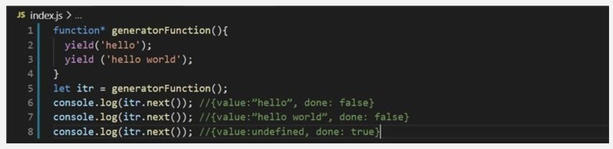
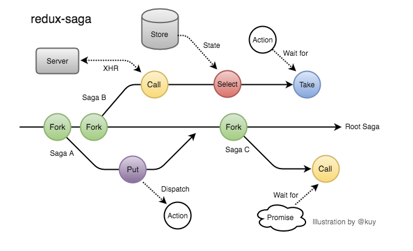
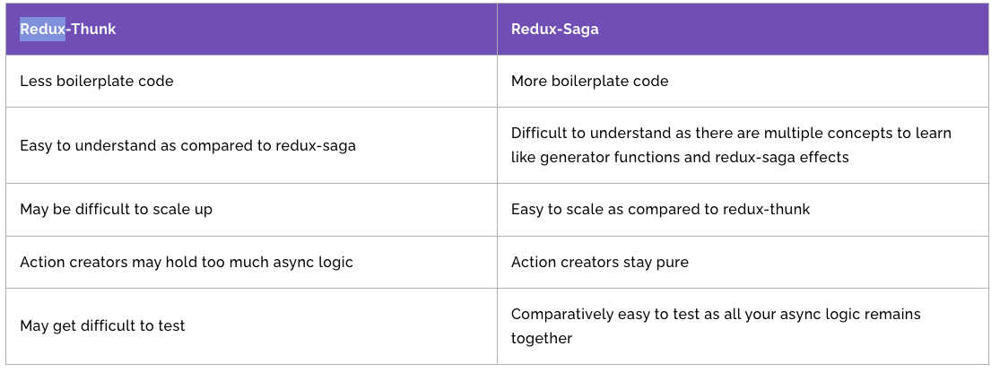
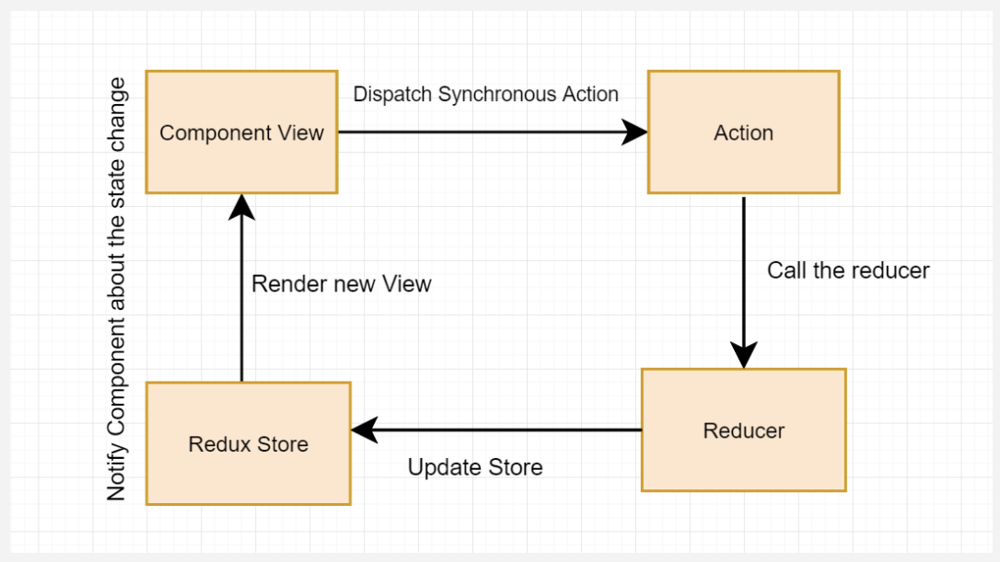
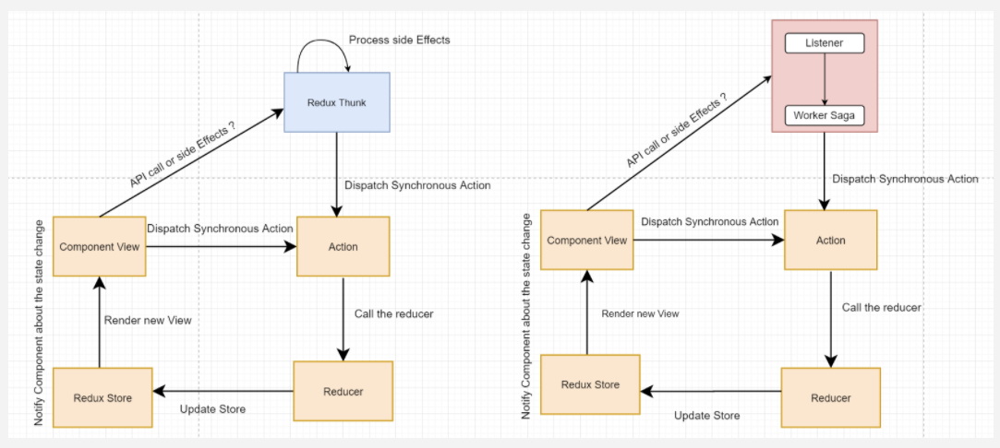
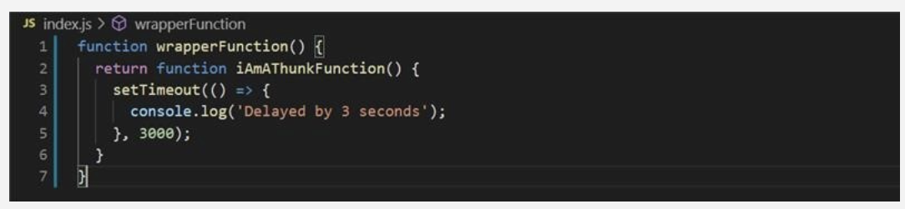
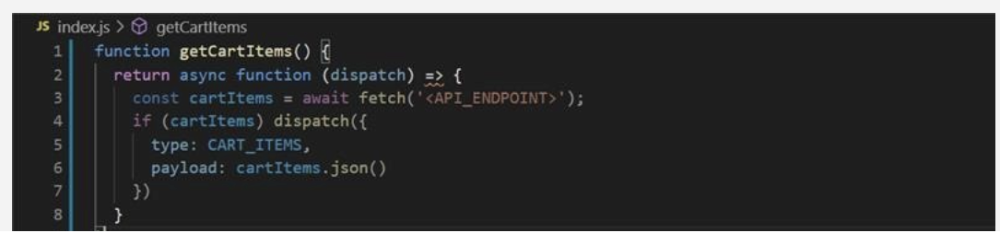

## redux-saga란?

리액트/리덕스 애플리케이션의 side effect를 더 쉽고 좋게 만드는 것을 목적으로 하는 미들웨어 라이브러리

## 설치

```
npm install redux-saga typesafe-actions
```

#### typesafe-actions 설치 (v5) → 선택

redux-actions와 같은 Typescript 용 라이브러리입니다. 액션 생성 함수와 Reducer를 더 편하게 작성하고 사용할 수 있습니다.

**샘플코드**

[GitHub - seungahhong/states-todos](https://github.com/seungahhong/states-todos)

## Generator



[https://react.vlpt.us/redux-middleware/10-redux-saga.html](https://react.vlpt.us/redux-middleware/10-redux-saga.html)

### Side Effect(부수효과)

실무에서 Redux 를 쓰다보면 액션이 동시다발적으로 발생되며, 액션 중간에 실제 Redux 액션이 아닌 일반 로직이 수행되거나 Ajax Call 등의 서버 리퀘스트도 발생하는데, thunk를 사용 시 로직이 복잡해 질 수 있다.

**Ajax 콜**

**비동기타이머**

**애니메이션 후 콜백**

**요청 중 취소**

**스로틀링**

**디바운싱**

**페이지 이동**

이러한 것은 일반적인 Redux의 액션 흐름으로는 나타내기가 조금 어렵고, 비동기 수행시에는 어디엔가 dispatch 함수의 레퍼런스를 가지고 있다가 필요할때에 호출하면서 수행해야 한다.

이러한 부수 효과들은 Redux-Saga 를 쓴다면 꽤 단순하고 직관적으로 풀어낼 수 있다.

```jsx
/**
 * 유저 현금성 포인트를 로딩한다.
 */
const loadPoint = function* ({ userId }) {
    try {
        const followers = yield call(Point.load, userId);
        yield put({ type: 'END_USER_POINT_LOADING', payload: user })
    }
    catch(error) {
        yield put({ type: 'FAIL_USER_POINT_LOADING', payload: error })
    })
}

/**
 * 특정 유저의 팔로워를 로딩한다.
 */
const loadFollowers = function* ({ userId }) {
    try {
        const followers = yield call(Users.loadFollowersFrom, userId);
        yield put({ type: 'END_FOLLOWER_LOADING', payload: user })
    }
    catch(error) {
        yield put({ type: 'FAIL_FOLLOWER_LOADING', payload: error })
    })
}

/**
 * 유저 정보를 로딩한다.
 */
const loadUser = function* ({ userId }) {
    try {
        const user = yield call(Users.loadUser, userId)
        yield put(({ type: 'END_USER_LOADING', payload: user })
    }
    catch(error) {
        yield put(({ type: 'FAIL_USER_LOADING', payload: error })
    }
}

/**
 * 각 워커의 시작점을 관리
 */
const watcher = function* () {
    yield takeEvery('START_USER_LOADING', loadUser);
    yield takeEvery('END_USER_LOADING', loadFollowers);
    yield takeEvery('END_USER_LOADING', loadPoint);
}

saga.run(watcher)
```

Saga 는 액션을 구독하는 Watcher와 실제 작업을 수행하는 Worker 의 구성을 따른다

- **Watcher**
  - **watcher 함수**
- **Worker**
  - **loadUser**
  - **loadFollowers**
  - **loadPoint**

먼저 액션을 처리할 워커 함수를 전부 정의한다. loadUser, loadFollowers, loadPoint 셋이 있다. 그리고 매니저가 될 와쳐 함수를 정의하고 그 함수에서 실행을 정의하면 끝이다.

이후에 좀 더 설명하겠지만 takeXXX 류의 함수는 특정 액션(들) 을 감시하는 함수이고, put 은 실제 액션을 dispatch 하는 함수이다. Redux 의 Dispatch 함수와 동일하다. (이것들을 Saga 에서는 Saga-Effect 라고 부른다. 이후에 설명한다.)

### redux-saga/effects



# 주요개념

## take

매개변수로 전달된 액션이 올때까지 블락된 상태로 기다립니다.

- vs reducer

```jsx
import { select, take } from 'redux-saga/effects';

function* watchAndLog() {
  while (true) {
    const action = yield take('*');
    const state = yield select();

    console.log('action', action);
    console.log('state after', state);
  }
}
```

## s**elect**

State에서 데이터를 꺼내오기 위한 함수입니다.

- vs getState, useSelector

```jsx
import { take, fork, select } from 'redux-saga/effects';
import { getCart } from './selectors';

function* checkout() {
  // query the state using the exported selector
  const cart = yield select(getCart);

  // ... call some API endpoint then dispatch a success/error action
}

export default function* rootSaga() {
  while (true) {
    yield take('CHECKOUT_REQUEST');
    yield fork(checkout);
  }
}
```

## p**ut**

액션을 dispatch 합니다. 보통 take로 액션을 캐치해서 api 호출을 call로 실행하고 성공/실패 여부에 따라 리덕스 스토어에 반영하기 위해서 호출하는 Effects입니다.

vs dispatch, mapDispatchToProps

```jsx
export function* fetchData(action) {
  try {
    const data = yield call(Api.fetchUser, action.payload.url);
    yield put({ type: 'FETCH_SUCCEEDED', data });
  } catch (error) {
    yield put({ type: 'FETCH_FAILED', error });
  }
}
```

## call

**동기적으로 함수를 실행시켜주는 이펙트: `call(fn, ...args)`**

Call에 넘겨진 함수가 Promise를 리턴하면 그 Promise가 resolved 될 때까지 call()을 호출한 부분에서 실행이 멈춥니다.

vs fetch, axios

```jsx
export function* fetchData(action) {
  try {
    const data = yield call(Api.fetchUser, action.payload.url);
    yield put({ type: 'FETCH_SUCCEEDED', data });
  } catch (error) {
    yield put({ type: 'FETCH_FAILED', error });
  }
}
```

## fork

**비동기적으로 함수를 실행시켜주는 이펙트: `fork(fn, ...args)`**

- *결합된(attached)* 포크
  - 내부에서 실패한다면, 포크한 부모가 이를 취소
  - 부모는 분리된 포크가 종료되는 것을 기다림
- vs spawn(**분리된 포크)**
  - 부모는 분리된 포크가 종료되는 것을 기다리지 않음
  - 예상치 못한 에러는 부모로 전달되지 않음(이펙트 취소되지 않음)

```jsx
function* fetchAll() {
  // 완료
  // 자신의 명령을 모두 이행한 뒤
  // 모든 결합된 포크들이 종료된 뒤

  // 에러
  // 자신의 내용이 에러를 throw할 때
  // 결합된 포크에서 예상치 못한 에러가 발생했을 때
  // 위의 이펙트는 세 개의 자식 이펙트들 중 하나가 실패하자 마자 바로 실패(다른 이펙트 취소)
  const task1 = yield fork(fetchResource, 'users');
  const task2 = yield fork(fetchResource, 'comments');
  yield call(delay, 1000);
}

function* fetchResource(resource) {
  const { data } = yield call(api.fetch, resource);
  yield put(receiveData(data));
}

function* main() {
  try {
    yield call(fetchAll);
  } catch (e) {
    // handle fetchAll errors
  }
}
```

## race

첫 번째로 resolve(or reject)된 task가 나오면 나머지 task를 자동으로 취소시킨다.

```jsx
import { race, take, put } from 'redux-saga/effects';
import { delay } from 'redux-saga';

function* fetchPostsWithTimeout() {
  const { posts, timeout } = yield race({
    posts: call(fetchApi, '/posts'),
    timeout: call(delay, 1000),
  });

  if (posts) put({ type: 'POSTS_RECEIVED', posts });
  else put({ type: 'TIMEOUT_ERROR' });
}
```

# 부수적 개념

## 병렬 태스크

### **all**

모든 이펙트들이 resolve되거나, 어느 하나라도 reject될 때까지 봉쇄(blocked)됨(promise.all)

```jsx
import { all, call } from 'redux-saga/effects';

// correct, effects will get executed in parallel
export default function* main() {
  yield all([
    watchLoadUserSuccess(),
    watchSignOut(),
    watchSetServiceType(),
    watchPopup(),
    initPopup(),
    call(fetchResource, 'users'),
  ]);
}
```

### 병렬처리1

```jsx
function* fetchAll() {
  yield [
    call(fetchResource, 'users'), // task1
    call(fetchResource, 'comments'), // task2,
    call(delay, 1000),
  ];
}

function* main() {
  yield call(fetchAll);
}
```

### 병렬처리2

```jsx
function* fetchAll() {
  const task1 = yield fork(fetchResource, 'users')
  const task2 = yield fork(fetchResource, 'comments')
  yield call(delay, 1000)
}

function* main(resource) {
  const {data} = yield call(api.fetch, resource)
  ...
}
```

## 액션폴링

### **takeEvery**

캐치된 모든 액션에 대해서 핸들러를 실행합니다.

```jsx
import { select, takeEvery } from 'redux-saga/effects';

function* watchAndLog() {
  yield takeEvery('*', function* logger(action) {
    const state = yield select();

    console.log('action', action);
    console.log('state after', state);
  });
}

function* takeEvery(pattern, saga, ...args) {
  const task = yield fork(function* () {
    while (true) {
      const action = yield take(pattern);
      yield fork(saga, ...args.concat(action));
    }
  });
  return task;
}
```

### **takeLatest**

가장 마지막에(최신) 실행된 액션에 대해서만 핸들러를 실행합니다.(debounce)

```jsx
function* takeLatest(pattern, saga, ...args) {
  const task = yield fork(function* () {
    let lastTask;
    while (true) {
      const action = yield take(pattern);
      if (lastTask) yield cancel(lastTask); // cancel is no-op if the task has already terminated

      lastTask = yield fork(saga, ...args.concat(action));
    }
  });
  return task;
}
```

### **takeLeading**

가장 처음 실행된 액션에 대해서만 핸들러를 실행합니다.

- throttle, debounce

```jsx
// throttle
import { throttle } from `redux-saga/effects`

function* fetchAutocomplete(action) {
  const autocompleteProposals = yield call(Api.fetchAutocomplete, action.text)
  yield put({type: 'FETCHED_AUTOCOMPLETE_PROPOSALS', proposals: autocompleteProposals})
}

function* throttleAutocomplete() {
  // 1000ms마다
  // 개념: 여러번 발생하는 이벤트를 일정 시간 동안, 한번만 실행 되도록 처리
  yield throttle(1000, 'FETCH_AUTOCOMPLETE', fetchAutocomplete)
}

// debounce
import { delay } from 'redux-saga'

function* handleInput({ input }) {
  // 500ms마다
  yield call(delay, 500)
  ...
}

function* watchInput() {
  // 현재 실행중인 handleInput 작업을 취소합니다.
  // 개념: 여러번 발생하는 이벤트에서, 가장 마지막 이벤트 만을 실행 되도록 처리
  yield takeLatest('INPUT_CHANGED', handleInput);
}
```

- XHR호출 재시도(Retrying XHR calls)
  특정 시간 동안 XHR 호출을 재시도하려면 지연(delay)이 있는 for 루프를 사용해야 합니다.

```jsx
import { delay } from 'redux-saga';

function* updateApi(data) {
  for (let i = 0; i < 5; i++) {
    try {
      const apiResponse = yield call(apiRequest, { data });
      return apiResponse;
    } catch (err) {
      if (i < 5) {
        yield call(delay, 2000);
      }
    }
  }
  // 시도가 5x2초 후에 실패했습니다.
  throw new Error('API request failed');
}
```

- channel
  짧은 시간에 많은 액션이 올경우 순차적으로 처리를 하고 싶을경우

```jsx
import { buffers } from 'redux-saga'
import { take, actionChannel, call, ... } from 'redux-saga/effects'

function* watchRequests() {
  // 1- Create a channel for request actions
  const requestChan = yield actionChannel('REQUEST')
  // const requestChan = yield actionChannel('REQUEST', buffers.sliding(5))
  while (true) {
    // 2- take from the channel
    const {payload} = yield take(requestChan)
    // 3- Note that we're using a blocking call
    yield call(handleRequest, payload)
  }
}

function* handleRequest(payload) { ... }
```

# Redux Thunk vs Redux Saga 차이점

### redux-thunk vs redux-saga 비교



[제목 없음](https://www.notion.so/a145445012094f3e841748f4d11133c2)

# Redux Thunk vs Redux Saga 비교코드

- Redux Thunk

```tsx
states
  ┣ constants
  ┃ ┗ index.ts
  ┣ features
  ┃ ┣ __test__
  ┃ ┃ ┗ Todo.test.tsx
  ┃ ┗ index.ts
  ┣ store
  ┃ ┗ index.ts
  ┗ types
  ┃ ┗ index.ts
```

```tsx
// feature/index.tsx
export const fetchAsyncTodoAction = createAsyncThunk(FETCH_ASYNC_TODO, async (args: number | undefined, thunkAPI) => {
  const { data: todoItem } = await fetchTodo(args);

  return {
    todoItem: Array.isArray(todoItem) ? todoItem : ([] as TodoItem[]).concat(todoItem),
  };
});

// reducer, immer 내장
const initialState: TodoState = {
  todoItem: [],
  loading: false,
  message: '',
};

const todos = createSlice({
  name: 'todos',
  initialState,
  reducers: { }, // key값으로 정의한 이름으로 자동으로 액션함수 생성
  extraReducers: { // 사용자가 정의한 이름의 액션함수가 생성
    ...
    [fetchAsyncTodoAction.pending.type]: (state: Draft<TodoState>) => {
      // 호출전
      state.loading = true;
      state.message = '';
    },
    [fetchAsyncTodoAction.fulfilled.type]: (state, todoItem: TodoItemState[]) => {
      // 성공
      state.loading = false;
      state.todoItem = todoItem;
      state.message = '성공했습니다...';
    }
    [fetchAsyncTodoAction.rejected.type]: (state: Draft<TodoState>) => {
      // 실패
      state.loading = false;
      state.todoItem = [];
      state.message = '실패했습니다...';
    },
    ...
  },
});
```

- Redux Saga

```tsx
states
  ┣ constants
  ┃ ┗ index.ts
  ┣ features
  ┃ ┣ __test__
  ┃ ┃ ┗ Todo.test.tsx
  ┃ ┗ index.ts
  ┣ saga
  ┃ ┗ index.ts
  ┣ store
  ┃ ┗ index.ts
  ┗ types
  ┃ ┗ index.ts
```

```tsx
// feature/index.tsx
// redux-saga 호출을 위한 action 함수 지정
export const fetchTodoSagaAsyncAction = createAsyncAction(
  FETCH_TODO_SAGA,
  FETCH_TODO_SAGA_SUCCESS,
  FETCH_TODO_SAGA_ERROR
)<undefined | number, TodoItemState[], AxiosError>();

const todos = createSlice({
  name: 'todos',
  initialState,
  reducers: { }, // key값으로 정의한 이름으로 자동으로 액션함수 생성
  extraReducers: { // 사용자가 정의한 이름의 액션함수가 생성
    ...
    [FETCH_TODO_SAGA]: (state: Draft<TodoState>) => {
      state.loading = true;
      state.message = '';
    },
    [FETCH_TODO_SAGA_SUCCESS]: (state: Draft<TodoState>, action: PayloadAction<TodoItemState[]>) => {
      state.loading = false;
      state.todoItem = action.payload;
      state.message = '성공했습니다...';
    },
    [FETCH_TODO_SAGA_ERROR]: (state: Draft<TodoState>, error: AxiosError) => {
      state.loading = false;
      state.todoItem = [];
      state.message = '실패했습니다...';
    },
    ...
  },
});

// saga/index.ts
function* fetchAsyncSagaTodoAction(action: ReturnType<typeof fetchTodoSagaAsyncAction.request>) {
  try {
    const { data: todoItem } = yield call(fetchTodo, action.payload);
    yield put(fetchTodoSagaAsyncAction.success(Array.isArray(todoItem) ? todoItem : [].concat(todoItem)));
  } catch (err: unknown) {
    if (axios.isAxiosError(err))  {
      yield put(fetchTodoSagaAsyncAction.failure(err as AxiosError));
    }
  }
}

export function* todoSaga() {
  yield takeEvery(FETCH_TODO_SAGA, fetchAsyncSagaTodoAction);
}

// store/index.ts
const sagaMiddleware = createSagaMiddleware();

function* saga() {
  yield all([fork(todoSaga)]);
}

const store = configureStore({
  reducer: {
    todos: todos,
  },
  middleware: (getDefaultMiddleware) => getDefaultMiddleware().concat(logger, sagaMiddleware),
});

sagaMiddleware.run(saga);
```

# redux-thunk vs redux-saga

## redux logic



## redux-thunk, redux-saga logic



## redux-thunk

- redux-thunk의 경우엔 함수를 디스패치 할 수 있게 해주는 미들웨어

### redux-thunk 구현체

```jsx
function createThunkMiddleware(extraArgument) {
  return ({ dispatch, getState }) =>
    next =>
    action => {
      if (typeof action === 'function') {
        return action(dispatch, getState, extraArgument);
      }

      return next(action);
    };
}

const thunk = createThunkMiddleware();
thunk.withExtraArgument = createThunkMiddleware;

export default thunk;
```

### redux-thunk 예제코드





# 참고페이지

- [https://www.eternussolutions.com/2020/12/21/redux-thunk-redux-saga/](https://www.eternussolutions.com/2020/12/21/redux-thunk-redux-saga/)
- [https://github.com/reduxjs/redux-thunk](https://github.com/reduxjs/redux-thunk)
- [https://blog.javarouka.me/2019/04/02/redux-saga-1/#Side-Effect](https://blog.javarouka.me/2019/04/02/redux-saga-1/#Side-Effect)
- [https://github.com/reactkr/learn-react-in-korean/blob/master/translated/deal-with-async-process-by-redux-saga.md](https://github.com/reactkr/learn-react-in-korean/blob/master/translated/deal-with-async-process-by-redux-saga.md)
- [https://ideveloper2.tistory.com/53](https://ideveloper2.tistory.com/53)
