# v6

## React Router v6 Official Release

The v6.0.0 beta was promoted to a full release on November 4, 2021.

## Upgrading to React v16.8 or Higher

That said, since React ≥ 15 is compatible with react router v5 and above, you can upgrade React alone without also upgrading to v6.

- Sample code: https://github.com/seungahhong/react-router-tutorial

## Advantages of React Router v6

- The bundle size has been reduced by about 70% compared to the previous version. (Does it also reduce build time??)

The v5.1 size was 9.4kb, and it has been reduced to 2.9kb in v6.


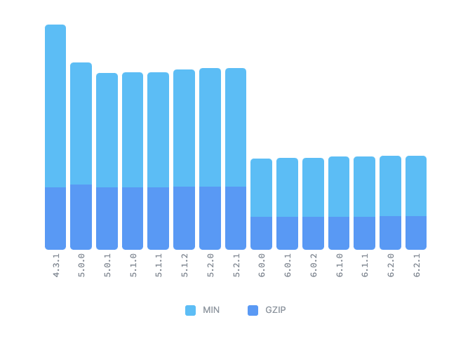

- Broad support for React Hooks (features such as HOCs have been removed)
- Dropped support for legacy browsers (however, this can be handled by using polyfills)
  - IE 11 support
    - Add the following to package.json to support the IE11 browser
    ```bash
    "browserslist": {
        "production": [
          "...",
          "ie 11"
        ],
        "development": [
          "...",
          "ie 11"
        ]
      },
    ```
    - Add polyfills
      - react-app-polyfill (provided by Facebook)
        - A library that transpiles the various syntaxes used in React development
        - It only includes the necessary pieces such as Promise, window.fetch, Symbol, Object.assign, Array.from + [ IE9 Map, Set ], so it is small in size and lightweight
      ```tsx
      // src/index.tsx
      // Add at the very first line
      import 'react-app-polyfill/ie11';
      import 'react-app-polyfill/stable'; // async,await,generator 문법사용
      import React from 'react';
      ```
- Reduced code volume thanks to relative paths (match.url, match.path)
- A unified standard for features
  - e.g.) Router → element consolidation

## Installing React Router v6

```solidity
npm install react-router-dom // react-router-dom@6
```

## Changes from Switch → Routes

- Instead of selecting based on order like Switch, it now works by choosing the best-matching route
- Switch → Routes change (a route must be a child of routes)
- The exact prop has been removed
  - When a sub-path is needed, use path \*
- component, children, and render are unified into element

```tsx
// v6 이전
<Switch>
  <Route path="/about" render={() => <About />} />
  <Route exact path="/" component={Home} />
  <Route path={'/*'}> // <Route>
    <div>Not Found</div>
  </Route>
</Switch>

// v6 이후
<Routes>
  <Route path="/about" element={<About />} />
  <Route path="/" element={<Home />} />
  <Route path={'/*'} element={<div>Not Found</div>} />
</Routes>
```

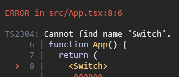

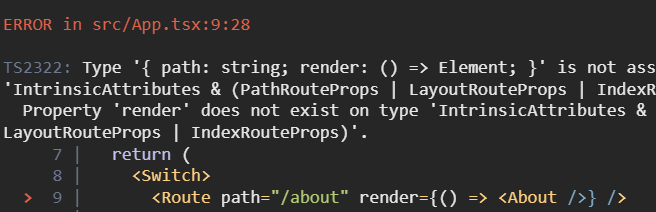

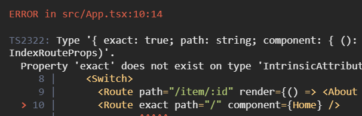

## Changes from withRouter → hooks

- Hooks API changes due to the removal of withRouter
  - match: useMatch → current relative path (however, the property values differ, so verification is needed)
  - history: useNavigate is supported
  - location: useLocation (also supported since v5)

```tsx
// v6 이전
import React from 'react';
import { RouteComponentProps } from 'react-router';
import { withRouter } from 'react-router-dom';

interface MatchParams {
  id: string;
}

const WithRouter = ({
  match,
  location,
  history,
}: RouteComponentProps<MatchParams>) => {
  return (
    <>
      <h1>WithRouter</h1>
      <p>{match?.params?.id}</p>
      <p>{location.pathname}</p>
      <p>{history.length}</p>
    </>
  );
};

WithRouter.defaultProps = {};

export default withRouter(WithRouter);

// v6 이후
import React from 'react';
import { useMatch, useNavigate, useLocation } from 'react-router-dom';

const WithRouter = () => {
  const match = useMatch('/with/:id');
  const history = useNavigate();
  const location = useLocation();
  return (
    <>
      <h1>WithRouter</h1>
      <p>{match?.params?.id}</p>
      <p>{location.pathname}</p>
      <p>{history.length}</p>
    </>
  );
};

WithRouter.defaultProps = {};

export default WithRouter;
```

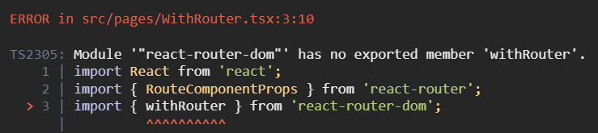

## Changes from useHistory → useNavigate

useNavigate has replaced the useHistory hook

- useHistory return value (object) vs useNavigate return value (function)
- Previously you called go, goBack, goForward, push, and replace methods depending on the use case, but these have been changed to an intuitive function call

```tsx
// v6 이전
import React from 'react';
import { useHistory } from 'react-router';

const Navigation = () => {
  const history = useHistory();

  return (
    <div>
      <button
        onClick={() => {
          history.push('/');
        }}
      >
        Home
      </button>
      <button
        onClick={() => {
          history.goBack();
        }}
      >
        Go -1
      </button>
      <button
        onClick={() => {
          history.go(-2);
        }}
      >
        Go -2
      </button>
      <button
        onClick={() => {
          history.push('/about');
        }}
      >
        Go to about
      </button>
      <button
        onClick={() => {
          history.replace('Item/2');
        }}
      >
        Replace to Item
      </button>
    </div>
  );
};

Navigation.defaultProps = {};

export default Navigation;

// v6 이후
import React from 'react';
import { useNavigate } from 'react-router';

const Navigation = () => {
  const navigation = useNavigate();

  return (
    <div>
      <button
        onClick={() => {
          navigation('/'); // vs history.push('/');
        }}
      >
        Home
      </button>
      <button
        onClick={() => {
          navigation(-1); // vs history.goBack();
        }}
      >
        Go -1
      </button>
      <button
        onClick={() => {
          navigation(-2); // vs history.go(-2);
        }}
      >
        Go -2
      </button>
      <button
        onClick={() => {
          navigation('/about'); // vs history.push('/about');
        }}
      >
        Go to about
      </button>
      <button
        onClick={() => {
          navigation('Item/2', {
            // vs history.replace('Item/2');
            replace: true,
          });
        }}
      >
        Replace to Item
      </button>
    </div>
  );
};

Navigation.defaultProps = {};

export default Navigation;
```

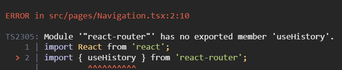

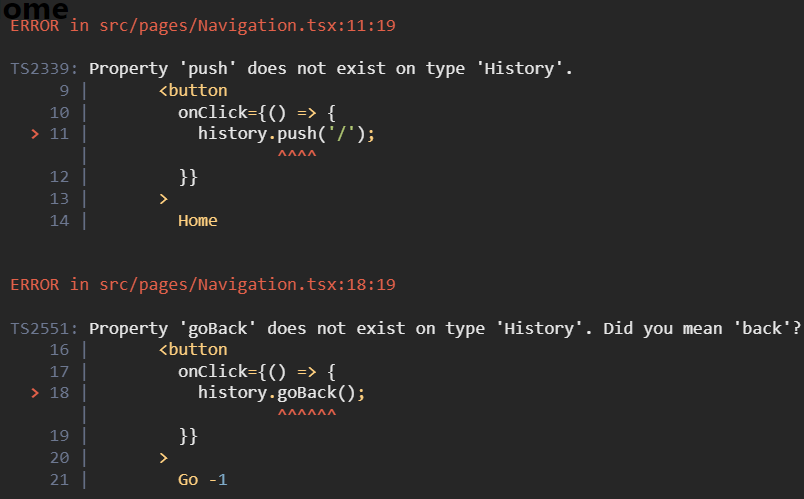

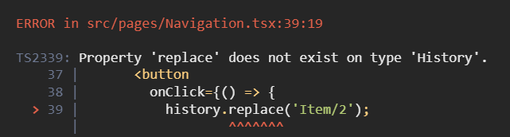

## useRouteMatch Changes

- Since useRouteMatch is gone, the match.path and match.url previously used to obtain the current URL are also gone
  - They are replaced with relative paths based on the current router

```tsx
// v6 이전
import React from 'react';
import { Link, Route, useParams, useRouteMatch } from 'react-router-dom';
import About from './About';
import Main from './Main';

type UserProps = {
  id: string;
};

const User = () => {
  const match = useRouteMatch();
  const { id } = useParams<UserProps>();

  return (
    <>
      <h1>{`User ${id}`}</h1>
      <ul>
        <li>
          <Link to={`${match.url}`}>Main</Link>
        </li>
        <li>
          <Link to={`${match.url}/about`}>About</Link>
        </li>
      </ul>
      <Route path={match.path} exact>
        <Main />
      </Route>
      <Route path={`${match.path}/about`} exact>
        <About />
      </Route>
    </>
  );
};

User.defaultProps = {};

export default User;

// v6 이후
// user 서브 경로 추가하기 위해서 * 추가
function App() {
  return (
    <>
      <Navigation />
      <Routes>
        <Route path="/about" element={<About />} />
        <Route path="/users/:id/*" element={<User />} />
        <Route path="/with/:id" element={<WithRouter />} />
        <Route path="/" element={<Home />} />
        <Route path={'*'} element={<div>Not Found</div>} />
      </Routes>
    </>
  );
}

import React from 'react';
import { Link, Route, Routes, useParams } from 'react-router-dom';
import About from './About';
import Main from './Main';

type UserProps = {
  id: string;
};

const User = () => {
  // const match = useRouteMatch();
  const { id } = useParams<UserProps>();

  return (
    <>
      <h1>{`User ${id}`}</h1>
      <ul>
        <li>
          <Link to="">Main</Link>
        </li>
        <li>
          <Link to="about">About</Link>
        </li>
      </ul>
      <Routes>
        <Route path="" element={<Main />} />
        <Route path="about" element={<About />} />
      </Routes>
    </>
  );
};

User.defaultProps = {};

export default User;
```

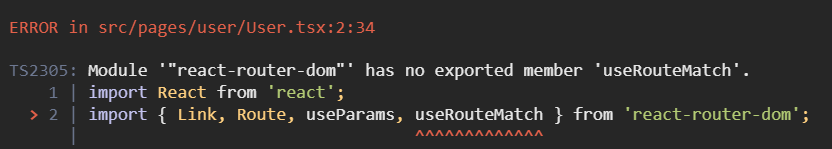

## Different Implementation for Sub-routers: Outlet

```tsx
// v6 이전
// App.tsx
<Route path="/user/:id">
  <User />
</Route>

// User.tsx
<>
  <h1>{`User ${id}`}</h1>
  <ul>
    <li>
      <Link to={`${match.url}`}>Main</Link>
    </li>
    <li>
      <Link to={`${match.url}/about`}>About</Link>
    </li>
  </ul>
  <Route path={match.path} exact>
    <UserMain />
  </Route>
  <Route path={`${match.path}/about`} exact>
    <UserAbout />
  </Route>
</>

// v6 이후
// App.tsx
<Route path="/useroutlet/:id/*" element={<UserOutlet />}>
  <Route path="" element={<UserMain />} />
  <Route path="about" element={<UserAbout />} />
</Route>

// User.tsx
<>
  <h1>{`User ${id}`}</h1>
  <ul>
    <li>
      <Link to="">Main</Link>
    </li>
    <li>
      <Link to="about">About</Link>
    </li>
  </ul>
  <Outlet />
</>
```

## Optional URL → Multiple Routes

```tsx
// v6 이전
<Route path="/optional/:value?" element={<Optional />} />

// v6 이후
<Route path="/optional/:value" element={<Optional />} />
<Route path="/optional/" element={<Optional />} />
```

## NavLink Changes

- activeStyle and activeClassName are gone, replaced by the isActive prop
  - activeClassName → className={({ isActive }) => (isActive ? styles.active : '')}
  - activeStyle={activeStyle} → style={({ isActive }) => (isActive ? activeStyle : {})}
- exact has been changed to end

  ```tsx
  // v6 이전
  import React from 'react';
  import { NavLink } from 'react-router-dom';
  import styles from './Template.module.scss';
  import Navigation from './Navigation';

  type TemplateProps = {
    children: React.ReactChild;
  };

  const Template = ({ children }: TemplateProps) => {
    const activeStyle = {
      fontWeight: 'bold',
      color: 'red',
    };

    return (
      <div>
        <ul>
          <li>
            <NavLink to="/" exact activeClassName={styles.active}>
              Home
            </NavLink>
          </li>
          <li>
            <NavLink to="/about" activeStyle={activeStyle}>
              About
            </NavLink>
          </li>
          <li>
            <NavLink to="/with/1" activeStyle={activeStyle}>
              User Params with router
            </NavLink>
          </li>
          <li>
            <NavLink to="/user/1" activeStyle={activeStyle}>
              User Params hooks
            </NavLink>
          </li>
          <li>
            <NavLink to="/item/2" activeStyle={activeStyle}>
              User Params render
            </NavLink>
          </li>
          <li>
            <NavLink to="/optional" exact activeStyle={activeStyle}>
              Optional None params
            </NavLink>
          </li>
          <li>
            <NavLink to="/optional/3" activeStyle={activeStyle}>
              Optional params
            </NavLink>
          </li>
        </ul>
        <Navigation />
        {children}
      </div>
    );
  };

  Template.defaultProps = {};

  export default Template;

  // v6 이후
  import React from 'react';
  import { NavLink } from 'react-router-dom';
  import styles from './Template.module.scss';
  import Navigation from './Navigation';

  type TemplateProps = {
    children: React.ReactChild;
  };

  const Template = ({ children }: TemplateProps) => {
    const activeStyle = {
      fontWeight: 'bold',
      color: 'red',
    };

    return (
      <div>
        <ul>
          <li>
            <NavLink
              to="/"
              className={({ isActive }) => (isActive ? styles.active : '')}
            >
              Home
            </NavLink>
          </li>
          <li>
            <NavLink
              to="/about"
              style={({ isActive }) => (isActive ? activeStyle : {})}
            >
              About
            </NavLink>
          </li>
          <li>
            <NavLink
              to="/with/1"
              style={({ isActive }) => (isActive ? activeStyle : {})}
            >
              User Params with router
            </NavLink>
          </li>
          <li>
            <NavLink
              to="/user/1"
              style={({ isActive }) => (isActive ? activeStyle : {})}
            >
              User Params hooks
            </NavLink>
          </li>
          <li>
            <NavLink
              to="/useroutlet/1"
              style={({ isActive }) => (isActive ? activeStyle : {})}
            >
              User Outlet Params hooks
            </NavLink>
          </li>
          <li>
            <NavLink
              to="/item/2"
              style={({ isActive }) => (isActive ? activeStyle : {})}
            >
              User Params render
            </NavLink>
          </li>
          <li>
            <NavLink
              to="/optional"
              end
              style={({ isActive }) => (isActive ? activeStyle : {})}
            >
              Optional None params
            </NavLink>
          </li>
          <li>
            <NavLink
              to="/optional/3"
              style={({ isActive }) => (isActive ? activeStyle : {})}
            >
              Optional params
            </NavLink>
          </li>
        </ul>
        <Navigation />
        {children}
      </div>
    );
  };

  Template.defaultProps = {};

  export default Template;
  ```

  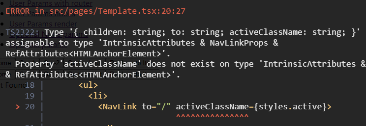
  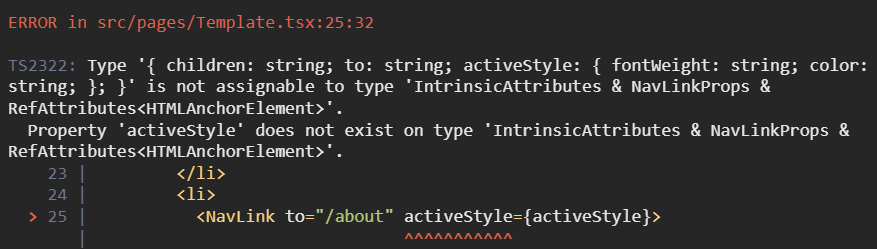

## Changes from Redirect → Navigate

```tsx
// v6 이전
<Switch>
  <Redirect path="/main" to="/user/1" />
</Switch>

// v6 이후
<Routes>
  <Route path="/main" element={<Navigate replace to="/user/1" />} />
</Routes>
```

## renderRoutes → useRoutes

The existing renderRoutes from react-router-config has been changed into a Hook called useRoutes.

```tsx
// v6 이전
// react-router-config
// yarn add react-router-config로 설치 후 사용
import { renderRoutes } from 'react-router-config';

const routes = [
  {
    component: Root,
    routes: [
      {
        path: '/',
        exact: true,
        component: Home,
      },
      {
        path: '/child/:id',
        component: Child,
        routes: [
          {
            path: '/child/:id/grand-child',
            component: GrandChild,
          },
        ],
      },
    ],
  },
];

const Root = ({ route }) => (
  <div>
    <h1>Root</h1>
    {/* 자식 라우트들이 렌더할 수 있도록  renderRoutes 실행 */}
    {renderRoutes(route.routes)}
  </div>
);

const Home = ({ route }) => (
  <div>
    <h2>Home</h2>
  </div>
);

const Child = ({ route }) => (
  <div>
    <h2>Child</h2>
    {/*  renderRoutes가 없으면 자식들은 렌더되지 않음  */}
    {renderRoutes(route.routes)}
  </div>
);

const GrandChild = ({ someProp }) => (
  <div>
    <h3>Grand Child</h3>
    <div>{someProp}</div>
  </div>
);

ReactDOM.render(
  <BrowserRouter>
    {/* renderRoutes에 가장 처음 정의했던 routes 자체를 뿌려줌으로써 차례로 렌더링될 수 있도록 함 */}
    {renderRoutes(routes)}
  </BrowserRouter>,
  document.getElementById('root'),
);

// v6 이후
function App() {
  const element = useRoutes([
    // Route에서 사용하는 props의 요소들과 동일
    { path: '/', element: <Home /> },
    { path: 'dashboard', element: <Dashboard /> },
    {
      path: 'invoices',
      element: <Invoices />,
      // 중첩 라우트의 경우도 Route에서와 같이 children이라는 property를 사용
      children: [
        { path: ':id', element: <Invoice /> },
        { path: 'sent', element: <SentInvoices /> },
      ],
    },
    // NotFound 페이지는 다음과 같이 구현할 수 있음
    { path: '*', element: <NotFound /> },
  ]);

  // element를 return함으로써 적절한 계층으로 구성된 element가 렌더링 될 수 있도록 함
  return element;
}
```

# Migrating to RouterProvider(with createBrowserRouter)

Background for Adoption

Here are the reasons createBrowserRouter was introduced, along with its advantages:

1. **Simplified routing configuration**: With createBrowserRouter, you can declare the route configuration as a single object. This lets you manage route configuration in a simpler and more consistent way.
2. **Route data loading**: createBrowserRouter provides features that make data loading easier to handle. You can load data for each route and process it through a loader function. This allows you to manage both data and route configuration in one place.
3. **Easy management of nested routes**: Setting up nested routes is also more intuitive. createBrowserRouter provides a structure for managing nested routes declaratively and clearly.
4. **Error Boundaries**: You can easily add error boundaries to each route. With createBrowserRouter, setting up error boundaries to handle errors that occur on a specific route becomes straightforward.
5. **Lightweight and optimized**: React Router v6 has been optimized in many areas with performance and usability in mind. createBrowserRouter provides a structure that lets you take advantage of these latest optimizations.

## client side routing

```tsx
import * as React from 'react';
import { createRoot } from 'react-dom/client';
import {
  createBrowserRouter,
  RouterProvider,
  Route,
  Link,
} from 'react-router-dom';

// v5 이전
// router components
<BrowserRouter>
  <Switch>
    <Route
      path="/"
      component={
        <div>
          <h1>Hello World</h1>
          <Link to="about">About Us</Link>
        </div>
      }
    />
    <Route exact path="/about" component={<div>About</div>} />
  </Switch>
</BrowserRouter>;

// v6
// client routers
const router = createBrowserRouter([
  {
    path: '/',
    element: (
      <div>
        <h1>Hello World</h1>
        <Link to="about">About Us</Link>
      </div>
    ),
  },
  {
    path: 'about',
    element: <div>About</div>,
  },
]);

createRoot(document.getElementById('root')).render(
  <RouterProvider router={router} />,
);
```

## Nested Routes

Since you can now specify relative paths when defining a path, nested routing can be implemented, and child paths are set as relative paths of the parent path.

- createRoutesFromElements(Configure nested routes with JSX)
  ```tsx
  // Configure nested routes with JSX
  createBrowserRouter(
    createRoutesFromElements(
      <Route path="/" element={<Root />}>
        <Route path="contact" element={<Contact />} />
        <Route
          path="dashboard"
          element={<Dashboard />}
          loader={({ request }) =>
            fetch('/api/dashboard.json', {
              signal: request.signal,
            })
          }
        />
        <Route element={<AuthLayout />}>
          <Route path="login" element={<Login />} loader={redirectIfUser} />
          <Route path="logout" action={logoutUser} />
        </Route>
      </Route>,
    ),
  );
  ```
- use plain objects
  ```tsx
  createBrowserRouter([
    {
      path: '/',
      element: <Root />,
      children: [
        {
          path: 'contact',
          element: <Contact />,
        },
        {
          path: 'dashboard',
          element: <Dashboard />,
          loader: ({ request }) =>
            fetch('/api/dashboard.json', {
              signal: request.signal,
            }),
        },
        {
          element: <AuthLayout />,
          children: [
            {
              path: 'login',
              element: <Login />,
              loader: redirectIfUser,
            },
            {
              path: 'logout',
              action: logoutUser,
            },
          ],
        },
      ],
    },
  ]);
  ```

## dynamicsegments

```tsx
<Route path="projects/:projectId/tasks/:taskId" />

// If the current location is /projects/abc/tasks/3
<Route
  // sent to loaders
  loader={({ params }) => {
    params.projectId; // abc
    params.taskId; // 3
  }}
  // and actions
  action={({ params }) => {
    params.projectId; // abc
    params.taskId; // 3
  }}
  element={<Task />}
/>;

function Task() {
  // returned from `useParams`
  const params = useParams();
  params.projectId; // abc
  params.taskId; // 3
}

function Random() {
  const match = useMatch(
    "/projects/:projectId/tasks/:taskId"
  );
  match.params.projectId; // abc
  match.params.taskId; // 3
}
```

## ranked routematching

When navigating to the teams/new link, both routes match, but the ranking algorithm connects it to the /teams/new route.

```tsx
<Route path="/teams/:teamId" />
<Route path="/teams/new" />
```

## active links

```tsx
// isActive: user knows where they are (isActive)
// isPending: where they're going (isPending)
<NavLink
  style={({ isActive, isPending }) => {
    return {
      color: isActive ? 'red' : 'inherit',
    };
  }}
  className={({ isActive, isPending }) => {
    return isActive ? 'active' : isPending ? 'pending' : '';
  }}
/>;

function SomeComp() {
  const match = useMatch('/messages');
  return <li className={Boolean(match) ? 'active' : ''} />;
}
```

## relative links

```tsx
<Route path="home" element={<Home />}>
  <Route path="project/:projectId" element={<Project />}>
    <Route path=":taskId" element={<Task />} />
  </Route>
</Route>
```

| **In `<Project>` @ `/home/project/123`** | **Resolved `<a href>`** |
| ---------------------------------------- | ----------------------- |
| `<Link to="abc">`                        | `/home/project/123/abc` |
| `<Link to=".">`                          | `/home/project/123`     |
| `<Link to="..">`                         | `/home`                 |
| `<Link to=".." relative="path">`         | `/home/project`         |

## data loading

Data can be loaded during navigation through a loader.

In addition, the value returned by the loader can be retrieved in each element via useLoaderData.

```tsx
// loader
<Route
  path="/"
  loader={async ({ request }) => {
    // loaders can be async functions
    const res = await fetch('/api/user.json', {
      signal: request.signal,
    });
    const user = await res.json();
    return user;
  }}
  element={<Root />}
>
  <Route
    path=":teamId"
    // loaders understand Fetch Responses and will automatically
    // unwrap the res.json(), so you can simply return a fetch
    loader={({ params }) => {
      return fetch(`/api/teams/${params.teamId}`);
    }}
    element={<Team />}
  >
    <Route
      path=":gameId"
      loader={({ params }) => {
        // of course you can use any data store
        return fakeSdk.getTeam(params.gameId);
      }}
      element={<Game />}
    />
  </Route>
</Route>;

// useLoaderData
function Root() {
  const user = useLoaderData();
  // data from <Route path="/">
}

function Team() {
  const team = useLoaderData();
  // data from <Route path=":teamId">
}

function Game() {
  const game = useLoaderData();
  // data from <Route path=":gameId">
}
```

## redirects

When you want to change routing while data is loading or being mutated, you can navigate using the redirect method.

```tsx
<Route
  path="dashboard"
  loader={async () => {
    const user = await fake.getUser();
    if (!user) {
      // if you know you can't render the route, you can
      // throw a redirect to stop executing code here,
      // sending the user to a new route
      throw redirect("/login");
    }

    // otherwise continue
    const stats = await fake.getDashboardStats();
    return { user, stats };
  }}
/>

<Route
  path="project/new"
  action={async ({ request }) => {
    const data = await request.formData();
    const newProject = await createProject(data);
    // it's common to redirect after actions complete,
    // sending the user to the new record
    return redirect(`/projects/${newProject.id}`);
  }}
/>

```

## pending navigation ui

To show a pending UI before rendering the next page, you can use navigation.state.

```tsx
function Root() {
  const navigation = useNavigation();
  return (
    <div>
      {navigation.state === 'loading' && <GlobalSpinner />}
      <FakeSidebar />
      <Outlet />
      <FakeFooter />
    </div>
  );
}
```

## skeleton-ui-with-suspense

When navigating between pages, if you use the defer method while data is being fetched, you can use the Suspense and Await methods to display a loading/skeleton UI.

```tsx
<Route
  path="issue/:issueId"
  element={<Issue />}
  loader={async ({ params }) => {
    // these are promises, but *not* awaited
    const comments = fake.getIssueComments(params.issueId);
    const history = fake.getIssueHistory(params.issueId);
    // the issue, however, *is* awaited
    const issue = await fake.getIssue(params.issueId);

    // defer enables suspense for the un-awaited promises
    return defer({ issue, comments, history });
  }}
/>;

function Issue() {
  const { issue, history, comments } = useLoaderData();
  return (
    <div>
      <IssueDescription issue={issue} />

      {/* Suspense provides the placeholder fallback */}
      <Suspense fallback={<IssueHistorySkeleton />}>
        {/* Await manages the deferred data (promise) */}
        <Await resolve={history}>
          {/* this calls back when the data is resolved */}
          {resolvedHistory => <IssueHistory history={resolvedHistory} />}
        </Await>
      </Suspense>

      <Suspense fallback={<IssueCommentsSkeleton />}>
        <Await resolve={comments}>
          {/* ... or you can use hooks to access the data */}
          <IssueComments />
        </Await>
      </Suspense>
    </div>
  );
}

function IssueComments() {
  const comments = useAsyncValue();
  return <div>{/* ... */}</div>;
}
```

## form data mutations

Using a form action, you can retrieve the data (name) inside the form.

```tsx
<Form action="/project/new">
  <label>
    Project title
    <br />
    <input type="text" name="title" />
  </label>

  <label>
    Target Finish Date
    <br />
    <input type="date" name="due" />
  </label>
</Form>

<Route
  path="project/new"
  action={async ({ request }) => {
    const formData = await request.formData();
    const newProject = await createProject({
      title: formData.get("title"),
      due: formData.get("due"),
    });
    return redirect(`/projects/${newProject.id}`);
  }}
/>
```

## error-handling

When an error occurs, you can render the component declared as errorElement.

Also, if a child route does not have an errorElement, it falls back to the parent's errorElement.

```tsx
<Route
  path="/"
  loader={() => {
    something.that.throws.an.error();
  }}
  // this will not be rendered
  element={<HappyPath />}
  // but this will instead
  errorElement={<ErrorBoundary />}
/>

<Route
  path="/"
  element={<HappyPath />}
  errorElement={<ErrorBoundary />}
>
  {/* Errors here bubble up to the parent route */}
  <Route path="login" element={<Login />} />
</Route>
```

## opts.basename

When you need to configure a BaseURL, you can set it as an option in the second argument of createBrowserRouter.

However, if you need to set a dynamic param as the basename in the component that declares createBrowserRouter, you can obtain the dynamic param through window.location.pathname to derive a static baseURL.

```tsx
createBrowserRouter(routes, {
  basename: '/teams',
});

// /teams/:teamId
export const getBaseURLInfo = () => {
  const pathname = window.location.pathname;
  const prefix = '/teams';
  const params = pathname
    .replace(prefix, '')
    .split('/')
    .filter(param => param.length > 0);
  if (params.length > 0) {
    return {
      baseName: `${prefix}/${params[0]}`,
      baseParam: params[0],
    };
  }

  return {
    baseName: `${prefix}/${params[0]}`,
    baseParam: '',
  };
};
```

## Reimplementing Prompt (useBlocker)

```tsx
function ImportantForm() {
  let [value, setValue] = React.useState('');

  // Block navigating elsewhere when data has been entered into the input
  let blocker = useBlocker(
    ({ currentLocation, nextLocation }) =>
      value !== '' && currentLocation.pathname !== nextLocation.pathname,
  );

  return (
    <Form method="post">
      <label>
        Enter some important data:
        <input
          name="data"
          value={value}
          onChange={e => setValue(e.target.value)}
        />
      </label>
      <button type="submit">Save</button>

      {blocker.state === 'blocked' ? (
        <div>
          <p>Are you sure you want to leave?</p>
          <button onClick={() => blocker.proceed()}>Proceed</button>
          <button onClick={() => blocker.reset()}>Cancel</button>
        </div>
      ) : null}
    </Form>
  );
}
```

## Outlet, useOutletContext

When you need to declare different child components per path, you can branch on the location pathname and then handle the outlet.

Also, when passing data to a child component, you can pass a context prop and the child router component can retrieve the value via useOutletContext.

```tsx
{
  location.pathname.indexOf('/a') > -1 ? (
    <Outlet context={{ type: 'a' }} />
  ) : (
    <Outlet context={{ type: 'b' }} />
  );
}

export const B = () => {
  const { type } = useOutletContext<{ type: string }>();
};
```

- [optimistic-ui](https://reactrouter.com/en/main/start/tutorial#optimistic-ui)
- [not-found-data](https://reactrouter.com/en/main/start/tutorial#not-found-data)
- [pathless-routes](https://reactrouter.com/en/main/start/tutorial#pathless-routes)
- [jsx-routes](https://reactrouter.com/en/main/start/tutorial#jsx-routes)

## References

[https://reactrouter.com/docs/en/v6/upgrading/v5](https://reactrouter.com/docs/en/v6/upgrading/v5)

[https://gist.github.com/rmorse/426ffcc579922a82749934826fa9f743#file-usage-useprompt-react-router-dom-js](https://gist.github.com/rmorse/426ffcc579922a82749934826fa9f743#file-usage-useprompt-react-router-dom-js)

[https://velog.io/@velopert/react-router-v6-tutorial](https://velog.io/@velopert/react-router-v6-tutorial)
