# v6

## React Router v6 정식 릴리즈

2021년 11월 4일 v6.0.0 beta → release 출시되었습니다.

## React v16.8 이상으로 업그레이드

단, React ≥ 15 이상이면 react router v5 이상을 호환하고 있어서 v6로 업그레이드 하지 않더라도 react만 업그레이드 가능합니다.

- 샘플코드: https://github.com/seungahhong/react-router-tutorial

## React Router v6 장점

- 기존 버전에 비해서 버들 사이즈가 70% 정도 감소했습니다.(빌드시간 감소??)

v5.1 버전의 크기는 9.4kb → v6 버전의 크기는 2.9kb로 감소했습니다.

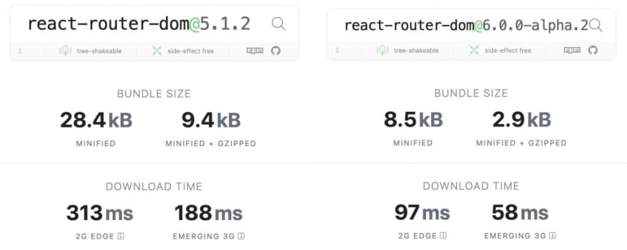

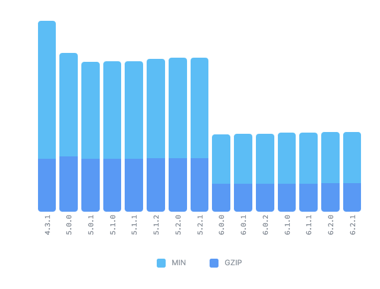

- React Hooks 전반적인 지원(hoc 등 기능지원 들이 사라짐)
- 구 브라우저에 대한 지원 중단(단, polyfill 사용으로 대응가능)
  - IE 11 지원
    - package.json IE11 브라우저 지원하도록 추가
    ```bash
    "browserslist": {
        "production": [
          "...",
          "ie 11"
        ],
        "development": [
          "...",
          "ie 11"
        ]
      },
    ```
    - polyfill 추가
      - react-app-polyfill(facebook 제공)
        - 리액트 개발에서 사용하는 다양한 문법을 변환해주는 라이브러리
        - Promise, window.fetch, Symbol, Object.assign, Array.from + [ IE9 Map, Set ]와 같은 필요한 것만 포함하고 있어 사이즈가 작아 가벼운 게 특징
      ```tsx
      // src/index.tsx
      // 첫번째 라인에 추가
      import 'react-app-polyfill/ie11';
      import 'react-app-polyfill/stable'; // async,await,generator 문법사용
      import React from 'react';
      ```
- 상대경로 사용으로 인한 코드량 감소(match.url, match.path)
- 기능에 대한 단일화된 표준
  - 예) Router → element 통합

## React Router v6 설치

```solidity
npm install react-router-dom // react-router-dom@6
```

## Switch → Routes 변경사항

- Switch 처럼 순서를 기준으로 선택하는 것이 아닌, 가장 일치하는 라우트를 기반인 기능으로 변경
- Switch → Routes 변경(route는 routes에 children이어야 함)
- exact props 삭제
  - 서브경로가 필요한 경우 path \* 사용
- component, children, render → element 통일

```tsx
// v6 이전
<Switch>
  <Route path="/about" render={() => <About />} />
  <Route exact path="/" component={Home} />
  <Route path={'/*'}> // <Route>
    <div>Not Found</div>
  </Route>
</Switch>

// v6 이후
<Routes>
  <Route path="/about" element={<About />} />
  <Route path="/" element={<Home />} />
  <Route path={'/*'} element={<div>Not Found</div>} />
</Routes>
```

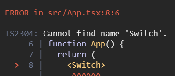

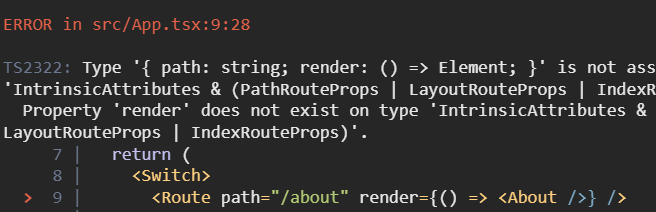

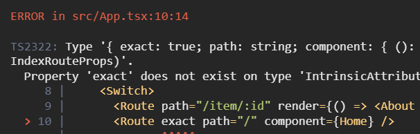

## withRouter → hooks 변경사항

- withRouter 삭제로 인한 hooks api 변경
  - match: useMatch → 현재 상대경로(단, 속성값이 달라져서 확인필요)
  - history: useNavigate 지원
  - location: useLocation ( v5 이후에서도 지원)

```tsx
// v6 이전
import React from 'react';
import { RouteComponentProps } from 'react-router';
import { withRouter } from 'react-router-dom';

interface MatchParams {
  id: string;
}

const WithRouter = ({
  match,
  location,
  history,
}: RouteComponentProps<MatchParams>) => {
  return (
    <>
      <h1>WithRouter</h1>
      <p>{match?.params?.id}</p>
      <p>{location.pathname}</p>
      <p>{history.length}</p>
    </>
  );
};

WithRouter.defaultProps = {};

export default withRouter(WithRouter);

// v6 이후
import React from 'react';
import { useMatch, useNavigate, useLocation } from 'react-router-dom';

const WithRouter = () => {
  const match = useMatch('/with/:id');
  const history = useNavigate();
  const location = useLocation();
  return (
    <>
      <h1>WithRouter</h1>
      <p>{match?.params?.id}</p>
      <p>{location.pathname}</p>
      <p>{history.length}</p>
    </>
  );
};

WithRouter.defaultProps = {};

export default WithRouter;
```

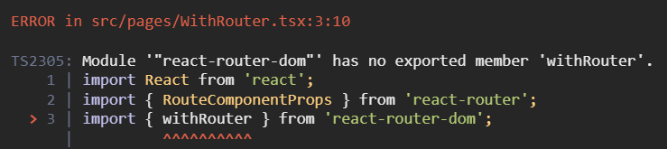

## useHistory → useNavigate 변경사항

useHistory hooks 대체로 useNavigate 변경

- useHistory 리턴값(객체) vs useNavigate 리턴값(함수)
- 기존에는 용도에 맞게 go, goBback, goForward, push, replace 메서드 호출에서 직관적인 함수호출로 변경

```tsx
// v6 이전
import React from 'react';
import { useHistory } from 'react-router';

const Navigation = () => {
  const history = useHistory();

  return (
    <div>
      <button
        onClick={() => {
          history.push('/');
        }}
      >
        Home
      </button>
      <button
        onClick={() => {
          history.goBack();
        }}
      >
        Go -1
      </button>
      <button
        onClick={() => {
          history.go(-2);
        }}
      >
        Go -2
      </button>
      <button
        onClick={() => {
          history.push('/about');
        }}
      >
        Go to about
      </button>
      <button
        onClick={() => {
          history.replace('Item/2');
        }}
      >
        Replace to Item
      </button>
    </div>
  );
};

Navigation.defaultProps = {};

export default Navigation;

// v6 이후
import React from 'react';
import { useNavigate } from 'react-router';

const Navigation = () => {
  const navigation = useNavigate();

  return (
    <div>
      <button
        onClick={() => {
          navigation('/'); // vs history.push('/');
        }}
      >
        Home
      </button>
      <button
        onClick={() => {
          navigation(-1); // vs history.goBack();
        }}
      >
        Go -1
      </button>
      <button
        onClick={() => {
          navigation(-2); // vs history.go(-2);
        }}
      >
        Go -2
      </button>
      <button
        onClick={() => {
          navigation('/about'); // vs history.push('/about');
        }}
      >
        Go to about
      </button>
      <button
        onClick={() => {
          navigation('Item/2', {
            // vs history.replace('Item/2');
            replace: true,
          });
        }}
      >
        Replace to Item
      </button>
    </div>
  );
};

Navigation.defaultProps = {};

export default Navigation;
```

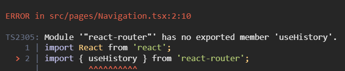

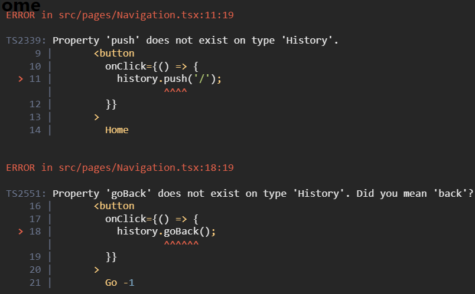

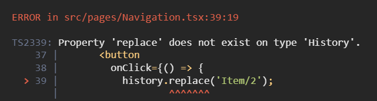

## useRouteMatch 변경사항

- useRouteMatch 사라져서, 기존에 현재 url을 얻기위한 match.path, match.url 사라짐
  - 현재 라우터 기준의 상대경로로 변경

```tsx
// v6 이전
import React from 'react';
import { Link, Route, useParams, useRouteMatch } from 'react-router-dom';
import About from './About';
import Main from './Main';

type UserProps = {
  id: string;
};

const User = () => {
  const match = useRouteMatch();
  const { id } = useParams<UserProps>();

  return (
    <>
      <h1>{`User ${id}`}</h1>
      <ul>
        <li>
          <Link to={`${match.url}`}>Main</Link>
        </li>
        <li>
          <Link to={`${match.url}/about`}>About</Link>
        </li>
      </ul>
      <Route path={match.path} exact>
        <Main />
      </Route>
      <Route path={`${match.path}/about`} exact>
        <About />
      </Route>
    </>
  );
};

User.defaultProps = {};

export default User;

// v6 이후
// user 서브 경로 추가하기 위해서 * 추가
function App() {
  return (
    <>
      <Navigation />
      <Routes>
        <Route path="/about" element={<About />} />
        <Route path="/users/:id/*" element={<User />} />
        <Route path="/with/:id" element={<WithRouter />} />
        <Route path="/" element={<Home />} />
        <Route path={'*'} element={<div>Not Found</div>} />
      </Routes>
    </>
  );
}

import React from 'react';
import { Link, Route, Routes, useParams } from 'react-router-dom';
import About from './About';
import Main from './Main';

type UserProps = {
  id: string;
};

const User = () => {
  // const match = useRouteMatch();
  const { id } = useParams<UserProps>();

  return (
    <>
      <h1>{`User ${id}`}</h1>
      <ul>
        <li>
          <Link to="">Main</Link>
        </li>
        <li>
          <Link to="about">About</Link>
        </li>
      </ul>
      <Routes>
        <Route path="" element={<Main />} />
        <Route path="about" element={<About />} />
      </Routes>
    </>
  );
};

User.defaultProps = {};

export default User;
```

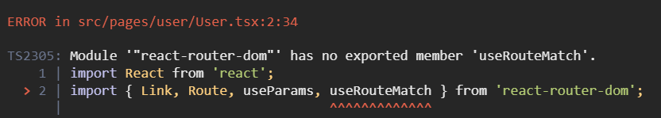

## 서브라우터에 다른 구현 Outlet

```tsx
// v6 이전
// App.tsx
<Route path="/user/:id">
  <User />
</Route>

// User.tsx
<>
  <h1>{`User ${id}`}</h1>
  <ul>
    <li>
      <Link to={`${match.url}`}>Main</Link>
    </li>
    <li>
      <Link to={`${match.url}/about`}>About</Link>
    </li>
  </ul>
  <Route path={match.path} exact>
    <UserMain />
  </Route>
  <Route path={`${match.path}/about`} exact>
    <UserAbout />
  </Route>
</>

// v6 이후
// App.tsx
<Route path="/useroutlet/:id/*" element={<UserOutlet />}>
  <Route path="" element={<UserMain />} />
  <Route path="about" element={<UserAbout />} />
</Route>

// User.tsx
<>
  <h1>{`User ${id}`}</h1>
  <ul>
    <li>
      <Link to="">Main</Link>
    </li>
    <li>
      <Link to="about">About</Link>
    </li>
  </ul>
  <Outlet />
</>
```

## Optional URL → Multi Route 추가

```tsx
// v6 이전
<Route path="/optional/:value?" element={<Optional />} />

// v6 이후
<Route path="/optional/:value" element={<Optional />} />
<Route path="/optional/" element={<Optional />} />
```

## NavLink 변경사항

- activeStye, activeClassName 사라지고, isActive Props로 변경
  - activeClassName → className={({ isActive }) => (isActive ? styles.active : '')}
  - activeStyle={activeStyle} → style={({ isActive }) => (isActive ? activeStyle : {})}
- exact → end 로 변경

  ```tsx
  // v6 이전
  import React from 'react';
  import { NavLink } from 'react-router-dom';
  import styles from './Template.module.scss';
  import Navigation from './Navigation';

  type TemplateProps = {
    children: React.ReactChild;
  };

  const Template = ({ children }: TemplateProps) => {
    const activeStyle = {
      fontWeight: 'bold',
      color: 'red',
    };

    return (
      <div>
        <ul>
          <li>
            <NavLink to="/" exact activeClassName={styles.active}>
              Home
            </NavLink>
          </li>
          <li>
            <NavLink to="/about" activeStyle={activeStyle}>
              About
            </NavLink>
          </li>
          <li>
            <NavLink to="/with/1" activeStyle={activeStyle}>
              User Params with router
            </NavLink>
          </li>
          <li>
            <NavLink to="/user/1" activeStyle={activeStyle}>
              User Params hooks
            </NavLink>
          </li>
          <li>
            <NavLink to="/item/2" activeStyle={activeStyle}>
              User Params render
            </NavLink>
          </li>
          <li>
            <NavLink to="/optional" exact activeStyle={activeStyle}>
              Optional None params
            </NavLink>
          </li>
          <li>
            <NavLink to="/optional/3" activeStyle={activeStyle}>
              Optional params
            </NavLink>
          </li>
        </ul>
        <Navigation />
        {children}
      </div>
    );
  };

  Template.defaultProps = {};

  export default Template;

  // v6 이후
  import React from 'react';
  import { NavLink } from 'react-router-dom';
  import styles from './Template.module.scss';
  import Navigation from './Navigation';

  type TemplateProps = {
    children: React.ReactChild;
  };

  const Template = ({ children }: TemplateProps) => {
    const activeStyle = {
      fontWeight: 'bold',
      color: 'red',
    };

    return (
      <div>
        <ul>
          <li>
            <NavLink
              to="/"
              className={({ isActive }) => (isActive ? styles.active : '')}
            >
              Home
            </NavLink>
          </li>
          <li>
            <NavLink
              to="/about"
              style={({ isActive }) => (isActive ? activeStyle : {})}
            >
              About
            </NavLink>
          </li>
          <li>
            <NavLink
              to="/with/1"
              style={({ isActive }) => (isActive ? activeStyle : {})}
            >
              User Params with router
            </NavLink>
          </li>
          <li>
            <NavLink
              to="/user/1"
              style={({ isActive }) => (isActive ? activeStyle : {})}
            >
              User Params hooks
            </NavLink>
          </li>
          <li>
            <NavLink
              to="/useroutlet/1"
              style={({ isActive }) => (isActive ? activeStyle : {})}
            >
              User Outlet Params hooks
            </NavLink>
          </li>
          <li>
            <NavLink
              to="/item/2"
              style={({ isActive }) => (isActive ? activeStyle : {})}
            >
              User Params render
            </NavLink>
          </li>
          <li>
            <NavLink
              to="/optional"
              end
              style={({ isActive }) => (isActive ? activeStyle : {})}
            >
              Optional None params
            </NavLink>
          </li>
          <li>
            <NavLink
              to="/optional/3"
              style={({ isActive }) => (isActive ? activeStyle : {})}
            >
              Optional params
            </NavLink>
          </li>
        </ul>
        <Navigation />
        {children}
      </div>
    );
  };

  Template.defaultProps = {};

  export default Template;
  ```

  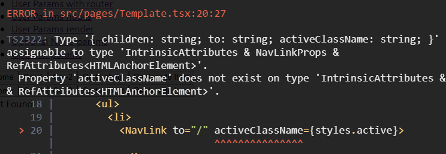
  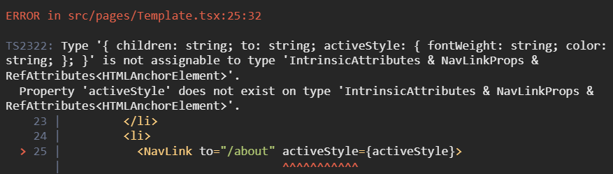

## Redirect → Navigate 변경사항

```tsx
// v6 이전
<Switch>
  <Redirect path="/main" to="/user/1" />
</Switch>

// v6 이후
<Routes>
  <Route path="/main" element={<Navigate replace to="/user/1" />} />
</Routes>
```

## renderRoutes → useRoutes

기존의 react-router-config의 renderRouters가 useRoutes라는 Hook 으로 변경됨.

```tsx
// v6 이전
// react-router-config
// yarn add react-router-config로 설치 후 사용
import { renderRoutes } from 'react-router-config';

const routes = [
  {
    component: Root,
    routes: [
      {
        path: '/',
        exact: true,
        component: Home,
      },
      {
        path: '/child/:id',
        component: Child,
        routes: [
          {
            path: '/child/:id/grand-child',
            component: GrandChild,
          },
        ],
      },
    ],
  },
];

const Root = ({ route }) => (
  <div>
    <h1>Root</h1>
    {/* 자식 라우트들이 렌더할 수 있도록  renderRoutes 실행 */}
    {renderRoutes(route.routes)}
  </div>
);

const Home = ({ route }) => (
  <div>
    <h2>Home</h2>
  </div>
);

const Child = ({ route }) => (
  <div>
    <h2>Child</h2>
    {/*  renderRoutes가 없으면 자식들은 렌더되지 않음  */}
    {renderRoutes(route.routes)}
  </div>
);

const GrandChild = ({ someProp }) => (
  <div>
    <h3>Grand Child</h3>
    <div>{someProp}</div>
  </div>
);

ReactDOM.render(
  <BrowserRouter>
    {/* renderRoutes에 가장 처음 정의했던 routes 자체를 뿌려줌으로써 차례로 렌더링될 수 있도록 함 */}
    {renderRoutes(routes)}
  </BrowserRouter>,
  document.getElementById('root'),
);

// v6 이후
function App() {
  const element = useRoutes([
    // Route에서 사용하는 props의 요소들과 동일
    { path: '/', element: <Home /> },
    { path: 'dashboard', element: <Dashboard /> },
    {
      path: 'invoices',
      element: <Invoices />,
      // 중첩 라우트의 경우도 Route에서와 같이 children이라는 property를 사용
      children: [
        { path: ':id', element: <Invoice /> },
        { path: 'sent', element: <SentInvoices /> },
      ],
    },
    // NotFound 페이지는 다음과 같이 구현할 수 있음
    { path: '*', element: <NotFound /> },
  ]);

  // element를 return함으로써 적절한 계층으로 구성된 element가 렌더링 될 수 있도록 함
  return element;
}
```

# Migrating to RouterProvider(with createBrowserRouter)

도입배경

createBrowserRouter가 도입된 이유와 장점입니다:

1. **단순화된 라우팅 설정**: createBrowserRouter를 사용하면 라우트 구성을 하나의 객체로 선언할 수 있습니다. 이로 인해 라우트 설정을 보다 간단하고 일관성 있게 관리할 수 있습니다.
2. **라우트 데이터 로딩**: createBrowserRouter는 데이터 로딩을 더 쉽게 처리할 수 있는 기능을 제공합니다. 라우트마다 데이터를 로드하고, 이를 loader 함수를 통해 처리할 수 있습니다. 이로 인해 데이터와 라우트 설정을 한 곳에서 관리할 수 있습니다.
3. **중첩 라우트의 간편한 관리**: 중첩 라우트(nested routes)를 설정하는 것도 더 직관적입니다. createBrowserRouter는 중첩 라우트를 선언적이고 명확하게 관리할 수 있는 구조를 제공합니다.
4. **에러 경계(Error Boundaries)**: 각 라우트에 에러 경계를 쉽게 추가할 수 있습니다. createBrowserRouter를 사용하면 특정 라우트에서 발생하는 오류를 처리하기 위해 에러 경계를 설정하는 것이 간편해집니다.
5. **경량화 및 최적화**: React Router v6는 성능과 사용성을 고려하여 많은 부분이 최적화되었습니다. createBrowserRouter는 이러한 최신 최적화를 활용할 수 있는 구조를 제공합니다.

## client side routing

```tsx
import * as React from 'react';
import { createRoot } from 'react-dom/client';
import {
  createBrowserRouter,
  RouterProvider,
  Route,
  Link,
} from 'react-router-dom';

// v5 이전
// router components
<BrowserRouter>
  <Switch>
    <Route
      path="/"
      component={
        <div>
          <h1>Hello World</h1>
          <Link to="about">About Us</Link>
        </div>
      }
    />
    <Route exact path="/about" component={<div>About</div>} />
  </Switch>
</BrowserRouter>;

// v6
// client routers
const router = createBrowserRouter([
  {
    path: '/',
    element: (
      <div>
        <h1>Hello World</h1>
        <Link to="about">About Us</Link>
      </div>
    ),
  },
  {
    path: 'about',
    element: <div>About</div>,
  },
]);

createRoot(document.getElementById('root')).render(
  <RouterProvider router={router} />,
);
```

## Nested Routes

path 지정 시에 상대경로를 지정해줄 수 있게 되면서 중첩 라우팅 구현이 가능하며, 자식 패스는 부모 패스의 상대 경로로 설정됩니다.

- createRoutesFromElements(Configure nested routes with JSX)
  ```tsx
  // Configure nested routes with JSX
  createBrowserRouter(
    createRoutesFromElements(
      <Route path="/" element={<Root />}>
        <Route path="contact" element={<Contact />} />
        <Route
          path="dashboard"
          element={<Dashboard />}
          loader={({ request }) =>
            fetch('/api/dashboard.json', {
              signal: request.signal,
            })
          }
        />
        <Route element={<AuthLayout />}>
          <Route path="login" element={<Login />} loader={redirectIfUser} />
          <Route path="logout" action={logoutUser} />
        </Route>
      </Route>,
    ),
  );
  ```
- use plain objects
  ```tsx
  createBrowserRouter([
    {
      path: '/',
      element: <Root />,
      children: [
        {
          path: 'contact',
          element: <Contact />,
        },
        {
          path: 'dashboard',
          element: <Dashboard />,
          loader: ({ request }) =>
            fetch('/api/dashboard.json', {
              signal: request.signal,
            }),
        },
        {
          element: <AuthLayout />,
          children: [
            {
              path: 'login',
              element: <Login />,
              loader: redirectIfUser,
            },
            {
              path: 'logout',
              action: logoutUser,
            },
          ],
        },
      ],
    },
  ]);
  ```

## dynamicsegments

```tsx
<Route path="projects/:projectId/tasks/:taskId" />

// If the current location is /projects/abc/tasks/3
<Route
  // sent to loaders
  loader={({ params }) => {
    params.projectId; // abc
    params.taskId; // 3
  }}
  // and actions
  action={({ params }) => {
    params.projectId; // abc
    params.taskId; // 3
  }}
  element={<Task />}
/>;

function Task() {
  // returned from `useParams`
  const params = useParams();
  params.projectId; // abc
  params.taskId; // 3
}

function Random() {
  const match = useMatch(
    "/projects/:projectId/tasks/:taskId"
  );
  match.params.projectId; // abc
  match.params.taskId; // 3
}
```

## ranked routematching

teams/new 링크 이동 시 2개 라우터가 같이 매칭되지만 랭킹 알고리즘에 의해서 /teams/new 라우터로 연결됩니다.

```tsx
<Route path="/teams/:teamId" />
<Route path="/teams/new" />
```

## active links

```tsx
// isActive: user knows where they are (isActive)
// isPending: where they're going (isPending)
<NavLink
  style={({ isActive, isPending }) => {
    return {
      color: isActive ? 'red' : 'inherit',
    };
  }}
  className={({ isActive, isPending }) => {
    return isActive ? 'active' : isPending ? 'pending' : '';
  }}
/>;

function SomeComp() {
  const match = useMatch('/messages');
  return <li className={Boolean(match) ? 'active' : ''} />;
}
```

## relative links

```tsx
<Route path="home" element={<Home />}>
  <Route path="project/:projectId" element={<Project />}>
    <Route path=":taskId" element={<Task />} />
  </Route>
</Route>
```

| **In `<Project>` @ `/home/project/123`** | **Resolved `<a href>`** |
| ---------------------------------------- | ----------------------- |
| `<Link to="abc">`                        | `/home/project/123/abc` |
| `<Link to=".">`                          | `/home/project/123`     |
| `<Link to="..">`                         | `/home`                 |
| `<Link to=".." relative="path">`         | `/home/project`         |

## data loading

navigation 동안에 데이터의 로딩을 loader를 통해서 제공하고 있습니다.

또한, loader를 통해서 리턴한 값을 각 element에서는 useLoaderData를 통해서 얻어 올 수 있습니다.

```tsx
// loader
<Route
  path="/"
  loader={async ({ request }) => {
    // loaders can be async functions
    const res = await fetch('/api/user.json', {
      signal: request.signal,
    });
    const user = await res.json();
    return user;
  }}
  element={<Root />}
>
  <Route
    path=":teamId"
    // loaders understand Fetch Responses and will automatically
    // unwrap the res.json(), so you can simply return a fetch
    loader={({ params }) => {
      return fetch(`/api/teams/${params.teamId}`);
    }}
    element={<Team />}
  >
    <Route
      path=":gameId"
      loader={({ params }) => {
        // of course you can use any data store
        return fakeSdk.getTeam(params.gameId);
      }}
      element={<Game />}
    />
  </Route>
</Route>;

// useLoaderData
function Root() {
  const user = useLoaderData();
  // data from <Route path="/">
}

function Team() {
  const team = useLoaderData();
  // data from <Route path=":teamId">
}

function Game() {
  const game = useLoaderData();
  // data from <Route path=":gameId">
}
```

## redirects

데이터를 로딩/변경되는 동안 라우팅을 변경할 경우 redirect 메서드를 사용해서 이동이 가능합니다.

```tsx
<Route
  path="dashboard"
  loader={async () => {
    const user = await fake.getUser();
    if (!user) {
      // if you know you can't render the route, you can
      // throw a redirect to stop executing code here,
      // sending the user to a new route
      throw redirect("/login");
    }

    // otherwise continue
    const stats = await fake.getDashboardStats();
    return { user, stats };
  }}
/>

<Route
  path="project/new"
  action={async ({ request }) => {
    const data = await request.formData();
    const newProject = await createProject(data);
    // it's common to redirect after actions complete,
    // sending the user to the new record
    return redirect(`/projects/${newProject.id}`);
  }}
/>

```

## pending navigation ui

다음 페이지를 렌더링 하기 전에 펜딩 UI를 표기하기 위해서 navigation.state를 사용하면 됩니다.

```tsx
function Root() {
  const navigation = useNavigation();
  return (
    <div>
      {navigation.state === 'loading' && <GlobalSpinner />}
      <FakeSidebar />
      <Outlet />
      <FakeFooter />
    </div>
  );
}
```

## skeleton-ui-with-suspense

페이지 이동 시 데이터를 얻어오는 중간에 defer 메서드를 사용 시 Suspense, Await 메서드 사용해서 로딩/스켈레톤 UI 사용이 가능합니다.

```tsx
<Route
  path="issue/:issueId"
  element={<Issue />}
  loader={async ({ params }) => {
    // these are promises, but *not* awaited
    const comments = fake.getIssueComments(params.issueId);
    const history = fake.getIssueHistory(params.issueId);
    // the issue, however, *is* awaited
    const issue = await fake.getIssue(params.issueId);

    // defer enables suspense for the un-awaited promises
    return defer({ issue, comments, history });
  }}
/>;

function Issue() {
  const { issue, history, comments } = useLoaderData();
  return (
    <div>
      <IssueDescription issue={issue} />

      {/* Suspense provides the placeholder fallback */}
      <Suspense fallback={<IssueHistorySkeleton />}>
        {/* Await manages the deferred data (promise) */}
        <Await resolve={history}>
          {/* this calls back when the data is resolved */}
          {resolvedHistory => <IssueHistory history={resolvedHistory} />}
        </Await>
      </Suspense>

      <Suspense fallback={<IssueCommentsSkeleton />}>
        <Await resolve={comments}>
          {/* ... or you can use hooks to access the data */}
          <IssueComments />
        </Await>
      </Suspense>
    </div>
  );
}

function IssueComments() {
  const comments = useAsyncValue();
  return <div>{/* ... */}</div>;
}
```

## form data mutations

form action을 사용해서 form 안에 데이터(name)를 얻어올 수 있습니다.

```tsx
<Form action="/project/new">
  <label>
    Project title
    <br />
    <input type="text" name="title" />
  </label>

  <label>
    Target Finish Date
    <br />
    <input type="date" name="due" />
  </label>
</Form>

<Route
  path="project/new"
  action={async ({ request }) => {
    const formData = await request.formData();
    const newProject = await createProject({
      title: formData.get("title"),
      due: formData.get("due"),
    });
    return redirect(`/projects/${newProject.id}`);
  }}
/>
```

## error-handling

에러가 생길 경우 errorElement 선언된 컴포넌트 렌더링이 가능합니다.

또한 자식 라우트에서 errorElement가 없는경우 부모 errorElement 따라가게 됩니다.

```tsx
<Route
  path="/"
  loader={() => {
    something.that.throws.an.error();
  }}
  // this will not be rendered
  element={<HappyPath />}
  // but this will instead
  errorElement={<ErrorBoundary />}
/>

<Route
  path="/"
  element={<HappyPath />}
  errorElement={<ErrorBoundary />}
>
  {/* Errors here bubble up to the parent route */}
  <Route path="login" element={<Login />} />
</Route>
```

## opts.basename

BaseURL 설정을 해야하는 경우 createBrowserRouter 2번쨰 인자에 옵션으로 설정이 가능합니다.

단, createBrowserRouter 선언 컴포넌트에서 동적 param을 basename으로 설정을 해야하는 경우 window.location.pathname을 통해서 동적 param을 얻어와서 정적 baseURL을 얻어올 수 있습니다.

```tsx
createBrowserRouter(routes, {
  basename: '/teams',
});

// /teams/:teamId
export const getBaseURLInfo = () => {
  const pathname = window.location.pathname;
  const prefix = '/teams';
  const params = pathname
    .replace(prefix, '')
    .split('/')
    .filter(param => param.length > 0);
  if (params.length > 0) {
    return {
      baseName: `${prefix}/${params[0]}`,
      baseParam: params[0],
    };
  }

  return {
    baseName: `${prefix}/${params[0]}`,
    baseParam: '',
  };
};
```

## Prompt 재구현(useBlocker)

```tsx
function ImportantForm() {
  let [value, setValue] = React.useState('');

  // Block navigating elsewhere when data has been entered into the input
  let blocker = useBlocker(
    ({ currentLocation, nextLocation }) =>
      value !== '' && currentLocation.pathname !== nextLocation.pathname,
  );

  return (
    <Form method="post">
      <label>
        Enter some important data:
        <input
          name="data"
          value={value}
          onChange={e => setValue(e.target.value)}
        />
      </label>
      <button type="submit">Save</button>

      {blocker.state === 'blocked' ? (
        <div>
          <p>Are you sure you want to leave?</p>
          <button onClick={() => blocker.proceed()}>Proceed</button>
          <button onClick={() => blocker.reset()}>Cancel</button>
        </div>
      ) : null}
    </Form>
  );
}
```

## Outlet, useOutletContext

패스별로 자식 컴포넌트를 선언을 다르게 해야할 경우 location pathname 분기 후 outlet을 처리를 진행할 수 있습니다.

또한 자식 컴포넌트에 데이터를 넘길 경우 context props 넘기고 자식 라우터 컴포넌트는 useOutletContext에서 값을 얻어올 수 있습니다.

```tsx
{
  location.pathname.indexOf('/a') > -1 ? (
    <Outlet context={{ type: 'a' }} />
  ) : (
    <Outlet context={{ type: 'b' }} />
  );
}

export const B = () => {
  const { type } = useOutletContext<{ type: string }>();
};
```

- [optimistic-ui](https://reactrouter.com/en/main/start/tutorial#optimistic-ui)
- [not-found-data](https://reactrouter.com/en/main/start/tutorial#not-found-data)
- [pathless-routes](https://reactrouter.com/en/main/start/tutorial#pathless-routes)
- [jsx-routes](https://reactrouter.com/en/main/start/tutorial#jsx-routes)

## 참고페이지

[https://reactrouter.com/docs/en/v6/upgrading/v5](https://reactrouter.com/docs/en/v6/upgrading/v5)

[https://gist.github.com/rmorse/426ffcc579922a82749934826fa9f743#file-usage-useprompt-react-router-dom-js](https://gist.github.com/rmorse/426ffcc579922a82749934826fa9f743#file-usage-useprompt-react-router-dom-js)

[https://velog.io/@velopert/react-router-v6-tutorial](https://velog.io/@velopert/react-router-v6-tutorial)
