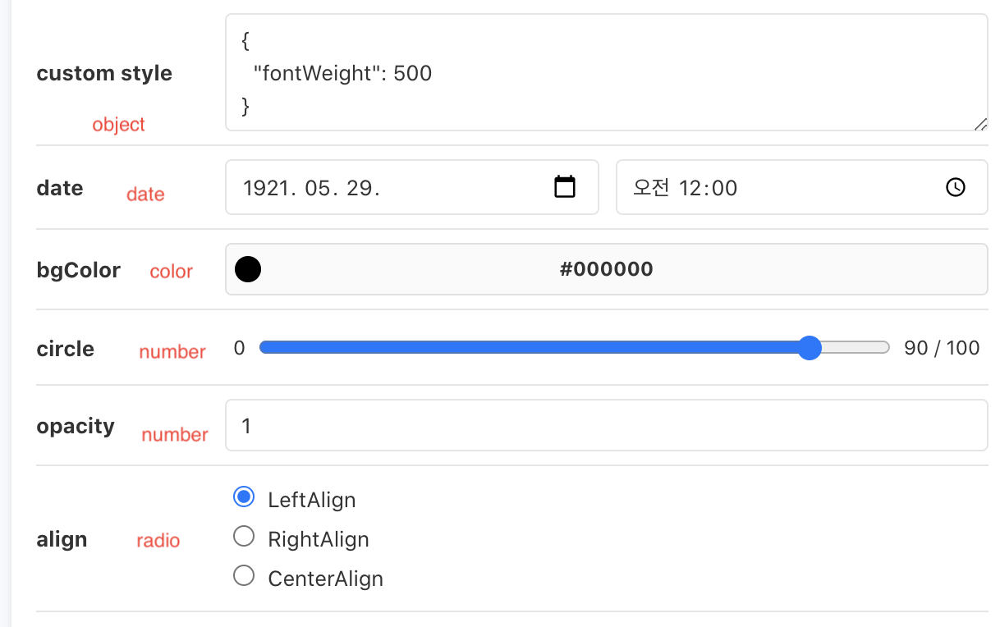
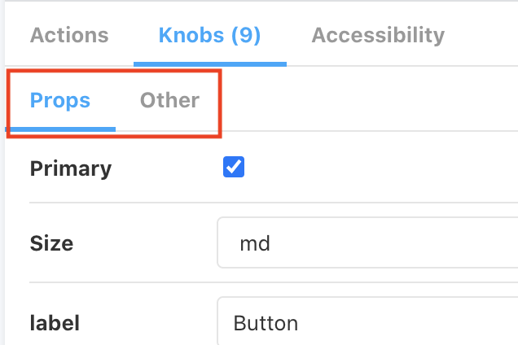
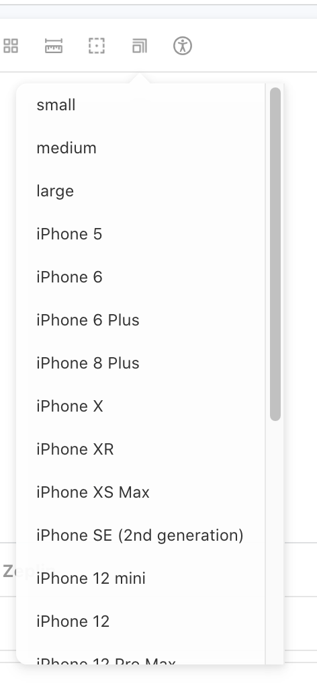
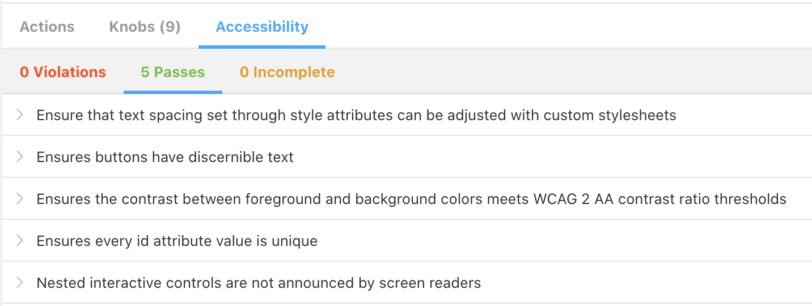
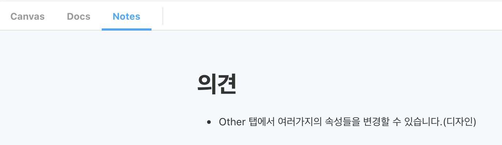
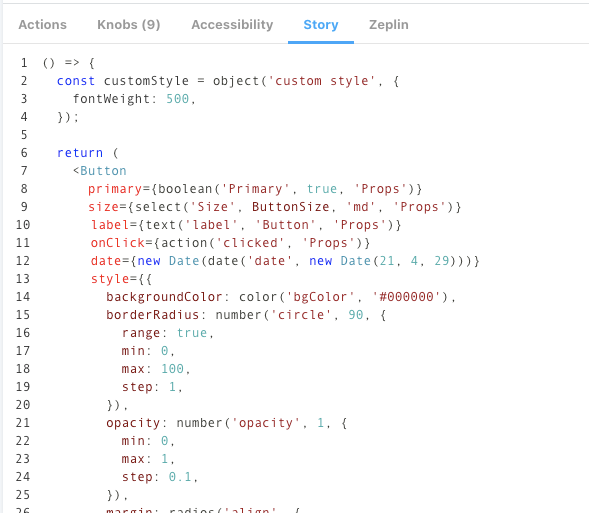

# Purpose of Adoption

- As planning and design proceed in parallel and the spec keeps changing, the goal is to reflect those changes and share them with planners and designers.
- When working in parallel with the backend as well, the logic (container) and the view (presentation) must be separated, so we develop components at the Storybook level to validate that separation.
- Storybook is actively leveraged later when running screen-level tests.
- Others
  - We also develop screen-level components while considering accessibility.

# Applying addon-controls

```bash
npm i -D @storybook/addon-controls
or
yarn add -dev @storybook/addon-controls
```

```jsx
module.exports = {
  ...
  "addons": [
    ...
    "@storybook/addon-controls",
    ...
  ],
  ...
}
```

# Applying addon-knobs

- @storybook/addon-knobs
  - An addon that helps you interact with various components.
- Types of Knobs controls
  - text: Lets you enter text.
  - boolean: Lets you set a true/false value with a checkbox.
  - number: Lets you enter a number. You can also set intervals such as 1–10.
  - color: Lets you set a color through a color palette.
  - object: Lets you set an object or array in JSON form.
  - select: Lets you choose one of several options through a select box.
  - radios: Lets you choose one of several options through radio buttons.
  - date: Lets you pick a date.
    

```jsx
export const ButtonComponent = () => {
  const customStyle = object('custom style', {
    fontWeight: 500,
  });

  return (
    <Button
      primary={boolean('Primary', true, 'Props')}
      size={select('Size', ButtonSize, 'md', 'Props')}
      label={text('label', 'Button', 'Props')}
      onClick={action('clicked', 'Props')}
      date={new Date(date('date', new Date(21, 4, 29)))}
      style={
        backgroundColor: color('bgColor', '#000000'),
        borderRadius: number('circle', 90, {
          range: true,
          min: 0,
          max: 100,
          step: 1,
        }),
        opacity: number('opacity', 1, {
          min: 0,
          max: 1,
          step: 0.1,
        }),
        margin: radios(
          'align',
          {
            LeftAlign: '0',
            RightAlign: '0 0 0 auto',
            CenterAlign: '0 auto',
          },
          '0',
        ),
        ...customStyle,
      }
    />
  );
};
```

- Knobs control groups
  - Group the Props that need to be provided in the planning/design guide, and exclude the rest. - Props: provided in the planning/design guide - Other: attributes shared only for planning/design purposes
    

```jsx
// stories
primary={boolean('Primary', true, 'Props')} // Props 그룹일경우

backgroundColor={color('bgColor', '#000000')} // 기획/디자인에만 공유할 경우(3번째 인자를 넣지 않는다.)

// components(Button)
// 기획/디자인에만 공유할 컴포넌트 인경우 rest문법(...props)을 통해서 넣도록 한다.
export const Button = ({ primary, size, label, ...props }) => {
  const mode = primary ? 'storybook-button--primary' : 'storybook-button--secondary';
  return (
    <button
      type="button"
      className={['storybook-button', `storybook-button--${size}`, mode].join(' ')}
      {...props}
    >
      {label}
    </button>
  );
};
```

- Knobs control styles

  - Dynamically generating class styles

    - className={['storybook-button', `storybook-button--${size}`, mode].join(' ')}

    ```jsx
    // stories
    primary={boolean('Primary', true, 'Props')} // Props 그룹일경우

    // components(Button)
    // 기획/디자인에만 공유할 컴포넌트 인경우 rest문법(...props)을 통해서 넣도록 한다.
    export const Button = ({ primary, size, label, ...props }) => {
      const mode = primary ? 'storybook-button--primary' : 'storybook-button--secondary';
      return (
        <button
          type="button"
          className={['storybook-button', `storybook-button--${size}`, mode].join(' ')}
          {...props}
        >
          {label}
        </button>
      );
    };

    ```

  - Dynamically generating styles

    ```jsx
    <Button
      primary={boolean('Primary', true, 'Props')}
      size={select('Size', ButtonSize, 'md', 'Props')}
      label={text('label', 'Button', 'Props')}
      onClick={action('clicked', 'Props')}
      date={new Date(date('date', new Date(21, 4, 29)))}
      style={
        backgroundColor: color('bgColor', '#000000'),
        borderRadius: number('circle', 90, {
          range: true,
          min: 0,
          max: 100,
          step: 1,
        }),
        opacity: number('opacity', 1, {
          min: 0,
          max: 1,
          step: 0.1,
        }),
        margin: radios(
          'align',
          {
            LeftAlign: '0',
            RightAlign: '0 0 0 auto',
            CenterAlign: '0 auto',
          },
          '0',
        ),
        ...customStyle,
      }
    />
    ```

# Applying addon-viewport

- @storybook/addon-viewport
  - An addon that helps with responsive support.
- Configuration settings
  - We work with both the default Viewports provided by Storybook and custom Viewports, split into separate configurations.
    

```jsx
viewport: { //👇 The viewports you want to use
      viewports: {
        small: {
          name: 'small',
          styles: {
            width: '768px',
            height: '100%',
          }
        },
        medium: {
          name: 'medium',
          styles: {
            width: '1096px',
            height: '100%',
          }
        },
        large: {
          name: 'large',
          styles: {
            width: '1440px',
            height: '100%',
          }
        },
        ...INITIAL_VIEWPORTS
      },
      //👇 Your own default viewport
      defaultViewport: 'iphoneX',
    },
```

# Applying addon-ally (accessibility)

- @storybook/addon-a11y
  - An addon that helps with web accessibility.
    

```jsx
export default {
  title: 'Example/Button',
  component: Button,
  parameters: {
    parameters: {
      a11y: {
        // optional selector which element to inspect
        element: '#root',
        // axe-core configurationOptions (https://github.com/dequelabs/axe-core/blob/develop/doc/API.md#parameters-1)
        config: {},
        // axe-core optionsParameter (https://github.com/dequelabs/axe-core/blob/develop/doc/API.md#options-parameter)
        options: {},
        // optional flag to prevent the automatic check
        manual: true,
      },
    },
  },
};
```

# Applying addon-notes (notes)

- @storybook/addon-notes
  - An addon for adding notes in Storybook.
- **Why should we do this??**
  - After developing based on the planning/design Zeplin, we want to share, through notes, any caveats to watch out for during QA verification or the things we'd like to have verified.
    

```jsx
export default {
  title: 'Example/Button',
  component: Button,
  parameters: {
    notes: `
      # 의견
       - Other 탭에서 여러가지의 속성들을 변경할 수 있습니다.(디자인)
    `,
  },
};
```

# Applying addon-sources

- @storybook/addon-storysource
  - An addon that shows the actual component being tested in Storybook.
- 

```jsx
// ./storybook/main.js
module.exports = {
  stories: ['../src/**/*.stories.mdx', '../src/**/*.stories.@(js|jsx|ts|tsx)'],
  addons: ['@storybook/addon-storysource'],
};
```

# Applying addon-zeplin

- storybook-zeplin
  - An addon for showing Zeplin content in Storybook.
- How to use
  - Connect the access token
    - [https://app.zeplin.io/profile/developer](https://app.zeplin.io/profile/developer) (create a Personal access tokens key)
    - Add it to the .env file
      - .envSTORYBOOK_ZEPLIN_TOKEN=~~
  - Reference: [https://www.npmjs.com/package/storybook-zeplin](https://www.npmjs.com/package/storybook-zeplin)

```jsx
// ./storybook/main.js
module.exports = {
  "stories": [
    "../src/**/*.stories.mdx",
    "../src/**/*.stories.@(js|jsx|ts|tsx)"
  ],
  "addons": [
    "storybook-zeplin/register"
  ]
}

// ~.stories.jsx
export default {
  title: 'Example/Button',
  component: Button,
  parameters: {
    zeplinLink: "zpl://screen?sid=5f6da3834811cd83eb77dd96&pid=5c3ff05bd363b1bf6d18294d",
  },
};

// ./.env
# .env
STORYBOOK_ZEPLIN_TOKEN=
```

# Applying typescript

[https://developer0809.tistory.com/171](https://developer0809.tistory.com/171)

# References

- [https://ideveloper2.dev/blog/2020-04-25--storybook-%EC%9E%98-%ED%99%9C%EC%9A%A9%ED%95%98%EA%B8%B](https://ideveloper2.dev/blog/2020-04-25--storybook-%EC%9E%98-%ED%99%9C%EC%9A%A9%ED%95%98%EA%B8%B0/)
