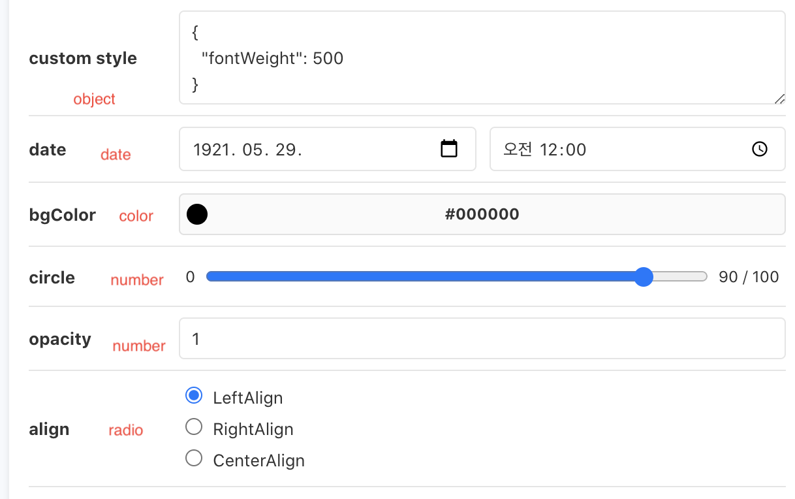
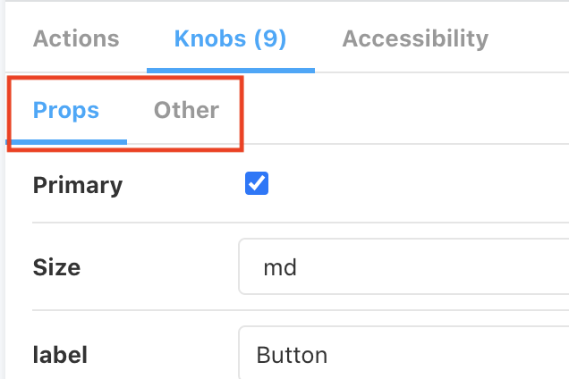
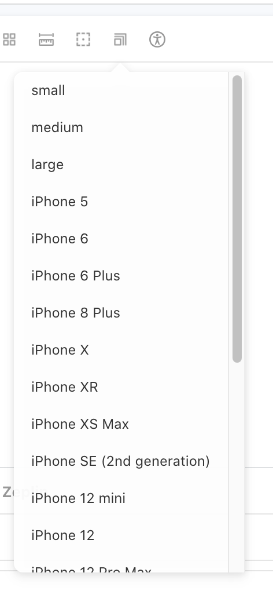
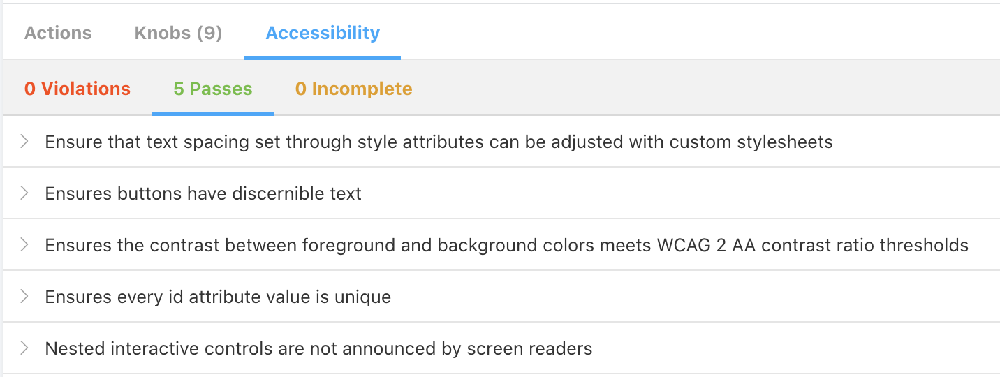
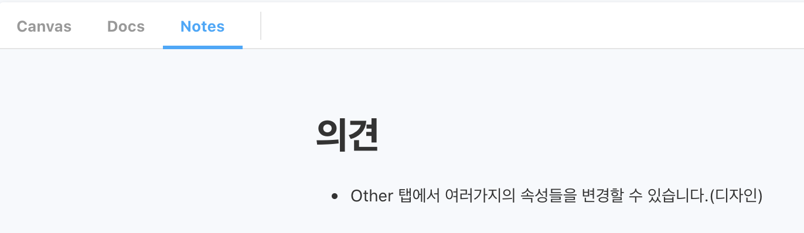
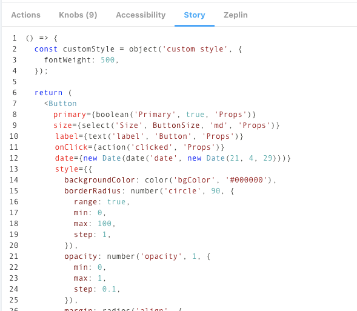

# 도입목적

- 기획, 디자인이 병렬로 진행중인 사항에서 계속적으로 스펙이 변경됨을 반영해서 기획자, 디자이너에 공유를 목적으로 합니다.
- 백엔드와도 병렬로 진행 시 로직(container), 화면(presentation) 분리해서 진행해야함으로 그것을 검증하기 위해서 storybook 단위의 컴포넌트 개발을 진행합니다.
- 추후에 화면단위 테스트 진행 시 storybook을 적극 활용합니다.
- 그외
  - 접근성에 대한 부분도 같이 고민하면서 화면단위 컴포넌트를 개발을 진행합니다.

# addon-controls 적용

```bash
npm i -D @storybook/addon-controls
or
yarn add -dev @storybook/addon-controls
```

```jsx
module.exports = {
  ...
  "addons": [
    ...
    "@storybook/addon-controls",
    ...
  ],
  ...
}
```

# addon-knobs 적용

- @storybook/addon-knobs
  - 다양한 컴포넌트와의 상호작용을 할 수 있도록 도와주는 addon 입니다.
- Knobs 컨트롤 종류
  - text: 텍스트를 입력 할 수 있습니다.
  - boolean: true/false 값을 체크박스로 설정 할 수 있습니다.
  - number: 숫자를 입력 할 수 있습니다. 1~10과 같이 간격을 설정 할 수도 있습니다.
  - color: 컬러 팔레트를 통해 색상을 설정 할 수 있습니다.
  - object: JSON 형태로 객체 또는 배열을 설정 할 수 있습니다.
  - select: 셀렉트 박스를 통하여 여러가지 옵션 중에 하나를 선택 할 수 있습니다.
  - radios: Radio 버튼을 통하여 여러가지 옵션 중에 하나를 선택 할 수 있습니다.
  - date: 날짜를 선택 할 수 있습니다.
    

```jsx
export const ButtonComponent = () => {
  const customStyle = object('custom style', {
    fontWeight: 500,
  });

  return (
    <Button
      primary={boolean('Primary', true, 'Props')}
      size={select('Size', ButtonSize, 'md', 'Props')}
      label={text('label', 'Button', 'Props')}
      onClick={action('clicked', 'Props')}
      date={new Date(date('date', new Date(21, 4, 29)))}
      style={{
        backgroundColor: color('bgColor', '#000000'),
        borderRadius: number('circle', 90, {
          range: true,
          min: 0,
          max: 100,
          step: 1,
        }),
        opacity: number('opacity', 1, {
          min: 0,
          max: 1,
          step: 0.1,
        }),
        margin: radios(
          'align',
          {
            LeftAlign: '0',
            RightAlign: '0 0 0 auto',
            CenterAlign: '0 auto',
          },
          '0',
        ),
        ...customStyle,
      }}
    />
  );
};
```

- Knobs 컨트롤 그룹
  - 기획/디자인 가이드에 제공해야 하는 Props에 대해서는 그룹으로 묶고, 아닐경우 포함하지 않도록 합니다. - Props: 기획/디자인 가이드에 제공 - Other: 기획/디자인 공유를 위한 속성일 경우
    

```jsx
// stories
primary={boolean('Primary', true, 'Props')} // Props 그룹일경우

backgroundColor={color('bgColor', '#000000')} // 기획/디자인에만 공유할 경우(3번째 인자를 넣지 않는다.)

// components(Button)
// 기획/디자인에만 공유할 컴포넌트 인경우 rest문법(...props)을 통해서 넣도록 한다.
export const Button = ({ primary, size, label, ...props }) => {
  const mode = primary ? 'storybook-button--primary' : 'storybook-button--secondary';
  return (
    <button
      type="button"
      className={['storybook-button', `storybook-button--${size}`, mode].join(' ')}
      {...props}
    >
      {label}
    </button>
  );
};
```

- Knobs 컨트롤 스타일

  - class style 동적생성

    - className={['storybook-button', `storybook-button--${size}`, mode].join(' ')}

    ```jsx
    // stories
    primary={boolean('Primary', true, 'Props')} // Props 그룹일경우

    // components(Button)
    // 기획/디자인에만 공유할 컴포넌트 인경우 rest문법(...props)을 통해서 넣도록 한다.
    export const Button = ({ primary, size, label, ...props }) => {
      const mode = primary ? 'storybook-button--primary' : 'storybook-button--secondary';
      return (
        <button
          type="button"
          className={['storybook-button', `storybook-button--${size}`, mode].join(' ')}
          {...props}
        >
          {label}
        </button>
      );
    };

    ```

  - style 동적생성

    ```jsx
    <Button
      primary={boolean('Primary', true, 'Props')}
      size={select('Size', ButtonSize, 'md', 'Props')}
      label={text('label', 'Button', 'Props')}
      onClick={action('clicked', 'Props')}
      date={new Date(date('date', new Date(21, 4, 29)))}
      style={{
        backgroundColor: color('bgColor', '#000000'),
        borderRadius: number('circle', 90, {
          range: true,
          min: 0,
          max: 100,
          step: 1,
        }),
        opacity: number('opacity', 1, {
          min: 0,
          max: 1,
          step: 0.1,
        }),
        margin: radios(
          'align',
          {
            LeftAlign: '0',
            RightAlign: '0 0 0 auto',
            CenterAlign: '0 auto',
          },
          '0',
        ),
        ...customStyle,
      }}
    />
    ```

# addon-viewport 적용

- @storybook/addon-viewport
  - 반응형 대응을 위해 도와주는 addon 입니다.
- Configuration 설정
  - storybook에서 제공해주는 기본 Viewport와 커스텀 Viewport 나눠서 작업을 진행합니다.
    

```jsx
viewport: { //👇 The viewports you want to use
      viewports: {
        small: {
          name: 'small',
          styles: {
            width: '768px',
            height: '100%',
          }
        },
        medium: {
          name: 'medium',
          styles: {
            width: '1096px',
            height: '100%',
          }
        },
        large: {
          name: 'large',
          styles: {
            width: '1440px',
            height: '100%',
          }
        },
        ...INITIAL_VIEWPORTS
      },
      //👇 Your own default viewport
      defaultViewport: 'iphoneX',
    },
```

# addon-ally(접근성) 적용

- @storybook/addon-a11y
  - 웹접근성을 도와주는 addon 입니다.
    

```jsx
export default {
  title: 'Example/Button',
  component: Button,
  parameters: {
    parameters: {
      a11y: {
        // optional selector which element to inspect
        element: '#root',
        // axe-core configurationOptions (https://github.com/dequelabs/axe-core/blob/develop/doc/API.md#parameters-1)
        config: {},
        // axe-core optionsParameter (https://github.com/dequelabs/axe-core/blob/develop/doc/API.md#options-parameter)
        options: {},
        // optional flag to prevent the automatic check
        manual: true,
      },
    },
  },
};
```

# addon-notes(노트) 적용

- @storybook/addon-notes
  - 스토리북에 노트를 하기 위한 addon 입니다.
- **왜 해야할까??**
  - 기획/디자인 제플린을 기준으로 개발을 진행 후 QA진행 시 검증 시 주의할 사항이나 검증해줬으면 하는 내용에 대해서 note를 통해서 공유하고자 합니다.
    

```jsx
export default {
  title: 'Example/Button',
  component: Button,
  parameters: {
    notes: `
      # 의견
       - Other 탭에서 여러가지의 속성들을 변경할 수 있습니다.(디자인)
    `,
  },
};
```

# addon-sources 적용

- @storybook/addon-storysource
  - 스토리북에 테스트 하는 실제 컴포넌트를 보여주기 위한 addon 입니다.
- 

```jsx
// ./storybook/main.js
module.exports = {
  stories: ['../src/**/*.stories.mdx', '../src/**/*.stories.@(js|jsx|ts|tsx)'],
  addons: ['@storybook/addon-storysource'],
};
```

# addon-zeplin 적용

- storybook-zeplin
  - 스토리북에서 zeplin에 대한 내용을 보여주기 위한 addon 입니다.
- 사용방법
  - access token 연동
    - [https://app.zeplin.io/profile/developer](https://app.zeplin.io/profile/developer)(Personal access tokens 키 생성)
    - .env 파일에 추가
      - .envSTORYBOOK_ZEPLIN_TOKEN=~~
  - 참고: [https://www.npmjs.com/package/storybook-zeplin](https://www.npmjs.com/package/storybook-zeplin)

```jsx
// ./storybook/main.js
module.exports = {
  "stories": [
    "../src/**/*.stories.mdx",
    "../src/**/*.stories.@(js|jsx|ts|tsx)"
  ],
  "addons": [
    "storybook-zeplin/register"
  ]
}

// ~.stories.jsx
export default {
  title: 'Example/Button',
  component: Button,
  parameters: {
    zeplinLink: "zpl://screen?sid=5f6da3834811cd83eb77dd96&pid=5c3ff05bd363b1bf6d18294d",
  },
};

// ./.env
# .env
STORYBOOK_ZEPLIN_TOKEN=
```

# typescript 적용

[https://developer0809.tistory.com/171](https://developer0809.tistory.com/171)

# 참고페이지

- [https://ideveloper2.dev/blog/2020-04-25--storybook-%EC%9E%98-%ED%99%9C%EC%9A%A9%ED%95%98%EA%B8%B](https://ideveloper2.dev/blog/2020-04-25--storybook-%EC%9E%98-%ED%99%9C%EC%9A%A9%ED%95%98%EA%B8%B0/)
