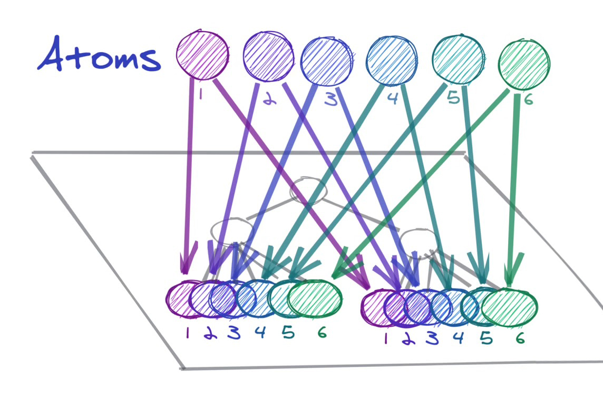

# recoil이란?

참고코드(redux-toolkit vs recoil): [https://github.com/seungahhong/states-todos](https://github.com/seungahhong/states-todos)

리액트 상태 관리 로직의 한계점

- ContextAPI 부모와 자식간의 커플링에 의존성 발생
  - 특히 리렌더링에 문제점 발생
  - 상태관리는 아니다(최초세팅, read, write)

Recoil은 왜 필요한 걸까??

- 최대한 React 스러운 API 유지
- 사용하기 위한 부속 라이브러리 최소화(특히, redux, mobx, redux-toolkit)
  - redux/react 사용을 위해서 react-redux 라이브러리를 사용해야했던 이슈들을 리코일에서는 내부적으로 처리



- 부모 자식간의 의존성을 끊어주며, 독립적인 스토리지에서 컴포넌트에 데이터를 전달한다.
- 특히, 기존로직을 건드리지 않고 atoms, selector를 사용 시 바로 적용이 가능하다.

Recoil 철학

- 보일러플레이트가 적은 API(React Hooks) 사용하여서 React에 로컬 상태를 관리(useState, useReducer)

```jsx
redux, reducer, constant

useEffect(() => {
  (async () => {
		await fetch~~
    -> redux 호출
  })();

}, []);

const allMainFetch = selector({
  key: 'allMainFetch',
  get: async ({ get }) => await get(fetch~~)
  })
});

const main = useRecoilValue(allMainFetch());
```

- 파생데이터 자동으로 업데이트 처리가 된다.(selector)
  - A, B ⇒ C를 변경한다면 기존에는 A, B 데이터를 가져와서 C를 변경해서 업데이트 했지만 리코일은 selector에 지정해준다면 자동으로 업데이트 된다.(디펜던시가 걸려있는 컴포넌트 자동 업데이트)
  - mobx에 compute와 동일하다고 함

```jsx
// 파생데이터
const firstAtom = atom({
  key: 'firstAtomKey',
  default: 1,
});

const secondAtom = atom({
  key: 'firstAtomKey',
  default: 1,
});

const cumulatedSelector = selector({
  key: 'cumulatedSelector',
  get: ({ get }) => {
    return get(firstAtom) + get(secondAtom);
  },
});

// atom
import { atom, useRecoilState } from 'recoil';

const counter = atom({
  key: 'myCounter',
  default: 0,
});

function Counter() {
  const [count, setCount] = useRecoilState(counter);
  const incrementByOne = () => setCount(count + 1);

  return (
    <div>
      Count: {count}
      <br />
      <button onClick={incrementByOne}>Increment</button>
    </div>
  );
}
```

- atom : 데이터를 보관하는 기본단위

  - redux로 생각해본다면 store 저장 일부분?? 담당하고 있으면 기존에 reducer, action에 대한 처리를 내장 커스텀훅 사용가능

- selector

  - atom, 다른 selector들을 조합할 수 있음
  - 파생되는 상태(derived state)를 생성한다.
  - dependency에 해당되는 atom이 업데이트되면 같이 업데이트 되기 때문에 관리의 부담이 없음.

- hooks api(atom, selector 동일한 api 사용)

  - `[useRecoilState()](https://recoiljs.org/ko/docs/api-reference/core/useRecoilState)`: atom을 읽고 쓰려고 할 때 이 Hook을 사용한다. 이 Hook는 atom에 컴포넌트을 등록하도록 한다.
  - `[useRecoilValue()](https://recoiljs.org/ko/docs/api-reference/core/useRecoilValue)`: atom을 읽기만 할 때 이 Hook를 사용한다. 이 Hook는 atom에 컴포넌트를 등록하도록 한다.
  - `[useSetRecoilState()](https://recoiljs.org/ko/docs/api-reference/core/useSetRecoilState)`: atom에 쓰려고만 할 때 이 Hook를 사용한다.
  - `[useResetRecoilState()](https://recoiljs.org/ko/docs/api-reference/core/useResetRecoilState)`: atom을 초깃값으로 초기화할 때 이 Hook을 사용한다.

- 사용방안
  - 대규모 프로젝트와 단반향 개발일 경우 flux
  - 작은프로젝트면서 여러 상태와 컴포넌트가 엮인경우 리코일
- 단점
  - 디버깅이 어려울 수 있다(파생데이터 업데이트)
  - 파생데이터 업데이트가 종속적으로 엮여서 무한루프가 발생할 수 있다( b=cselector cselector=b) 개발자의 역량이 필요하다 단 무한루프는 리코일에서 방지하도록 되어 있음

스토어 상세에서 리코일을 적용을 했다면 어떤 점이 좋았을까??

- 리덕스의 전역 스토어로 인해서 렌더링 최적화를 위해서 React.memo를 처리하면서 코드가 좀 복잡해짐
  - 특히 필요한 데이터에 맞는 화면 컴포넌트를 atom으로 연결했다면 굳이 렌더링 최적화 코드가 불필요했을 것 같음
- 리덕스의 보일러플레이트 코드에 대해서 최대한 줄일 수 있을 것이고 또한 리액트에서 밀고 있는 함수형 컴포넌트로 작성이 용이했을 것이다.

# 비동기에 대한 처리

- Suspend, ErrorBoundary
  - Recoil은 보류중인 데이터를 다루기 위해 React Suspense와 함께 동작하도록 디자인
  - Recoil selector는 컴포넌트에서 특정 값을 사용하려고 할 때에 어떤 에러가 생길지에 대한 에러를 던질 수 있습니다. 이는 React <ErrorBoundary> 사용

```jsx
const currentUserNameQuery = selector({
  key: 'CurrentUserName',
  get: async ({ get }) => {
    const response = await myDBQuery({
      userID: get(currentUserIDState),
    });
    if (response.error) {
      throw response.error;
    }
    return response.name;
  },
});

function CurrentUserInfo() {
  const userName = useRecoilValue(currentUserNameQuery);
  return <div>{userName}</div>;
}

<RecoilRoot>
  <ErrorBoundary>
    <React.Suspense fallback={<div>Loading...</div>}>
      <CurrentUserInfo />
    </React.Suspense>
  </ErrorBoundary>
</RecoilRoot>;
```

- class Loadable
  - 이 상태는 사용가능한 값을 가지고 있거나 에러 상태이거나 혹은 여전히 비동기 해결 보류 중일 수 있습니다.
  - `state`: atom 혹은 selector의 최신 상태입니다. 가능한 값은 '`hasValue`', '`hasError`', 혹은 '`loading`' 입니다.
  - `contents`: `Lodable`에 의해서 대표되는 값입니다. 만약 상태가 `hasValue` 라면, 이는 실제 값입니다. 만약 상태가 `hasError` 라면 이는 던져진 Error 객체입니다
  - useRecoilStateLoadable : 비동기 작업에서 사용되며 쓰기가 가능한 atom, selector
  - useRecoilValueLoadable: 비동기 작업에서 사용되며 읽기만 가능한 atom, selector

```jsx
function UserInfo({ userID }) {
  const userNameLoadable = useRecoilValueLoadable(currentUserNameQuery());
  const [userNameLoadable, setUserName] = useRecoilStateLoadable(
    currentUserNameQuery(),
  );
  switch (userNameLoadable.state) {
    case 'hasValue':
      return <div>{userNameLoadable.contents}</div>;
    case 'loading':
      return <div>Loading...</div>;
    case 'hasError':
      throw userNameLoadable.contents;
  }
}
```

# isRecoilValue

- value이 atom이나 selector일 경우 true를 반환하고 그렇지 않을 경우 false를 반환한다.

```jsx
import { atom, isRecoilValue } from 'recoil';

const counter = atom({
  key: 'myCounter',
  default: 0,
});

const strCounter = selector({
  key: 'myCounterStr',
  get: ({ get }) => String(get(counter)),
});

isRecoilValue(counter); // true
isRecoilValue(strCounter); // true
```

# atomFamily/selectorFamily

- atomFamily는 atom과 동일하지만, 다른 인스턴스와 구분이 가능한 매개변수를 받을 수 있다.
- atomFamily에 단일 키만을 제공하면, 각 기본 atom에 대해 고유한 키가 생성됩니다

```jsx
// atom
const itemWithId = memoize(id => atom({
  key: `item-${id}`,
  default: ...
}))

// atomFamily
const itemWithId = atomFamily({
  key: 'item',
  default: ...
});

const getImage = async id => {
  return new Promise(resolve => {
    const url = `http://someplace.com/${id}.png`;
    let image = new Image();
    image.onload = () =>
      resolve({
        id,
        name: `Image ${id}`,
        url,
        metadata: {
          width: `${image.width}px`,
          height: `${image.height}px`
        }
      });
    image.src = url;
  });
};

export const imageState = atomFamily({
  key: "imageState",
  default: id => getImage(id)
});
```

# noWait

- helper는 useRecoilValueLoadable()와 비슷하지만, hook이 아닌 selector라는 점이 다르다.
- noWait()은 selector를 반환하기 때문에, 다른 Recoil selector들과 hook에서 함께 사용가능함

```jsx
const myQuery = selector({
  key: 'MyQuery',
  get: ({ get }) => {
    const loadable = get(noWait(dbQuerySelector));

    return {
      hasValue: { data: loadable.contents },
      hasError: { error: loadable.contents },
      loading: { data: 'placeholder while loading' },
    }[loadable.state];
  },
});
```

# Snapshot

변하지 않는 정적인 데이터를 보관하려고 상태 관리 라이브러리를 사용하지는 않을 것이다. 상태는 끊임없이 변한다. 스냅샷은 계속 변하는 상태의 "한 순간"이다. 상태가 동영상이라면 스냅샷은 동영상의 한 프레임인 것이다.

- `[useRecoilSnapshot()](https://recoiljs.org/ko/docs/api-reference/core/useRecoilSnapshot)`
- 스냅샷은 상태가 변할 때마다 생성된다. 따라서 SnapshotCount 컴포넌트는 상태가 변할 때마다 렌더링된다.

```jsx
<RecoilRoot>
  <Counter />
  <SnapshotCount />
</RecoilRoot>;

const counter = atom({
  key: 'counter',
  default: 0,
});

export default function Counter() {
  const [count, setCount] = useRecoilState(counter);
  const incrementByOne = () => setCount(count + 1);

  return (
    <div>
      Count: {count}
      <br />
      <button onClick={incrementByOne}>Increment</button>
    </div>
  );
}

import { useRecoilSnapshot } from 'recoil';

function SnapshotCount() {
  const snapshotList = useRef([]);
  const updateSnapshot = useRecoilCallback(({ snapshot }) => () => {
    snapshotList.current = [...snapshotList.current, snapshot];
    console.log('updated:', snapshotList.current);
  });

  return (
    <div>
      <p>Snapshot count: {snapshotList.current.length}</p>
      <button onClick={updateSnapshot}>현재 스냅샷 보관</button>
    </div>
  );
}
```

- `[useRecoilCallback()](https://recoiljs.org/ko/docs/api-reference/core/useRecoilCallback)`
- useCallback과 같이 의존성에 따라 갱신되는 메모이즈된 함수를 생성한다. 다만, 생성된 함수에 스냅샷과 상태를 다루는 객체 및 함수가 함께 전달된다는 점이 다르다.

```jsx
function SnapshotCount() {
  const snapshotList = useRef([]);
  const snapshot = useRecoilSnapshot();

  useEffect(() => {
    snapshotList.current = [...snapshotList.current, snapshot];
  }, [snapshot]);

  return <p>Snapshot count: {snapshotList.current.length}</p>;
}
```

- useGotoRecoilSnapshot
- 특정 스냅샷 상태로 돌릴 수 있는 함수

```jsx
function SnapshotCount() {
  const [snapshotList, setSnapshotList] = useState([]);
  const updateSnapshot = useRecoilCallback(({ snapshot }) => async () => {
    setSnapshotList(prevList => [...prevList, snapshot]);
  });
  const gotoSnapshot = useGotoRecoilSnapshot();

  return (
    <div>
      <p>Snapshot count: {snapshotList.length}</p>
      <button onClick={updateSnapshot}>현재 스냅샷 보관</button>
      <ul>
        {snapshotList.map((snapshot, index) => (
          <li key={index}>
            <button onClick={() => gotoSnapshot(snapshot)}>
              Snapshot #{index + 1}
            </button>
          </li>
        ))}
      </ul>
    </div>
  );
}
```

# 리코일 프로젝트 회고

좋은점

- 기존에는 내가 일일이 action, store에서 업데이트를 시켜줘야해서 불편했지만, 리코일은 set만 할 경우에는 자동으로 get이 호출되서 편했다.
- 불변성에 대한 고민을 하지 않아서 좋았다.(redux: spread, immer)
- 캐싱이 되서 좋았다.
- 꼭 필요한 곳에만 렌더링이 이뤄짐으로 React.memo 같은 처리를 하지 않아서 좋았다.

아쉬운점

- get에서만 async를 제공하기 때문에 다른상태에 세팅할 시 불편한 점이 많았다.(상태값을 저장할 atom을 생성해야해서 코드량이 많아짐)
- snapshot에 처리를 위해서 useRecoilCallback을 사용했지만, 해당 함수에서 상태를 업데이트 하여도 기존 스냅샷에 레퍼런스가 걸려있어서 업데이트된 데이터를 가져올 수 없었다.
