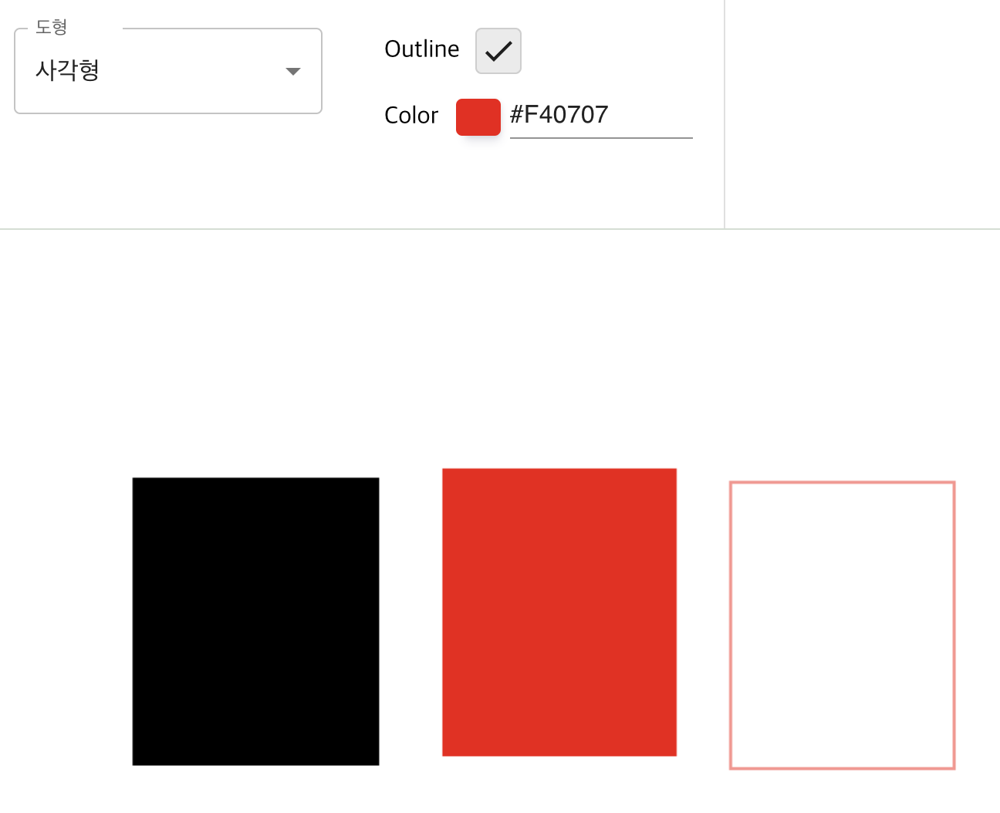
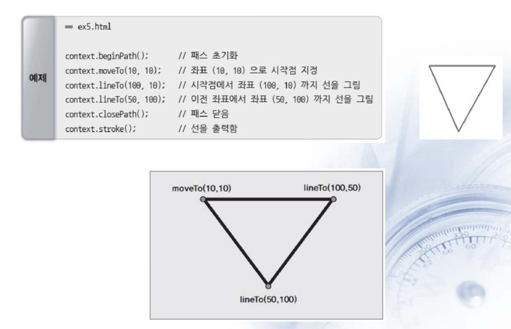
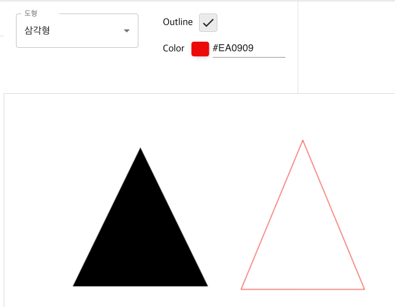
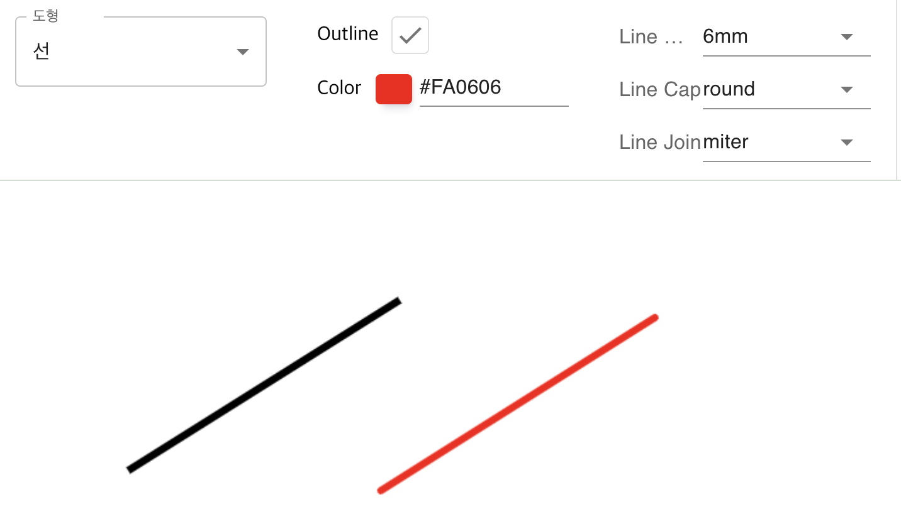
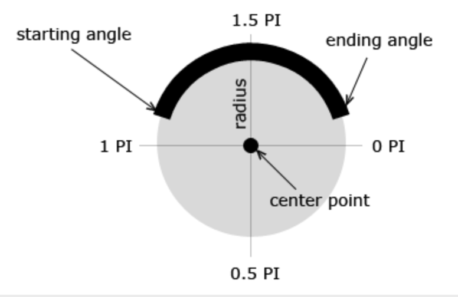
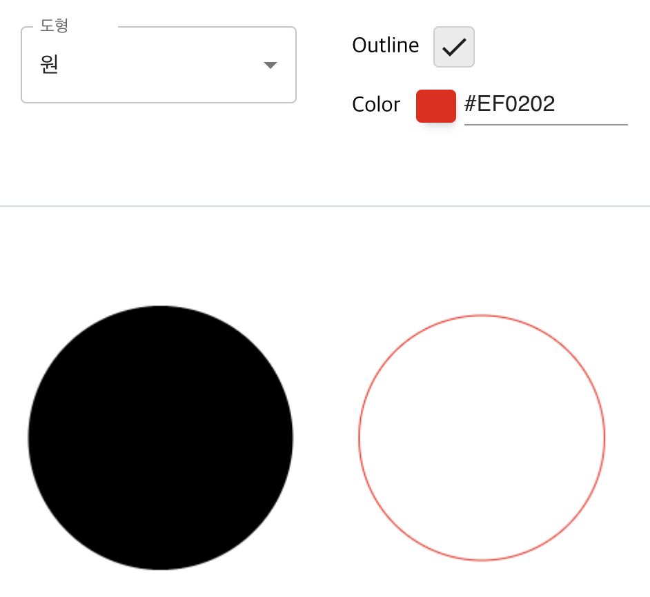
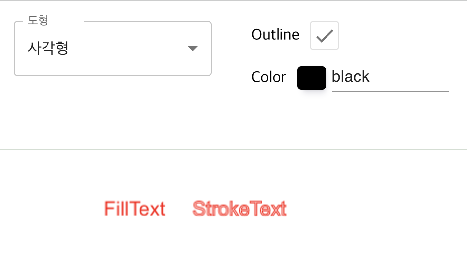

# Canvas API

- The Canvas API provides a means for drawing graphics via [JavaScript](https://developer.mozilla.org/ko/docs/Web/JavaScript) and the [HTML](https://developer.mozilla.org/ko/docs/Web/HTML) [CANVAS](https://developer.mozilla.org/ko/docs/Web/HTML/Element/canvas) element. Among other things, it is used for animation, game graphics, data visualization, photo manipulation, and real-time video processing.

## Sample Code

- [https://github.com/seungahhong/canvas-paint](https://github.com/seungahhong/canvas-paint)

## Basic Example

## JavaScript

HTML

```tsx
<canvas id="canvas"></canvas>
```

JavaScript

```tsx
const canvas = document.getElementById('canvas');
const ctx = canvas.getContext('2d');

ctx.fillStyle = 'green';
ctx.fillRect(10, 10, 150, 100);
```

## React

```tsx
const canvasRef = useRef<HTMLCanvasElement>(null);
<canvas ref={canvasRef} />;

const ctx = canvasRef.current.getContext('2d');
ctx.fillStyle = 'green';
ctx.fillRect(10, 10, 150, 100);
```

# Libraries

- [EaselJS](https://www.createjs.com/easeljs) is an open-source canvas library that makes it easy to create games, generative art, and other highly graphical experiences.
- [Fabric.js](http://fabricjs.com/) is an open-source canvas library with SVG parsing capabilities.
- [heatmap.js](https://www.patrick-wied.at/static/heatmapjs/) is an open-source library for creating canvas-based data heatmaps.
- [JavaScript InfoVis Toolkit](https://thejit.org/) creates interactive data visualizations.
- [Konva.js](https://konvajs.github.io/) is a 2D canvas library for desktop and mobile applications.
- [p5.js](https://p5js.org/) includes a full set of canvas drawing functionality for artists, designers, educators, and beginners.
- [Paper.js](http://paperjs.org/) is an open-source vector graphics scripting framework that runs on top of the HTML5 Canvas.
- [Phaser](https://phaser.io/) is a fast, free, and fun open-source framework for Canvas- and WebGL-based browser games.
- [Processing.js](https://processingjs.org/) is a port of the Processing visualization language.
- [Pts.js](https://ptsjs.org/) is a library for creative coding and visualization using canvas and SVG.
- [Rekapi](https://github.com/jeremyckahn/rekapi) is an animation keyframe API for Canvas.
- [Scrawl-canvas](https://scrawl.rikweb.org.uk/) is an open-source JavaScript library for creating and manipulating 2D canvas elements.
- [ZIM](https://zimjs.com/) is a framework that provides conveniences, components, and controls for creative coding on canvas. It includes accessibility support and a wide range of tutorials.

# Basic Usage

The canvas element

```tsx
// HTML
<canvas id="tutorial" width="300" height="150"></canvas>; // width, height 지정하지 않을 경우 width: 300px, height: 150px로 설정됨

// Javascript
const canvas = document.getElementById('canvas');
canvas.width = 300;
canvas.height = 150;
```

Fallback content

```tsx
<canvas id="stockGraph" width="150" height="150">
  current stock price: $3.15 +0.15
</canvas>

<canvas id="clock" width="150" height="150">
  
</canvas>
```

The rendering context

- The canvas element only creates the drawing surface. To render content, you must create a rendering context and draw through that context.

```tsx
var canvas = document.getElementById('tutorial');
var ctx = canvas.getContext('2d');
```

Checking for support

```tsx
var canvas = document.getElementById('tutorial');

if (canvas.getContext) {
  var ctx = canvas.getContext('2d');
  // drawing code here
} else {
  // canvas-unsupported code here
}
```

# Drawing Shapes

## Drawing Rectangles

[fillRect(x, y, width, height) (en-US)](https://developer.mozilla.org/en-US/docs/Web/API/CanvasRenderingContext2D/fillRect)

Draws a filled rectangle.

[strokeRect(x, y, width, height) (en-US)](https://developer.mozilla.org/en-US/docs/Web/API/CanvasRenderingContext2D/strokeRect)

Draws a rectangular outline.

[clearRect(x, y, width, height) (en-US)](https://developer.mozilla.org/en-US/docs/Web/API/CanvasRenderingContext2D/clearRect)

Clears the specified rectangular area, making it fully transparent.

```
const cx = x;
const cy = y;
const cw = w;
const ch = h;

ctx.save();
ctx.clearRect(cx, cy, cw, ch); // 캔버스 지우기

if (props && props.outline === true) {
  ctx.strokeStyle = props.color; // 외곽선 색상
  ctx.strokeRect(cx, cy, cw, ch); // 사각형 그리기(외곽선)
} else {
  ctx.fillStyle = props.color; // 채우기 색상
  ctx.fillRect(cx, cy, cw, ch); // 사각형 그리기(채우기)
}

ctx.restore();

```

fillRect, strokeRect, color example



## Drawing Paths

[beginPath() (en-US)](https://developer.mozilla.org/en-US/docs/Web/API/CanvasRenderingContext2D/beginPath)

Creates a new path. Once a path is created, subsequent drawing commands are used to build and shape the path.

[closePath() (en-US)](https://developer.mozilla.org/en-US/docs/Web/API/CanvasRenderingContext2D/closePath)

Adds a straight line connecting to the start of the current sub-path.

[stroke() (en-US)](https://developer.mozilla.org/en-US/docs/Web/API/CanvasRenderingContext2D/stroke)

Draws a shape using its outline.

[fill() (en-US)](https://developer.mozilla.org/en-US/docs/Web/API/CanvasRenderingContext2D/fill)

Fills the interior of the path, drawing a shape with its inside filled.

[moveTo() (en-US)](https://developer.mozilla.org/en-US/docs/Web/API/CanvasRenderingContext2D/moveTo)

Moves to the new x, y coordinates.

[lineTo() (en-US)](https://developer.mozilla.org/en-US/docs/Web/API/CanvasRenderingContext2D/lineTo)

Adds a line based on the coordinates you moved to.

Path methods ([Path methods](https://developer.mozilla.org/en-US/docs/Web/API/CanvasRenderingContext2D#paths))

These are functions used to set the various paths needed when constructing an object.

Drawing a triangle

```tsx
const cx1 = x1;
const cy1 = y1;
const cx2 = x2;
const cy2 = y2;
const cx3 = x3;
const cy3 = y3;

ctx.save();
ctx.beginPath();
ctx.moveTo(cx1, cy1); // cx1, cy2 포인트 좌표값으로 이동
ctx.lineTo(cx2, cy2); // cx2, cy2 포인트 좌표값으로 라인추가
ctx.lineTo(cx3, cy3); // cx3, cx3 포인트 좌표값으로 라인추가
ctx.lineTo(cx1, cy1); // cx1, cy1 포인트 좌표값으로 라인추가
if (props && props.outline === true) {
  ctx.strokeStyle = props.color; // 외곽선 컬러
  ctx.stroke(); // 외곽선 그리기
} else {
  ctx.fillStyle = props.color; // 채우기 컬러
  ctx.fill(); // 채우기 그리기
}

ctx.closePath();
ctx.restore();
```





Drawing a line

[lineWidth = value (en-US)](https://developer.mozilla.org/en-US/docs/Web/API/CanvasRenderingContext2D/lineWidth)

Sets the thickness of lines drawn afterward.

[lineCap = type (en-US)](https://developer.mozilla.org/en-US/docs/Web/API/CanvasRenderingContext2D/lineCap)

Sets the shape of the line's end caps.

[lineJoin = type (en-US)](https://developer.mozilla.org/en-US/docs/Web/API/CanvasRenderingContext2D/lineJoin)

Sets the shape of the "corners" where lines meet.

```tsx
const cx1 = x1 * scale;
const cy1 = y1 * scale;
const cx2 = x2 * scale;
const cy2 = y2 * scale;

ctx.save();
ctx.beginPath();
ctx.moveTo(cx1, cy1);
ctx.lineWidth = 6;
ctx.lineCap = 'round';
ctx.lineJoin = 'round';
ctx.strokeStyle = props.color;
ctx.lineTo(cx2, cy2);

if (props.line.join === 'round') {
  ctx.lineTo(cx2, cy1);
  ctx.lineTo(cx1, cy2);
}

ctx.stroke();
ctx.closePath();
ctx.restore();
```



## Drawing Circles

Drawing an arc

[arc(x, y, radius, startAngle, endAngle, anticlockwise) (en-US)](https://developer.mozilla.org/en-US/docs/Web/API/CanvasRenderingContext2D/arc)

Draws an arc centered at position *(x, y)* with radius r, starting at _startAngle_ and ending at *endAngle*, going in the given *anticlockwise* direction (the default is clockwise rotation).

[arcTo(x1, y1, x2, y2, radius) (en-US)](https://developer.mozilla.org/en-US/docs/Web/API/CanvasRenderingContext2D/arcTo)

Draws an arc with the given control points and radius, connected to the previous point by a straight line.

[ellipse(x, y, radiusX, radiusY, rotation, startAngle, endAngle [, counterclockwise]) (en-US)](https://developer.mozilla.org/en-US/docs/Web/API/CanvasRenderingContext2D/ellipse)

Draws an ellipse centered at position *(x, y)* with radii x/y, starting at _startAngle_ and ending at *endAngle*.

```tsx
const cx1 = x1;
const cy1 = y1;
const cx2 = x2;
const cy2 = y2;

ctx.save();
ctx.beginPath();
ctx.arc(
  cx1 + (cx2 - cx1) / 2, // center.x
  cy1 + (cy2 - cy1) / 2, // center.y
  Math.abs(cy2 - cy1) / 2, // radius
  0, // starting angle
  Math.PI * 2, // ending angle
  true, // 시계방향
);

// ctx.ellipse(
//   cx1 + (cx2 - cx1) / 2,
//   cy1 + (cy2 - cy1) / 2,
//   Math.abs(cx2 - cx1) / 2,
//   Math.abs(cy2 - cy1) / 2,
//   0,
//   0,
//   Math.PI * 2,
// );
if (props && props.outline === true) {
  ctx.strokeStyle = props.color;
  ctx.stroke();
} else {
  ctx.fillStyle = props.color;
  ctx.fill();
}

ctx.closePath();
ctx.restore();
```





# Drawing Text

[fillText(text, x, y [, maxWidth]) (en-US)](https://developer.mozilla.org/en-US/docs/Web/API/CanvasRenderingContext2D/fillText)

Fills the given text at the given (x, y) position. The maximum width is optional.

[strokeText(text, x, y [, maxWidth]) (en-US)](https://developer.mozilla.org/en-US/docs/Web/API/CanvasRenderingContext2D/strokeText)

Strokes the given text at the given (x, y) position. The maximum width is optional.

[font = value (en-US)](https://developer.mozilla.org/en-US/docs/Web/API/CanvasRenderingContext2D/font)

The current text style used when drawing text. This string uses the same syntax as the [CSS](https://developer.mozilla.org/en-US/docs/Web/CSS) [font](https://developer.mozilla.org/ko/docs/Web/CSS/font) property. The default is 10px sans-serif.

[textAlign = value (en-US)](https://developer.mozilla.org/en-US/docs/Web/API/CanvasRenderingContext2D/textAlign)

Sets the text alignment. Available values: start, end, left, right, center. The default is start.

[textBaseline = value (en-US)](https://developer.mozilla.org/en-US/docs/Web/API/CanvasRenderingContext2D/textBaseline)

Sets the baseline alignment. Available values: top, hanging, middle, alphabetic, ideographic, bottom. The default is alphabetic.

- Description
  - top: The baseline is placed at the top of the text.
  - middle: The baseline is placed at the middle of the text.
  - bottom: The baseline is placed at the bottom of the text.
  - alphabetic: Aligns to the baseline of the alphabet. This is the default.
  - hanging: Aligns to the top of the characters. Indic languages use this method.
  - ideographic: Used by square characters such as Chinese and Japanese. The baseline is positioned slightly lower than the alphabetic one.

[Playit](https://www.w3schools.com/tags/playcanvas.asp?filename=playcanvas_textbaseline&preval=hanging)

[direction = value (en-US)](https://developer.mozilla.org/en-US/docs/Web/API/CanvasRenderingContext2D/direction)

Text direction. Available values: ltr, rtl, inherit. The default is inherit.

```tsx
ctx.save();
ctx.textBaseline = 'top';
ctx.font = `${20 * scale}px Arial`;
ctx.fillStyle = '#ff0003';
ctx.fillText(text, x, y);
ctx.strokeStyle = '#ff0003';
ctx.strokeText(text, x, y);
ctx.restore();
```



# Drawing Images

[drawImage(image, x, y) (en-US)](https://developer.mozilla.org/en-US/docs/Web/API/CanvasRenderingContext2D/drawImage)

- Inserts the image at its original size
  - image: an image (DOM image), a Canvas object, or a video element
  - x: the x coordinate where the image is drawn
  - y: the y coordinate where the image is drawn

[drawImage(image, x, y, width, height) (en-US)](https://developer.mozilla.org/en-US/docs/Web/API/CanvasRenderingContext2D/drawImage)

- Inserts the image at the specified size
  - width: the image width
  - height: the image height

[drawImage(image, sx, sy, sWidth, sHeight, dx, dy, dWidth, dHeight) (en-US)](https://developer.mozilla.org/en-US/docs/Web/API/CanvasRenderingContext2D/drawImage)

- Crops a portion of the image and inserts it
  - sx: the x coordinate where the image is drawn
  - sy: the y coordinate where the image is drawn
  - sWidth: [optional] the image width / the clipping rectangle of the source
  - sHeight: [optional] the image height / the clipping rectangle of the source
  - dx: [optional] if cropped, the X coordinate of the destination image
  - dy: [optional] if cropped, the Y coordinate of the destination image
  - dWidth: [optional] if cropped, the width of the destination image
  - dHeight: [optional] if cropped, the height of the destination image

# Animation

Animation steps

1. Clear the canvas (ctx.clearRect). Unless the shape you want to draw fills the entire canvas (as when creating a background image), you need to clear all previously drawn shapes. The easiest way is to use the clearRect() method.
2. Save the canvas state (ctx.save). If you are going to change settings that affect the canvas state (style changes, transformations, etc.) and use the changed values for each frame, you need to save the original state.
3. Draw the shapes to animate (ctx.fill, stroke~~). This is the step where the actual scene is drawn.
4. Restore the canvas state (ctx.restore). Restore the saved state before drawing a new scene.

Calling a specific function at fixed intervals

- setInterval(function, delay)
  - Starts repeatedly executing the function every delay milliseconds (thousandths of a second).
- setTimeout(function, delay)
  - Executes the function after delay milliseconds (thousandths of a second) have elapsed.
- requestAnimationFrame(function)
  - Executes the function in sync with the display's refresh rate.

```
const animation = () => {
    setMeta((prev) => ({
      ...prev,
      datas: prev.datas.map((data: any, index: number) => {
        if (index === 0) {
          const time = Math.floor(Math.random() * 5);
          const xdirection =
            data.animation.xdirection === 'reverse' && data.x1 < 0
              ? 'forward'
              : data.animation.xdirection === 'forward' &&
                data.x1 > window.innerWidth
              ? 'reverse'
              : data.animation.xdirection;
          const x1 = xdirection === 'forward' ? data.x1 + time : data.x1 - time;

          const ydirection =
            data.animation.ydirection === 'reverse' && data.y1 < 0
              ? 'forward'
              : data.animation.ydirection === 'forward' &&
                data.y1 > window.innerHeight - 150
              ? 'reverse'
              : data.animation.ydirection;
          const y1 = ydirection === 'forward' ? data.y1 + time : data.y1 - time;

          return {
            ...data,
            x1,
            y1,
            x2: x1 + 100,
            y2: y1 + 100,
            animation: {
              ...animation,
              xdirection,
              ydirection,
            },
          };
        }
        return data;
      }),
    }));
    requestAnimationFrame(animation);
  };

export const drawRect = (
  ctx: CanvasRenderingContext2D,
  x: number,
  y: number,
  w: number,
  h: number,
  scale: number,
  props: Property,
): void => {
  const cx = x;
  const cy = y;
  const cw = w;
  const ch = h;

  ctx.save();

  if (props && props.outline === true) {
    ctx.strokeStyle = props.color;
    ctx.strokeRect(cx, cy, cw, ch);
  } else {
    ctx.fillStyle = props.color;
    ctx.fillRect(cx, cy, cw, ch);
  }

  ctx.restore();
};

useEffect(() => {
  animation();
}, []);
```

<video width="100%" height="100%" controls="controls">
  <source src="./assets/29/Untitled.mp4" type="video/mp4">
</video>

# References

- [https://developer.mozilla.org/ko/docs/Web/API/Canvas_API](https://developer.mozilla.org/ko/docs/Web/API/Canvas_API)
