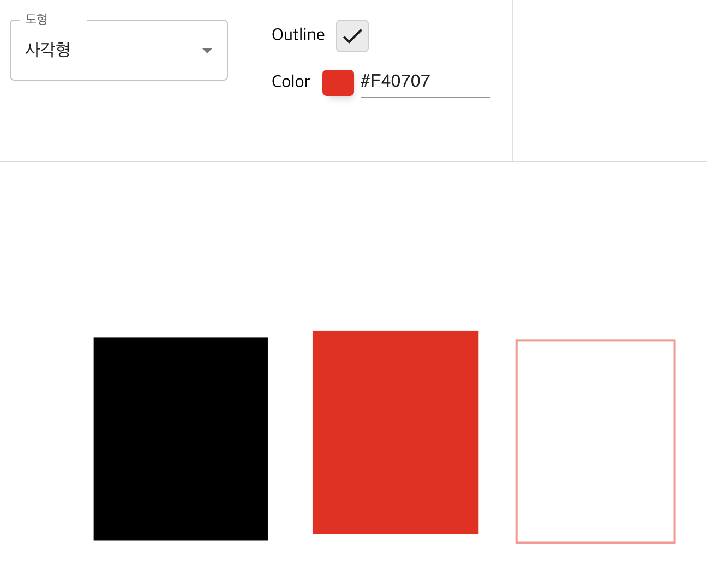
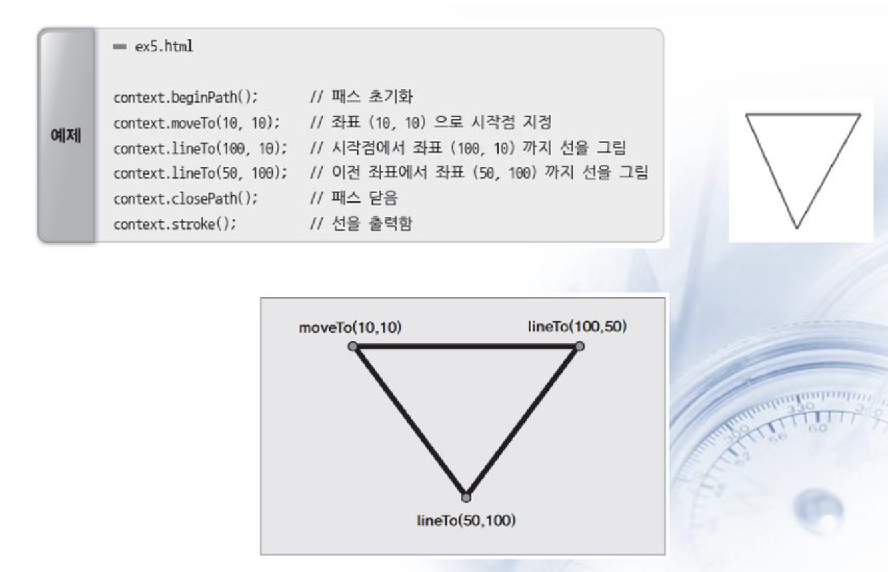
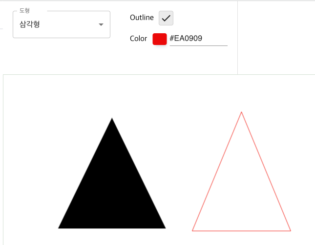
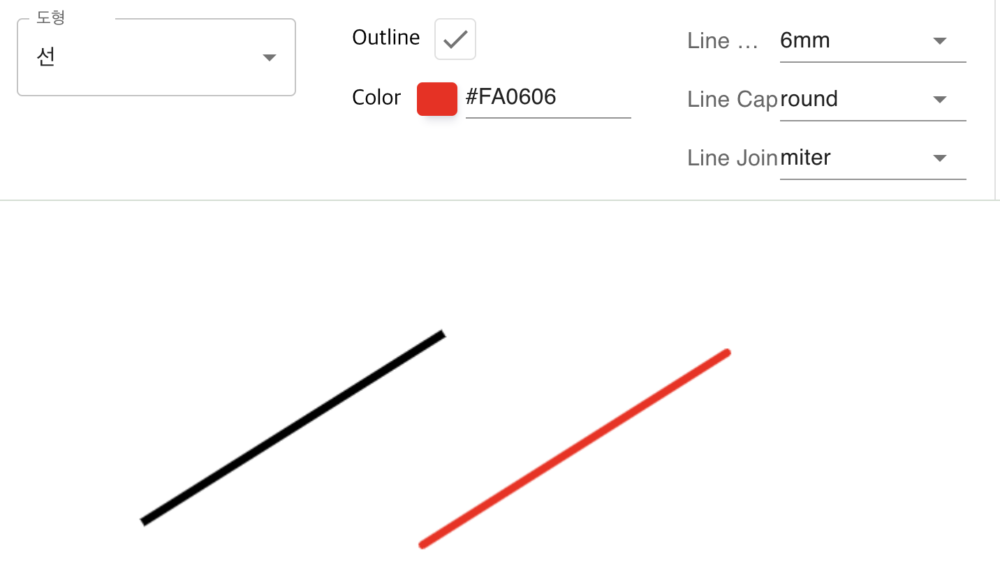
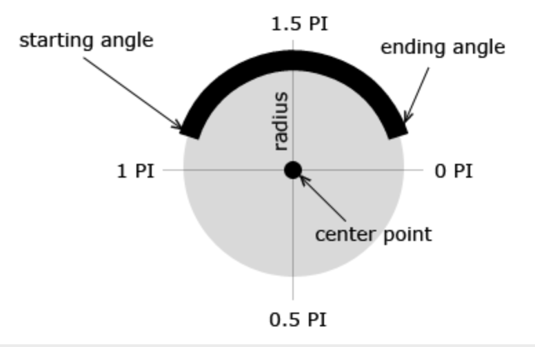
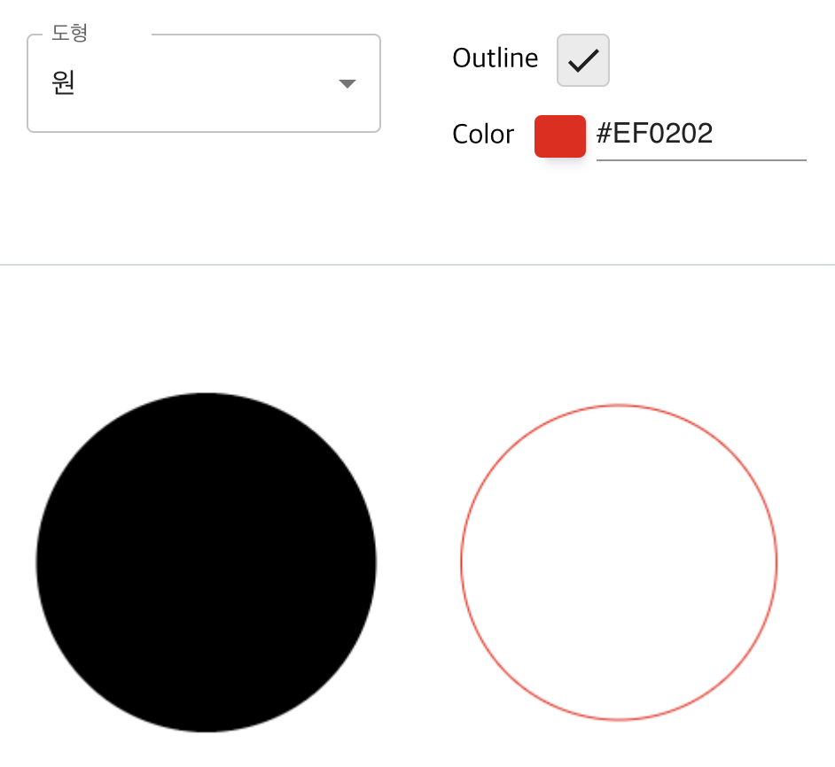
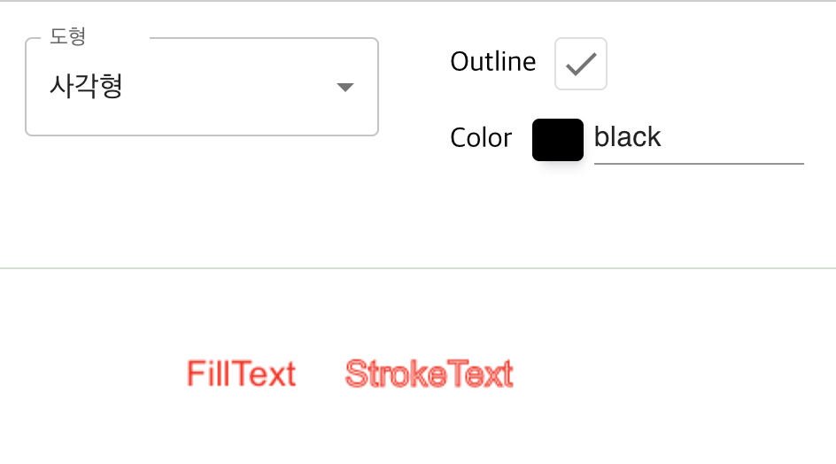

# Canvas API

- Canvas API는 [JavaScript](https://developer.mozilla.org/ko/docs/Web/JavaScript)와 [HTML](https://developer.mozilla.org/ko/docs/Web/HTML) [CANVAS](https://developer.mozilla.org/ko/docs/Web/HTML/Element/canvas) 엘리먼트를 통해 그래픽을 그리기위한 수단을 제공합니다. 무엇보다도 애니메이션, 게임 그래픽, 데이터 시각화, 사진 조작 및 실시간 비디오 처리를 위해 사용됩니다.

## 샘플코드

- [https://github.com/seungahhong/canvas-paint](https://github.com/seungahhong/canvas-paint)

## 기본예시

## 자바스크립트

HTML

```tsx
<canvas id="canvas"></canvas>
```

JavaScript

```tsx
const canvas = document.getElementById('canvas');
const ctx = canvas.getContext('2d');

ctx.fillStyle = 'green';
ctx.fillRect(10, 10, 150, 100);
```

## 리액트

```tsx
const canvasRef = useRef<HTMLCanvasElement>(null);
<canvas ref={canvasRef} />;

const ctx = canvasRef.current.getContext('2d');
ctx.fillStyle = 'green';
ctx.fillRect(10, 10, 150, 100);
```

# 라이브러리

- [EaselJS](https://www.createjs.com/easeljs)는 게임, 생성 예술 및 기타 고도의 그래픽 경험을 쉽게 생성할 수 있게 해주는 오픈소스 캔버스 라이브러리입니다.
- [Fabric.js](http://fabricjs.com/)는 SVG 파싱 기능을 갖춘 오픈소스 캔버스 라이브러리입니다.
- [heatmap.js](https://www.patrick-wied.at/static/heatmapjs/)는 캔버스 기반 데이터 열지도를 생성하기위한 오픈소스 라이브러리입니다.
- [JavaScript InfoVis Toolkit](https://thejit.org/)은 인터렉티브한 데이터 시각화를 생성합니다.
- [Konva.js](https://konvajs.github.io/)는 데스크탑 및 모바일 애플리케이션을 위한 2D 캔버스 라이브러리입니다.
- [p5.js](https://p5js.org/)는 예술가, 디자이너, 교육자 및 입문자를 위한 캔버스 그리기 기능의 모든 세트를 포함하고 있습니다.
- [Paper.js](http://paperjs.org/)는 HTML5 Canvas 위에서 실행되는 오픈소스 벡터 그래픽 스크립팅 프레임워크입니다.
- [Phaser](https://phaser.io/)는 Canvas 및 WebGL 기반의 브라우저 게임을 위한 빠르고, 자유롭고, 재미있는 오픈소스 프레임워크입니다.
- [Processing.js](https://processingjs.org/)는 Processing 시각화 언어의 포트입니다.
- [Pts.js](https://ptsjs.org/)는 canvas 및 SVG를 사용한 창의적인 코딩 및 시각화를 위한 라이브러리입니다.
- [Rekapi](https://github.com/jeremyckahn/rekapi)는 Canvas를 위한 애니메이션 키 프레임 API입니다.
- [Scrawl-canvas](https://scrawl.rikweb.org.uk/)는 2D 캔버스 엘리먼트를 생성하고 조작하기위한 오픈소스 JavaScript 라이브러리입니다.
- [ZIM](https://zimjs.com/) 프레임워크는 canvas에서의 창의적인 코딩을 위한 편의성, 컴포넌트 및 컨트롤을 제공하는 프레임워크입니다. 접근성 및 다채로운 튜토리얼을 포함합니다.

# 기본 사용

canvas 요소

```tsx
// HTML
<canvas id="tutorial" width="300" height="150"></canvas>; // width, height 지정하지 않을 경우 width: 300px, height: 150px로 설정됨

// Javascript
const canvas = document.getElementById('canvas');
canvas.width = 300;
canvas.height = 150;
```

대체 콘텐츠

```tsx
<canvas id="stockGraph" width="150" height="150">
  current stock price: $3.15 +0.15
</canvas>

<canvas id="clock" width="150" height="150">
  
</canvas>
```

렌더링 컨텍스트

- canvas 엘리먼트는 드로잉 영역만 생성 된 것이고, 컨텐츠를 출력할 경우 렌더링 컨텍스트를 생성 후 컨텍스트를 통해서 드로잉을 해야합니다.

```tsx
var canvas = document.getElementById('tutorial');
var ctx = canvas.getContext('2d');
```

지원여부 검사

```tsx
var canvas = document.getElementById('tutorial');

if (canvas.getContext) {
  var ctx = canvas.getContext('2d');
  // drawing code here
} else {
  // canvas-unsupported code here
}
```

# 도형 그리기

## 사각형 그리기

[fillRect(x, y, width, height) (en-US)](https://developer.mozilla.org/en-US/docs/Web/API/CanvasRenderingContext2D/fillRect)

색칠된 직사각형을 그립니다.

[strokeRect(x, y, width, height) (en-US)](https://developer.mozilla.org/en-US/docs/Web/API/CanvasRenderingContext2D/strokeRect)

직사각형 윤곽선을 그립니다.

[clearRect(x, y, width, height) (en-US)](https://developer.mozilla.org/en-US/docs/Web/API/CanvasRenderingContext2D/clearRect)

특정 부분을 지우는 직사각형이며, 이 지워진 부분은 완전히 투명해집니다.

```
const cx = x;
const cy = y;
const cw = w;
const ch = h;

ctx.save();
ctx.clearRect(cx, cy, cw, ch); // 캔버스 지우기

if (props && props.outline === true) {
  ctx.strokeStyle = props.color; // 외곽선 색상
  ctx.strokeRect(cx, cy, cw, ch); // 사각형 그리기(외곽선)
} else {
  ctx.fillStyle = props.color; // 채우기 색상
  ctx.fillRect(cx, cy, cw, ch); // 사각형 그리기(채우기)
}

ctx.restore();

```

fillRect, strokeRect, color 예제



## 경로 그리기

[beginPath() (en-US)](https://developer.mozilla.org/en-US/docs/Web/API/CanvasRenderingContext2D/beginPath)

새로운 경로를 만듭니다. 경로가 생성됬다면, 이후 그리기 명령들은 경로를 구성하고 만드는데 사용하게 됩니다.

[closePath() (en-US)](https://developer.mozilla.org/en-US/docs/Web/API/CanvasRenderingContext2D/closePath)

현재 하위 경로의 시작 부분과 연결된 직선을 추가합니다.

[stroke() (en-US)](https://developer.mozilla.org/en-US/docs/Web/API/CanvasRenderingContext2D/stroke)

윤곽선을 이용하여 도형을 그립니다.

[fill() (en-US)](https://developer.mozilla.org/en-US/docs/Web/API/CanvasRenderingContext2D/fill)

경로의 내부를 채워서 내부가 채워진 도형을 그립니다.

[moveTo() (en-US)](https://developer.mozilla.org/en-US/docs/Web/API/CanvasRenderingContext2D/moveTo)

새로운 좌표인 x,y 좌표로 이동시킵니다.

[lineTo() (en-US)](https://developer.mozilla.org/en-US/docs/Web/API/CanvasRenderingContext2D/lineTo)

이동 시킨 좌표값을 바탕으로 라인을 추가시킵니다.

Path 메소드 ([Path methods](https://developer.mozilla.org/en-US/docs/Web/API/CanvasRenderingContext2D#paths))

물체를 구성할 때 필요한 여러 경로를 설정하는데 사용하는 함수입니다.

삼각형 그리기

```tsx
const cx1 = x1;
const cy1 = y1;
const cx2 = x2;
const cy2 = y2;
const cx3 = x3;
const cy3 = y3;

ctx.save();
ctx.beginPath();
ctx.moveTo(cx1, cy1); // cx1, cy2 포인트 좌표값으로 이동
ctx.lineTo(cx2, cy2); // cx2, cy2 포인트 좌표값으로 라인추가
ctx.lineTo(cx3, cy3); // cx3, cx3 포인트 좌표값으로 라인추가
ctx.lineTo(cx1, cy1); // cx1, cy1 포인트 좌표값으로 라인추가
if (props && props.outline === true) {
  ctx.strokeStyle = props.color; // 외곽선 컬러
  ctx.stroke(); // 외곽선 그리기
} else {
  ctx.fillStyle = props.color; // 채우기 컬러
  ctx.fill(); // 채우기 그리기
}

ctx.closePath();
ctx.restore();
```





선 그리기

[lineWidth = value (en-US)](https://developer.mozilla.org/en-US/docs/Web/API/CanvasRenderingContext2D/lineWidth)

이후 그려질 선의 두께를 설정합니다.

[lineCap = type (en-US)](https://developer.mozilla.org/en-US/docs/Web/API/CanvasRenderingContext2D/lineCap)

선의 끝 모양을 설정합니다.

[lineJoin = type (en-US)](https://developer.mozilla.org/en-US/docs/Web/API/CanvasRenderingContext2D/lineJoin)

선들이 만나는 "모서리"의 모양을 설정합니다.

```tsx
const cx1 = x1 * scale;
const cy1 = y1 * scale;
const cx2 = x2 * scale;
const cy2 = y2 * scale;

ctx.save();
ctx.beginPath();
ctx.moveTo(cx1, cy1);
ctx.lineWidth = 6;
ctx.lineCap = 'round';
ctx.lineJoin = 'round';
ctx.strokeStyle = props.color;
ctx.lineTo(cx2, cy2);

if (props.line.join === 'round') {
  ctx.lineTo(cx2, cy1);
  ctx.lineTo(cx1, cy2);
}

ctx.stroke();
ctx.closePath();
ctx.restore();
```



## 원 그리기

호 그리기

[arc(x, y, radius, startAngle, endAngle, anticlockwise) (en-US)](https://developer.mozilla.org/en-US/docs/Web/API/CanvasRenderingContext2D/arc)

*(x, y)* 위치에 원점을 두면서, 반지름 r을 가지고,  _startAngle_ 에서 시작하여 *endAngle* 에서 끝나며 주어진 *anticlockwise* 방향으로 향하는 (기본값은 시계방향 회전) 호를 그리게 됩니다.

[arcTo(x1, y1, x2, y2, radius) (en-US)](https://developer.mozilla.org/en-US/docs/Web/API/CanvasRenderingContext2D/arcTo)

주어진 제어점들과 반지름으로 호를 그리고,  이전 점과 직선으로 연결합니다.

[ellipse(x, y, radiusX, radiusY, rotation, startAngle, endAngle [, counterclockwise]) (en-US)](https://developer.mozilla.org/en-US/docs/Web/API/CanvasRenderingContext2D/ellipse)

*(x, y)* 위치에 원점을 두면서, 반지름 x/y r을 가지고,  _startAngle_ 에서 시작하여 *endAngle* 에서 끝나는 방향으로 원을 그리게 됩니다.

```tsx
const cx1 = x1;
const cy1 = y1;
const cx2 = x2;
const cy2 = y2;

ctx.save();
ctx.beginPath();
ctx.arc(
  cx1 + (cx2 - cx1) / 2, // center.x
  cy1 + (cy2 - cy1) / 2, // center.y
  Math.abs(cy2 - cy1) / 2, // radius
  0, // starting angle
  Math.PI * 2, // ending angle
  true, // 시계방향
);

// ctx.ellipse(
//   cx1 + (cx2 - cx1) / 2,
//   cy1 + (cy2 - cy1) / 2,
//   Math.abs(cx2 - cx1) / 2,
//   Math.abs(cy2 - cy1) / 2,
//   0,
//   0,
//   Math.PI * 2,
// );
if (props && props.outline === true) {
  ctx.strokeStyle = props.color;
  ctx.stroke();
} else {
  ctx.fillStyle = props.color;
  ctx.fill();
}

ctx.closePath();
ctx.restore();
```





# 텍스트 그리기

[fillText(text, x, y [, maxWidth]) (en-US)](https://developer.mozilla.org/en-US/docs/Web/API/CanvasRenderingContext2D/fillText)

주어진 (x, y) 위치에 주어진 텍스트를 채웁니다. 최대 폭(width)은 옵션 값 입니다.

[strokeText(text, x, y [, maxWidth]) (en-US)](https://developer.mozilla.org/en-US/docs/Web/API/CanvasRenderingContext2D/strokeText)

주어진 (x, y) 위치에 주어진 텍스트를 칠(stroke)합니다. 최대 폭(width)은 옵션 값 입니다.

[font = value (en-US)](https://developer.mozilla.org/en-US/docs/Web/API/CanvasRenderingContext2D/font)

텍스트를 그릴 때 사용되는 현재 텍스트 스타일. 이 문자열은 [CSS](https://developer.mozilla.org/en-US/docs/Web/CSS) [font](https://developer.mozilla.org/ko/docs/Web/CSS/font) 프로퍼티와 동일한구문을 사용합니다. 기본값으로 sans-serif의 10px가 설정되어 있습니다.

[textAlign = value (en-US)](https://developer.mozilla.org/en-US/docs/Web/API/CanvasRenderingContext2D/textAlign)

텍스트 정렬 설정. 사용가능한 값: start, end, left, right, center. 기본 값은 start 입니다.

[textBaseline = value (en-US)](https://developer.mozilla.org/en-US/docs/Web/API/CanvasRenderingContext2D/textBaseline)

베이스라인 정렬 설정. 사용가능한 값: top, hanging, middle, alphabetic, ideographic, bottom. 기본 값은 alphabetic 입니다

- 설명
  - top: 베이스라인이 문자열의 위쪽에 온다.
  - middle: 베이스라인이 문자열의 중앙에 온다.
  - bottom: 베이스라인이 문자열의 아래쪽에 온다.
  - alphabetic: 알파벳의 baseline에 맞춘다. 이 값이 디폴트이다.
  - hanging: 문자의 위쪽에 맞춘다. 인도의 언어가 이 방식을 사용한다.
  - ideographic: 한자나 일본어처럼 사각형 문자가 이 방식을 사용한다. 알파벳보다는 베이스라인이 약간 더 아래쪽에 위치한다.

[Playit](https://www.w3schools.com/tags/playcanvas.asp?filename=playcanvas_textbaseline&preval=hanging)

[direction = value (en-US)](https://developer.mozilla.org/en-US/docs/Web/API/CanvasRenderingContext2D/direction)

글자 방향. 사용가능한 값: ltr, rtl, inherit. 기본 값은 inherit 입니다.

```tsx
ctx.save();
ctx.textBaseline = 'top';
ctx.font = `${20 * scale}px Arial`;
ctx.fillStyle = '#ff0003';
ctx.fillText(text, x, y);
ctx.strokeStyle = '#ff0003';
ctx.strokeText(text, x, y);
ctx.restore();
```



# 이미지그리기

[drawImage(image, x, y) (en-US)](https://developer.mozilla.org/en-US/docs/Web/API/CanvasRenderingContext2D/drawImage)

- 이미지를 원래 크기로 삽입
  - image : 이미지(DOM image) 또는 Canvas 개체 또는 video 요소
  - x: 이미지 출력할 x 좌표
  - y: 이미지 출력할 y 좌표

[drawImage(image, x, y, width, height) (en-US)](https://developer.mozilla.org/en-US/docs/Web/API/CanvasRenderingContext2D/drawImage)

- 이미지를 지정한 크기로 삽입
  - width: 이미지 너비
  - height: 이미지 높이

[drawImage(image, sx, sy, sWidth, sHeight, dx, dy, dWidth, dHeight) (en-US)](https://developer.mozilla.org/en-US/docs/Web/API/CanvasRenderingContext2D/drawImage)

- 이미지의 일부분을 잘라내어 삽입
  - sx : 이미지 출력할 x 좌표
  - sy : 이미지 출력할 y 좌표
  - sWidth : [옵션] 이미지 width /원본(source) 잘라낼 영역(clipping rectangle)
  - sHeight : [옵션] 이미지 Height /원본(source) 잘라낼 영역(clipping rectangle)
  - dx : [옵션] 만약 잘라내었다면, 대상 이미지의 X좌표
  - dy : [옵션] 만약 잘라내었다면, 대상 이미지의 Y좌표
  - dWidth : [옵션] 만약 잘라내었다면, 대상 이미지의 width
  - dHeight : [옵션] 만약 잘라내었다면, 대상 이미지의 Height

# 애니메이션

애니메이션 단계

1. 캔버스를 비웁니다.(ctx.clearRect) 그리려는 도형이 (배경 이미지를 만들 때처럼) 캔버스를 가득 채우는 것이 아니라면, 이전에 그려진 모든 도형을 지울 필요가 있습니다. 가장 쉬운 방법은 clearRect() 메소드를 사용하는 것입니다.
2. 캔버스 상태를 저장합니다.(ctx.save) 캔버스 상태에 영향을 주는 (스타일 변경, 모양 변형 등의) 설정값을 바꾸려고 하고, 바뀐 값을 각 장면마다 사용하려고 한다면, 원래 상태를 저장할 필요가 있습니다.
3. 애니메이션할 도형을 그립니다.(ctx.fill, stroke~~) 실제 장면을 그리는 단계입니다.
4. 캔버스 상태를 복원합니다.(ctx.restore) 새로운 장면을 그리기 전에 저장된 상태를 복원합니다.

정해진 시간마다 특정 함수 호출

- setInterval(function, delay)
  - delay 밀리세컨드(1,000분의 1초)마다 function 함수 반복 실행을 시작합니다.
- setTimeout(function, delay)
  - delay 밀리세컨드(1,000분의 1초) 경과후, function 함수를 실행합니다.
- requestAnimationFrame(function)
  - 디스플레이 주사율과 일치하게 function 함수를 실행합니다.

```
const animation = () => {
    setMeta((prev) => ({
      ...prev,
      datas: prev.datas.map((data: any, index: number) => {
        if (index === 0) {
          const time = Math.floor(Math.random() * 5);
          const xdirection =
            data.animation.xdirection === 'reverse' && data.x1 < 0
              ? 'forward'
              : data.animation.xdirection === 'forward' &&
                data.x1 > window.innerWidth
              ? 'reverse'
              : data.animation.xdirection;
          const x1 = xdirection === 'forward' ? data.x1 + time : data.x1 - time;

          const ydirection =
            data.animation.ydirection === 'reverse' && data.y1 < 0
              ? 'forward'
              : data.animation.ydirection === 'forward' &&
                data.y1 > window.innerHeight - 150
              ? 'reverse'
              : data.animation.ydirection;
          const y1 = ydirection === 'forward' ? data.y1 + time : data.y1 - time;

          return {
            ...data,
            x1,
            y1,
            x2: x1 + 100,
            y2: y1 + 100,
            animation: {
              ...animation,
              xdirection,
              ydirection,
            },
          };
        }
        return data;
      }),
    }));
    requestAnimationFrame(animation);
  };

export const drawRect = (
  ctx: CanvasRenderingContext2D,
  x: number,
  y: number,
  w: number,
  h: number,
  scale: number,
  props: Property,
): void => {
  const cx = x;
  const cy = y;
  const cw = w;
  const ch = h;

  ctx.save();

  if (props && props.outline === true) {
    ctx.strokeStyle = props.color;
    ctx.strokeRect(cx, cy, cw, ch);
  } else {
    ctx.fillStyle = props.color;
    ctx.fillRect(cx, cy, cw, ch);
  }

  ctx.restore();
};

useEffect(() => {
  animation();
}, []);
```

<video width="100%" height="100%" controls="controls">
  <source src="./assets/29/Untitled.mp4" type="video/mp4">
</video>

# 참고페이지

- [https://developer.mozilla.org/ko/docs/Web/API/Canvas_API](https://developer.mozilla.org/ko/docs/Web/API/Canvas_API)
