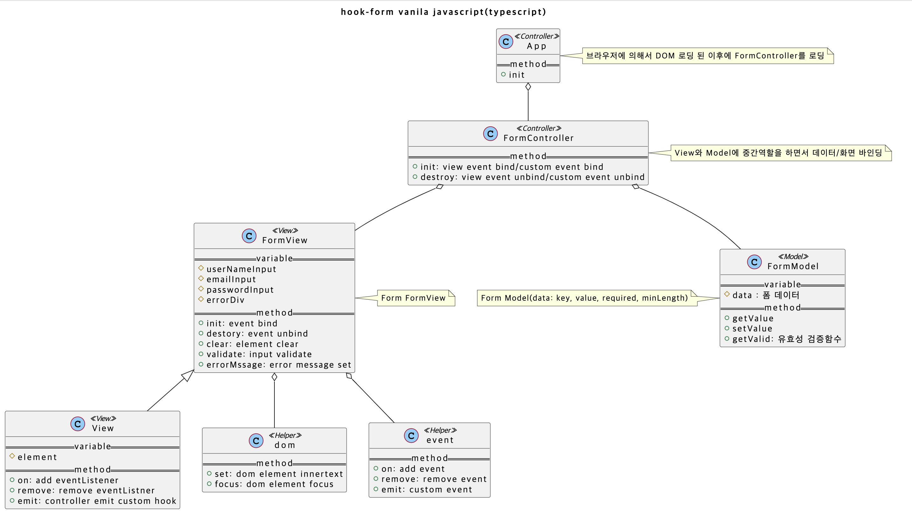
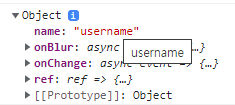
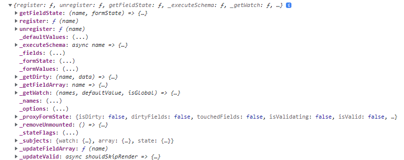
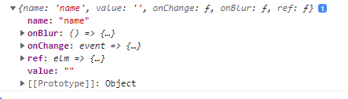

# Javascript Form

## 설계

<details>
  <summary>hook-form vanila javascript 설계</summary>



</details>

## Javascript Form vs React Form

<details>
  <summary>easier data control</summary>

```tsx
// vanila javascript 사용
//// FormModal.ts
export default class FormModel {
  data: formTypes;

  constructor(key: string, options: formOptions) {
    this.data = {
      key,
      value: '',
      required: options.required,
      minLength: options.minLength,
    };
  }

  getValue(): string {
    return this.data.value;
  }

  setValue(_value: string): void {
    this.data.value = _value;
  }

  getValid(): { key: string; message: string } | void {
    if (this.data.required && this.data.value === '') {
      return { key: this.data.key, message: this.data.required };
    }

    if (
      this.data.minLength &&
      this.data.minLength.value > this.data.value.length
    ) {
      return { key: this.data.key, message: this.data.minLength.message };
    }
  }
}

//// FormController.ts
userNameModel.setValue((event as CustomEvent).detail);
emailModel.setValue((event as CustomEvent).detail);
passwordModel.setValue((event as CustomEvent).detail);

// react 사용(custom hooks)
const useHookFormRegister = (options: hookOptions) => {
  const [value, setValue] = useState('');
  const ref = useRef<HTMLInputElement>(null);
  const getValid = ({ focus }: validateOptions) => {
    const { required, minLength } = options;
    if (focus) {
      ref.current?.focus();
    }

    if (!value && required) {
      return required;
    }

    if (!value && minLength && value.length < minLength.value) {
      return minLength.message;
    }

    return '';
  };

  return [value, setValue, ref, getValid] as const;
};

setUserName(event.target.value);
setEmail(event.target.value);
setPassword(event.target.value);
```

</details>

<details>
  <summary>easier inputs, inputs event</summary>

```tsx
  // vanila javascript 사용
  //// FormView.ts
  ////// useState
  this.emailInput = {
    key: 'email',
    element: document.getElementById('email') as HTMLInputElement,
  };

  ////// onChange, onBlur
  on(this.userNameInput.element, 'change', (event) => {
  this.emit('userName@change', (event.target as HTMLInputElement).value);
  });
  on(this.passwordInput.element, 'blur', () => {
    this.emit('@blur');
  });
  this.on('submit', (event) => {
    event.preventDefault();

    this.emit('handleSubmit');
  });

  //// FormController.ts
  .on('userName@change', (event) => {
    const { userNameModel } = this.formModel;
    userNameModel.setValue((event as CustomEvent).detail);
  })
  .on('handleSubmit', (event) => {
  }

  // react 사용
  const handleEmailChange = (event: React.ChangeEvent<HTMLInputElement>) => {
    setEmail(event.target.value);
  };

  const handleSubmit = (event: React.ChangeEvent<HTMLFormElement>) => {
      event.preventDefault();
  }

  <form onSubmit={handleSubmit}>
    <input
      value={userName}
      onChange={handleUsernameChange}
      onBlur={handleBlur}
      type="text"
      placeholder="이름을 입력하세요."
      ref={userNameRef}
    />
    <input
      value={email}
      onChange={handleEmailChange}
      onBlur={handleBlur}
      type="email"
      ref={emailRef}
      placeholder="이메일을 입력하세요."
    />
    <input
      value={password}
      onChange={handlePasswordChange}
      onBlur={handleBlur}
      type="password"
      ref={passwordRef}
      placeholder="패스워드를 입력하세요."
    />
    <input type="submit" />
  </form>
```

</details>

<details>
  <summary>better validation</summary>

```tsx
// vanila javascript 사용
//// FormModel.ts
getValid(): { key: string; message: string } | void {
  if (this.data.required && this.data.value === '') {
    return { key: this.data.key, message: this.data.required };
  }

  if (
    this.data.minLength &&
    this.data.minLength.value > this.data.value.length
  ) {
    return { key: this.data.key, message: this.data.minLength.message };
  }
}

//// FormController.ts
const userName = userNameModel.getValid();
if (userName) {
  this.formView.validate({
    message: userName.message,
    focus: userName.key,
  });
}

//// FormView.ts
validate(validateOptions: validateViewOptions) {
  const { message, focus: focusKey } = validateOptions;
  set(this.errorDiv.element as HTMLDivElement, message);

  if (this.userNameInput.key === focusKey) {
    focus(this.userNameInput.element);
  } else if (this.emailInput.key === focusKey) {
    focus(this.emailInput.element);
  } else if (this.passwordInput.key === focusKey) {
    focus(this.passwordInput.element);
  }
}

// react 사용
const useHookFormRegister = (options: hookOptions) => {
  const [value, setValue] = useState("");
  const ref = useRef<HTMLInputElement>(null);
  const getValid = ({ focus }: validateOptions) => {
    const { required, minLength } = options;
    if (focus) {
      ref.current?.focus();
    }

    if (!value && required) {
      return required;
    }

    if (!value && minLength && value.length < minLength.value) {
      return minLength.message;
    }

    return "";
  };

  return [value, setValue, ref, getValid] as const;
};

let errorMessage = "";
if ((errorMessage = userNameGetValid({ focus: true })) !== "") {
  setError(errorMessage);
} else if ((errorMessage = emailGetValid({ focus: true })) !== "") {
  setError(errorMessage);
} else if ((errorMessage = passwordGetValid({ focus: true })) !== "") {
  setError(errorMessage);
} else {
  // 성공
  setUserName("");
  setEmail("");
  setPassword("");
  setError("");
}
```

</details>

# React Form vs React-Hook-Form

### react-hook-form 소개 및 장점

React에서 Form을 쉽게 만들기 위한 라이브러리로 [공식문서](https://react-hook-form.com/)에 적혀있는 그대로 성능이 좋고 유연하며 유효성 검사에 탁월합니다.

### 장점

- less code, easier inputs(적은코드, 쉬운 핸들링)
- don’t deal with events(이벤트 미제어)
- better validation(좋은 유효성 체크)
  - html 속성이 아닌 자바스크립 단에서 제어
    - 악의적인 공격에 대응가능(html 속성을 수정할 경우 브라우저에서는 인식못함: required, minLength 등등)
- better error(좋은 에러체크)
- have control over inputs
- TS를 기본으로 지원
- 함수형 컴포넌트 사용(Hook API)

### 설치

```bash
npm i react-hook-form // yarn add react-hook-form
```

### 샘플코드

[https://github.com/seungahhong/form-tutorial](https://github.com/seungahhong/form-tutorial)

### 개념

### register

- 이 함수에서 입력/선택(input/select) `Ref`를 등록하고, React Hook Form 을 통한 유효성 검사를 적용할 수 있습니다.

```tsx
const { register } = useForm();
console.log(register('userName'));
```



### controller

- 커스텀 컴포넌트와 `Ref`에 액세스 할 수 없는 경우, 입력을 수동으로 등록 할 수 있습니다. 이는 실제로 React Native 또는 [react-select](https://github.com/JedWatson/react-select) 와 같은 커스텀 컴포넌트와 작업할 때 사용될 수 있습니다. 또한 이 작업을 대신 처리를 위해서 사용됨.

```tsx
const { control } = useForm();
console.log(control);

<Controller
  name="name"
  control={control}
  rules={
    required: 'name is Required',
    minLength: {
      message: 'name 길이가 5보다 커야합니다.',
      value: 5,
    },
  }
  render={({ field }) => {
    console.log(field);
    return <Input {...field} />;
  }}
/>;
```

**console.log(control);**



**console.log(field);**



### controller vs custom register

<details>
  <summary>controller</summary>

```tsx
import React, { useEffect } from 'react';
import { Input, Select, MenuItem } from '@material-ui/core';
import { useForm, Controller } from 'react-hook-form';

const defaultValues = {
  select: '',
  input: '',
};

function App() {
  const { handleSubmit, reset, watch, control } = useForm({ defaultValues });
  const onSubmit = data => console.log(data);

  return (
    <form onSubmit={handleSubmit(onSubmit)}>
      <Controller
        render={({ field }) => (
          <Select {...field}>
            <MenuItem value={10}>Ten</MenuItem>
            <MenuItem value={20}>Twenty</MenuItem>
          </Select>
        )}
        control={control}
        name="select"
        defaultValue={10}
      />

      <Input {...register('input')} />

      <button type="button" onClick={() => reset({ defaultValues })}>
        Reset
      </button>
      <input type="submit" />
    </form>
  );
}
```

</details>

<details>
  <summary>custom register</summary>

```tsx
import React, { useEffect } from 'react';
import { Input, Select, MenuItem } from '@material-ui/core';
import { useForm } from 'react-hook-form';

const defaultValues = {
  select: 10,
  input: '',
};

function App() {
  const { register, handleSubmit, setValue, reset, watch } = useForm({
    defaultValues,
  });
  const selectValue = watch('select');
  const onSubmit = data => console.log(data);

  useEffect(() => {
    register({ name: 'select' });
  }, [register]);

  const handleChange = e => setValue('select', e.target.value);

  return (
    <form onSubmit={handleSubmit(onSubmit)}>
      <Select value={selectValue} onChange={handleChange}>
        <MenuItem value={10}>Ten</MenuItem>
        <MenuItem value={20}>Twenty</MenuItem>
      </Select>
      <Input {...register('input')} />

      <button type="button" onClick={() => reset({ ...defaultValues })}>
        Reset
      </button>
      <input type="submit" />
    </form>
  );
}
```

</details>

### React Form vs react-hook-form

<details>
  <summary>less code, easier inputs(적은코드, 쉬운 핸들링)</summary>

```tsx
// react-hook-form 사용 전
const [userName, setUserName] = useState('');
const handleUsernameChange = (event: React.ChangeEvent<HTMLInputElement>) => {
  setUserName(event.target.value);
};

<input
  value={userName}
  onChange={handleUsernameChange}
  type="text"
  placeholder="Username"
  required
  minLength={5}
/>;

// react-hook-form 사용 후
const { register } = useForm();
<input
  {...register('userName')}
  type="text"
  placeholder="Username"
  required
  minLength={5}
/>;
```

</details>

<details>
  <summary>don’t deal with events(이벤트 미제어)</summary>

```tsx
// react-hook-form 사용 전
const [userName, setUserName] = useState("");
const handleUsernameChange = (event: React.ChangeEvent<HTMLInputElement>) => {
  setUserName(event.target.value);
};

<input
  value={userName}
  onChange={handleUsernameChange}
  type="text"
  placeholder="Username"
  required
  minLength={5}
/>
<div>{`${userName}${email}${password}`}</div>

const { register } = useForm();
const { userName = "", email = "", password = "" } = watch();
<input
    {...register("userName")}
    type="text"
    placeholder="Username"
    required
    minLength={5}
  />

<input
  {...register("userName")}
  type="text"
  placeholder="Username"
  required
  minLength={5}
/>
<div>{`${userName}${email}${password}`}</div>
```

</details>

<details>
  <summary>better validation(좋은 유효성 핸들링)</summary>

```tsx
// react-hook-form 사용 전
const [userName, setUserName] = useState("");
const [error, setError] = useState("");
const userNameRef = useRef<HTMLInputElement>(null);
const handleSubmit = (event: React.ChangeEvent<HTMLFormElement>) => {
  event.preventDefault();

  setError("");

  // userName 체크
  if (!userName || userName.length < 5) {
    if (!userName) {
      setError("userName is Required");
    } else {
      setError("userName 길이가 5보다 커야합니다.");
    }

    userNameRef.current?.focus();
  }
};
<form onSubmit={handleSubmit}>
<input
  value={userName}
  onChange={handleUsernameChange}
  type="text"
  placeholder="Username"
  ref={userNameRef}
/>
{error && <span>{error}</span>}

// react-hook-form 사용 후
interface formTypes {
	userName: string;
	email: string;
	password: string;
	errors?: string;
}
const {
  register,
  watch,
  handleSubmit,
  setError,
  resetField,
  formState: { errors: stateErrors },
} = useForm<formTypes>();
const handleInvalid = (errors: FieldErrors) => {
	const { userName, email, password } = errors;

	resetField("errors");

	if (userName) {
	  setError("errors", { message: userName.message });
	} else if (email) {
	  setError("errors", { message: email.message });
	} else {
	  setError("errors", { message: password.message });
	}
};
<form onSubmit={handleSubmit(handleValid, handleInvalid)}>
<input
  {...register("userName", {
    required: "userName is Required",
    minLength: {
      message: "userName 길이가 5보다 커야합니다.",
      value: 5,
    },
  })}
  type="text"
  placeholder="Username"
/>
<span>{stateErrors.errors?.message}</span>
```

</details>

<details>
  <summary>better error(좋은 에러 핸들링: set, clear)</summary>

```tsx
// react-hook-form 사용 전
const [error, setError] = useState('');
//// set
setError('email is Required');

//// clear
setError('');

{
  error && <span>{error}</span>;
}

// react-hook-form 사용 후
const {
  ...setError,
  clearErrors,
  formState: { errors: stateErrors },
} = useForm<formTypes>();

const handleInvalid = (errors: FieldErrors) => {
  const { userName, email, password } = errors;

  clearErrors('errors');

  if (userName) {
    setError('errors', { message: userName.message });
  } else if (email) {
    setError('errors', { message: email.message });
  } else {
    setError('errors', { message: password.message });
  }
};

<span>{stateErrors.errors?.message}</span>;
```

</details>

<details>
  <summary>have control easier inputs event(쉬운 이벤트 컨트롤)</summary>

```tsx
// react-hook-form 사용 전
const handleBlur = (event: React.FocusEvent<HTMLInputElement>) => {
  setError("");

  // userName 체크
  if (!userName || userName.length < 5) {
    if (!userName) {
      setError("userName is Required");
    } else {
      setError("userName 길이가 5보다 커야합니다.");
    }

    userNameRef.current?.focus();
  } else if (!email) {
    setError("email is Required");
    emailRef.current?.focus();
  } else if (!password) {
    setError("password is Required");
    passwordRef.current?.focus();
  } else {
    // 성공
    setUserName("");
    setEmail("");
    setPassword("");
    setError("");
  }
};

<input
  value={userName}
  onChange={handleUsernameChange}
  onBlur={handleBlur}
  type="text"
  placeholder="이름을 입력하세요."
  ref={userNameRef}
/>
<input
  value={email}
  onChange={handleEmailChange}
  onBlur={handleBlur}
  type="email"
  ref={emailRef}
  placeholder="이메일을 입력하세요."
/>
<input
  value={password}
  onChange={handlePasswordChange}
  onBlur={handleBlur}
  type="password"
  ref={passwordRef}
  placeholder="패스워드를 입력하세요."
/>
{error && <span>{error}</span>}

// react-hook-form 사용 후
const {
  register,
  watch,
  handleSubmit,
  setError,
  reset,
  clearErrors,
  formState: { errors: stateErrors },
} = useForm<formTypes>({
  mode: "onBlur",
});

useEffect(() => {
  const { userName, email, password } = stateErrors;

  clearErrors("errors");

  if (userName) {
    setError("errors", { message: userName.message });
  } else if (email) {
    setError("errors", { message: email.message });
  } else {
    setError("errors", { message: password?.message });
  }
}, [stateErrors.email, stateErrors.password, stateErrors.userName]);
<span>{stateErrors.errors?.message}</span>
```

</details>

### Uncontrolled component vs Controlled component

<details>
  <summary>Uncontrolled component</summary>

- 모든 상태 업데이트에 대한 이벤트 핸들러를 작성하신 대신 ref를 사용하여 DOM에서 폼 값을 가져와서 처리한다.
- **PULL** the value

```tsx
class Form extends React.Component {
handleSubmitClick = () => {
  const name = this._name.value;
  // do something with name..
}

render() {
  return (
    <div>
      <input type="text" ref={input => this._name = input} />
      <button onClick={this.handleSubmitClick}>Sign up</button>
    </div>
  );
}
```

</details>

<details>
  <summary>Controlled component</summary>

- 현재 HTML 엘리먼트에 들어온 정보를 state로 변경시키고, 변경된 state를 기반으로 HTML 엘리먼트의 Value를 변경시키는 방식
- **PUSH** the value
- material ui 라이브러리에서 ref 속성을 제어하지 않는 Controlled Component 전달해주는 경우가 있음

```tsx
class Form extends Component {
  constructor() {
    super();
    this.state = {
      name: '',
    };
  }

  handleNameChange = event => {
    this.setState({ name: event.target.value });
  };

  render() {
    return (
      <div>
        <input
          type="text"
          value={this.state.name}
          onChange={this.handleNameChange}
        />
      </div>
    );
  }
}
```

</details>
<details>
  <summary>register vs controller 사용예제</summary>

- register vs controller 사용예제
  참고페이지: [https://react-hook-form.com/kr/advanced-usage](https://react-hook-form.com/kr/advanced-usage)

  ```tsx
  // register(Uncontrolled component)

  const {
    register,
  } = useForm<formTypes>({
    defaultValues: {
      userName: "",
    },
  });
  <form onSubmit={handleSubmit(handleValid, handleInvalid)}>
    <input
      {...register("userName", {
        required: "userName is Required",
        minLength: {
          message: "userName 길이가 5보다 커야합니다.",
          value: 5,
        },
      })}
      type="text"
      placeholder="이름을 입력하세요."
    />
    <input type="submit" />
  </form>
  <div>{`${userName}`}</div>

  // controller(Controlled component)
  import Input from "@material-ui/core/Input";

  const { control, handleSubmit, watch } = useForm<formTypes>({
    defaultValues: {
      name: "",
    },
  });
  <form onSubmit={handleSubmit(handleValid, handleInvalid)}>
      <Controller
        name="name"
        control={control}
        rules={
          required: "name is Required",
          minLength: {
            message: "name 길이가 5보다 커야합니다.",
            value: 5,
          },
        }
        render={({ field }) => {
          console.log(field);
          return <Input {...field} />;
        }}
      />
      <input type="submit" />
    </form>
    <div>{`${name}`}</div>
  ```

</details>

# 참고페이지

[https://so-so.dev/react/form-handling/](https://so-so.dev/react/form-handling/)

[https://blog.toycrane.xyz/react에서-form-쉽게-다루기-b3b192cf2b33](https://blog.toycrane.xyz/react%EC%97%90%EC%84%9C-form-%EC%89%BD%EA%B2%8C-%EB%8B%A4%EB%A3%A8%EA%B8%B0-b3b192cf2b33)

[https://defineall.tistory.com/921](https://defineall.tistory.com/921)

[https://eastflag.co.kr/react/cra/controlled-component/](https://eastflag.co.kr/react/cra/controlled-component/)

[https://soldonii.tistory.com/145](https://soldonii.tistory.com/145)

[https://beanba.site/react-hook-form/](https://beanba.site/react-hook-form/)

[https://react-hook-form.com/](https://react-hook-form.com/)

[https://github.com/SoYoung210/soso-tip/issues/53](https://github.com/SoYoung210/soso-tip/issues/53)
