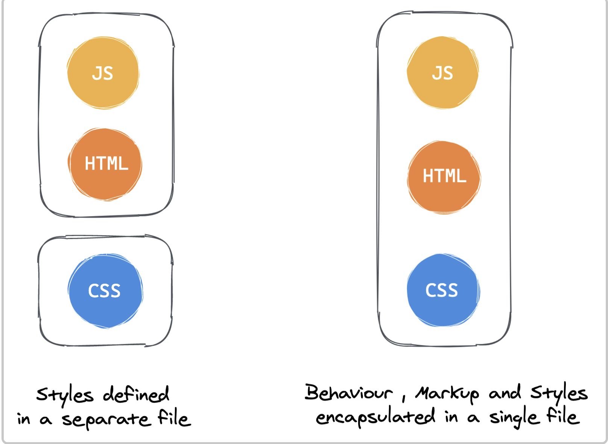
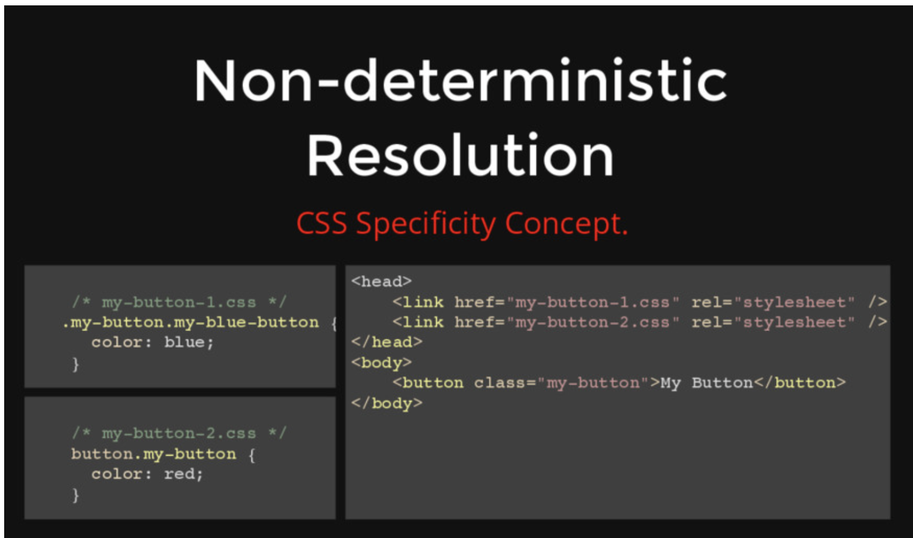
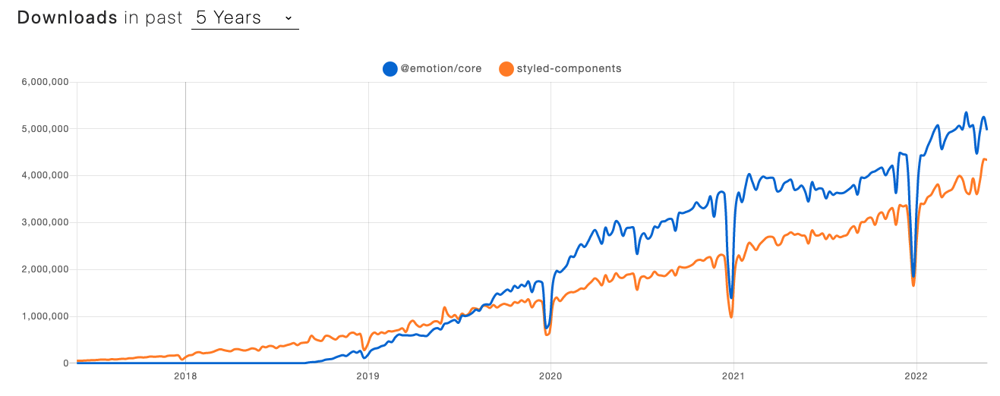

# Why was CSS-in-JS created?

CSS-in-JS, as the name suggests, refers to the approach of writing CSS within JavaScript code. It was first introduced in 2014 by Christopher Chedeau (aka Vjeux), a developer at Facebook.



Vjeux described the difficulties of writing CSS as follows, and emphasized that CSS-in-JS could solve all of these issues.

- Global namespace: A naming convention is required for names declared in the global space

  - Issue
    - Because CSS was originally designed to style documents, it has no concept of modular scope (a global scope/namespace)
    - CSS methodologies (BEM) and Module/Scope formats were meant to keep CSS rules from affecting multiple elements, but they still do not support module-level scoping
  - Solution
    - Because CSS-in-JS defines styles in JS, style variables are limited to lexical scope (component-level scope)
    - CSS-in-JS lets you export/import style variables freely, making reuse possible

  ```tsx
  import styled from 'styled-components'
  export const Container = styled.div`
    display: flex;
    flex-direction: column;
    height: 100%;
  `;

  const Template: FunctionComponent<TemplateProps> = function ({
    return (
      <Container>
      ...
      </Container>
    );
  });
  ```

- Implicit Dependencies: Managing dependency relationships
  - Issue
    - Because JS/CSS modules are separated, the relationship between className/attribute is not explicit, so developers have to remember and manage it themselves, which is difficult
  - Solution
    - Because CSS-in-JS writes CSS inside JS, static analysis is possible, and with the help of the IDE it becomes easy to manage whether something is used or unused
- Dead Code Elimination: Detecting unused code
  - Issue
    - Because managing dependencies is difficult, it is hard to determine whether code is unused (dead code)
    - You can use Google Chrome's coverage tool, but it requires additional working time
  - Solution
    - If you use CSS-in-JS, you can easily remove unused code with the help of eslint and the IDE
- Non-deterministic Resolution
  - Issue
    - CSS rules with higher specificity are applied. However, if they have the same specificity, the rule defined later is applied.
    - If you load CSS with the same specificity asynchronously, which CSS rule will be applied? The answer is you don't know.
    - This is called Non-deterministic Resolution.
      
  - Solution
    - By tightly coupling HTML/CSS/JS at the module (component) level, you can control and determine CSS priority.
- Minification: Minimizing class names

  ```tsx
  // module.css
  .DetailInfoHeader_titleInfo__2XYNF {
  }

  // styled-components
  .kuddxf {
   ...
  }
  ```

- Sharing Constants: Sharing state between JS and CSS

  ```tsx
  // css-in-js 사용 전(css/js 상태 공유X)
  /* common.css */
  :root {
    --primary-color: #2294e3;
    --border-color: #9a9a9a;
  }

  /* app.tsx */
  const --primary-color: '#2294e3';
  <article style={ background: `${--primary-color}` }

  // css-in-js 사용 전(css/js 상태 공유O)
  :root {
    --primary-color: #2294e3;
    --border-color: #9a9a9a;
  }

  const ArticleWrapper = styled.article`
    background: var(--primary-color);
  `;

  <ArticleWrapper></ArticleWrapper>

  ```

- Breaking Isolation: The problem of managing external modifications to CSS being difficult
  - To easily achieve feature reusability and apply custom styles, it is more efficient to manage CSS/JS together
  - In the case of Vue/Svelte and others, this is handled by bundling style/script/html together in a single-file-component approach
  - In React, the goal is to bundle and manage them within the JS ecosystem using the CSS-in-JS approach

# styled-components

<details>
  <summary>styled-components</summary>

**Installation**

```bash
$ npm install styled-components
# or
$ yarn add styled-components
```

Basic usage ( sass syntax support )

```jsx
import React from 'react';
import styled from 'styled-components';

const Circle = styled.div`
  width: 5rem;
  height: 5rem;
  background: black;
  border-radius: 50%;

  > a {
    color: #bfcbd9;
    text-decoration: none;
  }

  &:hover {
    opacity: 0.1;
  }
`;

export const AutoLayoutStyle = css`
  width: 100%;
  height: 100%;
`;

function App() {
  return <Circle />;
}

export default App;
```

Sass - lighten() or darken() : polished

```
yarn add polished

import React from 'react';
import styled from 'styled-components';
import { darken, lighten } from 'polished';

const StyledButton = styled.button`
  background: darken($w9-color-primary, 20%); - scss

  /* 색상 */
  background: #228be6;
  &:hover {
    background: ${lighten(0.1, '#228be6')}; - polished
  }
  &:active {
    background: ${darken(0.1, '#228be6')}; - polished
  }

`;

function Button({ children, ...rest }) {
  return <StyledButton {...rest}>{children}</StyledButton>;
}

export default Button;
```

Applying global styles with ThemeProvider

Before you start styling, creating frequently used information such as color codes, sizes, fonts, and media queries as variables allows for consistent style management

```jsx
import React from 'react';
import styled, { ThemeProvider } from 'styled-components';
import Button from './components/Button';

const AppBlock = styled.div`
  width: 512px;
  margin: 0 auto;
  margin-top: 4rem;
  border: 1px solid black;
  padding: 1rem;
`;

function App() {
  return (
    <ThemeProvider
      theme={
        palette: {
          blue: '#228be6',
          gray: '#495057',
          pink: '#f06595',
        },
      }
    >
      <AppBlock>
        <Button color="gray">BUTTON</Button>
        <Button color="gray">BUTTON</Button>
        <Button color="pink">BUTTON</Button>
      </AppBlock>
    </ThemeProvider>
  );
}

export default App;
```

Component inheritance

```jsx
export const TileDiv = styled.div`
  display: flex;
  flex: 1;
  margin: 0 auto;
  max-width: 1550px;
`;

import { TileDiv } from './styles/CommonStyle';

const ContactDiv = styled(TileDiv)`
  flex-direction: column;
  padding: 5px;
  box-sizing: border-box;
`;
```

Inserting css

```jsx
export const AutoLayoutStyle = css`
  width: 100%;
  height: 100%;
`;

export const DirectSizeStyle = ({ width, height }) => css`
  width: ${width};
  min-width: ${width};
  height: ${height};
  min-height: ${height};
`;

import { AutoLayoutStyle } from './styles/CommonStyle';
const IntroduceDiv = styled.div`
  ${AutoLayoutStyle};
  ${DirectSizeStyle({ width: '200px', height: '200px' })};
`;

const CompItemContentTitleDiv = styled.div`
  display: flex;
  color: #008073;
  font-size: 20px;
  font-weight: 600;

  ${css`
    > span {
      cursor: pointer;
      height: 12px;
      padding-bottom: 10px;
      &:hover {
        border-bottom: 2px solid #008073;
      }
    }
  `}
`;
```

Inserting data (especially images)

```jsx
import HomeImg from '../../imgs/bg-home.jpg';
const HomeBody = styled.div`
  background: url(${HomeImg}) no-repeat center center;
`;
```

Passing props and conditional branching

```jsx
const SideBarDiv = styled.div`
  ${AutoLayoutStyle};
  max-width: ${props => (props.isSidebarOpen ? '170px' : '0px')};
  max-width: ${props => (props.isSidebarOpen ? '170px' : '0px')};
`;

function SideBar({ isSidebarOpen }) {
  return <SideBarDiv isSidebarOpen={isSidebarOpen} />;
}
```

Handling attributes

```jsx
import circle from '../../../imgs/circle.svg';
export const ListItemCircleImg = styled.img.attrs({
  src: circle,
  alt: '',
})`
  margin-right: 5px;
`;

const PasswordInput = styled.input.attrs(props => ({
  // Every <PasswordInput /> should be type="password"
  type: 'password',
}))``;
```

Handling global styles (createGlobalStyle)

```jsx
import React from "react";
    import styled, { createGlobalStyle } from "styled-components";

    const GlobalStyle = createGlobalStyle`
			*, *::before, *::after {
			    box-sizing: border-box;
			  }
      body {
        margin: 50px;
        padding: 50px;
        background-color: black;
      }
    `;
    ...
    const App = () => {
      return (
        <Container>
          <GlobalStyle />
          <Button>버튼1</Button>
          <Button color="red">버튼2</Button>
        </Container>
      );
    };

import theme from '/src/styles/theme'

return (
    <ThemeProvider theme={theme}>
      <GlobalStyle />
      <Header switchTheme={switchTheme} />
      <Container currentThemeText={currentThemeText} />
    </ThemeProvider>
  );

const GlobalStyle = createGlobalStyle`
    ${reset};
    ${customReset};

    html {
      font-size: 62.5%; //1rem = 10px;
    }

    ${({ theme }) => {
      return css`
        body {
          font-family: ${theme.fonts.family.base};
          font-weight: ${theme.fonts.weight.normal};
          font-size: ${theme.fonts.size.base};
        }
      `;
    }}
`;
```

animations

```jsx
// Create the keyframes
const rotate = keyframes`
  from {
    transform: rotate(0deg);
  }

  to {
    transform: rotate(360deg);
  }
`;

// Here we create a component that will rotate everything we pass in over two seconds
const Rotate = styled.div`
  display: inline-block;
  animation: ${rotate} 2s linear infinite;
  padding: 2rem 1rem;
  font-size: 1.2rem;
`;

render(<Rotate>&lt; 💅🏾 &gt;</Rotate>);
```

SCSS import support

```jsx
import { createGlobalStyle, css } from 'styled-components';
import reset from 'styled-reset';
import customReset from './customReset.scss'; // waffle에 scss 도입가능한지 확인??

const GlobalStyle = createGlobalStyle`
    ${reset};
    ${customReset};

    html {
      font-size: 62.5%; //1rem = 10px;
    }

    ${({ theme }) => {
      return css`
        body {
          font-family: ${theme.fonts.family.base};
          font-weight: ${theme.fonts.weight.normal};
          font-size: ${theme.fonts.size.base};
        }
      `;
    }}
`;

export default GlobalStyle;
```

</details>

# Emotion

<details>
  <summary>Emotion</summary>



- A CSS-in-JS library similar to styled-components
- material-ui(v5) - emotion applied
  - [https://hoontae24.github.io/19](https://hoontae24.github.io/19)
- [https://www.howdy-mj.me/css/emotion.js-intro/](https://www.howdy-mj.me/css/emotion.js-intro/)
- [https://emotion.sh/docs/introduction](https://emotion.sh/docs/introduction)
- [https://hoontae24.github.io/19](https://hoontae24.github.io/19)

</details>

# **References**

- [https://blog.eunsukim.me/posts/introducing-css-in-js](https://blog.eunsukim.me/posts/introducing-css-in-js)
- [http://blog.vjeux.com/2014/javascript/react-css-in-js-nationjs.html](http://blog.vjeux.com/2014/javascript/react-css-in-js-nationjs.html)
- [https://speakerdeck.com/vjeux/react-css-in-js?slide=23](https://speakerdeck.com/vjeux/react-css-in-js?slide=23)
- [https://so-so.dev/web/css-in-js-whats-the-defference/](https://so-so.dev/web/css-in-js-whats-the-defference/)
