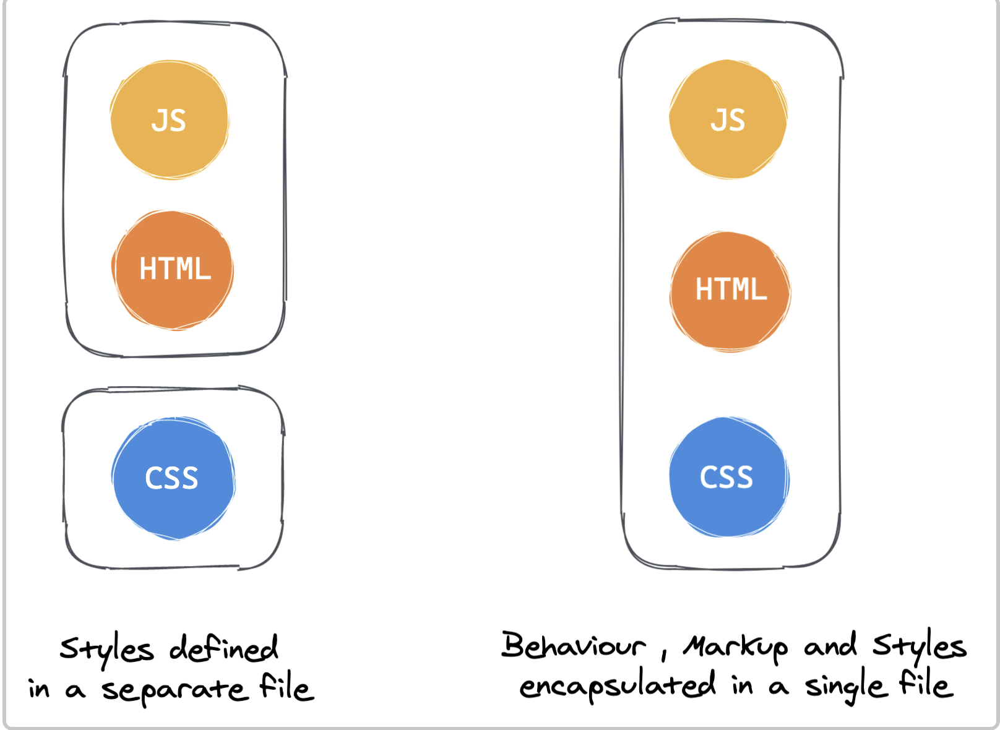
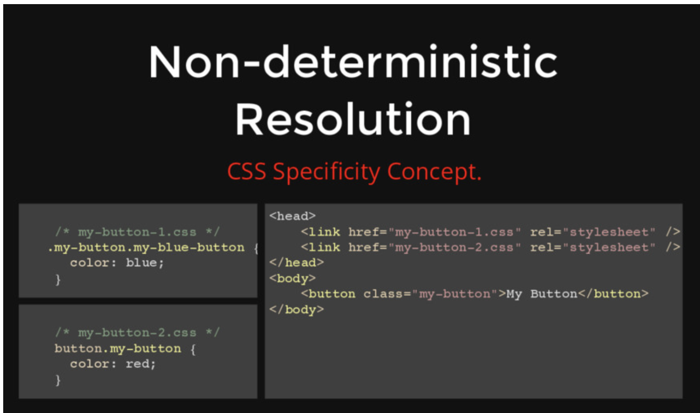
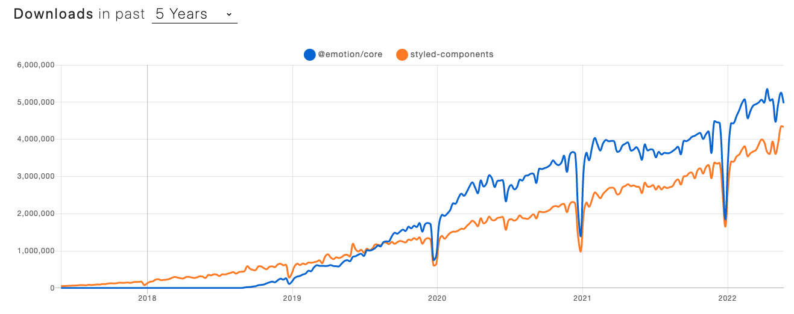

# CSS-in-JS 왜 만들어졌나?

CSS-in-JS는 단어 그대로 자바스크립트 코드에서 CSS를 작성하는 방식을 말합니다. 2014년 페이스북 개발자인 Christopher Chedeau aka Vjeux가 처음 소개하였습니다.



Vjeux는 CSS를 작성하는 어려움을 다음과 같이 설명하였으며 CSS-in-JS로 이들 이슈를 모두 해결할 수 있다고 강조했습니다.

- Global namespace: 글로벌 공간에 선언된 이름의 명명 규칙 필요

  - Issue
    - CSS 처음부터 document를 스타일을 하기 위해 설계되었기 때문에 모듈형식의 scope 개념이 없음(전역 스코프/네임스페이스)
    - CSS 방법론(BEM), Module/Scope 형식처럼 CSS rule이 여러 Element에 영향을 안받도록 했지만, 여전히 모듈단위 스코프를 지원하지 않음
  - Solution
    - CSS-in-JS는 style을 JS에서 정의하기 때문에 style variable이 lexical scope(컴포넌트 단위 스코프)에 한정
    - CSS-in-JS는 style variable를 얼마든지 export/import 하여서 재사용이 가능합니다

  ```tsx
  import styled from 'styled-components'
  export const Container = styled.div`
    display: flex;
    flex-direction: column;
    height: 100%;
  `;

  const Template: FunctionComponent<TemplateProps> = function ({
    return (
      <Container>
      ...
      </Container>
    );
  });
  ```

- Implicit Dependencies: 의존 관계를 관리
  - Issue
    - JS/CSS 모듈이 분리 되어 있어 className/attribute 관계가 명시적이지 않기 때문에 개발자가 기억해서 관리를 해줘야하는 어려움이 있음
  - Solution
    - CSS-in-JS는 CSS를 JS에 작성하기 때문에 정적 분석이 가능하고, IDE의 도움을 받아서 사용/미사용 여부를 관리가 쉬워짐
- Dead Code Elimination: 미사용 코드 검출
  - Issue
    - 의존 관계 관리가 어려워서 사용되고 있지 않는(dead code) 인지 파악하기 힘들다.
    - 구글 크롬의 coverage로 사용이 가능하지만, 추가적인 작업시간이 들어가게 된다.
  - Solution
    - CSS-in-JS 를 사용한다면 eslint, IDE에 도움을 받아서 미사용되는 코드를 간단히 제거가 가능함.
- Non-deterministic Resolution
  - Issue
    - CSS rule은 specificity가 높은 것이 적용된다. 그런데 만약 같은 specificity를 가진다면, 뒤에 정의된 rule이 적용된다.
    - 만약 같은 specificity를 갖는 CSS들을 async하게 불러오면 어떤 CSS rule이 적용될까? 답은 모른다.
    - 이를 Non-deterministic Resolution이라고 한다.
      
  - Solution
    - HTML/CSS/JS를 모듈(컴포넌트) 단위로 강하게 결합시켜서 CSS 우선순위를 결정할 수 있게 처리가 가능하다.
- Minification: 클래스 이름의 최소화

  ```tsx
  // module.css
  .DetailInfoHeader_titleInfo__2XYNF {
  }

  // styled-components
  .kuddxf {
   ...
  }
  ```

- Sharing Constants: JS와 CSS의 상태 공유

  ```tsx
  // css-in-js 사용 전(css/js 상태 공유X)
  /* common.css */
  :root {
    --primary-color: #2294e3;
    --border-color: #9a9a9a;
  }

  /* app.tsx */
  const --primary-color: '#2294e3';
  <article style={{ background: `${--primary-color}` }}

  // css-in-js 사용 전(css/js 상태 공유O)
  :root {
    --primary-color: #2294e3;
    --border-color: #9a9a9a;
  }

  const ArticleWrapper = styled.article`
    background: var(--primary-color);
  `;

  <ArticleWrapper></ArticleWrapper>

  ```

- Breaking Isolation: CSS의 외부 수정을 관리하기 어려운 문제
  - 기능의 재사용성과 커스텀 스타일을 쉽게 적용하기 위해서는 CSS/JS에 함께 관리되는 것이 더 효율적임
  - Vue/Svelte 등의 경우에는 이를 single-file-component 방식으로 style/script/html 묶어서 관리
  - React에서는 CSS in JS 방식으로 JS 생테계에서 묶어서 관리를 하자는 목적

# styled-components

<details>
  <summary>styled-components</summary>

**설치**

```bash
$ npm install styled-components
# or
$ yarn add styled-components
```

기본사용법( sass 문법 지원 )

```jsx
import React from 'react';
import styled from 'styled-components';

const Circle = styled.div`
  width: 5rem;
  height: 5rem;
  background: black;
  border-radius: 50%;

  > a {
    color: #bfcbd9;
    text-decoration: none;
  }

  &:hover {
    opacity: 0.1;
  }
`;

export const AutoLayoutStyle = css`
  width: 100%;
  height: 100%;
`;

function App() {
  return <Circle />;
}

export default App;
```

Sass - lighten() 또는 darken() : polished

```
yarn add polished

import React from 'react';
import styled from 'styled-components';
import { darken, lighten } from 'polished';

const StyledButton = styled.button`
  background: darken($w9-color-primary, 20%); - scss

  /* 색상 */
  background: #228be6;
  &:hover {
    background: ${lighten(0.1, '#228be6')}; - polished
  }
  &:active {
    background: ${darken(0.1, '#228be6')}; - polished
  }

`;

function Button({ children, ...rest }) {
  return <StyledButton {...rest}>{children}</StyledButton>;
}

export default Button;
```

전역스타일을 적용할 경우 ThemeProvider

스타일링을 시작하기 앞서, 자주 사용하게 될 색상 코드, 사이즈, 폰트, 미디어 쿼리 등의 정보를 변수로 생성해 사용하면 일관적인 스타일 관리가 가능합니다

```jsx
import React from 'react';
import styled, { ThemeProvider } from 'styled-components';
import Button from './components/Button';

const AppBlock = styled.div`
  width: 512px;
  margin: 0 auto;
  margin-top: 4rem;
  border: 1px solid black;
  padding: 1rem;
`;

function App() {
  return (
    <ThemeProvider
      theme={{
        palette: {
          blue: '#228be6',
          gray: '#495057',
          pink: '#f06595',
        },
      }}
    >
      <AppBlock>
        <Button color="gray">BUTTON</Button>
        <Button color="gray">BUTTON</Button>
        <Button color="pink">BUTTON</Button>
      </AppBlock>
    </ThemeProvider>
  );
}

export default App;
```

컴포넌트 상속

```jsx
export const TileDiv = styled.div`
  display: flex;
  flex: 1;
  margin: 0 auto;
  max-width: 1550px;
`;

import { TileDiv } from './styles/CommonStyle';

const ContactDiv = styled(TileDiv)`
  flex-direction: column;
  padding: 5px;
  box-sizing: border-box;
`;
```

css 삽입

```jsx
export const AutoLayoutStyle = css`
  width: 100%;
  height: 100%;
`;

export const DirectSizeStyle = ({ width, height }) => css`
  width: ${width};
  min-width: ${width};
  height: ${height};
  min-height: ${height};
`;

import { AutoLayoutStyle } from './styles/CommonStyle';
const IntroduceDiv = styled.div`
  ${AutoLayoutStyle};
  ${DirectSizeStyle({ width: '200px', height: '200px' })};
`;

const CompItemContentTitleDiv = styled.div`
  display: flex;
  color: #008073;
  font-size: 20px;
  font-weight: 600;

  ${css`
    > span {
      cursor: pointer;
      height: 12px;
      padding-bottom: 10px;
      &:hover {
        border-bottom: 2px solid #008073;
      }
    }
  `}
`;
```

데이터 삽입(특히, 이미지)

```jsx
import HomeImg from '../../imgs/bg-home.jpg';
const HomeBody = styled.div`
  background: url(${HomeImg}) no-repeat center center;
`;
```

props 전달 및 분기처리

```jsx
const SideBarDiv = styled.div`
  ${AutoLayoutStyle};
  max-width: ${props => (props.isSidebarOpen ? '170px' : '0px')};
  max-width: ${props => (props.isSidebarOpen ? '170px' : '0px')};
`;

function SideBar({ isSidebarOpen }) {
  return <SideBarDiv isSidebarOpen={isSidebarOpen} />;
}
```

attribute 처리

```jsx
import circle from '../../../imgs/circle.svg';
export const ListItemCircleImg = styled.img.attrs({
  src: circle,
  alt: '',
})`
  margin-right: 5px;
`;

const PasswordInput = styled.input.attrs(props => ({
  // Every <PasswordInput /> should be type="password"
  type: 'password',
}))``;
```

전역스타일 처리(createGlobalStyle)

```jsx
import React from "react";
    import styled, { createGlobalStyle } from "styled-components";

    const GlobalStyle = createGlobalStyle`
			*, *::before, *::after {
			    box-sizing: border-box;
			  }
      body {
        margin: 50px;
        padding: 50px;
        background-color: black;
      }
    `;
    ...
    const App = () => {
      return (
        <Container>
          <GlobalStyle />
          <Button>버튼1</Button>
          <Button color="red">버튼2</Button>
        </Container>
      );
    };

import theme from '/src/styles/theme'

return (
    <ThemeProvider theme={theme}>
      <GlobalStyle />
      <Header switchTheme={switchTheme} />
      <Container currentThemeText={currentThemeText} />
    </ThemeProvider>
  );

const GlobalStyle = createGlobalStyle`
    ${reset};
    ${customReset};

    html {
      font-size: 62.5%; //1rem = 10px;
    }

    ${({ theme }) => {
      return css`
        body {
          font-family: ${theme.fonts.family.base};
          font-weight: ${theme.fonts.weight.normal};
          font-size: ${theme.fonts.size.base};
        }
      `;
    }}
`;
```

animations

```jsx
// Create the keyframes
const rotate = keyframes`
  from {
    transform: rotate(0deg);
  }

  to {
    transform: rotate(360deg);
  }
`;

// Here we create a component that will rotate everything we pass in over two seconds
const Rotate = styled.div`
  display: inline-block;
  animation: ${rotate} 2s linear infinite;
  padding: 2rem 1rem;
  font-size: 1.2rem;
`;

render(<Rotate>&lt; 💅🏾 &gt;</Rotate>);
```

SCSS import 가능

```jsx
import { createGlobalStyle, css } from 'styled-components';
import reset from 'styled-reset';
import customReset from './customReset.scss'; // waffle에 scss 도입가능한지 확인??

const GlobalStyle = createGlobalStyle`
    ${reset};
    ${customReset};

    html {
      font-size: 62.5%; //1rem = 10px;
    }

    ${({ theme }) => {
      return css`
        body {
          font-family: ${theme.fonts.family.base};
          font-weight: ${theme.fonts.weight.normal};
          font-size: ${theme.fonts.size.base};
        }
      `;
    }}
`;

export default GlobalStyle;
```

</details>

# Emotion

<details>
  <summary>Emotion</summary>



- styled-components 와 비슷한 CSS-in-JS 라이브러리
- material-ui(v5) - emotion 적용
  - [https://hoontae24.github.io/19](https://hoontae24.github.io/19)
- [https://www.howdy-mj.me/css/emotion.js-intro/](https://www.howdy-mj.me/css/emotion.js-intro/)
- [https://emotion.sh/docs/introduction](https://emotion.sh/docs/introduction)
- [https://hoontae24.github.io/19](https://hoontae24.github.io/19)

</details>

# **참고페이지**

- [https://blog.eunsukim.me/posts/introducing-css-in-js](https://blog.eunsukim.me/posts/introducing-css-in-js)
- [http://blog.vjeux.com/2014/javascript/react-css-in-js-nationjs.html](http://blog.vjeux.com/2014/javascript/react-css-in-js-nationjs.html)
- [https://speakerdeck.com/vjeux/react-css-in-js?slide=23](https://speakerdeck.com/vjeux/react-css-in-js?slide=23)
- [https://so-so.dev/web/css-in-js-whats-the-defference/](https://so-so.dev/web/css-in-js-whats-the-defference/)
