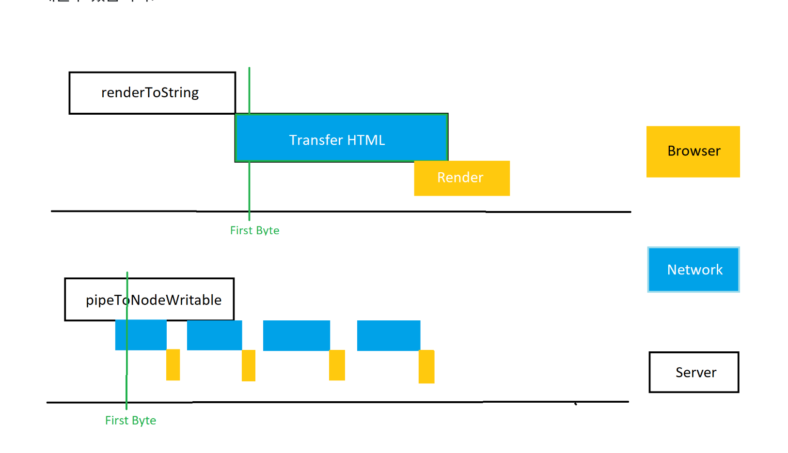
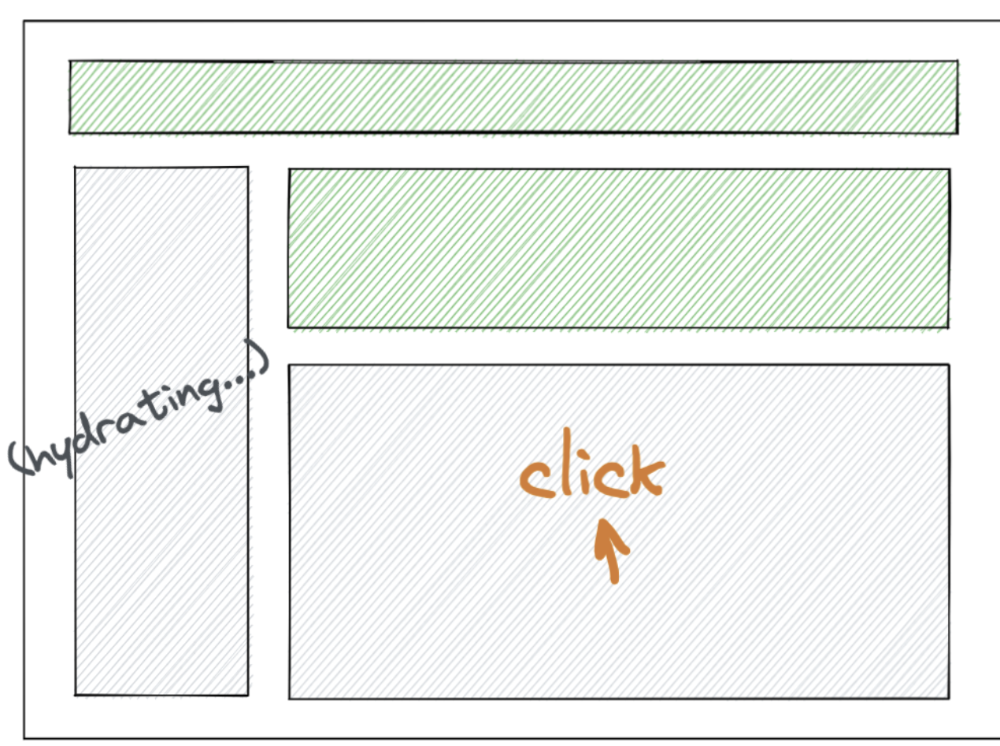
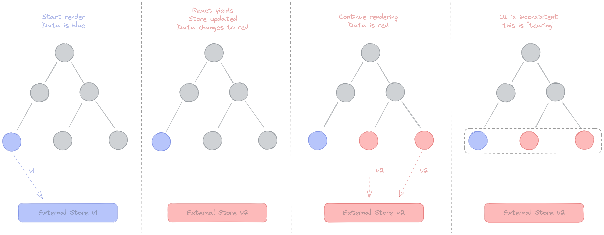
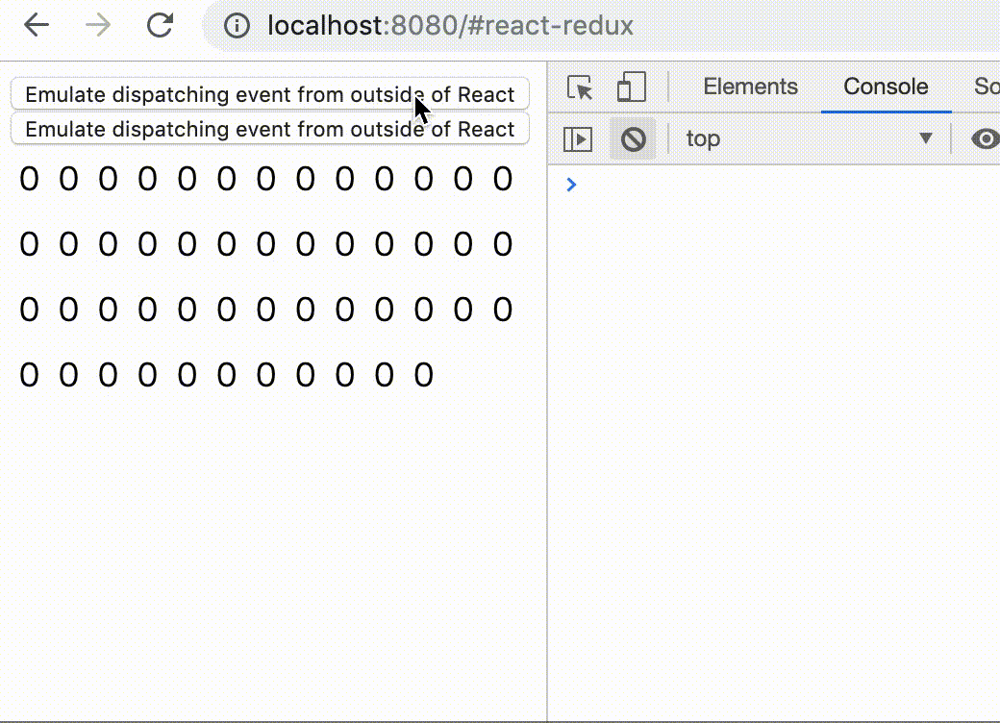

# Installation

```bash
$ npm install react@18.1.0 react-dom@18.1.0
or
$ yarn add react@18.1.0 react-dom@18.1.0
```

# Upgrading React DOM 17 → 18

```tsx
// <= v17
//// client render
import { render } from 'react-dom';
const container = document.getElementById('app');
render(<App tab="home" />, container);

//// unmount
unmountComponentAtNode(container);

//// render callback(렌더링 완료 이후에 호출되는 콜백함수)
const container = document.getElementById('app');
render(<App tab="home" />, container, () => {
  console.log('rendered');
});

//// hydration
import { hydrate } from 'react-dom';
const container = document.getElementById('app');
hydrate(<App tab="home" />, container);

// >= 18
//// client render
import { createRoot } from 'react-dom/client';
const container = document.getElementById('app');
const root = createRoot(container); // createRoot(container!) if you use TypeScript
root.render(<App tab="home" />);

//// unmount
root.unmount();

//// render callback(useEffect)
function AppWithCallbackAfterRender() {
  useEffect(() => {
    console.log('rendered');
  });

  return <App tab="home" />;
}

//// hydration
import { hydrateRoot } from 'react-dom/server';
const container = document.getElementById('app');
root.hydrateRoot(container, <App tab="home" />);
```

# Client

Starting from React 18, react-dom's render function is deprecated.

```tsx
// v17 이전
ReactDOM.render(
  <React.StrictMode>
    <App />
  </React.StrictMode>,
  document.getElementById('root'),
);

// v18 이후(createRoot)
ReactDOM.createRoot(document.getElementById('root') as HTMLDivElement).render(
  <React.StrictMode>
    <App />
  </React.StrictMode>,
);
```

# Automatic Batching (fewer renders)

## Batching

Batching refers to React grouping multiple state updates into a single re-render for better performance.

```tsx
// <= 17
// 리액트 이벤트 Callback 함수에서는 배칭 방식으로 상태를 모아서 업데이트 진행
function App() {
  const [count, setCount] = useState(0);
  const [flag, setFlag] = useState(false);

  function handleClick() {
    setCount((c) => c + 1);
    setFlag((f) => !f);
  }

  console.log("render");
  return (
    <div>
      <button onClick={handleClick}>Next</button>
      <h1>{count}</h1>
    </div>
  );}

const rootElement = document.getElementById("root");
// This opts into the new behavior!
// ReactDOM.createRoot(rootElement).render(<App />); -> 콘솔에 렌더가 1번 찍힘(>= 18)
// This keeps the old behavior:
ReactDOM.render(<App />, rootElement); -> 콘솔에 렌더가 2번 찍힘

```

## Automatic Batching

When you use createRoot for React 18's concurrent processing, promise/setTimeout/native event handlers and all other events batch state updates in the same way as updates inside React events.

Through this, you can expect improved application performance by minimizing rendering work.

```tsx
// >= 18
// setTimeOut
setTimeout(() => {
  setCount(c => c + 1);
  setFlag(f => !f);
  // React는 이 함수가 끝날 때만 리렌더링을 한다 (배칭이다!)
}, 1000);

// Promise
fetch(/*...*/).then(() => {
  setCount(c => c + 1);
  setFlag(f => !f);
  // React는 이 함수가 끝날 때만 리렌더링을 한다 (배칭이다!)
});

// native event handler
elm.addEventListener('click', () => {
  setCount(c => c + 1);
  setFlag(f => !f);
  // React는 이 함수가 끝날 때만 리렌더링을 한다 (배칭이다!)
});
```

## FlushSync

If you don't want batching, you can use FlushSync.

```tsx
import { flushSync } from 'react-dom'; // Note: react가 아닌 react-dom이다

// 뱃칭을 원치 않는 경우(state 변경 후 dom에서 데이터를 가져와야하는 경우)
function handleClick() {
  flushSync(() => {
    setCounter(c => c + 1);
  });
  // 이 과정이 끝났을 때 React는 DOM을 업데이트한 상태
  flushSync(() => {
    setFlag(f => !f);
  });
  // 이 과정이 끝났을 때 React는 DOM을 업데이트한 상태
}
```

# Concurrent Features

## startTransition

Before introducing transition updates, let's take a look at React's state updates.

- **Urgent updates**: reflecting direct interactions (typing, hovering, scrolling, etc.)
  - This is the area where users feel something is wrong if it isn't updated immediately in response to their input (frozen screen, lag, etc.).
- **Transition updates**: UI transitions from one view to another
  - This is the area where users don't expect it to appear on screen instantly.

Up until React 17, there was no way to specify urgent vs. transition updates, so all state was updated as urgent updates.

The problem was that even when a transition update became slow because the user's device was low-performance or the network was slow, it should not interfere with urgent updates, but versions before 17 had the issue of it interfering.

To work around this issue, techniques like setTimeout, throttle, and debounce were the best available options.

From React 18 onwards, the startTransition API is provided, giving you a way to explicitly designate urgent updates vs. transition updates.

```tsx
// index.tsx

// v17 이전
ReactDOM.render(
  <React.StrictMode>
    <App />
  </React.StrictMode>,
  document.getElementById('root')
);

// v18 이후(createRoot)
ReactDOM.createRoot(document.getElementById("root") as HTMLDivElement).render(
  <React.StrictMode>
    <App />
  </React.StrictMode>
);

// App.tsx
// v17 이전
import { useState } from "react";
const [urgentCount, setUrgentCount] = useState<number>(0);
const handleUrgentChange = (e: React.ChangeEvent<HTMLInputElement>) => {
  console.log(urgentCount);
  setUrgentCount((prev) => e.target.value.length ** 6);
};

<button onClick={() => handleUpdateType("Urgent")}>
  Urgent updates
</button>

<>
  <label>Urgent : </label>
  <input type="text" onChange={handleUrgentChange} />
  <br />
  {[...Array(urgentCount)].map((n, index) => {
    return ;
  })}
</>

// v18 이후
import { useState, useTransition } from "react";
const [transitionCount, setTransitionCount] = useState<number>(0);
const [isPending, startTransition] = useTransition();

const handleTransitionChange = (
  e: React.ChangeEvent<HTMLInputElement>
): void => {
  startTransition(() => {
    console.log(transitionCount);
    setTransitionCount((prev) => e.target.value.length ** 6);
  });
};

<>
  <label>Transition : </label>
  <input type="text" onChange={handleTransitionChange} />
  <br />
  {[...Array(transitionCount)].map((n, index) => {
    return ;
  })}
</>

```

- Example code: [https://codesandbox.io/s/urgent-transition-update-v4h562?from-embed](https://codesandbox.io/s/urgent-transition-update-v4h562?from-embed)

## useDeferredValue

useDeferredValue lets you defer re-rendering a non-urgent tree.

Deferred rendering can be interrupted and does not interfere with the user's input.

It is similar to debouncing / throttling techniques, but has the advantage that you don't need to specify a timeout yourself; React runs it as soon as other urgent work is completed.

```tsx
function Typeahead() {
  const query = useSearchQuery('');
  const deferredQuery = useDeferredValue(query);

  const deferredValue = useDeferredValue(value, {
    timeoutMs: 5000,
  });

  // Memoizing tells React to only re-render when deferredQuery changes,
  // not when query changes.
  const suggestions = useMemo(
    () => <SearchSuggestions query={deferredQuery} />,
    [deferredQuery],
  );

  return (
    <>
      <SearchInput query={query} />
      <Suspense fallback="Loading results...">{suggestions}</Suspense>
    </>
  );
}
```

## useTransition vs useDeferredValue

- Use useTransition when you have control over the state, and use useDeferredValue when you only have access to a value via props.

# Suspense Support for Server-Side Rendering

The existing React SSR went through the following 4 steps.

- The server fetches the data for the entire app. (Data Fetching)
- Then, the server renders the entire app to HTML and sends it as the Response.
- Then, the client loads the JavaScript code for the entire app.
- Then, the client connects the entire app's HTML generated on the server with the JavaScript logic. (Hydration)

The important point is that each step had to be completed for the entire app before it could move on to the next step, so if a delay occurred at any step, the user would see a blank screen, resulting in a poor UX experience.

Deriving the problems

- When data fetching required to render a specific component takes a long time
- When a specific component has a large amount of code and takes a long time to load
- When a specific component's logic is complex and takes a long time

From React 18 onwards, you can wrap expensive-to-render sub-components in Suspense so they proceed without blocking the Hydration of the entire app. (The sub-components later hydrate independently.)

To use Suspense, you must use the renderToPipeableStream function.

- renderToString(React.Node): string: Be able to run ( Limited support Suspense)
- renderToNodeStream(React.Node): Readable: Not recommended ( Fully support Suspense, barring stream)
- renderToPipeableStream(React.Node, Options): Controls: **The latest recommendation** ( Fully support Suspense and stream)

```tsx
import { renderToString } from 'react-dom';

renderToString(
  <Layout>
    <NavBar />
    <Sidebar />
    <RightPane>
      <Post />
      <Suspense fallback={<Spinner />}>
        <Comments />
      </Suspense>
    </RightPane>
  </Layout>,
);

import { pipeToNodeWritable } from 'react-dom/server';
// data fetching 오래 걸릴경우(Comments)
const { startWriting, abort } = renderToPipeableStream(
  <Layout>
    <NavBar />
    <Sidebar />
    <RightPane>
      <Post />
      <Suspense fallback={<Spinner />}>
        <Comments />
      </Suspense>
    </RightPane>
  </Layout>,
  {
    onShellReady() {
      // The content above all Suspense boundaries is ready.
      // If something errored before we started streaming, we set the error code appropriately.
      res.statusCode = didError ? 500 : 200;
      res.setHeader('Content-type', 'text/html');
      stream.pipe(res);
    },
    onShellError(error) {
      // Something errored before we could complete the shell so we emit an alternative shell.
      res.statusCode = 500;
      res.send(
        '<!doctype html><p>Loading...</p><script src="clientrender.js"></script>',
      );
    },
    onAllReady() {
      // If you don't want streaming, use this instead of onShellReady.
      // This will fire after the entire page content is ready.
      // You can use this for crawlers or static generation.
      // res.statusCode = didError ? 500 : 200;
      // res.setHeader('Content-type', 'text/html');
      // stream.pipe(res);
    },
    onError(err) {
      didError = true;
      console.error(err);
    },
  },
);

// 특정 컴포넌트 코드량이 커서 로딩이 오래 걸린경우
// 특정 컴포넌트의 로직이 복잡해서 시간이 오래 걸릴 경우
import React, { Suspense } from 'react';

const OtherComponent = React.lazy(() => import('./OtherComponent'));

function MyComponent() {
  return (
    <div>
      <Suspense fallback={<div>Loading...</div>}>
        <OtherComponent />
      </Suspense>
    </div>
  );
}
```



User-friendly Hydration

```tsx
<Layout>
  <NavBar />
  <Suspense fallback={<Spinner />}>
    <Sidebar />
  </Suspense>
  <RightPane>
    <Post />
    <Suspense fallback={<Spinner />}>
      <Comments />
    </Suspense>
  </RightPane>
</Layout>
```



- If the user clicks the Comments component while the Sidebar is hydrating, from React 18 onwards React raises the Hydration priority so that it hydrates the Sidebar → Comments component first.

# useSyncExternalStore

As React 18 comes to support Concurrent reads, this is a new hook that forcibly synchronizes and updates an external store.

- External Store: An external store refers to state that is managed and subscribed to outside of React rather than inside it. Examples include redux, mobx, global variables, and DOM state.
- Internal Store: Refers to state used inside React. Examples include props, context, useState, and useReducer.
- tearing: When a single piece of state affects multiple UIs, tearing refers to the UI looking different because the update speed differs from component to component.

Before React 18, since it was impossible to pause/defer rendering, there was no problem because whenever state was updated the screen would always change unconditionally.

From React 18 onwards, with the arrival of Concurrent rendering, when a pause/defer occurs, updates can differ from component to component, causing the problem of showing different values.

To solve this issue, React 18 provides the useSyncExternalStore hook, making it possible to always keep the UI consistent.



Tearing: the mismatch between external store data and the screen



A test for tearing

`useSyncExternalStore` takes two functions as arguments.

- `subscribe`: the callback function to register
- `getSnapshot`: used to check whether the subscribed value has changed since it was last rendered, whether it is an immutable value like a string or number, or whether it is a cached or memoized object. Afterward, an immutable value is returned by the hook.

An API that provides a memoized value as the result of `getSnapShot` is as follows.

```tsx
import { useSyncExternalStore } from 'react';

const useStore = (store, selector) => {
  return useSyncExternalStore(
    store.subscribe,
    useCallback(() => selector(store.getState(), [store, selector])),
  );
};
```

# Other Changes

- useId: [https://yceffort.kr/2022/04/react-18-changelog#useid](https://yceffort.kr/2022/04/react-18-changelog#useid)
- useInsertionEffect: [https://yceffort.kr/2022/04/react-18-changelog#useinsertioneffect](https://yceffort.kr/2022/04/react-18-changelog#useinsertioneffect)
- React changes: [https://yceffort.kr/2022/04/react-18-changelog#react-1](https://yceffort.kr/2022/04/react-18-changelog#react-1)
- Others: [https://yceffort.kr/2022/04/react-18-changelog#%EB%88%88%EC%97%90-%EB%9D%84%EB%8A%94-%EB%B3%80%ED%99%94](https://yceffort.kr/2022/04/react-18-changelog#%EB%88%88%EC%97%90-%EB%9D%84%EB%8A%94-%EB%B3%80%ED%99%94)

# References

- [https://reactjs.org/blog/2022/03/29/react-v18.html](https://reactjs.org/blog/2022/03/29/react-v18.html)
- [https://yceffort.kr/2022/04/react-18-changelog#deprecation](https://yceffort.kr/2022/04/react-18-changelog#deprecation)
- [https://medium.com/naver-place-dev/react-18%EC%9D%84-%EC%A4%80%EB%B9%84%ED%95%98%EC%84%B8%EC%9A%94-8603c36ddb25](https://medium.com/naver-place-dev/react-18%EC%9D%84-%EC%A4%80%EB%B9%84%ED%95%98%EC%84%B8%EC%9A%94-8603c36ddb25)
- [https://velog.io/@jay/React-18-%EB%B3%80%EA%B2%BD%EC%A0%90](https://velog.io/@jay/React-18-%EB%B3%80%EA%B2%BD%EC%A0%90)
- [https://cdmana.com/2021/08/20210827045628000z.html](https://cdmana.com/2021/08/20210827045628000z.html)
