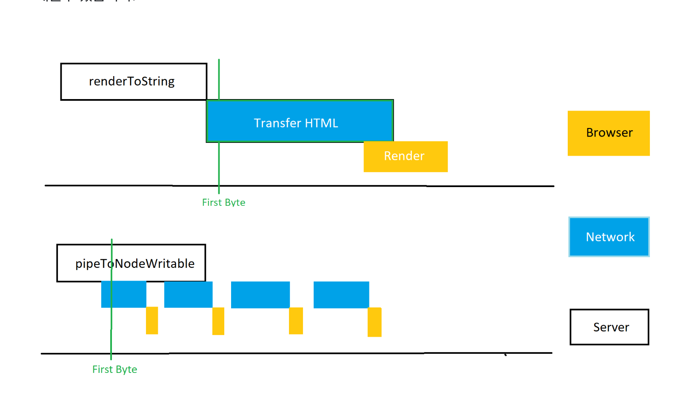
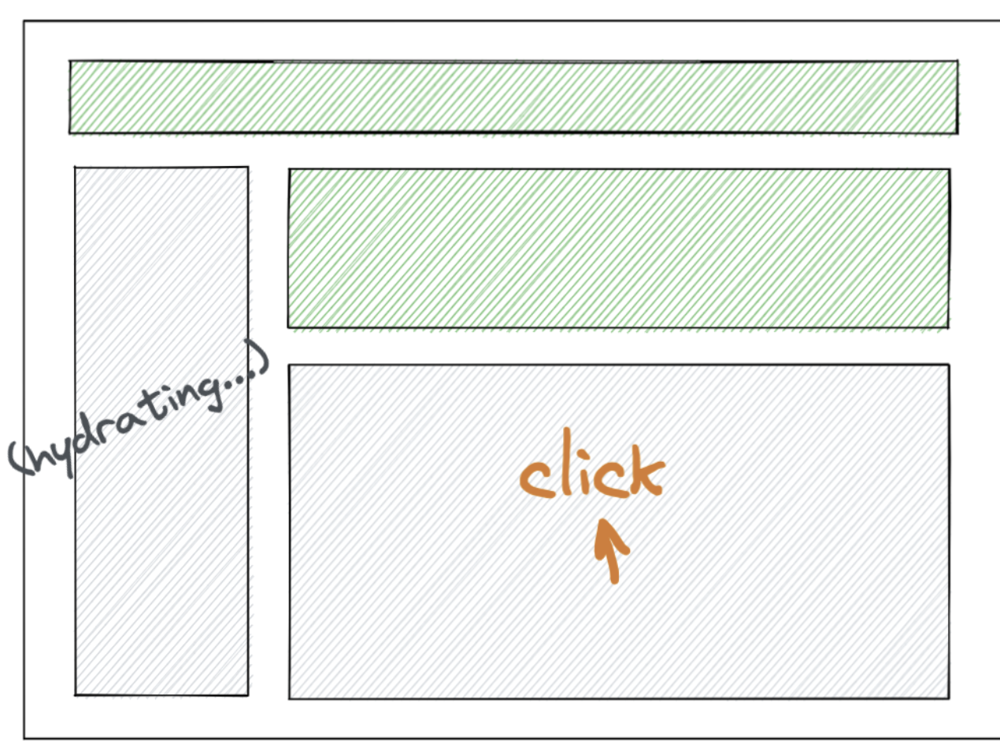
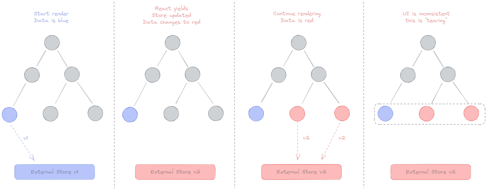
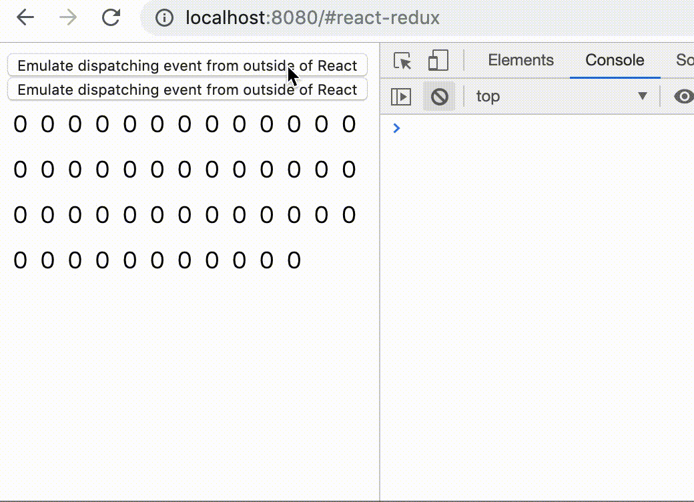

# v18

## 설치

```bash
$ npm install react@18.1.0 react-dom@18.1.0
or
$ yarn add react@18.1.0 react-dom@18.1.0
```

## React DOM 17 → 18 업그레이드

```tsx
// <= v17
//// client render
import { render } from 'react-dom';
const container = document.getElementById('app');
render(<App tab="home" />, container);

//// unmount
unmountComponentAtNode(container);

//// render callback(렌더링 완료 이후에 호출되는 콜백함수)
const container = document.getElementById('app');
render(<App tab="home" />, container, () => {
  console.log('rendered');
});

//// hydration
import { hydrate } from 'react-dom';
const container = document.getElementById('app');
hydrate(<App tab="home" />, container);

// >= 18
//// client render
import { createRoot } from 'react-dom/client';
const container = document.getElementById('app');
const root = createRoot(container); // createRoot(container!) if you use TypeScript
root.render(<App tab="home" />);

//// unmount
root.unmount();

//// render callback(useEffect)
function AppWithCallbackAfterRender() {
  useEffect(() => {
    console.log('rendered');
  });

  return <App tab="home" />;
}

//// hydration
import { hydrateRoot } from 'react-dom/server';
const container = document.getElementById('app');
root.hydrateRoot(container, <App tab="home" />);
```

## 클라이언트

React 18부터 react-dom의 render 함수는 deprecated 됩니다.

```tsx
// v17 이전
ReactDOM.render(
  <React.StrictMode>
    <App />
  </React.StrictMode>,
  document.getElementById('root'),
);

// v18 이후(createRoot)
ReactDOM.createRoot(document.getElementById('root') as HTMLDivElement).render(
  <React.StrictMode>
    <App />
  </React.StrictMode>,
);
```

## automatic batching(fewer renders)

### Batching

배칭(batching)은 리액트가 더 나은 성능을 위해 여러개의 state(상태) 업데이트를  하나의 re-render가 발생하도록 그룹화 하는 것을 의미한다.

```tsx
// <= 17
// 리액트 이벤트 Callback 함수에서는 배칭 방식으로 상태를 모아서 업데이트 진행
function App() {
  const [count, setCount] = useState(0);
  const [flag, setFlag] = useState(false);

  function handleClick() {
    setCount((c) => c + 1);
    setFlag((f) => !f);
  }

  console.log("render");
  return (
    <div>
      <button onClick={handleClick}>Next</button>
      <h1>{count}</h1>
    </div>
  );}

const rootElement = document.getElementById("root");
// This opts into the new behavior!
// ReactDOM.createRoot(rootElement).render(<App />); -> 콘솔에 렌더가 1번 찍힘(>= 18)
// This keeps the old behavior:
ReactDOM.render(<App />, rootElement); -> 콘솔에 렌더가 2번 찍힘

```

### Automatic Batching

React 18 동시성 처리를 위한 createRoot를 사용할 경우, promise/settimeout/native event handler와 모든 다른 이벤트는 React 이벤트 내부의 업데이트와 동일한 방식으로 state 업데이트를 배칭합니다.

이것을 통해서 작업 렌더링을 최소화하여, 애플리케이션의 성능 향상을 기대할 수 있습니다.

```tsx
// >= 18
// setTimeOut
setTimeout(() => {
  setCount(c => c + 1);
  setFlag(f => !f);
  // React는 이 함수가 끝날 때만 리렌더링을 한다 (배칭이다!)
}, 1000);

// Promise
fetch(/*...*/).then(() => {
  setCount(c => c + 1);
  setFlag(f => !f);
  // React는 이 함수가 끝날 때만 리렌더링을 한다 (배칭이다!)
});

// native event handler
elm.addEventListener('click', () => {
  setCount(c => c + 1);
  setFlag(f => !f);
  // React는 이 함수가 끝날 때만 리렌더링을 한다 (배칭이다!)
});
```

### FlushSync

배칭을 원하지 않을 경우 FlushSync를 사용하면 된다.

```tsx
import { flushSync } from 'react-dom'; // Note: react가 아닌 react-dom이다

// 뱃칭을 원치 않는 경우(state 변경 후 dom에서 데이터를 가져와야하는 경우)
function handleClick() {
  flushSync(() => {
    setCounter(c => c + 1);
  });
  // 이 과정이 끝났을 때 React는 DOM을 업데이트한 상태
  flushSync(() => {
    setFlag(f => !f);
  });
  // 이 과정이 끝났을 때 React는 DOM을 업데이트한 상태
}
```

## 동시성(Concurrent) 기능

### startTransition

전환 업데이터를 소개하기 전에 리액트의 상태 업데이트에 대해서 알아봅시다.

- **긴급 업데이트(Urgent updates)**: 직접적인 상호 작용 반영(타이핑, 오버, 스크롤링 등)
  - 사용자의 입력에 따라 즉각적으로 업데이트되지 않으면(화면 멈춤, 렉 등) 문제가 있다고 느끼는 영역입니다.
- **전환 업데이트(Transition updates)**: 하나의 뷰에서 다른 뷰로의 UI 전환
  - 화면에 즉시 나타나는 걸 기대하지 않는 영역입니다

리액트 17 이전까지는 긴급/전환 업데이트를 명시할 수 있는 방법이 없이, 모두 긴급 업데이트로 상태를 업데이트 하고 있었습니다.

그 문제점으로 사용자의 디바이스가 성능이 느리거나, 네트워크가 느려서 전환 업데이트가 느려질 경우라도 긴급 업데이트에 방해가 되면 안되지만, 17버전 이전까지는 방해가 되는 문제점을 가지고 있었습니다.

이런 문제점을 해결하기 위해서 setTimeout, throttle, debounce 같은 기술로 회피하는게 최선의 방법이였습니다.

리액트 18 버전 이후부터는 startTransition api를 제공해서 긴급 업데이트/전환 업데이트를 직접 명시할 수 있는 방법이 생겼습니다.

```tsx
// index.tsx

// v17 이전
ReactDOM.render(
  <React.StrictMode>
    <App />
  </React.StrictMode>,
  document.getElementById('root')
);

// v18 이후(createRoot)
ReactDOM.createRoot(document.getElementById("root") as HTMLDivElement).render(
  <React.StrictMode>
    <App />
  </React.StrictMode>
);

// App.tsx
// v17 이전
import { useState } from "react";
const [urgentCount, setUrgentCount] = useState<number>(0);
const handleUrgentChange = (e: React.ChangeEvent<HTMLInputElement>) => {
  console.log(urgentCount);
  setUrgentCount((prev) => e.target.value.length ** 6);
};

<button onClick={() => handleUpdateType("Urgent")}>
  Urgent updates
</button>

<>
  <label>Urgent : </label>
  <input type="text" onChange={handleUrgentChange} />
  <br />
  {[...Array(urgentCount)].map((n, index) => {
    return ;
  })}
</>

// v18 이후
import { useState, useTransition } from "react";
const [transitionCount, setTransitionCount] = useState<number>(0);
const [isPending, startTransition] = useTransition();

const handleTransitionChange = (
  e: React.ChangeEvent<HTMLInputElement>
): void => {
  startTransition(() => {
    console.log(transitionCount);
    setTransitionCount((prev) => e.target.value.length ** 6);
  });
};

<>
  <label>Transition : </label>
  <input type="text" onChange={handleTransitionChange} />
  <br />
  {[...Array(transitionCount)].map((n, index) => {
    return ;
  })}
</>

```

- 예제코드: [https://codesandbox.io/s/urgent-transition-update-v4h562?from-embed](https://codesandbox.io/s/urgent-transition-update-v4h562?from-embed)

### useDeferredValue

useDeferredValue는 급하지 않은 트리를 리렌더링 하는 것을 지연하게 해준다.

지연된 렌더링은 중단될 수 있고, 사용자의 입력을 방해하지 않는다.

디바운싱 / 쓰로틀링 기법과 유사하지만 timeout을 직접 지정할 필요 없이 리액트가 다른 급한 작업이 완료 되는 즉시 실행을 시킨다는 장점이 있다.

```tsx
function Typeahead() {
  const query = useSearchQuery('');
  const deferredQuery = useDeferredValue(query);

  const deferredValue = useDeferredValue(value, {
    timeoutMs: 5000,
  });

  // Memoizing tells React to only re-render when deferredQuery changes,
  // not when query changes.
  const suggestions = useMemo(
    () => <SearchSuggestions query={deferredQuery} />,
    [deferredQuery],
  );

  return (
    <>
      <SearchInput query={query} />
      <Suspense fallback="Loading results...">{suggestions}</Suspense>
    </>
  );
}
```

### useTransition vs useDeferredValue

- 상태 제어가 가능할때는 useTransition를 사용하고 props에서 값에만 접근이 가능한 경우엔 useDeferredValue를 사용

## 서버 사이드 렌더링에 서스펜스 지원

### 서버 사이드 렌더링에 서스펜스 지원

기존의 리액트 SSR는 다음 4단계를 거쳤습니다.

- 서버에서 전체 앱의 데이터를 받습니다.(Data Fetching)
- 그 후, 서버에서 전체 앱을 HTML로 렌더링한 후 Response로 전송합니다.
- 그 후, 클라이언트에서 전체 앱의 자바스크립트 코드를 로드합니다.
- 그 후, 클라이언트에서 서버에서 생성된 전체 앱의 HTML과 자바스크립트 로직을 연결합니다(Hydration)

중요한 것은, 앱 전체를 대상으로 각 단계가 완료되어야만 다음 스텝으로 넘어갈 수 있었으므로, 단계별로 지연이 발생할 경우 사용자는 흰 화면을 보게 되서 UX 안좋은 경험을 하게 됩니다.

문제점 도출

- 특정 컴포넌트를 렌더링하는데 필요한 데이터 패칭이 오래 걸릴 경우
- 특정 컴포넌트 코드량이 커서 로딩이 오래 걸린경우
- 특정 컴포넌트의 로직이 복잡해서 시간이 오래 걸릴 경우

리액트 18 버전 이후부터는 렌더링 비용이 많이 드는 서브 컴포넌트를 Suspend로 감싸서 전체 앱의 Hydration을 방해하지 않고 진행이 가능합니다.(추후에 서브 컴포넌트가 독립적으로 Hydration 진행)

Suspend를 사용하기 위해서는 renderToPipeableStream 함수를 사용해야 합니다.

- renderToString(React.Node): string: Be able to run ( Limited support Suspense)
- renderToNodeStream(React.Node): Readable: Not recommended ( Fully support Suspense, barring stream)
- renderToPipeableStream(React.Node, Options): Controls: **The latest recommendation** ( Fully support Suspense and stream)

```tsx
import { renderToString } from 'react-dom';

renderToString(
  <Layout>
    <NavBar />
    <Sidebar />
    <RightPane>
      <Post />
      <Suspense fallback={<Spinner />}>
        <Comments />
      </Suspense>
    </RightPane>
  </Layout>,
);

import { pipeToNodeWritable } from 'react-dom/server';
// data fetching 오래 걸릴경우(Comments)
const { startWriting, abort } = renderToPipeableStream(
  <Layout>
    <NavBar />
    <Sidebar />
    <RightPane>
      <Post />
      <Suspense fallback={<Spinner />}>
        <Comments />
      </Suspense>
    </RightPane>
  </Layout>,
  {
    onShellReady() {
      // The content above all Suspense boundaries is ready.
      // If something errored before we started streaming, we set the error code appropriately.
      res.statusCode = didError ? 500 : 200;
      res.setHeader('Content-type', 'text/html');
      stream.pipe(res);
    },
    onShellError(error) {
      // Something errored before we could complete the shell so we emit an alternative shell.
      res.statusCode = 500;
      res.send(
        '<!doctype html><p>Loading...</p><script src="clientrender.js"></script>',
      );
    },
    onAllReady() {
      // If you don't want streaming, use this instead of onShellReady.
      // This will fire after the entire page content is ready.
      // You can use this for crawlers or static generation.
      // res.statusCode = didError ? 500 : 200;
      // res.setHeader('Content-type', 'text/html');
      // stream.pipe(res);
    },
    onError(err) {
      didError = true;
      console.error(err);
    },
  },
);

// 특정 컴포넌트 코드량이 커서 로딩이 오래 걸린경우
// 특정 컴포넌트의 로직이 복잡해서 시간이 오래 걸릴 경우
import React, { Suspense } from 'react';

const OtherComponent = React.lazy(() => import('./OtherComponent'));

function MyComponent() {
  return (
    <div>
      <Suspense fallback={<div>Loading...</div>}>
        <OtherComponent />
      </Suspense>
    </div>
  );
}
```



이용자 친화적 Hydration

```tsx
<Layout>
  <NavBar />
  <Suspense fallback={<Spinner />}>
    <Sidebar />
  </Suspense>
  <RightPane>
    <Post />
    <Suspense fallback={<Spinner />}>
      <Comments />
    </Suspense>
  </RightPane>
</Layout>
```



- Sidebar hydration 하는 도중에 사용자가 Comments 컴포넌트를 클릭한 경우 리액트 18 이후부터는 Hydration 우선 순위를 높여서 Sidebar → Comments 컴포넌트를 먼저 Hydration 하게 됩니다.

# useSyncExternalStore

React 18부터 Concurrent read를 지원하게 되면서 외부 스토어를 강제로 동기화 하여 업데이트 하게 해주는 새로운 훅이다.

- External Store: 외부 스토어란, 리액트 내부가 아닌 외부에서 상태를 관리하고 구독하고 있는 것을 뜻합니다. 예로는 redux, mobx, 글로벌 변수, dom 상태 등이 이에 속합니다.
- Internal Store: 리액트 내우베어 사용되는 상태를 뜻합니다. props, context, useState, useReducer 등이 이에 속합니다.
- tearing: 하나의 상태가 여러 UI에 영향을 줄 경우에 컴포넌트 별로 업데이트 속도가 달라서 UI가 달라져 보이는 것을 의미합니다.

리액트 18 이전에는 렌더링을 일시중지/지연이 불가능 했기때문에, 상태가 업데이트 되면 화면이 변경이 무조건 수행이 되었기 떄문에 문제가 없었습니다.

리액트 18 이후부터는 Concurrent 렌더링이 등장하면서, 일시중지/지연이 발생할 경우 컴포넌트 별로 업데이트가 다를 수 있어서 다른 값을 보여줄 수 있는 문제가 발생하게 됩니다.

해당 이슈를 해결하기 위해서, React 18에서는 useSyncExternalStore 훅을 제공하면서 UI를 항상 일관성이 있게 유지하도록 처리가 가능합니다.



외부 스토어 데이터와 화면의 불일치를 tearing



tearing에 대한 테스트

`useSyncExternalStore`는 두개의 함수를 인자로 받는다.

- `subscribe`: 등록할 콜백 함수
- `getSnapshot`: 마지막 이후로 subscribe 중인 값이 렌더링된 이후 변경되었는지, 문자여이나 숫자 처럼 immutable한 값인지, 혹은 캐시나 메모된 객체인지 확인하는데 사용된다. 이후, 훅에 의해서 immutable한 값이 반환된다.

`getSnapShot`의 결과로 메모이제이션 된 값을 제공하는 api는 다음과 같다.

```tsx
import { useSyncExternalStore } from 'react';

const useStore = (store, selector) => {
  return useSyncExternalStore(
    store.subscribe,
    useCallback(() => selector(store.getState(), [store, selector])),
  );
};
```

# 그외 변경사항

- useId: [https://yceffort.kr/2022/04/react-18-changelog#useid](https://yceffort.kr/2022/04/react-18-changelog#useid)
- useInsertionEffect: [https://yceffort.kr/2022/04/react-18-changelog#useinsertioneffect](https://yceffort.kr/2022/04/react-18-changelog#useinsertioneffect)
- 리액트 변경점: [https://yceffort.kr/2022/04/react-18-changelog#react-1](https://yceffort.kr/2022/04/react-18-changelog#react-1)
- 그외: [https://yceffort.kr/2022/04/react-18-changelog#%EB%88%88%EC%97%90-%EB%9D%84%EB%8A%94-%EB%B3%80%ED%99%94](https://yceffort.kr/2022/04/react-18-changelog#%EB%88%88%EC%97%90-%EB%9D%84%EB%8A%94-%EB%B3%80%ED%99%94)

# 참고페이지

- [https://reactjs.org/blog/2022/03/29/react-v18.html](https://reactjs.org/blog/2022/03/29/react-v18.html)
- [https://yceffort.kr/2022/04/react-18-changelog#deprecation](https://yceffort.kr/2022/04/react-18-changelog#deprecation)
- [https://medium.com/naver-place-dev/react-18%EC%9D%84-%EC%A4%80%EB%B9%84%ED%95%98%EC%84%B8%EC%9A%94-8603c36ddb25](https://medium.com/naver-place-dev/react-18%EC%9D%84-%EC%A4%80%EB%B9%84%ED%95%98%EC%84%B8%EC%9A%94-8603c36ddb25)
- [https://velog.io/@jay/React-18-%EB%B3%80%EA%B2%BD%EC%A0%90](https://velog.io/@jay/React-18-%EB%B3%80%EA%B2%BD%EC%A0%90)
- [https://cdmana.com/2021/08/20210827045628000z.html](https://cdmana.com/2021/08/20210827045628000z.html)
