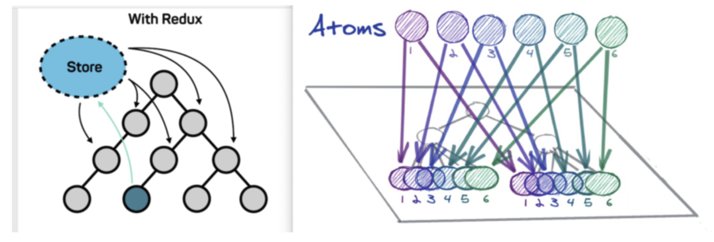

# Installation

```bash
npm install jotai

or

yarn add jotai
```

# Reference Code

Reference code: [GitHub - seungahhong/states-todos](https://github.com/seungahhong/states-todos)

# Explaining Jotai's Concepts and Strengths

- State management overview
  Recent approaches to state management can be broadly divided into three categories.
  - Flux (Redux, Zustand)
    - The commonly used Flux approach, which updates state through a store, action functions, reducers, and so on.
  - Proxy (Mobx, Valtio)
    - An approach that automatically detects and updates the portions of state used by a component.
  - Atomic (Jotai, Recoil)
    - An approach that stores and manages state within the React tree, similar to React's built-in state.
- Jotai concepts
  - Key concepts
    - Minimal API
    - Built-in TypeScript support
    - Small bundle size (3kb)
    - Many additional utilities and official integrations
    - Next.js and React Native support
    - Usable only with React
  - Introduction
    - "Jotai" means "state" in Japanese. The same development group, [Pmndrs](https://pmnd.rs/), also created a state management library called [Zustand](https://github.com/pmndrs/zustand), which means "state" in German.
    - A React-specific state management library built to solve Context's re-rendering problem.
    - In React, to improve on the top-down approach of useContext and useState, it is organized as an atomic state management style similar to Recoil (a bottom-up approach).
      
- Jotai's strengths
  - By default, it reduces re-rendering problems, and it also provides utilities such as selectAtom and splitAtom to further reduce re-rendering.
  - It significantly reduces boilerplate code compared to Redux.
  - It is designed to work well with Suspense (Concurrent mode), a major React feature.
  - Two characteristics that Jotai emphasizes
    - Primitive: An interface similar to useState, React's built-in state function.
    - Flexible: Atoms can combine with one another and participate in each other's state, and it supports smooth integration with other libraries (in particular, it can be linked with Redux for state management).

# Key Features of Jotai

- atom

  - The basic unit for holding data; state is created using an atom.
  - Provides an interface similar to useState (useAtom).

  ```tsx
  // useState
  const [filter, setTodoFilter] = useState(todoListFilterState);

  // get, set hooks
  const [filter, setTodoFilter] = useAtom(todoListFilterState);
  ```

  - Provides extended utilities (useAtomValue, useUpdateAtom, atomWithQuery, and so on).

  ```tsx
  // read-only
  const filterItems = useAtomValue(filteredTodoListState);

  // writable
  const fetchTodoAction = useUpdateAtom(fetchAsyncTodoAction);

  // react-query 통합
  export const fetchAsyncJotaiWithReactQueryTodoAction = atomWithQuery(get => ({
    queryKey: ['users', get(fetchState)],
    queryFn: async ({ queryKey: [, id] }) => {
      const response = await fetchTodo(id);
      return [].concat(response.data);
    },
  }));
  ```

  - Unlike Recoil, there is no need to provide a separate key.

  ```tsx
  // recoil
  export const TodoItemAtom = atom<TodoState>({
    key: 'TodoItemState',
    default: initialState,
  });

  // jotai
  export const TodoItemAtom = atom<TodoState>(initialState);
  ```

  - Declared with atom(InitialValue).

  ```tsx
  export const TodoItemAtom = atom<TodoState>(initialState);
  const [todo, setTodoItemAtom] = useAtom(TodoItemAtom);
  ```

  - atom(initialValue, (get, set, args) => {})

  ```tsx
  // only get
  export const fetchAsyncTodosAction = atom(async get => {
    const response = await fetchTodo();
    return response.data;
  });

  const [todos] = useAtom(fetchAsyncTodosAction);

  // get set
  export const fetchAsyncTodoAction = atom(
    async get => {
      const response = await fetchTodo(get(fetchState));
      return [].concat(response.data);
    },
    (get, set, payload: number) => {
      set(fetchState, payload);
    },
  );

  const [todo, fetchTodoAction] = useAtom(fetchAsyncTodoAction);
  ```

  - selectAtom: for when you only need a part of an atom's value rather than the whole thing.

  ```tsx
  export const todoItemData = selectAtom(TodoItemAtom, todoItem => {
    return todoItem.data;
  });
  ```

- Provider
  An atom's value is not stored in a global atom; instead, it is stored on the component tree, similar to Context. Using a [Provider](https://jotai.org/docs/api/core#provider), you can supply the Context in which atoms are stored. (In other words, if the referenced Provider differs, the same atom will have different values even when used.) If you do not specify a Provider, the default store is used.

  ```tsx
  // 적용 전
  export const TodoItemAtom = atom<TodoState>(initialState);

  const TodoWithProvider = () => {
    const [data, setTodoItemAtom] = useAtom(TodoItemAtom);
    ...
  };

  // 기본 저장소 사용
  const TodoWithProvider = (state: TodoState) => {
    return (
      <TodoItem />
    );
  };

  // Provider 적용 후
  export const TodoItemAtom = atom<TodoState>(initialState);

  const TodoWithProvider = () => {
    const [data, setTodoItemAtom] = useAtom(TodoItemAtom);
    ...
  };

  // Provider 저장소 사용
  const TodoWithProvider = (state: TodoState) => {
    return (
      <Provider
        initialValues={[
          [TodoItemAtom, state],
        ] as Array<[Atom<unknown>, unknown]>}
      >
        <TodoItem />
      </Provider>
    );
  };
  ```

- onMount
  Instead of a fixed value on the atom, you can use onMount to have the value determined at the moment it is first used.
  ```tsx
  export const fetchState = atom<number>(1);
  fetchState.onMount = set => {
    set(2);
  };
  ```
- Combining and splitting atoms

  ```tsx
  import { atom } from 'jotai';

  const orderer_email_atom = atom('');
  const orderer_mobile_tel_atom = atom('');
  const orderer_name_atom = atom('');
  const orderer_atom = atom(get => ({
    email: get(orderer_email_atom),
    mobile_tel: get(orderer_mobile_tel_atom),
    name: get(orderer_name_atom),
  }));
  ```

# Jotai Async

- async atom

  ```tsx
  export const fetchAsyncTodosAction = atom(async (get) => {
    const response = await fetchTodo();
    return response.data;
  });

  export const fetchAsyncTodoAction = atom(
    async (get) => {
      const response = await fetchTodo(get(fetchState));
      return [].concat(response.data);
    },
    (get, set, payload: number) => {
      set(fetchState, payload);
    }
  );

  const fetchCountAtom = atom(
    (get) => get(countAtom),
    async (_get, set, url) => {
      const response = await fetch(url)
      set(countAtom, (await response.json()).count)
    }
  )

  function Controls() {
    const [count, compute] = useAtom(fetchCountAtom)
    return <button onClick={() => compute("http://count.host.com")}>compute</button>
  출처: https://programming119.tistory.com/263 [개발자 아저씨들 힘을모아:티스토리]
  ```

- Suspense support
  ```tsx
  const asyncAtom = atom(async get => get(countAtom) * 2);
  const ComponentUsingAsyncAtoms = () => {
    const [num] = useAtom(asyncAtom);
    // here `num` is always `number` even though asyncAtom returns a Promise
  };
  const App = () => {
    return (
      <Suspense fallback={/* What to show while suspended */}>
        <ComponentUsingAsyncAtoms />
      </Suspense>
    );
  };
  ```
- loadable support

  ```tsx
  /*
  {
      state: 'loading' | 'hasData' | 'hasError',
      data?: any,
      error?: any,
  }
  */

  import { loadable } from "jotai/utils"

  const asyncAtom = atom(async (get) => ...)
  const loadableAtom = loadable(asyncAtom)
  // Does not need to be wrapped by a <Suspense> element
  const Component = () => {
    const value = useAtom(loadableAtom)
    if (value.state === 'hasError') return <Text>{value.error}</Text>
    if (value.state === 'loading') {
      return <Text>Loading...</Text>
    }
    console.log(value.data) // Results of the Promise
    return <Text>Value: {value.data}</Text>
  }
  ```

# Jotai Integration Libraries

- react-query integration

  ```bash
  npm install react-query
  or
  yarn add react-query
  ```

  ```bash
  import { useAtom } from 'jotai'
  import { atomWithQuery, atomWithInfiniteQuery } from 'jotai/query'

  export const fetchAsyncJotaiWithReactQueryTodoAction = atomWithQuery((get) => ({
    queryKey: ["users", get(fetchState)],
    queryFn: async ({ queryKey: [, id] }) => {
      const response = await fetchTodo(id);
      return [].concat(response.data);
    },
  }));

  const idAtom = atom(1)
  const userAtom = atomWithInfiniteQuery((get) => ({
    queryKey: ['users', get(idAtom)],
    queryFn: async ({ queryKey: [, id] }) => {
      const res = await fetch(`https://jsonplaceholder.typicode.com/users/${id}`)
      return res.json()
    },
    // infinite queries can support paginated fetching
    getNextPageParam: (lastPage, pages) => lastPage.nextCursor,
  }))

  const UserData = () => {
    const [data] = useAtom(userAtom)
    return data.pages.map((userData, index) => (
      <div key={index}>{JSON.stringify(userData)}</div>
    ))
  }
  ```

- redux integration
  ```bash
  import { useAtom } from 'jotai'
  import { atomWithStore } from 'jotai/redux'
  import { createStore } from 'redux'
  const initialState = { count: 0 }
  const reducer = (state = initialState, action: { type: 'INC' }) => {
    if (action.type === 'INC') {
      return { ...state, count: state.count + 1 }
    }
    return state
  }
  const store = createStore(reducer)
  const storeAtom = atomWithStore(store)
  const Counter: React.FC = () => {
    const [state, dispatch] = useAtom(storeAtom)
    return (
      <>
        count: {state.count}
        <button onClick={() => dispatch({ type: 'INC' })}>button</button>
      </>
    )
  }
  ```
- Supported libraries
  - immer
  - optics
  - react-query
  - xstate
  - valtio
  - zustand
  - redux

# Personal Opinion

- If you need state management support through multiple stores, this seems like a library well worth using.
- Since Jotai supports many libraries out of the box, it looks easy to use. (That said, check whether each library is fully supported.)
- The syntax itself looks easier than Recoil's state management.
  - Everything is unified into atoms.
  - Not having a unique key also feels convenient.
- Given that several companies have adopted it, it seems to have secured a certain level of stability. (Kakaostyle, Hwahae, and others.)
- It seems like a state management tool worth trying on small-scale, React-tree-based projects.

# References

- [Jotai Recipe](https://devblog.kakaostyle.com/ko/2022-01-13-2-jotai-recipe/)
- [[React🌀] The next-generation state management library, Jotai VS Zustand ⭐ (Feat. Recoil)](https://programming119.tistory.com/263)
- [Atomic state management - Jotai - Hwahae Blog | Tech Blog](http://blog.hwahae.co.kr/all/tech/tech-tech/6099/)
- [A walkthrough of jotai, a library for state management](https://velog.io/@ggong/%EC%83%81%ED%83%9C-%EA%B4%80%EB%A6%AC%EB%A5%BC-%EC%9C%84%ED%95%9C-%EB%9D%BC%EC%9D%B4%EB%B8%8C%EB%9F%AC%EB%A6%AC-jotai)
- [Introduction - Jotai](https://jotai.org/docs/introduction)
