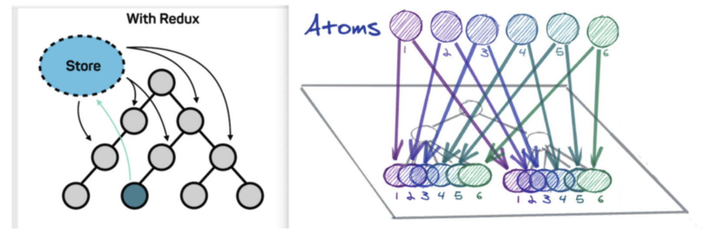

# 설치

```bash
npm install jotai

or

yarn add jotai
```

# 참고코드

참고코드: [GitHub - seungahhong/states-todos](https://github.com/seungahhong/states-todos)

# Jotai 개념, 특장점 설명

- 상태관리 설명
  요즘 상태관리에 대한 접근 방식을 3가지로 나눠서 볼 수 있을 것 같습니다.
  - Flux (Redux, Zustand)
    - 일반적으로 사용하는 Flux 방식으로써, 저장소(store)/액션함수(action)/리듀서 등을 통해서 상태를 업데이트 하는 방식
  - Proxy (Mobx, Valtio)
    - 컴포넌트에 사용되는 일부 상태를 자동으로 감지해서 업데이트 하는 방식
  - Atomic (Jotai, Recoil)
    - React에 사용되는 state와 비슷하게 리액트 트리 안에서 상태를 저장하고 관리하는 방식
- Jotai 개념
  - 주요개념
    - 최소 API
    - TypeScript 내장
    - 작은 번들 크기(3kb)
    - 많은 추가 유틸리티 및 공식 통합
    - Next.js 및 React Native 지원
    - 리액트에서만 사용가능
  - 소개
    - Jotai 일본어로 상태를 뜻하고, 같은 개발 그룹인 [Pmndrs](https://pmnd.rs/)에서 만든 [Zustand](https://github.com/pmndrs/zustand) 라는 상태 관리 라이브러리도 있는데 이는 독일어로 상태를 뜻합니다.
    - Context의 re-rendering 문제를 해결하기 위해 만들어진 React 특화 상태관리 라이브러리
    - 리액트에서는 useContext, useState를 top-down 방식을 개선하기 위해서, Recoil과 비슷한게 atomic한 상태관리 방식으로 구성됨(bottom-up 방식)
      
- Jotai 특장점
  - 기본적으로 re-rendering 문제를 줄여주고,selectAtom,splitAtom 과 같은 re-rendering 을 줄이기 위한 유틸들도 지원한다.
  - 보일러 플레이트 코드가 redux에 비하면 현저하게 줄어든다.
  - React 의 주요 feature일 Suspense(Concurrent mode)를 적용하는데에 적합하게 설계
  - Jotai 가 강조하는 두가지 특징
    - Primitive: 리액트 기본 state 함수인 useState 와 유사한 인터페이스
    - Flexible: atom들끼리 서로 결합 및 상태에 관여할 수 있고, 다른 라이브러리들과 원할한 결합을 지원(특히, redux와 상태관리 연동 가능)

# Jotai 주요 특징

- atom

  - 데이터를 보관하는 기본단위로써 atom을 이용해서 state를 생성
  - useState와 유사한 인터페이스를 제공(useAtom)

  ```tsx
  // useState
  const [filter, setTodoFilter] = useState(todoListFilterState);

  // get, set hooks
  const [filter, setTodoFilter] = useAtom(todoListFilterState);
  ```

  - 확장 유틸들을 제공(useAtomValue, useUpdateAtom, atomWithQuery 등등)

  ```tsx
  // read-only
  const filterItems = useAtomValue(filteredTodoListState);

  // writable
  const fetchTodoAction = useUpdateAtom(fetchAsyncTodoAction);

  // react-query 통합
  export const fetchAsyncJotaiWithReactQueryTodoAction = atomWithQuery(get => ({
    queryKey: ['users', get(fetchState)],
    queryFn: async ({ queryKey: [, id] }) => {
      const response = await fetchTodo(id);
      return [].concat(response.data);
    },
  }));
  ```

  - recoil 과 다르게 따로 키를 넣어줄 필요없음.

  ```tsx
  // recoil
  export const TodoItemAtom = atom<TodoState>({
    key: 'TodoItemState',
    default: initialState,
  });

  // jotai
  export const TodoItemAtom = atom<TodoState>(initialState);
  ```

  - atom(InitialValue) 로 선언

  ```tsx
  export const TodoItemAtom = atom<TodoState>(initialState);
  const [todo, setTodoItemAtom] = useAtom(TodoItemAtom);
  ```

  - atom(initialValue, (get, set, args) => {})

  ```tsx
  // only get
  export const fetchAsyncTodosAction = atom(async get => {
    const response = await fetchTodo();
    return response.data;
  });

  const [todos] = useAtom(fetchAsyncTodosAction);

  // get set
  export const fetchAsyncTodoAction = atom(
    async get => {
      const response = await fetchTodo(get(fetchState));
      return [].concat(response.data);
    },
    (get, set, payload: number) => {
      set(fetchState, payload);
    },
  );

  const [todo, fetchTodoAction] = useAtom(fetchAsyncTodoAction);
  ```

  - selectAtom: atom의 전체 값만이 아닌 일부가 필요한 경우

  ```tsx
  export const todoItemData = selectAtom(TodoItemAtom, todoItem => {
    return todoItem.data;
  });
  ```

- Provider
  atom의 값은 글로벌에 존재하는 atom에 저장되는 것이 아니라 Context와 비슷하게 컴포넌트 트리 상에 저장됩니다 . [Provider](https://jotai.org/docs/api/core#provider)를 사용하면 atom이 저장될 Context를 제공할 수 있습니다. (즉 참조하는 Provider가 다르면 같은 atom을 use해도 값이 다릅니다) Provider를 지정하지 않으면 기본 저장소가 사용됩니다.

  ```tsx
  // 적용 전
  export const TodoItemAtom = atom<TodoState>(initialState);

  const TodoWithProvider = () => {
    const [data, setTodoItemAtom] = useAtom(TodoItemAtom);
    ...
  };

  // 기본 저장소 사용
  const TodoWithProvider = (state: TodoState) => {
    return (
      <TodoItem />
    );
  };

  // Provider 적용 후
  export const TodoItemAtom = atom<TodoState>(initialState);

  const TodoWithProvider = () => {
    const [data, setTodoItemAtom] = useAtom(TodoItemAtom);
    ...
  };

  // Provider 저장소 사용
  const TodoWithProvider = (state: TodoState) => {
    return (
      <Provider
        initialValues={[
          [TodoItemAtom, state],
        ] as Array<[Atom<unknown>, unknown]>}
      >
        <TodoItem />
      </Provider>
    );
  };
  ```

- onMount
  atom에 고정된 값 대신에 처음 사용되는 시점에 값이 정해지도록 하기 위해서 onMount 사용가능
  ```tsx
  export const fetchState = atom<number>(1);
  fetchState.onMount = set => {
    set(2);
  };
  ```
- atom 조합 및 분리

  ```tsx
  import { atom } from 'jotai';

  const orderer_email_atom = atom('');
  const orderer_mobile_tel_atom = atom('');
  const orderer_name_atom = atom('');
  const orderer_atom = atom(get => ({
    email: get(orderer_email_atom),
    mobile_tel: get(orderer_mobile_tel_atom),
    name: get(orderer_name_atom),
  }));
  ```

# Jotai 비동기

- async atom

  ```tsx
  export const fetchAsyncTodosAction = atom(async (get) => {
    const response = await fetchTodo();
    return response.data;
  });

  export const fetchAsyncTodoAction = atom(
    async (get) => {
      const response = await fetchTodo(get(fetchState));
      return [].concat(response.data);
    },
    (get, set, payload: number) => {
      set(fetchState, payload);
    }
  );

  const fetchCountAtom = atom(
    (get) => get(countAtom),
    async (_get, set, url) => {
      const response = await fetch(url)
      set(countAtom, (await response.json()).count)
    }
  )

  function Controls() {
    const [count, compute] = useAtom(fetchCountAtom)
    return <button onClick={() => compute("http://count.host.com")}>compute</button>
  출처: https://programming119.tistory.com/263 [개발자 아저씨들 힘을모아:티스토리]
  ```

- suspend 지원
  ```tsx
  const asyncAtom = atom(async get => get(countAtom) * 2);
  const ComponentUsingAsyncAtoms = () => {
    const [num] = useAtom(asyncAtom);
    // here `num` is always `number` even though asyncAtom returns a Promise
  };
  const App = () => {
    return (
      <Suspense fallback={/* What to show while suspended */}>
        <ComponentUsingAsyncAtoms />
      </Suspense>
    );
  };
  ```
- lodable 지원

  ```tsx
  /*
  {
      state: 'loading' | 'hasData' | 'hasError',
      data?: any,
      error?: any,
  }
  */

  import { loadable } from "jotai/utils"

  const asyncAtom = atom(async (get) => ...)
  const loadableAtom = loadable(asyncAtom)
  // Does not need to be wrapped by a <Suspense> element
  const Component = () => {
    const value = useAtom(loadableAtom)
    if (value.state === 'hasError') return <Text>{value.error}</Text>
    if (value.state === 'loading') {
      return <Text>Loading...</Text>
    }
    console.log(value.data) // Results of the Promise
    return <Text>Value: {value.data}</Text>
  }
  ```

# Jotai 통합 라이브러리

- react-query 통합

  ```bash
  npm install react-query
  or
  yarn add react-query
  ```

  ```bash
  import { useAtom } from 'jotai'
  import { atomWithQuery, atomWithInfiniteQuery } from 'jotai/query'

  export const fetchAsyncJotaiWithReactQueryTodoAction = atomWithQuery((get) => ({
    queryKey: ["users", get(fetchState)],
    queryFn: async ({ queryKey: [, id] }) => {
      const response = await fetchTodo(id);
      return [].concat(response.data);
    },
  }));

  const idAtom = atom(1)
  const userAtom = atomWithInfiniteQuery((get) => ({
    queryKey: ['users', get(idAtom)],
    queryFn: async ({ queryKey: [, id] }) => {
      const res = await fetch(`https://jsonplaceholder.typicode.com/users/${id}`)
      return res.json()
    },
    // infinite queries can support paginated fetching
    getNextPageParam: (lastPage, pages) => lastPage.nextCursor,
  }))

  const UserData = () => {
    const [data] = useAtom(userAtom)
    return data.pages.map((userData, index) => (
      <div key={index}>{JSON.stringify(userData)}</div>
    ))
  }
  ```

- redux 통합
  ```bash
  import { useAtom } from 'jotai'
  import { atomWithStore } from 'jotai/redux'
  import { createStore } from 'redux'
  const initialState = { count: 0 }
  const reducer = (state = initialState, action: { type: 'INC' }) => {
    if (action.type === 'INC') {
      return { ...state, count: state.count + 1 }
    }
    return state
  }
  const store = createStore(reducer)
  const storeAtom = atomWithStore(store)
  const Counter: React.FC = () => {
    const [state, dispatch] = useAtom(storeAtom)
    return (
      <>
        count: {state.count}
        <button onClick={() => dispatch({ type: 'INC' })}>button</button>
      </>
    )
  }
  ```
- 지원하는 라이브러리
  - immer
  - optics
  - react-query
  - xstate
  - valtio
  - zustand
  - redux

# 개인의견

- 멀티 스토어를 통해서 상태관리를 지원이 필요하다면 충분히 사용해도 좋을 라이브러리 같다.
- Jotai 자체에서 지원하는 라이브러리가 많아서 쉽게 사용이 가능할 것 같다.(단, 라이브러리 풀지원이 되는지 여부 확인)
- recoil 상태관리보다는 문법 자체가 쉬워 보인다.
  - 모든 단위를 atom으로 통일
  - unique key가 없는것도 편하게 느껴짐
- 여러 회사에서 적용을 해본것으로 보아서 어느정도 안정성은 확보된 것 같습니다.(카카오스타일, 화해 등등)
- 리액트 트리기반의 소규모 프로젝트에 적용해볼만한 상태관리 툴인 것 같습니다.

# 참고페이지

- [Jotai 레시피](https://devblog.kakaostyle.com/ko/2022-01-13-2-jotai-recipe/)
- [[React🌀] 차세대 상태관리 라이브러리, Jotai VS Zustand ⭐ (Feat. Recoil)](https://programming119.tistory.com/263)
- [Atomic state management - Jotai - 화해 블로그 | 기술 블로그](http://blog.hwahae.co.kr/all/tech/tech-tech/6099/)
- [상태 관리를 위한 라이브러리 jotai 훑어보기](https://velog.io/@ggong/%EC%83%81%ED%83%9C-%EA%B4%80%EB%A6%AC%EB%A5%BC-%EC%9C%84%ED%95%9C-%EB%9D%BC%EC%9D%B4%EB%B8%8C%EB%9F%AC%EB%A6%AC-jotai)
- [Introduction - Jotai](https://jotai.org/docs/introduction)
