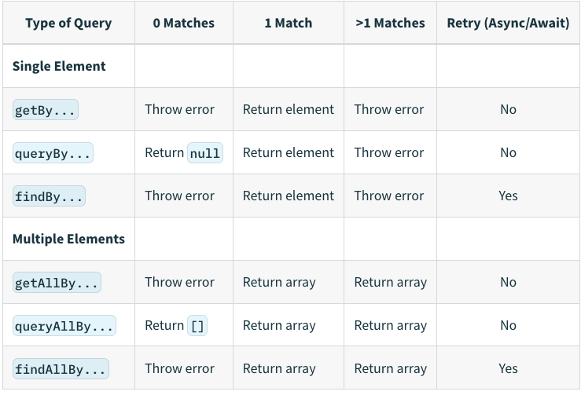

# Basic Usage

<p style="font-size: 25px; font-weight: bold;">react testing library</p>

- Installation

  ```bash
  npm install --save-dev @testing-library/react
  or
  yarn add -D @testing-library/react
  ```

- Things to watch out for when using it

Reference URLs

[https://seongry.github.io/2021/06-20-common-mistakes-with-rty/](https://seongry.github.io/2021/06-20-common-mistakes-with-rty/)
[Common mistakes with React Testing Library](https://kentcdodds.com/blog/common-mistakes-with-react-testing-library)

- destructure what you need from render or call it view.

  ```tsx
  // ❌
  const wrapper = render(<Example prop="1" />);
  wrapper.rerender(<Example prop="2" />);

  // ✅
  const { rerender } = render(<Example prop="1" />);
  rerender(<Example prop="2" />);
  ```

- automatically Cleanup

  ```tsx
  // ❌
  import { render, screen, cleanup } from '@testing-library/react';

  afterEach(cleanup);

  // ✅
  import { render, screen } from '@testing-library/react';
  ```

  Most major frameworks (mocha, Jest, and Jasmine) call the cleanup function automatically, so there is no need to call the cleanup function for each test yourself.

- Use screen

  ```tsx
  // ❌ The number of utilities you need to pull out can grow.
  const { getByRole } = render(<Example />);
  const errorMessageNode = getByRole('alert');

  // ✅ No extra code is added even when you need more utilities.
  render(<Example />);
  const errorMessageNode = screen.getByRole('alert');

  // Call screen.debug instead of the debug function.
  screen.debug() => shows the element structure
  ```

  React Testing Library supports two ways of accessing methods:

  1. Importing the methods
  2. Referencing them from the screen object
     When you use screen, you can access element properties without destructuring, so you always get the latest state when elements are added, removed, or updated.

- Use the correct assertion method with expect

  ```tsx
  const button = screen.screen.getByTestId('button');

  // ❌
  expect(button.disabled).toBe(true);
  // error message:
  //  expect(received).toBe(expected) // Object.is equality
  //
  //  Expected: true
  //  Received: false
  // ✅
  expect(button).toBeDisabled();
  // error message:
  //   Received element is not disabled:
  //     <button />
  ```

  As shown in the code above, when the method following expect is more specific, it produces an error message that makes debugging much easier. Use precise assertion methods to make debugging smoother.

- Avoid using getByText

  ```tsx
  <button data-testid="helloWorld">Hello World</button>;
  // 1. Wrong! 😓
  screen.getByText(/hello world/i);

  // 2. Best! 😄
  screen.getByTestId('helloWorld');
  ```

- Be careful when using fireEvent
  ```tsx
  // ❌
  fireEvent.change(input, { target: { value: 'hello world' } });
  // ✅
  userEvent.type(input, 'hello world');
  ```
  fireEvent is configured as a method that is closer to user behavior, so it fires when the input event changes (keyDown, keyPress, keyUp), which can be confusing from a developer's perspective.
  Unlike fireEvent, the userEvent method is invoked according to the characteristics of the event, so you should use userEvent for smoother debugging.
- find has waitFor built in

  ```tsx
  // ❌
  const submitButton = await waitFor(() =>
    screen.screen.getByTestId('submit');
  )

  // ✅
  const submitButton = await screen.findByTestId('submit');
  ```

  All methods composed with find have waitFor built in. Keep this in mind when using find or waitFor.

- Wrapping things in act unnecessarily
  render and fireEvent already wrap act internally, so there is no need to use it unnecessarily.
  act is a method that is called when you manually update the DOM after changing state.

  ```tsx
  / ❌
  act(() => {
    render(<Example />)
  })

  const input = screen.getByRole('textbox', {name: /choose a fruit/i})
  act(() => {
    fireEvent.keyDown(input, {key: 'ArrowDown'})
  })

  // ✅
  render(<Example />)
  const input = screen.getByRole('textbox', {name: /choose a fruit/i})
  fireEvent.keyDown(input, {key: 'ArrowDown'})
  ```

- Improving incorrect query usage
  Query as closely as possible to the user's flow

  ```
  // ❌
  // assuming you've got this DOM to work with:
  // <label>Username</label><input data-testid="username" />
  screen.getByTestId('username')

  // ✅
  // change the DOM to be accessible by associating the label and setting the type
  // <label for="username">Username</label><input id="username" type="text" />
  screen.getByRole('textbox', {name: /username/i})
  ```

  Avoid querying elements using container/querySelector

  ```
  // ❌
  const { container } = render(<Example />);
  const button = container.querySelector(".btn-primary");
  expect(button).toHaveTextContent(/click me/i);
  // ✅
  render(<Example />);
  screen.getByRole("button", { name: /click me/i });
  ```

  → Use the query function that fits your purpose

- Do not add unnecessary accessibility attributes

  ```jsx
  // ❌
  render(<button role="button">Click me</button>);

  // ✅
  // A button element has role="button" by default, so don't add role="button"
  render(<button>Click me</button>);
  ```

- Do not use query\* statements except to check for a non-existent element

  ```jsx
  // ❌
  expect(screen.queryByRole('alert')).toBeInTheDocument();

  // ✅
  expect(screen.getByRole('alert')).toBeInTheDocument();
  expect(screen.queryByRole('alert')).not.toBeInTheDocument();
  ```

- Query

  - query vs get vs find
    **query**
    - queryBy searches for a single matching element. It first finds all elements with querySelectorAll, returning null if none exist, or the first element of the node list if there is one. If there are two or more, it throws an error.
    - queryAllBy searches for all matching elements. It returns the result of querySelectorAll as is.
      **get**
    - getBy searches for a single matching element. It first finds all elements with querySelectorAll and returns the first element of the node list if there is one. If there are none or two or more, it throws an error.
    - getAllBy searches for all matching elements. It returns the result of querySelectorAll as is. If no matching element exists, it throws an error.
      **find**
      It is identical to the get type except that it returns a Promise. It wraps the [waitFor](https://testing-library.com/docs/dom-testing-library/api-async/#waitfor) method, so it retries the search until it no longer throws an error.
      **When should you use each one?**
      Since query does not throw an error even when the element does not exist, it is well suited for checking whether an element exists. I would suggest using get as the default option, and using find when you need to wait until an element is rendered.
      
  - Query priority
    - Priority among queries for testing visual elements / user interactions
      - getByRole > getByLabelText > getByPlaceholderText > getByText > getByDisplayValue
    - Priority among queries for testing HTML5 and ARIA attributes
      - getByAltText > getByTitle
    - Test ID: use only to search for values that cannot be found with the queries above
      - getByTestId
        [https://testing-library.com/docs/queries/about/#priority](https://testing-library.com/docs/queries/about/#priority)
  - ByRole
    - API: getByRole, queryByRole, getAllByRole, queryAllByRole, findByRole, findAllByRole
    - Description
      - Used to get an element with a role from the DOM
      - You can get the DOM using a key value that matches the aria-role meaning in web accessibility.
    - Reference URLs
      - [https://testing-library.com/docs/queries/byrole](https://testing-library.com/docs/queries/byrole)
      - A summary of commonly used roles: [https://www.w3.org/TR/html-aria/#sotd](https://www.w3.org/TR/html-aria/#sotd)
        [Untitled](https://www.notion.so/480e494982234b839e945e225b4642dc)
  - ByLabelText

    - API: getByLabelText, queryByLabelText, getAllByLabelText, queryAllByLabelText, findByLabelText, findAllByLabelText
    - Description
      - Used to get an element that matches a label element and aria-label\* text
    - Reference URLs
      - [https://testing-library.com/docs/queries/bylabeltext](https://testing-library.com/docs/queries/bylabeltext)

    ```jsx
    // for/htmlFor relationship between label and form element id
    <label for="username-input">Username</label>
    <input id="username-input" />

    // The aria-labelledby attribute with form elements
    <label id="username-label">Username</label>
    <input aria-labelledby="username-label" />

    // Wrapper labels
    <label>Username <input /></label>

    // Wrapper labels where the label text is in another child element
    <label>
      <span>Username</span>
      <input />
    </label>

    // aria-label attributes
    // Take care because this is not a label that users can see on the page,
    // so the purpose of your input must be obvious to visual users.
    <input aria-label="Username" />
    ```

  - ByText

    - API: getByText, queryByText, getAllByText, queryAllByText, findByText, findAllByText
    - Description
      - Used to get an element whose text value matches, across all elements
    - Reference URLs
      - [https://testing-library.com/docs/queries/bytext](https://testing-library.com/docs/queries/bytext)

    ```jsx
    <a href="/about">About ℹ️</a>
    // type: submit or button
    <input type="submit" value="Send data" />

    const aboutAnchorNode = screen.getByText(/about/i);
    ```

  - ByDisplayValue

    - API: getByDisplayValue, queryByDisplayValue, getAllByDisplayValue, queryAllByDisplayValue, findByDisplayValue, findAllByDisplayValue
    - Description
      - Used to get an input, textarea, or select element whose displayed value matches
    - Reference URLs
      - [https://testing-library.com/docs/queries/bydisplayvalue](https://testing-library.com/docs/queries/bydisplayvalue)

    ```jsx
    <input type="text" id="lastName" />;
    document.getElementById('lastName').value = 'Norris';

    const lastNameInput = screen.getByDisplayValue('Norris');
    ```

  - ByTestId

    - API: getByTestId, queryByTestId, getAllByTestId, queryAllByTestId, findByTestId, findAllByTestId
    - Description
      - Used to get an element whose title attribute value matches, across all elements
      - It is recommended to use testid only when other queries do not work.
    - Reference URLs
      - [https://testing-library.com/docs/queries/bytitle](https://testing-library.com/docs/queries/bytitle)

    ```
    <div data-testid="custom-element" />

    const element = screen.getByTestId('custom-element');
    ```

  - ByPlaceholderText

    - API: getByPlaceholderText, queryByPlaceholderText, getAllByPlaceholderText, queryAllByPlaceholderText, findByPlaceholderText, findAllByPlaceholderText
    - Description
      - Used to get an element whose placeholder attribute value matches, across all elements
    - Reference URLs
      - [https://testing-library.com/docs/queries/byplaceholdertext](https://testing-library.com/docs/queries/byplaceholdertext)

    ```
    <input placeholder="Username" />

    const inputNode = screen.getByPlaceholderText('Username');
    ```

  - ByAltText

    - API: getByAltText, queryByAltText, getAllByAltText, queryAllByAltText, findByAltText, findAllByAltText
    - Description
      - Used to get an image element whose alt attribute value matches
    - Reference URLs
      - [https://testing-library.com/docs/queries/byalttext](https://testing-library.com/docs/queries/byalttext)

    ```
    

    const incrediblesPosterImg = screen.getByAltText(/incredibles.*? poster/i);
    ```

<p style="font-size: 25px; font-weight: bold;">Jest Expect</p>

- .toBe(value)
  Use toBe to compare primitive values or to check the reference ID of an Object instance (**shallow compare**).

  ```tsx
  const can = {
    name: 'pamplemousse',
    ounces: 12,
  };

  describe('the can', () => {
    test('has 12 ounces', () => {
      expect(can.ounces).toBe(12);
    });

    test('has a sophisticated name', () => {
      expect(can.name).toBe('pamplemousse');
    });
  });

  test('toBe checks whether obj points to the same object', () => {
    const obj = {};
    expect(obj).toBe(obj); // true
  });

  test('even if the object contents are the same, they are in different memory locations, so toBe returns false.', () => {
    expect({ name: 'John' }).toBe({ name: 'John' }); // false
  });
  ```

- .toEqual(value)
  It can recursively compare all properties of an object instance.

  ```tsx
  const can1 = {
    flavor: 'grapefruit',
    ounces: 12,
  };
  const can2 = {
    flavor: 'grapefruit',
    ounces: 12,
  };

  describe('the La Croix cans on my desk', () => {
    test('have all the same properties', () => {
      expect(can1).toEqual(can2);
    });
    test('are not the exact same can', () => {
      expect(can1).not.toBe(can2);
    });
  });

  test('instead, to check whether the object contents are the same, you should use toEqual', () => {
    const obj = {};
    expect({ name: 'John' }).toEqual({ name: 'John' }); // true
  });
  ```

- .toBeNull(), toBeUndefined()
  .toBeNull() is the same as .toBe(null), but the error message is a bit nicer. So use .toBeNull() to check whether something is null.
  .toBeUndefined() is the same as .toBeUndefined(null), but the error message is a bit nicer. So use .toBeUndefined() to check whether something is undefined.

  ```tsx
  function bloop() {
    return null;
  }

  test('bloop returns null', () => {
    expect(bloop()).toBeNull();
  });

  test('the best drink for octopus flavor is undefined', () => {
    expect(bestDrinkForFlavor('octopus')).toBeUndefined();
  });
  ```

- .toBeTruthy(), .toBeFalsy()
  .toBeTruthy() is the opposite of .toBeFalsy, and is used to check whether a value is true in a boolean context, regardless of what the value is.
  As a loosely typed language, JavaScript does not treat true/false as only the boolean type. The number 1 is treated as true and the number 0 as false, and when you want to check that loosely typed behavior, you can use toBeTruthy and toBeFalsy.
  ```tsx
  test('number 0 is falsy but string 0 is truthy', () => {
    expect(0).toBeFalsy();
    expect('0').toBeTruthy();
  });
  ```
- .toHaveLength(number)
  .toHaveLength can check whether an object has a .length property set to a specific numeric value.
  ```tsx
  expect([1, 2, 3]).toHaveLength(3);
  expect('abc').toHaveLength(3);
  expect('').not.toHaveLength(5);
  ```
- .toHaveProperty(keyPath, value?)
  .toHaveProperty can be used to test whether a property at the referenced keyPath exists within an object.
  To compare a specific received value, you can optionally provide the value argument.

  ```tsx
  // Object containing house features to be tested
  const houseForSale = {
    bath: true,
    bedrooms: 4,
    kitchen: {
      amenities: ['oven', 'stove', 'washer'],
      area: 20,
      wallColor: 'white',
      'nice.oven': true,
    },
    livingroom: {
      amenities: [
        {
          couch: [
            ['large', { dimensions: [20, 20] }],
            ['small', { dimensions: [10, 10] }],
          ],
        },
      ],
    },
    'ceiling.height': 2,
  };

  test('this house has my desired features', () => {
    // Example Referencing
    expect(houseForSale).toHaveProperty('bath');
    expect(houseForSale).toHaveProperty('bedrooms', 4);

    expect(houseForSale).not.toHaveProperty('pool');

    // Deep referencing using dot notation
    expect(houseForSale).toHaveProperty('kitchen.area', 20);
    expect(houseForSale).toHaveProperty('kitchen.amenities', [
      'oven',
      'stove',
      'washer',
    ]);

    expect(houseForSale).not.toHaveProperty('kitchen.open');

    // Deep referencing using an array containing the keyPath
    expect(houseForSale).toHaveProperty(['kitchen', 'area'], 20);
    expect(houseForSale).toHaveProperty(
      ['kitchen', 'amenities'],
      ['oven', 'stove', 'washer'],
    );
    expect(houseForSale).toHaveProperty(['kitchen', 'amenities', 0], 'oven');
    expect(houseForSale).toHaveProperty(
      'livingroom.amenities[0].couch[0][1].dimensions[0]',
      20,
    );
    expect(houseForSale).toHaveProperty(['kitchen', 'nice.oven']);
    expect(houseForSale).not.toHaveProperty(['kitchen', 'open']);

    // Referencing keys with dot in the key itself
    expect(houseForSale).toHaveProperty(['ceiling.height'], 'tall');
  });
  ```

- .toHaveBeenCalled()
  .toHaveBeenCalled() can check whether a mock function was called.

  ```tsx
  function drinkAll(callback, flavour) {
    if (flavour !== 'octopus') {
      callback(flavour);
    }
  }

  describe('drinkAll', () => {
    test('drinks something lemon-flavoured', () => {
      const drink = jest.fn();
      drinkAll(drink, 'lemon');
      expect(drink).toHaveBeenCalled(); // check whether the drink mock function was called (callback)
    });

    test('does not drink something octopus-flavoured', () => {
      const drink = jest.fn();
      drinkAll(drink, 'octopus');
      expect(drink).not.toHaveBeenCalled(); // check whether the drink mock function was called (callback)
    });
  });
  ```

- .arrayContaining(array)
  .arrayContaining(array) determines whether the received array contains the elements of the expected array.
  In other words, the expected array is a subset of the received array.
  ```tsx
  describe('arrayContaining', () => {
    const expected = ['Alice', 'Bob'];
    it('matches even if received contains additional elements', () => {
      expect(['Alice', 'Bob', 'Eve']).toEqual(expect.arrayContaining(expected));
    });
    it('does not match if received does not contain expected elements', () => {
      expect(['Bob', 'Eve']).not.toEqual(expect.arrayContaining(expected));
    });
  });
  ```
- .toContain
  - Used when you need to check whether an array contains an item
  ```tsx
  test('the flavor list contains lime', () => {
    expect(['lime', 'mangle']).toContain('lime');
  });
  ```
  - Used when you need to check whether a received string contains the expected string
  ```tsx
  test('the flavor list contains lime', () => {
    expect('lime juice').toContain('lime');
  });
  ```
- .toBeInTheDocument
  Used to check whether the element is present in the document

  ```tsx
  import { render, screen } from '@testing-library/react';
  import App from './App';

  test('renders learn react link', () => {
    render(<App />);
    const linkElement = screen.getByText(/learn react/i);
    expect(linkElement).toBeInTheDocument();
  });
  ```

- .toBeCalledTimes
  Used to check how many times a mock function was called

  ```tsx
  const mockFn = jest.fn();

  mockFn(10, 20);
  mockFn();
  mockFn(30, 40);

  test('called at least once?', () => {
    expect(mockFn).toBeCalled();
  });

  test('called exactly 3 times?', () => {
    expect(mockFn).toBeCalledTimes(3);
  });

  test('is there a function that received 10 and 20 as arguments', () => {
    expect(mockFn).toBeCalledWith(10, 20);
  });

  test('did the last call receive 30 and 40?', () => {
    expect(mockFn).lastCalledWith(30, 40);
  });
  ```

- .toMatchSnapshot
  Used when you need file snapshot testing support
  After the test completes, a **snapshots** directory is created, and a repeat.test.js.snap file is created inside it.

  ```tsx
  import repeat from './repeat';

  test('repeats words three times', () => {
    expect(repeat('Test', 3)).toMatchSnapshot();
  });
  ```

- .toHaveTextContent
  Used when you need to compare the text of an element

  ```tsx
  import React from 'react';
  import App from '../App';
  import { fireEvent, render } from '@testing-library/react';

  describe('<App /> test', () => {
    it('matches snapshopt', () => {
      const utils = render(<App />);
      expect(utils.container).toMatchSnapshot(); // snapshot match
    });

    it('screen test', () => {
      const utils = render(<App />);

      const h2 = utils.container.querySelector('h2'); // get the h2 tag DOM
      h2 && expect(h2.innerHTML).toBe('Hello. Jest!!'); // test whether the h2 innerHTML is Hello, Jest!!
    });

    it('button test', () => {
      const utils = render(<App />);

      const str = utils.getByText('number: 0'); // get the DOM whose text is number: 0
      const increaseButton = utils.getByText('증가'); // get the DOM whose text is 증가 (increase)
      const decreaseButton = utils.getByText('감소'); // get the DOM whose text is 감소 (decrease)

      fireEvent.click(increaseButton); // fire the increase button click event
      fireEvent.click(increaseButton); // fire the increase button click event
      expect(str).toHaveTextContent('number: 6'); // check whether str's text is number: 6

      fireEvent.click(decreaseButton); // fire the decrease button click event
      fireEvent.click(decreaseButton); // fire the decrease button click event
      expect(str).toHaveTextContent('number: 2'); // check whether str's text is number: 2
    });
  });
  ```

- .toBeDisabled
  Used to check whether an element is disabled
  ```tsx
  expect(screen.getByRole('button')).toHaveTextContent('대기중');
  expect(screen.getByRole('button')).toBeDisabled();
  ```
- .toBeCalled
  Used to check whether a function was called

  ```tsx
  fireEvent.click(screen.getByTestId('app-install-modal-close-button'));

  // Then
  expect(onClose).toBeCalled();
  ```

- .toBeRequired
  Used to check whether an element has the required or aria-required="true" attribute
  ```tsx
  // example
  <input data-testid="required-input" required />
  <input data-testid="aria-required-input" aria-required="true" />
  <input data-testid="conflicted-input" required aria-required="false" />
  <input data-testid="aria-not-required-input" aria-required="false" />
  <input data-testid="optional-input" />
  <input data-testid="unsupported-type" type="image" required />
  <select data-testid="select" required></select>
  <textarea data-testid="textarea" required></textarea>
  <div data-testid="supported-role" role="tree" required></div>
  <div data-testid="supported-role-aria" role="tree" aria-required="true"></div>
  ```
  ```tsx
  expect(
    document.querySelector('[data-testid="required-input"]'),
  ).toBeRequired();
  expect(
    document.querySelector('[data-testid="aria-required-input"]'),
  ).toBeRequired();
  expect(
    document.querySelector('[data-testid="conflicted-input"]'),
  ).toBeRequired();
  expect(
    document.querySelector('[data-testid="aria-not-required-input"]'),
  ).not.toBeRequired();
  expect(
    document.querySelector('[data-testid="unsupported-type"]'),
  ).not.toBeRequired();
  expect(document.querySelector('[data-testid="select"]')).toBeRequired();
  expect(document.querySelector('[data-testid="textarea"]')).toBeRequired();
  expect(
    document.querySelector('[data-testid="supported-role"]'),
  ).not.toBeRequired();
  expect(
    document.querySelector('[data-testid="supported-role-aria"]'),
  ).toBeRequired();
  ```
- .toBeGreaterThan(number | bigint)
  Used to check whether the expected data is a number greater than the received data

  ```tsx
  test('ounces per can is more than 10', () => {
    expect(ouncesPerCan()).toBeGreaterThan(10); // test whether ouncesPerCan() returns a value of more than 10 ounces
  });
  ```

<p style="font-size: 25px; font-weight: bold;">User Event</p>

package: @testing-library/user-event

- Installation
  ```bash
  npm install --save-dev @testing-library/user-event
  or
  yarn add -D @testing-library/user-event
  ```
- API

  - click(element, eventInit, options)

    ```tsx
    import React from 'react';
    import { render, screen } from '@testing-library/react';
    import userEvent from '@testing-library/user-event';

    test('click', () => {
      render(
        <div>
          <label htmlFor="checkbox">Check</label>
          <input id="checkbox" type="checkbox" />
        </div>,
      );

      userEvent.click(screen.getByText('Check'));
      expect(screen.getByLabelText('Check')).toBeChecked();
    });

    userEvent.click(elem, { ctrlKey: true, shiftKey: true });
    userEvent.click(elem, undefined, { skipPointerEventsCheck: true });
    ```

  - type(element, text, [options])

    - Used to add text into an input or textarea element

    ```tsx
    import React from 'react';
    import { render, screen } from '@testing-library/react';
    import userEvent from '@testing-library/user-event';

    test('type', () => {
      render(<textarea />);

      userEvent.type(screen.getByRole('textbox'), 'Hello,{enter}World!');
      expect(screen.getByRole('textbox')).toHaveValue('Hello,\nWorld!');
    });
    ```

  - clear(element)

    - Used to delete the text value of the currently selected input/textarea element

    ```tsx
    import React from 'react';
    import { render, screen } from '@testing-library/react';
    import userEvent from '@testing-library/user-event';

    test('clear', () => {
      render(<textarea defaultValue="Hello, World!" />);

      userEvent.clear(screen.getByRole('textbox'));
      expect(screen.getByRole('textbox')).toHaveValue('');
    });
    ```

  - dblClick(element, eventInit, options)

    ```jsx
    import React from 'react';
    import { render, screen } from '@testing-library/react';
    import userEvent from '@testing-library/user-event';

    test('double click', () => {
      const onChange = jest.fn();
      render(<input type="checkbox" onChange={onChange} />);
      const checkbox = screen.getByRole('checkbox');
      userEvent.dblClick(checkbox);
      expect(onChange).toHaveBeenCalledTimes(2);
      expect(checkbox).not.toBeChecked();
    });
    ```

  - selectOptions(element, values, options) / deselectOptions(element, values, options)

    ```tsx
    import React from 'react';
    import { render, screen } from '@testing-library/react';
    import userEvent from '@testing-library/user-event';

    test('selectOptions', () => {
      render(
        <select multiple>
          <option value="1">A</option>
          <option value="2">B</option>
          <option value="3">C</option>
        </select>,
      );

      userEvent.selectOptions(screen.getByRole('listbox'), ['1', '3']);

      expect(screen.getByRole('option', { name: 'A' }).selected).toBe(true);
      expect(screen.getByRole('option', { name: 'B' }).selected).toBe(false);
      expect(screen.getByRole('option', { name: 'C' }).selected).toBe(true);

      userEvent.selectOptions(screen.getByRole('listbox'), '2');
      expect(screen.getByText('B').selected).toBe(true);
      userEvent.deselectOptions(screen.getByRole('listbox'), '2');
      expect(screen.getByText('B').selected).toBe(false);
    });
    ```

  - tab({shift, focusTrap})

    - Fires a tab event just like the browser to change the activeElement.

    ```tsx
    import React from 'react';
    import { render, screen } from '@testing-library/react';
    import '@testing-library/jest-dom';
    import userEvent from '@testing-library/user-event';

    it('should cycle elements in document tab order', () => {
      render(
        <div>
          <input data-testid="element" type="checkbox" />
          <input data-testid="element" type="radio" />
          <input data-testid="element" type="number" />
        </div>,
      );

      const [checkbox, radio, number] = screen.getAllByTestId('element');

      expect(document.body).toHaveFocus();

      userEvent.tab();

      expect(checkbox).toHaveFocus();

      userEvent.tab();

      expect(radio).toHaveFocus();

      userEvent.tab();

      expect(number).toHaveFocus();

      userEvent.tab();

      // cycle goes back to the body element
      expect(document.body).toHaveFocus();

      userEvent.tab();

      expect(checkbox).toHaveFocus();
    });
    ```

  - hover(element, options) / unhover(element, options)

        ```tsx
        import React from 'react';
        import { render, screen } from '@testing-library/react';
        import userEvent from '@testing-library/user-event';
        import Tooltip from '../tooltip';

        test('hover', () => {
          const messageText = 'Hello';
          render(
            <Tooltip messageText={messageText}>
              <TrashIcon aria-label="Delete" />
            </Tooltip>,
          );

          userEvent.hover(screen.getByLabelText(/delete/i));
          expect(screen.getByText(messageText)).toBeInTheDocument();
          userEvent.unhover(screen.getByLabelText(/delete/i));
          expect(screen.queryByText(messageText)).not.toBeInTheDocument();
        });
        ```

# API Unit Testing

<p style="font-size: 25px; font-weight: bold;">Packages</p>

- jest
- react-test-renderer
- axios, fetch
<p style="font-size: 25px; font-weight: bold;">What to test</p>

- Check whether the HTTP request succeeded (request code 200)
- Compare against the expected API response
- If the API response is long, test only the length of the properties
<p style="font-size: 25px; font-weight: bold;">Applied example</p>

Link: [https://github.com/seungahhong/states-todos/blob/main/src/redux/services/**test**/todo.service.tsx](https://github.com/seungahhong/states-todos/blob/main/src/redux/services/__test__/todo.service.tsx)

```tsx
import { fetchTodo, createTodo, updateTodo, patchTodo, deleteTodo } from '..';

describe('async api test', () => {
  it('shoud async get api to todos a states', async () => {
    const { data } = await fetchTodo();
    const keys = ['userId', 'id', 'title', 'completed'];
    expect(Object.keys(data[0])).toEqual(keys);
  });

  it('shoud async get api to todo a states', async () => {
    const { data } = await fetchTodo(1);
    const keys = ['userId', 'id', 'title', 'completed'];
    expect(Object.keys(data)).toEqual(keys);
  });

  it('shoud async create api to todos a states', async () => {
    const expectData = {
      userId: 1,
      title: 'create',
      body: 'post create',
    };
    const { data, status } = await createTodo(expectData);

    expect(status).toBe(201 /* HTML Response 201 Created */);
    expect({
      userId: data.userId,
      title: data.title,
      body: data.body,
    }).toEqual(expectData);
  });

  it('shoud async put api to todos a states', async () => {
    const expectData = {
      userId: 1,
      id: 1,
      title: 'update',
      body: 'put update',
    };

    const { data, status } = await updateTodo(1, expectData);

    expect(status).toBe(200 /* HTML Response 200 OK */);
    expect(data).toEqual(expectData);
  });

  it('shoud async patch api to todos a states', async () => {
    const expectData = {
      title: 'patch',
    };

    const { data, status } = await patchTodo(1, expectData);

    expect(status).toBe(200 /* HTML Response 200 OK */);
    expect({
      title: data.title,
    }).toEqual(expectData);
  });

  it('shoud async delete api to todos a states', async () => {
    const { status } = await deleteTodo(1);
    expect(status).toBe(200 /* HTML Response 200 OK */);
  });
});
```

# State Management Unit Testing

<p style="font-size: 25px; font-weight: bold;">redux unit testing</p>

Link: [https://github.com/seungahhong/states-todos/tree/main/src/reduxToolkit/states/features/**test**](https://github.com/seungahhong/states-todos/tree/main/src/reduxToolkit/states/features/__test__)

- Packages
  - jest
  - react-test-renderer
  - axios, fetch
  - redux-thunk
  - axios-mock-adapter
  - fetch-mock
  - redux-mock-store
  - redux-toolkit
  - jest
- What to test

  - Redux Reducer unit test

    ```tsx
    import slice, { fetchAction, changeAction } from '..';
    import { configureStore } from '@reduxjs/toolkit';
    // As a basic setup, import your same slice reducers

    export const setupStore = (reducer, preloadedState) => {
      return configureStore({
        reducer: { ...reducer },
        preloadedState,
      });
    };

    const list = [];

    describe('lists redux state test', () => {
      const setup = () => {
        return {
          list,
          store: setupStore({ lists: slice.reducer }, { initialState }), // reducer initial setup
        };
      };

      it('should return the reducer initial state', () => {
        const { reducer } = setup();
        expect(reducer(undefined, {})).toEqual(initialState);
      });

      it('should handle lists being added to a reducer empty state', () => {
        const { reducer, list } = setup();
        expect(reducer(initialState, fetchAction(list))).toEqual({
          ...initialState,
          lists: list.map(item => ({
            ...item,
          })),
        });
      });
    });
    ```

  - Redux Action unit test

    - Write a unit test for the redux action
      - Compare the expected return value after performing the redux action

    ```tsx
    import slice, { initialState, fetchAction } from '..';

    export const setupStore = (reducer, preloadedState) => {
      return configureStore({
        reducer: { ...reducer },
        preloadedState,
      });
    };

    const list = [];

    describe('lists redux state test', () => {
      const setup = () => {
        return {
          list,
          store: setupStore({ lists: slice.reducer }, { initialState }), // reducer initial setup
        };
      };

      it('should handle lists being added fetchAction action state', () => {
        const { store, list } = setup();
        store.dispatch(fetchAction(list));
        const nextState = {
          ...initialState,
          lists: list.map(item => ({
            ...item,
          })),
        };

        expect(store.getState().lists).toEqual(nextState);
      });
    });
    ```

  - Redux-Thunk Action unit test

    ```tsx
    // Using axios
    describe('async actions test', () => {
      it('shoud async fetch action to todos a states', async () => {
        const todoItem = [
          {
            userId: 1,
            id: 1,
            title: 'delectus aut autem',
            completed: false,
          },
          {
            userId: 2,
            id: 2,
            title: 'delectus aut autem test',
            completed: false,
          },
        ];

        const store = mockStore();

        mock
          .onGet('https://jsonplaceholder.typicode.com/todos')
          .reply(200, todoItem);

        return store.dispatch(fetchAsyncTodoAction()).then(() => {
          // return of async actions
          // [0]: pending, [1]: fulfilled
          const responses = store.getActions();
          const fetchAction = responses.filter(
            item => item.type === fetchAsyncTodoAction.fulfilled.type,
          )[0];

          expect(fetchAction.payload.todoItem).toHaveLength(todoItem.length);
        });
      });

      it('shoud async fetch action to todo a states', async () => {
        const id = 1;
        const todoItem = [
          {
            userId: 1,
            id: id,
            title: 'delectus aut autem',
            completed: false,
          },
        ];

        const store = mockStore();

        mock
          .onGet(`https://jsonplaceholder.typicode.com/todos/${id}`)
          .reply(200, todoItem);

        return store.dispatch(fetchAsyncTodoAction(id)).then(() => {
          // return of async actions
          // [0]: pending, [1]: fulfilled
          const expectedActions = {
            todoItem,
          };

          const responses = store.getActions();
          const fetchAction = responses.filter(
            item => item.type === fetchAsyncTodoAction.fulfilled.type,
          )[0];

          expect(fetchAction.payload).toEqual(expectedActions);
        });
      });

      it('shoud async create action to todo a states', async () => {
        const todoItem = [
          {
            userId: 2,
            title: 'create',
            completed: true,
          },
        ];

        const store = mockStore();

        mock
          .onPost(`https://jsonplaceholder.typicode.com/posts`)
          .reply(201, todoItem);

        return store
          .dispatch(createAsyncTodoAction(todoItem[0] as TodoItem))
          .then(() => {
            // return of async actions
            // [0]: pending, [1]: fulfilled
            const expectedActions = {
              todoItem,
            };

            const responses = store.getActions();
            const action = responses.filter(
              item => item.type === createAsyncTodoAction.fulfilled.type,
            )[0];

            expect(action.payload).toEqual(expectedActions);
          });
      });

      it('shoud async update action to todo a states', async () => {
        const id = 1;
        const todoItem = {
          userId: id,
          id: id,
          title: 'update',
          completed: true,
        };

        const store = mockStore();

        mock
          .onPut(`https://jsonplaceholder.typicode.com/posts/${id}`)
          .reply(200, todoItem);

        return store
          .dispatch(
            updateAsyncTodoAction({
              id,
              todoItem,
            }),
          )
          .then(() => {
            // return of async actions
            // [0]: pending, [1]: fulfilled
            const expectedActions = {
              id,
              data: todoItem,
            };

            const responses = store.getActions();
            const action = responses.filter(
              item => item.type === updateAsyncTodoAction.fulfilled.type,
            )[0];

            expect(action.payload).toEqual(expectedActions);
          });
      });

      it('shoud async delete action to todo a states', async () => {
        const id = 1;

        const store = mockStore();

        mock
          .onDelete(`https://jsonplaceholder.typicode.com/posts/${id}`)
          .reply(200);

        return store.dispatch(deleteAsyncTodoAction(id)).then(() => {
          // return of async actions
          // [0]: pending, [1]: fulfilled

          const responses = store.getActions();
          const action = responses.filter(
            item => item.type === deleteAsyncTodoAction.fulfilled.type,
          )[0];

          const expectedActions = {
            id,
          };

          expect(action.payload).toEqual(expectedActions);
        });
      });
    });

    // Using fetch
    import thunk from 'redux-thunk';
    import configureStore from 'redux-mock-store';
    import fetchMock from 'fetch-mock';

    import reducer from '../features';

    import { FETCH_TODOS } from '../constants';
    import { fetchAsyncTodosAction, fetchTodosAction } from '../features';
    import { TodoAction, TodoItemState, TodoState } from '../types';

    const middlewares = [thunk];
    const mockStore = configureStore(middlewares);

    describe('async actions test', () => {
      afterEach(() => {
        fetchMock.restore();
      });

      it('shoud async action to todo a states', async () => {
        const todoItems = [
          {
            userId: 1,
            id: 1,
            title: 'delectus aut autem',
            completed: false,
          },
        ] as TodoItemState[];

        fetchMock.getOnce('https://jsonplaceholder.typicode.com/todos', {
          body: { todos: todoItems },
          headers: { 'content-type': 'application/json' },
        });

        const store = mockStore({ payload: { todos: [] } });

        return store.dispatch(fetchAsyncTodosAction()).then(() => {
          // return of async actions
          // [0]: pending, [1]: FETCH_TODOS, [2]: fulfilled
          const responses: TodoAction[] = store.getActions();
          const fulfilled = responses.filter(
            item => item.type === fetchAsyncTodosAction.fulfilled.type,
          )[0];

          expect(fulfilled.payload.todos).toEqual(todoItems);
        });
      });
    });
    ```

  - Testing screen components with Redux applied

    ```jsx
    import React from 'react';
    import {
      within,
      render,
      screen,
    } from '@testing-library/react';
    import slice, { // reducer, action
      initialState,
      fetchAction,
    } from '..';
    import List from '../List';

    import { configureStore } from '@reduxjs/toolkit';
    // As a basic setup, import your same slice reducers

    export const setupStore = (reducer, preloadedState) => {
      return configureStore({
        reducer: { ...reducer },
        preloadedState,
      });
    };

    const list = [];

    describe('<List />', () => {
      const setup = () => {
        return {
          list,
          store: setupStore({ lists: slice.reducer }, { initialState }), // reducer initial setup
        };
      };

      const setupRender = (props) => {
        return render(<List
          {...props}
        />);
      };

      it('shoud dispatch fetch state to render', async () => {
        const {
          list,
        } = setup();
        store.dispatch(fetchList(list)); // run the action

        setupRender({
          list: store.getState().lists.list,
        });

        const list = screen.getByRole('list');
        const { getAllByRole } = within(list);
        const items = getAllByRole('listitem');
        expect(items.length).toBe(8);
      });
    ```

<p style="font-size: 25px; font-weight: bold;">react-query unit testing</p>

Link: [testing-react-query/src at main · TkDodo/testing-react-query](https://github.com/TkDodo/testing-react-query/tree/main/src) (msw, jest)

- Installation
  ```bash
  npm install @testing-library/react-hooks react-test-renderer --save-dev
  or
  yarn add @testing-library/react-hooks react-test-renderer --save-dev
  ```
- For custom hooks

  - With @testing-library/react-hooks, or @testing-library/react v13.1.0 or higher, you can test custom hooks. Using these libraries, you can wrap the hook in a wrapper, which wraps the test components when rendering.

  ```tsx
  // @testing-library/react-hooks
  import { renderHook, waitFor } from '@testing-library/react-hooks';

  // @testing-library/react v13.1.0 or higher
  import { renderHook, waitFor } from '@testing-library/react';

  export function useCustomHook() {
    return useQuery(['customHook'], () => 'Hello');
  }

  const queryClient = new QueryClient();
  const wrapper = ({ children }) => (
    <QueryClientProvider client={queryClient}>{children}</QueryClientProvider>
  );

  const { result, waitFor } = renderHook(() => useCustomHook(), { wrapper });

  await waitFor(() => result.current.isSuccess);

  expect(result.current.data).toEqual('Hello');
  ```

- Integration Test

  - When testing a real react-query API in a React component, the test runs before the response arrives, so the test does not run properly. Therefore, use jest.mock to run the test with mock data.

  ```tsx
  import { useTest } from './hooks';
  import { testData } from './mocks/testData';
  import TestComponent from './TestComponent';

  jest.mock('./hooks');
  const mockUseTest = useTest as jest.Mock<any>; // eslint-disable-line @typescript-eslint/no-explicit-any

  const setup = () =>
    render(
      <QueryClientProvider client={queryClient}>
        <TestComponent />
      </QueryClientProvider>,
    );

  beforeEach(() => {
    mockUseTest.mockImplementation(() => ({ isLoading: true }));
  });
  afterEach(() => {
    jest.clearAllMocks();
  });

  it('should TestComponent to element render', () => {
    mockUseTest.mockImplementation(() => ({
      isLoading: false,
      data: testData.data,
    }));

    setup();

    // When
    const testElement = screen.getByTestId('test');

    // Then
    expect(testElement).not.toBeUndefined();

    // When
    const test1Element = screen.getByTestId('test1');

    // Then
    expect(test1Element).not.toBeUndefined();
  });
  ```

- Turn off retries

  - React Query is configured by default to retry 3 times, but for queries with errors this causes a timeout problem, so set the retry value to false in the initial setup.

  ```tsx
  import { QueryClient } from 'react-query';

  const queryClient = new QueryClient({
    defaultOptions: {
      queries: {
        // ✅ turns retries off
        retry: false,
      },
    },
  });
  const wrapper = ({ children }) => (
    <QueryClientProvider client={queryClient}>{children}</QueryClientProvider>
  );
  ```

- turn-off-network-error-logging

  - React Query logs network errors as console errors. If these network errors appear on the console together with test errors, it can be confusing, so configure logging to be turned off when setting up the test environment.

  ```tsx
  import { QueryClient } from 'react-query';

  const queryClient = new QueryClient({
    logger: {
      log: console.log,
      warn: console.warn,
      // ✅ no more errors on the console for tests
      error: process.env.NODE_ENV === 'test' ? () => {} : console.error,
    },
  });
  ```

- setQueryDefaults
  You should avoid using options on useQuery as much as possible and instead configure default options. However, if you need to set options for a specific query, use queryClient.setQueryDefaults.

  ```tsx
  const queryClient = new QueryClient({
    defaultOptions: {
      queries: {
        retry: 2,
      },
    },
  });

  // ✅ only todos will retry 5 times
  queryClient.setQueryDefaults('todos', { retry: 5 });

  function App() {
    return (
      <QueryClientProvider client={queryClient}>
        <Example />
      </QueryClientProvider>
    );
  }
  ```

- Always await the query

  - Because react-query handles things asynchronously, you can obtain the result data when the isSuccess flag in the response is true.
  - To handle this logic, you can write test code using @testing-library/react-hooks, or @testing-library/react v13.1.0 or higher.

  ```tsx
  // @testing-library/react-hooks
  import { renderHook, waitFor } from '@testing-library/react-hooks'

  const createWrapper = () => {
    const queryClient = new QueryClient({
      defaultOptions: {
        queries: {
          retry: false,
        },
      },
    })
    return ({ children }) => (
      <QueryClientProvider client={queryClient}>{children}</QueryClientProvider>
    )
  }

  test("my first test", async () => {
    const { result, waitFor } = renderHook(() => useCustomHook(), {
      wrapper: createWrapper()
    })

    // ✅ wait until the query has transitioned to success state
    await waitFor(() => result.current.isSuccess)

    expect(result.current.data).toBeDefined()
  }

  // @testing-library/react v13.1.0 or higher
  import { waitFor, renderHook } from '@testing-library/react'

  test("my first test", async () => {
    const { result } = renderHook(() => useCustomHook(), {
      wrapper: createWrapper()
    })

    // ✅ return a Promise via expect to waitFor
    await waitFor(() => expect(result.current.isSuccess).toBe(true))

    expect(result.current.data).toBeDefined()
  }
  ```

- MSW integration

  ````tsx
  import { renderHook } from "@testing-library/react";
  import { useApi } from "../useApi";
  import { rest, setupServer } from "msw/node";

        import axios from 'axios'
        import { useQuery } from 'react-query'

        const fetchRepoData = (): Promise<{ name: string }> =>
            axios
                .get('https://api.github.com/repos/tannerlinsley/react-query')
                .then((response) => response.data)

        export function useRepoData() {
            return useQuery(['repoData'], fetchRepoData)
        }
        );

        beforeAll(() => worker.listen());
        afterEach(() => worker.resetHandlers());
        afterAll(() => worker.stop());

        describe('query hook', () => {
            test('successful query hook', async () => {
                const { result } = renderHook(() => useRepoData(), {
                    wrapper: createWrapper()
                })

                await waitFor(() => expect(result.current.isSuccess).toBe(true))

                expect(result.current.data?.name).toBe('mocked-react-query')
            })

            test('failure query hook', async () => {
                server.use(
                    rest.get('*', (req, res, ctx) => {
                        return res(ctx.status(500))
                    })
                )

                const { result } = renderHook(() => useRepoData(), {
                    wrapper: createWrapper()
                })

                await waitFor(() => expect(result.current.isError).toBe(true))

                expect(result.current.error).toBeDefined()
            })
        })
        ```
  ````

# Screen-Level Unit Testing

<p style="font-size: 25px; font-weight: bold;">Packages</p>

- jest
- react-test-renderer
- @testing-library/react
<p style="font-size: 25px; font-weight: bold;">DOM Testing</p>

- Test based on the screen at the interaction (event) level.
- package: @testing-library/react
- Query

  - Find Text Testing
    ByText
    - getByText, queryByText, getAllByText, queryAllByText, findByText, findAllByText
      findByText
    ```tsx
    expect(await screen.findByText("name is 'gildong'")).toBeInTheDocument();
    ```
    getByText
    ```tsx
    expect(screen.getByText('1000원')).toBeInTheDocument(); // has shipping fee
    ```
    queryByText
    - queryByText can also test the case where the text you are searching for does not exist (other APIs throw an error when the text does not exist)
    ```tsx
    expect(screen.queryByText('AAA')).not.toBeInTheDocument();
    ```
  - Find Element Testing
    ByRole

    - getByRole, queryByRole, getAllByRole, queryAllByRole, findByRole, findAllByRole
    - Used to get an element with a role from the DOM

    ```tsx
    // button
    const button = screen.getByRole('button');
    const buttons = screen.getAllByRole('button');

    // image
    const image = screen.getByRole('img');

    // input
    expect(screen.getByRole('textbox')).toHaveValue('2');

    // ol,li
    const list = screen.getByRole('list');
    const { getAllByRole } = within(list);
    const items = getAllByRole('listitem');

    // checkbox
    const checkbox = screen.getByRole('checkbox');
    ```

    ByLabelText

    - Used to search for an element matching label, aria-label/aria-labelledby text

    ```tsx
    const button = screen.getByLabelText('버튼');
    ```

    ByTestId

    - getByTestId, queryByTestId, getAllByTestId, queryAllByTestId, findByTestId, findAllByTestId
    - Used to search for an element matching the data-testid attribute value

    ```tsx
    const element = screen.getByTestId('버튼테스트');
    ```

- Element Event

  - Element Event Testing
    click

    ```jsx
    const handleClick = jest.fn();

    beforeEach(() => {
      handleClick.mockClear();
    });

    const button = screen.getByLabelText('삭제 버튼');
    // When
    userEvent.click(button);
    // Then
    expect(handleClick).toBeCalled(); // delete button
    ```

    focus/blur

    ```jsx
    // Act
    act(() => element.focus());
    expect(element).toHaveFocus();

    // tab out (changes the activeElement)
    userEvent.tab();

    // Shoud have triggered onBlur
    expect(handleChangeQuantity).toBeCalledTimes(3);
    ```

    hover

    ```jsx
    // When
    userEvent.hover(screen.getByRole('button'));

    // Then
    expect(screen.getByText('툴팁 입니다.')).toBeVisible();
    ```

    input change

    ```jsx
    // when
    userEvent.type(inputs[0], 'TEST');

    // Shoud have triggered onChange (called every time a character is entered)
    expect(handleChange).toBeCalledTimes(4);
    ```

    checkbox check

    ```jsx
    // When
    const checkbox = screen.getByRole('checkbox');

    userEvent.click(checkbox);

    // Then
    expect(handleCheck).toBeCalled();
    ```

    radio check

    ```jsx
    // When
    userEvent.click(screen.getByText('라디오 1'));

    // Then
    expect(handleChange).toBeCalled();
    ```

- Element Event Testing

  ```tsx
  // Input Element Testing
  import React, { useState } from 'react';
  import { render, fireEvent } from '@testing-library/react';

  function CostInput() {
    const [value, setValue] = useState('');

    removeDollarSign = value => (value[0] === '$' ? value.slice(1) : value);
    getReturnValue = value => (value === '' ? '' : `$${value}`);

    handleChange = ev => {
      ev.preventDefault();
      const inputtedValue = ev.currentTarget.value;
      const noDollarSign = removeDollarSign(inputtedValue);
      if (isNaN(noDollarSign)) return;
      setValue(getReturnValue(noDollarSign));
    };

    return (
      <input value={value} aria-label="cost-input" onChange={handleChange} />
    );
  }

  const setup = () => {
    const utils = render(<CostInput />);
    const input = utils.getByLabelText('cost-input');
    return {
      input,
      ...utils,
    };
  };

  test('It should keep a $ in front of the input', () => {
    const { input } = setup();
    fireEvent.change(input, { target: { value: '23' } });
    expect(input.value).toBe('$23');
  });
  test('It should allow a $ to be in the input when the value is changed', () => {
    const { input } = setup();
    fireEvent.change(input, { target: { value: '$23.0' } });
    expect(input.value).toBe('$23.0');
  });

  test('It should not allow letters to be inputted', () => {
    const { input } = setup();
    expect(input.value).toBe(''); // empty before
    fireEvent.change(input, { target: { value: 'Good Day' } });
    expect(input.value).toBe(''); //empty after
  });

  test('It should allow the $ to be deleted', () => {
    const { input } = setup();
    fireEvent.change(input, { target: { value: '23' } });
    expect(input.value).toBe('$23'); // need to make a change so React registers "" as a change
    fireEvent.change(input, { target: { value: '' } });
    expect(input.value).toBe('');
  });
  ```

- Update Props Testing

  ```tsx
  import React, { useRef } from 'react';
  import { render, screen } from '@testing-library/react';

  let idCounter = 1;

  const NumberDisplay = ({ number }) => {
    const id = useRef(idCounter++); // to ensure we don't remount a different instance

    return (
      <div>
        <span data-testid="number-display">{number}</span>
        <span data-testid="instance-id">{id.current}</span>
      </div>
    );
  };

  test('calling render with the same component on the same container does not remount', () => {
    const { rerender } = render(<NumberDisplay number={1} />);
    expect(screen.getByTestId('number-display')).toHaveTextContent('1');

    // re-render the same component with different props
    rerender(<NumberDisplay number={2} />);
    expect(screen.getByTestId('number-display')).toHaveTextContent('2');

    expect(screen.getByTestId('instance-id')).toHaveTextContent('1');
  });
  ```

- Modals Open/Close Testing

  ```tsx
  import React, { useEffect } from 'react';
  import ReactDOM from 'react-dom';
  import { render, fireEvent } from '@testing-library/react';

  const modalRoot = document.createElement('div');
  modalRoot.setAttribute('id', 'modal-root');
  document.body.appendChild(modalRoot);

  const Modal = ({ onClose, children }) => {
    const el = document.createElement('div');

    useEffect(() => {
      modalRoot.appendChild(el);

      return () => modalRoot.removeChild(el);
    });

    return ReactDOM.createPortal(
      <div onClick={onClose}>
        <div onClick={e => e.stopPropagation()}>
          {children}
          <hr />
          <button onClick={onClose}>Close</button>
        </div>
      </div>,
      el,
    );
  };

  test('modal shows the children and a close button', () => {
    // Arrange
    const handleClose = jest.fn();

    // Act
    const { getByText } = render(
      <Modal onClose={handleClose}>
        <div>test</div>
      </Modal>,
    );
    // Assert
    expect(getByText('test')).toBeTruthy();

    // Act
    fireEvent.click(getByText(/close/i));

    // Assert
    expect(handleClose).toHaveBeenCalledTimes(1);
  });
  ```

<p style="font-size: 25px; font-weight: bold;">Snapshot Testing</p>
- package: react-test-renderer

```tsx
// Link.js
import { useState } from 'react';

const STATUS = {
  HOVERED: 'hovered',
  NORMAL: 'normal',
};

export default function Link({ page, children }) {
  const [status, setStatus] = useState(STATUS.NORMAL);

  const onMouseEnter = () => {
    setStatus(STATUS.HOVERED);
  };

  const onMouseLeave = () => {
    setStatus(STATUS.NORMAL);
  };

  return (
    <a
      className={status}
      href={page || '#'}
      onMouseEnter={onMouseEnter}
      onMouseLeave={onMouseLeave}
    >
      {children}
    </a>
  );
}

// Link.test.js
import renderer from 'react-test-renderer';
import Link from '../Link';

it('changes the class when hovered', () => {
  const component = renderer.create(
    <Link page="http://www.facebook.com">Facebook</Link>,
  );
  let tree = component.toJSON();
  expect(tree).toMatchSnapshot();

  // manually trigger the callback
  renderer.act(() => {
    tree.props.onMouseEnter();
  });
  // re-rendering
  tree = component.toJSON();
  expect(tree).toMatchSnapshot();

  // manually trigger the callback
  renderer.act(() => {
    tree.props.onMouseLeave();
  });
  // re-rendering
  tree = component.toJSON();
  expect(tree).toMatchSnapshot();
});
```

# React Unit Testing

<p style="font-size: 25px; font-weight: bold;">Packages</p>

- jest
- @testing-library/react (v13.1.0 or higher)
- @testing-library/react-hooks
<p style="font-size: 25px; font-weight: bold;">Custom Hook Testing</p>

```tsx
// @testing-library/react-hooks
import { renderHook } from '@testing-library/react-hooks';

// @testing-library/react v13.1.0 or higher
import { renderHook } from '@testing-library/react';

export function useCustomHook() {
  return 'Hello';
}

const { result } = renderHook(() => useCustomHook());

expect(result.current).toEqual('Hello');
```

<p style="font-size: 25px; font-weight: bold;">ContextAPI Testing</p>

```tsx
import React from 'react';

const NameContext = React.createContext('Unknown');

const NameProvider = ({ children, first, last }) => {
  const fullName = `${first} ${last}`;
  return (
    <NameContext.Provider value={fullName}>{children}</NameContext.Provider>
  );
};

const NameConsumer = () => (
  <NameContext.Consumer>
    {value => <div>My Name Is: {value}</div>}
  </NameContext.Consumer>
);

export { NameContext, NameConsumer, NameProvider };

/**
 * Test default values by rendering a context consumer without a
 * matching provider
 */
test('NameConsumer shows default value', () => {
  render(<NameConsumer />);
  expect(screen.getByText(/^My Name Is:/)).toHaveTextContent(
    'My Name Is: Unknown',
  );
});

/**
 * To test a component tree that uses a context consumer but not the provider,
 * wrap the tree with a matching provider
 */
test('NameConsumer shows value from provider', () => {
  render(
    <NameContext.Provider value="C3P0">
      <NameConsumer />
    </NameContext.Provider>,
  );
  expect(screen.getByText(/^My Name Is:/)).toHaveTextContent(
    'My Name Is: C3P0',
  );
});

/**
 * To test a component that provides a context value, render a matching
 * consumer as the child
 */
test('NameProvider composes full name from first, last', () => {
  render(
    <NameProvider first="Boba" last="Fett">
      <NameContext.Consumer>
        {value => <span>Received: {value}</span>}
      </NameContext.Consumer>
    </NameProvider>,
  );
  expect(screen.getByText(/^Received:/).textContent).toBe(
    'Received: Boba Fett',
  );
});

/**
 * A tree containing both a providers and consumer can be rendered normally
 */
test('NameProvider/Consumer shows name of character', () => {
  render(
    <NameProvider first="Leia" last="Organa">
      <NameConsumer />
    </NameProvider>,
  );
  expect(screen.getByText(/^My Name Is:/).textContent).toBe(
    'My Name Is: Leia Organa',
  );
});
```

<p style="font-size: 25px; font-weight: bold;">React-Router Testing</p>

````tsx
import {render as rtlRender, screen} from '@testing-library/react'
import userEvent from '@testing-library/user-event'
import \* as React from 'react'
import {
Link,
Route,
BrowserRouter as Router,
Switch,
useLocation,
} from 'react-router-dom'

    const About = () => <div>You are on the about page</div>
    const Home = () => <div>You are home</div>
    const NoMatch = () => <div>No match</div>

    const LocationDisplay = () => {
      const location = useLocation()

      return <div data-testid="location-display">{location.pathname}</div>
    }

    const App = () => (
      <div>
        <Link to="/">Home</Link>

        <Link to="/about">About</Link>

        <Switch>
          <Route exact path="/">
            <Home />
          </Route>

          <Route path="/about">
            <About />
          </Route>

          <Route>
            <NoMatch />
          </Route>
        </Switch>

        <LocationDisplay />
      </div>
    )

    // Ok, so here's what your tests might look like

    // this is a handy function that I would utilize for any component
    // that relies on the router being in context
    const render = (ui, {route = '/'} = {}) => {
      window.history.pushState({}, 'Test page', route)

      return rtlRender(ui, {wrapper: Router})
    }

    test('full app rendering/navigating', () => {
      render(<App />)
      expect(screen.getByText(/you are home/i)).toBeInTheDocument()

      userEvent.click(screen.getByText(/about/i))

      expect(screen.getByText(/you are on the about page/i)).toBeInTheDocument()
    })

    test('landing on a bad page', () => {
      render(<App />, {route: '/something-that-does-not-match'})

      expect(screen.getByText(/no match/i)).toBeInTheDocument()
    })

    test('rendering a component that uses useLocation', () => {
      const route = '/some-route'
      render(<LocationDisplay />, {route})

      // avoid using test IDs when you can
      expect(screen.getByTestId('location-display')).toHaveTextContent(route)
    })
    ```
````

# Reference Pages

- [https://jestjs.io/docs/expect](https://jestjs.io/docs/expect)
- [https://runebook.dev/ko/docs/jest/expect](https://runebook.dev/ko/docs/jest/expect)
- [https://www.js2uix.com/frontend/jest-study-step3/](https://www.js2uix.com/frontend/jest-study-step3/)
- [https://www.npmjs.com/package/jest-dom/v/3.4.0#toberequired](https://www.npmjs.com/package/jest-dom/v/3.4.0#toberequired)
- [https://yunsuu.github.io/%EA%B0%9C%EC%9D%B8%EA%B3%B5%EB%B6%80/common-mistake-testing-library-post/](https://yunsuu.github.io/%EA%B0%9C%EC%9D%B8%EA%B3%B5%EB%B6%80/common-mistake-testing-library-post/)
- [https://seongry.github.io/2021/06-20-common-mistakes-with-rty/](https://seongry.github.io/2021/06-20-common-mistakes-with-rty/)
- [https://testing-library.com/docs/ecosystem-user-event](https://testing-library.com/docs/ecosystem-user-event)
- [https://tanstack.com/query/v4/docs/guides/testing?from=reactQueryV3&original=https://react-query-v3.tanstack.com/guides/testing](https://tanstack.com/query/v4/docs/guides/testing?from=reactQueryV3&original=https://react-query-v3.tanstack.com/guides/testing)
- [https://tkdodo.eu/blog/testing-react-query](https://tkdodo.eu/blog/testing-react-query)
- [https://jestjs.io/docs/tutorial-react](https://jestjs.io/docs/tutorial-react)
- [https://github.com/facebook/jest](https://github.com/facebook/jest)
- [https://github.com/facebook/jest/tree/main/examples/snapshot/**tests**](https://github.com/facebook/jest/tree/main/examples/snapshot/__tests__)
- [https://github.com/facebook/jest/tree/main/examples/react-testing-library](https://github.com/facebook/jest/tree/main/examples/react-testing-library)
- [https://github.com/facebook/jest/tree/main/examples/react](https://github.com/facebook/jest/tree/main/examples/react)
- [https://testing-library.com/docs/example-input-event](https://testing-library.com/docs/example-input-event)
- [https://codesandbox.io/s/github/kentcdodds/react-testing-library-examples/tree/main/?file=/src/**tests**/on-change.js:464-471](https://codesandbox.io/s/github/kentcdodds/react-testing-library-examples/tree/main/?file=/src/__tests__/on-change.js:464-471)
