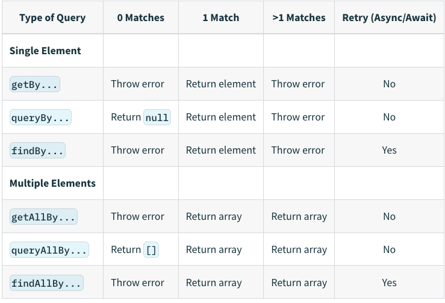

# 기본 사용법

<p style="font-size: 25px; font-weight: bold;">react testing library</p>

- 설치

  ```bash
  npm install --save-dev @testing-library/react
  or
  yarn add -D @testing-library/react
  ```

- 사용할때 주의할점

참고 url

[https://seongry.github.io/2021/06-20-common-mistakes-with-rty/](https://seongry.github.io/2021/06-20-common-mistakes-with-rty/)
[Common mistakes with React Testing Library](https://kentcdodds.com/blog/common-mistakes-with-react-testing-library)

- destructure what you need from render or call it view.

  ```tsx
  // ❌
  const wrapper = render(<Example prop="1" />);
  wrapper.rerender(<Example prop="2" />);

  // ✅
  const { rerender } = render(<Example prop="1" />);
  rerender(<Example prop="2" />);
  ```

- automatically Cleanup

  ```tsx
  // ❌
  import { render, screen, cleanup } from '@testing-library/react';

  afterEach(cleanup);

  // ✅
  import { render, screen } from '@testing-library/react';
  ```

  대부분의 메이저 프레임워크(mocha, Jest, and Jasmine)에서 자동적으로 cleanup 함수가 호출됨으로 각 테스트 마다 cleanup 함수를 호출해 줄 필요가 없다.

- screen을 사용할 것

  ```tsx
  // ❌ 사용해야 할 기능이 많아 질 수 있다.
  const { getByRole } = render(<Example />);
  const errorMessageNode = getByRole('alert');

  // ✅ 사용해야 할 기능이 많아져도 추가되는 코드가 없다.
  render(<Example />);
  const errorMessageNode = screen.getByRole('alert');

  // debug 함수 대신에 screen.debug 호출해주세요..
  screen.debug() => 엘리먼트 구조를 보여줌
  ```

  react testing library에서는 메소드를 불러오는 방식으로 두가지 방식으로 지원한다

  1. 메소드를 import 해오는 방법
  2. screen 객체에서 참조해 쓰는방법
     screen 사용하게 되면 엘리먼트 추가/삭제/업데이트가 될 경우 최신상태를 얻기 위해서 비구조화 할당을 하지 않고 엘리먼트의 속성들을 접근이 가능함.

- expect의 검증 메소드를 정확하게 사용하도록 할 것

  ```tsx
  const button = screen.screen.getByTestId('button');

  // ❌
  expect(button.disabled).toBe(true);
  // error message:
  //  expect(received).toBe(expected) // Object.is equality
  //
  //  Expected: true
  //  Received: false
  // ✅
  expect(button).toBeDisabled();
  // error message:
  //   Received element is not disabled:
  //     <button />
  ```

  다음 코드와 같이 expect 뒤에 들어갈 메소드가 좀더 구체적일 경우 에러메세지를 디버깅이 수월하게 띄워준다. 원활한 디버깅을 위해 정확한 검증 메소드를 사용하자

- getByText 사용에 지양

  ```tsx
  <button data-testid="helloWorld">Hello World</button>;
  // 1. Wrong! 😓
  screen.getByText(/hello world/i);

  // 2. Best! 😄
  screen.getByTestId('helloWorld');
  ```

- fireEvent 사용에 주의할 것
  ```tsx
  // ❌
  fireEvent.change(input, { target: { value: 'hello world' } });
  // ✅
  userEvent.type(input, 'hello world');
  ```
  fireEvent는 유저 행동에 친숙한 방식의 메서드로 설정되어 있어서 input 이벤트가 변경될 때(keyDown, keyPress, keyUp) 호출되게 되다 보니, 개발자 측면에서는 혼란을 줄 수가 있습니다.
  fireEvent 보다는 useEvent 메서드는 이벤트의 특성에 따라 호출됨으로 원할한 디버깅을 위해서는 userEvent를 사용해야 합니다.
- find에 waitFor이 내장되어 있다

  ```tsx
  // ❌
  const submitButton = await waitFor(() =>
    screen.screen.getByTestId('submit');
  )

  // ✅
  const submitButton = await screen.findByTestId('submit');
  ```

  find로 조합되는 메소드들은 모두 waitFor이 내장 되어있다. find 혹은 waitFor을 쓰게 된다면 이점 주의해서 사용하도록 하자.

- Wrapping things in act unnecessarily
  render, fireEvent에서 자체적으로 act를 래핑하고 있기 때문에 불필요하게 사용할 필요가 없습니다.
  act에 사용용도는 state 상태를 변경 시 수동으로 DOM을 업데이트 할 경우 호출되는 메서드입니다.

  ```tsx
  / ❌
  act(() => {
    render(<Example />)
  })

  const input = screen.getByRole('textbox', {name: /choose a fruit/i})
  act(() => {
    fireEvent.keyDown(input, {key: 'ArrowDown'})
  })

  // ✅
  render(<Example />)
  const input = screen.getByRole('textbox', {name: /choose a fruit/i})
  fireEvent.keyDown(input, {key: 'ArrowDown'})
  ```

- 잘못된 쿼리 사용 개선
  사용자 동선과 가깝게 쿼리 진행하기

  ```
  // ❌
  // assuming you've got this DOM to work with:
  // <label>Username</label><input data-testid="username" />
  screen.getByTestId('username')

  // ✅
  // change the DOM to be accessible by associating the label and setting the type
  // <label for="username">Username</label><input id="username" type="text" />
  screen.getByRole('textbox', {name: /username/i})
  ```

  container/querySelector 사용한 요소 쿼리 지양

  ```
  // ❌
  const { container } = render(<Example />);
  const button = container.querySelector(".btn-primary");
  expect(button).toHaveTextContent(/click me/i);
  // ✅
  render(<Example />);
  screen.getByRole("button", { name: /click me/i });
  ```

  → 용도에 맞는 query 함수 사용

- 불필요한 접근성 속성은 추가하지 않기

  ```jsx
  // ❌
  render(<button role="button">Click me</button>);

  // ✅
  // button element에서는 기본적으로 role 속성이 button임으로 role=button 추가하지 않기
  render(<button>Click me</button>);
  ```

- 존재하지 않는 엘리먼트를 체크하는 외에는 query\* 문을 사용하지 않기

  ```jsx
  // ❌
  expect(screen.queryByRole('alert')).toBeInTheDocument();

  // ✅
  expect(screen.getByRole('alert')).toBeInTheDocument();
  expect(screen.queryByRole('alert')).not.toBeInTheDocument();
  ```

- Query

  - query vs get vs find
    **query**
    - queryBy일치하는 1개의 엘리먼트를 검색한다. 먼저 querySelectorAll로 모든 엘리먼트를 찾고 없을 경우 null을, 1개일 경우 노드 리스트의 첫 번째 엘리먼트를 반환한다. 2개 이상일 경우에는 에러를 던진다.
    - queryAllBy일치하는 모든 엘리먼트를 검색한다. querySelectorAll의 결과를 그대로 반환한다.
      **get**
    - getBy일치하는 1개의 엘리먼트를 검색한다. 먼저 querySelectorAll로 모든 엘리먼트를 찾고 1개일 경우 노드 리스트의 첫 번째 엘리먼트를 반환한다. 없거나 2개 이상일 경우에는 에러를 던진다.
    - getAllBy일치하는 모든 엘리먼트를 검색한다. querySelectorAll의 결과를 그대로 반환한다. 일치하는 엘리먼트가 없을 경우 에러를 던진다.
      **find**
      Promise를 리턴하는 것만 제외하면 get 타입과 동일하다. [waitFor](https://testing-library.com/docs/dom-testing-library/api-async/#waitfor) 메서드를 감싸는 형태로 되어 있어서 에러를 던지지 않을 때까지 검색을 재시도한다.
      **어느 경우에 사용을 해야할까??**
      query는 엘리먼트가 없어도 에러를 던지지 않기 때문에 엘리먼트의 존재 여부를 확인하는 데 적합하다. get 을 기본 옵션으로 사용하고 엘리먼트가 렌더링될 때까지 기다려야 하는 상황이 있다면 find를 사용하는 게 좋지 않을까 싶다.
      
  - 쿼리 우선순위
    - 시각 요소/ 사용자의 인터렉션을 테스트하기 위한 쿼리들 간 우선순위
      - getByRole > getByLabelText > getByPlaceholderText > getByText > getByDisplayValue
    - HTML5 와 ARIA 속성을 테스트 하기 위한 쿼리들 간 우선순위
      - getByAltText > getByTitle
    - 테스트 ID: 위에 쿼리들로도 불가능한 값을 검색하기 위해서만 사용
      - getByTestId
        [https://testing-library.com/docs/queries/about/#priority](https://testing-library.com/docs/queries/about/#priority)
  - ByRole
    - API: getByRole, queryByRole, getAllByRole, queryAllByRole, findByRole, findAllByRole
    - 설명
      - 역할을 가진 요소를 dom에서 얻어올 경우 사용
      - 웹접근성에 aria-role 의미와 일치하는 키값을 통해서 dom을 얻어 올 수 있음.
    - 참고 URL
      - [https://testing-library.com/docs/queries/byrole](https://testing-library.com/docs/queries/byrole)
      - 자주 사용되는 role 정리: [https://www.w3.org/TR/html-aria/#sotd](https://www.w3.org/TR/html-aria/#sotd)
        [제목 없음](https://www.notion.so/480e494982234b839e945e225b4642dc)
  - ByLabelText

    - API: getByLabelText, queryByLabelText, getAllByLabelText, queryAllByLabelText, findByLabelText, findAllByLabelText
    - 설명
      - label 엘리먼트와 aria-label\* 문구와 일치하는 엘리먼트를 얻어올 때 사용
    - 참고 URL
      - [https://testing-library.com/docs/queries/bylabeltext](https://testing-library.com/docs/queries/bylabeltext)

    ```jsx
    // for/htmlFor relationship between label and form element id
    <label for="username-input">Username</label>
    <input id="username-input" />

    // The aria-labelledby attribute with form elements
    <label id="username-label">Username</label>
    <input aria-labelledby="username-label" />

    // Wrapper labels
    <label>Username <input /></label>

    // Wrapper labels where the label text is in another child element
    <label>
      <span>Username</span>
      <input />
    </label>

    // aria-label attributes
    // Take care because this is not a label that users can see on the page,
    // so the purpose of your input must be obvious to visual users.
    <input aria-label="Username" />
    ```

  - ByText

    - API: getByText, queryByText, getAllByText, queryAllByText, findByText, findAllByText
    - 설명
      - 모든 엘리먼트의 텍스트값과 일치하는 엘리먼트를 얻어올 때 사용
    - 참고 URL
      - [https://testing-library.com/docs/queries/bytext](https://testing-library.com/docs/queries/bytext)

    ```jsx
    <a href="/about">About ℹ️</a>
    // type: submit or button
    <input type="submit" value="Send data" />

    const aboutAnchorNode = screen.getByText(/about/i);
    ```

  - ByDisplayValue

    - API: getByDisplayValue, queryByDisplayValue, getAllByDisplayValue, queryAllByDisplayValue, findByDisplayValue, findAllByDisplayValue
    - 설명
      - input, textarea, select에 화면값과 일치하는 엘리먼트를 얻어올 때 사용
    - 참고 URL
      - [https://testing-library.com/docs/queries/bydisplayvalue](https://testing-library.com/docs/queries/bydisplayvalue)

    ```jsx
    <input type="text" id="lastName" />;
    document.getElementById('lastName').value = 'Norris';

    const lastNameInput = screen.getByDisplayValue('Norris');
    ```

  - ByTestId

    - API: getByTestId, queryByTestId, getAllByTestId, queryAllByTestId, findByTestId, findAllByTestId
    - 설명
      - 모든 element에 title 속성값과 일치하는 엘리먼트를 얻어올 때 사용
      - 다른 쿼리문이 동작하지 않을 경우에만 testid를 사용하는 것을 추천합니다.
    - 참고 URL
      - [https://testing-library.com/docs/queries/bytitle](https://testing-library.com/docs/queries/bytitle)

    ```
    <div data-testid="custom-element" />

    const element = screen.getByTestId('custom-element');
    ```

  - ByPlaceholderText

    - API: getByPlaceholderText, queryByPlaceholderText, getAllByPlaceholderText, queryAllByPlaceholderText, findByPlaceholderText, findAllByPlaceholderText
    - 설명
      - 모든 element에 placeholder 속성값과 일치하는 엘리먼트를 얻어올 때 사용
    - 참고 URL
      - [https://testing-library.com/docs/queries/byplaceholdertext](https://testing-library.com/docs/queries/byplaceholdertext)

    ```
    <input placeholder="Username" />

    const inputNode = screen.getByPlaceholderText('Username');
    ```

  - ByAltText

    - API: getByAltText, queryByAltText, getAllByAltText, queryAllByAltText, findByAltText, findAllByAltText
    - 설명
      - 이미지 element에 alt 속성값과 일차하는 엘리먼트를 얻어올 때 사용
    - 참고 URL
      - [https://testing-library.com/docs/queries/byalttext](https://testing-library.com/docs/queries/byalttext)

    ```
    

    const incrediblesPosterImg = screen.getByAltText(/incredibles.*? poster/i);
    ```

<p style="font-size: 25px; font-weight: bold;">Jest Expect</p>

- .toBe(value)
  toBe를 사용하여 기본값을 비교하거나 Object 인스턴스의 참조 ID(**Shallow compare**)를 체크할 수 있습니다.

  ```tsx
  const can = {
    name: 'pamplemousse',
    ounces: 12,
  };

  describe('the can', () => {
    test('has 12 ounces', () => {
      expect(can.ounces).toBe(12);
    });

    test('has a sophisticated name', () => {
      expect(can.name).toBe('pamplemousse');
    });
  });

  test('toBe는 obj가 같은 객체를 가리키고 있는지 확인한다', () => {
    const obj = {};
    expect(obj).toBe(obj); // true
  });

  test('객체의 내용이 같더라도 서로 다른 메모리에 있는 객체이기 때문에 toBe를 쓰면 false가 나온다.', () => {
    expect({ name: 'John' }).toBe({ name: 'John' }); // false
  });
  ```

- .toEqual(value)
  객체 인스턴스의 모든 속성을 재귀적으로 비교할 수 있습니다.

  ```tsx
  const can1 = {
    flavor: 'grapefruit',
    ounces: 12,
  };
  const can2 = {
    flavor: 'grapefruit',
    ounces: 12,
  };

  describe('the La Croix cans on my desk', () => {
    test('have all the same properties', () => {
      expect(can1).toEqual(can2);
    });
    test('are not the exact same can', () => {
      expect(can1).not.toBe(can2);
    });
  });

  test('대신에 객체의 내용이 같은지를 확인하려면 toEqual을 써야 한다', () => {
    const obj = {};
    expect({ name: 'John' }).toEqual({ name: 'John' }); // true
  });
  ```

- .toBeNull(), toBeUndefined()
  .toBeNull()은 .toBe(null)과 동일하지만 오류 메시지가 조금 더 좋습니다. 따라서 무언가가 null인지 확인하려면 .toBeNull()을 사용하십시오
  .toBeUndefined()은 .toBeUndefined(null)과 동일하지만 오류 메시지가 조금 더 좋습니다. 따라서 무언가가 undefined인지 확인하려면 .toBeUndefined()을 사용하십시오

  ```tsx
  function bloop() {
    return null;
  }

  test('bloop returns null', () => {
    expect(bloop()).toBeNull();
  });

  test('the best drink for octopus flavor is undefined', () => {
    expect(bestDrinkForFlavor('octopus')).toBeUndefined();
  });
  ```

- .toBeTruthy(), .toBeFalsy()
  .toBeTruthy()는 .toBeFalsy의 반대로, 값이 무엇인지와는 상관없이 boolean 컨텍스트에서 값이 true인지 여부를 확인할 때 사용하게 됩니다.
  느슨한 타입 기반 언어인 자바스크립트는 true/false 가 boolean 타입만으로 간주되지 않습니다. 숫자 1이 true, 숫자 0이 false로 간주되게 되는데 그 느슨한 타입 기반을 체크하는 할 경우 toBeTruthy, toBeFalsy를 사용하면 됩니다.
  ```tsx
  test('number 0 is falsy but string 0 is truthy', () => {
    expect(0).toBeFalsy();
    expect('0').toBeTruthy();
  });
  ```
- .toHaveLength(number)
  .toHaveLength는 객체에 .length 속성이 있고 특정 숫자값으로 설정되어 있는지 여부를 확인할 수 있습니다.
  ```tsx
  expect([1, 2, 3]).toHaveLength(3);
  expect('abc').toHaveLength(3);
  expect('').not.toHaveLength(5);
  ```
- .toHaveProperty(keyPath, value?)
  .toHaveProperty는 객체안에 참조 keyPath의 속성이 존재하는지 테스트할 때 사용할 수 있습니다.
  수신된 특정 값 비교를 위해서는, 선택적으로 value 인수를 제공할 수 있습니다.

  ```tsx
  // Object containing house features to be tested
  const houseForSale = {
    bath: true,
    bedrooms: 4,
    kitchen: {
      amenities: ['oven', 'stove', 'washer'],
      area: 20,
      wallColor: 'white',
      'nice.oven': true,
    },
    livingroom: {
      amenities: [
        {
          couch: [
            ['large', { dimensions: [20, 20] }],
            ['small', { dimensions: [10, 10] }],
          ],
        },
      ],
    },
    'ceiling.height': 2,
  };

  test('this house has my desired features', () => {
    // Example Referencing
    expect(houseForSale).toHaveProperty('bath');
    expect(houseForSale).toHaveProperty('bedrooms', 4);

    expect(houseForSale).not.toHaveProperty('pool');

    // Deep referencing using dot notation
    expect(houseForSale).toHaveProperty('kitchen.area', 20);
    expect(houseForSale).toHaveProperty('kitchen.amenities', [
      'oven',
      'stove',
      'washer',
    ]);

    expect(houseForSale).not.toHaveProperty('kitchen.open');

    // Deep referencing using an array containing the keyPath
    expect(houseForSale).toHaveProperty(['kitchen', 'area'], 20);
    expect(houseForSale).toHaveProperty(
      ['kitchen', 'amenities'],
      ['oven', 'stove', 'washer'],
    );
    expect(houseForSale).toHaveProperty(['kitchen', 'amenities', 0], 'oven');
    expect(houseForSale).toHaveProperty(
      'livingroom.amenities[0].couch[0][1].dimensions[0]',
      20,
    );
    expect(houseForSale).toHaveProperty(['kitchen', 'nice.oven']);
    expect(houseForSale).not.toHaveProperty(['kitchen', 'open']);

    // Referencing keys with dot in the key itself
    expect(houseForSale).toHaveProperty(['ceiling.height'], 'tall');
  });
  ```

- .toHaveBeenCalled()
  .toHaveBeenCalled()는 모의 함수가 호출 되었는지 확인할 수 있습니다.

  ```tsx
  function drinkAll(callback, flavour) {
    if (flavour !== 'octopus') {
      callback(flavour);
    }
  }

  describe('drinkAll', () => {
    test('drinks something lemon-flavoured', () => {
      const drink = jest.fn();
      drinkAll(drink, 'lemon');
      expect(drink).toHaveBeenCalled(); // drink 모의함수가 호출여부 확인(callback)
    });

    test('does not drink something octopus-flavoured', () => {
      const drink = jest.fn();
      drinkAll(drink, 'octopus');
      expect(drink).not.toHaveBeenCalled(); // drink 모의함수가 호출여부 확인(callback)
    });
  });
  ```

- .arrayContaining(array)
  .arrayContaining(array)는 수신된 배열에 예상되는 배열의 요소들이 포함되는지 판단합니다.
  즉, 예상되는 배열을 수신된 배열의 하위 집합입니다.
  ```tsx
  describe('arrayContaining', () => {
    const expected = ['Alice', 'Bob'];
    it('matches even if received contains additional elements', () => {
      expect(['Alice', 'Bob', 'Eve']).toEqual(expect.arrayContaining(expected));
    });
    it('does not match if received does not contain expected elements', () => {
      expect(['Bob', 'Eve']).not.toEqual(expect.arrayContaining(expected));
    });
  });
  ```
- .toContain
  - 배열의 아이템을 포함되어 있는지 여부를 체크해야할 경우 사용
  ```tsx
  test('the flavor list contains lime', () => {
    expect(['lime', 'mangle']).toContain('lime');
  });
  ```
  - 수신된 문자열이 예상된 문자열이 포함되었는지 여부를 체크할 경우 사용
  ```tsx
  test('the flavor list contains lime', () => {
    expect('lime juice').toContain('lime');
  });
  ```
- .toBeInTheDocument
  해당 엘리먼트가 document에 포함되어 있는지 여부를 확인할 경우 사용

  ```tsx
  import { render, screen } from '@testing-library/react';
  import App from './App';

  test('renders learn react link', () => {
    render(<App />);
    const linkElement = screen.getByText(/learn react/i);
    expect(linkElement).toBeInTheDocument();
  });
  ```

- .toBeCalledTimes
  모의 함수가 몇번 호출되는지 여부를 확인할 경우 사용

  ```tsx
  const mockFn = jest.fn();

  mockFn(10, 20);
  mockFn();
  mockFn(30, 40);

  test('한번 이상 호출?', () => {
    expect(mockFn).toBeCalled();
  });

  test('정확히 3번 호출?', () => {
    expect(mockFn).toBeCalledTimes(3);
  });

  test('10이랑 20을 인수로 전달받은 함수가 있는가', () => {
    expect(mockFn).toBeCalledWith(10, 20);
  });

  test('마지막 함수는 30이랑 40 받았음?', () => {
    expect(mockFn).lastCalledWith(30, 40);
  });
  ```

- .toMatchSnapshot
  파일 스냅샷 테스트 지원을 해야할 경우 사용
  테스트 완료 수 **snapshots** 디렉토리가 생성되고, 그 안에 repeat.test.js.snap 파일이 생성됨.

  ```tsx
  import repeat from './repeat';

  test('repeats words three times', () => {
    expect(repeat('Test', 3)).toMatchSnapshot();
  });
  ```

- .toHaveTextContent
  엘리먼트의 텍스트의 비교를 해야할 경우 사용

  ```tsx
  import React from 'react';
  import App from '../App';
  import { fireEvent, render } from '@testing-library/react';

  describe('<App /> test', () => {
    it('matches snapshopt', () => {
      const utils = render(<App />);
      expect(utils.container).toMatchSnapshot(); // snapshot match
    });

    it('screen test', () => {
      const utils = render(<App />);

      const h2 = utils.container.querySelector('h2'); // h2태그 DOM 가져오기
      h2 && expect(h2.innerHTML).toBe('Hello. Jest!!'); // h2의 innerHTML이 Hello, Jest!! 인지 테스트
    });

    it('button test', () => {
      const utils = render(<App />);

      const str = utils.getByText('number: 0'); // 텍스트가 number: 0인 DOM 가져오기
      const increaseButton = utils.getByText('증가'); // 텍스트가 증가인 DOM 가져오기
      const decreaseButton = utils.getByText('감소'); // 텍스트가 감소인 DOM 가져오기

      fireEvent.click(increaseButton); // 증가버튼 클릭이벤트 실행
      fireEvent.click(increaseButton); // 증가버튼 클릭이벤트 실행
      expect(str).toHaveTextContent('number: 6'); // str의 텍스트가 number: 6인지 확인

      fireEvent.click(decreaseButton); // 감소버튼 클릭이벤트 실행
      fireEvent.click(decreaseButton); // 감소버튼 클릭이벤트 실행
      expect(str).toHaveTextContent('number: 2'); // str의 텍스트가 number: 2인지 확인
    });
  });
  ```

- .toBeDisabled
  엘리먼트가 비활성화 인지 여부를 체크하기 위해서 사용
  ```tsx
  expect(screen.getByRole('button')).toHaveTextContent('대기중');
  expect(screen.getByRole('button')).toBeDisabled();
  ```
- .toBeCalled
  함수가 호출되었는지 여부를 체크하기 위해서 사용

  ```tsx
  fireEvent.click(screen.getByTestId('app-install-modal-close-button'));

  // Then
  expect(onClose).toBeCalled();
  ```

- .toBeRequired
  엘리먼트의 속성에 required, aria-required=”true”가 존재하는지 여부를 체크하기 위해서 사용
  ```tsx
  // example
  <input data-testid="required-input" required />
  <input data-testid="aria-required-input" aria-required="true" />
  <input data-testid="conflicted-input" required aria-required="false" />
  <input data-testid="aria-not-required-input" aria-required="false" />
  <input data-testid="optional-input" />
  <input data-testid="unsupported-type" type="image" required />
  <select data-testid="select" required></select>
  <textarea data-testid="textarea" required></textarea>
  <div data-testid="supported-role" role="tree" required></div>
  <div data-testid="supported-role-aria" role="tree" aria-required="true"></div>
  ```
  ```tsx
  expect(
    document.querySelector('[data-testid="required-input"]'),
  ).toBeRequired();
  expect(
    document.querySelector('[data-testid="aria-required-input"]'),
  ).toBeRequired();
  expect(
    document.querySelector('[data-testid="conflicted-input"]'),
  ).toBeRequired();
  expect(
    document.querySelector('[data-testid="aria-not-required-input"]'),
  ).not.toBeRequired();
  expect(
    document.querySelector('[data-testid="unsupported-type"]'),
  ).not.toBeRequired();
  expect(document.querySelector('[data-testid="select"]')).toBeRequired();
  expect(document.querySelector('[data-testid="textarea"]')).toBeRequired();
  expect(
    document.querySelector('[data-testid="supported-role"]'),
  ).not.toBeRequired();
  expect(
    document.querySelector('[data-testid="supported-role-aria"]'),
  ).toBeRequired();
  ```
- .toBeGreaterThan(number | bigint)
  수신받은 데이터(received)보다 예상되는 데이터(expected) 보다 큰 숫자일 여부를 체크하기 위해서 사용

  ```tsx
  test('ounces per can is more than 10', () => {
    expect(ouncesPerCan()).toBeGreaterThan(10); // ouncesPerCan() 이 10 온스 이상의 값을 반환 하는지 테스트
  });
  ```

<p style="font-size: 25px; font-weight: bold;">User Event</p>

package: @testing-library/user-event

- 설치
  ```bash
  npm install --save-dev @testing-library/user-event
  or
  yarn add -D @testing-library/user-event
  ```
- API

  - click(element, eventInit, options)

    ```tsx
    import React from 'react';
    import { render, screen } from '@testing-library/react';
    import userEvent from '@testing-library/user-event';

    test('click', () => {
      render(
        <div>
          <label htmlFor="checkbox">Check</label>
          <input id="checkbox" type="checkbox" />
        </div>,
      );

      userEvent.click(screen.getByText('Check'));
      expect(screen.getByLabelText('Check')).toBeChecked();
    });

    userEvent.click(elem, { ctrlKey: true, shiftKey: true });
    userEvent.click(elem, undefined, { skipPointerEventsCheck: true });
    ```

  - type(element, text, [options])

    - input, textarea 엘리먼트안에 텍스트를 추가할 때 사용

    ```tsx
    import React from 'react';
    import { render, screen } from '@testing-library/react';
    import userEvent from '@testing-library/user-event';

    test('type', () => {
      render(<textarea />);

      userEvent.type(screen.getByRole('textbox'), 'Hello,{enter}World!');
      expect(screen.getByRole('textbox')).toHaveValue('Hello,\nWorld!');
    });
    ```

  - clear(element)

    - 현재 선택된 input/textarea 엘리먼트의 텍스트값을 삭제할 때 사용

    ```tsx
    import React from 'react';
    import { render, screen } from '@testing-library/react';
    import userEvent from '@testing-library/user-event';

    test('clear', () => {
      render(<textarea defaultValue="Hello, World!" />);

      userEvent.clear(screen.getByRole('textbox'));
      expect(screen.getByRole('textbox')).toHaveValue('');
    });
    ```

  - dblClick(element, eventInit, options)

    ```jsx
    import React from 'react';
    import { render, screen } from '@testing-library/react';
    import userEvent from '@testing-library/user-event';

    test('double click', () => {
      const onChange = jest.fn();
      render(<input type="checkbox" onChange={onChange} />);
      const checkbox = screen.getByRole('checkbox');
      userEvent.dblClick(checkbox);
      expect(onChange).toHaveBeenCalledTimes(2);
      expect(checkbox).not.toBeChecked();
    });
    ```

  - selectOptions(element, values, options) / deselectOptions(element, values, options)

    ```tsx
    import React from 'react';
    import { render, screen } from '@testing-library/react';
    import userEvent from '@testing-library/user-event';

    test('selectOptions', () => {
      render(
        <select multiple>
          <option value="1">A</option>
          <option value="2">B</option>
          <option value="3">C</option>
        </select>,
      );

      userEvent.selectOptions(screen.getByRole('listbox'), ['1', '3']);

      expect(screen.getByRole('option', { name: 'A' }).selected).toBe(true);
      expect(screen.getByRole('option', { name: 'B' }).selected).toBe(false);
      expect(screen.getByRole('option', { name: 'C' }).selected).toBe(true);

      userEvent.selectOptions(screen.getByRole('listbox'), '2');
      expect(screen.getByText('B').selected).toBe(true);
      userEvent.deselectOptions(screen.getByRole('listbox'), '2');
      expect(screen.getByText('B').selected).toBe(false);
    });
    ```

  - tab({shift, focusTrap})

    - 브라우저와 동일하게 tab 이벤트를 발생시켜서 activeElement를 변경 시킨다.

    ```tsx
    import React from 'react';
    import { render, screen } from '@testing-library/react';
    import '@testing-library/jest-dom';
    import userEvent from '@testing-library/user-event';

    it('should cycle elements in document tab order', () => {
      render(
        <div>
          <input data-testid="element" type="checkbox" />
          <input data-testid="element" type="radio" />
          <input data-testid="element" type="number" />
        </div>,
      );

      const [checkbox, radio, number] = screen.getAllByTestId('element');

      expect(document.body).toHaveFocus();

      userEvent.tab();

      expect(checkbox).toHaveFocus();

      userEvent.tab();

      expect(radio).toHaveFocus();

      userEvent.tab();

      expect(number).toHaveFocus();

      userEvent.tab();

      // cycle goes back to the body element
      expect(document.body).toHaveFocus();

      userEvent.tab();

      expect(checkbox).toHaveFocus();
    });
    ```

  - hover(element, options) / unhover(element, options)

        ```tsx
        import React from 'react';
        import { render, screen } from '@testing-library/react';
        import userEvent from '@testing-library/user-event';
        import Tooltip from '../tooltip';

        test('hover', () => {
          const messageText = 'Hello';
          render(
            <Tooltip messageText={messageText}>
              <TrashIcon aria-label="Delete" />
            </Tooltip>,
          );

          userEvent.hover(screen.getByLabelText(/delete/i));
          expect(screen.getByText(messageText)).toBeInTheDocument();
          userEvent.unhover(screen.getByLabelText(/delete/i));
          expect(screen.queryByText(messageText)).not.toBeInTheDocument();
        });
        ```

# API 유닛테스트

<p style="font-size: 25px; font-weight: bold;">패키지</p>

- jest
- react-test-renderer
- axios, fetch
<p style="font-size: 25px; font-weight: bold;">테스트 사항</p>

- HTTP 성공여부 확인(request code 200)
- API 기대응답에 대한 비교
- API 응답이 길 경우 속성의 길이만 테스트
<p style="font-size: 25px; font-weight: bold;">적용사항</p>

링크: [https://github.com/seungahhong/states-todos/blob/main/src/redux/services/**test**/todo.service.tsx](https://github.com/seungahhong/states-todos/blob/main/src/redux/services/__test__/todo.service.tsx)

```tsx
import { fetchTodo, createTodo, updateTodo, patchTodo, deleteTodo } from '..';

describe('async api test', () => {
  it('shoud async get api to todos a states', async () => {
    const { data } = await fetchTodo();
    const keys = ['userId', 'id', 'title', 'completed'];
    expect(Object.keys(data[0])).toEqual(keys);
  });

  it('shoud async get api to todo a states', async () => {
    const { data } = await fetchTodo(1);
    const keys = ['userId', 'id', 'title', 'completed'];
    expect(Object.keys(data)).toEqual(keys);
  });

  it('shoud async create api to todos a states', async () => {
    const expectData = {
      userId: 1,
      title: 'create',
      body: 'post create',
    };
    const { data, status } = await createTodo(expectData);

    expect(status).toBe(201 /* HTML Response 201 Created */);
    expect({
      userId: data.userId,
      title: data.title,
      body: data.body,
    }).toEqual(expectData);
  });

  it('shoud async put api to todos a states', async () => {
    const expectData = {
      userId: 1,
      id: 1,
      title: 'update',
      body: 'put update',
    };

    const { data, status } = await updateTodo(1, expectData);

    expect(status).toBe(200 /* HTML Response 200 OK */);
    expect(data).toEqual(expectData);
  });

  it('shoud async patch api to todos a states', async () => {
    const expectData = {
      title: 'patch',
    };

    const { data, status } = await patchTodo(1, expectData);

    expect(status).toBe(200 /* HTML Response 200 OK */);
    expect({
      title: data.title,
    }).toEqual(expectData);
  });

  it('shoud async delete api to todos a states', async () => {
    const { status } = await deleteTodo(1);
    expect(status).toBe(200 /* HTML Response 200 OK */);
  });
});
```

# 상태관리 유닛테스트

<p style="font-size: 25px; font-weight: bold;">redux 유닛테스트</p>

링크: [https://github.com/seungahhong/states-todos/tree/main/src/reduxToolkit/states/features/**test**](https://github.com/seungahhong/states-todos/tree/main/src/reduxToolkit/states/features/__test__)

- 패키지
  - jest
  - react-test-renderer
  - axios, fetch
  - redux-thunk
  - axios-mock-adapter
  - fetch-mock
  - redux-mock-store
  - redux-toolkit
  - jest
- 테스트 사항

  - Redux Reducer 유닛테스트

    ```tsx
    import slice, { fetchAction, changeAction } from '..';
    import { configureStore } from '@reduxjs/toolkit';
    // As a basic setup, import your same slice reducers

    export const setupStore = (reducer, preloadedState) => {
      return configureStore({
        reducer: { ...reducer },
        preloadedState,
      });
    };

    const list = [];

    describe('lists redux state test', () => {
      const setup = () => {
        return {
          list,
          store: setupStore({ lists: slice.reducer }, { initialState }), // reducer 초기세팅
        };
      };

      it('should return the reducer initial state', () => {
        const { reducer } = setup();
        expect(reducer(undefined, {})).toEqual(initialState);
      });

      it('should handle lists being added to a reducer empty state', () => {
        const { reducer, list } = setup();
        expect(reducer(initialState, fetchAction(list))).toEqual({
          ...initialState,
          lists: list.map(item => ({
            ...item,
          })),
        });
      });
    });
    ```

  - Redux Action 유닛테스트

    - redux action에 대한 유닛테스트 작성
      - 리덕스 액션 수행 후 예상된 리턴값을 비교

    ```tsx
    import slice, { initialState, fetchAction } from '..';

    export const setupStore = (reducer, preloadedState) => {
      return configureStore({
        reducer: { ...reducer },
        preloadedState,
      });
    };

    const list = [];

    describe('lists redux state test', () => {
      const setup = () => {
        return {
          list,
          store: setupStore({ lists: slice.reducer }, { initialState }), // reducer 초기세팅
        };
      };

      it('should handle lists being added fetchAction action state', () => {
        const { store, list } = setup();
        store.dispatch(fetchAction(list));
        const nextState = {
          ...initialState,
          lists: list.map(item => ({
            ...item,
          })),
        };

        expect(store.getState().lists).toEqual(nextState);
      });
    });
    ```

  - Redux-Thunk Action 유닛테스트

    ```tsx
    // axios 사용
    describe('async actions test', () => {
      it('shoud async fetch action to todos a states', async () => {
        const todoItem = [
          {
            userId: 1,
            id: 1,
            title: 'delectus aut autem',
            completed: false,
          },
          {
            userId: 2,
            id: 2,
            title: 'delectus aut autem test',
            completed: false,
          },
        ];

        const store = mockStore();

        mock
          .onGet('https://jsonplaceholder.typicode.com/todos')
          .reply(200, todoItem);

        return store.dispatch(fetchAsyncTodoAction()).then(() => {
          // return of async actions
          // [0]: pending, [1]: fulfilled
          const responses = store.getActions();
          const fetchAction = responses.filter(
            item => item.type === fetchAsyncTodoAction.fulfilled.type,
          )[0];

          expect(fetchAction.payload.todoItem).toHaveLength(todoItem.length);
        });
      });

      it('shoud async fetch action to todo a states', async () => {
        const id = 1;
        const todoItem = [
          {
            userId: 1,
            id: id,
            title: 'delectus aut autem',
            completed: false,
          },
        ];

        const store = mockStore();

        mock
          .onGet(`https://jsonplaceholder.typicode.com/todos/${id}`)
          .reply(200, todoItem);

        return store.dispatch(fetchAsyncTodoAction(id)).then(() => {
          // return of async actions
          // [0]: pending, [1]: fulfilled
          const expectedActions = {
            todoItem,
          };

          const responses = store.getActions();
          const fetchAction = responses.filter(
            item => item.type === fetchAsyncTodoAction.fulfilled.type,
          )[0];

          expect(fetchAction.payload).toEqual(expectedActions);
        });
      });

      it('shoud async create action to todo a states', async () => {
        const todoItem = [
          {
            userId: 2,
            title: 'create',
            completed: true,
          },
        ];

        const store = mockStore();

        mock
          .onPost(`https://jsonplaceholder.typicode.com/posts`)
          .reply(201, todoItem);

        return store
          .dispatch(createAsyncTodoAction(todoItem[0] as TodoItem))
          .then(() => {
            // return of async actions
            // [0]: pending, [1]: fulfilled
            const expectedActions = {
              todoItem,
            };

            const responses = store.getActions();
            const action = responses.filter(
              item => item.type === createAsyncTodoAction.fulfilled.type,
            )[0];

            expect(action.payload).toEqual(expectedActions);
          });
      });

      it('shoud async update action to todo a states', async () => {
        const id = 1;
        const todoItem = {
          userId: id,
          id: id,
          title: 'update',
          completed: true,
        };

        const store = mockStore();

        mock
          .onPut(`https://jsonplaceholder.typicode.com/posts/${id}`)
          .reply(200, todoItem);

        return store
          .dispatch(
            updateAsyncTodoAction({
              id,
              todoItem,
            }),
          )
          .then(() => {
            // return of async actions
            // [0]: pending, [1]: fulfilled
            const expectedActions = {
              id,
              data: todoItem,
            };

            const responses = store.getActions();
            const action = responses.filter(
              item => item.type === updateAsyncTodoAction.fulfilled.type,
            )[0];

            expect(action.payload).toEqual(expectedActions);
          });
      });

      it('shoud async delete action to todo a states', async () => {
        const id = 1;

        const store = mockStore();

        mock
          .onDelete(`https://jsonplaceholder.typicode.com/posts/${id}`)
          .reply(200);

        return store.dispatch(deleteAsyncTodoAction(id)).then(() => {
          // return of async actions
          // [0]: pending, [1]: fulfilled

          const responses = store.getActions();
          const action = responses.filter(
            item => item.type === deleteAsyncTodoAction.fulfilled.type,
          )[0];

          const expectedActions = {
            id,
          };

          expect(action.payload).toEqual(expectedActions);
        });
      });
    });

    // fetch 사용
    import thunk from 'redux-thunk';
    import configureStore from 'redux-mock-store';
    import fetchMock from 'fetch-mock';

    import reducer from '../features';

    import { FETCH_TODOS } from '../constants';
    import { fetchAsyncTodosAction, fetchTodosAction } from '../features';
    import { TodoAction, TodoItemState, TodoState } from '../types';

    const middlewares = [thunk];
    const mockStore = configureStore(middlewares);

    describe('async actions test', () => {
      afterEach(() => {
        fetchMock.restore();
      });

      it('shoud async action to todo a states', async () => {
        const todoItems = [
          {
            userId: 1,
            id: 1,
            title: 'delectus aut autem',
            completed: false,
          },
        ] as TodoItemState[];

        fetchMock.getOnce('https://jsonplaceholder.typicode.com/todos', {
          body: { todos: todoItems },
          headers: { 'content-type': 'application/json' },
        });

        const store = mockStore({ payload: { todos: [] } });

        return store.dispatch(fetchAsyncTodosAction()).then(() => {
          // return of async actions
          // [0]: pending, [1]: FETCH_TODOS, [2]: fulfilled
          const responses: TodoAction[] = store.getActions();
          const fulfilled = responses.filter(
            item => item.type === fetchAsyncTodosAction.fulfilled.type,
          )[0];

          expect(fulfilled.payload.todos).toEqual(todoItems);
        });
      });
    });
    ```

  - Redux 적용한 화면컴포넌트 테스트

    ```jsx
    import React from 'react';
    import {
      within,
      render,
      screen,
    } from '@testing-library/react';
    import slice, { // reducer, action
      initialState,
      fetchAction,
    } from '..';
    import List from '../List';

    import { configureStore } from '@reduxjs/toolkit';
    // As a basic setup, import your same slice reducers

    export const setupStore = (reducer, preloadedState) => {
      return configureStore({
        reducer: { ...reducer },
        preloadedState,
      });
    };

    const list = [];

    describe('<List />', () => {
      const setup = () => {
        return {
          list,
          store: setupStore({ lists: slice.reducer }, { initialState }), // reducer 초기세팅
        };
      };

      const setupRender = (props) => {
        return render(<List
          {...props}
        />);
      };

      it('shoud dispatch fetch state to render', async () => {
        const {
          list,
        } = setup();
        store.dispatch(fetchList(list)); // action 실행

        setupRender({
          list: store.getState().lists.list,
        });

        const list = screen.getByRole('list');
        const { getAllByRole } = within(list);
        const items = getAllByRole('listitem');
        expect(items.length).toBe(8);
      });
    ```

<p style="font-size: 25px; font-weight: bold;">react-query 유닛테스트</p>

링크: [testing-react-query/src at main · TkDodo/testing-react-query](https://github.com/TkDodo/testing-react-query/tree/main/src) (msw, jest)

- 설치
  ```bash
  npm install @testing-library/react-hooks react-test-renderer --save-dev
  or
  yarn add @testing-library/react-hooks react-test-renderer --save-dev
  ```
- For custom hooks
  @testing-library/react-hooks, @testing-library/react v13.1.0 이상일 경우 Custom Hook 테스트가 가능합니다. 해당 라이브러리를 사용하여서 wrapper로 hook를 감쌀 수 있으며 렌더링 시 테스트 구성요소를 감싸서 실행시켜 줍니다.

  ```tsx
  // @testing-library/react-hooks
  import { renderHook, waitFor } from '@testing-library/react-hooks';

  // @testing-library/react v13.1.0 이상
  import { renderHook, waitFor } from '@testing-library/react';

  export function useCustomHook() {
    return useQuery(['customHook'], () => 'Hello');
  }

  const queryClient = new QueryClient();
  const wrapper = ({ children }) => (
    <QueryClientProvider client={queryClient}>{children}</QueryClientProvider>
  );

  const { result, waitFor } = renderHook(() => useCustomHook(), { wrapper });

  await waitFor(() => result.current.isSuccess);

  expect(result.current.data).toEqual('Hello');
  ```

- Turn off retries
  리액트 쿼리는 기본적으로 3번의 재시도를 하도록 설정되어 있는데, 에러가 있는 쿼리에 경우에는 타임아웃이 걸리는 문제점을 있어서 초기 세팅에 retry값을 false로 설정합니다.

  ```tsx
  import { QueryClient } from 'react-query';

  const queryClient = new QueryClient({
    defaultOptions: {
      queries: {
        // ✅ turns retries off
        retry: false,
      },
    },
  });
  const wrapper = ({ children }) => (
    <QueryClientProvider client={queryClient}>{children}</QueryClientProvider>
  );
  ```

- turn-off-network-error-logging
  리액트 쿼리는 네트워크 에러에 대해서 콘솔 에러로 표기를 합니다. 해당 네트워크 에러와 테스트 에러가 같이 콘솔에 보일경우 혼란을 줄 수 있으므로, 테스트 환경세팅 시 로깅을 끄도록 설정합니다.

  ```tsx
  import { QueryClient } from 'react-query';

  const queryClient = new QueryClient({
    logger: {
      log: console.log,
      warn: console.warn,
      // ✅ no more errors on the console for tests
      error: process.env.NODE_ENV === 'test' ? () => {} : console.error,
    },
  });
  ```

- setQueryDefaults
  useQuery에 옵션을 최대한 사용하지 하지 않고, 디폴드 옵션을 설정하도록 변경해야합니다. 단, 특정 쿼리에 대해서 옵션을 설정해야할 경우, queryClient.setQueryDefaults로 설정하세요

  ```tsx
  const queryClient = new QueryClient({
    defaultOptions: {
      queries: {
        retry: 2,
      },
    },
  });

  // ✅ only todos will retry 5 times
  queryClient.setQueryDefaults('todos', { retry: 5 });

  function App() {
    return (
      <QueryClientProvider client={queryClient}>
        <Example />
      </QueryClientProvider>
    );
  }
  ```

- Always await the query

  - react-query는 비동기 처리를 하고 있기 때문에 응답값 중 isSuccess flag가 true 일경우 데이터에 결과를 얻을 수 있습니다.
  - 해당 로직을 처리하기 위해서 @testing-library/react-hooks, @testing-library/react v13.1.0 이상의 라이브러리를 사용해서 테스트 코드 작성이 가능합니다.

  ```tsx
  // @testing-library/react-hooks
  import { renderHook, waitFor } from '@testing-library/react-hooks'

  const createWrapper = () => {
    const queryClient = new QueryClient({
      defaultOptions: {
        queries: {
          retry: false,
        },
      },
    })
    return ({ children }) => (
      <QueryClientProvider client={queryClient}>{children}</QueryClientProvider>
    )
  }

  test("my first test", async () => {
    const { result, waitFor } = renderHook(() => useCustomHook(), {
      wrapper: createWrapper()
    })

    // ✅ wait until the query has transitioned to success state
    await waitFor(() => result.current.isSuccess)

    expect(result.current.data).toBeDefined()
  }

  // @testing-library/react v13.1.0 이상
  import { waitFor, renderHook } from '@testing-library/react'

  test("my first test", async () => {
    const { result } = renderHook(() => useCustomHook(), {
      wrapper: createWrapper()
    })

    // ✅ return a Promise via expect to waitFor
    await waitFor(() => expect(result.current.isSuccess).toBe(true))

    expect(result.current.data).toBeDefined()
  }
  ```

- MSW 연동

  ````tsx
  import { renderHook } from "@testing-library/react";
  import { useApi } from "../useApi";
  import { rest, setupServer } from "msw/node";

        import axios from 'axios'
        import { useQuery } from 'react-query'

        const fetchRepoData = (): Promise<{ name: string }> =>
            axios
                .get('https://api.github.com/repos/tannerlinsley/react-query')
                .then((response) => response.data)

        export function useRepoData() {
            return useQuery(['repoData'], fetchRepoData)
        }
        );

        beforeAll(() => worker.listen());
        afterEach(() => worker.resetHandlers());
        afterAll(() => worker.stop());

        describe('query hook', () => {
            test('successful query hook', async () => {
                const { result } = renderHook(() => useRepoData(), {
                    wrapper: createWrapper()
                })

                await waitFor(() => expect(result.current.isSuccess).toBe(true))

                expect(result.current.data?.name).toBe('mocked-react-query')
            })

            test('failure query hook', async () => {
                server.use(
                    rest.get('*', (req, res, ctx) => {
                        return res(ctx.status(500))
                    })
                )

                const { result } = renderHook(() => useRepoData(), {
                    wrapper: createWrapper()
                })

                await waitFor(() => expect(result.current.isError).toBe(true))

                expect(result.current.error).toBeDefined()
            })
        })
        ```
  ````

# 화면 단위 유닛테스트

<p style="font-size: 25px; font-weight: bold;">패키지</p>

- jest
- react-test-renderer
- @testing-library/react
<p style="font-size: 25px; font-weight: bold;">DOM Testing</p>

- 인터렉션(이벤트) 단위의 화면 테스트를 기준으로 한다.
- package: @testing-library/react
- Query

  - Find Text Testing
    ByText
    - getByText, queryByText, getAllByText, queryAllByText, findByText, findAllByText
      findByText
    ```tsx
    expect(await screen.findByText("name is 'gildong'")).toBeInTheDocument();
    ```
    getByText
    ```tsx
    expect(screen.getByText('1000원')).toBeInTheDocument(); // 배송비 있음
    ```
    queryByText
    - queryByText는 검색하고자 하는 텍스트가 없는경우에 대해서도 테스트 가능(다른 api에서는 텍스트가 없는경우 에러를 노출)
    ```tsx
    expect(screen.queryByText('AAA')).not.toBeInTheDocument();
    ```
  - Find Element Testing
    ByRole

    - getByRole, queryByRole, getAllByRole, queryAllByRole, findByRole, findAllByRole
    - 역할을 가진 요소를 dom에서 얻어올 경우 사용

    ```tsx
    // button
    const button = screen.getByRole('button');
    const buttons = screen.getAllByRole('button');

    // image
    const image = screen.getByRole('img');

    // input
    expect(screen.getByRole('textbox')).toHaveValue('2');

    // ol,li
    const list = screen.getByRole('list');
    const { getAllByRole } = within(list);
    const items = getAllByRole('listitem');

    // checkbox
    const checkbox = screen.getByRole('checkbox');
    ```

    ByLabelText

    - label, aria-label/aria-labelledby 텍스트와 매칭되는 요소를 검색할 경우 사용

    ```tsx
    const button = screen.getByLabelText('버튼');
    ```

    ByTestId

    - getByTestId, queryByTestId, getAllByTestId, queryAllByTestId, findByTestId, findAllByTestId
    - data-testid 속성값과 매칭되는 요소를 검색할 경우 사용

    ```tsx
    const element = screen.getByTestId('버튼테스트');
    ```

- Element Event

  - Element Event Testing
    click

    ```jsx
    const handleClick = jest.fn();

    beforeEach(() => {
      handleClick.mockClear();
    });

    const button = screen.getByLabelText('삭제 버튼');
    // When
    userEvent.click(button);
    // Then
    expect(handleClick).toBeCalled(); // 삭제 버튼
    ```

    focus/blur

    ```jsx
    // Act
    act(() => element.focus());
    expect(element).toHaveFocus();

    // tab out(activeElement를 변경)
    userEvent.tab();

    // Shoud have triggered onBlur
    expect(handleChangeQuantity).toBeCalledTimes(3);
    ```

    hover

    ```jsx
    // When
    userEvent.hover(screen.getByRole('button'));

    // Then
    expect(screen.getByText('툴팁 입니다.')).toBeVisible();
    ```

    input change

    ```jsx
    // when
    userEvent.type(inputs[0], 'TEST');

    // Shoud have triggered onChange(글자입력이 될 때마다 호출됨)
    expect(handleChange).toBeCalledTimes(4);
    ```

    checkbox check

    ```jsx
    // When
    const checkbox = screen.getByRole('checkbox');

    userEvent.click(checkbox);

    // Then
    expect(handleCheck).toBeCalled();
    ```

    radio check

    ```jsx
    // When
    userEvent.click(screen.getByText('라디오 1'));

    // Then
    expect(handleChange).toBeCalled();
    ```

- Element Event Testing

  ```tsx
  // Input Element Testing
  import React, { useState } from 'react';
  import { render, fireEvent } from '@testing-library/react';

  function CostInput() {
    const [value, setValue] = useState('');

    removeDollarSign = value => (value[0] === '$' ? value.slice(1) : value);
    getReturnValue = value => (value === '' ? '' : `$${value}`);

    handleChange = ev => {
      ev.preventDefault();
      const inputtedValue = ev.currentTarget.value;
      const noDollarSign = removeDollarSign(inputtedValue);
      if (isNaN(noDollarSign)) return;
      setValue(getReturnValue(noDollarSign));
    };

    return (
      <input value={value} aria-label="cost-input" onChange={handleChange} />
    );
  }

  const setup = () => {
    const utils = render(<CostInput />);
    const input = utils.getByLabelText('cost-input');
    return {
      input,
      ...utils,
    };
  };

  test('It should keep a $ in front of the input', () => {
    const { input } = setup();
    fireEvent.change(input, { target: { value: '23' } });
    expect(input.value).toBe('$23');
  });
  test('It should allow a $ to be in the input when the value is changed', () => {
    const { input } = setup();
    fireEvent.change(input, { target: { value: '$23.0' } });
    expect(input.value).toBe('$23.0');
  });

  test('It should not allow letters to be inputted', () => {
    const { input } = setup();
    expect(input.value).toBe(''); // empty before
    fireEvent.change(input, { target: { value: 'Good Day' } });
    expect(input.value).toBe(''); //empty after
  });

  test('It should allow the $ to be deleted', () => {
    const { input } = setup();
    fireEvent.change(input, { target: { value: '23' } });
    expect(input.value).toBe('$23'); // need to make a change so React registers "" as a change
    fireEvent.change(input, { target: { value: '' } });
    expect(input.value).toBe('');
  });
  ```

- Update Props Testing

  ```tsx
  import React, { useRef } from 'react';
  import { render, screen } from '@testing-library/react';

  let idCounter = 1;

  const NumberDisplay = ({ number }) => {
    const id = useRef(idCounter++); // to ensure we don't remount a different instance

    return (
      <div>
        <span data-testid="number-display">{number}</span>
        <span data-testid="instance-id">{id.current}</span>
      </div>
    );
  };

  test('calling render with the same component on the same container does not remount', () => {
    const { rerender } = render(<NumberDisplay number={1} />);
    expect(screen.getByTestId('number-display')).toHaveTextContent('1');

    // re-render the same component with different props
    rerender(<NumberDisplay number={2} />);
    expect(screen.getByTestId('number-display')).toHaveTextContent('2');

    expect(screen.getByTestId('instance-id')).toHaveTextContent('1');
  });
  ```

- Modals Open/Close Testing

  ```tsx
  import React, { useEffect } from 'react';
  import ReactDOM from 'react-dom';
  import { render, fireEvent } from '@testing-library/react';

  const modalRoot = document.createElement('div');
  modalRoot.setAttribute('id', 'modal-root');
  document.body.appendChild(modalRoot);

  const Modal = ({ onClose, children }) => {
    const el = document.createElement('div');

    useEffect(() => {
      modalRoot.appendChild(el);

      return () => modalRoot.removeChild(el);
    });

    return ReactDOM.createPortal(
      <div onClick={onClose}>
        <div onClick={e => e.stopPropagation()}>
          {children}
          <hr />
          <button onClick={onClose}>Close</button>
        </div>
      </div>,
      el,
    );
  };

  test('modal shows the children and a close button', () => {
    // Arrange
    const handleClose = jest.fn();

    // Act
    const { getByText } = render(
      <Modal onClose={handleClose}>
        <div>test</div>
      </Modal>,
    );
    // Assert
    expect(getByText('test')).toBeTruthy();

    // Act
    fireEvent.click(getByText(/close/i));

    // Assert
    expect(handleClose).toHaveBeenCalledTimes(1);
  });
  ```

<p style="font-size: 25px; font-weight: bold;">Snapshot Testing</p>
- package: react-test-renderer

```tsx
// Link.js
import { useState } from 'react';

const STATUS = {
  HOVERED: 'hovered',
  NORMAL: 'normal',
};

export default function Link({ page, children }) {
  const [status, setStatus] = useState(STATUS.NORMAL);

  const onMouseEnter = () => {
    setStatus(STATUS.HOVERED);
  };

  const onMouseLeave = () => {
    setStatus(STATUS.NORMAL);
  };

  return (
    <a
      className={status}
      href={page || '#'}
      onMouseEnter={onMouseEnter}
      onMouseLeave={onMouseLeave}
    >
      {children}
    </a>
  );
}

// Link.test.js
import renderer from 'react-test-renderer';
import Link from '../Link';

it('changes the class when hovered', () => {
  const component = renderer.create(
    <Link page="http://www.facebook.com">Facebook</Link>,
  );
  let tree = component.toJSON();
  expect(tree).toMatchSnapshot();

  // manually trigger the callback
  renderer.act(() => {
    tree.props.onMouseEnter();
  });
  // re-rendering
  tree = component.toJSON();
  expect(tree).toMatchSnapshot();

  // manually trigger the callback
  renderer.act(() => {
    tree.props.onMouseLeave();
  });
  // re-rendering
  tree = component.toJSON();
  expect(tree).toMatchSnapshot();
});
```

# React 유닛테스트

<p style="font-size: 25px; font-weight: bold;">패키지</p>

- jest
- @testing-library/react(v13.1.0 이상)
- @testing-library/react-hooks
<p style="font-size: 25px; font-weight: bold;">Custom Hook Testing</p>

```tsx
// @testing-library/react-hooks
import { renderHook } from '@testing-library/react-hooks';

// @testing-library/react v13.1.0 이상
import { renderHook } from '@testing-library/react';

export function useCustomHook() {
  return 'Hello';
}

const { result } = renderHook(() => useCustomHook());

expect(result.current).toEqual('Hello');
```

<p style="font-size: 25px; font-weight: bold;">ContextAPI Testing</p>

```tsx
import React from 'react';

const NameContext = React.createContext('Unknown');

const NameProvider = ({ children, first, last }) => {
  const fullName = `${first} ${last}`;
  return (
    <NameContext.Provider value={fullName}>{children}</NameContext.Provider>
  );
};

const NameConsumer = () => (
  <NameContext.Consumer>
    {value => <div>My Name Is: {value}</div>}
  </NameContext.Consumer>
);

export { NameContext, NameConsumer, NameProvider };

/**
 * Test default values by rendering a context consumer without a
 * matching provider
 */
test('NameConsumer shows default value', () => {
  render(<NameConsumer />);
  expect(screen.getByText(/^My Name Is:/)).toHaveTextContent(
    'My Name Is: Unknown',
  );
});

/**
 * To test a component tree that uses a context consumer but not the provider,
 * wrap the tree with a matching provider
 */
test('NameConsumer shows value from provider', () => {
  render(
    <NameContext.Provider value="C3P0">
      <NameConsumer />
    </NameContext.Provider>,
  );
  expect(screen.getByText(/^My Name Is:/)).toHaveTextContent(
    'My Name Is: C3P0',
  );
});

/**
 * To test a component that provides a context value, render a matching
 * consumer as the child
 */
test('NameProvider composes full name from first, last', () => {
  render(
    <NameProvider first="Boba" last="Fett">
      <NameContext.Consumer>
        {value => <span>Received: {value}</span>}
      </NameContext.Consumer>
    </NameProvider>,
  );
  expect(screen.getByText(/^Received:/).textContent).toBe(
    'Received: Boba Fett',
  );
});

/**
 * A tree containing both a providers and consumer can be rendered normally
 */
test('NameProvider/Consumer shows name of character', () => {
  render(
    <NameProvider first="Leia" last="Organa">
      <NameConsumer />
    </NameProvider>,
  );
  expect(screen.getByText(/^My Name Is:/).textContent).toBe(
    'My Name Is: Leia Organa',
  );
});
```

<p style="font-size: 25px; font-weight: bold;">React-Router Testing</p>

````tsx
import {render as rtlRender, screen} from '@testing-library/react'
import userEvent from '@testing-library/user-event'
import \* as React from 'react'
import {
Link,
Route,
BrowserRouter as Router,
Switch,
useLocation,
} from 'react-router-dom'

    const About = () => <div>You are on the about page</div>
    const Home = () => <div>You are home</div>
    const NoMatch = () => <div>No match</div>

    const LocationDisplay = () => {
      const location = useLocation()

      return <div data-testid="location-display">{location.pathname}</div>
    }

    const App = () => (
      <div>
        <Link to="/">Home</Link>

        <Link to="/about">About</Link>

        <Switch>
          <Route exact path="/">
            <Home />
          </Route>

          <Route path="/about">
            <About />
          </Route>

          <Route>
            <NoMatch />
          </Route>
        </Switch>

        <LocationDisplay />
      </div>
    )

    // Ok, so here's what your tests might look like

    // this is a handy function that I would utilize for any component
    // that relies on the router being in context
    const render = (ui, {route = '/'} = {}) => {
      window.history.pushState({}, 'Test page', route)

      return rtlRender(ui, {wrapper: Router})
    }

    test('full app rendering/navigating', () => {
      render(<App />)
      expect(screen.getByText(/you are home/i)).toBeInTheDocument()

      userEvent.click(screen.getByText(/about/i))

      expect(screen.getByText(/you are on the about page/i)).toBeInTheDocument()
    })

    test('landing on a bad page', () => {
      render(<App />, {route: '/something-that-does-not-match'})

      expect(screen.getByText(/no match/i)).toBeInTheDocument()
    })

    test('rendering a component that uses useLocation', () => {
      const route = '/some-route'
      render(<LocationDisplay />, {route})

      // avoid using test IDs when you can
      expect(screen.getByTestId('location-display')).toHaveTextContent(route)
    })
    ```
````

# 참고페이지

- [https://jestjs.io/docs/expect](https://jestjs.io/docs/expect)
- [https://runebook.dev/ko/docs/jest/expect](https://runebook.dev/ko/docs/jest/expect)
- [https://www.js2uix.com/frontend/jest-study-step3/](https://www.js2uix.com/frontend/jest-study-step3/)
- [https://www.npmjs.com/package/jest-dom/v/3.4.0#toberequired](https://www.npmjs.com/package/jest-dom/v/3.4.0#toberequired)
- [https://yunsuu.github.io/%EA%B0%9C%EC%9D%B8%EA%B3%B5%EB%B6%80/common-mistake-testing-library-post/](https://yunsuu.github.io/%EA%B0%9C%EC%9D%B8%EA%B3%B5%EB%B6%80/common-mistake-testing-library-post/)
- [https://seongry.github.io/2021/06-20-common-mistakes-with-rty/](https://seongry.github.io/2021/06-20-common-mistakes-with-rty/)
- [https://testing-library.com/docs/ecosystem-user-event](https://testing-library.com/docs/ecosystem-user-event)
- [https://tanstack.com/query/v4/docs/guides/testing?from=reactQueryV3&original=https://react-query-v3.tanstack.com/guides/testing](https://tanstack.com/query/v4/docs/guides/testing?from=reactQueryV3&original=https://react-query-v3.tanstack.com/guides/testing)
- [https://tkdodo.eu/blog/testing-react-query](https://tkdodo.eu/blog/testing-react-query)
- [https://jestjs.io/docs/tutorial-react](https://jestjs.io/docs/tutorial-react)
- [https://github.com/facebook/jest](https://github.com/facebook/jest)
- [https://github.com/facebook/jest/tree/main/examples/snapshot/**tests**](https://github.com/facebook/jest/tree/main/examples/snapshot/__tests__)
- [https://github.com/facebook/jest/tree/main/examples/react-testing-library](https://github.com/facebook/jest/tree/main/examples/react-testing-library)
- [https://github.com/facebook/jest/tree/main/examples/react](https://github.com/facebook/jest/tree/main/examples/react)
- [https://testing-library.com/docs/example-input-event](https://testing-library.com/docs/example-input-event)
- [https://codesandbox.io/s/github/kentcdodds/react-testing-library-examples/tree/main/?file=/src/**tests**/on-change.js:464-471](https://codesandbox.io/s/github/kentcdodds/react-testing-library-examples/tree/main/?file=/src/__tests__/on-change.js:464-471)
