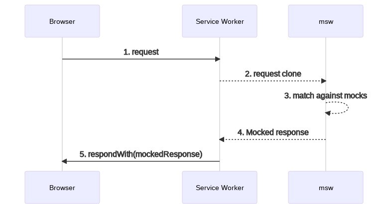
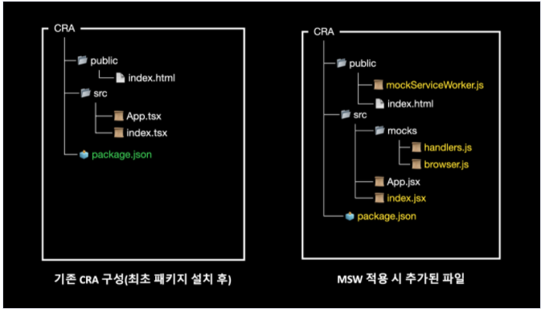
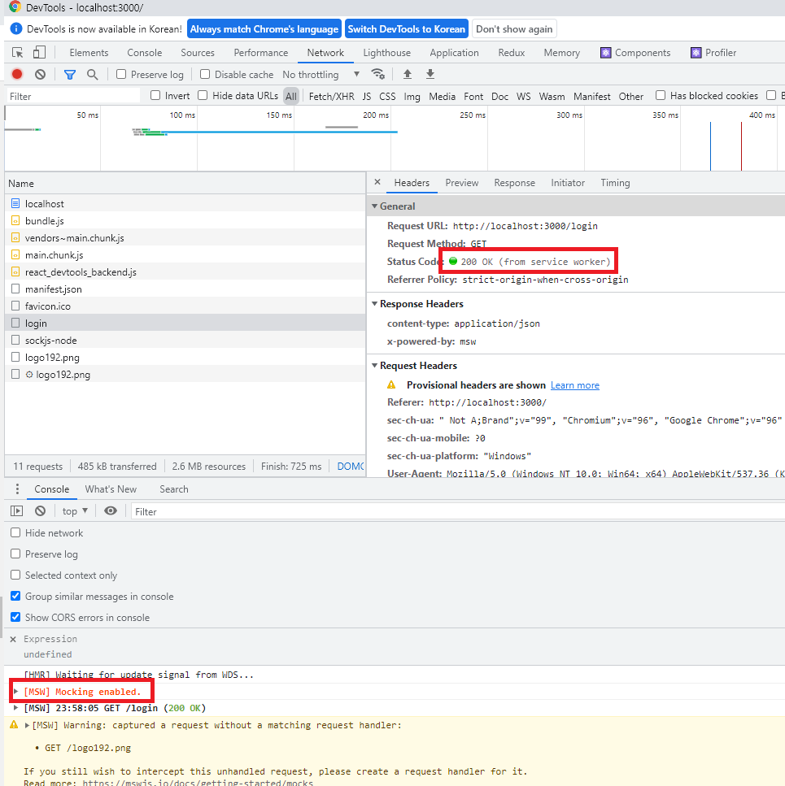

# Why You Should Adopt a Mocking Library

## Current Frontend Issues

- When developing a new feature
  - When frontend development proceeds in parallel with backend API work
  - Frontend work items
    - Define the spec after discussing the API interface with the backend developer
    - Until the mocking data is ready, create sample data to build the screen components
      - To test against the planning/design mockups, generate sample data that matches the required conditions
- When modifying an existing feature
  - Frontend work items
    - No API integration is possible until the backend developer provides the real API
    - It is hard to analyze based only on the screens shown in the design mockups and planning documents (the screen changes depending on state values/data)
      - To test against the planning/design mockups, generate sample data that matches the required conditions
- Conclusion
  - Whether developing a new or existing feature, until the backend mock/real API is available, sample data is created within the implemented code to run tests
    - If the sample data/integration code is accidentally not removed, it leads to code errors and degraded service quality.
    - When the mock/real API is integrated near the end of development, testing across various situations is not carried out comprehensively, overloading the frontend workload
  - This results in poor development scheduling and poor code quality.

## Why does this happen?

### When frontend development proceeds in parallel with backend API work

- Since planning, design/BE/FE development usually proceed simultaneously, the frontend—which handles the endpoint at the completion stage of the project—faces time pressure and difficulties in progress as it has to handle API integration, sample data creation, testing, and so on

### When you have to understand a feature in order to modify an already developed screen

- When planning/design/development specifications are insufficient or the responsible person is absent
  - There are many obstacles to development, such as creating sample data to understand the feature and inquiring with the backend about the API

## What are we trying to solve on the frontend?

### When frontend development proceeds in parallel with backend API work

- It would be great to develop in parallel by conforming to the API interface, without adding/modifying sample data in the actual implementation code.
  - In particular, it would be great if the real API could be integrated with as few problems as possible.
- It would be great to finish the actual frontend development before the API development is complete.

### When you have to understand a feature in order to modify an already developed screen (when developing/testing a screen dependent on a backend API)

- It would be great to be able to test the screen without changing/adding to the already implemented code.
- It would be great to build a Mocking Server to reduce the pending time of requests to the backend for API testing.

# Let's Build a Mock Server on the Frontend

Let's adopt the MSW (Mock Service Worker) library to improve the currently problematic process.

Let's build a Mock Server based on the API spec agreed upon with the backend developer.

## Other Mock Libraries Compared

I also reviewed other mocking libraries, but I chose the MSW library because of its low entry barrier, quick adoption, and GraphQL support.

- sinon
  - A library that helps with JavaScript testing
  - Provides various features such as Spies, Stubs, Mocks, and more
  - [Sinon.JS - Standalone test fakes, spies, stubs and mocks for JavaScript. Works with any unit testing framework.](https://sinonjs.org/#get-started)
- nock
  - Used to define Mock data for HTTP requests on NodeJS
  - [npm: nock](https://www.npmjs.com/package/nock#node-version-support)

# What is MSW?

- MSW (short for Mock Service Worker, [https://mswjs.io](https://mswjs.io/)) is an API mocking library that intercepts server-bound network requests and returns a mocked response.
  - Service Worker: runs on a separate background thread isolated from the main thread
- With the MSW (Mock Service Worker) library, you can mock APIs at the network level without building a Mock server.
- Because MSW creates mock APIs based on Service Workers, it is not dependent on the many libraries or frameworks used on the frontend and works without compatibility issues.
- Mock API support: REST API, GraphQL API
- Supported environments: Browser, Node

MSW flow diagram



# A Development Workflow Using MSW

1. Requirements handed over by the planner/designer (kick-off sharing)
2. Discuss the API spec (interface) with the backend developer (hand over the FE API requirements)
3. API spec document provided
4. Build a mock server using the MSW library
5. Proceed with FE development (including API integration)
6. Replace the existing mock server when the backend developer provides the real API

# Advantages of MSW

- Quick adoption thanks to a low entry barrier
- Ability to mock network requests without a separate environment
- Ability to develop ahead of time at a high level of completeness, with no dependency on the API
- Can be used for debugging based on network state

# How to Use MSW

- MSW install
  ```bash
  $ npm install msw --save-dev
  # or
  $ yarn add msw --dev
  ```
- Define Mocks

  ```js
  // Create a mocks directory
  mkdir mocks

  // Create a mocks/handlers.js file
  touch mocks/handlers.js

  // Edit mocks/handlers.js
  import { rest } from 'msw';

  export const handlers = [
    rest.get('/web/login', async (req, res, ctx) => {
      return res(
        ctx.status(200), // Respond with a 200 status code
        ctx.json({
          status: 200, // api 응답값에 맞는 데이터로 변경
          data: {
            id: 'ffff',
            firstName: 'hong',
            lastName: 'seungah',
          },
        }),
      );
    }),
    rest.get('/web/:userId', async (req, res, ctx) => {
      const { userId } = req.params
      return res(
        ctx.status(200), // Respond with a 200 status code
        ctx.json({
          status: 200, // api 응답값에 맞는 데이터로 변경
          data: {
            id: userId,
            firstName: 'hong',
            lastName: 'seungah',
          },
        }),
      );
    }),
  ];
  ```

- Setup Mocks

  ```bash
  // create a public/mockServiceWorker.js
  npx msw init public/ --save
  ```

  

  ```js
  // Create a mocks/browser.js file
  touch mocks/browser.js

  import { setupWorker } from 'msw';
  import { handlers } from './handlers';

  export const worker = setupWorker(...handlers);

  // Start worker
  // index.js
  if (process.env.NODE_ENV === 'local') {
    const { worker } = require('./mocks/browser');
    // worker.start(); // default worker path
    worker.start({ // custom worker path
      serviceWorker: {
        url: '../../../public/mockServiceWorker.js',
      },
    });
  }
  ```

- Using MSW with Jest (test automation)

  - Wouldn't it also be possible to develop automated API tests ahead of time?

  ```js
  // jest-setup
  import { server } from '@mocks/server';

  beforeAll(() => server.listen());

  afterEach(() => server.resetHandlers());

  afterAll(() => server.close());

  // jest test
  mport { getFruits } from '@mocks/handlers/fruit';
  import { server } from '@mocks/server';

  describe('My Fruits', () => {
    it('사과, 바나나가 리스트에 포함되어 있어야 한다', async () => {
      // 과일 리스트를 보여주는 컴포넌트
      render(<FruitList />);

      expect(screen.getByText('사과')).toBeInTheDocument();
      expect(screen.getByText('바나나')).toBeInTheDocument();
    });

    it('과일 정보가 없으면 과일 없음 문구를 보여줘야 한다.', async () => {
      server.use(getFruits('Error'));

      // 과일 리스트를 보여주는 컴포넌트
      render(<FruitList />);

      expect(screen.getByText('과일 없음')).toBeInTheDocument();
    });
  });

  ```

- Using MSW with Storybook

  ```js
  yarn add -D msw-storybook-addon

  // preview
  import { addDecorator } from '@storybook/react';
  import { initializeWorker, mswDecorator } from 'msw-storybook-addon';

  initializeWorker();
  addDecorator(mswDecorator);

  // storybook component
  import { handlers } from '@mocks/handlers';
  import { Story } from '@storybook/react';
  import FruitList from '.';

  export default {
    title: 'Components/FruitList',
    component: FruitList,
  };

  const Template: Story = (args) => {

    return <FruitList {...args} />;
  };

  export const DefaultFruitList = Template.bind({});

  DefaultFruitList.args = {};
  DefaultFruitList.parameters = {
    msw: handlers,
  };

  ```

- life-cycle events
  The lifecycle event API is exposed through `.events`.

  - on: register to react to an event.
  - removeListener: remove a registered event
  - removeAllListeners: remove all registered events
    **Methods**

  ```js
  // on
  worker.events.on('request:start', req => {
    console.log(req.method, req.url.href);
  });

  // removeListener
  const listener = () => console.log('new request');
  worker.events.on('request:start', listener);
  worker.events.removeListener('request:start', listener);

  // removeAllListener
  worker.events.removeAllListeners();

  window.__mswStart = worker.start;
  window.__mswStop = worker.stop;
  ```

  **Events**

  ```js
  // request:start
  // 새 요청이 온 경우
  worker.events.on('request:start', (req) => {
    console.log('new request:', req.method, req.url.href)
  })

  // request:match
  ... 추후작업
  ```

- live msw On/Off
  ```js
  // src/mocks.js
  import { setupWorker } from 'msw';
  const worker = setupWorker(...mocks);
  // Start the worker by default
  worker.start();
  // Write the stop method on the window
  // to access during runtime.
  window.__mswStart = worker.start;
  window.__mswStop = worker.stop;
  ```
  - Calling window.\_\_mswStop() in the browser would disable the mocking for the current page.
- setupWorker(start)

  **start**

  - string (default: "/mockServiceWorker.js")
    Register a custom Service Worker URL.

  ```js
  const worker = setupWorker(...)
  worker.start({
    serviceWorker: {
      // Points to the custom location of the Service Worker file.
      url: '/assets/mockServiceWorker.js'
    }
  })

  ```

  **options**

  - RegistrationOptions
    Register custom Service Worker options.

  ```js

  // url에 /product 경로가 있는경우에 mock response를 받을 수 있다.
  const worker = setupWorker(...)
  worker.start({
    serviceWorker: {
      options: {
        // Narrow the scope of the Service Worker to intercept requests
        // only from pages under this path.
        scope: '/product'
      }
    }
  })

  ```

  **quiet**

  - boolean (default: *false*)
    Lets you turn the browser console logging on/off.

  ```js
  const worker = setupWorker(...)
  worker.start({
    quiet: true,
  })
  ```

  **resetHandlers**

  Removes handlers added at runtime.

  ```js
  worker.resetHandlers();
  ```

  **printHandlers**

  Makes the browser console log the currently requested APIs.

  ```js
  worker.printHandlers();
  ```

  **onUnhandledRequest**

  - "bypass" | "warn" | "error" | (req: MockedRequest) => void
  - (default: "warn")
    Specifies how to handle requests that are not added to a request handler
    [Untitled](https://www.notion.so/663ab8ffa37a4840838049736a50396c)

  ```js
  const worker = setupWorker(
    rest.get('/books', (req, res, ctx) => {
      return res(ctx.json({ title: 'The Lord of the Rings' }));
    }),
  );
  worker.start({
    onUnhandledRequest: 'warn',
    onUnhandledRequest: 'error',
    onUnhandledRequest: 'bypass',
  });
  ```

  Reference page: [https://mswjs.io/docs/api/setup-worker/start#onunhandledrequest](https://mswjs.io/docs/api/setup-worker/start#onunhandledrequest)

- setupWorker(use)

  **use**

  - Used to register a request handler after setupWorker is initialized.
  - If a handler is already registered, it is overridden by the request called in use.

  ```js
  // src/mocks.js
  import { setupWorker, rest } from 'msw';
  const worker = setupWorker(
    rest.get('/book/:bookId', (req, res, ctx) => {
      return res(ctx.json({ title: 'Lord of the Rings' }));
    }),
  );
  // Make the `worker` and `rest` references available globally,
  // so they can be accessed in both runtime and test suites.
  window.msw = {
    worker,
    rest,
  };
  ```

  ```js
  worker.use(
    rest.post('/book/:bookId/reviews', (req, res, ctx) => {
      return res(ctx.json({ success: true }));
    }),
  );
  ```

  Reference page: [https://mswjs.io/docs/api/setup-worker/start#onunhandledrequest](https://mswjs.io/docs/api/setup-worker/start#onunhandledrequest)

- Query parameters

  There are cases where each test needs to return a different response depending on the request parameters. You can access the parameters through the req object in the handler.

  ```js
  import { setupWorker, rest } from 'msw'
  const worker = setupWorker(
    rest.get('/products', (req, res, ctx) => {
      const productId = req.url.searchParams.get('id')
      return res(
        ctx.json({
          productId,
        }),
      )
    }),
  )
  worker.start()

  Body
  {
    // Where '123' is the value of `req.url.searchParams.get('id')`
    // parsed from the request URL.
    "productId": "123"
  }
  ```

  Reference page: [https://mswjs.io/docs/recipes/query-parameters](https://mswjs.io/docs/recipes/query-parameters)

- Response patching

  You can also compose a mocked response with data based on an actual request's response. In the handler, you send a request to the real server and then arbitrarily append information needed for debugging, etc., to the received data.

  ```js
  import { setupWorker, rest } from 'msw'

  const worker = setupWorker(
    rest.get('https://api.github.com/users/:username', async (req, res, ctx) => {
      // msw 핸들러에 가로챈 리퀘스트 정보로 살제 서버에 요청을 보낸다.
      // msw에서 정의한 핸들러에 매칭되는 것을 방지하기 위해 window.fetch가 아닌 ctx.fetch를 대신 사용한다.
      const originalResponse = await ctx.fetch(req)
      const originalResponseData = await originalResponse.json()

      return res(
        ctx.json({
          location: originalResponseData.location,
          firstName: 'Not the real first name',
        }),
      )
    }),
  )

  worker.start()

  Body
  {
    // Resolved from the original response
    "location": "San Francisco",
    "firstName": "Not the real first name"
  }
  ```

  Reference page: [https://mswjs.io/docs/recipes/response-patching](https://mswjs.io/docs/recipes/response-patching)

- Mocking error responses

  You can also compose a mocked response with data based on an actual request's response. In the handler, you send a request to the real server and then arbitrarily append information needed for debugging, etc., to the received data.

  ```js
  import { setupWorker, rest } from 'msw'
  const worker = setupWorker(
    rest.post('/login', (req, res, ctx) => {
      const { username } = req.body
      return res(
        // Send a valid HTTP status code
        ctx.status(403),
        // And a response body, if necessary
        ctx.json({
          errorMessage: `User '${username}' not found`,
        }),
      )
    }),
  )
  worker.start()

  // Response
  Body
  {
    "errorMessage": "User 'admin' not found"
  }
  ```

  Reference page: [https://mswjs.io/docs/recipes/response-patching](https://mswjs.io/docs/recipes/response-patching)

- Binary response type

  A BufferSource object can be returned as a response through the ctx.body function. With binary data support, you can send all kinds of media content (images, audio, documents) as mocked responses.

  ```js
  // mock server
  import { rest } from "msw";

  const image = 'https://upload.wikimedia.org/wikipedia/commons/thumb/a/a7/React-icon.svg/1200px-React-icon.svg.png';
  export const handlers = [
    rest.get("/image", async (req, res, ctx) => {
      const imageBuffer = await fetch(image).then((res) =>
        res.arrayBuffer(),
      )

      return res(
        ctx.set('Content-Length', imageBuffer.byteLength.toString()),
        ctx.set('Content-Type', 'image/png'),
        // Respond with the "ArrayBuffer".
        ctx.body(imageBuffer),
      )
    }),
  ];

  // client
  useEffect(() => {
      fetch("/login")
        .then((res) => res.json())
        // Update the state with the received response
        .then(setUserData)
        .catch((error) => console.log(error));

      fetch("/image")
      .then((res) => {
        return res.arrayBuffer();
      })
      .then((res) => {
        console.log(res);
      })
      .catch((error) => console.log(error));
    }, []);

  // Response
  Body
  {
    body: ReadableStream
    bodyUsed: false
    headers: Headers {}
    ok: true
    redirected: false
    status: 200
    statusText: "OK"
    type: "basic"
    url: "http://localhost:3001/image"
  }
  ```

  Reference page: [https://mswjs.io/docs/recipes/binary-response-type](https://mswjs.io/docs/recipes/binary-response-type)

- Custom response composition
  You can add custom response composition operations.

  ```js
  // src/mocks/handlers.js
  import { rest } from 'msw';
  import { delayedResponse } from './res/delayed-response';

  export const handlers = [
    rest.get('/delay', async (req, res, ctx) => {
      return delayedResponse(
        ctx.json({
          id: 'f79e82e8-c34a-4dc7-a49e-9fadc0979fda',
          firstName: 'hong',
          lastName: 'seungah',
        }),
      );
    }),
  ];

  // src/mocks/res/delayed-response.js
  import { createResponseComposition, context } from 'msw';
  export const delayedResponse = createResponseComposition(null, [
    context.delay(5000),
  ]);
  ```

  Reference page: [https://mswjs.io/docs/recipes/custom-response-composition](https://mswjs.io/docs/recipes/custom-response-composition)

# MSW Example Code

- fetch, axios

  ```js
  useEffect(() => {
    fetch('/web/apip/store/login')
      .then(res => res.json())
      .then(res => console.log(res))
      .catch(err => console.log(err));
  }, []);

  useEffect(() => {
    axios('/web/apip/store/login')
      .then(res => console.log(res.data))
      .catch(err => console.log(err));
  }, []);
  ```

- State management integration (reduxtoolkit)

  ```js
  export const fetchAsyncAction = createAsyncThunk(FETCH_ASYNC, async (args) => {
    try {
      const base = await axios.all([
        fetchLogin(),
      ]);
      return base;
    } catch (e) {}
  });

  [fetchAsyncAction.fulfilled]: (state, action) => {
    // 성공
    const [
      login,
    ] = action.payload;

    return {
      ...state,
      loading: false,
      error: false,
      data: {
        login: login.data,
      },
    };
  },
  ```

### Development Content/Results

[msw-sample.zip](./files/25/msw-sample.zip)



# Mocking Folder Structure

- Folder structure

  ```tsx
  mocks
   ┣ login // handlers group
   ┃ ┣ browser.js // browser enviroment
   ┃ ┣ index.js
   ┃ ┣ node.js // node enviroment
   ┃ ┗ loginHandlers.js
   ┣ fixtures // 모킹 데이터를 json으로 관리
   ┃ ┣ login
   ┃ ┃ ┣ index.js
   ┃ ┃ ┗ login.json
  ```

  - Handler management (mocks/~~)

    - Add folders according to the characteristics of the service

    ```json
    /* eslint-disable import/extensions */
    import { rest } from 'msw';
    import loginData from './login.json';

    export const loginHandlers = [
      rest.get('/login', (req, res, ctx) => {
        return res(
          ctx.status(200), // Respond with a 200 status code
          ctx.json(loginData),
        );
      }),
    ];
    ```

  - Mocking data management (mocks/fixtures)
    - Manage mocking data in JSON format
      - It is managed in JSON format so that you can copy/paste the response value as-is from the Network tab of Chrome DevTools and use it right away.
      - Common mocking work to be shared across storybook, jest, and cypress
    - Add mocking data folders according to the characteristics of the service
    ```json
    {
      "timestamp": 1663662614700,
      "status": 200,
      "code": "SUCCESS",
      "message": "OK",
      "data": {
        "login": {
          "id": 1
        }
      }
    }
    ```

# Storybook → Using MSW

- Install MSW and the addon
  ```bash
  npm i msw msw-storybook-addon -D
  or
  yarn add msw msw-storybook-addon -D
  ```
- Configure the addon

  - To initialize MSW in Storybook, you must add it to the ./storybook/preview.js decorator for MSW to work.

  ```tsx
  import { initialize, mswDecorator } from 'msw-storybook-addon';

  // Initialize MSW
  initialize();

  // Provide the MSW addon decorator globally
  export const decorators = [mswDecorator];
  ```

- Usage

  ```tsx
  import { rest } from 'msw';
  import { loginHandlers } from './loginHandlers';

  export const SuccessBehavior = () => <UserProfile />;

  SuccessBehavior.parameters = {
    msw: {
      handlers: loginHandlers,
    },
  };
  ```

# Jest → Using MSW

- Configure-server
  - Add the src/mock/server.js file
  ```bash
  touch src/mocks/server.js
  ```
  - Import setupServer from the msw package and connect the mocking handlers
  ```tsx
  // src/mocks/server.js
  import { setupServer } from 'msw/node';
  import { handlers } from './handlers';
  // This configures a request mocking server with the given request handlers.
  export const server = setupServer(...handlers);
  ```
- Setup

  - Modify the setupTests.js jest configuration file

  ```tsx
  // src/setupTests.js
  import { server } from './mocks/server.js';

  /* MSW mocking */
  // Establish API mocking before all tests.
  beforeAll(() => server.listen());

  // Reset any request handlers that we may add during the tests,
  // so they don't affect other tests.
  afterEach(() => server.resetHandlers());

  // Clean up after the tests are finished.
  afterAll(() => server.close());
  ```

# Cypress → Using Fixtures

- Configure the Fixtures folder

  ```tsx
  // cypress.config.ts

  export default defineConfig({
    e2e: {
      fixturesFolder: 'mocks/fixtures', // 지정된 mocking 폴더 경로 지정
  });
  ```

- Usage
  ```tsx
  cy.intercept('GET', 'login', { fixture: 'login/login.json' });
  ```

### References

- [https://blog.mathpresso.com/msw로-api-모킹하기-2d8a803c3d5c](https://blog.mathpresso.com/msw%EB%A1%9C-api-%EB%AA%A8%ED%82%B9%ED%95%98%EA%B8%B0-2d8a803c3d5c)
- [https://tech.kakao.com/2021/09/29/mocking-fe/](https://tech.kakao.com/2021/09/29/mocking-fe/)
- [https://mswjs.io/docs/](https://mswjs.io/docs/)
- [https://blog.rhostem.com/posts/2021-03-20-mock-service-worker](https://blog.rhostem.com/posts/2021-03-20-mock-service-worker)
- [https://blog.mathpresso.com/msw%EB%A1%9C-api-%EB%AA%A8%ED%82%B9%ED%95%98%EA%B8%B0-2d8a803c3d5c](https://blog.mathpresso.com/msw%EB%A1%9C-api-%EB%AA%A8%ED%82%B9%ED%95%98%EA%B8%B0-2d8a803c3d5c)
- [https://blog.mathpresso.com/msw%EB%A1%9C-api-%EB%AA%A8%ED%82%B9%ED%95%98%EA%B8%B0-2d8a803c3d5c](https://blog.mathpresso.com/msw%EB%A1%9C-api-%EB%AA%A8%ED%82%B9%ED%95%98%EA%B8%B0-2d8a803c3d5c)
- [https://storybook.js.org/addons/msw-storybook-addon](https://storybook.js.org/addons/msw-storybook-addon)
