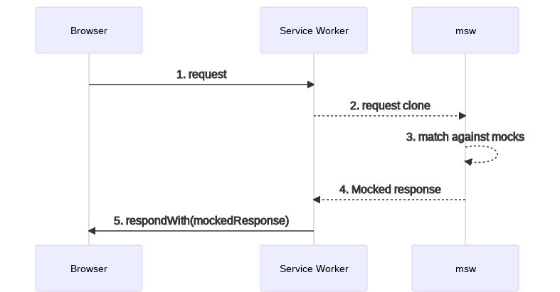
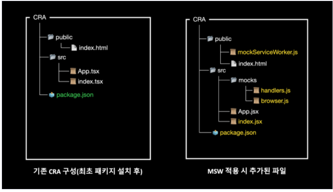
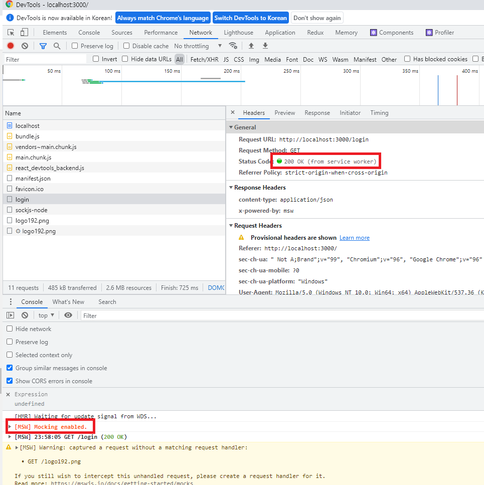

# Mocking 라이브러리를 도입해야하는 이유

## Frontend 현재 이슈

- 신규 개발 진행 시
  - 백엔드 API 작업과 동시에 FE 개발을 진행할 경우
  - FE 개발사항
    - 백엔드 개발자와 API 인터페이스 상의 후 스펙정의
    - mocking 데이터가 만들어지기 전까지는 샘플 데이터를 만들어서 화면 컴포넌트를 개발 진행
      - 기획/디자인 시안에 맞게 테스트를 위해서는 조건에 맞는 샘플 데이터를 생성
- 기존 기능을 변경 시
  - FE 개발사항
    - 백엔드 개발자분이 실 API를 만들어 주기 전까지는 API 연동불가
    - 디자인 시안, 기획문서에 나온 화면만으로 분석이 어려움(상태값/데이터에 따른 화면이 달라짐)
      - 기획/디자인 시안에 맞게 테스트를 위해서는 조건에 맞는 샘플 데이터를 생성
- 결론
  - 신규/기존 기능을 개발하던지, 백엔드 mock/실 api 나오기 전까지는 구현된 코드에 샘플데이터를 만들어서 테스트 진행
    - 실수로 샘플데이터/연동 코드를 지우지 않는 경우 코드 에러, 서비스 품질 안좋아짐.
    - 개발 막바지에 mock/실 API 연동 시 여러 상황에 대한 테스트가 전반적으로 이뤄지지 못해서 프론트엔드 업무가 과중됨
  - 실질적인 개발일정 수립 및 코드 품질이 좋지 않음.

## 이런 일은 왜 일어날까?

### **백엔드 API 작업과 동시에 FE 개발을 진행할 경우**

- 대부분의 개발 진행 시 기획,디자인/BE/FE 개발이 동시에 진행되다보니, 프로젝트 완성 단계의 엔드포인트 담당하는 프론트엔드는 API연동/샘플데이터 생성/테스트 등을 작업함으로써 시간적인 압박, 진행에 어려움 발생

### **기존에 개발된 화면 수정을 위해서 기능 파악 해야할 경우**

- 기획/디자인/개발 관련 정의서 미흡하거나 담당자가 부재일 경우
  - 기능 파악을 위해서 샘플데이터 생성, 백엔드에 API 문의 등 개발하는데 걸림돌이 많음

## FE에서 해결하고자 하는 점은 무엇일까?

### **백엔드 API 작업과 동시에 FE 개발을 진행할 경우**

- 실 구현 코드에 샘플데이터를 추가/수정하지 않고, API 인터페이스에 맞춰서 병행해서 개발이 가능하면 좋겠다.
  - 특히 실 API 연동 시 최대한 문제 없이 연동이 가능하면 좋겠다.
- API 개발이 완료되기 전에 프론트엔드 실 개발을 마무리 하면 좋을 것 같다.

### **기존에 개발된 화면 수정을 위해서 기능 파악 해야할 경우(백엔드 API 종속적인 화면을 개발/테스트 해야할 경우)**

- 기존 구현된 코드를 변경/추가 없이 화면 단 테스트가 가능하면 좋겠다.
- API 테스트를 위해서 백엔드에 요청하는 pending 시간을 줄이기 위한 Mocking Server를 구축하면 좋겠다.

# Frontend에 Mock Server를 구축해보자

현재 이슈가 되는 프로세스를 개선하기 위해서 MSW(Mock Service Worker) 라이브러리를 도입해보자.

백엔드 개발자와 협의된 API 스펙을 바탕으로 Mock Server를 구축해보자.

## 그외 비교 Mock Library

다른 Mocking 라이브러리도 검토해봤지만, 낮은 진입장벽으로 빠른 적용/GraphQL 지원이 가능한 MSW 라이브러리를 선택하였습니다.

- sinon
  - javascript 테스트를 도와 주는 라이브러리
  - Spies, Stubs, Mocks... 등의 여러가지 기능을 제공
  - [Sinon.JS - Standalone test fakes, spies, stubs and mocks for JavaScript. Works with any unit testing framework.](https://sinonjs.org/#get-started)
- nock
  - NodeJS 기반에 HTTP 요청에 대해 Mock 데이터를 정의하는 용도
  - [npm: nock](https://www.npmjs.com/package/nock#node-version-support)

# MSW란?

- MSW(Mock Service Worker의 약자, [https://mswjs.io](https://mswjs.io/))는 API Mocking 라이브러리로 서버향의 네트워크 요청을 가로채서 모의 응답(Mocked response)을 보내주는 역할을 담당합니다.
  - Service Worker: 메인 스레드와 분리된 별도의 백그라운드 스레드에서 실행
- MSW(Mock Service Worker) 라이브러리를 통하면, Mock 서버를 구축하지 않아도 API를 네트워크 수준에서 Mocking 가능합니다.
- MSW는 Service Worker를 기반으로 모의 API를 만들어내기 때문에 다른 프론트엔드에서 사용하는 수많은 라이브러리나 프레임워크에 종속적이지 않고 호환성에 문제없이 동작합니다.
- Mock API 지원: REST API, GraphQL API
- 지원환경: Browser, Node

MSW 흐름도



# MSW 활용한 개발방식

1. 기획자/디자이너 요구사항 전달(kick off 공유)
2. 백엔드 개발자와 API 스펙(인터페이스) 협의(FE API 요구사항 전달)
3. API 스펙문서 제공
4. MSW 라이브러리를 이용한 목업 서버 구축
5. FE 개발 진행(API 연동도 진행)
6. 백엔드 개발자 실 API 제공 시 기존 목업서버와 교체

# MSW 장점

- 낮은 진입장벽으로 빠른 적용이 가능
- 별도의 환경 없이 네트워크 요청에 대한 모의 가능
- API에 종속성 없이 완성도 높은 수준의 사전 개발 가능
- 네트워크 상태에 따른 디버깅을 위해 활용 가능

# MSW 사용 방법

- MSW install
  ```bash
  $ npm install msw --save-dev
  # or
  $ yarn add msw --dev
  ```
- Define Mocks

  ```js
  // Create a mocks directory
  mkdir mocks

  // Create a mocks/handlers.js file
  touch mocks/handlers.js

  // Edit mocks/handlers.js
  import { rest } from 'msw';

  export const handlers = [
    rest.get('/web/login', async (req, res, ctx) => {
      return res(
        ctx.status(200), // Respond with a 200 status code
        ctx.json({
          status: 200, // api 응답값에 맞는 데이터로 변경
          data: {
            id: 'ffff',
            firstName: 'hong',
            lastName: 'seungah',
          },
        }),
      );
    }),
    rest.get('/web/:userId', async (req, res, ctx) => {
      const { userId } = req.params
      return res(
        ctx.status(200), // Respond with a 200 status code
        ctx.json({
          status: 200, // api 응답값에 맞는 데이터로 변경
          data: {
            id: userId,
            firstName: 'hong',
            lastName: 'seungah',
          },
        }),
      );
    }),
  ];
  ```

- Setup Mocks

  ```bash
  // create a public/mockServiceWorker.js
  npx msw init public/ --save
  ```

  

  ```js
  // Create a mocks/browser.js file
  touch mocks/browser.js

  import { setupWorker } from 'msw';
  import { handlers } from './handlers';

  export const worker = setupWorker(...handlers);

  // Start worker
  // index.js
  if (process.env.NODE_ENV === 'local') {
    const { worker } = require('./mocks/browser');
    // worker.start(); // default worker path
    worker.start({ // custom worker path
      serviceWorker: {
        url: '../../../public/mockServiceWorker.js',
      },
    });
  }
  ```

- jest에서 MSW 사용하기(테스트 자동화)

  - API 자동화 테스트도 미리 개발이 가능하지 않을까??

  ```js
  // jest-setup
  import { server } from '@mocks/server';

  beforeAll(() => server.listen());

  afterEach(() => server.resetHandlers());

  afterAll(() => server.close());

  // jest test
  mport { getFruits } from '@mocks/handlers/fruit';
  import { server } from '@mocks/server';

  describe('My Fruits', () => {
    it('사과, 바나나가 리스트에 포함되어 있어야 한다', async () => {
      // 과일 리스트를 보여주는 컴포넌트
      render(<FruitList />);

      expect(screen.getByText('사과')).toBeInTheDocument();
      expect(screen.getByText('바나나')).toBeInTheDocument();
    });

    it('과일 정보가 없으면 과일 없음 문구를 보여줘야 한다.', async () => {
      server.use(getFruits('Error'));

      // 과일 리스트를 보여주는 컴포넌트
      render(<FruitList />);

      expect(screen.getByText('과일 없음')).toBeInTheDocument();
    });
  });

  ```

- Storybook에서 MSW 사용하기

  ```js
  yarn add -D msw-storybook-addon

  // preview
  import { addDecorator } from '@storybook/react';
  import { initializeWorker, mswDecorator } from 'msw-storybook-addon';

  initializeWorker();
  addDecorator(mswDecorator);

  // storybook component
  import { handlers } from '@mocks/handlers';
  import { Story } from '@storybook/react';
  import FruitList from '.';

  export default {
    title: 'Components/FruitList',
    component: FruitList,
  };

  const Template: Story = (args) => {

    return <FruitList {...args} />;
  };

  export const DefaultFruitList = Template.bind({});

  DefaultFruitList.args = {};
  DefaultFruitList.parameters = {
    msw: handlers,
  };

  ```

- life-cycle events
  라이프사이클 이벤트 API는 .events에 의해서 노출됩니다.

  - on: event에 반응하기 위해서 등록한다.
  - removeListener: 등록한 이벤트 제거
  - removeAllListeners: 등록된 모든 이벤트 제거
    **Methods**

  ```js
  // on
  worker.events.on('request:start', req => {
    console.log(req.method, req.url.href);
  });

  // removeListener
  const listener = () => console.log('new request');
  worker.events.on('request:start', listener);
  worker.events.removeListener('request:start', listener);

  // removeAllListener
  worker.events.removeAllListeners();

  window.__mswStart = worker.start;
  window.__mswStop = worker.stop;
  ```

  **Events**

  ```js
  // request:start
  // 새 요청이 온 경우
  worker.events.on('request:start', (req) => {
    console.log('new request:', req.method, req.url.href)
  })

  // request:match
  ... 추후작업
  ```

- live msw On/Off
  ```js
  // src/mocks.js
  import { setupWorker } from 'msw';
  const worker = setupWorker(...mocks);
  // Start the worker by default
  worker.start();
  // Write the stop method on the window
  // to access during runtime.
  window.__mswStart = worker.start;
  window.__mswStop = worker.stop;
  ```
  - Calling window.\_\_mswStop() in the browser would disable the mocking for the current page.
- setupWorker(start)

  **start**

  - string (default: "/mockServiceWorker.js")
    Custom Service Worker URL을 등록한다.

  ```js
  const worker = setupWorker(...)
  worker.start({
    serviceWorker: {
      // Points to the custom location of the Service Worker file.
      url: '/assets/mockServiceWorker.js'
    }
  })

  ```

  **options**

  - RegistrationOptions
    Custom Service Worker 옵션을 등록한다.

  ```js

  // url에 /product 경로가 있는경우에 mock response를 받을 수 있다.
  const worker = setupWorker(...)
  worker.start({
    serviceWorker: {
      options: {
        // Narrow the scope of the Service Worker to intercept requests
        // only from pages under this path.
        scope: '/product'
      }
    }
  })

  ```

  **quiet**

  - boolean (default: *false*)
    browser console loggin on/off가 가능하다.

  ```js
  const worker = setupWorker(...)
  worker.start({
    quiet: true,
  })
  ```

  **resetHandlers**

  런타임에 추가된 handler를 제거한다.

  ```js
  worker.resetHandlers();
  ```

  **printHandlers**

  browser console에 현재 요청한 API에 대한 콘솔이 찍히도록 한다.

  ```js
  worker.printHandlers();
  ```

  **onUnhandledRequest**

  - "bypass" | "warn" | "error" | (req: MockedRequest) => void
  - (default: "warn")
    요청 핸들러에 추가되지 않는 요청을 처리하는 방법 지정
    [제목 없음](https://www.notion.so/663ab8ffa37a4840838049736a50396c)

  ```js
  const worker = setupWorker(
    rest.get('/books', (req, res, ctx) => {
      return res(ctx.json({ title: 'The Lord of the Rings' }));
    }),
  );
  worker.start({
    onUnhandledRequest: 'warn',
    onUnhandledRequest: 'error',
    onUnhandledRequest: 'bypass',
  });
  ```

  참고페이지: [https://mswjs.io/docs/api/setup-worker/start#onunhandledrequest](https://mswjs.io/docs/api/setup-worker/start#onunhandledrequest)

- setupWorker(use)

  **use**

  - setupWorker 초기화 이후에 Request handler를 등록하기 위해 사용됩니다.
  - 기존에 handler가 등록되어 있다면, use에 호출된 request로 override 된다.

  ```js
  // src/mocks.js
  import { setupWorker, rest } from 'msw';
  const worker = setupWorker(
    rest.get('/book/:bookId', (req, res, ctx) => {
      return res(ctx.json({ title: 'Lord of the Rings' }));
    }),
  );
  // Make the `worker` and `rest` references available globally,
  // so they can be accessed in both runtime and test suites.
  window.msw = {
    worker,
    rest,
  };
  ```

  ```js
  worker.use(
    rest.post('/book/:bookId/reviews', (req, res, ctx) => {
      return res(ctx.json({ success: true }));
    }),
  );
  ```

  참고페이지: [https://mswjs.io/docs/api/setup-worker/start#onunhandledrequest](https://mswjs.io/docs/api/setup-worker/start#onunhandledrequest)

- Query paramters

  테스트마다 리퀘스트 파라미터에 따라 다른 리스펀스를 보내줘야 하는 경우가 있다. 핸들러에서 req 객체를 통해 파라미터에 접근 가능하다.

  ```js
  import { setupWorker, rest } from 'msw'
  const worker = setupWorker(
    rest.get('/products', (req, res, ctx) => {
      const productId = req.url.searchParams.get('id')
      return res(
        ctx.json({
          productId,
        }),
      )
    }),
  )
  worker.start()

  Body
  {
    // Where '123' is the value of `req.url.searchParams.get('id')`
    // parsed from the request URL.
    "productId": "123"
  }
  ```

  참고페이지: [https://mswjs.io/docs/recipes/query-parameters](https://mswjs.io/docs/recipes/query-parameters)

- Response patching

  모의 응답(mocked response)를 실제 리퀘스트의 응답에 기반한 데이터로 구성할 수도 있다. 핸들러에서 실제 서버에 리퀘스트를 보낸 후 받은 데이터에 디버깅 등에 필요한 정보를 임의로 덧붙이는 방식이다.

  ```js
  import { setupWorker, rest } from 'msw'

  const worker = setupWorker(
    rest.get('https://api.github.com/users/:username', async (req, res, ctx) => {
      // msw 핸들러에 가로챈 리퀘스트 정보로 살제 서버에 요청을 보낸다.
      // msw에서 정의한 핸들러에 매칭되는 것을 방지하기 위해 window.fetch가 아닌 ctx.fetch를 대신 사용한다.
      const originalResponse = await ctx.fetch(req)
      const originalResponseData = await originalResponse.json()

      return res(
        ctx.json({
          location: originalResponseData.location,
          firstName: 'Not the real first name',
        }),
      )
    }),
  )

  worker.start()

  Body
  {
    // Resolved from the original response
    "location": "San Francisco",
    "firstName": "Not the real first name"
  }
  ```

  참고페이지: [https://mswjs.io/docs/recipes/response-patching](https://mswjs.io/docs/recipes/response-patching)

- Mocking error responses

  모의 응답(mocked response)를 실제 리퀘스트의 응답에 기반한 데이터로 구성할 수도 있다. 핸들러에서 실제 서버에 리퀘스트를 보낸 후 받은 데이터에 디버깅 등에 필요한 정보를 임의로 덧붙이는 방식이다.

  ```js
  import { setupWorker, rest } from 'msw'
  const worker = setupWorker(
    rest.post('/login', (req, res, ctx) => {
      const { username } = req.body
      return res(
        // Send a valid HTTP status code
        ctx.status(403),
        // And a response body, if necessary
        ctx.json({
          errorMessage: `User '${username}' not found`,
        }),
      )
    }),
  )
  worker.start()

  // Response
  Body
  {
    "errorMessage": "User 'admin' not found"
  }
  ```

  참고페이지: [https://mswjs.io/docs/recipes/response-patching](https://mswjs.io/docs/recipes/response-patching)

- Binary response type

  BufferSource 객체는 해당 버퍼를 ctx.body 함수로 응답할 수 있습니다. 바이너리 데이터 지원으로 모든 종류의 미디어 콘텐츠(이미지, 오디오, 문서)를 모의 응답으로 보낼 수 있습니다.

  ```js
  // mock server
  import { rest } from "msw";

  const image = 'https://upload.wikimedia.org/wikipedia/commons/thumb/a/a7/React-icon.svg/1200px-React-icon.svg.png';
  export const handlers = [
    rest.get("/image", async (req, res, ctx) => {
      const imageBuffer = await fetch(image).then((res) =>
        res.arrayBuffer(),
      )

      return res(
        ctx.set('Content-Length', imageBuffer.byteLength.toString()),
        ctx.set('Content-Type', 'image/png'),
        // Respond with the "ArrayBuffer".
        ctx.body(imageBuffer),
      )
    }),
  ];

  // client
  useEffect(() => {
      fetch("/login")
        .then((res) => res.json())
        // Update the state with the received response
        .then(setUserData)
        .catch((error) => console.log(error));

      fetch("/image")
      .then((res) => {
        return res.arrayBuffer();
      })
      .then((res) => {
        console.log(res);
      })
      .catch((error) => console.log(error));
    }, []);

  // Response
  Body
  {
    body: ReadableStream
    bodyUsed: false
    headers: Headers {}
    ok: true
    redirected: false
    status: 200
    statusText: "OK"
    type: "basic"
    url: "http://localhost:3001/image"
  }
  ```

  참고페이지: [https://mswjs.io/docs/recipes/binary-response-type](https://mswjs.io/docs/recipes/binary-response-type)

- Custom response composition
  사용자 정의 응답 구성 작업을 추가가 가능합니다.

  ```js
  // src/mocks/handlers.js
  import { rest } from 'msw';
  import { delayedResponse } from './res/delayed-response';

  export const handlers = [
    rest.get('/delay', async (req, res, ctx) => {
      return delayedResponse(
        ctx.json({
          id: 'f79e82e8-c34a-4dc7-a49e-9fadc0979fda',
          firstName: 'hong',
          lastName: 'seungah',
        }),
      );
    }),
  ];

  // src/mocks/res/delayed-response.js
  import { createResponseComposition, context } from 'msw';
  export const delayedResponse = createResponseComposition(null, [
    context.delay(5000),
  ]);
  ```

  참고페이지: [https://mswjs.io/docs/recipes/custom-response-composition](https://mswjs.io/docs/recipes/custom-response-composition)

# MSW 사용예제코드

- fetch, axios

  ```js
  useEffect(() => {
    fetch('/web/apip/store/login')
      .then(res => res.json())
      .then(res => console.log(res))
      .catch(err => console.log(err));
  }, []);

  useEffect(() => {
    axios('/web/apip/store/login')
      .then(res => console.log(res.data))
      .catch(err => console.log(err));
  }, []);
  ```

- 상태관리 연동(reduxtoolkit)

  ```js
  export const fetchAsyncAction = createAsyncThunk(FETCH_ASYNC, async (args) => {
    try {
      const base = await axios.all([
        fetchLogin(),
      ]);
      return base;
    } catch (e) {}
  });

  [fetchAsyncAction.fulfilled]: (state, action) => {
    // 성공
    const [
      login,
    ] = action.payload;

    return {
      ...state,
      loading: false,
      error: false,
      data: {
        login: login.data,
      },
    };
  },
  ```

### 개발내용/결과

[msw-sample.zip](./files/25/msw-sample.zip)



### 참고사항

- [https://blog.mathpresso.com/msw로-api-모킹하기-2d8a803c3d5c](https://blog.mathpresso.com/msw%EB%A1%9C-api-%EB%AA%A8%ED%82%B9%ED%95%98%EA%B8%B0-2d8a803c3d5c)
- [https://tech.kakao.com/2021/09/29/mocking-fe/](https://tech.kakao.com/2021/09/29/mocking-fe/)
- [https://mswjs.io/docs/](https://mswjs.io/docs/)
- [https://blog.rhostem.com/posts/2021-03-20-mock-service-worker](https://blog.rhostem.com/posts/2021-03-20-mock-service-worker)
- [https://blog.mathpresso.com/msw%EB%A1%9C-api-%EB%AA%A8%ED%82%B9%ED%95%98%EA%B8%B0-2d8a803c3d5c](https://blog.mathpresso.com/msw%EB%A1%9C-api-%EB%AA%A8%ED%82%B9%ED%95%98%EA%B8%B0-2d8a803c3d5c)
