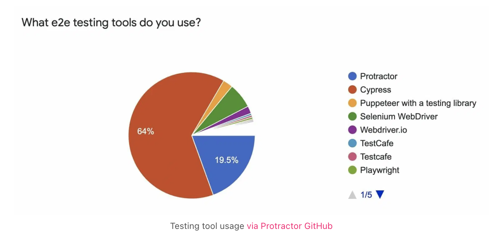
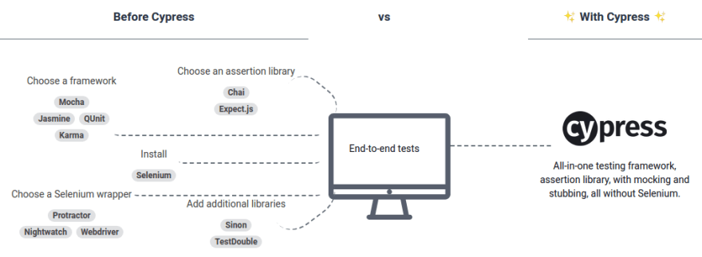
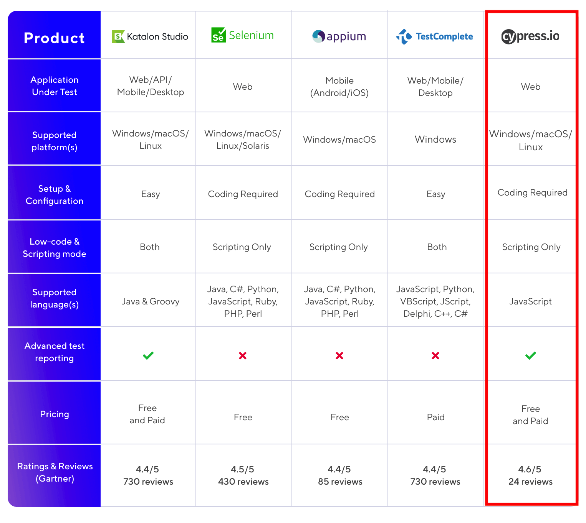
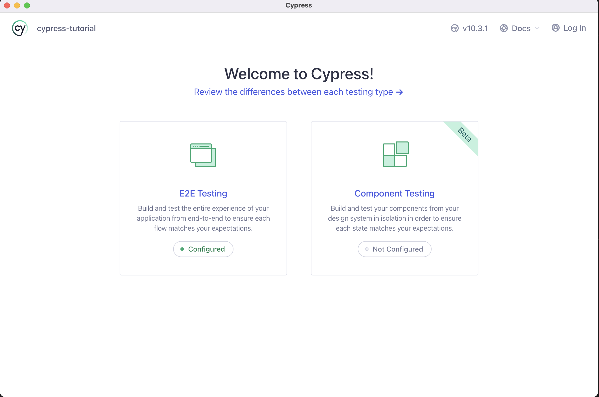
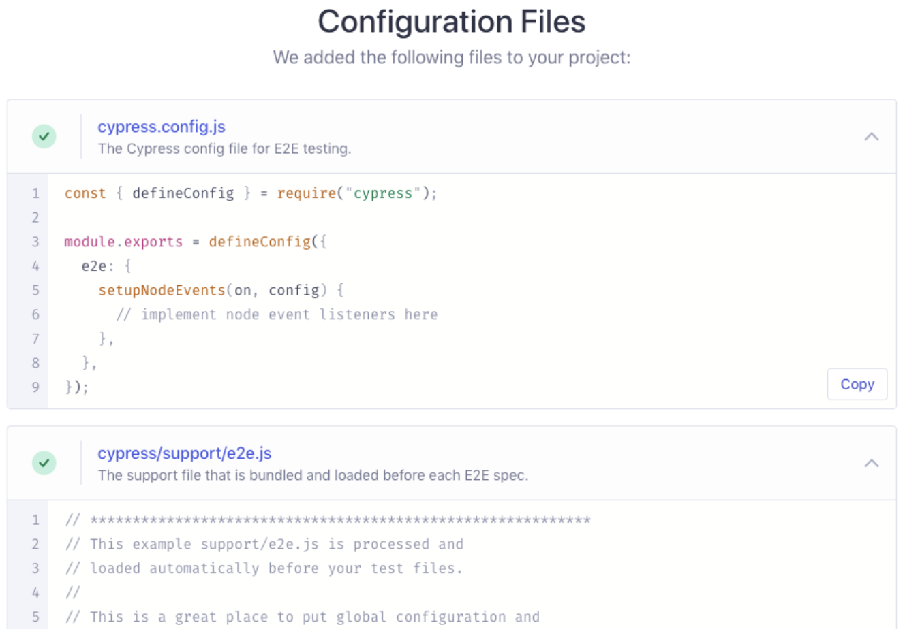
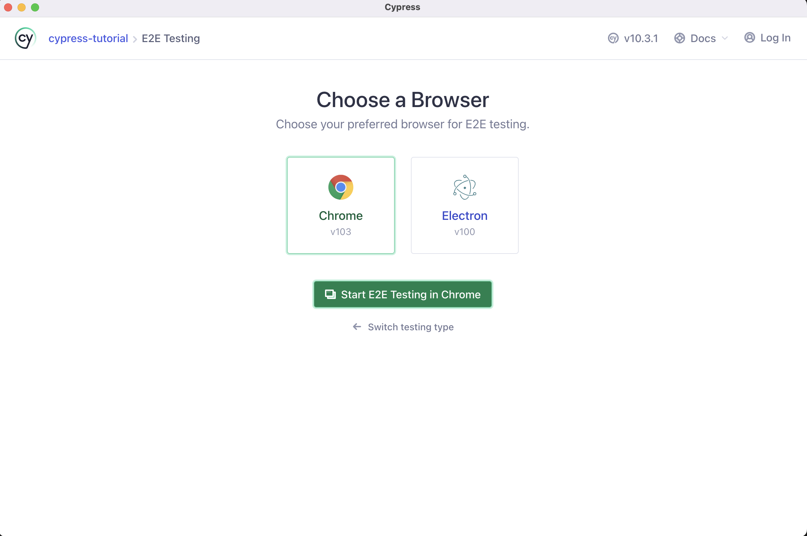
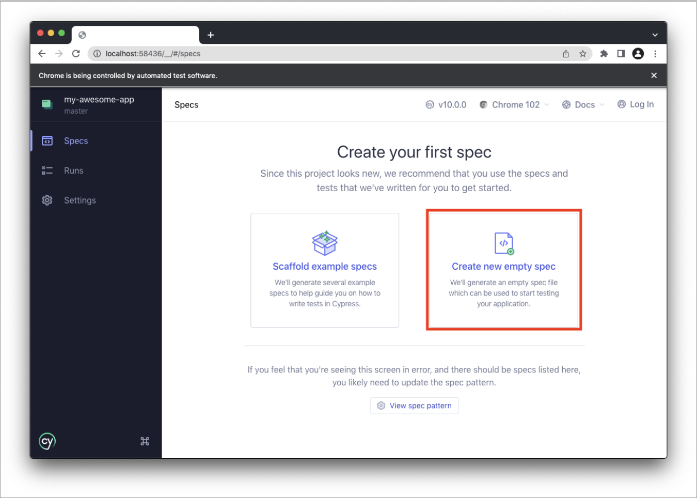

# What is E2E Testing?

- E2E testing is a way to test the final product from the user's perspective. It refers to **End-to-End Testing that verifies, from the user's point of view**, whether the desired text is displayed correctly on a page and whether the correct behavior occurs when a button is clicked.

# E2E Testing Considerations

- It tests between **Endpoints**, running tests under the assumption of **situations in which a real user uses the product** (writing scenarios from the user's perspective).
- In general, it **performs scenario and functional testing through the GUI** on the web or in apps.
- It **inspects the parts that are directly exposed to users**.
- It can even cover **user-perspective testing** that is impossible with unit tests.
- Passing the endpoint tests means the feature works well, so if you can't run every kind of test, **it's a good idea to at least run E2E Tests!**

# Advantages of Cypress

<details>
  <summary>e2e market share: Cypress 64%</summary>



</details>
<details>
  <summary>All-in-one test tool</summary>
  Before Cypress, end-to-end testing required several different tools, but with Cypress you can use these integrated capabilities as a single library.
  
  
</details>
<details>
  <summary>E2E test Top 5 Feature</summary>
  It provides most of the features you need, and in particular it uses JS, a language widely used in web development.



</details>

# Cypress Testing Case Studies from Other Companies

<details>
  <summary>CLASS101 Cypress Adoption Case</summary>
  As the CLASS101 service grew day by day, the codebase grew along with it, and the probability of bugs increased accordingly.
  **When the service was small, the existing QA process—such as having someone manually test the UI—was sufficient**, but by now **the scope and time required had grown significantly, so a more systematic and new process was needed**.
  There are many software testing approaches, such as unit testing and integration testing, but they decided to **build E2E tests that run in an environment as close as possible to the user's**.
  
  - Link: [Building a Cypress Test Environment](https://class101.dev/ko/blog/2020/06/24/han/)
  
</details>
<details>
  <summary>Kakao Cypress Adoption Case</summary>
  - For functional testing, they used the Visual Regression approach, which determines test success by comparing images.
  - For visual testing, they manipulate and verify the screen by traversing the DOM tree / performing visual test verification against two criteria.
  
  - Link: [https://tech.kakao.com/2022/02/25/angular-e2e-testing-2/](https://tech.kakao.com/2022/02/25/angular-e2e-testing-2/)
</details>
<details>
  <summary>Line Cypress Presentation Case</summary>
  By leveraging Cypress, they were able to solve the pain points of running existing automated tests (initial setup during development, increased execution time, difficulty writing and maintaining scripts) and build an effective [test harness](https://en.wikipedia.org/wiki/Test_harness) using limited time and resources.
  Cypress is a web-based End-to-End JavaScript testing framework. It does not depend on Selenium, and it is a tool that lets you write and operate assertions more concisely by directly leveraging [Mocha](https://mochajs.org/), [Chai](https://www.chaijs.com/), and so on,
  and it is a tool that controls network traffic and performs API testing more effectively.
  
  - Link: [https://engineering.linecorp.com/ko/blog/test-automation-workshop-2018-tokyo/#day1-4](https://engineering.linecorp.com/ko/blog/test-automation-workshop-2018-tokyo/#day1-4)
</details>
<details>
  <summary>NHN Cypress Introduction</summary>
  Because Cypress runs in the browser, it's easy to write code or debug while looking at the UI as it actually appears on screen.

- Link: [https://meetup.toast.com/posts/180](https://meetup.toast.com/posts/180)
</details>

# What Should You Consider When Testing with Cypress?

<details>
  <summary>Writing scenarios (Planning/QA/Test engineer)</summary>
    - Writing testing scenarios that account for the user interface (UI)
  - Writing test scenarios that can automate tests previously done manually (live-deployment sanity checks, basic verification)
  - Writing scenarios not only for the Happy case but also for the Bad case

```tsx
/*
 * 1. 테스트의 동작을 기술한다.
 * 2. 테스트 수행할 행동에 대해서 기술한다.
 * 3. https://example.cypress.io 방문한다.
 * 4. type 텍스트가 있는 엘리먼트를 클릭한다.(/commands/actions url 이동)
 * 5. 브라우저 주소창에 /commands/actions 매칭되는지 체크
 * 6. action-email 스타일 엘리먼트 선택한다.
 * 7. input 엘리먼트에 fake@email.com 입력한다.
 * 8. input 엘리먼트에 fake@email.com 값이 추가됐는지 여부를 체크한다.
 * 사용자 인터페이스(UI)를 고려한 시나리오 작성이 필수....
 */

describe('My First Test', () => {
  it('Gets, types and asserts', () => {
    cy.visit('https://example.cypress.io');

    cy.contains('type').click();

    // Should be on a new URL which
    // includes '/commands/actions'
    cy.url().should('include', '/commands/actions');

    // Get an input, type into it and verify
    // that the value has been updated
    cy.get('.action-email')
      .type('fake@email.com')
      .should('have.value', 'fake@email.com');
  });
});
```

</details>

<details>
  <summary>FE Developer</summary>
      - Installation

    ```bash
    yarn add -D cypress

    yarn cypress open
    ```

- **Write test code based on the scenarios written by Planning/QA**
- **Build and deploy the test code you wrote**
  - **Setting up Jenkins**
- An E2E dashboard to share with the QA team
  - Build a dashboard-style page where you can see pass/fail results

</details>

## Cypress Basics

- Install cypress
  ```bash
  npm install cypress --save-dev
  or
  yarn add cypress --save-dev
  ```
- Opening the App

  ```bash
  npx cypress open
  or
  yarn run cypress open
  or
  ./node_modules/.bin/cypress open
  or
  $(npm bin)/cypress open
  ```

  \***\*Adding npm Scripts\*\***

  ```bash
  {
    "scripts": {
      "cypress:open": "cypress open"
    }
  }

  npm run cypress:open
  or
  yarn run cypress:open
  ```

- CLI tools
  Choosing a Testing Type
  
  Quick Configuration
  
  Launching a Browser
  
  Add a test file
  - Folder path: cypress/e2e
  - Scaffold example specs: Adds multiple example test files
  - Create new empty spec: Creates a single empty example file
    
    write test
  - Derived from mocha: description, it
  - Derived from chai: expect
  ```tsx
  describe('My First Test', () => {
    it('Does not do much!', () => {
      expect(true).to.equal(false);
    });
  });
  ```
- TypeScript support
  install @type/node

  ```bash
  npm i -D @types/node
  or
  yarn add -D @types/node
  ```

  Add tsconfig.json

  ```bash
  tsc --init

  // Modify the properties that are commented out.
  {
    "compilerOptions": {
      "target": "es5",
      "lib": ["es5", "dom"],
      "types": ["cypress", "node"]
    },
    "include": ["**/*.ts"]
  }
  ```

  Configure ts-loader for ts → js transpilation

  ```jsx
  const wp = require('@cypress/webpack-preprocessor');

  module.exports = on => {
    const options = {
      webpackOptions: {
        resolve: {
          extensions: ['.ts', '.tsx', '.js'],
        },
        module: {
          rules: [
            {
              test: /\\.tsx?$/,
              loader: 'ts-loader',
              options: { transpileOnly: true },
            },
          ],
        },
      },
    };
    on('file:preprocessor', wp(options));
  };
  ```

  Providing type definitions for external libraries in a TypeScript environment

  ```jsx
  // cypress.d.ts
  import { mount } from "cypress/react";

  // Augment the Cypress namespace to include type definitions for
  // your custom command.
  // Alternatively, can be defined in cypress/support/component.d.ts
  // with a <reference path="./component" /> at the top of your spec.
  declare global {
    namespace Cypress {
      interface Chainable {
        mount: typeof mount;
      }
      interface Chainable<Subject> extends Cypress.Chainable {
        xpath<E extends Node = HTMLElement>(
          selector: string,
          options?: Partial<Loggable & Timeoutable>
        ): Chainable<JQuery<E>>;
      }
    }
  }

  // tsconfig.json
  "include": [
    "src",
    "./cypress.d.ts"
  ]
  ```

  write e2e typescript test file

  ```jsx
  // cypress/e2e/

  /// <reference types="cypress" />

  // Welcome to Cypress!
  //
  // This spec file contains a variety of sample tests
  // for a todo list app that are designed to demonstrate
  // the power of writing tests in Cypress.
  //
  // To learn more about how Cypress works and
  // what makes it such an awesome testing tool,
  // please read our getting started guide:
  // https://on.cypress.io/introduction-to-cypress

  describe('example to-do app', () => {
    beforeEach(() => {
      // Cypress starts out with a blank slate for each test
      // so we must tell it to visit our website with the `cy.visit()` command.
      // Since we want to visit the same URL at the start of all our tests,
      // we include it in our beforeEach function so that it runs before each test
      cy.visit('https://example.cypress.io/todo');
    });

    it('displays two todo items by default', () => {
      // We use the `cy.get()` command to get all elements that match the selector.
      // Then, we use `should` to assert that there are two matched items,
      // which are the two default items.
      cy.get('.todo-list li').should('have.length', 2);

      // We can go even further and check that the default todos each contain
      // the correct text. We use the `first` and `last` functions
      // to get just the first and last matched elements individually,
      // and then perform an assertion with `should`.
      cy.get('.todo-list li').first().should('have.text', 'Pay electric bill');
      cy.get('.todo-list li').last().should('have.text', 'Walk the dog');
    });

    it('can add new todo items', () => {
      // We'll store our item text in a variable so we can reuse it
      const newItem = 'Feed the cat';

      // Let's get the input element and use the `type` command to
      // input our new list item. After typing the content of our item,
      // we need to type the enter key as well in order to submit the input.
      // This input has a data-test attribute so we'll use that to select the
      // element in accordance with best practices:
      // https://on.cypress.io/selecting-elements
      cy.get('[data-test=new-todo]').type(`${newItem}{enter}`);

      // Now that we've typed our new item, let's check that it actually was added to the list.
      // Since it's the newest item, it should exist as the last element in the list.
      // In addition, with the two default items, we should have a total of 3 elements in the list.
      // Since assertions yield the element that was asserted on,
      // we can chain both of these assertions together into a single statement.
      cy.get('.todo-list li')
        .should('have.length', 3)
        .last()
        .should('have.text', newItem);
    });

    it('can check off an item as completed', () => {
      // In addition to using the `get` command to get an element by selector,
      // we can also use the `contains` command to get an element by its contents.
      // However, this will yield the <label>, which is lowest-level element that contains the text.
      // In order to check the item, we'll find the <input> element for this <label>
      // by traversing up the dom to the parent element. From there, we can `find`
      // the child checkbox <input> element and use the `check` command to check it.
      cy.contains('Pay electric bill')
        .parent()
        .find('input[type=checkbox]')
        .check();

      // Now that we've checked the button, we can go ahead and make sure
      // that the list element is now marked as completed.
      // Again we'll use `contains` to find the <label> element and then use the `parents` command
      // to traverse multiple levels up the dom until we find the corresponding <li> element.
      // Once we get that element, we can assert that it has the completed class.
      cy.contains('Pay electric bill')
        .parents('li')
        .should('have.class', 'completed');
    });

    context('with a checked task', () => {
      beforeEach(() => {
        // We'll take the command we used above to check off an element
        // Since we want to perform multiple tests that start with checking
        // one element, we put it in the beforeEach hook
        // so that it runs at the start of every test.
        cy.contains('Pay electric bill')
          .parent()
          .find('input[type=checkbox]')
          .check();
      });

      it('can filter for uncompleted tasks', () => {
        // We'll click on the "active" button in order to
        // display only incomplete items
        cy.contains('Active').click();

        // After filtering, we can assert that there is only the one
        // incomplete item in the list.
        cy.get('.todo-list li')
          .should('have.length', 1)
          .first()
          .should('have.text', 'Walk the dog');

        // For good measure, let's also assert that the task we checked off
        // does not exist on the page.
        cy.contains('Pay electric bill').should('not.exist');
      });

      it('can filter for completed tasks', () => {
        // We can perform similar steps as the test above to ensure
        // that only completed tasks are shown
        cy.contains('Completed').click();

        cy.get('.todo-list li')
          .should('have.length', 1)
          .first()
          .should('have.text', 'Pay electric bill');

        cy.contains('Walk the dog').should('not.exist');
      });

      it('can delete all completed tasks', () => {
        // First, let's click the "Clear completed" button
        // `contains` is actually serving two purposes here.
        // First, it's ensuring that the button exists within the dom.
        // This button only appears when at least one task is checked
        // so this command is implicitly verifying that it does exist.
        // Second, it selects the button so we can click it.
        cy.contains('Clear completed').click();

        // Then we can make sure that there is only one element
        // in the list and our element does not exist
        cy.get('.todo-list li')
          .should('have.length', 1)
          .should('not.have.text', 'Pay electric bill');

        // Finally, make sure that the clear button no longer exists.
        cy.contains('Clear completed').should('not.exist');
      });
    });
  });
  ```

- Folder structure

  ```bash
  E2E: // e2e tests
  /cypress.config.ts
  /cypress/fixtures/example.json
  /cypress/support/commands.ts
  /cypress/support/e2e.ts
  /cypress/e2e/*

  Component: // per-component tests
  /cypress.config.ts
  /cypress/fixtures/example.json
  /cypress/support/commands.ts
  /cypress/support/component.ts
  /cypress/support/component-index.html
  /cypress/components/*

  Both:
  /cypress.config.ts
  /cypress/fixtures/example.json
  /cypress/support/commands.ts
  /cypress/support/e2e.ts
  /cypress/support/component.ts
  /cypress/support/component-index.html
  ```

  - Fixture Files
    A Fixture is a file that defines the data to be used in a test ahead of time, and it must be added under the cypress/fixtures folder.

    ```tsx
    // cypress/e2e/spec.cy.js
    import user from '../fixtures/user.json'; // 미리 정의된 데이터

    it('loads the same object', () => {
      cy.fixture('user').then(userFixture => {
        expect(user, 'the same data').to.deep.equal(userFixture);
      });
    });
    ```

  - Asset Files
    - The folder where the resources generated while Cypress runs are stored
      Download Files (stores files downloaded while Cypress runs)
    ```bash
    /cypress
      /downloads
        - records.csv
    ```
    Screenshot Files
    ```bash
    /cypress
      /screenshots
        /app.cy.js
          - Navigates to main menu (failures).png
    ```
    Video Files
    ```bash
    /cypress
      /videos
        - app.cy.js.mp4
    ```
  - Plugins file
    Handles hooking into and extending Cypress's behavior.
    When exported, it is called every time you open the project with cypress open or cypress run.
    It must be added under cypress/plugin.

    ```bash
    const wp = require("@cypress/webpack-preprocessor");

    // on: a function used to register listeners on the various events that Cypress exposes
    // config: contains all the values passed to the project's browser
    module.exports = (on: any, config) => {
      const options = {
        webpackOptions: {
          resolve: {
            extensions: [".ts", ".tsx", ".js"],
          },
          module: {
            rules: [
              {
                test: /\\.tsx?$/,
                loader: "ts-loader",
                options: { transpileOnly: true },
              },
            ],
          },
        },
      };
      on("file:preprocessor", wp(options));
    };
    ```

  - Support file
    When you want to add files that are needed before the test files—such as adding a Cypress custom command—they must be added under cypress/support.

    ```bash
    Component:
    cypress/support/component.js
    cypress/support/component.jsx
    cypress/support/component.ts
    cypress/support/component.tsx

    E2E:
    cypress/support/e2e.js
    cypress/support/e2e.jsx
    cypress/support/e2e.ts
    cypress/support/e2e.tsx
    ```

- Supported extensions
  .js, .jsx, .ts, .tsx, .coffee, .cjsx

## Key Cypress Commands

- as
  Assigns an alias for later use.
  You can use `as` on top of commands like cy.get() and cy.wait(), and to use the alias you prefix it with @.
  ```tsx
  it('disables on click', () => {
    cy.get('button[type=submit]').as('submitBtn');
    cy.get('@submitBtn').click().should('be.disabled');
  });
  ```
- get
  A function used to get DOM elements (one or more).
  ```tsx
  cy.get('ul li:first').should('have.class', 'active');
  ```
- should, and
  Used the same way as assertion or equal in a typical test framework.
  ```tsx
  cy.get('.error').should('be.empty'); // Assert that '.error' is empty
  cy.contains('Login').should('be.visible'); // Assert that el is visible
  cy.get('button').should('have.class', 'active').and('not.be.disabled');
  ```
- visit
  A function used to visit a remote url.
  ```tsx
  cy.visit('/'); // visits the baseUrl
  cy.visit('index.html'); // visits the local file "index.html" if baseUrl is null
  cy.visit('http://localhost:3000'); // specify full URL if baseUrl is null or the domain is different the baseUrl
  cy.visit({
    url: '/pages/hello.html',
    method: 'GET',
  });
  ```
- fixture
  A function used to load a fixture that defines the data to be used in a test.
  ```tsx
  // cypress/e2e/spec.cy.js
  import user from '../fixtures/user.json';
  it('loads the same object', () => {
    cy.fixture('user').then(userFixture => {
      expect(user, 'the same data').to.deep.equal(userFixture);
    });
  });
  ```
- click
  A function that must be called when clicking a DOM element.
  ```tsx
  cy.get('.btn').click(); // Click on button
  cy.focused().click(); // Click on el with focus
  cy.contains('Welcome').click(); // Click on first el containing 'Welcome'
  ```
- type
  A function that must be called when typing on the keyboard into a DOM element.
  ```tsx
  cy.get('input').type('Hello, World'); // Type 'Hello, World' into the 'input'
  ```
- contains
  Gets the DOM element that contains the text.

  ```tsx
  // Correct Usage
  cy.get('.nav').contains('About'); // Yield el in .nav containing 'About'
  cy.contains('Hello'); // Yield first el in document containing 'Hello'

  // Incorrect Usage
  cy.title().contains('My App'); // Errors, 'title' does not yield DOM element
  cy.getCookies().contains('_key'); // Errors, 'getCookies' does not yield DOM element
  ```

- eq
  Called to get the element at a specific index in an array of elements.

  ```tsx
  // Correct Usage
  cy.get('tbody>tr').eq(0); // Yield first 'tr' in 'tbody'
  cy.get('ul>li').eq(4); // Yield fifth 'li' in 'ul'

  // Incorrect Usage
  cy.eq(0); // Errors, cannot be chained off 'cy'
  cy.getCookies().eq(4); // Errors, 'getCookies' does not yield DOM element
  ```

- filter
  Called to get the elements that match a specific selector.

  ```tsx
  // Correct Usage
  cy.get('td').filter('.users') // Yield all el's with class '.users'

  // Incorrect Usage
  cy.filter('.animated') // Errors, cannot be chained off 'cy'
  cy.clock().filter() // Errors, 'clock' does not yield DOM elements

  <ul>
    <li>Home</li>
    <li class="active">About</li>
    <li>Services</li>
    <li>Pricing</li>
    <li>Contact</li>
  </ul>
  // yields <li>About</li>
  cy.get('ul').find('>li').filter('.active')
  ```

- find
  Called when finding a child element by a specific selector.

  ```tsx
  // Correct Usage
  cy.get('.article').find('footer') // Yield 'footer' within '.article'

  // Incorrect Usage
  cy.find('.progress') // Errors, cannot be chained off 'cy'
  cy.exec('node start').find() // Errors, 'exec' does not yield DOM element

  <ul id="parent">
    <li class="first"></li>
    <li class="second"></li>
  </ul>
  // yields [<li class="first"></li>, <li class="second"></li>]
  cy.get('#parent').find('li')
  ```

- focus
  When giving focus to a DOM element.

  ```tsx
  // Correct Usage
  cy.get('input').first().focus(); // Focus on the first input

  // Incorrect Usage
  cy.focus('#search'); // Errors, cannot be chained off 'cy'
  cy.window().focus(); // Errors, 'window' does not yield DOM element
  ```

- clear
  Used to delete the data of an input or textarea element.

  ```tsx
  // Correct Usage
  cy.get('[type="text"]').clear(); // Clear text input
  cy.get('textarea').type('Hi!').clear(); // Clear textarea
  cy.focused().clear(); // Clear focused input/textarea

  // Incorrect Usage
  cy.clear(); // Errors, cannot be chained off 'cy'
  cy.get('nav').clear(); // Errors, 'get' doesn't yield input or textarea
  cy.clock().clear(); // Errors, 'clock' does not yield DOM elements
  ```

- focused
  Called to get the element currently in focus.
  ```tsx
  cy.focused(); // Yields the element currently in focus
  ```
- go
  Called when navigating forward/backward in the browser history.
  ```tsx
  cy.go('back'); // equivalent to clicking back button
  cy.go('forward'); // equivalent to clicking forward button
  cy.go(-1); // equivalent to clicking back button
  cy.go(1); // equivalent to clicking forward button
  ```
- each
  Called to iterate over an array or object that has a length property.
  Similar to JavaScript's map behavior.

  ```tsx
  // Correct Usage
  cy.get('ul>li').each(() => {...}) // Iterate through each 'li'
  cy.getCookies().each(() => {...}) // Iterate through each cookie

  cy.get('ul>li').each(($el, index, $list) => {
    // $el is a wrapped jQuery element
    if ($el.someMethod() === 'something') {
      // wrap this element so we can
      // use cypress commands on it
      cy.wrap($el).click()
    } else {
      // do something else
    }
  })

  // Incorrect Usage
  cy.each(() => {...})            // Errors, cannot be chained off 'cy'
  cy.clock().each(() => {...})    // Errors, 'clock' does not yield an array
  ```

- intercept
  Provides spying that calls the actual api,
  stubbing that returns a response with pre-built data,
  and modification that lets you alter the request or response.

  ```tsx
  cy.intercept('GET', `${BASE_URL}/posts`, { fixture: 'reviewList' }).as(
    'requestReviewData',
  );

  // Modifying an outgoing request
  // set the request body to something different
  // before it's sent to the destination
  cy.intercept('POST', '/login', req => {
    req.body = 'username=janelane&password=secret123';
  });

  // dynamically set the alias
  cy.intercept('POST', '/login', req => {
    req.alias = 'login';
  });
  ```

- blur
  Blurs the focused element.

  ```tsx
  // Correct Usage
  cy.get('[type="email"]').type('me@email.com').blur(); // Blur email input
  cy.get('[tabindex="1"]').focus().blur(); // Blur el with tabindex

  // Incorrect Usage
  cy.blur('input'); // Errors, cannot be chained off 'cy'
  cy.window().blur(); // Errors, 'window' does not yield DOM element
  ```

- check
  Used when the input element type is a checkbox or radio.

  ```tsx
  // Correct Usage
  cy.get('[type="checkbox"]').check(); // Check checkbox element
  cy.get('[type="radio"]').first().check(); // Check first radio element

  // Incorrect Usage
  cy.check('[type="checkbox"]'); // Errors, cannot be chained off 'cy'
  cy.get('p:first').check(); // Errors, '.get()' does not yield checkbox or radio
  ```

## Other Cypress Commands

- children
  Used to get the child elements of each DOM element (same behavior as jQuery .children()).

  ```tsx
  // Correct Usage
  <div>
    <ul>
      <li class="active">Unit Testing</li>
      <li>Integration Testing</li>
    </ul>
  </div>;

  // yields [
  //  <li class="active">Unit Testing</li>
  // ]
  cy.get('ul').children('.active');

  // Incorrect Usage
  cy.children(); // Errors, cannot be chained off 'cy'
  cy.clock().children(); // Errors, 'clock' does not yield DOM elements
  ```

- closet
  Called to find the closest ancestor of an element (same as jQuery's closest feature).

  ```tsx
  // Correct Usage
  cy.get('td').closest('.filled'); // Yield closest el with class '.filled'

  // Incorrect Usage
  cy.closest('.active'); // Errors, cannot be chained off 'cy'
  cy.clock().closest(); // Errors, 'clock' does not yield DOM elements
  ```

- dblclick
  Calls a DOM double-click.

  ```tsx
  // Correct Usage
  cy.get('button').dblclick(); // Double click on button
  cy.focused().dblclick(); // Double click on el with focus
  cy.contains('Welcome').dblclick(); // Double click on first el containing 'Welcome'

  // Incorrect Usage
  cy.dblclick('button'); // Errors, cannot be chained off 'cy'
  cy.window().dblclick(); // Errors, 'window' does not yield DOM element
  ```

- debug
  Sets a debugger and logs the result of the previous command.
  However, to reach the debugger breakpoint, the developer tools must be open.

  ```tsx
  // Correct Usage
  cy.debug().getCookie('app'); // Pause to debug at beginning of commands
  cy.get('nav').debug(); // Debug the `get` command's yield

  cy.get('.ls-btn').click({ force: true }).debug();
  ```

- document
  Called to get the window.document of the currently active page.
  ```tsx
  cy.document(); // yield the window.document object
  ```
- end
  Used to break the chain of a previous command.

  ```tsx
  // Correct Usage
  cy.contains('ul').end() // Yield 'null' instead of 'ul' element

  // Incorrect Usage
  cy.end() // Does not make sense to chain off 'cy'

  // 예제
  cy.contains('User: Cheryl')
    .click()
    .end() // yield null
    .contains('User: Charles')
    .click() // contains looks for content in document now

  -- 동일 --
  cy.contains('User: Cheryl').click()
  cy.contains('User: Charles').click() // contains looks for content in document now
  ```

- exec
  Runs a system command.
  ```tsx
  cy.exec('npm run build');
  ```
- first
  Called to get the first element among the selected elements.

  ```tsx
  // Correct Usage
  cy.get('nav a').first() // Yield first link in nav

  // Incorrect Usage
  cy.first() // Errors, cannot be chained off 'cy'
  cy.getCookies().first() // Errors, 'getCookies' does not yield DOM element

  <ul>
    <li class="one">Knick knack on my thumb</li>
    <li class="two">Knick knack on my shoe</li>
    <li class="three">Knick knack on my knee</li>
    <li class="four">Knick knack on my door</li>
  </ul>
  // yields <li class="one">Knick knack on my thumb</li>
  cy.get('li').first()
  ```

- hash
  Called to get the url hash value of the current page.

  ```tsx
  <ul id="users">
    <li>
      <a href="#/users/8fc45b67-d2e5-465a-b822-b281d9c8e4d1">Fred</a>
    </li>
  </ul>;

  cy.get('#users li').find('a').click();
  cy.hash().should('match', /users\/.+$/); // => true
  ```

Other APIs: [https://docs.cypress.io/api/commands/and](https://docs.cypress.io/api/commands/and)

## Example Code

- https://github.com/seungahhong/cypress-tutorial

# Expected Results

- Through automated testing, you can find issues (bugs) before deployment, which allows you to **improve the user experience**.
- Through basic user end-to-end testing, you can pursue **stabilization of the service**.
- You can raise the **reliability of the development code and improve code quality**.
- When adding a new feature, testing the existing features together makes it **possible to test for potential issues**.
- In the long run, you can **save time and cost**.

# References

- [https://katalon.com/resources-center/blog/automation-testing-tools](https://katalon.com/resources-center/blog/automation-testing-tools)
- [https://jellybeanz.medium.com/cypress-로-e2e-end-to-end-test-e243a2b16d95](https://jellybeanz.medium.com/cypress-%EB%A1%9C-e2e-end-to-end-test-e243a2b16d95)
- [https://velog.io/@averycode/Cypress-환경구축-React-Typescript](https://velog.io/@averycode/Cypress-%ED%99%98%EA%B2%BD%EA%B5%AC%EC%B6%95-React-Typescript)
- [https://www.cypress.io/blog/2021/04/06/cypress-component-testing-react/](https://www.cypress.io/blog/2021/04/06/cypress-component-testing-react/)
- [https://runebook.dev/ko/docs/cypress/-index-](https://runebook.dev/ko/docs/cypress/-index-)
