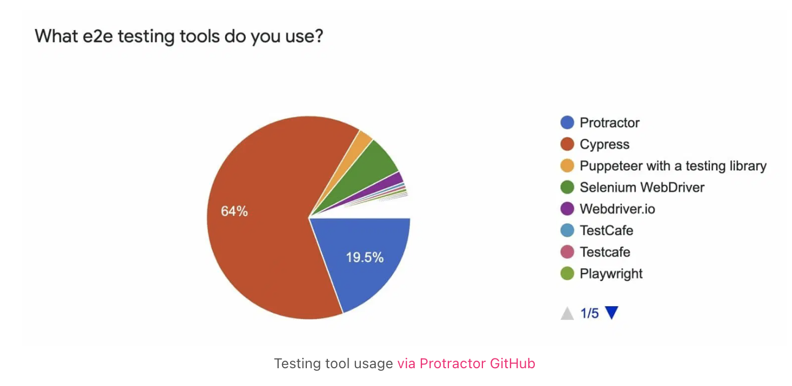
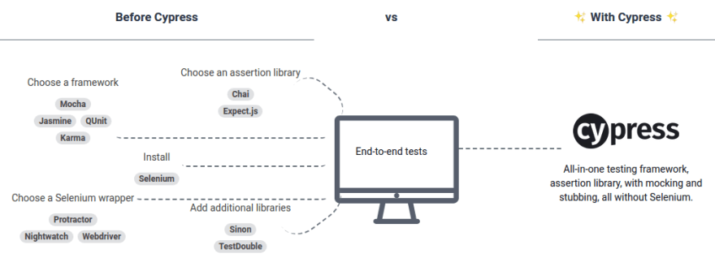
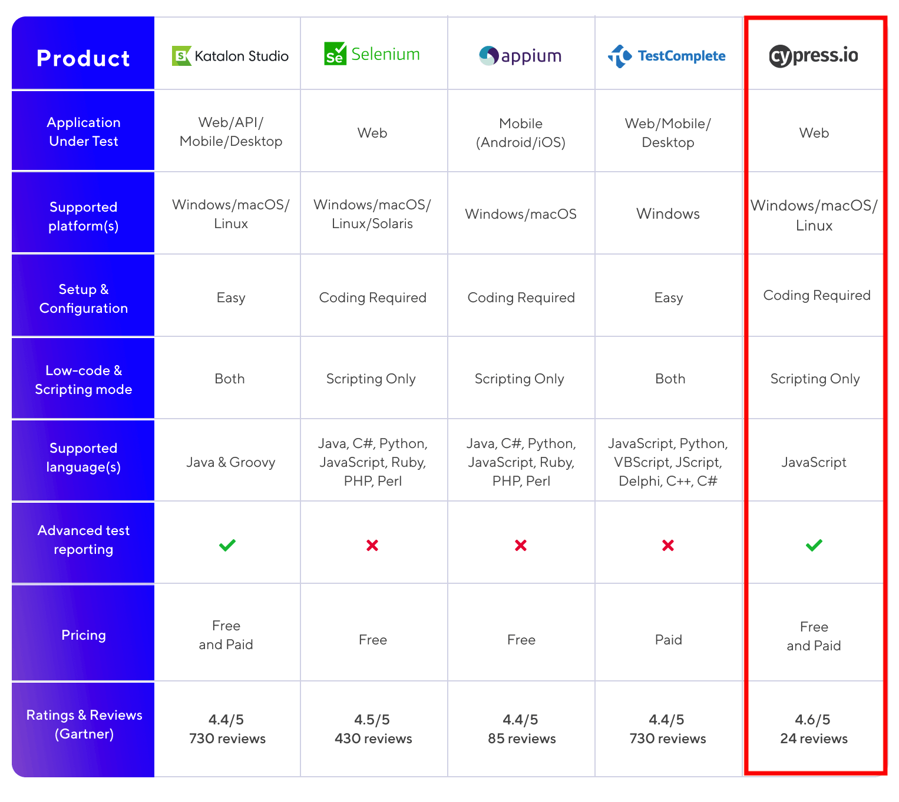
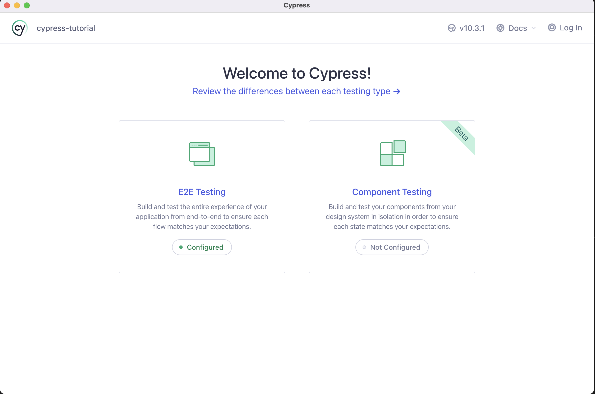
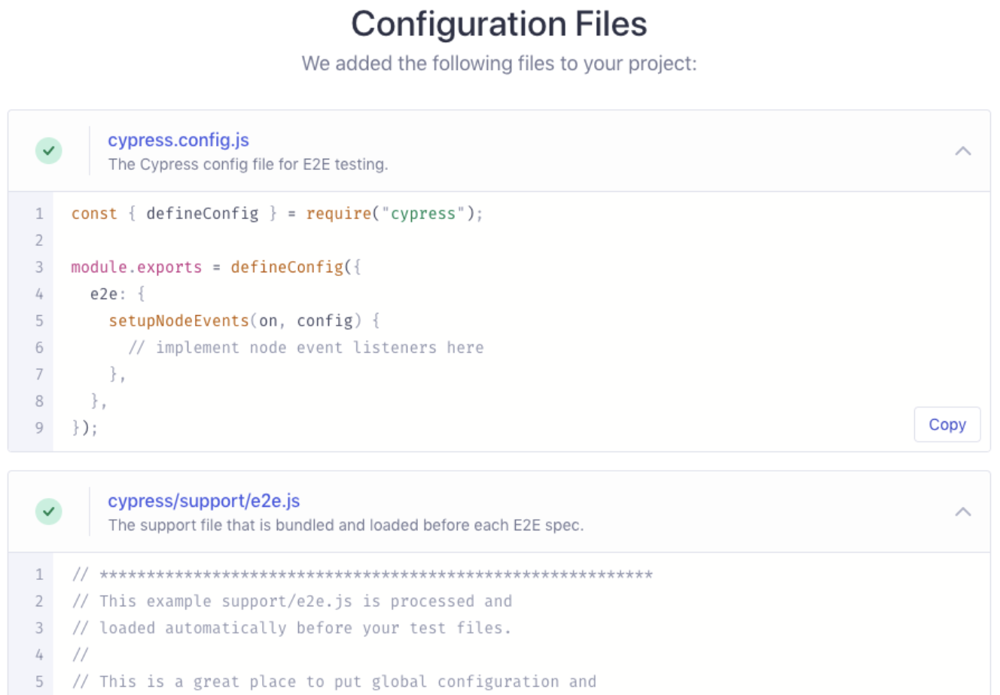
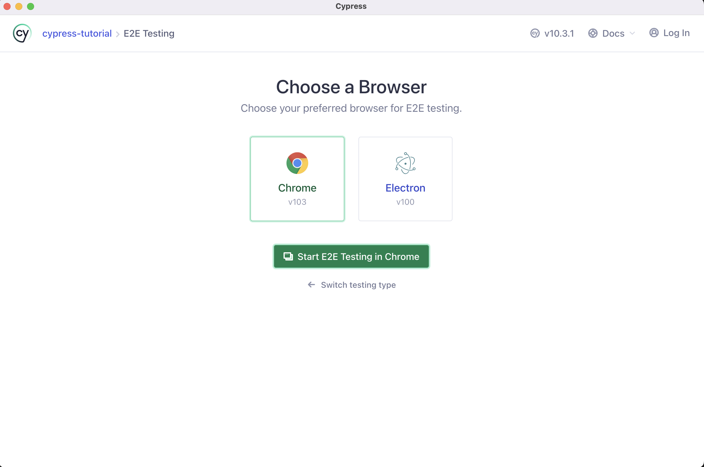
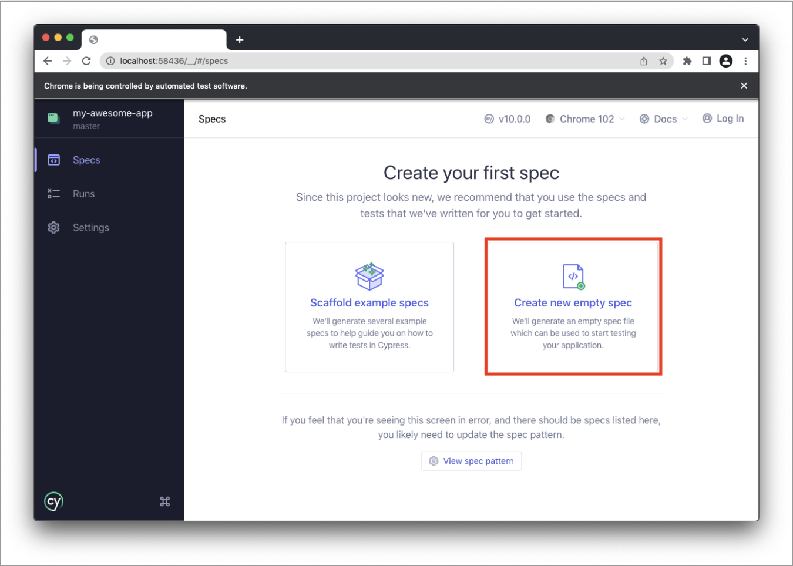

# E2E 테스트란?

- 최종 개발물을 사용자 관점에서 테스트 할 수 있는 방법으로써, 페이지에서 원하는 텍스트가 제대로 출력이 되는지 버튼 클릭 시 올바른 동작을 하는지를 **사용자 관점에서 테스트하는 End-to-End Testing** 을 의미합니다.

# E2E 테스트사항

- **Endpoint(종단)** 간 테스트로 **사용자의 입장에서 사용자가 사용하는 상황**을 가정하고 테스트를 수행한다.(사용자 관점의 시나리오 작성)
- 일반적으로 웹이나 어플 등에서 **GUI를 통해 시나리오, 기능 테스트 등을 수행**한다.
- **사용자에게 직접적으로 노출되는 부분을 점검**한다.
- 유닛 테스트로 불가능한 **사용자 관점의 테스트**까지 가능하다.
- Endpoint 테스트를 통과하면 기능이 잘 작동한다는 것이므로 모든 테스트를 할 수 없다면 **E2E Test 만이라도 하는 것이 좋다!**

# Cypress 장점

<details>
  <summary>e2e 점유율 : Cypress 64%</summary>



</details>
<details>
  <summary>All-in-one test tool</summary>
  cypress 이전에는 end-to-end 테스트 시 여러가지의 도구를 통해서 테스트 할 수 있었지만, cypress 사용하게 된다면 통합된 기능을 하나의 라이브러리로 사용가능
  
  
</details>
<details>
  <summary>E2E test Top 5 Feature</summary>
  대부분의 기능을 제공하고, 특히 웹 개발에서 널리 사용되는 JS 언어를 사용



</details>

# 타사 Cypress 테스트 사례

<details>
  <summary>CLASS101 Cypress 구축사례</summary>
  클래스101 서비스가 날마다 크고 있는만큼 코드의 규모도 커졌고, 그에 따라서 버그 발생확률도 높아졌습니다.
  **서비스 규모가 작을 땐 담당자가 직접 UI를 테스트하는 등 기존의 QA 프로세스로도 충분**했지만 이제는 **작업 범위와 시간이 많이 소요되기 때문에 더욱 체계적이고 새로운 프로세스가 필요**해졌습니다.
  소프트웨어 테스트에는 유닛 테스트, 통합 테스트 등 여러 방법이 있지만 **유저와 최대한 비슷한 환경에서 테스트를 진행하는 E2E 테스트를 구축**하기로 했습니다.
  
  - 링크: [Cypress 테스트 환경 구축하기](https://class101.dev/ko/blog/2020/06/24/han/)
  
</details>
<details>
  <summary>Kakao Cypress 구축사례</summary>
  - 기능적 테스트는 이미지 비교를 통해 테스트 성공 여부를 결정하는 Visual Regression 방식 사용
  - 시각적 테스트는 DOM 트리를 탐색을 통해 화면을 조작하고 검증/ 2가지의 기준을 가지고 시각적 테스트 검증
  
  - 링크: [https://tech.kakao.com/2022/02/25/angular-e2e-testing-2/](https://tech.kakao.com/2022/02/25/angular-e2e-testing-2/)
</details>
<details>
  <summary>Line Cypress 발표사례</summary>
  Cypress를 활용해 기존 자동화 테스트 운영의 애로사항(개발 초기 설정, 수행 시간 증가, 스크립트 작성 및 유지 보수의 어려움)을 해결하고, 한정된 시간과 자원을 활용해 효과적인 [테스트 하네스(test harness)](https://en.wikipedia.org/wiki/Test_harness)를 구성할 수 있었습니다.
  Cypress는 웹 기반의 End-to-End JavaScript testing 프레임워크로 Selenium에 의존하지 않으며, [Mocha](https://mochajs.org/)나 [Chai](https://www.chaijs.com/) 등을 직접 활용해 assertion을 보다 간결하게 작성하고 운용할 수 있는 특징을 가진 도구로써,
  네트워크 트래픽을 제어하거나 API 테스팅을 보다 효과적으로 수행하는 툴입니다.
  
  - 링크: [https://engineering.linecorp.com/ko/blog/test-automation-workshop-2018-tokyo/#day1-4](https://engineering.linecorp.com/ko/blog/test-automation-workshop-2018-tokyo/#day1-4)
</details>
<details>
  <summary>NHN Cypress 소개</summary>
  Cypress는 브라우저에서 실행되기 때문에 실제 화면에 표시된 UI를 보면서 코드를 작성하거나 디버깅이 용이합니다.

- 링크: [https://meetup.toast.com/posts/180](https://meetup.toast.com/posts/180)
</details>

# Cypress 테스팅 시 어떤걸 고민 해봐야 할까?

<details>
  <summary>시나리오 작성(기획/QA/테스트 엔지니어)</summary>
    - 사용자 인터페이스(UI)를 고려한 테스팅 시나리오 작성
  - 수동으로 했던 테스트를 자동화 할 수 있는 테스트 시나리오 작성(라이브 배포 sanity 검증, 기본적인 검증)
  - Happy 케이스 만이 아닌 Bad 케이스에 대한 시나리오 작성

```tsx
/*
 * 1. 테스트의 동작을 기술한다.
 * 2. 테스트 수행할 행동에 대해서 기술한다.
 * 3. https://example.cypress.io 방문한다.
 * 4. type 텍스트가 있는 엘리먼트를 클릭한다.(/commands/actions url 이동)
 * 5. 브라우저 주소창에 /commands/actions 매칭되는지 체크
 * 6. action-email 스타일 엘리먼트 선택한다.
 * 7. input 엘리먼트에 fake@email.com 입력한다.
 * 8. input 엘리먼트에 fake@email.com 값이 추가됐는지 여부를 체크한다.
 * 사용자 인터페이스(UI)를 고려한 시나리오 작성이 필수....
 */

describe('My First Test', () => {
  it('Gets, types and asserts', () => {
    cy.visit('https://example.cypress.io');

    cy.contains('type').click();

    // Should be on a new URL which
    // includes '/commands/actions'
    cy.url().should('include', '/commands/actions');

    // Get an input, type into it and verify
    // that the value has been updated
    cy.get('.action-email')
      .type('fake@email.com')
      .should('have.value', 'fake@email.com');
  });
});
```

</details>

<details>
  <summary>FE 개발자</summary>
      - 설치

    ```bash
    yarn add -D cypress

    yarn cypress open
    ```

- **기획/QA 작성한 시나리오를 바탕으로 테스트 코드 작성**
- **작성한 테스트 코드에 대한 빌드 및 배포**
  - **Setting up Jenkins**
- QA팀에 공유할 E2E 대쉬보드
  - 성공/실패 여부를 볼 수 있는 대쉬보드 형태의 페이지 구성

</details>

## Cypress 기본

- Install cypress
  ```bash
  npm install cypress --save-dev
  or
  yarn add cypress --save-dev
  ```
- Opening the App

  ```bash
  npx cypress open
  or
  yarn run cypress open
  or
  ./node_modules/.bin/cypress open
  or
  $(npm bin)/cypress open
  ```

  \***\*Adding npm Scripts\*\***

  ```bash
  {
    "scripts": {
      "cypress:open": "cypress open"
    }
  }

  npm run cypress:open
  or
  yarn run cypress:open
  ```

- CLI tools
  Choosing a Testing Type
  
  Quick Configuration
  
  Launching a Browser
  
  Add a test file
  - 폴더경로: cypress/e2e
  - Scaffold example specs:  여러개의 테스트 예제파일을 추가
  - Create new empty spec:  비어있는 예제파일 하나만 생성
    
    write test
  - mocha 유래: description, it
  - chai 유래: expect
  ```tsx
  describe('My First Test', () => {
    it('Does not do much!', () => {
      expect(true).to.equal(false);
    });
  });
  ```
- typescript 지원
  intstall @type/node

  ```bash
  npm i -D @types/node
  or
  yarn add -D @types/node
  ```

  tsconfig.json 추가

  ```bash
  tsc --init

  // 주석으로 되어 있는 속성들을 수정한다.
  {
    "compilerOptions": {
      "target": "es5",
      "lib": ["es5", "dom"],
      "types": ["cypress", "node"]
    },
    "include": ["**/*.ts"]
  }
  ```

  ts → js 트랜스파일링을 위한 ts-loader 설저

  ```jsx
  const wp = require('@cypress/webpack-preprocessor');

  module.exports = on => {
    const options = {
      webpackOptions: {
        resolve: {
          extensions: ['.ts', '.tsx', '.js'],
        },
        module: {
          rules: [
            {
              test: /\\.tsx?$/,
              loader: 'ts-loader',
              options: { transpileOnly: true },
            },
          ],
        },
      },
    };
    on('file:preprocessor', wp(options));
  };
  ```

  typescript 환경에서 외부라이브러리의 인터페이스 제공

  ```jsx
  // cypress.d.ts
  import { mount } from "cypress/react";

  // Augment the Cypress namespace to include type definitions for
  // your custom command.
  // Alternatively, can be defined in cypress/support/component.d.ts
  // with a <reference path="./component" /> at the top of your spec.
  declare global {
    namespace Cypress {
      interface Chainable {
        mount: typeof mount;
      }
      interface Chainable<Subject> extends Cypress.Chainable {
        xpath<E extends Node = HTMLElement>(
          selector: string,
          options?: Partial<Loggable & Timeoutable>
        ): Chainable<JQuery<E>>;
      }
    }
  }

  // tsconfig.json
  "include": [
    "src",
    "./cypress.d.ts"
  ]
  ```

  write e2e typescript test file

  ```jsx
  // cypress/e2e/

  /// <reference types="cypress" />

  // Welcome to Cypress!
  //
  // This spec file contains a variety of sample tests
  // for a todo list app that are designed to demonstrate
  // the power of writing tests in Cypress.
  //
  // To learn more about how Cypress works and
  // what makes it such an awesome testing tool,
  // please read our getting started guide:
  // https://on.cypress.io/introduction-to-cypress

  describe('example to-do app', () => {
    beforeEach(() => {
      // Cypress starts out with a blank slate for each test
      // so we must tell it to visit our website with the `cy.visit()` command.
      // Since we want to visit the same URL at the start of all our tests,
      // we include it in our beforeEach function so that it runs before each test
      cy.visit('https://example.cypress.io/todo');
    });

    it('displays two todo items by default', () => {
      // We use the `cy.get()` command to get all elements that match the selector.
      // Then, we use `should` to assert that there are two matched items,
      // which are the two default items.
      cy.get('.todo-list li').should('have.length', 2);

      // We can go even further and check that the default todos each contain
      // the correct text. We use the `first` and `last` functions
      // to get just the first and last matched elements individually,
      // and then perform an assertion with `should`.
      cy.get('.todo-list li').first().should('have.text', 'Pay electric bill');
      cy.get('.todo-list li').last().should('have.text', 'Walk the dog');
    });

    it('can add new todo items', () => {
      // We'll store our item text in a variable so we can reuse it
      const newItem = 'Feed the cat';

      // Let's get the input element and use the `type` command to
      // input our new list item. After typing the content of our item,
      // we need to type the enter key as well in order to submit the input.
      // This input has a data-test attribute so we'll use that to select the
      // element in accordance with best practices:
      // https://on.cypress.io/selecting-elements
      cy.get('[data-test=new-todo]').type(`${newItem}{enter}`);

      // Now that we've typed our new item, let's check that it actually was added to the list.
      // Since it's the newest item, it should exist as the last element in the list.
      // In addition, with the two default items, we should have a total of 3 elements in the list.
      // Since assertions yield the element that was asserted on,
      // we can chain both of these assertions together into a single statement.
      cy.get('.todo-list li')
        .should('have.length', 3)
        .last()
        .should('have.text', newItem);
    });

    it('can check off an item as completed', () => {
      // In addition to using the `get` command to get an element by selector,
      // we can also use the `contains` command to get an element by its contents.
      // However, this will yield the <label>, which is lowest-level element that contains the text.
      // In order to check the item, we'll find the <input> element for this <label>
      // by traversing up the dom to the parent element. From there, we can `find`
      // the child checkbox <input> element and use the `check` command to check it.
      cy.contains('Pay electric bill')
        .parent()
        .find('input[type=checkbox]')
        .check();

      // Now that we've checked the button, we can go ahead and make sure
      // that the list element is now marked as completed.
      // Again we'll use `contains` to find the <label> element and then use the `parents` command
      // to traverse multiple levels up the dom until we find the corresponding <li> element.
      // Once we get that element, we can assert that it has the completed class.
      cy.contains('Pay electric bill')
        .parents('li')
        .should('have.class', 'completed');
    });

    context('with a checked task', () => {
      beforeEach(() => {
        // We'll take the command we used above to check off an element
        // Since we want to perform multiple tests that start with checking
        // one element, we put it in the beforeEach hook
        // so that it runs at the start of every test.
        cy.contains('Pay electric bill')
          .parent()
          .find('input[type=checkbox]')
          .check();
      });

      it('can filter for uncompleted tasks', () => {
        // We'll click on the "active" button in order to
        // display only incomplete items
        cy.contains('Active').click();

        // After filtering, we can assert that there is only the one
        // incomplete item in the list.
        cy.get('.todo-list li')
          .should('have.length', 1)
          .first()
          .should('have.text', 'Walk the dog');

        // For good measure, let's also assert that the task we checked off
        // does not exist on the page.
        cy.contains('Pay electric bill').should('not.exist');
      });

      it('can filter for completed tasks', () => {
        // We can perform similar steps as the test above to ensure
        // that only completed tasks are shown
        cy.contains('Completed').click();

        cy.get('.todo-list li')
          .should('have.length', 1)
          .first()
          .should('have.text', 'Pay electric bill');

        cy.contains('Walk the dog').should('not.exist');
      });

      it('can delete all completed tasks', () => {
        // First, let's click the "Clear completed" button
        // `contains` is actually serving two purposes here.
        // First, it's ensuring that the button exists within the dom.
        // This button only appears when at least one task is checked
        // so this command is implicitly verifying that it does exist.
        // Second, it selects the button so we can click it.
        cy.contains('Clear completed').click();

        // Then we can make sure that there is only one element
        // in the list and our element does not exist
        cy.get('.todo-list li')
          .should('have.length', 1)
          .should('not.have.text', 'Pay electric bill');

        // Finally, make sure that the clear button no longer exists.
        cy.contains('Clear completed').should('not.exist');
      });
    });
  });
  ```

- 폴더구조

  ```bash
  E2E: // e2e 테스트
  /cypress.config.ts
  /cypress/fixtures/example.json
  /cypress/support/commands.ts
  /cypress/support/e2e.ts
  /cypress/e2e/*

  Component: // 컴포넌트별 테스트
  /cypress.config.ts
  /cypress/fixtures/example.json
  /cypress/support/commands.ts
  /cypress/support/component.ts
  /cypress/support/component-index.html
  /cypress/components/*

  Both:
  /cypress.config.ts
  /cypress/fixtures/example.json
  /cypress/support/commands.ts
  /cypress/support/e2e.ts
  /cypress/support/component.ts
  /cypress/support/component-index.html
  ```

  - Fixture Files
    Fixture는 테스트에 사용될 데이터를 미리 정해놓은 파일로서 cypress/fixtures 폴더 하위에 추가해야함.

    ```tsx
    // cypress/e2e/spec.cy.js
    import user from '../fixtures/user.json'; // 미리 정의된 데이터

    it('loads the same object', () => {
      cy.fixture('user').then(userFixture => {
        expect(user, 'the same data').to.deep.equal(userFixture);
      });
    });
    ```

  - Asset Files
    - cypress가 구동되면서 생성되는 리소스들이 저장되는 폴더
      Download Files(cypress 구동하면서 다운로드된 파일들이 저장)
    ```bash
    /cypress
      /downloads
        - records.csv
    ```
    Screenshot Files
    ```bash
    /cypress
      /screenshots
        /app.cy.js
          - Navigates to main menu (failures).png
    ```
    Video Files
    ```bash
    /cypress
      /videos
        - app.cy.js.mp4
    ```
  - Plugins file
    Cypress 동작에 연결하고 확장할 수 있도록 처리합니다.
    export로 내보내기 할 시 cypress open 또는 cypress run 으로 프로젝트를 열 때마다 호출됩니다.
    cypress/plugin 하위에 추가해야 함

    ```bash
    const wp = require("@cypress/webpack-preprocessor");

    // on: Cypress가 노출하는 다양한 이벤트에서 리스너를 등록하는 데 사용할 기능
    // config: 프로젝트의 브라우저로 전달되는 모든 값이 포함
    module.exports = (on: any, config) => {
      const options = {
        webpackOptions: {
          resolve: {
            extensions: [".ts", ".tsx", ".js"],
          },
          module: {
            rules: [
              {
                test: /\\.tsx?$/,
                loader: "ts-loader",
                options: { transpileOnly: true },
              },
            ],
          },
        },
      };
      on("file:preprocessor", wp(options));
    };
    ```

  - Support file
    cypress custom command 추가처럼 테스트 파일 전에 필요한 파일들을 추가할 경우 cypress/support 하위에 추가해야 함

    ```bash
    Component:
    cypress/support/component.js
    cypress/support/component.jsx
    cypress/support/component.ts
    cypress/support/component.tsx

    E2E:
    cypress/support/e2e.js
    cypress/support/e2e.jsx
    cypress/support/e2e.ts
    cypress/support/e2e.tsx
    ```

- 지원하는 확장자
  .js, .jsx, .ts, .tsx, .coffee, .cjsx

## Cypress 주요 Commands

- as
  추후에 사용을 위해서 별칭을 지정
  cy.get(), cy.wait() 처럼 커맨드 위에 as 사용이 가능하며, 별칭사용을 위해서 prefix @앞에 붙여서 사용가능합니다.
  ```tsx
  it('disables on click', () => {
    cy.get('button[type=submit]').as('submitBtn');
    cy.get('@submitBtn').click().should('be.disabled');
  });
  ```
- get
  dom 엘리먼트를 가져올 때 (1개 이상) 가져올 때 사용하는 함수
  ```tsx
  cy.get('ul li:first').should('have.class', 'active');
  ```
- should, and
  일반적인 테스트 프레임워크에 assertion or equal과 동일하게 사용
  ```tsx
  cy.get('.error').should('be.empty'); // Assert that '.error' is empty
  cy.contains('Login').should('be.visible'); // Assert that el is visible
  cy.get('button').should('have.class', 'active').and('not.be.disabled');
  ```
- visit
  원격 url 방문시 사용되는 함수
  ```tsx
  cy.visit('/'); // visits the baseUrl
  cy.visit('index.html'); // visits the local file "index.html" if baseUrl is null
  cy.visit('http://localhost:3000'); // specify full URL if baseUrl is null or the domain is different the baseUrl
  cy.visit({
    url: '/pages/hello.html',
    method: 'GET',
  });
  ```
- fixture
  테스트에 사용될 데이터를 정의한 fixture를 가져올 때 사용되는 함수
  ```tsx
  // cypress/e2e/spec.cy.js
  import user from '../fixtures/user.json';
  it('loads the same object', () => {
    cy.fixture('user').then(userFixture => {
      expect(user, 'the same data').to.deep.equal(userFixture);
    });
  });
  ```
- click
  dom 엘리먼트를 클릭 시 호출해야하는 함수
  ```tsx
  cy.get('.btn').click(); // Click on button
  cy.focused().click(); // Click on el with focus
  cy.contains('Welcome').click(); // Click on first el containing 'Welcome'
  ```
- type
  dom element 에 키보드 타이핑을 할때 호출해야하는 함수
  ```tsx
  cy.get('input').type('Hello, World'); // Type 'Hello, World' into the 'input'
  ```
- contains
  텍스트가 포함된 DOM 요소를 가져옵니다

  ```tsx
  // Correct Usage
  cy.get('.nav').contains('About'); // Yield el in .nav containing 'About'
  cy.contains('Hello'); // Yield first el in document containing 'Hello'

  // Incorrect Usage
  cy.title().contains('My App'); // Errors, 'title' does not yield DOM element
  cy.getCookies().contains('_key'); // Errors, 'getCookies' does not yield DOM element
  ```

- eq
  엘리먼트 배열의 특정 인덱스로 엘리먼트를 얻어올 때 호출

  ```tsx
  // Correct Usage
  cy.get('tbody>tr').eq(0); // Yield first 'tr' in 'tbody'
  cy.get('ul>li').eq(4); // Yield fifth 'li' in 'ul'

  // Incorrect Usage
  cy.eq(0); // Errors, cannot be chained off 'cy'
  cy.getCookies().eq(4); // Errors, 'getCookies' does not yield DOM element
  ```

- filter
  특정 셀렉터의 매칭되는 엘리먼트를 얻어올 때 호출

  ```tsx
  // Correct Usage
  cy.get('td').filter('.users') // Yield all el's with class '.users'

  // Incorrect Usage
  cy.filter('.animated') // Errors, cannot be chained off 'cy'
  cy.clock().filter() // Errors, 'clock' does not yield DOM elements

  <ul>
    <li>Home</li>
    <li class="active">About</li>
    <li>Services</li>
    <li>Pricing</li>
    <li>Contact</li>
  </ul>
  // yields <li>About</li>
  cy.get('ul').find('>li').filter('.active')
  ```

- find
  자식 엘리먼트를 특정 셀렉터로 찾을 경우 호출

  ```tsx
  // Correct Usage
  cy.get('.article').find('footer') // Yield 'footer' within '.article'

  // Incorrect Usage
  cy.find('.progress') // Errors, cannot be chained off 'cy'
  cy.exec('node start').find() // Errors, 'exec' does not yield DOM element

  <ul id="parent">
    <li class="first"></li>
    <li class="second"></li>
  </ul>
  // yields [<li class="first"></li>, <li class="second"></li>]
  cy.get('#parent').find('li')
  ```

- focus
  DOM 엘리먼트의 포커스를 줄 경우

  ```tsx
  // Correct Usage
  cy.get('input').first().focus(); // Focus on the first input

  // Incorrect Usage
  cy.focus('#search'); // Errors, cannot be chained off 'cy'
  cy.window().focus(); // Errors, 'window' does not yield DOM element
  ```

- clear
  input, textarea 엘리먼트의 데이터를 삭제할 때 사용

  ```tsx
  // Correct Usage
  cy.get('[type="text"]').clear(); // Clear text input
  cy.get('textarea').type('Hi!').clear(); // Clear textarea
  cy.focused().clear(); // Clear focused input/textarea

  // Incorrect Usage
  cy.clear(); // Errors, cannot be chained off 'cy'
  cy.get('nav').clear(); // Errors, 'get' doesn't yield input or textarea
  cy.clock().clear(); // Errors, 'clock' does not yield DOM elements
  ```

- focused
  현재 포커스된 엘리먼트를 얻어올 경우 호출
  ```tsx
  cy.focused(); // Yields the element currently in focus
  ```
- go
  브라우저 히스토리의 앞으로/뒤로가기 사용 시 호출
  ```tsx
  cy.go('back'); // equivalent to clicking back button
  cy.go('forward'); // equivalent to clicking forward button
  cy.go(-1); // equivalent to clicking back button
  cy.go(1); // equivalent to clicking forward button
  ```
- each
  length 속성을 가진 배열 또는 객체를 반복하기 위해 호출
  javascript map 동작과 유사함

  ```tsx
  // Correct Usage
  cy.get('ul>li').each(() => {...}) // Iterate through each 'li'
  cy.getCookies().each(() => {...}) // Iterate through each cookie

  cy.get('ul>li').each(($el, index, $list) => {
    // $el is a wrapped jQuery element
    if ($el.someMethod() === 'something') {
      // wrap this element so we can
      // use cypress commands on it
      cy.wrap($el).click()
    } else {
      // do something else
    }
  })

  // Incorrect Usage
  cy.each(() => {...})            // Errors, cannot be chained off 'cy'
  cy.clock().each(() => {...})    // Errors, 'clock' does not yield an array
  ```

- intercept
  실제 api를 호출하는 spying,
  미리 만들어놓은 데이터로 응답을 반환하는 stubbing
  요청이나 응답을 변경하여 수행할 수 있는 modification을 제공

  ```tsx
  cy.intercept('GET', `${BASE_URL}/posts`, { fixture: 'reviewList' }).as(
    'requestReviewData',
  );

  // Modifying an outgoing request
  // set the request body to something different
  // before it's sent to the destination
  cy.intercept('POST', '/login', req => {
    req.body = 'username=janelane&password=secret123';
  });

  // dynamically set the alias
  cy.intercept('POST', '/login', req => {
    req.alias = 'login';
  });
  ```

- blur
  포커스 엘리먼트 blur 처리

  ```tsx
  // Correct Usage
  cy.get('[type="email"]').type('me@email.com').blur(); // Blur email input
  cy.get('[tabindex="1"]').focus().blur(); // Blur el with tabindex

  // Incorrect Usage
  cy.blur('input'); // Errors, cannot be chained off 'cy'
  cy.window().blur(); // Errors, 'window' does not yield DOM element
  ```

- check
  input element type 중 checkbot, radio 일 경우 사용

  ```tsx
  // Correct Usage
  cy.get('[type="checkbox"]').check(); // Check checkbox element
  cy.get('[type="radio"]').first().check(); // Check first radio element

  // Incorrect Usage
  cy.check('[type="checkbox"]'); // Errors, cannot be chained off 'cy'
  cy.get('p:first').check(); // Errors, '.get()' does not yield checkbox or radio
  ```

## Cypress 그외 Commands

- children
  각 DOM 엘리먼트의 자식엘리먼트를 얻어올 경우에 사용(jquery .children() 동일한 동작)

  ```tsx
  // Correct Usage
  <div>
    <ul>
      <li class="active">Unit Testing</li>
      <li>Integration Testing</li>
    </ul>
  </div>;

  // yields [
  //  <li class="active">Unit Testing</li>
  // ]
  cy.get('ul').children('.active');

  // Incorrect Usage
  cy.children(); // Errors, cannot be chained off 'cy'
  cy.clock().children(); // Errors, 'clock' does not yield DOM elements
  ```

- closet
  엘리먼트에 가장 가까이 있는 조상의 찾을 경우 호출(jquey의 closet 기능과 동일)

  ```tsx
  // Correct Usage
  cy.get('td').closest('.filled'); // Yield closest el with class '.filled'

  // Incorrect Usage
  cy.closest('.active'); // Errors, cannot be chained off 'cy'
  cy.clock().closest(); // Errors, 'clock' does not yield DOM elements
  ```

- dblclick
  DOM 더블클릭 호출

  ```tsx
  // Correct Usage
  cy.get('button').dblclick(); // Double click on button
  cy.focused().dblclick(); // Double click on el with focus
  cy.contains('Welcome').dblclick(); // Double click on first el containing 'Welcome'

  // Incorrect Usage
  cy.dblclick('button'); // Errors, cannot be chained off 'cy'
  cy.window().dblclick(); // Errors, 'window' does not yield DOM element
  ```

- debug
  debugger 설정하고 이전 명령의 결과값을 logging 처리
  단, debugger 중단점을 가기위해서는 개발자 도구가 열려 있어야합니다.

  ```tsx
  // Correct Usage
  cy.debug().getCookie('app'); // Pause to debug at beginning of commands
  cy.get('nav').debug(); // Debug the `get` command's yield

  cy.get('.ls-btn').click({ force: true }).debug();
  ```

- document
  현재 활성화된 페이지의 window.document를 얻어올 때 호출
  ```tsx
  cy.document(); // yield the window.document object
  ```
- end
  이전 명령의 체인을 끊기 위해서 사용

  ```tsx
  // Correct Usage
  cy.contains('ul').end() // Yield 'null' instead of 'ul' element

  // Incorrect Usage
  cy.end() // Does not make sense to chain off 'cy'

  // 예제
  cy.contains('User: Cheryl')
    .click()
    .end() // yield null
    .contains('User: Charles')
    .click() // contains looks for content in document now

  -- 동일 --
  cy.contains('User: Cheryl').click()
  cy.contains('User: Charles').click() // contains looks for content in document now
  ```

- exec
  시스템 커맨드를 실행
  ```tsx
  cy.exec('npm run build');
  ```
- first
  선택된 엘리먼트의 첫번째 엘리먼트를 얻어올 때 호출

  ```tsx
  // Correct Usage
  cy.get('nav a').first() // Yield first link in nav

  // Incorrect Usage
  cy.first() // Errors, cannot be chained off 'cy'
  cy.getCookies().first() // Errors, 'getCookies' does not yield DOM element

  <ul>
    <li class="one">Knick knack on my thumb</li>
    <li class="two">Knick knack on my shoe</li>
    <li class="three">Knick knack on my knee</li>
    <li class="four">Knick knack on my door</li>
  </ul>
  // yields <li class="one">Knick knack on my thumb</li>
  cy.get('li').first()
  ```

- hash
  현재 페이지의 url hash값을 얻어올 때 호출

  ```tsx
  <ul id="users">
    <li>
      <a href="#/users/8fc45b67-d2e5-465a-b822-b281d9c8e4d1">Fred</a>
    </li>
  </ul>;

  cy.get('#users li').find('a').click();
  cy.hash().should('match', /users\/.+$/); // => true
  ```

그외 API: [https://docs.cypress.io/api/commands/and](https://docs.cypress.io/api/commands/and)

## 예제코드

- https://github.com/seungahhong/cypress-tutorial

# 기대결과

- 자동화 테스트를 통해서 배포 전에 이슈(버그)를 찾을 수 있어 **유저의 경험을 개선**시킬 수 있다.
- 기본적인 사용자 종단 테스트를 통해서 **서비스의 안정화**를 꾀할 수 있다.
- **개발 코드의 신뢰도 상승과 코드의 품질**을 높일 수 있다.
- 새로운 기능에 추가 시 기존 기능까지 같이 테스트를 함으로써 **잠재적인 이슈에 대해서 테스팅이 가능**합니다.
- 멀리 볼 경우 **시간/비용을 절약**할 수 있습니다.

# 참고페이지

- [https://katalon.com/resources-center/blog/automation-testing-tools](https://katalon.com/resources-center/blog/automation-testing-tools)
- [https://jellybeanz.medium.com/cypress-로-e2e-end-to-end-test-e243a2b16d95](https://jellybeanz.medium.com/cypress-%EB%A1%9C-e2e-end-to-end-test-e243a2b16d95)
- [https://velog.io/@averycode/Cypress-환경구축-React-Typescript](https://velog.io/@averycode/Cypress-%ED%99%98%EA%B2%BD%EA%B5%AC%EC%B6%95-React-Typescript)
- [https://www.cypress.io/blog/2021/04/06/cypress-component-testing-react/](https://www.cypress.io/blog/2021/04/06/cypress-component-testing-react/)
- [https://runebook.dev/ko/docs/cypress/-index-](https://runebook.dev/ko/docs/cypress/-index-)
