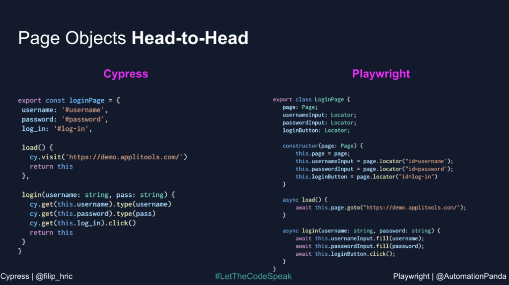
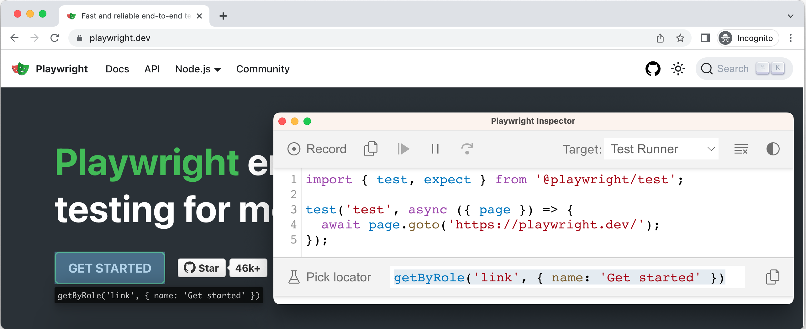
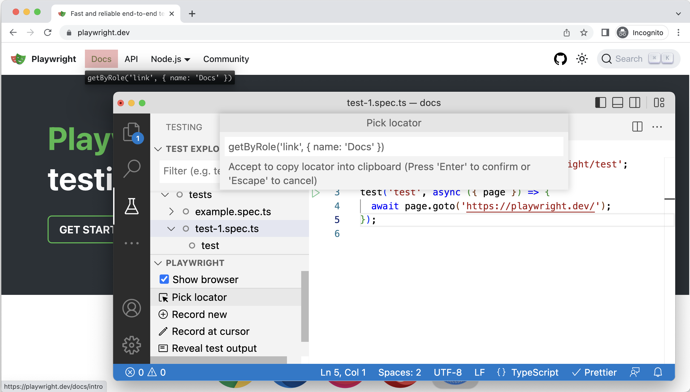
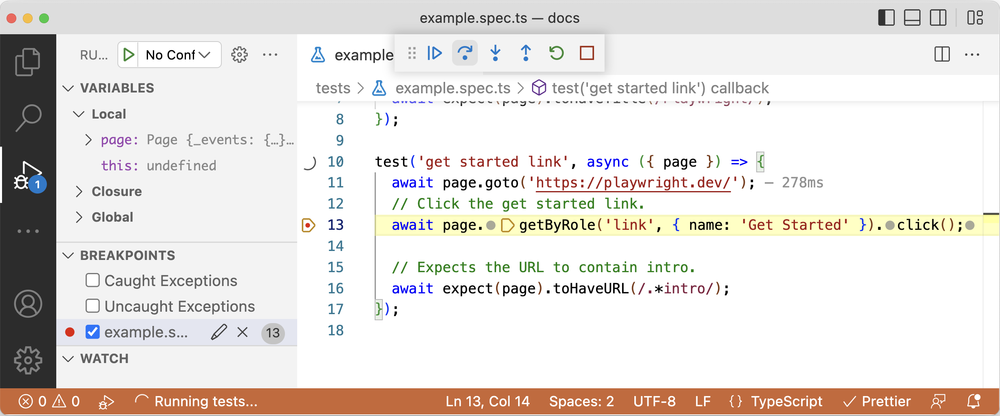

# Before We Begin.. (vs. Cypress)

## Why Did We Move from Cypress to Playwright??

### Pain Points When Developing with Cypress

- We felt that loading the test environment and running the tests took far too much time.
- There were many cases where Cypress failed to find elements in the test environment, and we couldn't figure out the cause.
- Cypress's own syntax was unfamiliar to FE developers.
- Even when we wanted to run tests in parallel to improve test speed, there was the hurdle of having to pay an additional fee.

→ To overcome these difficulties, we started looking for another testing library, and along the way we discovered one that could solve the problems above. That library is Playwright, built by Microsoft.

### Cypress vs Playwright

- Test speed comparison
  - When running with link navigation first for e2e test isolation, based on a single spec it wasn't dramatically faster than Cypress.
    - However, when running in parallel with a large number of cases, we could feel that the test speed increased.
    - [https://emewjin.github.io/playwright-vs-cypress/#테스트-속도가-cypress보다-진짜-더-빠를까](https://emewjin.github.io/playwright-vs-cypress/#%ED%85%8C%EC%8A%A4%ED%8A%B8-%EC%86%8D%EB%8F%84%EA%B0%80-cypress%EB%B3%B4%EB%8B%A4-%EC%A7%84%EC%A7%9C-%EB%8D%94-%EB%B9%A0%EB%A5%BC%EA%B9%8C)
  - Playwright provides a beforeAll function, so in web apps built with a SPA structure, we could feel that the test speed increased when navigating to a link once at the beginning and then using page.goBack(), compared to beforeEach. (However, since you can't obtain the page in beforeAll, you have to create a new one, and in that case you can't run tests in parallel.)
  - After adding it to a company project, we found that it was roughly 5 times faster.
- Supported test environments
  - Playwright
    - Chromium-based browsers, Firefox, **Safari support**
    - **Mobile browser support**
    - **Experimental mode: Android Chrome/WebView, Electron support planned**
  - Cypress
    - Only supports two browsers: Chromium-based browsers and Firefox
- Parallel test support
  - Playwright
    - **Runs all tests in parallel**
    - **Can set up to 4 worker threads**
      - However, when specifying worker threads, isolating each test unit is mandatory!!
  - Cypress
    - Runs all tests serially
    - However, to run parallel tests, you must subscribe to a paid plan to run parallel tests in a CI/CD environment → you have to pay money ㅜㅜ)
- Rich event support
  - Supports hover and drag (not supported by Cypress)
- Syntax
  - Supports the pure, native syntax of the language it targets. (Cypress provides its own custom syntax)
    

# Introducing Playwright


Playwright is an open-source web testing and automation library built by Microsoft. With a single API, it can test Chromium, Firefox, WebKit, and mobile web (Chromium, Safari, etc.). (In the [Next version](https://playwright.dev/docs/next/api/class-android), it appears to also support Android Chrome and Electron via ADB.)

In fact, Playwright itself is not an E2E testing framework; cross-browser testing becomes possible by using the @playwright/test framework. (However, it does not support legacy Edge or IE.)

## Playwright Features

- Features
  A single API for multi-browser/platform testing
  - Cross-browser: Supports the latest modern browsers Chromium, Webkit, and Firefox
  - Cross-platform: Windows, Linux, MacOS, locally or CI, headless or headed
  - Cross-language: Typescript, Javascript, Python, .NET, Java
  - Test Mobile Web: Tests mobile web on Android/Safari using native mobile emulation
    Other features
  - Auto-waiting: Automatically waits until the element is ready before an action is executed (timeout option)
  - Retry: Assertions are automatically retried until the required condition is met (retry option)
  - Tracing: Enables error tracing through execution traces, video, and screenshot capture
  - Can hook into network activity to mock network requests
  - Supports basic mouse and keyboard input event testing
    Powerful tools
  - Codegen: A tool that generates automation test code based on Playwright's capabilities
    - Because it generates code automatically, it saves time and effort in writing code
  - inspector: Step-by-step debugging of test execution (a scaled-down version of Chrome DevTools)
  - trace viewer: Captures all information to investigate test failures

# Setting Up Playwright

## Test Files

The filename must include "test". It takes a form like hotfix.test.ts.

- You can change the extension via testMatch in playwright.config.ts.

## Timeouts

- Playwright has separate timeouts for various tasks.
- Timeouts can be configured globally or per command.
  - Simplified test global timeout: 2 seconds (timeout: 60 _ 1000 _ 2)
  - Command timeout configuration
    ```tsx
    await page
      .locator('[class*="modal"]')
      .locator('text=취소하기')
      .click({ timeout: 40000 });
    ```
    | Timeout                    | Default    | Description                                                                                                                            |
    | -------------------------- | ---------- | -------------------------------------------------------------------------------------------------------------------------------------- |
    | Test timeout               | 30000 ms   | Timeout for each test, includes test, hooks and fixtures:SET DEFAULTconfig = { timeout: 60000 }OVERRIDEtest.setTimeout(120000)         |
    | Expect timeout             | 5000 ms    | Timeout for each assertion:SET DEFAULTconfig = { expect: { timeout: 10000 } }OVERRIDEexpect(locator).toBeVisible({ timeout: 10000 })   |
    | Action timeout             | no timeout | Timeout for each action:SET DEFAULTconfig = { use: { actionTimeout: 10000 } }OVERRIDElocator.click({ timeout: 10000 })                 |
    | Navigation timeout         | no timeout | Timeout for each navigation action:SET DEFAULTconfig = { use: { navigationTimeout: 30000 } }OVERRIDEpage.goto('/', { timeout: 30000 }) |
    | Global timeout             | no timeout | Global timeout for the whole test run:SET IN CONFIGconfig = { globalTimeout: 60*60*1000 }                                              |
    | beforeAll/afterAll timeout | 30000 ms   | Timeout for the hook:SET IN HOOKtest.setTimeout(60000)                                                                                 |
    | Fixture timeout            | no timeout | Timeout for an individual fixture:SET IN FIXTURE{ scope: 'test', timeout: 30000 }                                                      |
- Tips
  - It seems best to write test cases in Korean, which is easy to read and conveys meaning clearly.
  - Companies like Kakao, NHN, and Class101 also appear to write their test cases in Korean.

## CLI

You can run tests in the terminal with the following command. By default, it runs in **headless** mode.
What is headless?
It refers to a browser without a GUI environment. It means running in the CLI (Command Line Interface).

```tsx
yarn playwright test
```

Reference for run options: [https://playwright.dev/docs/test-cli](https://playwright.dev/docs/test-cli)
Tests are run against the browsers/platforms configured in the settings file.
You can specify one of the browsers/platforms provided by Playwright's built-in emulator (chromium, firefox, safari) to run tests.
[https://playwright.dev/docs/emulation](https://playwright.dev/docs/emulation)
Testing considerations

## Improving Test Speed

- The parts that take the most time during a test run should be handled so that they can be performed before the test runs.
- If the speed is slow, you won't be able to respond quickly after deployment, so please think carefully about test execution time before proceeding with development.

```tsx
// context, page 생성 시간 단축을 위해서 테스트 전에 한번만 수행
test.beforeAll(async ({ browser, baseURL, contextOptions }) => {
  const context = await browser.newContext(contextOptions);
  page = await context.newPage();

  await page.goto('/');
});

test.beforeEach(async ({ isMobile }) => {
  if (isMobile) {
    await page.locator('[aria-label="navigation-button"]').click();
    await page.locator('[aria-label="about-link"]:visible').click();
  } else {
    await page
      .locator(
        '[aria-label="desktop-navigation"] [aria-label="about-link"]:visible',
      )
      .click();
  }
});
```

# ⭐ Testing Strategy ⭐

## Parallel Testing

- Provides guidance to isolate test code so that each test is not dependent on others
  - Currently set to run only on a single thread

## Multi-Platform/Browser Testing

- We need to establish a target multi-platform/browser strategy specific to the service.
- Other companies' cases
  - Hyperconnect: Runs Safari testing as a requirement
    - [https://hyperconnect.github.io/2022/01/28/e2e-test-with-playwright.html](https://hyperconnect.github.io/2022/01/28/e2e-test-with-playwright.html)

# How to Write Playwright Tests

## How to Write Test Cases

**Run Command Line**

- Running all tests
  ```bash
  npx playwright test
  ```
- Running a single test file
  ```tsx
  npx playwright test landing-page.spec.ts
  ```
- Run a set of test files
  ```tsx
  npx playwright test tests/todo-page/ tests/landing-page/
  ```
- Run files that have `landing` or `login` in the file name
  ```tsx
  npx playwright test landing login
  ```
- Run the test with the title
  ```tsx
  npx playwright test -g "add a todo item"
  ```
- Running tests in headed mode
  ```tsx
  npx playwright test landing-page.spec.ts --headed
  ```
- Running tests on a specific project
  ```tsx
  npx playwright test landing-page.ts --project=chromium
  ```
  **Debugging Tests**
- Debugging all tests:
  ```
  npx playwright test --debug
  ```
- Debugging one test file:
  ```
  npx playwright test example.spec.ts --debug
  ```
- Debugging a test from the line number where the `test(..` is defined:
  ```bash
  npx playwright test example.spec.ts:10 --debug
  ```
  **Basic Test Case Structure**
  **Project Dependencies**
- If you must run certain tests before the test code runs, write a global setup action.
- Setup files related to dependencies are run in advance before Desktop Chrome runs.

```tsx
// playwright.config.ts
{ name: 'setup', testMatch: /.*\.setup\.ts/ },
{
  name: 'chromium',
  use: { ...devices['Desktop Chrome'] },
  dependencies: ['setup'],
},
```

**Configure globalSetup and globalTeardown**

- For code that must run once before all tests, apply the globalSetup/globalTeardown properties.

```tsx
// playwright.config.ts/js
import { defineConfig } from '@playwright/test';
export default defineConfig({
  globalSetup: require.resolve('./global-setup'),
  globalTeardown: require.resolve('./global-teardown'),
  use: {
    baseURL: 'http://localhost:3000/',
    storageState: 'state.json',
  },
});
```

**describe, test**
Use describe to logically group tests, and write tests with test.
Within describe, when you need setup/teardown for the entire group of tests, try using beforeAll and afterEach,
**→ Because creating context and page takes a lot of time, creating them in advance before all tests can reduce test time.**
When you need setup/teardown work for each individual test, please use beforeEach and afterEach.

```tsx
import { expect, Page, test, BrowserContext } from '@playwright/test';

test.describe('홈', () => {
  let browserContext: BrowserContext;
  let page: Page;

  // beforeAll hook은 최초 딱 한번 실행. initialize 작업 등을 수행
  test.beforeAll(async ({ browser, contextOptions }) => {
    browserContext = await browser.newContext(contextOptions);
  });

  test.beforeEach(async ({ isMobile }) => {
    // 페이지 생성
    page = await browserContext.newPage();

    await page.goto('/');

    if (isMobile) {
      await page.locator('[aria-label="navigation-button"]').click();
      await page.locator('[aria-label="career-link"]:visible').click();
    } else {
      await page
        .locator(
          '[aria-label="desktop-navigation"] [aria-label="career-link"]:visible',
        )
        .click();
    }
  });

  test.afterEach(async () => {
    await page.close();
  });

  test.afterAll(async () => {
    await browserContext.close();
  });

  test('02-5. Carrer 상세 화면에 대한 검증을 한다.', async () => {
    const element = await page.locator('main > section > ul > li a').first();
    const href = (await element.getAttribute('href')) as string;

    element.click();

    await expect(page).toHaveURL(href);

    const subElement = await page.locator('main section > div').first();
    await expect(subElement).toBeVisible();
  });
});
```

**Test Titles**
Test titles should be as explicit as possible so that you can tell what the test does just by looking at the title, and they should be written as active sentences. (Avoid passive expressions like "~ is done" and instead write active expressions like "~ does".)

## Handy Little Tips

### test.only

When a test file has multiple test cases, even if you modify only one test, all test cases in the file will run. You can use **test.only** to run only the test case you are currently working on.

### test.skip

When a test case can't be run but you still want it in the test list, you can use **test.skip**. It will be counted as pending in the final results.
**Selector**
Playwright's selectors are provided based on query priority, and when that feature doesn't work you can use locators to freely access elements.
Query priority

- Priority among queries for testing visual elements / user interactions
  - getByRole > getByLabelText > getByPlaceholderText > getByText > getByDisplayValue
- Priority among queries for testing HTML5 and ARIA attributes
  - getByAltText > getByTitle
- Test ID: Used only to find values that cannot be found with the queries above
  - getByTestId
  - It seems best to decide on the data attribute through team consensus.
- If you cannot access it even with these priorities, you can use locator.
  ```tsx
  const element = await page.locator('main > section > ul > li a').first();
  ```
  **Using Testing Tools**
  In the Playwright Inspector screen, if you click Pick locator and then select an element on the screen, it automatically generates the test code.
  If you can reference this feature when generating code, you can boost development productivity.

## Negating Matchers

- Generally, you just add .not in front of the matcher.

```tsx
expect(value).not.toEqual(0);
await expect(locator).not.toContainText('some text');
```

## Soft Assertions

- By default, when an assertion errors out the test terminates, but when Soft Assertions are applied, the test does not terminate and only marks the failure.

```tsx
// Make a few checks that will not stop the test when failed...
await expect.soft(page.getByTestId('status')).toHaveText('Success');
await expect.soft(page.getByTestId('eta')).toHaveText('1 day');

// ... and continue the test to check more things.
await page.getByRole('link', { name: 'next page' }).click();
await expect
  .soft(page.getByRole('heading', { name: 'Make another order' }))
  .toBeVisible();
```

## Polling

- Use expect.poll when waiting asynchronously. (Mostly used when awaiting an API response)

```tsx
await expect
  .poll(
    async () => {
      const response = await page.request.get('https://api.example.com');
      return response.status();
    },
    {
      // Custom error message, optional.
      message: 'make sure API eventually succeeds', // custom error message
      // Poll for 10 seconds; defaults to 5 seconds. Pass 0 to disable timeout.
      timeout: 10000,
    },
  )
  .toBe(200);

await expect
  .poll(
    async () => {
      const response = await page.request.get('https://api.example.com');
      return response.status();
    },
    {
      // Probe, wait 1s, probe, wait 2s, probe, wait 10s, probe, wait 10s, probe, .... Defaults to [100, 250, 500, 1000].
      intervals: [1_000, 2_000, 10_000],
      timeout: 60_000,
    },
  )
  .toBe(200);
```

## Retrying

- When the code is blocked, retries are handled via intervals.

```tsx
await expect(async () => {
  const response = await page.request.get('https://api.example.com');
  expect(response.status()).toBe(200);
}).toPass({
  // Probe, wait 1s, probe, wait 2s, probe, wait 10s, probe, wait 10s, probe, .... Defaults to [100, 250, 500, 1000].
  intervals: [1_000, 2_000, 10_000],
  timeout: 60_000,
});
```

# Playwright Guide

- Guide
  Playwright Basics

  - Install playwright

    ```bash
    # Install browser
    $ npm i -D playwright

    # Install testing library
    $ npm i -D @playwright/test
    ```

## Playwright Key Concepts

```tsx
const { chromium } = require('playwright');

const browser = await chromium.launch();
// ...
await browser.close();
```

Because creating a browser instance is expensive, Playwright is designed to maximize what a single instance can do through multiple browser contexts.
A browser context is an isolated, session-like environment within a browser instance. It is fast and inexpensive to create. It's recommended to run each test in a new browser context to isolate browser state between tests.

```tsx
const browser = await chromium.launch();
const context = await browser.newContext();
```

You can simulate different devices per context. In the example, contexts are being created for an iPhone and an iPad.

```tsx
import { devices } from 'playwright';

const iPhone = devices['iPhone 11 Pro'];
const iPad = devices['iPad Pro 11'];

const iPhoneContext = await browser.newContext({
  ...iPhone,
  permissions: ['geolocation'],
  geolocation: { latitude: 52.52, longitude: 13.39 },
  colorScheme: 'dark',
  locale: 'de-DE',
});
const iPadContext = await browser.newContext({
  ...iPad,
  permissions: ['geolocation'],
  geolocation: { latitude: 37.4, longitude: 127.1 },
  // ...
});
```

A context can have pages, which represent a single tab or popup window within the context. Use it when navigating to a URL and interacting with the page's content.
Using pages, you can work as if in different tabs. In the example, we navigate to different pages.

```tsx
// ...
// 페이지1 생성
const page1 = await context.newPage();

// 브라우저에 URL을 입력하는 것처럼 탐색
await page1.goto('http://example.com');
// 인풋 채우기
await page1.fill('#search', 'query');

// 페이지2 생성
const page2 = await context.newPage();

await page2.goto('https://www.nhn.com');
// 링크를 클릭하여 탐색
await page.click('.nav_locale');
// 새로운 url 출력
console.log(page.url());
```

A page can in turn have one or more frame objects. Each page has a main frame, and page-level interactions (such as clicks) are assumed to operate on the main frame. Additional frames can exist along with iframe tags.
Using frames, you can retrieve or manipulate elements inside the frame. The example shows ways to obtain frames and how to interact with elements inside a frame.

```tsx
// 프레임의 name 속성으로 프레임 가져오기
const frame = page.frame('frame-login');

// 프레임의 URL로 가져오기
const frame = page.frame({ url: /.*domain.*/ });

// 선택자로 프레임 가져오기
const frameElementHandle = await page.$('.frame-class');
const frame = await frameElementHandle.contentFrame();

// 프레임과 상호작용
await frame.fill('#username-input', 'John');
```

## Playwright Commands

### Actions

- Called when focusing an input, textarea, or [contenteditable] element and entering text directly
  Can be used as a replacement for locator.fill()

  ```tsx
  // Text input
  await page.getByRole('textbox').fill('Peter');

  // Date input
  await page.getByLabel('Birth date').fill('2020-02-02');

  // Time input
  await page.getByLabel('Appointment time').fill('13:15');

  // Local datetime input
  await page.getByLabel('Local time').fill('2020-03-02T05:15');
  ```

- Type characters → real keyboard type
  Behaves as if real keyboard input is being made to the input element
  Can be used as a replacement for locator.type()
  ```tsx
  // Type character by character
  await page.locator('#area').type('Hello World!');
  ```
- An action to select an element or create a shortcut
  Can use the keyboardEvent.key event
  Can replace [locator.press](http://locator.press/)()

  ```tsx
  // Hit Enter
  await page.getByText('Submit').press('Enter');

  // Dispatch Control+Right
  await page.getByRole('textbox').press('Control+ArrowRight');

  // Press $ sign on keyboard
  await page.getByRole('textbox').press('$');

  // <input id=name>
  await page.locator('#name').press('Shift+A');

  // <input id=name>
  await page.locator('#name').press('Shift+ArrowLeft');
  ```

- Called when setting or getting the checked/unchecked state for input[type=checkbox], input[type=radio], and [role=checkbox] elements
  Can be used as a replacement for locator.setChecked()

  ```tsx
  // Check the checkbox
  await page.getByLabel('I agree to the terms above').check();

  // Assert the checked state
  expect(
    await page.getByLabel('Subscribe to newsletter').isChecked(),
  ).toBeTruthy();

  // Select the radio button
  await page.getByLabel('XL').check();
  ```

- Used for single/multiple selection of a select element
  Can select a specific option by value or label
  Can be used as a replacement for locator.selectOption()

  ```tsx
  // Single selection matching the value
  await page.getByLabel('Choose a color').selectOption('blue');

  // Single selection matching the label
  await page.getByLabel('Choose a color').selectOption({ label: 'Blue' });

  // Multiple selected items
  await page
    .getByLabel('Choose multiple colors')
    .selectOption(['red', 'green', 'blue']);
  ```

- Waits until the DOM is accessible
- Waits until the DOM is visible (no empty, no display:none, no visibility:hidden)
- Waits until motion stops (e.g. transition finishes)
- When the element is visible within the viewport (scroll)
- Waits until the element is not obscured by other elements
- If the element is detached, waits until it is attached again
- Force click: Can force a click even when obscured by another element
- dispatchEvent: When you want to dispatch only the click event regardless of user input

```tsx
// Generic click
await page.getByRole('button').click();

// Double click
await page.getByText('Item').dblclick();

// Right click
await page.getByText('Item').click({ button: 'right' });

// Shift + click
await page.getByText('Item').click({ modifiers: ['Shift'] });

// Hover over element
await page.getByText('Item').hover();

// Click the top left corner
await page.getByText('Item').click({ position: { x: 0, y: 0 } });

// Force Click
await page.getByRole('button').click({ force: true });

// Dispatch Click
await page.getByRole('button').dispatchEvent('click');
```

- Can be used when an input element has type="file"
  Can be used as a replacement for locator.setInputFiles()
  If the element is dynamically created, you can wait with waitForEvent (can be used as a replacement for page.on('filechooser'))

  ```tsx
  // Select one file
  await page.getByLabel('Upload file').setInputFiles('myfile.pdf');

  // Select multiple files
  await page
    .getByLabel('Upload files')
    .setInputFiles(['file1.txt', 'file2.txt']);

  // Remove all the selected files
  await page.getByLabel('Upload file').setInputFiles([]);

  // Upload buffer from memory
  await page.getByLabel('Upload file').setInputFiles({
    name: 'file.txt',
    mimeType: 'text/plain',
    buffer: Buffer.from('this is test'),
  });

  // Start waiting for file chooser before clicking. Note no await.
  const fileChooserPromise = page.waitForEvent('filechooser');
  await page.getByLabel('Upload file').click();
  const fileChooser = await fileChooserPromise;
  await fileChooser.setFiles('myfile.pdf');
  ```

- Can be replaced with the locator.focus() function
  ```tsx
  await page.getByLabel('Password').focus();
  ```
  Can replace locator.dragTo()
  When replacing with lower-level functions (you can use locator.hover, mouse.down, mouse.move, mouse.up)

```tsx
// drag and drop
await page
  .locator('#item-to-be-dragged')
  .dragTo(page.locator('#item-to-drop-at'));

// lower-level
await page.locator('#item-to-be-dragged').hover();
await page.mouse.down();
await page.locator('#item-to-drop-at').hover();
await page.mouse.up();
```

## Assertions

[https://playwright.dev/docs/test-assertions](https://playwright.dev/docs/test-assertions)
Assertions are used to check expected values against result values.
When performing Playwright test assertions, you can use the expect function, which provides a variety of assertion functions.
<br />
<br />
| Assertion | Description |
| ----------------------------------------------------------------------------------------------- | --------------------------------- |
| [expect(locator).toBeChecked()](https://playwright.dev/docs/api/class-locatorassertions#locator-assertions-to-be-checked) | Checkbox is checked |
| [expect(locator).toBeDisabled()](https://playwright.dev/docs/api/class-locatorassertions#locator-assertions-to-be-disabled) | Element is disabled |
| [expect(locator).toBeEditable()](https://playwright.dev/docs/api/class-locatorassertions#locator-assertions-to-be-editable) | Element is enabled |
| [expect(locator).toBeEmpty()](https://playwright.dev/docs/api/class-locatorassertions#locator-assertions-to-be-empty) | Container is empty |
| [expect(locator).toBeEnabled()](https://playwright.dev/docs/api/class-locatorassertions#locator-assertions-to-be-enabled) | Element is enabled |
| [expect(locator).toBeFocused()](https://playwright.dev/docs/api/class-locatorassertions#locator-assertions-to-be-focused) | Element is focused |
| [expect(locator).toBeHidden()](https://playwright.dev/docs/api/class-locatorassertions#locator-assertions-to-be-hidden) | Element is not visible |
| [expect(locator).toBeInViewport()](https://playwright.dev/docs/api/class-locatorassertions#locator-assertions-to-be-in-viewport) | Element intersects viewport |
| [expect(locator).toBeVisible()](https://playwright.dev/docs/api/class-locatorassertions#locator-assertions-to-be-visible) | Element is visible |
| [expect(locator).toContainText()](https://playwright.dev/docs/api/class-locatorassertions#locator-assertions-to-contain-text) | Element contains text |
| [expect(locator).toHaveAttribute()](https://playwright.dev/docs/api/class-locatorassertions#locator-assertions-to-have-attribute) | Element has a DOM attribute |
| [expect(locator).toHaveClass()](https://playwright.dev/docs/api/class-locatorassertions#locator-assertions-to-have-class) | Element has a class property |
| [expect(locator).toHaveCount()](https://playwright.dev/docs/api/class-locatorassertions#locator-assertions-to-have-count) | List has exact number of children |
| [expect(locator).toHaveCSS()](https://playwright.dev/docs/api/class-locatorassertions#locator-assertions-to-have-css) | Element has CSS property |
| [expect(locator).toHaveId()](https://playwright.dev/docs/api/class-locatorassertions#locator-assertions-to-have-id) | Element has an ID |
| [expect(locator).toHaveJSProperty()](https://playwright.dev/docs/api/class-locatorassertions#locator-assertions-to-have-js-property) | Element has a JavaScript property |
| [expect(locator).toHaveScreenshot()](https://playwright.dev/docs/api/class-locatorassertions#locator-assertions-to-have-screenshot-1) | Element has a screenshot |
| [expect(locator).toHaveText()](https://playwright.dev/docs/api/class-locatorassertions#locator-assertions-to-have-text) | Element matches text |
| [expect(locator).toHaveValue()](https://playwright.dev/docs/api/class-locatorassertions#locator-assertions-to-have-value) | Input has a value |
| [expect(locator).toHaveValues()](https://playwright.dev/docs/api/class-locatorassertions#locator-assertions-to-have-values) | Select has options selected |
| [expect(page).toHaveScreenshot()](https://playwright.dev/docs/api/class-pageassertions#page-assertions-to-have-screenshot-1) | Page has a screenshot |
| [expect(page).toHaveTitle()](https://playwright.dev/docs/api/class-pageassertions#page-assertions-to-have-title) | Page has a title |
| [expect(page).toHaveURL()](https://playwright.dev/docs/api/class-pageassertions#page-assertions-to-have-url) | Page has a URL |
| [expect(apiResponse).toBeOK()](https://playwright.dev/docs/api/class-apiresponseassertions#api-response-assertions-to-be-ok) | Response has an OK status |

- Generally, you just add .not in front of the matcher.

```tsx
expect(value).not.toEqual(0);
await expect(locator).not.toContainText('some text');
```

By default, execution terminates when a test fails, but in the case of a soft assertion it does not terminate.
To check whether a failure occurred, you can use [test.info](http://test.info/)

```tsx
// Make a few checks that will not stop the test when failed...
await expect.soft(page.getByTestId('status')).toHaveText('Success');
await expect.soft(page.getByTestId('eta')).toHaveText('1 day');

// ... and continue the test to check more things.
await page.getByRole('link', { name: 'next page' }).click();
await expect
  .soft(page.getByRole('heading', { name: 'Make another order' }))
  .toBeVisible();

// test.info
//// Make a few checks that will not stop the test when failed...
await expect.soft(page.getByTestId('status')).toHaveText('Success');
await expect.soft(page.getByTestId('eta')).toHaveText('1 day');

//// Avoid running further if there were soft assertion failures.
expect(test.info().errors).toHaveLength(0);
```

Express a specific error message
Can be used as a replacement for expect.soft

```tsx
await expect(page.getByText('Name'), 'should be logged in').toBeVisible();

Error: should be logged in

// Call log:
//   - expect.toBeVisible with timeout 5000ms
//   - waiting for "getByText('Name')"

//   2 |
//   3 | test('example test', async({ page }) => {
// > 4 |   await expect(page.getByText('Name'), 'should be logged in').toBeVisible();
//     |                                                                  ^
//   5 | });
//   6 |

// 동일한 코드
expect.soft(value, 'my soft assertion').toBe(56);

```

- Use expect.poll when waiting asynchronously. (Mostly used when awaiting an API response)

```tsx
await expect
  .poll(
    async () => {
      const response = await page.request.get('<https://api.example.com>');
      return response.status();
    },
    {
      // Custom error message, optional.
      message: 'make sure API eventually succeeds', // custom error message
      // Poll for 10 seconds; defaults to 5 seconds. Pass 0 to disable timeout.
      timeout: 10000,
    },
  )
  .toBe(200);

await expect
  .poll(
    async () => {
      const response = await page.request.get('<https://api.example.com>');
      return response.status();
    },
    {
      // Probe, wait 1s, probe, wait 2s, probe, wait 10s, probe, wait 10s, probe, .... Defaults to [100, 250, 500, 1000].
      intervals: [1_000, 2_000, 10_000],
      timeout: 60_000,
    },
  )
  .toBe(200);
```

- When the code is blocked, retries are handled via intervals

```tsx
// API 응답이 성공할 때까지 코드 블록을 재 실행
await expect(async () => {
  const response = await page.request.get('<https://api.example.com>');
  expect(response.status()).toBe(200);
}).toPass();

// API 응답에 재시도 간격에 대해서 사용자 지정 시간을 세팅
await expect(async () => {
  const response = await page.request.get('<https://api.example.com>');
  expect(response.status()).toBe(200);
}).toPass({
  // Probe, wait 1s, probe, wait 2s, probe, wait 10s, probe, wait 10s, probe, .... Defaults to [100, 250, 500, 1000].
  intervals: [1_000, 2_000, 10_000],
  timeout: 60_000,
});
```

## Locators

page.getByRole() → When finding accessibility attributes

- Used when leveraging the way assistive technology perceives the page
  page.getByLabel() → When finding form control label text
- Used when finding form fields
  page.getByPlaceholder() → When finding placeholder
- Used when an element has no label but has placeholder text
  page.getByText() → When finding text
- Used when finding text of non-interactive elements (div, span, p)
- Interactive elements (button, a, input): page.getByLabel
  page.getByAltText() → When finding alternative text
- Used when there is alternative text, as with img and area elements
  page.getByTitle() → When finding the title attribute
- When an element has a title attribute
  page.getByTestId() → When finding the data-testid attribute
- Used when you can't use text or role, or when a testid can be used
- Use filter when searching for a specific value inside an element
- hasText: text search, has: locator search

```tsx
// hasText
await page
  .getByRole('listitem')
  .filter({ hasText: 'Product 2' })
  .getByRole('button', { name: 'Add to cart' })
  .click();

// has
await page
  .getByRole('listitem')
  .filter({ has: page.getByRole('heading', { name: 'Product 2' }) })
  .getByRole('button', { name: 'Add to cart' })
  .click();
```

- Can access a specific index of an element array
- Can be used as a replacement for locator.first(), locator.last(), locator.nth()

```tsx
const banana = await page.getByRole('listitem').nth(1);
```

- Iterate elements
- Iterate using regular for loop
- Evaluate in the page → When using the DOM api

```tsx
// Iterate elements
for (const row of await page.getByRole('listitem').all())
  console.log(await row.textContent());

// Iterate using regular for loop
const rows = page.getByRole('listitem');
const count = await rows.count();
for (let i = 0; i < count; ++i) console.log(await rows.nth(i).textContent());

// Evaluate in the page
const rows = page.getByRole('listitem');
const texts = await rows.evaluateAll(list =>
  list.map(element => element.textContent),
);
```

# Auto-waiting

It automatically waits until all relevant checks pass, and then performs the next requested action.
For example, in the case of page.click(), Playwright checks the following:

- The element is attached to the DOM
- The element is visible
- The element has finished animating and is stable
- The element is not obscured by other elements
- The element is enabled
  | Action | [Attached](https://playwright.dev/docs/actionability#attached) | [Visible](https://playwright.dev/docs/actionability#visible) | [Stable](https://playwright.dev/docs/actionability#stable) | [Receives Events](https://playwright.dev/docs/actionability#receives-events) | [Enabled](https://playwright.dev/docs/actionability#enabled) | [Editable](https://playwright.dev/docs/actionability#editable) |
  | ---------------------- | -------------------------------------------------- | ------------------------------------------------- | ------------------------------------------------ | --------------------------------------------------------- | ------------------------------------------------- | -------------------------------------------------- |
  | check | Yes | Yes | Yes | Yes | Yes | - |
  | click | Yes | Yes | Yes | Yes | Yes | - |
  | dblclick | Yes | Yes | Yes | Yes | Yes | - |
  | setChecked | Yes | Yes | Yes | Yes | Yes | - |
  | tap | Yes | Yes | Yes | Yes | Yes | - |
  | uncheck | Yes | Yes | Yes | Yes | Yes | - |
  | hover | Yes | Yes | Yes | Yes | - | - |
  | scrollIntoViewIfNeeded | Yes | - | Yes | - | - | - |
  | screenshot | Yes | Yes | Yes | - | - | - |
  | fill | Yes | Yes | - | - | Yes | Yes |
  | selectText | Yes | Yes | - | - | - | - |
  | dispatchEvent | Yes | - | - | - | - | - |
  | focus | Yes | - | - | - | - | - |
  | getAttribute | Yes | - | - | - | - | - |
  | innerText | Yes | - | - | - | - | - |
  | innerHTML | Yes | - | - | - | - | - |
  | press | Yes | - | - | - | - | - |
  | setInputFiles | Yes | - | - | - | - | - |
  | selectOption | Yes | Yes | - | - | Yes | - |
  | textContent | Yes | - | - | - | - | - |
  | type | Yes | - | - | - | - | - |

# Best Practices

## Testing philosophy

- Test the areas/behaviors visible to the user
  - Test pages where the end user can view the page or interact with it.
- Isolate tests as much as possible when writing them

  - Isolate the work for each test individually (local/session storage, data, cookies, etc.)
  - When you need to avoid repeating something specific in tests, use before and after hooks
  - When navigating to a specific URL within a test file or logging into part of the app, use before hooks

  ```tsx
  import { test } from '@playwright/test';

  test.beforeEach(async ({ page }) => {
    // Runs before each test and signs in each page.
    await page.goto('https://github.com/login');
    await page.getByLabel('Username or email address').fill('username');
    await page.getByLabel('Password').fill('password');
    await page.getByRole('button', { name: 'Sign in' }).click();
  });

  test('first', async ({ page }) => {
    // page is signed in.
  });

  test('second', async ({ page }) => {
    // page is signed in.
  });
  ```

- Write test code that follows the overall flow (long tests are fine.)

  - When testing the entire app flow, handling assertions for multiple actions is fine.
  - Splitting a long test into individual tests unnecessarily should be avoided, because it slows down test execution.
  - When you want to display errors without terminating on a long test error, you can use soft assertions.

  ```tsx
  // Make a few checks that will not stop the test when failed...
  await expect.soft(page.getByTestId('status')).toHaveText('Success');

  // ... and continue the test to check more things.
  await page.getByRole('link', { name: 'next page' }).click();
  ```

- Avoid tests that depend on third parties
  ```tsx
  await page.route('**/api/fetch_data_third_party_dependency', route =>
    route.fulfill({
      status: 200,
      body: testData,
    }),
  );
  await page.goto('https://example.com');
  ```

## Best Practices

**Use Playwright's built-in locators**

- Use the built-in locators to take advantage of features like auto waiting and retry-ability

```tsx
👍 page.getByRole('button', { name: 'submit' })
```

**Use chaining and filtering**

- When searching a specific part of the page, we recommend narrowing it down with chaining and filtering

```tsx
const product = page.getByRole('listitem').filter({ hasText: 'Product 2' });

await page
  .getByRole('listitem')
  .filter({ hasText: 'Product 2' })
  .getByRole('button', { name: 'Add to cart' })
  .click();
```

**Prefer user-facing attributes to XPath or CSS selectors**

- Use user-centric attribute selectors

```tsx
👎 page.locator('button.buttonIcon.episode-actions-later')

👍 page.getByRole('button', { name: 'submit' })
```

**Auto-generate locators using codegen**

```tsx
npx playwright codegen playwright.dev
```



### Auto-generate locators using the VS Code extension



### Use appropriate Assertions

```tsx
  👍 await expect(page.getByText('welcome')).toBeVisible();

  👎 expect(await page.getByText('welcome').isVisible()).toBe(true);
```

### Local debugging

- We recommend debugging using the vscode extension
  
- Can debug using the command approach
- Can debug by adding a specific test file and test line number

```tsx
npx playwright test --debug

npx playwright test example.spec.ts:9 --debug
```

# Realistic Ways to Apply Playwright

- Exception handling for marketing tools: In progress
  - Modify things so that marketing tools like GA and Braze don't run in environments launched by the test automation tool (branching using navigator.webdriver)
    - [Navigator: webdriver property - Web APIs | MDN](https://developer.mozilla.org/en-US/docs/Web/API/Navigator/webdriver)
- Defining supported browsers/platforms requires a spec discussion with the CTO team
  - We need service-specific criteria for the Chromium, Firefox, Safari, and mobile web (AOS, IOS) that Playwright supports
- The stance on responding to errors in E2E tests requires a spec discussion with the CTO team
  - Each team needs a strategy for how to respond when an error occurs (assigning an owner) → Slack notifications are a must

# What Should We Do to Build E2E Test Automation?

### Writing scenarios (Planning/QA/Test Engineers)

- Write testing scenarios that consider the user interface (UI)
- Write test scenarios that can automate tests previously done manually (live-deployment sanity checks, basic verification)
- Write scenarios not only for Happy cases but also for Bad cases
- If you write test code during development, you can reduce the BAT test schedule
- Migrate feature/component unit tests to automation, and focus testing on usability testing

UX-first organization - Scenario writing edition

```tsx
/*
 * 로그인 동작 대한 시나리오 작성
 * 1. 테스트의 동작을 기술한다.
 * 2. 테스트 수행할 행동에 대해서 기술한다.
 * 3. /login 방문한다.
 * 4. 이메일 입력 타이틀 엘리먼트 선택한다.
 * 5. input 엘리먼트에 fake@email.com 입력한다.
 * 6. 비밀번호 입력 타이틀 엘리먼트 선택한다.
 * 7. input 엘리먼트에 1234 입력한다.
 * 8. 로그인 버튼을 클릭 한다.
 * 사용자 인터페이스(UI)를 고려한 시나리오 작성이 필수....
 */

test('account enroll', async ({ page }) => {
  await page.goto('/login');
  await page.getByTitle('이메일 입력').fill(process.env.USER_ID || '');
  await page.getByTitle('비밀번호 입력').fill(process.env.USER_PASSWORD || '');
  await page.locator('.account').getByRole('button').click();
});
```

### Whether to maintain test code (needs discussion with the Planning/QA teams)

- Whether it can be done without overlapping the E2E tests the QA team is also running
- Need to list out the tests that are truly necessary from the user's perspective
- Expanding service test automation
  - Test automation appropriate to the nature of the test is needed
    - Personal opinion on simplified tests
      - Test speed must be fast (within 5 minutes → must be faster than a human running the test) - Hotfix testing takes about 5 minutes
      - Whether it succeeds or fails, it must not affect the build.
      - Even if it fails, it should notify but must not block the deployment/development process.
    - Other tests
      - When the number of test cases grows, configure Jenkins jobs/tests differently by domain and feature unit.

# Expected Results

- Through automated testing, we can quickly find issues (bugs) after deployment, which **improves the user experience**.
- Through basic user end-to-end testing, we can pursue **service stabilization**.
- We can raise **the reliability of development code and the quality of the code**.
- By testing existing features together whenever a new feature is added, **testing for potential issues becomes possible**.
- In the long run, we can **save time and cost**.

# Reference Pages

- [https://playwright.dev/docs/intro](https://playwright.dev/docs/intro)
- [https://hyperconnect.github.io/2022/01/28/e2e-test-with-playwright.html](https://hyperconnect.github.io/2022/01/28/e2e-test-with-playwright.html)
- [Fast and reliable end-to-end testing for modern web apps | Playwright](https://playwright.dev/)
- [멈춰! 버그 멈춰! E2E 테스트로 버그 멈추기 Feat. Playwright](https://hyperconnect.github.io/2022/01/28/e2e-test-with-playwright.html)
- [Playwright로 E2E 테스트 작성하기](https://ui.toast.com/posts/ko_20210818)
- [E2E 테스트 프레임 워크 - Playwright\_번역본](https://devport.tistory.com/28)
- [[nodejs][playwright][첫걸음] Playwright 생활 자동화를 위한 첫걸음](https://codehive.kr/entry/Playwright%EB%A1%9C-%EC%83%9D%ED%99%9C-%EC%9E%90%EB%8F%99%ED%99%94%EB%A5%BC-%ED%95%B4%EB%B3%B4%EC%9E%90)
- [E2E 테스트 : Playwright](https://velog.io/@heelieben/E2E-%ED%85%8C%EC%8A%A4%ED%8A%B8-PlayWright-2eub88ik)
- [playwright는 진짜 cypress보다 빠를까?](https://emewjin.github.io/playwright-vs-cypress/)
- [playwright test로 E2E 테스트 하기(vs. Cypress)](https://junghan92.medium.com/playwright-test%EB%A1%9C-e2e-%ED%85%8C%EC%8A%A4%ED%8A%B8-%ED%95%98%EA%B8%B0-vs-cypress-473948d3b697)
