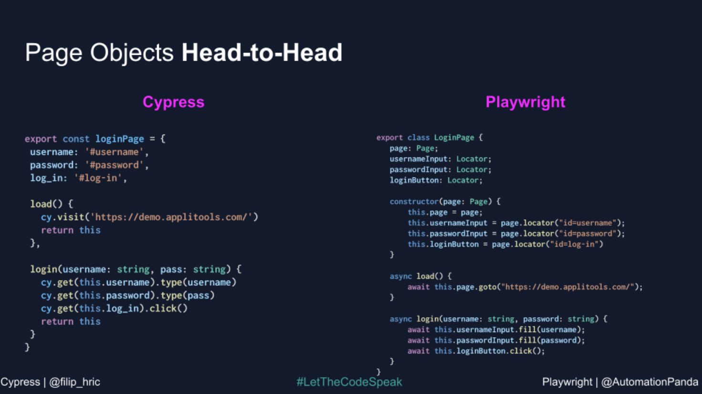
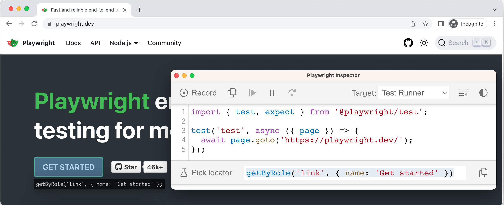
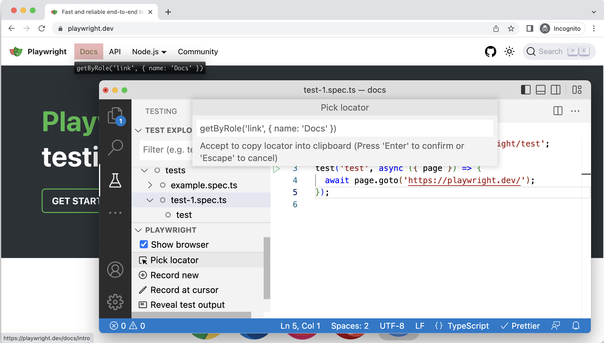
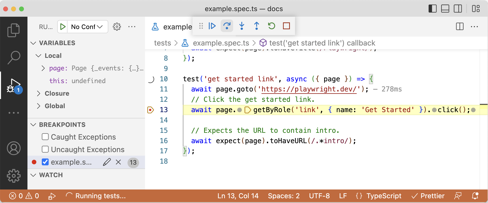

# 들어가기 전에.. (vs. Cypress)

## Cypress에서 Playwright로 왜 넘어갔나??

### Cypress 개발 시 어려움 점

- 테스트 환경 로딩, 테스트 수행 시 너무 많은 시간이 소요한다는 느낌을 받았습니다.
- 테스트 환경에서 엘리먼트를 Cypress 선택 시 못 찾는 경우가 다수 발생했고, 원인을 찾을 수 없었습니다.
- Cypress 만에 문법이 FE 개발자분들에게 익숙하지 않았습니다.
- 테스트 속도 개선을 위해서 병렬 테스트 하고 싶어도 추가적인 금액을 지불해야하는 어려움이 있었습니다.

→ 해당 어려움을 극복하기 위해서 다른 테스트 라이브러리를 찾아보게 되었고, 찾던 중에 위에 어려움점을 해결해 줄 수 있는 라이브러리를 하나를 발견하게 되었습니다. 바로, 마이크로소프트에서 만든 Playwright 입니다.

### Cypress vs Playwright

- 테스트 속도 비교
  - e2e 테스트 고립을 위해서 링크 이동부터 진행 할 경우 spec 1개 기준으로는 볼 경우 Cypress 보다는 엄청 빠르진 않았다.
    - 단, 병렬로 실행할 경우 case 가 많아 질 경우 테스트 속도가 빨라지는 걸 느낄 수 있었다.
    - [https://emewjin.github.io/playwright-vs-cypress/#테스트-속도가-cypress보다-진짜-더-빠를까](https://emewjin.github.io/playwright-vs-cypress/#%ED%85%8C%EC%8A%A4%ED%8A%B8-%EC%86%8D%EB%8F%84%EA%B0%80-cypress%EB%B3%B4%EB%8B%A4-%EC%A7%84%EC%A7%9C-%EB%8D%94-%EB%B9%A0%EB%A5%BC%EA%B9%8C)
  - Playwright beforeAll 함수를 제공하고 있어서 SPA 구조로 되어 있는 웹에서는 초기에 링크 이동 후 page.goBack() 이동 시 beforeEach 대비해서 테스트 속도가 빨라지는 걸 느낄 수 있었다.(단, beforeAll에서는 page 얻어올 수 없어서 새로 만들어야하는데 그럴 경우 병렬 실행을 할 수가 없었다)
  - 회사에 프로젝트에 추가해 본 결과 대략 5배 정도 빨리진다는 걸 알 수 있었습니다.
- 테스트 지원 환경
  - Playwright
    - 크로미움 기반 브라우저, 파이어폭스, **사파리 지원**
    - **모바일 브라우저 제공**
    - **실험모드: 안드로이드 크롬/웹뷰, Electron 지원예정**
  - Cypress
    - 크로미움 기반의 브라우저, 파이어폭스 2가지만 지원
- 병렬 테스트 지원
  - Playwright
    - **모든 테스트를 병렬로 진행**
    - **최대 4개까지 worker thread 세팅 가능**
      - 단 worker thread 지정 시 테스트 단위로 고립해서 작성이 필수!!
  - Cypress
    - 모든 테스트를 직렬로 진행
    - 단, 병렬 테스트 진행 시 유료 플랜을 가입해야지 CI/CD 환경에서 별렬 테스트를 수행 가능 → 돈을 내야해요ㅜㅜ)
- 많은 이벤트 지원
  - hover, drag 지원(cypress 미지원)
- 문법
  - 지원하는 언어에 대한 순수 문법을 지원한다.(cypress에서는 자체 문법을 제공)
    

# Playwright 소개


Playwright는 MS에서 만든 오픈소스 웹 테스트, 자동화 라이브러리 입니다. 하나의 API로 Chromium, Firefox, WebKit, 모웹(Chromium, Safari등)까지 테스트 할 수 있습니다.([Next 버전](https://playwright.dev/docs/next/api/class-android)에서는 ADB를 이용한 Android Chrome, Electron )도 지원하는 걸로 보입니다)

사실, Playwright 자체는 E2E 테스트 프레임워크가 아니고, @playwright/test 프레임워크를 사용하여서 크로스 브라우징 테스트가 가능합니다. (단, 레거시 Edge나 IE 지원하지 않음)

## playwright 특징

- 특징
  하나의 API로 멀티 브라우저/플랫폼 테스트 가능
  - Cross-browser: 최신 모던 브라우저인 Chromium, Webkit, Firefox 지원
  - Cross-platform: Windows, Linux, MacOS, locally or CI, headless or headed
  - Cross-language: Typescript, Javascript, Python, .NET, Java
  - Test Mobile Web: 네이티브 모바일 에뮬레이션을 활용해서 모웹 안드로이드/사파리 테스트
    그외 기능
  - 자동 대기: 액션이 실행되기 전까지 엘리먼트가 준비될때까지 자동 기다림(timeout 옵션)
  - 재시도: 필요한 조건이 충족될때까지 검사가 자동 재시도(retry 옵션)
  - Tracing: 실행 추적, 비디오, 스키린샷 캡쳐를 통해서 오류 추적 가능
  - 네트워크 요청을 모킹하기 위한 네트워크 활동 훅킹 가능
  - 마우스, 키보드의 기본 입력 이벤트 테스트 지원
    강력한 툴
  - Codegen: Playwright 기능을 바탕으로 자동화 테스트 코드를 생성해주는 도구
    - 자동으로 코드를 생성해주기 때문에, 코드 작성 시간과 노력을 절약 가능
  - inspector: 테스트 실행 단계별 디버깅 실행(크롬 개발자 도구 축소버전)
  - trace viewer: 테스트 실패를 조사하기 위해 모든 정보를 캡쳐

# Playwright 구축

## Test 파일

파일명에 test를 포함해야합니다. hotfix.test.ts 와 같은 형태의 파일명을 가집니다.

- playwright.config.ts에서 testMatch를 통해서 확장자 변경은 가능합니다.

## Timeouts

- playwright는 여러 태스크 별로 별도에 타임아웃을 가지고 있습니다.
- 글로벌/커맨드 별로 타임아웃 설정이 가능합니다.
  - 간소화 테스트 전역 타임아웃: 2초(timeout: 60 _ 1000 _ 2)
  - 커맨드 타임아웃 설정
    ```tsx
    await page
      .locator('[class*="modal"]')
      .locator('text=취소하기')
      .click({ timeout: 40000 });
    ```
    | Timeout                    | Default    | Description                                                                                                                            |
    | -------------------------- | ---------- | -------------------------------------------------------------------------------------------------------------------------------------- |
    | Test timeout               | 30000 ms   | Timeout for each test, includes test, hooks and fixtures:SET DEFAULTconfig = { timeout: 60000 }OVERRIDEtest.setTimeout(120000)         |
    | Expect timeout             | 5000 ms    | Timeout for each assertion:SET DEFAULTconfig = { expect: { timeout: 10000 } }OVERRIDEexpect(locator).toBeVisible({ timeout: 10000 })   |
    | Action timeout             | no timeout | Timeout for each action:SET DEFAULTconfig = { use: { actionTimeout: 10000 } }OVERRIDElocator.click({ timeout: 10000 })                 |
    | Navigation timeout         | no timeout | Timeout for each navigation action:SET DEFAULTconfig = { use: { navigationTimeout: 30000 } }OVERRIDEpage.goto('/', { timeout: 30000 }) |
    | Global timeout             | no timeout | Global timeout for the whole test run:SET IN CONFIGconfig = { globalTimeout: 60*60*1000 }                                              |
    | beforeAll/afterAll timeout | 30000 ms   | Timeout for the hook:SET IN HOOKtest.setTimeout(60000)                                                                                 |
    | Fixture timeout            | no timeout | Timeout for an individual fixture:SET IN FIXTURE{ scope: 'test', timeout: 30000 }                                                      |
- 팁
  - 테스트케이스는 읽기 쉽고 의미 전달이 명확한 한글로 작성하는 것이 좋을 것 같습니다.
  - 카카오나 NHN, 클래스101 등에서도 한글로 테스트케이스를 작성하는 것으로 보입니다.

## CLI

다음의 명령어로 터미널에서 테스트를 수행할 수 있습니다. 기본적으로 **headless** 로 동작합니다.
headless 란?
GUI환경이 아닌 브라우저를 뜻합니다. CLI (Command Line Interface)에서 동작하는 것을 의미합니다.

```tsx
yarn playwright test
```

run 옵션 참고: [https://playwright.dev/docs/test-cli](https://playwright.dev/docs/test-cli)
환경설정 파일에 설정된 브라우저/플랫폼에 대해서 테스트가 수행됩니다.
playwright에 내장된 에뮬레이터에서 제공되는 브라우저/플랫폼(chromium, firefox, safari)를 지정하여 테스트를 수행할 수 있습니다.
[https://playwright.dev/docs/emulation](https://playwright.dev/docs/emulation)
테스트 고려 사항

## 테스트 속도 개선

- 테스트 수행 중에 가장 시간이 많이 소요되는 부분에 대해서는 테스트 진행 전에 수행할 수 있도록 처리해야합니다.
- 속도가 늦어 질 경우 배포 이후에 빠른 대응을 못함으로 꼭 테스트 수행 시간에 대해서 고민 후 개발을 진행해주시면 좋을 것 같습니다.

```tsx
// context, page 생성 시간 단축을 위해서 테스트 전에 한번만 수행
test.beforeAll(async ({ browser, baseURL, contextOptions }) => {
  const context = await browser.newContext(contextOptions);
  page = await context.newPage();

  await page.goto('/');
});

test.beforeEach(async ({ isMobile }) => {
  if (isMobile) {
    await page.locator('[aria-label="navigation-button"]').click();
    await page.locator('[aria-label="about-link"]:visible').click();
  } else {
    await page
      .locator(
        '[aria-label="desktop-navigation"] [aria-label="about-link"]:visible',
      )
      .click();
  }
});
```

# ⭐ 테스트 전략 ⭐

## 병렬 테스트

- 각 테스트 별로 의존적이지 않도록 테스트 코드를 고립시키는 가이드 제공
  - 현재는 단일 스레드로만 동작하도록 세팅

## 멀티 플랫폼/브라우저 테스트

- 와디즈 서비스만에 타겟 멀티 플랫폼/브라우저 전략을 세워야 할 것 같습니다.
- 현재는 크롬(웹, 모웹)에 대해서만 테스트를 진행하고 있습니다.
  - 서포터 사이드, 메이커 사이드별로 다른 타겟 지정이 필요
- 다른 회사 사례
  - 하이퍼커넥트: safari를 필수로 테스트 진행
    - [https://hyperconnect.github.io/2022/01/28/e2e-test-with-playwright.html](https://hyperconnect.github.io/2022/01/28/e2e-test-with-playwright.html)

# playwright 작성법

## 테스트케이스 작성법

**Run Command Line**

- Running all tests
  ```bash
  npx playwright test
  ```
- Running a single test file
  ```tsx
  npx playwright test landing-page.spec.ts
  ```
- Run a set of test files
  ```tsx
  npx playwright test tests/todo-page/ tests/landing-page/
  ```
- Run files that have `landing` or `login` in the file name
  ```tsx
  npx playwright test landing login
  ```
- Run the test with the title
  ```tsx
  npx playwright test -g "add a todo item"
  ```
- Running tests in headed mode
  ```tsx
  npx playwright test landing-page.spec.ts --headed
  ```
- Running tests on a specific project
  ```tsx
  npx playwright test landing-page.ts --project=chromium
  ```
  **Debugging Tests**
- Debugging all tests:
  ```
  npx playwright test --debug
  ```
- Debugging one test file:
  ```
  npx playwright test example.spec.ts --debug
  ```
- Debugging a test from the line number where the `test(..` is defined:
  ```bash
  npx playwright test example.spec.ts:10 --debug
  ```
  **기본적인 테스트케이스 구성**
  **Project Dependencies**
- 테스트 코드 수행 전에 꼭 필요한 테스트를 진행해야 할 경우 global setup action을 작성해주세요.
- Desktop Chrome 진행 전 dependencies에 연관된 setup 파일들을 미리 수행되게 됩니다.

```tsx
// playwright.config.ts
{ name: 'setup', testMatch: /.*\.setup\.ts/ },
{
  name: 'chromium',
  use: { ...devices['Desktop Chrome'] },
  dependencies: ['setup'],
},
```

**Configure globalSetup and globalTeardown**

- 모든 테스트 전에 한번에 수행되야하는 코드에 대해서는 globalSetup/globalTeardown 속성을 적용해주세요.

```tsx
// playwright.config.ts/js
import { defineConfig } from '@playwright/test';
export default defineConfig({
  globalSetup: require.resolve('./global-setup'),
  globalTeardown: require.resolve('./global-teardown'),
  use: {
    baseURL: 'http://localhost:3000/',
    storageState: 'state.json',
  },
});
```

**describe, test**
describe로 테스트들을 논리적으로 나누고, test로 테스트를 작성합니다.
describe 내에서 테스트 전체 선행/후행 작업 필요 시 beforeAll, AfterEach를 사용해보고,
**→ context, page 생성 시 시간이 많이 소요됨으로 전체 테스트 전에 미리 생성해두면 테스트 시간을 줄일 수 있습니다.**
각 테스트 별로 선행/후행 작업 필요 시 beforeEach, afterEach를 사용해주세요.

```tsx
import { expect, Page, test, BrowserContext } from '@playwright/test';

test.describe('홈', () => {
  let browserContext: BrowserContext;
  let page: Page;

  // beforeAll hook은 최초 딱 한번 실행. initialize 작업 등을 수행
  test.beforeAll(async ({ browser, contextOptions }) => {
    browserContext = await browser.newContext(contextOptions);
  });

  test.beforeEach(async ({ isMobile }) => {
    // 페이지 생성
    page = await browserContext.newPage();

    await page.goto('/');

    if (isMobile) {
      await page.locator('[aria-label="navigation-button"]').click();
      await page.locator('[aria-label="career-link"]:visible').click();
    } else {
      await page
        .locator(
          '[aria-label="desktop-navigation"] [aria-label="career-link"]:visible',
        )
        .click();
    }
  });

  test.afterEach(async () => {
    await page.close();
  });

  test.afterAll(async () => {
    await browserContext.close();
  });

  test('02-5. Carrer 상세 화면에 대한 검증을 한다.', async () => {
    const element = await page.locator('main > section > ul > li a').first();
    const href = (await element.getAttribute('href')) as string;

    element.click();

    await expect(page).toHaveURL(href);

    const subElement = await page.locator('main section > div').first();
    await expect(subElement).toBeVisible();
  });
});
```

**테스트 제목**
테스트 제목은 최대한 명시적으로 제목만 보아도 어떤 테스트를 수행하는 지 알 수 있어야하며, 능동형 문장으로 작성합니다. (~~된다 라는 표현은 지양하고 ~~한다 라는 표현으로 작성해요)

## 사소한 꿀팁

### test.only

테스트 파일안에 여러 테스트 케이스들이 있는데 하나의 테스트만 수정해도 파일 내의 모든 테스트 케이스들이 실행됩니다. 작성 중인 테스트 케이스만 실행되도록 **test.only** 를 사용할 수 있습니다.

### test.skip

실행 불가능한 테스트 케이스지만 테스트 목록에는 넣고 싶을 때 **test.skip**을 사용할 수 있습니다. 최종 결과에 pending으로 집계됩니다.
**Selector**
playwright에 selector는 쿼리 우선순위를 기반으로 제공되며, 해당 기능이 안될 locator를 이용해서 자유롭게 엘리먼트에 접근이 가능합니다.
쿼리 우선 순위

- 시각 요소/ 사용자의 인터렉션을 테스트하기 위한 쿼리들 간 우선순위
  - getByRole > getByLabelText > getByPlaceholderText > getByText > getByDisplayValue
- HTML5 와 ARIA 속성을 테스트 하기 위한 쿼리들 간 우선순위
  - getByAltText > getByTitle
- 테스트 ID: 위에 쿼리들로도 불가능한 값을 검색하기 위해서만 사용
  - getByTestId
  - data attribute는 팀 내 합의로 정하는 것이 좋을 것 같습니다.
- 해당 우선순위로도 접근이 불가능할 경우 locator 사용을 해주시면 됩니다.
  ```tsx
  const element = await page.locator('main > section > ul > li a').first();
  ```
  **테스트 도구 활용**
  Playwright Inspector 화면에서 Pick locator 클릭 후 화면을 선택 시 자동으로 테스트 코드를 생성해줍니다.
  해당 기능을 통해서 코드 생성 시 참고가 가능하면, 개발 생산성을 높일 수 있을 것 같습니다.

## Negating Matchers

- 일반적으로 matcher 앞에 .not을 붙여주면 됩니다.

```tsx
expect(value).not.toEqual(0);
await expect(locator).not.toContainText('some text');
```

## Soft Assertions

- 기본적으로 Assertion이 에러가 날 경우 테스트가 종료되지만, Soft Assertions 적용 시 테스트가 종료되지 않고 실패에 대해서 마킹만 해주게 됩니다.

```tsx
// Make a few checks that will not stop the test when failed...
await expect.soft(page.getByTestId('status')).toHaveText('Success');
await expect.soft(page.getByTestId('eta')).toHaveText('1 day');

// ... and continue the test to check more things.
await page.getByRole('link', { name: 'next page' }).click();
await expect
  .soft(page.getByRole('heading', { name: 'Make another order' }))
  .toBeVisible();
```

## Polling

- expect.poll사용하여서 비동기적으로 기다릴 때 사용하게 됩니다.(API 응답을 할 경우 대부분 사용)

```tsx
await expect
  .poll(
    async () => {
      const response = await page.request.get('https://api.example.com');
      return response.status();
    },
    {
      // Custom error message, optional.
      message: 'make sure API eventually succeeds', // custom error message
      // Poll for 10 seconds; defaults to 5 seconds. Pass 0 to disable timeout.
      timeout: 10000,
    },
  )
  .toBe(200);

await expect
  .poll(
    async () => {
      const response = await page.request.get('https://api.example.com');
      return response.status();
    },
    {
      // Probe, wait 1s, probe, wait 2s, probe, wait 10s, probe, wait 10s, probe, .... Defaults to [100, 250, 500, 1000].
      intervals: [1_000, 2_000, 10_000],
      timeout: 60_000,
    },
  )
  .toBe(200);
```

## Retrying

- 코드가 블락 될 경우 intervals를 통해서 재시도 처리를 해주게 됩니다.

```tsx
await expect(async () => {
  const response = await page.request.get('https://api.example.com');
  expect(response.status()).toBe(200);
}).toPass({
  // Probe, wait 1s, probe, wait 2s, probe, wait 10s, probe, wait 10s, probe, .... Defaults to [100, 250, 500, 1000].
  intervals: [1_000, 2_000, 10_000],
  timeout: 60_000,
});
```

# Playwright 가이드

- 가이드
  Playwright 기본

  - Install playwright

    ```bash
    # 브라우저 설치
    $ npm i -D playwright

    # 테스팅 라이브러리 설치
    $ npm i -D @playwright/test
    ```

## Playwright 주요개념

```tsx
const { chromium } = require('playwright');

const browser = await chromium.launch();
// ...
await browser.close();
```

브라우저 인스턴스를 만드는 데 비용이 많이 들기 때문에 Playwright는 단일 인스턴스가 여러 브라우저 컨텍스트를 통해 수행할 수 있는 작업을 극대화하도록 설계되었다.
브라우저 컨텍스트는 브라우저 인스턴스 내에서 분리된 유사 세션이다. 만드는데 빠르고 비용이 적다. 각 테스트를 새로운 브라우저 컨텍스트에서 실행하여 브라우저 상태를 테스트 간에 분리하는 것이 좋다.

```tsx
const browser = await chromium.launch();
const context = await browser.newContext();
```

컨텍스트별로 다른 기기를 시뮬레이션 할 수 있다. 예제에서는 아이폰과 아이패드에 대한 컨텍스트를 생성하고 있다.

```tsx
import { devices } from 'playwright';

const iPhone = devices['iPhone 11 Pro'];
const iPad = devices['iPad Pro 11'];

const iPhoneContext = await browser.newContext({
  ...iPhone,
  permissions: ['geolocation'],
  geolocation: { latitude: 52.52, longitude: 13.39 },
  colorScheme: 'dark',
  locale: 'de-DE',
});
const iPadContext = await browser.newContext({
  ...iPad,
  permissions: ['geolocation'],
  geolocation: { latitude: 37.4, longitude: 127.1 },
  // ...
});
```

컨텍스트는 컨텍스트 내의 단일 탭 또는 팝업 창을 나타내는 페이지를 가질 수 있다. URL로 이동해서 페이지의 콘텐츠와 상호작용할 때 사용하면 된다.
페이지를 이용해서 각기 다른 탭에서 작업하는 것처럼 할 수 있다. 예제에서는 각기 다른 페이지를 탐색한다.

```tsx
// ...
// 페이지1 생성
const page1 = await context.newPage();

// 브라우저에 URL을 입력하는 것처럼 탐색
await page1.goto('http://example.com');
// 인풋 채우기
await page1.fill('#search', 'query');

// 페이지2 생성
const page2 = await context.newPage();

await page2.goto('https://www.nhn.com');
// 링크를 클릭하여 탐색
await page.click('.nav_locale');
// 새로운 url 출력
console.log(page.url());
```

페이지는 다시 1개 이상의 프레임 객체를 가질 수 있다. 각 페이지에는 메인 프레임이 있고 페이지 레벨 상호작용(클릭 등)이 메인 프레임에서 작동하는 것으로 가정한다. iframe 태그와 함께 추가 프레임을 가질 수 있다.
프레임을 이용해서 프레임 내부에 있는 엘리먼트를 가져오거나 조작할 수 있다. 예제에서는 프레임을 가져오는 방법들과 프레임 내부의 엘리먼트와 상호작용하는 방법을 보여준다.

```tsx
// 프레임의 name 속성으로 프레임 가져오기
const frame = page.frame('frame-login');

// 프레임의 URL로 가져오기
const frame = page.frame({ url: /.*domain.*/ });

// 선택자로 프레임 가져오기
const frameElementHandle = await page.$('.frame-class');
const frame = await frameElementHandle.contentFrame();

// 프레임과 상호작용
await frame.fill('#username-input', 'John');
```

## Playwright Commands

### Actions

- input, textarea, [contenteditable] 엘리먼트를 포커스 & 텍스트를 바로 입력할 경우 호출
  locator.fill() 대체해서 사용 가능

  ```tsx
  // Text input
  await page.getByRole('textbox').fill('Peter');

  // Date input
  await page.getByLabel('Birth date').fill('2020-02-02');

  // Time input
  await page.getByLabel('Appointment time').fill('13:15');

  // Local datetime input
  await page.getByLabel('Local time').fill('2020-03-02T05:15');
  ```

- Type characters → real keyboard type
  입력 엘리먼트에 실제 키보드 입력이 되는것처럼 동작
  locator.type() 대체해서 사용 가능
  ```tsx
  // Type character by character
  await page.locator('#area').type('Hello World!');
  ```
- 엘리먼트를 선택하거나 단축키를 생성하기 위한 동작
  keyboardEvent.key 이벤트를 사용이 가능
  [locator.press](http://locator.press/)() 대체 가능

  ```tsx
  // Hit Enter
  await page.getByText('Submit').press('Enter');

  // Dispatch Control+Right
  await page.getByRole('textbox').press('Control+ArrowRight');

  // Press $ sign on keyboard
  await page.getByRole('textbox').press('$');

  // <input id=name>
  await page.locator('#name').press('Shift+A');

  // <input id=name>
  await page.locator('#name').press('Shift+ArrowLeft');
  ```

- input[type=checkbox], input[type=radio] and [role=checkbox] 엘리먼트에 대해서 체크/미체크 세팅, 얻어올 경우 호출
  locator.setChecked() 대체해서 사용 가능

  ```tsx
  // Check the checkbox
  await page.getByLabel('I agree to the terms above').check();

  // Assert the checked state
  expect(
    await page.getByLabel('Subscribe to newsletter').isChecked(),
  ).toBeTruthy();

  // Select the radio button
  await page.getByLabel('XL').check();
  ```

- select 엘리먼트를 단일/다중 선택 시 사용
  특정 옵션에 value, label 선택이 가능
  locator.selectOption() 대체해서 사용가능

  ```tsx
  // Single selection matching the value
  await page.getByLabel('Choose a color').selectOption('blue');

  // Single selection matching the label
  await page.getByLabel('Choose a color').selectOption({ label: 'Blue' });

  // Multiple selected items
  await page
    .getByLabel('Choose multiple colors')
    .selectOption(['red', 'green', 'blue']);
  ```

- DOM이 접근이 가능할 때까지 대기
- DOM이 보여질 때까지 대기(no empty, no display:none, no visibility:hidden)
- 움직임이 멈출때까지 대기(예: transition finishes)
- 뷰포트 안에 엘리먼트가 보여질 경우(scroll)
- 엘리먼트가 다른 엘리먼트에 가려지지 않을 때까지 대기
- 엘리먼트가 detach 된다면 다시 attach 될때까지 대기
- 강제클릭: 다른 엘리먼트에 의해서 가려질 경우 강제로 클릭 가능
- dispatchEvent: 사용자의 입력과 상관없이 클릭 이벤트만 전달하고 싶은경우

```tsx
// Generic click
await page.getByRole('button').click();

// Double click
await page.getByText('Item').dblclick();

// Right click
await page.getByText('Item').click({ button: 'right' });

// Shift + click
await page.getByText('Item').click({ modifiers: ['Shift'] });

// Hover over element
await page.getByText('Item').hover();

// Click the top left corner
await page.getByText('Item').click({ position: { x: 0, y: 0 } });

// Force Click
await page.getByRole('button').click({ force: true });

// Dispatch Click
await page.getByRole('button').dispatchEvent('click');
```

- input 엘리먼트 type=”file”인 경우 사용이 가능
  locator.setInputFiles() 대체 가능
  엘리먼트가 동적으로 생성된 경우 waitForEvent로 대기 가능(page.on(’filechooser’) 대체 가능)

  ```tsx
  // Select one file
  await page.getByLabel('Upload file').setInputFiles('myfile.pdf');

  // Select multiple files
  await page
    .getByLabel('Upload files')
    .setInputFiles(['file1.txt', 'file2.txt']);

  // Remove all the selected files
  await page.getByLabel('Upload file').setInputFiles([]);

  // Upload buffer from memory
  await page.getByLabel('Upload file').setInputFiles({
    name: 'file.txt',
    mimeType: 'text/plain',
    buffer: Buffer.from('this is test'),
  });

  // Start waiting for file chooser before clicking. Note no await.
  const fileChooserPromise = page.waitForEvent('filechooser');
  await page.getByLabel('Upload file').click();
  const fileChooser = await fileChooserPromise;
  await fileChooser.setFiles('myfile.pdf');
  ```

- locator.focus() 함수로 대체 가능
  ```tsx
  await page.getByLabel('Password').focus();
  ```
  locator.dragTo() 대체 가능
  lower-level 함수로 대체할 경우(locator.hover, mouse.down, mouse.move, mouse.up 사용가능)

```tsx
// drag and drop
await page
  .locator('#item-to-be-dragged')
  .dragTo(page.locator('#item-to-drop-at'));

// lower-level
await page.locator('#item-to-be-dragged').hover();
await page.mouse.down();
await page.locator('#item-to-drop-at').hover();
await page.mouse.up();
```

## Assertions

[https://playwright.dev/docs/test-assertions](https://playwright.dev/docs/test-assertions)
Assertion은 기대값과 결과값을 검사하기 위해 사용합니다.
Playwright test assertion 수행 시 expect 함수를 사용할 수 있으며, 다양한 assertions 함수를 제공하고 있습니다.
<br />
<br />
| Assertion | Description |
| ----------------------------------------------------------------------------------------------- | --------------------------------- |
| [expect(locator).toBeChecked()](https://playwright.dev/docs/api/class-locatorassertions#locator-assertions-to-be-checked) | Checkbox is checked |
| [expect(locator).toBeDisabled()](https://playwright.dev/docs/api/class-locatorassertions#locator-assertions-to-be-disabled) | Element is disabled |
| [expect(locator).toBeEditable()](https://playwright.dev/docs/api/class-locatorassertions#locator-assertions-to-be-editable) | Element is enabled |
| [expect(locator).toBeEmpty()](https://playwright.dev/docs/api/class-locatorassertions#locator-assertions-to-be-empty) | Container is empty |
| [expect(locator).toBeEnabled()](https://playwright.dev/docs/api/class-locatorassertions#locator-assertions-to-be-enabled) | Element is enabled |
| [expect(locator).toBeFocused()](https://playwright.dev/docs/api/class-locatorassertions#locator-assertions-to-be-focused) | Element is focused |
| [expect(locator).toBeHidden()](https://playwright.dev/docs/api/class-locatorassertions#locator-assertions-to-be-hidden) | Element is not visible |
| [expect(locator).toBeInViewport()](https://playwright.dev/docs/api/class-locatorassertions#locator-assertions-to-be-in-viewport) | Element intersects viewport |
| [expect(locator).toBeVisible()](https://playwright.dev/docs/api/class-locatorassertions#locator-assertions-to-be-visible) | Element is visible |
| [expect(locator).toContainText()](https://playwright.dev/docs/api/class-locatorassertions#locator-assertions-to-contain-text) | Element contains text |
| [expect(locator).toHaveAttribute()](https://playwright.dev/docs/api/class-locatorassertions#locator-assertions-to-have-attribute) | Element has a DOM attribute |
| [expect(locator).toHaveClass()](https://playwright.dev/docs/api/class-locatorassertions#locator-assertions-to-have-class) | Element has a class property |
| [expect(locator).toHaveCount()](https://playwright.dev/docs/api/class-locatorassertions#locator-assertions-to-have-count) | List has exact number of children |
| [expect(locator).toHaveCSS()](https://playwright.dev/docs/api/class-locatorassertions#locator-assertions-to-have-css) | Element has CSS property |
| [expect(locator).toHaveId()](https://playwright.dev/docs/api/class-locatorassertions#locator-assertions-to-have-id) | Element has an ID |
| [expect(locator).toHaveJSProperty()](https://playwright.dev/docs/api/class-locatorassertions#locator-assertions-to-have-js-property) | Element has a JavaScript property |
| [expect(locator).toHaveScreenshot()](https://playwright.dev/docs/api/class-locatorassertions#locator-assertions-to-have-screenshot-1) | Element has a screenshot |
| [expect(locator).toHaveText()](https://playwright.dev/docs/api/class-locatorassertions#locator-assertions-to-have-text) | Element matches text |
| [expect(locator).toHaveValue()](https://playwright.dev/docs/api/class-locatorassertions#locator-assertions-to-have-value) | Input has a value |
| [expect(locator).toHaveValues()](https://playwright.dev/docs/api/class-locatorassertions#locator-assertions-to-have-values) | Select has options selected |
| [expect(page).toHaveScreenshot()](https://playwright.dev/docs/api/class-pageassertions#page-assertions-to-have-screenshot-1) | Page has a screenshot |
| [expect(page).toHaveTitle()](https://playwright.dev/docs/api/class-pageassertions#page-assertions-to-have-title) | Page has a title |
| [expect(page).toHaveURL()](https://playwright.dev/docs/api/class-pageassertions#page-assertions-to-have-url) | Page has a URL |
| [expect(apiResponse).toBeOK()](https://playwright.dev/docs/api/class-apiresponseassertions#api-response-assertions-to-be-ok) | Response has an OK status |

- 일반적으로 matcher 앞에 .not을 붙여주면 됩니다.

```tsx
expect(value).not.toEqual(0);
await expect(locator).not.toContainText('some text');
```

기본적으로 테스트 실패 시 실행이 종료되지만, soft assertion 일 경우에는 종료가 되지 않는다.
실패 여부를 체크하기 위해서 [test.info](http://test.info/) 사용 가능

```tsx
// Make a few checks that will not stop the test when failed...
await expect.soft(page.getByTestId('status')).toHaveText('Success');
await expect.soft(page.getByTestId('eta')).toHaveText('1 day');

// ... and continue the test to check more things.
await page.getByRole('link', { name: 'next page' }).click();
await expect
  .soft(page.getByRole('heading', { name: 'Make another order' }))
  .toBeVisible();

// test.info
//// Make a few checks that will not stop the test when failed...
await expect.soft(page.getByTestId('status')).toHaveText('Success');
await expect.soft(page.getByTestId('eta')).toHaveText('1 day');

//// Avoid running further if there were soft assertion failures.
expect(test.info().errors).toHaveLength(0);
```

특정 에러 메시지를 표현
expect.soft 대체 가능

```tsx
await expect(page.getByText('Name'), 'should be logged in').toBeVisible();

Error: should be logged in

// Call log:
//   - expect.toBeVisible with timeout 5000ms
//   - waiting for "getByText('Name')"

//   2 |
//   3 | test('example test', async({ page }) => {
// > 4 |   await expect(page.getByText('Name'), 'should be logged in').toBeVisible();
//     |                                                                  ^
//   5 | });
//   6 |

// 동일한 코드
expect.soft(value, 'my soft assertion').toBe(56);

```

- expect.poll사용하여서 비동기적으로 기다릴 때 사용하게 됩니다.(API 응답을 할 경우 대부분 사용)

```tsx
await expect
  .poll(
    async () => {
      const response = await page.request.get('<https://api.example.com>');
      return response.status();
    },
    {
      // Custom error message, optional.
      message: 'make sure API eventually succeeds', // custom error message
      // Poll for 10 seconds; defaults to 5 seconds. Pass 0 to disable timeout.
      timeout: 10000,
    },
  )
  .toBe(200);

await expect
  .poll(
    async () => {
      const response = await page.request.get('<https://api.example.com>');
      return response.status();
    },
    {
      // Probe, wait 1s, probe, wait 2s, probe, wait 10s, probe, wait 10s, probe, .... Defaults to [100, 250, 500, 1000].
      intervals: [1_000, 2_000, 10_000],
      timeout: 60_000,
    },
  )
  .toBe(200);
```

- 코드가 블락 될 경우 intervals를 통해서 재시도 처리를 해주게 됩니다

```tsx
// API 응답이 성공할 때까지 코드 블록을 재 실행
await expect(async () => {
  const response = await page.request.get('<https://api.example.com>');
  expect(response.status()).toBe(200);
}).toPass();

// API 응답에 재시도 간격에 대해서 사용자 지정 시간을 세팅
await expect(async () => {
  const response = await page.request.get('<https://api.example.com>');
  expect(response.status()).toBe(200);
}).toPass({
  // Probe, wait 1s, probe, wait 2s, probe, wait 10s, probe, wait 10s, probe, .... Defaults to [100, 250, 500, 1000].
  intervals: [1_000, 2_000, 10_000],
  timeout: 60_000,
});
```

## Locators

page.getByRole() → 접근성 속성을 찾을 경우

- 보조 기술이 페이지를 인식하는 방법을 사용할 경우 사용
  page.getByLabel() → form 컨트롤 라벨 텍스트 찾을 경우
- form fields 찾을 경우 사용
  page.getByPlaceholder() → placeholder 찾은 경우
- 엘리먼트에 label이 없고 placeholder 텍스트가 있는경우 사용
  page.getByText() → 텍스트 찾을 경우
- 인터렉션이 없는 엘리먼트의 텍스트를 찾을 경우(div, span, p) 사용
- 인터렉션이 있는 엘리먼트(button, a, input): page.getByLabel
  page.getByAltText() → 대체 텍스트를 찾을 경우
- img, area 엘리먼트 처럼 대체 텍스트가 있는 경우 사용
  page.getByTitle() → 타이틀 속성을 찾을 경우
- 엘리먼트 title 속성이 있는경우
  page.getByTestId() → data-testid 속성을 찾을 경우
- text, role 사용할 없거나, testid를 사용이 가능할 경우 사용
- 엘리먼트 내부에 특정 값을 검색할 경우 filter 사용
- hasText: 텍스트 검색, has: locator 검색

```tsx
// hasText
await page
  .getByRole('listitem')
  .filter({ hasText: 'Product 2' })
  .getByRole('button', { name: 'Add to cart' })
  .click();

// has
await page
  .getByRole('listitem')
  .filter({ has: page.getByRole('heading', { name: 'Product 2' }) })
  .getByRole('button', { name: 'Add to cart' })
  .click();
```

- 특정 엘리먼트 배열의 인덱스 접근 가능
- locator.first(), locator.last(), locator.nth() 대체 가능

```tsx
const banana = await page.getByRole('listitem').nth(1);
```

- Iterate elements
- Iterate using regular for loop
- Evaluate in the page → DOM api 사용할 경우

```tsx
// Iterate elements
for (const row of await page.getByRole('listitem').all())
  console.log(await row.textContent());

// Iterate using regular for loop
const rows = page.getByRole('listitem');
const count = await rows.count();
for (let i = 0; i < count; ++i) console.log(await rows.nth(i).textContent());

// Evaluate in the page
const rows = page.getByRole('listitem');
const texts = await rows.evaluateAll(list =>
  list.map(element => element.textContent),
);
```

# Auto-waiting

모든 관련 검사가 통과할 때까지 자동 대기한 이후에 다음 요청된 작업을 수행합니다.
예를 들어서, page.click()의 경우 playwright는 다음을 확인합니다

- 엘리먼트가 DOM에 연결된 경우
- 엘리먼트가 보여질 경우
- 엘리먼트가 애니메이션 완료, 동작안하는 경우
- 엘리먼트가 다른 요소에 가려지지 않는 경우
- 엘리먼트가 활성화 된 경우
  | Action | [Attached](https://playwright.dev/docs/actionability#attached) | [Visible](https://playwright.dev/docs/actionability#visible) | [Stable](https://playwright.dev/docs/actionability#stable) | [Receives Events](https://playwright.dev/docs/actionability#receives-events) | [Enabled](https://playwright.dev/docs/actionability#enabled) | [Editable](https://playwright.dev/docs/actionability#editable) |
  | ---------------------- | -------------------------------------------------- | ------------------------------------------------- | ------------------------------------------------ | --------------------------------------------------------- | ------------------------------------------------- | -------------------------------------------------- |
  | check | Yes | Yes | Yes | Yes | Yes | - |
  | click | Yes | Yes | Yes | Yes | Yes | - |
  | dblclick | Yes | Yes | Yes | Yes | Yes | - |
  | setChecked | Yes | Yes | Yes | Yes | Yes | - |
  | tap | Yes | Yes | Yes | Yes | Yes | - |
  | uncheck | Yes | Yes | Yes | Yes | Yes | - |
  | hover | Yes | Yes | Yes | Yes | - | - |
  | scrollIntoViewIfNeeded | Yes | - | Yes | - | - | - |
  | screenshot | Yes | Yes | Yes | - | - | - |
  | fill | Yes | Yes | - | - | Yes | Yes |
  | selectText | Yes | Yes | - | - | - | - |
  | dispatchEvent | Yes | - | - | - | - | - |
  | focus | Yes | - | - | - | - | - |
  | getAttribute | Yes | - | - | - | - | - |
  | innerText | Yes | - | - | - | - | - |
  | innerHTML | Yes | - | - | - | - | - |
  | press | Yes | - | - | - | - | - |
  | setInputFiles | Yes | - | - | - | - | - |
  | selectOption | Yes | Yes | - | - | Yes | - |
  | textContent | Yes | - | - | - | - | - |
  | type | Yes | - | - | - | - | - |

# Best Practices

## Testing philosophy

- 사용자에게 보이는 영역/행위 테스트
  - 최종 사용자가 페이지를 보거나, 상호작용이 가능한 페이지에 대해서 테스트를 수행한다.
- 테스트 작성 시 가능하면 고립

  - 테스트 각각에 대해서 격리해서 작업(local/session storage, data, cookies등)
  - 테스트에 특정 반복을 피해야할 경우 before and after hooks를 이용
  - 테스트 파일 내에서 특정 URL 이동, 앱의 이부에 로그인 진행 시 before hooks 이용

  ```tsx
  import { test } from '@playwright/test';

  test.beforeEach(async ({ page }) => {
    // Runs before each test and signs in each page.
    await page.goto('https://github.com/login');
    await page.getByLabel('Username or email address').fill('username');
    await page.getByLabel('Password').fill('password');
    await page.getByRole('button', { name: 'Sign in' }).click();
  });

  test('first', async ({ page }) => {
    // page is signed in.
  });

  test('second', async ({ page }) => {
    // page is signed in.
  });
  ```

- 전체적인 흐름이 맞는 테스트 코드 작성(긴 테스트도 괜찮다.)

  - 전체 앱 흐름을 테스트 할 경우 여러 작업에 대한 assertion 처리로 괜찮다.
  - 긴 테스트를 굳이 개별 테스트로 나눌 경우 테스트 실행 속도를 늦추기 때문에 피해야 한다.
  - 긴 테스트 에러 발생 시 종료하지 않고 에러만 표시할 경우 soft assertion 사용 가능하다.

  ```tsx
  // Make a few checks that will not stop the test when failed...
  await expect.soft(page.getByTestId('status')).toHaveText('Success');

  // ... and continue the test to check more things.
  await page.getByRole('link', { name: 'next page' }).click();
  ```

- third-party 종속된 테스트는 피하라
  ```tsx
  await page.route('**/api/fetch_data_third_party_dependency', route =>
    route.fulfill({
      status: 200,
      body: testData,
    }),
  );
  await page.goto('https://example.com');
  ```

## Best Practices

**playwright에 내장된 locator를 사용해라**

- auto waiting, retry-ability 등의 기능을 사용하기 위해서 내장된 locator를 이용

```tsx
👍 page.getByRole('button', { name: 'submit' })
```

**Use chaining and filtering**

- 페이지의 특정 부분을 검색할 경우 chaning, filtering으로 좁히는 걸 추천

```tsx
const product = page.getByRole('listitem').filter({ hasText: 'Product 2' });

await page
  .getByRole('listitem')
  .filter({ hasText: 'Product 2' })
  .getByRole('button', { name: 'Add to cart' })
  .click();
```

**Prefer user-facing attributes to XPath or CSS selectors**

- 유저 중심의 속성 셀렉터를 사용

```tsx
👎 page.locator('button.buttonIcon.episode-actions-later')

👍 page.getByRole('button', { name: 'submit' })
```

**codegen을 활용한 locators 자동생성**

```tsx
npx playwright codegen playwright.dev
```



### VS Code extension 을 활용한 locators 자동생성



### 적절한 Assertion 사용

```tsx
  👍 await expect(page.getByText('welcome')).toBeVisible();

  👎 expect(await page.getByText('welcome').isVisible()).toBe(true);
```

### Local debugging

- vscode extension을 활용해서 디버깅하는 것을 추천
  
- command 방식으로 디버깅 가능
- 특정 테스트 파일, 테스트 라인 번호를 추가해서 디버깅 가능

```tsx
npx playwright test --debug

npx playwright test example.spec.ts:9 --debug
```

# Playwright 현실적인 적용방안

- 마케팅 툴에 대한 예외처리: 진행 중
  - 테스트 자동화 툴로 실행된 환경에서 GA, Braze 등의 마케팅 툴에 대해서 동작하지 않도록 수정(navigator.webdriver 이용한 분기)
    - [Navigator: webdriver property - Web APIs | MDN](https://developer.mozilla.org/en-US/docs/Web/API/Navigator/webdriver)
- 지원 브라우저/플랫폼에 대한 정의 CTO팀 스펙논의 필요
  - Playwright에서 지원하는 크로미움, 파포, 사파리, 모웹(AOS, IOS)에 대한 서비스만에 기준이 필요
- E2E 테스트에 에러에 대한 대응 자세 CTO팀 스펙논의 필요
  - 각 팀별로 에러 발생 시 어떻게 대응할지에 대한 전략이 필요(담당자 지정) → 슬랙으로 노티는 필수

# E2E 테스트 자동화 구축을 위해서 어떤 걸 해야할까?

### 시나리오 작성(기획/QA/테스트 엔지니어)

- 사용자 인터페이스(UI)를 고려한 테스팅 시나리오 작성
- 수동으로 했던 테스트를 자동화 할 수 있는 테스트 시나리오 작성(라이브 배포 sanity 검증, 기본적인 검증)
- Happy 케이스만이 아닌 Bad 케이스에 대한 시나리오 작성
- 개발 진행 시 테스트 코드 작성한다면 BAT 테스트 일정을 줄이는게 가능
- 기능/컴포넌트 단위 테스트를 자동화로 이관하고, 사용성 테스트를 중점으로 테스트 가능

UX 우선 조직 - 시나리오 작성 편

```tsx
/*
 * 로그인 동작 대한 시나리오 작성
 * 1. 테스트의 동작을 기술한다.
 * 2. 테스트 수행할 행동에 대해서 기술한다.
 * 3. /login 방문한다.
 * 4. 이메일 입력 타이틀 엘리먼트 선택한다.
 * 5. input 엘리먼트에 fake@email.com 입력한다.
 * 6. 비밀번호 입력 타이틀 엘리먼트 선택한다.
 * 7. input 엘리먼트에 1234 입력한다.
 * 8. 로그인 버튼을 클릭 한다.
 * 사용자 인터페이스(UI)를 고려한 시나리오 작성이 필수....
 */

test('account enroll', async ({ page }) => {
  await page.goto('/login');
  await page.getByTitle('이메일 입력').fill(process.env.USER_ID || '');
  await page.getByTitle('비밀번호 입력').fill(process.env.USER_PASSWORD || '');
  await page.locator('.account').getByRole('button').click();
});
```

### 테스트 코드 유지보수 진행여부(기획/QA팀과 논의필요)

- QA팀에서도 진행하고 있는 E2E 테스트와 중첩되지 않도록 진행 가능여부
- 사용자 입장에서 꼭 필요한 테스트에 대한 리스트화 필요
- 서비스 테스트 자동화 확산
  - 성격에 맞는 테스트 자동화 필요
    - 간소화 테스트 개인 의견
      - 테스트 속도 빨라야함(5분 내 → 사람이 테스트 한 것보다 빨라야함) - 핫픽스 테스트 시 5분 정도 소요
      - 성공/실패를 하더라도 빌드에 영향은 없어야한다.
      - 실패하더라도 노티는 하지만, 배포/개발 프로세스에 따로 block 되면 안된다.
    - 그외 테스트
      - 테스트 케이스가 많아 질 경우 도메인 , 기능단위 별로 젠킨스잡/테스트 구성을 다르게 가져간다.

# 기대결과

- 자동화 테스트를 통해서 배포 후에 이슈(버그)를 빠르게 찾을 수 있어 **유저의 경험을 개선**시킬 수 있다.
- 기본적인 사용자 종단 테스트를 통해서 **서비스의 안정화**를 꾀할 수 있다.
- **개발 코드의 신뢰도 상승과 코드의 품질**을 높일 수 있다.
- 새로운 기능에 추가 시 기존 기능까지 같이 테스트를 함으로써 **잠재적인 이슈에 대해서 테스팅이 가능**합니다.
- 멀리 볼 경우 **시간/비용을 절약**할 수 있습니다.

# 참고페이지

- [https://playwright.dev/docs/intro](https://playwright.dev/docs/intro)
- [https://hyperconnect.github.io/2022/01/28/e2e-test-with-playwright.html](https://hyperconnect.github.io/2022/01/28/e2e-test-with-playwright.html)
- [Fast and reliable end-to-end testing for modern web apps | Playwright](https://playwright.dev/)
- [멈춰! 버그 멈춰! E2E 테스트로 버그 멈추기 Feat. Playwright](https://hyperconnect.github.io/2022/01/28/e2e-test-with-playwright.html)
- [Playwright로 E2E 테스트 작성하기](https://ui.toast.com/posts/ko_20210818)
- [E2E 테스트 프레임 워크 - Playwright\_번역본](https://devport.tistory.com/28)
- [[nodejs][playwright][첫걸음] Playwright 생활 자동화를 위한 첫걸음](https://codehive.kr/entry/Playwright%EB%A1%9C-%EC%83%9D%ED%99%9C-%EC%9E%90%EB%8F%99%ED%99%94%EB%A5%BC-%ED%95%B4%EB%B3%B4%EC%9E%90)
- [E2E 테스트 : Playwright](https://velog.io/@heelieben/E2E-%ED%85%8C%EC%8A%A4%ED%8A%B8-PlayWright-2eub88ik)
- [playwright는 진짜 cypress보다 빠를까?](https://emewjin.github.io/playwright-vs-cypress/)
- [playwright test로 E2E 테스트 하기(vs. Cypress)](https://junghan92.medium.com/playwright-test%EB%A1%9C-e2e-%ED%85%8C%EC%8A%A4%ED%8A%B8-%ED%95%98%EA%B8%B0-vs-cypress-473948d3b697)
