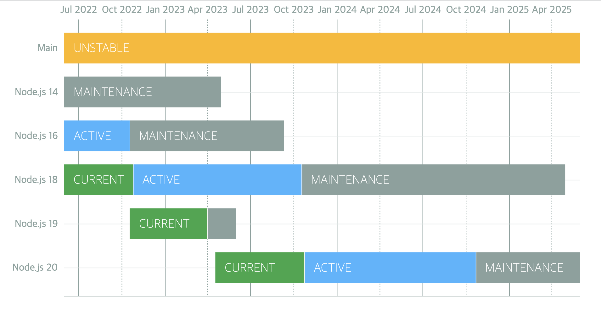
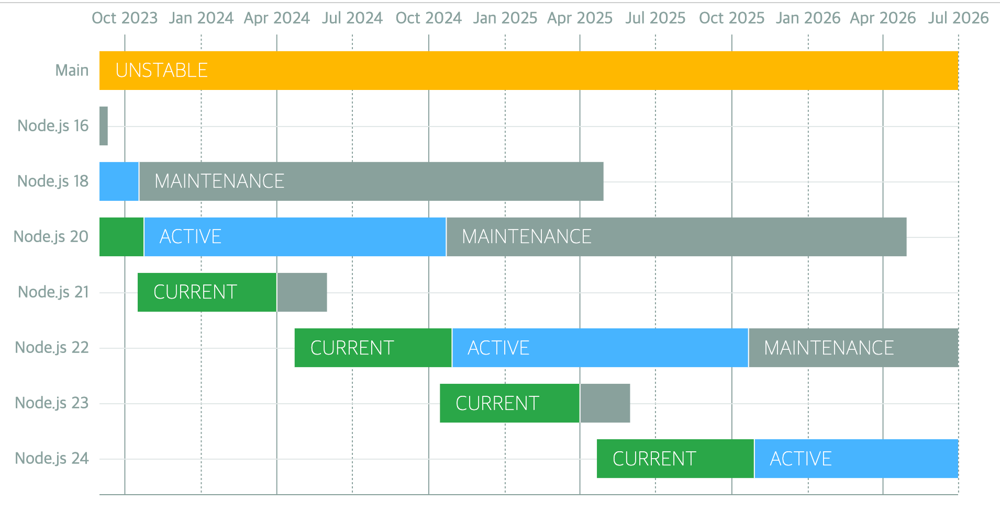
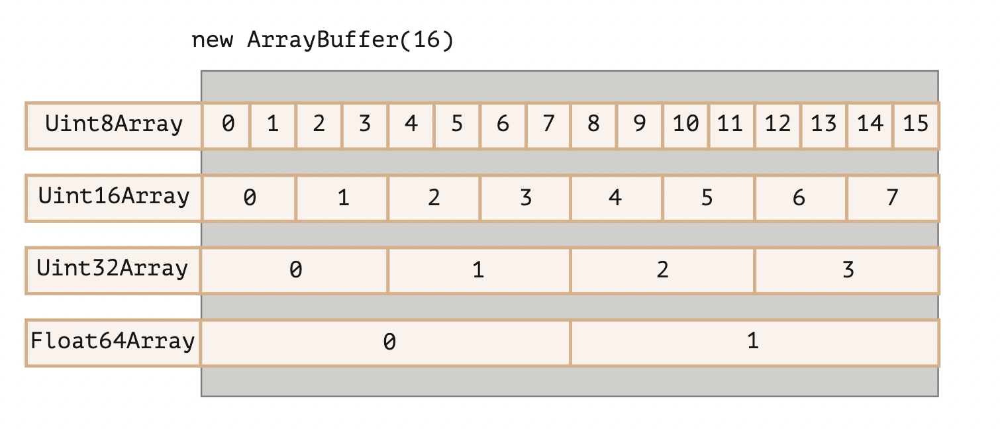

# Concepts

- Introduction to node.js and its internal architecture [http://bcho.tistory.com/881](http://bcho.tistory.com/881)

- Installation and setting up a development environment [http://bcho.tistory.com/884](http://bcho.tistory.com/884)

- Event, Module, NPM [http://bcho.tistory.com/885](http://bcho.tistory.com/885)

- The Express web development framework 1/2 - [http://bcho.tistory.com/887](http://bcho.tistory.com/887)

- Passing information through Express URLs - [https://wayhome25.github.io/nodejs/2017/02/18/nodejs-11-express-query-string/](https://wayhome25.github.io/nodejs/2017/02/18/nodejs-11-express-query-string/)

# Release schedule

In Next.js 13, Turbopack was introduced, a Rust-based package that is the successor to webpack.





**Node.js 14: End of support in April 2023**

**Node.js 16: End of support in September 2023**

**Node.js 17: End of support in June 2022**

**Node.js 18: End of support in April 2025**

**Node.js 19: End of support in June 2023**

**Node.js 20: End of support in April 2026**

**Node.js 21: End of support in April 2024**

**An LTS version is released every October**

[GitHub - nodejs/Release: Node.js Release Working Group](https://github.com/nodejs/Release#end-of-life-releases)

# v16

- ECMAScript RegExp Match Indices

  ```tsx
  const matchObj = /(Java)(Script)/d.exec('JavaScript');
  undefined

  > matchObj.indices
  [ [ 0, 10 ], [ 0, 4 ], [ 4, 10 ], groups: undefined ]

  > matchObj.indices[0]; // Match
  [ 0, 10 ]

  > matchObj.indices[1]; // First capture group
  [ 0, 4 ]

  > matchObj.indices[2]; // Second capture group
  [ 4, 10 ]
  ```

- A stable AbortController implementation based on the [AbortController Web API](https://developer.mozilla.org/en-US/docs/Web/API/AbortController)
- Implementation of the web platform atob (buffer.atob(data)) and btoa (buffer.btoa(data)) for compatibility with legacy web platform APIs
- Node.js provides prebuilt binaries for multiple platforms
  - Intel (darwin-x64), ARM (darwin-arm64), macOS (.pkg, .fat)

**Reference pages**

- [(Translation) Node.js 16 update](https://www.cckn.dev/backend/node.js-16-available-now/)

# v17

**OpenSSL 3.0**

Node.js now includes OpenSSL 3.0, which bundles [quictls/openssl](https://github.com/quictls/openssl) that supports QUIC. With OpenSSL 3.0, FIPS support is once again available through the new FIPS module. For detailed instructions on building Node.js with FIPS support, see [BUILDING.md](https://github.com/nodejs/node/blob/master/BUILDING.md#building-nodejs-with-fips-compliant-openssl).

The OpenSSL 3.0 API should be largely compatible with the API provided in OpenSSL 1.1.1, but because the restrictions on allowed algorithms and key sizes have been tightened, we expect there will be some impact on the ecosystem.

If your application running on Node.js 17 encounters an `ERR_OSSL_EVP_UNSUPPORTED` error, it is likely that your application or a module you are using relies on an algorithm or key size that OpenSSL 3.0 no longer allows by default. As a way to temporarily work around these stricter restrictions, you can revert to the legacy provider by using the `--openssl-legacy-provider` command-line option.

**V8 9.5**

The V8 JavaScript engine has been updated to V8 9.5. This release includes additional supported types for the `Intl.DisplayNames` API and an expanded `timeZoneName` option for the `Intl.DateTimeFormat` API.

You can find more details in the V8 9.5 release post.

**Reference pages**

- [V8 release v9.5 · V8](https://v8.dev/blog/v8-release-95)

- [Node v17.0.0 (current version)](https://nodejs.github.io/nodejs-ko/articles/2021/10/19/release-v17.0.0/)

# v18

- fetch API added (Experimental)

  - The fetch API, previously available only in browser environments, has been introduced experimentally

  ```tsx
  function fetch(input: RequestInfo, init?: RequestInit): Promise<Response>;

  const res = await fetch('https://nodejs.org/api/documentation.json');
  if (res.ok) {
    const data = await res.json();
    console.log(data);
  }
  ```

- HTTP Timeouts
  - You can limit the timeout of HTTP communication in milliseconds. When the timeout expires, the client receives a response with a 408 code.
  ```tsx
  app.get('/*', (req, res) => {
    setTimeout(
      () => res.sendFile(path.join(__dirname, '../build', 'index.html')),
      1000,
    );
  });
  ```
- test runner added (Experimental)

  - You can import the module to write unit tests with node:test and report the results in the TAP (Test Anything Protocol) format. This is similar to Jest, a JavaScript testing framework

  ```tsx
  test('top level test', async t => {
    await t.test('subtest 1', t => {
      assert.strictEqual(1, 1);
    });

    await t.test('subtest 2', t => {
      assert.strictEqual(2, 2);
    });
  });
  ```

- V8 JavaScript engine is updated to V8 10.1
  - findLast and findLastIndex added (ECMAScript 2023)
  - [class fields and private class methods](https://v8.dev/blog/faster-class-features) performance improvements (ECMAScript 2022)

**Reference pages**

- [Let's take a look at the new features in Node.js v18](https://kyungyeon.dev/posts/81)

- [Node.js 18 is now available! | Node.js](https://nodejs.org/en/blog/announcements/v18-release-announce)

- [What is new in Node.js 18](https://fek.io/blog/what-is-new-in-node-js-18/)

# v19

**Node's new watch mode**

Node.js 19 introduced an experimental **--watch** flag that restarts the Node.js server when changes are detected in specified files.

It detects file changes and restarts the Node.js server. (This means you no longer need nodemon ^^)

```tsx
// server.js
const express = require("express");
const app = express();
const PORT = 6060;
app.listen(PORT, () => console.log(`App listening on port: ${PORT}`));
node --watch server
```

**HTTP connections kept alive by default**

The keepAlive option of the http/https modules controls whether the connection to the server should be maintained after a request completes. Originally, you had to manually set the keepAlive option to true. This option instructs the server to keep the connection open and reuse it for subsequent requests.

In Node.js 19, the keepAlive option is set to true by default. This addition significantly reduces the overhead of establishing new connections.

**WebCrypto API stabilization**

The WebCrypto API is Node.js's standard implementation of the Web Crypto API. With Node.js 19, you can now use the Ed25519, Ed448, X25519, and X448 algorithms.

You can access this API using the globalThis module or node:, a prefix introduced in Node.js 18 to distinguish core Node.js modules from third-party libraries.

**Custom ESM resolution adjustments**

Node.js 19 removes the previous experimental **--experimental-specifier-solution** flag. This provided experimental support for locating files using package specifiers, similar to how ECMAScript imports modules.

Node.js removed this flag because the functionality can be replicated using custom loaders. Custom loaders allow you to support more module formats or provide your own logic for loading and processing modules, so you can further process a module before loading it.

**Removal of DTrace/SystemTap/ETW support**

DTrace, SystemTap, and ETW (Event Tracing for Windows) are modules that provide dynamic tracing and analysis of running programs. Originally, Node.js used these to collect data about application activity, including performance indicators, errors, and other possible runtime occurrences.

In Node.js 19, Node.js removed support for DTrace, SystemTap, and ETW, because the complexity involved in keeping these modules up to date and maintaining them is not yet worth the effort. Therefore, support was discontinued in order to prioritize resources.

# v20

- Stable test runner

  - describe, it/test and hooks to structure test files
  - mocking
  - watch mode
  - node --test for running multiple test files in parallel

  ```tsx
  import { test, mock } from 'node:test';
  import assert from 'node:assert';
  import fs from 'node:fs';

  mock.method(fs, 'readFile', async () => 'Hello World');
  test('synchronous passing test', async t => {
    // This test passes because it does not throw an exception.
    assert.strictEqual(await fs.readFile('a.txt'), 'Hello World');
  });
  ```

- V8 JavaScript engine is updated to V8 11.3
  - [String.prototype.isWellFormed and toWellFormed](https://chromestatus.com/feature/5200195346759680)
  - [Methods that change Array and TypedArray by copy](https://chromestatus.com/feature/5068609911521280)
  - [RegExp v flag with set notation + properties of strings](https://chromestatus.com/feature/5144156542861312)
    - Basic_Emoji
    - Emoji_Keycap_Sequence
    - RGI_Emoji_Modifier_Sequence
    - RGI_Emoji_Flag_Sequence
    - RGI_Emoji_Tag_Sequence
    - RGI_Emoji_ZWJ_Sequence
    - RGI_Emoji
    - [https://v8.dev/features/regexp-v-flag](https://v8.dev/features/regexp-v-flag)
- performance improvement
  - Performance improvements for URL, fetch(), and EventTarget
  - Performance improvements for APIs such as URL.canParse() and timers
  - The V8 JavaScript engine is updated to 11.3, improving performance

**Reference pages**

- [nodejs--nodejs-20-변화](https://changhyeon.net/nodejs--nodejs-20-변화)

- [Node.js 20 is now available! | Node.js](https://nodejs.org/en/blog/announcements/v20-release-announce)

# v21

**V8 11.8 update**

- [Array grouping](https://github.com/tc39/proposal-array-grouping)
  Note: this proposal is now at stage 4. See the spec PR here: tc39/ecma262#3176

  ```jsx
  const array = [1, 2, 3, 4, 5];

  // `Object.groupBy` groups items by arbitrary key.
  // In this case, we're grouping by even/odd keys
  Object.groupBy(array, (num, index) => {
    return num % 2 === 0 ? 'even' : 'odd';
  });
  // =>  { odd: [1, 3, 5], even: [2, 4] }

  // `Map.groupBy` returns items in a Map, and is useful for grouping
  // using an object key.
  const odd = { odd: true };
  const even = { even: true };
  Map.groupBy(array, (num, index) => {
    return num % 2 === 0 ? even : odd;
  });
  // =>  Map { {odd: true}: [1, 3, 5], {even: true}: [2, 4] }
  ```

- [ArrayBuffer.prototype.transfer](https://github.com/tc39/proposal-arraybuffer-transfer)
  Stage: 3
  Creates a new ArrayBuffer that holds the same byte data as the current buffer, and then detaches the source ArrayBuffer.

  ```jsx
  const arrBuffer = new ArrayBuffer(16, { maxByteLength: 32 });
  const uint16view = new Uint16Array(arrBuffer);
  uint16view[2] = 15;

  const arrBuffer2 = arrBuffer.transfer();
  console.log(arrBuffer.detached);
  console.log(arrBuffer2.resizable);

  const uint16view2 = new Uint16Array(arrBuffer2);
  console.log(uint16view2[2]);

  /**
  [boolean]true
  [boolean]true
  [number]15
  */
  ```

  ArrayBuffer: A reference type that serves to declare that you want to allocate and use a fixed-length, contiguous block of memory.

  ```jsx
  let arrBuffer = new ArrayBuffer(16); // 이렇게 생성하면 연속된 16바이트만큼의 메모리 공간을 버퍼로 할당해 사용하겠다고 선언하는 것과 같다.
  // ArrayBuffer의 공간 안에 있는 내용을 조작하려면, 특수한 "view"역할을 하는 객체들을 사용해야한다.
  // (이것을 TypedArray라고 부른다)

  var view = null;
  view = new Uint32Array(buffer); // 4바이트(32비트) 꼴로 버퍼에 있는 내용 읽어들일게요

  // Uint8Array = 매 바이트(8비트) 마다 독자적인 정수로 읽어들여 다루겠다는 의미이다
  // Uint16Array = 매 2바이트(16비트) 마다 독자적인 정수로 읽어들여 다루겠다는 의미이다.
  // Uint32Array = 매 4바이트(32비트) 마다...
  // Float64Array = 매 8바이트 (64비트) 마다 float값으로 읽어들여 다루겠다는 의미로, 가능값에 소숫점 이하가 포함될 수 있음을 의미한다.
  ```

  

- [WebAssembly extended-const expressions](https://github.com/WebAssembly/extended-const)
  Adds a new form of constant expression
  [https://github.com/WebAssembly/extended-const/tree/main/proposals/extended-const](https://github.com/WebAssembly/extended-const/tree/main/proposals/extended-const)
  ```wasm
  i32.add
  i32.sub
  i32.mul
  i64.add
  i64.sub
  i64.mul
  ```

**glob syntax support in the Node.js test runner**

With a recent Node.js update, the test runner supports glob expressions by specifying the --test parameter.

Using glob patterns, you can run tests more efficiently and flexibly.

For example, you can use a command like node --test \*_/_.test.ts to run all files with the .test.ts extension across multiple directories.

**HTTP**

Previously, a separate chunk was generated for each .write call regardless of the cork response, but as the version was upgraded, a single chunk is now generated for cork response calls, improving performance.

```wasm
res.cork(); // 데이터를 버퍼에 강제 저장
res.write('Mozilla');
res.write(' Developer Network');
res.uncork(); // 데이터를 버퍼에서 해제(flush)

// 개선 전
HTTP/1.1 200 OK
Content-Type: text/plain
Transfer-Encoding: chunked

7\r\n
Mozilla\r\n
18\r\n
Developer Network\r\n
0\r\n
\r\n

// 개선 후(단일 청크로 결합)
HTTP/1.1 200 OK
Content-Type: text/plain
Transfer-Encoding: chunked

25\r\n
Mozilla Developer Network\r\n
0\r\n
\r\n
```

**[Stable fetch/WebStreams](https://github.com/nodejs/node/pull/45684)**

- The fetch module and WebStreams modules have been stabilized in a recent update.
- This update affects the WebStreams, FormData, Headers, Request, Response, and fetch methods.

**[Add flush option to fs.writeFile function](https://nodejs.org/en/blog/announcements/v21-release-announce#add-flush-option-to-fswritefile-function)**

- When the flush option is set, data is removed from the buffer after the file write operation completes.

**Reference pages**

- [Improvement Performance](https://nodejs.org/en/blog/announcements/v21-release-announce#performance)

- [Built-in WebSocket client](https://github.com/nodejs/node/pull/45684)

- [Node.js 21 is now available! | Node.js](https://nodejs.org/en/blog/announcements/v21-release-announce)

- [ArrayBuffer 와 Blob](https://velog.io/@chltjdrhd777/ArrayBuffer-와-Blob)

## Reference pages

- [nodejs--nodejs-20-변화](https://changhyeon.net/nodejs--nodejs-20-변화)
- [Node.js 20 is now available! | Node.js](https://nodejs.org/en/blog/announcements/v20-release-announce)
