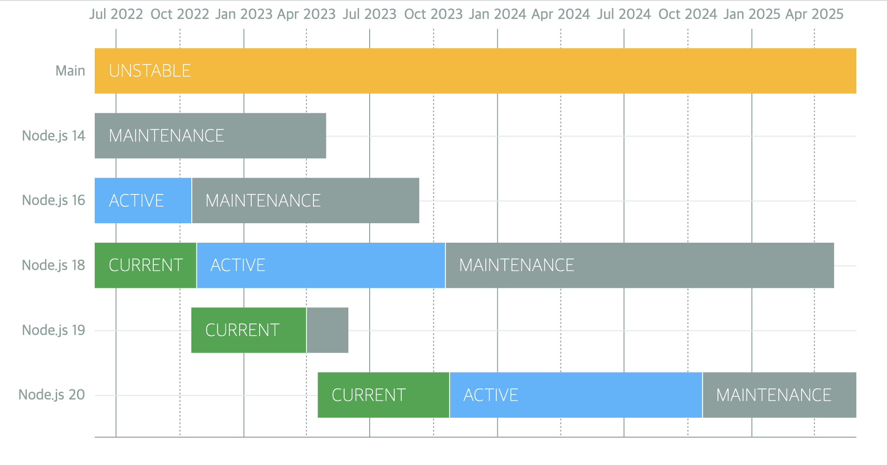

# 개념

- node.js의 소개와 내부 구조 [http://bcho.tistory.com/881](http://bcho.tistory.com/881)

- 설치와 개발환경 구축 [http://bcho.tistory.com/884](http://bcho.tistory.com/884)

- Event,Module,NPM  [http://bcho.tistory.com/885](http://bcho.tistory.com/885)

- 웹 개발 프레임웍 Express 1/2 - [http://bcho.tistory.com/887](http://bcho.tistory.com/887)

- Express URL을 이용한 정보의 전달 - [https://wayhome25.github.io/nodejs/2017/02/18/nodejs-11-express-query-string/](https://wayhome25.github.io/nodejs/2017/02/18/nodejs-11-express-query-string/)

# Release schedule

NextJs 13에서 webpack의 후속 제품인 Rust 기반에 Turbopack 패키지 소개



**Node.js 14: 2023년 4월에 지원이 종료**

**Node.js 16: 2023년 9월에 지원이 종료**

**Node.js 18: 2025년 4월에 지원이 종료**

**Node.js 20: 2026년 4월에 지원이 종료**

**매해 10월에 LTS 버전 릴리즈**

[GitHub - nodejs/Release: Node.js Release Working Group](https://github.com/nodejs/Release#end-of-life-releases)

# v16

## ECMAScript RegExp Match Indices

```tsx
const matchObj = /(Java)(Script)/d.exec('JavaScript');
undefined

> matchObj.indices
[ [ 0, 10 ], [ 0, 4 ], [ 4, 10 ], groups: undefined ]

> matchObj.indices[0]; // Match
[ 0, 10 ]

> matchObj.indices[1]; // First capture group
[ 0, 4 ]

> matchObj.indices[2]; // Second capture group
[ 4, 10 ]
```

## [AbortController Web API](https://developer.mozilla.org/en-US/docs/Web/API/AbortController)에 기반한 안정적인 `AbortController` 구현

## 레거시 웹 플랫폼 API와의 호환성을위한 웹 플랫폼 atob(`buffer.atob(data)`) 및 btoa(`buffer.btoa(data)`) 구현

## Node.js는 여러 플랫폼에 대해 사전 빌드된 바이너리를 제공

- Intel(`darwin-x64`), ARM(`darwin-arm64`), macOS(`.pkg, .fat`)

## 참고페이지

- [(번역) Node.js 16버전 업데이트](https://www.cckn.dev/backend/node.js-16-available-now/)

# v18

## fetch API 추가(Experimental)

- 브라우저 환경에서만 사용 가능하던 fetch API 가 실험적으로 도입되었습니다

```tsx
function fetch(input: RequestInfo, init?: RequestInit): Promise<Response>;

const res = await fetch('https://nodejs.org/api/documentation.json');
if (res.ok) {
  const data = await res.json();
  console.log(data);
}
```

## HTTP Timeouts

- http 통신의 시간제한을 밀리초 단위로 제한할 수 있습니다. 시간제한이 만료되었을 땐, 클라이언트로는 408 코드로 응답을 하게됩니다.

```tsx
app.get('/*', (req, res) => {
  setTimeout(
    () => res.sendFile(path.join(__dirname, '../build', 'index.html')),
    1000,
  );
});
```

## test runner 추가(Experimental)

- 모듈을 가져와서 node:test단위 테스트를 작성하고 결과를 TAP(Test Anything Protocol) 형식으로 보고할 수 있습니다. 이는 JavaScript의 테스팅 프레임워크인 Jest 와 비슷합니다

```tsx
test('top level test', async t => {
  await t.test('subtest 1', t => {
    assert.strictEqual(1, 1);
  });

  await t.test('subtest 2', t => {
    assert.strictEqual(2, 2);
  });
});
```

## V8 JavaScript engine is updated to V8 10.1

- findLast와 findLastIndex 추가(ecmascript 2023)
- [class fields and private class methods](https://v8.dev/blog/faster-class-features) 성능향상(ecmascript 2022)

## 참고페이지

- [Node.js v18 의 새로운 기능을 살펴보자](https://kyungyeon.dev/posts/81)
- [Node.js 18 is now available! | Node.js](https://nodejs.org/en/blog/announcements/v18-release-announce)
- [What is new in Node.js 18](https://fek.io/blog/what-is-new-in-node-js-18/)

# v20

## 안정적인 테스트 러너

- `describe`, `it`/`test` and hooks to structure test files
- mocking
- watch mode
- `node --test` for running multiple test files in parallel

```tsx
import { test, mock } from 'node:test';
import assert from 'node:assert';
import fs from 'node:fs';

mock.method(fs, 'readFile', async () => 'Hello World');
test('synchronous passing test', async t => {
  // This test passes because it does not throw an exception.
  assert.strictEqual(await fs.readFile('a.txt'), 'Hello World');
});
```

## V8 JavaScript engine is updated to V8 11.3

- [String.prototype.isWellFormed and toWellFormed](https://chromestatus.com/feature/5200195346759680)
- [Methods that change Array and TypedArray by copy](https://chromestatus.com/feature/5068609911521280)
- [RegExp v flag with set notation + properties of strings](https://chromestatus.com/feature/5144156542861312)
  - Basic_Emoji
  - Emoji_Keycap_Sequence
  - RGI_Emoji_Modifier_Sequence
  - RGI_Emoji_Flag_Sequence
  - RGI_Emoji_Tag_Sequence
  - RGI_Emoji_ZWJ_Sequence
  - RGI_Emoji
  - [https://v8.dev/features/regexp-v-flag](https://v8.dev/features/regexp-v-flag)
- performance improvement
  - URL, fetch(), EventTarget 성능 개선
  - URL.canParse() 및 타이머와 같은 API의 성능 개선
  - V8 JavaScript 엔진이 11.3으로 업데이트 되며 성능이 개선

## 참고페이지

- [nodejs--nodejs-20-변화](https://changhyeon.net/nodejs--nodejs-20-변화)
- [Node.js 20 is now available! | Node.js](https://nodejs.org/en/blog/announcements/v20-release-announce)
