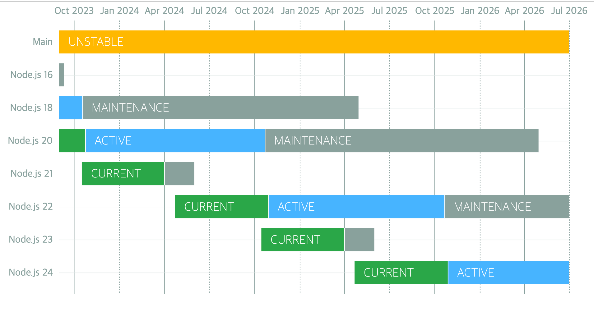
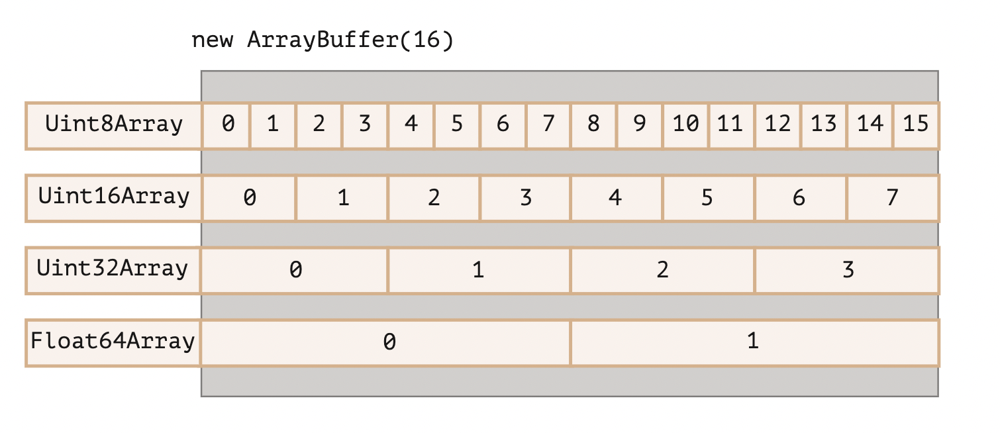

# 개념

- node.js의 소개와 내부 구조 [http://bcho.tistory.com/881](http://bcho.tistory.com/881)

- 설치와 개발환경 구축 [http://bcho.tistory.com/884](http://bcho.tistory.com/884)

- Event,Module,NPM  [http://bcho.tistory.com/885](http://bcho.tistory.com/885)

- 웹 개발 프레임웍 Express 1/2 - [http://bcho.tistory.com/887](http://bcho.tistory.com/887)

- Express URL을 이용한 정보의 전달 - [https://wayhome25.github.io/nodejs/2017/02/18/nodejs-11-express-query-string/](https://wayhome25.github.io/nodejs/2017/02/18/nodejs-11-express-query-string/)

# Release schedule

NextJs 13에서 webpack의 후속 제품인 Rust 기반에 Turbopack 패키지 소개




**Node.js 14: 2023년 4월에 지원 종료**

**Node.js 16: 2023년 9월에 지원 종료**

**Node.js 17: 2022년 6월에 지원 종료**

**Node.js 18: 2025년 4월에 지원 종료**

**Node.js 19: 2023년 6월에 지원 종료**

**Node.js 20: 2026년 4월에 지원 종료**

**Node.js 21: 2024년 4월에 지원 종료**

**매해 10월에 LTS 버전 릴리즈**

[GitHub - nodejs/Release: Node.js Release Working Group](https://github.com/nodejs/Release#end-of-life-releases)

# v16

- ECMAScript RegExp Match Indices

  ```tsx
  const matchObj = /(Java)(Script)/d.exec('JavaScript');
  undefined

  > matchObj.indices
  [ [ 0, 10 ], [ 0, 4 ], [ 4, 10 ], groups: undefined ]

  > matchObj.indices[0]; // Match
  [ 0, 10 ]

  > matchObj.indices[1]; // First capture group
  [ 0, 4 ]

  > matchObj.indices[2]; // Second capture group
  [ 4, 10 ]
  ```

- [AbortController Web API](https://developer.mozilla.org/en-US/docs/Web/API/AbortController)에 기반한 안정적인 AbortController 구현
- 레거시 웹 플랫폼 API와의 호환성을위한 웹 플랫폼 atob(buffer.atob(data)) 및 btoa(buffer.btoa(data)) 구현
- Node.js는 여러 플랫폼에 대해 사전 빌드된 바이너리를 제공
  - Intel(darwin-x64), ARM(darwin-arm64), macOS(.pkg, .fat)

**참고페이지**

- [(번역) Node.js 16버전 업데이트](https://www.cckn.dev/backend/node.js-16-available-now/)

# v17

**OpenSSL 3.0**

Node.js는 이제 OpenSSL 3.0을 포함하고 여기에는 QUIC을 지원하는 [quictls/openssl](https://github.com/quictls/openssl)이 포함되어 있습니다. OpenSSL 3.0에서는 새로운 FIPS 모듈을 사용해서 FIPS 지원을 다시 이용할 수 있습니다. FIPS 지원으로 Node.js를 빌드하는 자세한 방법은 [BUILDING.md](https://github.com/nodejs/node/blob/master/BUILDING.md#building-nodejs-with-fips-compliant-openssl)를 참고하세요.

OpenSSL 3.0 API는 OpenSSL 1.1.1에서 제공되는 API와 대부분 호환되어야 하지만 허용된 알고리즘과 키 크기에 관해서 제한이 강화되었기 때문에 생태계에 어느 정도의 영향은 있을 것으로 생각합니다.

Node.js 17을 사용하는 애플리케이션에서 `ERR_OSSL_EVP_UNSUPPORTED` 오류가 발생한다면 애플리케이션이나 사용 중인 모듈이 OpenSSL 3.0이 더는 기본적으로 허용하지 않는 알고리즘이나 키 크기를 사용할 가능성이 높습니다. 이러한 강화된 제한을 임시로 우회하는 방법으로 `--openssl-legacy-provider` 명령행 옵션을 사용하면 레거시 프로바이더로 되돌릴 수 있습니다.

**V8 9.5**

V8 JavaScript 엔진이 V8 9.5로 업데이트되었습니다. 이 릴리스는 `Intl.DisplayNames` API에 대한 추가적인 지원 타입과 `Intl.DateTimeFormat` API의 확장된 `timeZoneName` 옵션이 포함되어 있습니다.

V8 9.5 릴리스 글에서 자세한 내용을 볼 수 있습니다.

**참고페이지**

- [V8 release v9.5 · V8](https://v8.dev/blog/v8-release-95)

- [Node v17.0.0(현재 버전)](https://nodejs.github.io/nodejs-ko/articles/2021/10/19/release-v17.0.0/)

# v18

- fetch API 추가(Experimental)

  - 브라우저 환경에서만 사용 가능하던 fetch API 가 실험적으로 도입되었습니다

  ```tsx
  function fetch(input: RequestInfo, init?: RequestInit): Promise<Response>;

  const res = await fetch('https://nodejs.org/api/documentation.json');
  if (res.ok) {
    const data = await res.json();
    console.log(data);
  }
  ```

- HTTP Timeouts
  - http 통신의 시간제한을 밀리초 단위로 제한할 수 있습니다. 시간제한이 만료되었을 땐, 클라이언트로는 408 코드로 응답을 하게됩니다.
  ```tsx
  app.get('/*', (req, res) => {
    setTimeout(
      () => res.sendFile(path.join(__dirname, '../build', 'index.html')),
      1000,
    );
  });
  ```
- test runner 추가(Experimental)

  - 모듈을 가져와서 node:test단위 테스트를 작성하고 결과를 TAP(Test Anything Protocol) 형식으로 보고할 수 있습니다. 이는 JavaScript의 테스팅 프레임워크인 Jest 와 비슷합니다

  ```tsx
  test('top level test', async t => {
    await t.test('subtest 1', t => {
      assert.strictEqual(1, 1);
    });

    await t.test('subtest 2', t => {
      assert.strictEqual(2, 2);
    });
  });
  ```

- V8 JavaScript engine is updated to V8 10.1
  - findLast와 findLastIndex 추가(ecmascript 2023)
  - [class fields and private class methods](https://v8.dev/blog/faster-class-features) 성능향상(ecmascript 2022)

**참고페이지**

- [Node.js v18 의 새로운 기능을 살펴보자](https://kyungyeon.dev/posts/81)

- [Node.js 18 is now available! | Node.js](https://nodejs.org/en/blog/announcements/v18-release-announce)

- [What is new in Node.js 18](https://fek.io/blog/what-is-new-in-node-js-18/)

# v19

**노드의 새로운 감시 모드**

Node.js 19에는 지정된 파일에서 변경 사항이 감지되면 Node.js 서버를 다시 시작하는 실험적인 **--watch** 플래그가 도입되었습니다.

파일의 변경사항을 감지해서 Node.js 서버를 다시 시작합니다.(nodemon이 필요없어지겠네요^^)

```tsx
// server.js
const express = require("express");
const app = express();
const PORT = 6060;
app.listen(PORT, () => console.log(`App listening on port: ${PORT}`));
node --watch server
```

**기본적으로 HTTP 연결 유지**

http/https 모듈의 keepAlive< 옵션은 요청이 완료된 후 서버에 대한 연결을 유지해야 하는지 여부를 제어합니다. 원래는 keepAlive를 설정해야 합니다. > 옵션을 수동으로 true로 설정합니다. 이 옵션은 서버에 연결을 열린 상태로 유지하고 후속 요청에 재사용하도록 지시합니다.

Node.js 19에서는 keepAlive 옵션이 기본적으로 true로 설정됩니다. 이렇게 추가하면 새 연결을 설정하는 데 드는 오버헤드가 크게 줄어듭니다.

**WebCrypto API 안정화**

WebCrypto API는 Node.js의 Web Crypto API 표준 구현입니다. Node.js 19를 사용하면 이제 Ed25519, Ed448, X25519 및 X448 알고리즘.

globalThis 모듈 또는 node:를 사용하여 이 API에 액세스할 수 있습니다. 핵심 Node.js 모듈을 타사 라이브러리와 구별하기 위해 Node.js 18에 도입된 접두사입니다.

**사용자 정의 ESM 해상도 조정**

Node.js 19에서는 이전의 실험적 **--experimental-specifier-solution** 플래그를 제거합니다. 이는 ECMAScript가 모듈을 가져오는 방법과 유사하게 패키지 지정자를 사용하여 파일을 찾는 실험적인 지원을 제공했습니다.

Node.js는 사용자 정의 로더를 사용하여 기능을 복제할 수 있기 때문에 이 플래그를 제거했습니다. 사용자 정의 로더를 사용하면 더 많은 모듈 형식을 지원하거나 모듈 로드 및 처리를 위한 고유한 논리를 제공할 수 있으므로 로드하기 전에 모듈을 추가로 처리할 수 있습니다.

**DTrace/SystemTap/ETW 지원 제거**

DTrace, SystemTap 및 ETW(Windows용 이벤트 추적)는 실행 중인 프로그램에 대한 동적 추적 및 분석을 제공하는 모듈입니다. 원래 Node.js에서는 이를 사용하여 성능 표시기, 오류 및 기타 가능한 런타임 발생을 포함하여 애플리케이션 활동에 대한 데이터를 수집할 수 있었습니다.

Node.js 19에서 Node.js는 DTrace, SystemTap 및 ETW에 대한 지원을 제거했습니다. 왜냐하면 이러한 모듈을 최신 상태로 유지하고 유지하는 데 수반되는 복잡성이 아직 그만한 가치가 없기 때문입니다. 따라서 리소스의 우선순위를 지정하기 위해 지원을 중단했습니다.

# v20

- 안정적인 테스트 러너

  - describe, it/test and hooks to structure test files
  - mocking
  - watch mode
  - node --test for running multiple test files in parallel

  ```tsx
  import { test, mock } from 'node:test';
  import assert from 'node:assert';
  import fs from 'node:fs';

  mock.method(fs, 'readFile', async () => 'Hello World');
  test('synchronous passing test', async t => {
    // This test passes because it does not throw an exception.
    assert.strictEqual(await fs.readFile('a.txt'), 'Hello World');
  });
  ```

- V8 JavaScript engine is updated to V8 11.3
  - [String.prototype.isWellFormed and toWellFormed](https://chromestatus.com/feature/5200195346759680)
  - [Methods that change Array and TypedArray by copy](https://chromestatus.com/feature/5068609911521280)
  - [RegExp v flag with set notation + properties of strings](https://chromestatus.com/feature/5144156542861312)
    - Basic_Emoji
    - Emoji_Keycap_Sequence
    - RGI_Emoji_Modifier_Sequence
    - RGI_Emoji_Flag_Sequence
    - RGI_Emoji_Tag_Sequence
    - RGI_Emoji_ZWJ_Sequence
    - RGI_Emoji
    - [https://v8.dev/features/regexp-v-flag](https://v8.dev/features/regexp-v-flag)
- performance improvement
  - URL, fetch(), EventTarget 성능 개선
  - URL.canParse() 및 타이머와 같은 API의 성능 개선
  - V8 JavaScript 엔진이 11.3으로 업데이트 되며 성능이 개선

**참고페이지**

- [nodejs--nodejs-20-변화](https://changhyeon.net/nodejs--nodejs-20-변화)

- [Node.js 20 is now available! | Node.js](https://nodejs.org/en/blog/announcements/v20-release-announce)

# v21

**V8 11.8 업데이트**

- [Array grouping](https://github.com/tc39/proposal-array-grouping)
  Note: this proposal is now at stage 4. See the spec PR here: tc39/ecma262#3176

  ```jsx
  const array = [1, 2, 3, 4, 5];

  // `Object.groupBy` groups items by arbitrary key.
  // In this case, we're grouping by even/odd keys
  Object.groupBy(array, (num, index) => {
    return num % 2 === 0 ? 'even' : 'odd';
  });
  // =>  { odd: [1, 3, 5], even: [2, 4] }

  // `Map.groupBy` returns items in a Map, and is useful for grouping
  // using an object key.
  const odd = { odd: true };
  const even = { even: true };
  Map.groupBy(array, (num, index) => {
    return num % 2 === 0 ? even : odd;
  });
  // =>  Map { {odd: true}: [1, 3, 5], {even: true}: [2, 4] }
  ```

- [ArrayBuffer.prototype.transfer](https://github.com/tc39/proposal-arraybuffer-transfer)
  Stage: 3
  현재 버퍼(buffer)와 동일한 바이트(byte) 데이터를 가진 새로운 ArrayBuffer를 생성한 후 출처 ArrayBuffer를 분리한다.

  ```jsx
  const arrBuffer = new ArrayBuffer(16, { maxByteLength: 32 });
  const uint16view = new Uint16Array(arrBuffer);
  uint16view[2] = 15;

  const arrBuffer2 = arrBuffer.transfer();
  console.log(arrBuffer.detached);
  console.log(arrBuffer2.resizable);

  const uint16view2 = new Uint16Array(arrBuffer2);
  console.log(uint16view2[2]);

  /**
  [boolean]true
  [boolean]true
  [number]15
  */
  ```

  ArrayBuffer: 레퍼런스 타입으로 되어있고, 고정된 길이의 연속된 메모리 공간을 할당해 사용하겠다고 알려주는 역할을 한다

  ```jsx
  let arrBuffer = new ArrayBuffer(16); // 이렇게 생성하면 연속된 16바이트만큼의 메모리 공간을 버퍼로 할당해 사용하겠다고 선언하는 것과 같다.
  // ArrayBuffer의 공간 안에 있는 내용을 조작하려면, 특수한 "view"역할을 하는 객체들을 사용해야한다.
  // (이것을 TypedArray라고 부른다)

  var view = null;
  view = new Uint32Array(buffer); // 4바이트(32비트) 꼴로 버퍼에 있는 내용 읽어들일게요

  // Uint8Array = 매 바이트(8비트) 마다 독자적인 정수로 읽어들여 다루겠다는 의미이다
  // Uint16Array = 매 2바이트(16비트) 마다 독자적인 정수로 읽어들여 다루겠다는 의미이다.
  // Uint32Array = 매 4바이트(32비트) 마다...
  // Float64Array = 매 8바이트 (64비트) 마다 float값으로 읽어들여 다루겠다는 의미로, 가능값에 소숫점 이하가 포함될 수 있음을 의미한다.
  ```

  

- [WebAssembly extended-const expressions](https://github.com/WebAssembly/extended-const)
  새로운 형식의 상수 표현식 추가
  [https://github.com/WebAssembly/extended-const/tree/main/proposals/extended-const](https://github.com/WebAssembly/extended-const/tree/main/proposals/extended-const)
  ```wasm
  i32.add
  i32.sub
  i32.mul
  i64.add
  i64.sub
  i64.mul
  ```

**Node.js test runner의 glob 문법 지원**

최신 Node.js 업데이트를 통해 테스트 러너에는 --test 매개변수를 지정해서 glob 표현식을 지원한다.

golb패턴을 사용하여 테스트를 보다 효율적이고 유연하게 실행할 수 있다.

예를들어 node --test \*_/_.test.ts 와 같은 명령을 사용해서 여러 디렉토리에 있는 모든 .test.ts 확장자 파일을 실행할 수 있다.

**HTTP**

cork 응답과 관계없이 .write 호출마다 별도의 청크를 생성했지만, 버전이 업그레이드가 되면서 cork 응답 호출에 대해서 단일 청크로 생성해서 성능을 개선

```wasm
res.cork(); // 데이터를 버퍼에 강제 저장
res.write('Mozilla');
res.write(' Developer Network');
res.uncork(); // 데이터를 버퍼에서 해제(flush)

// 개선 전
HTTP/1.1 200 OK
Content-Type: text/plain
Transfer-Encoding: chunked

7\r\n
Mozilla\r\n
18\r\n
Developer Network\r\n
0\r\n
\r\n

// 개선 후(단일 청크로 결합)
HTTP/1.1 200 OK
Content-Type: text/plain
Transfer-Encoding: chunked

25\r\n
Mozilla Developer Network\r\n
0\r\n
\r\n
```

**[Stable fetch/WebStreams](https://github.com/nodejs/node/pull/45684)**

- fetch module 과 WebStreams modules 최근 업데이트로 안정화 되었습니다.
- 이번 업데이트로 인해서 WebStreams, FormData, Headers, Request, Response, and fetch 메서드에 영향을 끼치게 됩니다.

**[Add flush option to fs.writeFile function](https://nodejs.org/en/blog/announcements/v21-release-announce#add-flush-option-to-fswritefile-function)**

- flush 옵션 설정 시 파일 쓰기 작업 완료 후 버퍼에서 데이터가 제거됩니다.

**참고페이지**

- [Improvement Performance](https://nodejs.org/en/blog/announcements/v21-release-announce#performance)

- [Built-in WebSocket client](https://github.com/nodejs/node/pull/45684)

- [Node.js 21 is now available! | Node.js](https://nodejs.org/en/blog/announcements/v21-release-announce)

- [ArrayBuffer 와 Blob](https://velog.io/@chltjdrhd777/ArrayBuffer-와-Blob)

## 참고페이지

- [nodejs--nodejs-20-변화](https://changhyeon.net/nodejs--nodejs-20-변화)
- [Node.js 20 is now available! | Node.js](https://nodejs.org/en/blog/announcements/v20-release-announce)
