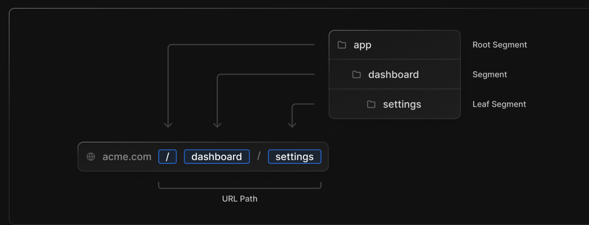
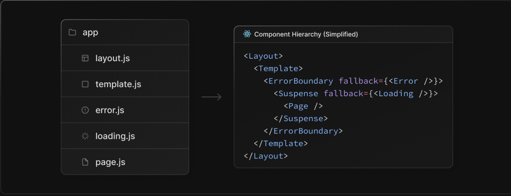
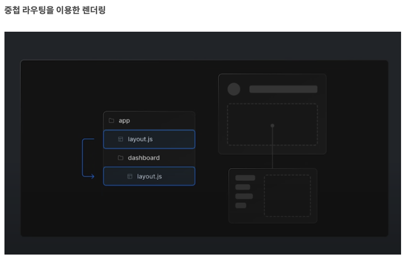
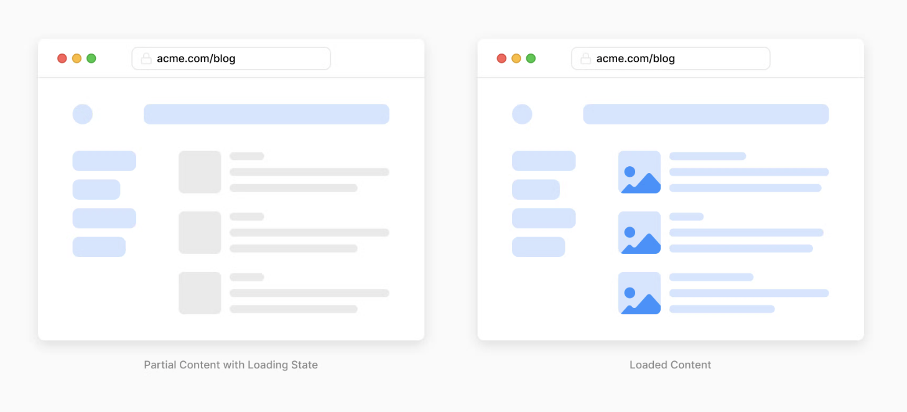
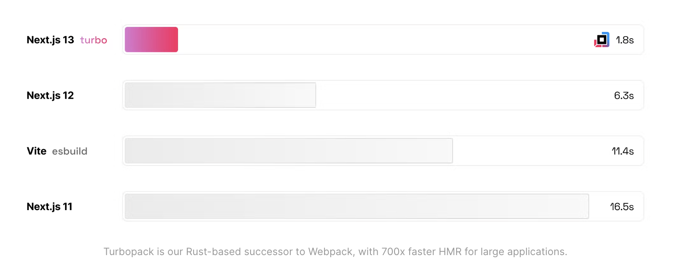

# Installation

```bash
  npm i next@latest react@latest react-dom@latest eslint-config-next@latest
  # or
  yarn upgrade next react react-dom eslint-config-next --latest
  # or
  pnpm up next react react-dom eslint-config-next --latest
```

# Summary

- Internet Explorer has been dropped from the list of supported browsers, and the set of [modern browsers](https://nextjs.org/docs/basic-features/supported-browsers-features) is now supported instead.
  - Chrome 64+
  - Edge 79+
  - Firefox 67+
  - Opera 51+
  - Safari 12+
- The minimum Node version changed from 12.22.0 to 14.0.0.
- The minimum React version also changed from 17.0.2 to 18.2.0.
- The default value of swcMinify changed from false to true.
- The new image component introduced in Next.js 12, next/future/image, became next/image, and next/image became next/legacy/image.
  - A [codemod](https://nextjs.org/docs/advanced-features/codemods#next-image-to-legacy-image) is provided for automatic migration (next-image-to-legacy-image).
- Previously, using Next/Link required adding a nested `<a>` tag, but starting with version 13 the `<a>` link is no longer required.

# New Routing (beta)

## Migrating from the page directory routing system to the app directory based routing system

Before

```bash
pages
 ┣ blog
 ┣ dashboard
 ┃ ┗ [id].tsx
 ┃ ┗ index.tsx
 ┣ _app.tsx
 ┗ index.tsx
```

After


## From managing only routing files to keeping the files that make up a given page alongside the routing files

Before

```bash
components
 ┗ Card.jsx
pages
 ┣ posts
 ┃ ┗ datas
 ┃ ┃ ┗ index.js
 ┣ _app.js
 ┗ index.js
styles
 ┣ Home.module.css
 ┗ globals.css
```

After


## route segments

Each route determines its URL path based on the folder path.


## special files

You can use special files that are used for routing.


- pages.js
  - The file shown when accessing a page through routing.
  - Performs the same function as the existing index.js.
  - page/index.js → app/index.js
- layout.js

  - A layout file used to apply shared UI across multiple pages in multiple places.
  - Previously, only root-level shared styles could be applied in \_app.tsx, but with the addition of layout.js you can inherit parent styles through nesting.

  ```bash
  // Before
  // pages/_app.tsx

  function MyApp({ Component, pageProps }: AppPropsWithLayout) {
    // Use the layout defined at the page level, if available
    const getLayout = Component.getLayout ?? ((page) => page);

    return (
      <section>
       <Component {...pageProps} />
      </section>
    );
  }

  export default MyApp;

  // After
  // pages/layout.tsx
  function MyAppLayout({ children }: React.ReactNode) {
    return (
      <section>
        {children}
      </section>
    );
  }

  ```

  

- loading.js
  - A file used to create loading UI for a specific part of the app (React Suspense Boundary).
- error.js
  - An error component that is invoked when an error occurs in a subtree (React Suspense Boundary).
- template.js
  - A file used when specific behavior is required.
  - Starting/ending animations using a CSS or animation library.
  - Features that rely on useEffect (e.g. logging page views) and useState (e.g. per-page feedback forms).
  - Changes the default framework behavior. For example, a Suspense boundary inside a layout shows the fallback only when the layout is first loaded, not when switching pages. With a template, the fallback is shown on each navigation.
- head.js
  - Used to define the contents of the `<head>` tag.
- not-found.js

  - Invoked when a page cannot be found.

## server components

Support for the server components architecture introduced in React 18.
Using server components reduces the amount of JavaScript sent to the client, improving initial loading performance.


## streaming

Using server components and nested layouts, you can control partial data loading states.
With this approach, users no longer have to wait for the entire page to load during the initial load.

Changes to how data fetching is used

- getStaticProps → fetch(URL, { cache: 'force-cache' });
- getServerSideProps → fetch(URL, { cache: 'no-store' });
- getStaticProps: revalidate → fetch(URL, { next: { revalidate: 10 } });

```tsx
// Before Next.js 13
export const getServerSideProps: GetStaticProps = async ({ params }) => {
  const res = await fetch('https://.../posts/');
  const data = await res.json();

  return data;
};
// This is an async Server Component
export default async function Page(data) {
  return <main>{/* ... */}</main>;
}

// Next.js 13
// app/page.js
async function getData() {
  const res = await fetch('https://api.example.com/...');
  // The return value is *not* serialized
  // You can return Date, Map, Set, etc.
  return res.json();
}

// This is an async Server Component
export default async function Page() {
  const data = await getData();

  return <main>{/* ... */}</main>;
}
```

# Turbopack (alpha)

Next.js 13 introduces Turbopack, a Rust-based successor to Webpack.

- **700x faster** than Webpack
- **10x faster** than Vite
- **4x faster** initial startup time than Webpack
  

```bash
// Installation
next dev --turbo
```

# New next/image

Images are automatically optimized when using the image component (width and height are set automatically to prevent layout shift).
To improve web accessibility, the alt attribute is now required.

```tsx
// Before Next.js 12
import Image from 'next/image';
import avatar from './lee.png';

function Home() {
  // "alt" is now required for improved accessibility
  // optional: image files can be colocated inside the app/ directory
  return <Image src={avatar} placeholder="blur" width={50} height={50} />;
}

// Next.js 13
import Image from 'next/image';
import avatar from './lee.png';

function Home() {
  // "alt" is now required for improved accessibility
  // optional: image files can be colocated inside the app/ directory
  return <Image alt="leeerob" src={avatar} placeholder="blur" />;
}
```

# New @next/font (beta)

Automatic self-hosting for font files - aimed at supporting performance and privacy.
Built-in Google Fonts, with support for hosting local fonts.

```tsx
// Before Next.js 13
<Head>
  <link
    href="https://fonts.googleapis.com/css2?family=Montserrat:wght@200;400&display=swap"
    rel="stylesheet"
  />
</Head>

// Next.js 13
//// Built-in Google Fonts
import { Inter } from '@next/font/google';
const inter = Inter();
<html className={inter.className}>

//// Local font
import localFont from '@next/font/local';
const myFont = localFont({ src: './my-font.woff2' });
<html className={myFont.className}>

```

To resolve the issue where font size changes depending on screen size across devices, the css size-adjust property is used to provide the same font size on all devices.

```scss
html,
body {
  -webkit-text-size-adjust: none; /* Chrome, Safari, newer Opera */
  -ms-text-size-adjust: none; /* IE */
  -moz-text-size-adjust: none; /* Firefox */
  -o-text-size-adjust: none; /* older Opera */
}
```

# Improved next/link

Previously, using next/link required an `<a>` tag, but in version 13 you no longer need to add an `<a>` tag.
It was added as an experimental option in version 12.2, and it is now applied by default in version 13.

```tsx
import Link from 'next/link'

// Next.js 12: `<a>` has to be nested otherwise it's excluded
<Link href="/about">
  <a>About</a>
</Link>

// Next.js 13: `<Link>` always renders `<a>`
<Link href="/about">
  About
</Link>
```

# References

- [https://beta.nextjs.org/docs/routing/fundamentals](https://beta.nextjs.org/docs/routing/fundamentals)
- [https://nextjs.org/docs/upgrading](https://nextjs.org/docs/upgrading)
- [https://beta.nextjs.org/docs/routing/fundamentals#](https://beta.nextjs.org/docs/routing/fundamentals#)
- [https://nextjs.org/blog/next-13](https://nextjs.org/blog/next-13)
- [https://itchallenger.tistory.com/778](https://itchallenger.tistory.com/778)
- [https://blog.logrocket.com/next-js-13-new-app-directory/#routing-app-directory](https://blog.logrocket.com/next-js-13-new-app-directory/#routing-app-directory)
