# The Background Behind the Emergence of Global State Management Libraries

When React was first released, it was announced as a library responsible only for the View portion of Model-View-Controller. As a result, a way to compose and manage state became necessary. In the early days, development proceeded by cramming state and business logic into a Container/Presenter and simply passing View logic down as props to render it.

However, as applications grew in scale, the number of states to manage and the number of components handling those states increased within the bidirectional MVC/MVP structure, making the architecture more complex. In addition, because logic was processed in a parent and passed down to children via props, the props drilling problem arose. To solve these issues, global state management libraries emerged.

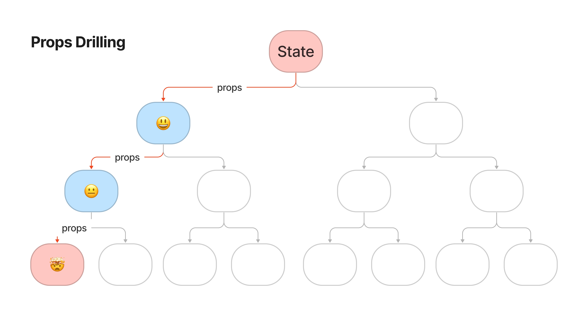

## The Problems Global State Management Libraries Aim to Solve

**The ability to read stored state from anywhere in the component tree**

- Inside the React runtime
  - To propagate shared values, it combines with React context and leverages features such as `useState`, `useRef`, or `useReducer` → the main challenge here is that you have to carefully consider how to handle re-render optimization.
- Leveraging module state outside of React
  - Using module state stores state in a manner similar to a singleton.
  - It is easy to optimize so that re-rendering occurs only when the state changes, via subscription.
  - However, because it is a single value in memory, it cannot hold a different state that is used only in a different subtree.

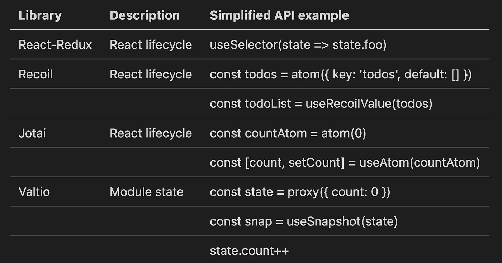

**The ability to modify stored state**

- The React UI model supports reference equality and immutable updates, but JavaScript is a mutable language.
- In the case of Redux, this was solved by adopting an approach where all state updates are immutable, but this introduced the drawback of a lot of boilerplate code.
  - However, if you use immer, which helps you write mutable-style code, you can improve the code.
- These days, libraries such as valtio (js proxy) have also emerged, allowing developers to use a mutable style.

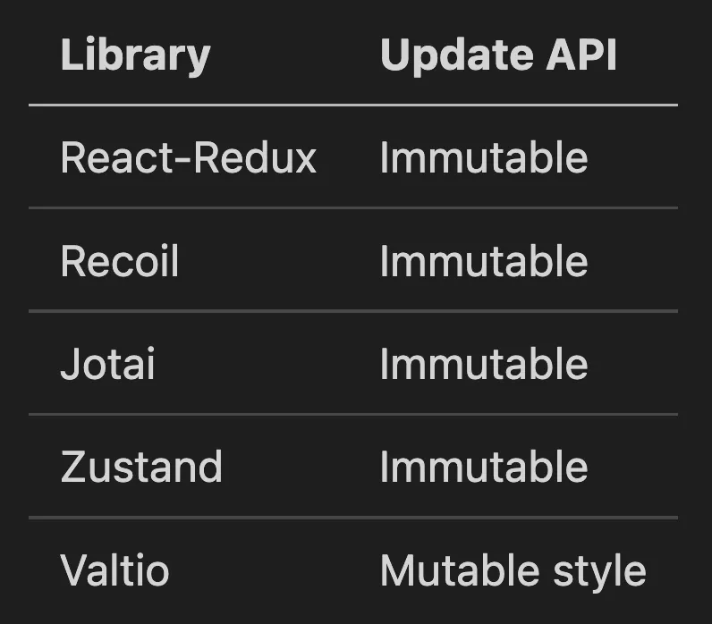

**A mechanism to optimize rendering**

- **Manual optimization:** This often means creating selector functions that subscribe to a specific piece of state. The advantage here is that the user can finely control the subscription method and optimize how components subscribing to that state re-render. The downside is that one could argue this is a manual process that is error-prone and requires unnecessary overhead that should not be part of the API.
  - redux: useSelector, recoil: useRecoilState, jotai: useAtom
- **Automatic optimization:** This is where the library automatically optimizes the process so that only what the user needs is re-rendered. The advantage here, of course, is that it is easy to use and lets the user focus on feature development without having to worry about manual optimization. The downside of this is that, as a consumer, the optimization process is a black box, and if there is no way to manually optimize a part of it, it can feel too magical.
  - Valtio internally uses `Proxy` to automatically track when updates occur and automatically manage when components need to re-render.

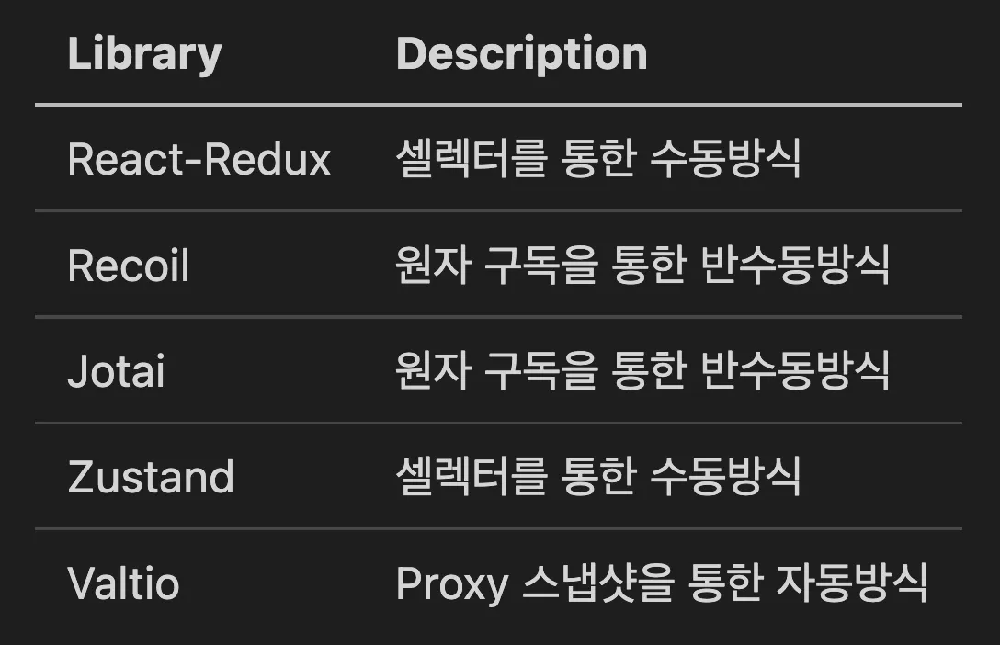

**Provides a mechanism to optimize memory usage**

- State management that stores state outside the React runtime as module state
  - This means it is not tied to a specific component and may have to be managed manually (redux).
- State management that stores state inside the React runtime
  - Tying it to the React lifecycle makes it easier to leverage automatic garbage collection when a component is unmounted.
    - context api, recoil, jotai

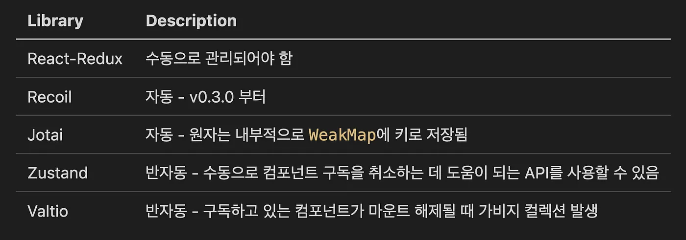

**New trends in global state management libraries and patterns (the emergence of the bottom-up approach)**

- Top-down approach: state management solutions up to and including Redux
  - An approach where the Store at the top of the component tree holds all the necessary state, and lower components pull the state they need from it.
- Bottom-up approach
  - With the arrival of React hooks, it became known that composing hooks with small pieces of state or logic to manage even complex state could be useful. As the bottom-up approach was discussed, stores came to be held at the granularity of atoms.
  - An approach where, when an atom changes, the components subscribing to that atom re-render.
  - recoil, jotai

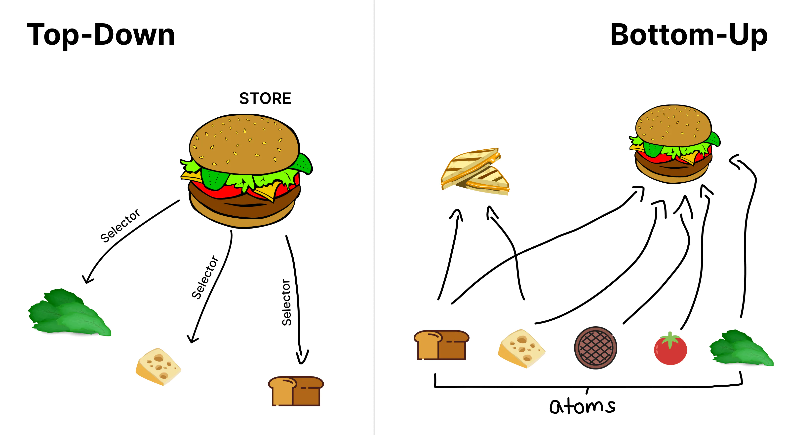

**Component-centric applications vs. data-centric applications**

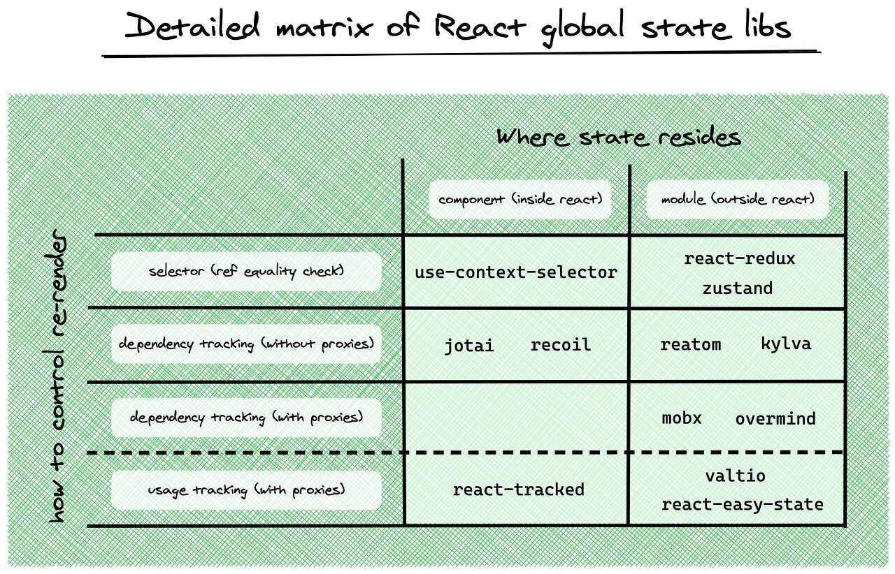

**Libraries built specifically to solve the problem of remote state management**

- For most web applications, which are CRUD-style applications, a dedicated remote state management library
- Handling things such as request deduplication, retries, polling, and mutations
  - Includes [React query](https://react-query.tanstack.com/overview), [SWR](https://github.com/vercel/swr), [Apollo](https://www.apollographql.com/), [Relay](https://relay.dev/),  [RTK Query](https://redux-toolkit.js.org/introduction/getting-started#rtk-query)

# Summary of State Management Libraries

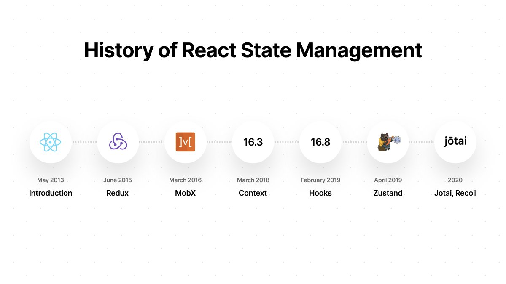

**State management trends**

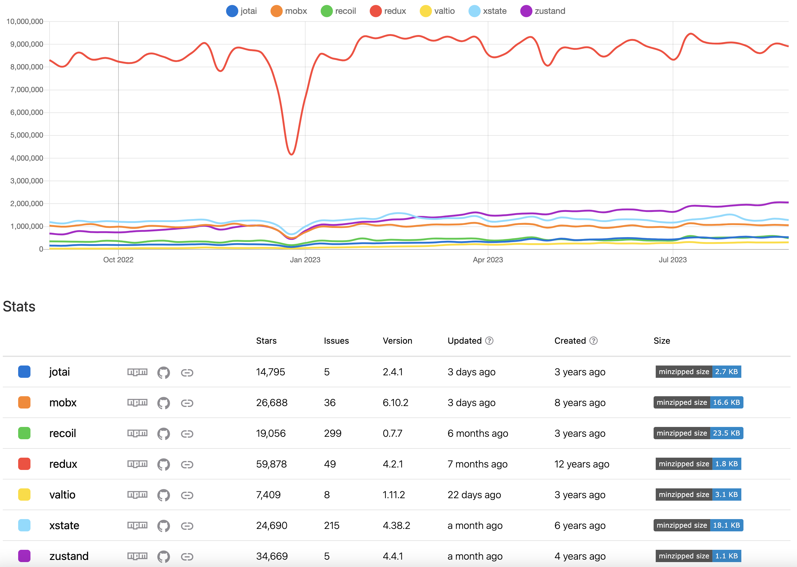

[https://npmtrends.com/jotai-vs-mobx-vs-recoil-vs-redux-vs-valtio-vs-xstate-vs-zustand](https://npmtrends.com/jotai-vs-mobx-vs-recoil-vs-redux-vs-valtio-vs-xstate-vs-zustand)

## ContextAPI

Suitable for use when handling mostly static data or when updates do not occur frequently.

It is inefficient when handling complex updates, and the reason is that **re-rendering occurs even for state that has not been updated within the portion wrapped by the Provider.**

## Flux (Redux, Zustand)

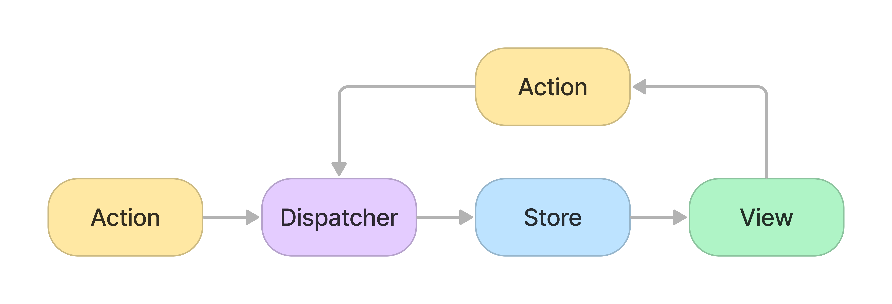

Based on a state store called the **Store**, when you **pass an Action type to a Reducer**, the state value is updated according to the operation matching that type, and components use a **Selector** to **subscribe** to **the state value they need** from the Store.

**When used with the purpose of separating business logic from React components**

- [Redux](https://seungahhong.github.io/blog/2021/12/2021-12-30-redux/), [Redux-Toolkit](https://seungahhong.github.io/blog/2022/03/2022-03-26-redux-toolkit/)
  - Redux has only one store and a single object tree, which makes debugging easy.
  - The internal state of the store can only be changed via action objects. Because all state changes are concentrated in a single store and occur in one direction, the results are predictable.
  - Because a reducer is a pure function, it returns a new state rather than mutating the state.
  - It has the drawback of a lot of boilerplate code, but redux-toolkit was created to address that issue.
- [Zustand](https://seungahhong.github.io/blog/2023/07/2023-07-22-zustand/)
  - The way stores are implemented and modified is simple (less boilerplate code compared to redux).
  - There is no need to wrap it with a Provider.
  - It provides various middleware libraries (redux, immer, selector (automatically invoked on state change), redux-devtools).

## Atomic (Recoil, Jotai)

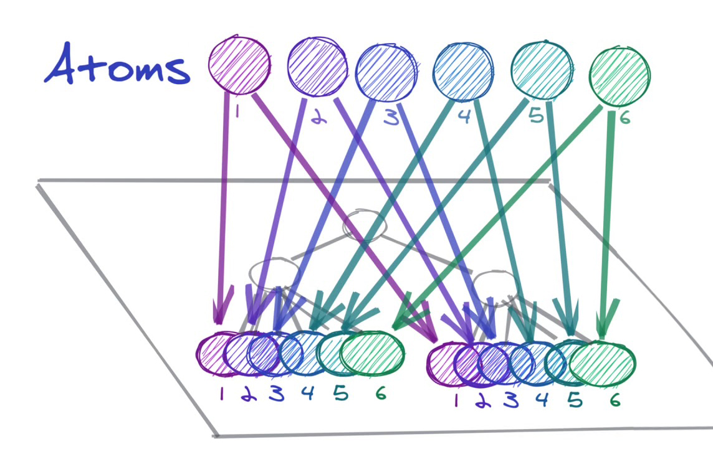

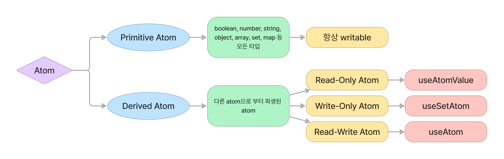

- [jotai](https://seungahhong.github.io/blog/2022/06/2022-06-14-jotai/)
  - Version updates happen about once a month, with fast new features and bug fixes (to the point where there are no open PRs).
  - Very small in size compared to Recoil.
  - Based on TypeScript.
  - You don't need to generate a unique key value (internally it uses a weakMap).
  - Supports suspense.
  - Powerful devtool.
- [recoil](https://seungahhong.github.io/blog/2022/03/2022-03-22-recoil/)
  - Developed by Facebook.
  - Because it uses internal React state rather than state as an "external factor" to React, it can access the scheduler.
  - It provides a snapshot feature, allowing you to revert to a previous state value.
  - persist: recoil-persist
    - The reason for including a key when creating an atom (a unique key enables debugging and persistence).
  - The update cycle is long. 🥶

## Proxy (MobX, Valtio, overmind)

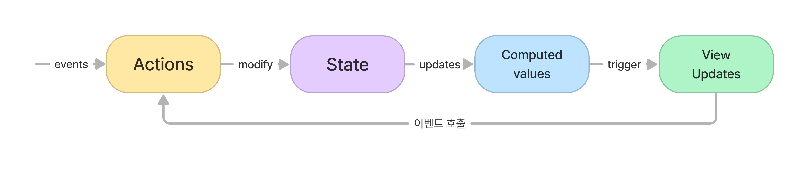

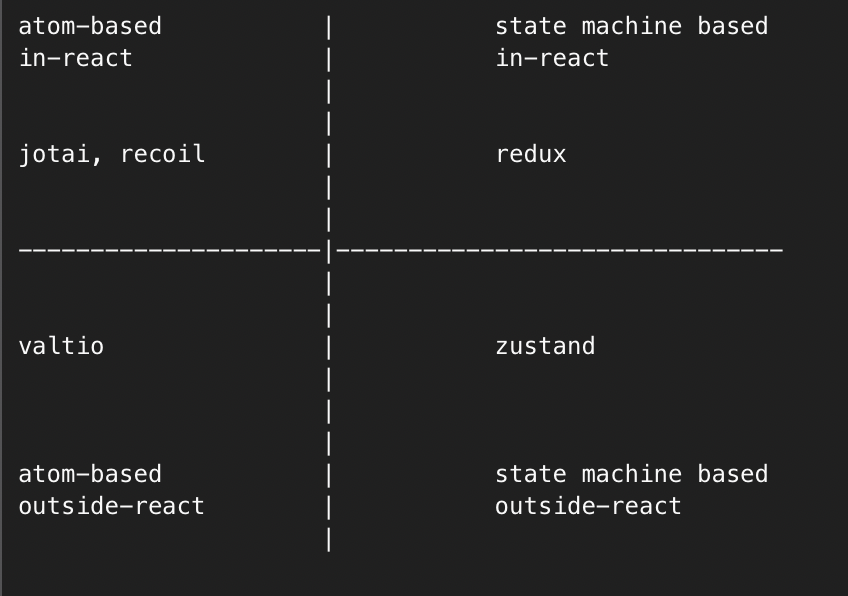

A pattern that gathers the entire state (Proxy) and provides access, automatically detecting some of the state used in a component and recognizing updates.

- Valtio
  - Uses Hooks for its rendering optimization approach.
  - [https://itchallenger.tistory.com/631](https://itchallenger.tistory.com/631)
  - [https://itchallenger.tistory.com/632](https://itchallenger.tistory.com/632)
- [Mobx](https://seungahhong.github.io/blog/2021/12/2021-12-31-mobx/)
  - Uses higher-order component (hoc) functions.

## Server State (react-query, swr)

- react-query
  - [react-query](https://seungahhong.github.io/blog/2022/12/2022-12-30-react-query/)
  - [react-query-v4](https://seungahhong.github.io/blog/2023/06/2023-06-30-react-query-v4/)
  - [react-query-v5](https://seungahhong.github.io/blog/2023/07/2023-07-23-react-query-v5/)
- SWR
  - [SWR](https://seungahhong.github.io/blog/2022/03/2022-03-30-SWR/)

## XState

- A library that uses a technical pattern to organize complex, tangled code with the limited structure and a few constraints of an FSM (Finite State Machine). It is used when behavior must differ depending on specific states, since complexity increases dramatically as the number of states grows.
- In particular, since complex state changes and flows can be diagrammed as a flowchart, it enables efficient communication when collaborating with development stakeholders.

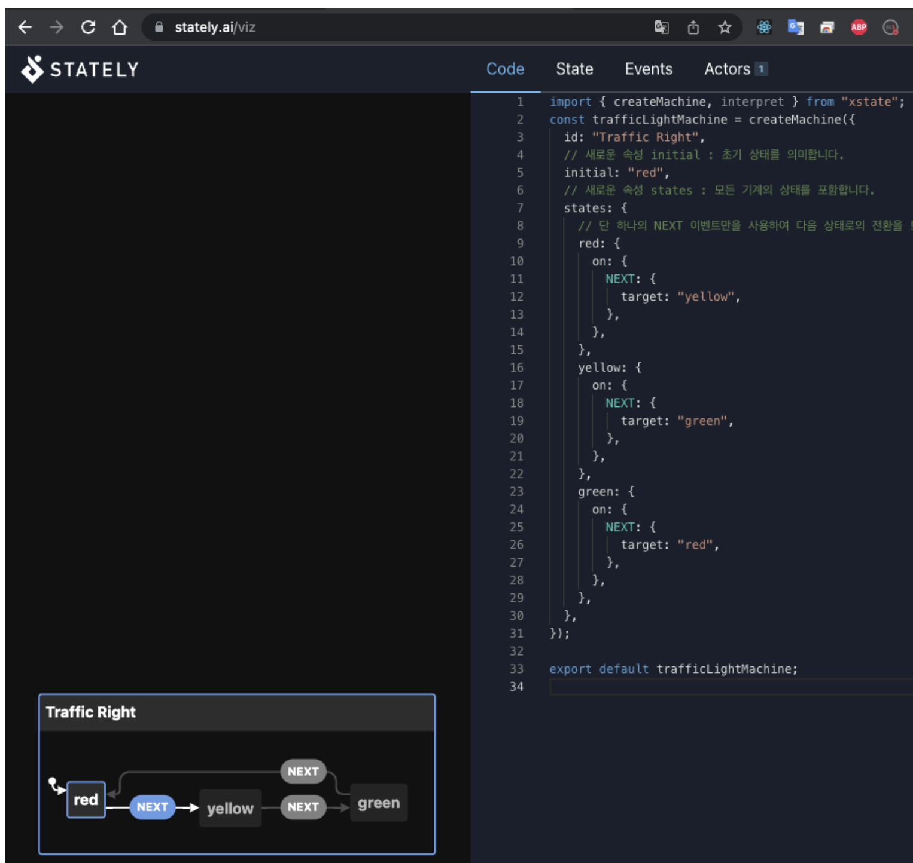

- In general, an FSM consists of five parts. ([documentation](https://xstate.js.org/docs/about/concepts.html#finite-state-machines))

  - An **initial state**
  - A finite number of **states**
  - A finite number of **events**
  - A **transition function** that determines the next state given the current state and event
  - A (possibly empty) set of **final states**
  - Example code
    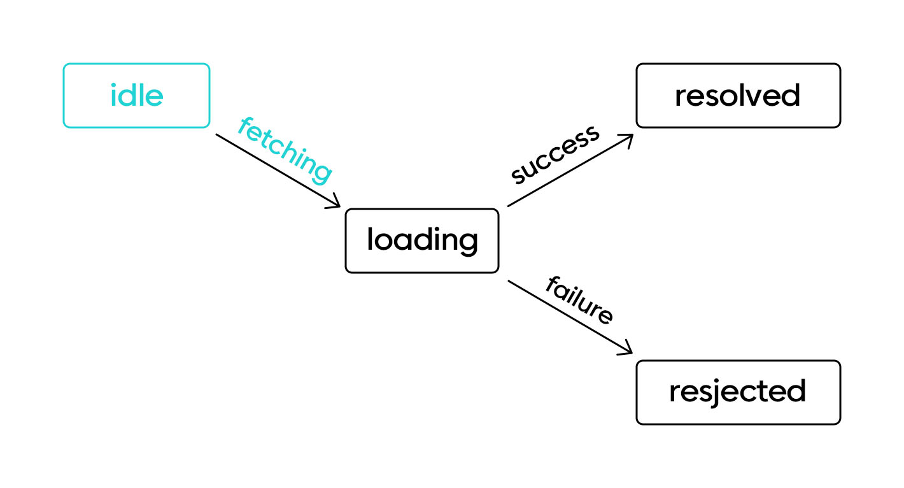

    ```tsx
    // 초기 상태: idle
    // 유한개의 상태: idle, loading, resolved, rejected
    // 유한개의 이벤트: fetching, success, failure
    // 전이 함수: fetching: idle → loading, success: loading → resolved, failure: loading → rejected
    // 최종 상태: 최종 상태: resolved

    const fetchMachine = createMachine({
      id: 'fetch',
      initial: 'idle',
      states: {
        idle: {
          on: {
            FETCHING: {
              target: 'loading',
            },
          },
        },
        loading: {
          on: {
            SUCCESS: {
              target: 'resolved',
            },
            FAILURE: {
              target: 'rejected',
            },
          },
        },
        resolved: {
          type: 'final',
        },
        rejected: {},
      },
    });
    ```

- Key features
  **Installation**

  ```bash
  npm i xstate @xstate/react
  ```

  **States**

  - initial: the initial state value (a key property of the states object)
  - states: state nodes
    - empty and hold point to internal node values.

  ```tsx
  const cartMachine = createMachine({
    id: 'cart',
    initial: 'empty',
    states: {
      empty: {},
      hold: {},
    },
  });
  ```

  **Events**

  - on: create events by making objects with `on` inside a state node
  - add the ADD_ITEM event that can run in the empty state

  ```tsx
  // 선언
  const cartMachine = createMachine({
    id: 'cart',
    initial: 'empty',
    states: {
      empty: {
        on: {
          ADD_ITEM: {
            target: 'hold',
          },
        },
      },
      hold: {},
    },
  });

  // 실행
  import { useMachine } from '@xstate/react';

  const Cart = () => {
    const [state, send] = useMachine(cartMachine);
    // State { value: { 'empty ' } ... }

    return (
      <div>
        <p>{state.value}</p>
        <button
          onClick={() => {
            send('ADD_ITEM');
          }}
        >
          Add Item
        </button>
      </div>
    );
  };
  ```

  **context, action**

  - context: additional data distinct from the state node values
  - action: used to change or add values in the context
    - assign: you can use the spread operator, but for convenience an assign function is provided

  ```tsx
  // 선언
  const cartMachine = createMachine<Context>(
    {
      id: 'cart',
      initial: 'empty',
      context: {
        items: [],
      },
      states: {
        empty: {
          on: {
            ADD_ITEM: {
              target: 'hold',
              actions: ['addItem'],
            },
          },
        },
        hold: {},
      },
    },
    {
      actions: {
        addItem: assign({
          items: ({ items }, event) => [...items, event.item],
        }),
      },
    },
  );
  ```

  **guards, always**
  Can be used when, upon transitioning to a specific state, it must immediately transition to a different state depending on the **situation**.

  ```tsx
  {
    actions: {
      // ...
    },
    guards: {
      isEmpty: ({ items }) => items.length === 0
    }
  }

  hold: {
    always: { // hold 상태에서 전이 될 될 경우 guards 함수를 실행해서 참일경우 다른 상태로 다시 전이
      target: 'empty',
      cond: 'isEmpty',
    },
    on: {
  	  OPEN: [
  	    { target: 'opened', cond: 'isAdmin' },
  	    { target: '.error', cond: 'shouldAlert' },
  	    { target: '.idle' }
  	  ]
  	}
  }
  ```

  **invoke**
  XState provides invoke as a way to integrate a state machine with the outside world, including asynchronous operations.

  ```tsx
  purchasing: {
    invoke: {
      id: 'purchasing',
      src: (context) => postPurchase(context.items),
      onDone: {
        target: 'done',
        actions: ['purchased'],
      },
      onError: {
        // ...
      }
    },
  },
  ```

  **service**
  If you want to receive a callback function passed after an event listener has completed, you can configure it via service.

  ```tsx
  const [state, send, service] = useMachine(cartMachine);

  useEffect(() => {
    const listener = () => console.log('done');

    service.onDone(listener);

    return () => service.off(listener);
  }, []);
  ```

# So... when should you use state management??

## npm state management trends -> redux 👍, react-query 👍

- client state: redux > zustand > XState > mobx > jotai > recoil > valtio

- server state: react-query > swr

## Handling mostly static data, when updates do not occur frequently → context API 👍

## Bottom-up approach, optimizing memory usage, when using only the React ecosystem → jotai 👍

- recoil: because it uses internal React state rather than state as an "external factor" to React, it can access the scheduler (Facebook's own library).
- jotai: TypeScript-based, very small in size compared to Recoil, no unique key required.

## Top-down approach, when data must be shared across many modules → redux 👍

- Redux: provides various middleware libraries; the most widely used library.
- zustand: no Provider wrapping required, smaller in size/amount of code than redux.

## When you want to use automatic optimization (proxy) → valtio 👍, mobx

- valtio: supports React hooks.
- mobx uses object-oriented components and hoc-style functions, and supports decorators.

## When communication through flowchart diagrams is important → XState 👍

## When you need to use server state management → react-query 👍, swr

- react-query: makes it easy to fetch, cache, synchronize, and update server state in a React application. It additionally provides graphql support.
- swr: a strategy that first returns data from the cache, then sends a request to fetch data from the server, and finally provides the up-to-date data. It is easy to set up in a Next.js environment.

## When you are in a GraphQL development environment → Apollo Client 👍

# Internal Reference Pages

- [react-query-v5](https://seungahhong.github.io/blog/2023/07/2023-07-23-react-query-v5/)
- [react-query-v4](https://seungahhong.github.io/blog/2023/06/2023-06-30-react-query-v4/)
- [react-query](https://seungahhong.github.io/blog/2022/12/2022-12-30-react-query/)
- [zustand](https://seungahhong.github.io/blog/2023/07/2023-07-22-zustand/)
- [jotai](https://seungahhong.github.io/blog/2022/06/2022-06-14-jotai/)
- [swr](https://seungahhong.github.io/blog/2022/03/2022-03-30-SWR/)
- [redux-toolkit](https://seungahhong.github.io/blog/2022/03/2022-03-26-redux-toolkit/)
- [redux](https://seungahhong.github.io/blog/2021/12/2021-12-30-redux/)
- [redux-saga](https://seungahhong.github.io/blog/2022/03/2022-03-07-redux-saga/)
- [mobx](https://seungahhong.github.io/blog/2021/12/2021-12-31-mobx/)
- [recoil](https://seungahhong.github.io/blog/2022/03/2022-03-22-recoil/)
- [graphql](https://seungahhong.github.io/blog/2022/01/2022-01-09-graphql/)

# Reference Pages

- [18 Best React State Management Libraries in 2023](https://fe-tool.com/awesome-react-state-management)
- [리액트 상태관리 트렌드의 변화](https://www.nextree.io/riaegteu-sangtaegwanri-teurendeuyi-byeonhwa-2/)
- [상태 관리 라이브러리 - Jotai](https://velog.io/@sasha1107/상태-관리-라이브러리-Jotai)
- [[번역] Jotai vs Recoil: 어떤 차이점이 있나요?](https://parang.gatsbyjs.io/react/2022-react-16/)
- [Jotai vs. Recoil: What are the differences? - LogRocket Blog](https://blog.logrocket.com/jotai-vs-recoil-what-are-the-differences/)
- [Can valtio replace jotai completely? · Issue #141 · pmndrs/valtio](https://github.com/pmndrs/valtio/issues/141#issuecomment-891214314)
- [[번역] 리액트 상태 관리의 새로운 흐름](https://medium.com/@yujso66/번역-리액트-상태-관리의-새로운-흐름-6e5ed0022e39)
- [Finite state machine & statecharts - XState – 화해 블로그 | 기술 블로그](https://blog.hwahae.co.kr/all/tech/6707)
- [리액트로 XState 시작하기](https://itchallenger.tistory.com/entry/리액트로-XState-시작하기)
- [자바스크립트로 만든 유한 상태 기계 XState | 카카오엔터테인먼트 FE 기술블로그](https://fe-developers.kakaoent.com/2022/220922-make-cart-with-xstate/)
