# 전역 상태 관리 라이브러리 등장 배경

리액트는 처음 출시될 때 Model View Controller 중 View만 담당하는 라이브러리로 발표되었기 때문에 상태를 구성하거나 관리하는 방안이 필요해졌고, 초창기에는 상태와 비즈니스 로직을 Container/Presenter에 몰아넣고 View로직을 props로 받아 뿌려주기만 하는 패턴으로 개발을 진행해 나갔습니다.

하지만 애플리케이션 단위가 커지면서 양방향 데이터 이동이 가능한 MVC/MVP 구조에서 관리해야할 상태와 상태를 핸들링하는 컴포너트가 많아지면서 구조가 복잡해지고 또한 부모에서 로직을 처리하고 자식에게 props로 전달하다보니 props drilling 문제가 발생하게 되었고, 이슈를 해결하기 위해서 전역 상태 관리 라이브러리가 등장하게 되었습니다.

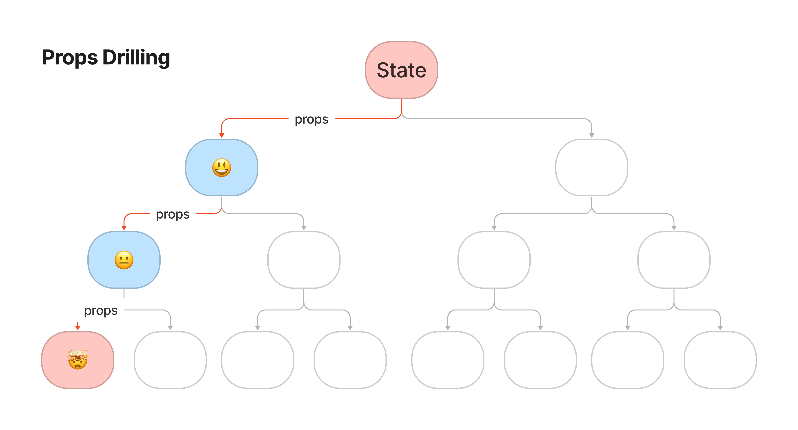

## 전역 상태 관리 라이브러리가 해결하고자 하는 문제

**저장된 상태를 컴포넌트 트리 어디에서든지 읽어 올 수 있는 기능**

- 리액트 런타임 내부
  - 공유되는 값을 전파하기 위해 리액트 context와 결합하여, `useState`, `useRef` 또는 `useReducer` 같은 기능 활용 → 주요과제는 리렌더링 최적화에 대한 처리는 고민해봐야함.
- 리액트 외부의 모듈 상태를 활용
  - 모듈 상태를 사용하면 싱글톤과 유사하게 상태를 저장
  - 구독을 통해 상태가 변경될 때 리렌더링 하도록 최적화가 용이
  - 단, 메모리 내부의 단일 값이기 때문에 다른 하위 트리에서만 사용되는 다른 상태를 가질 수 없음

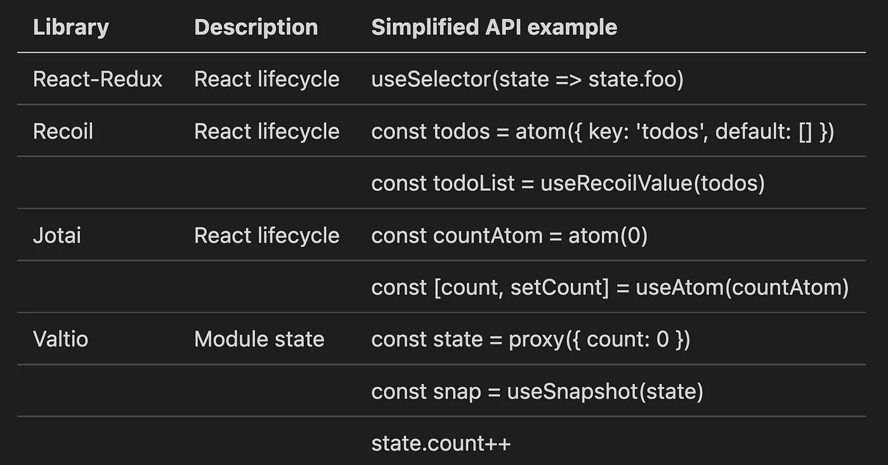

**저장된 상태를 수정하는 기능**

- 리액트 UI 모델은 참조 평등과 불변(immutable) 업데이트를 지원하지만, 자바스크립트는 변경 가능한(mutable) 언어입니다.
- Redux 같은 경우에는 모든 상태 업데이트를 변경할 수 없는 방식 채택해서 해결했지만, 보일러플레이트 코드가 많아지는 단점이 생기게 되었습니다.
  - 단, 변경 변경 가능한 스타일 코드 작성을 도와주는 immer를 사용한다면 코드 개선이 가능하다.
- 요즘에는 개발자가 변경 가능한 스타일을 사용할 수 있도록 valtio(js proxy) 같은 라이브러리도 등장

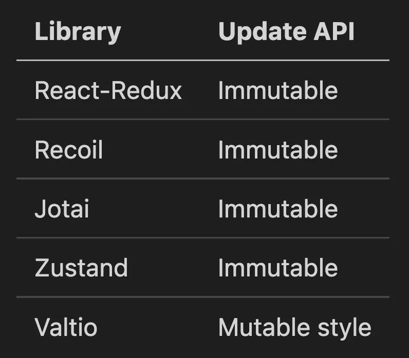

**렌더링을 최적화하는 메커니즘**

- **수동 최적화:** 종종 특정 상태를 구독하는 셀렉터 함수의 생성을 의미합니다. 여기서 장점은 사용자가 구독 방법을 세밀하게 제어하고 해당 상태를 구독하는 컴포넌트가 재렌더링되는 방법을 최적화할 수 있다는 것입니다. 단점은 이것이 수동 프로세스이고 오류가 발생하기 쉬우며 API에 포함되어서는 안 되는 불필요한 오버헤드가 필요하다는 주장이 있을 수 있습니다.
  - redux: useSelector, recoil: useRecoilState, jotai: useAtom
- **자동 최적화:** 라이브러리가 사용자가 필요한 것만 자동으로 재렌더링하는 프로세스를 최적화하는 곳입니다. 물론 여기의 장점은 사용이 간편하고 사용자가 수동 최적화에 대해 걱정할 필요 없이 기능 개발에 집중할 수 있다는 것입니다. 이것의 단점은 소비자로서 최적화 프로세스가 블랙박스이고 일부분을 수동으로 최적화하기 위한 방법이 없으면 너무 마술처럼 느껴질 수 있다는 것입니다.
  - Valtio는 업데이트되는 시기를 자동으로 추적하고 컴포넌트가 다시 렌더링되어야 하는 시기를 자동으로 관리하기 위해 내부적으로 `Proxy`를 사용하고 있습니다.

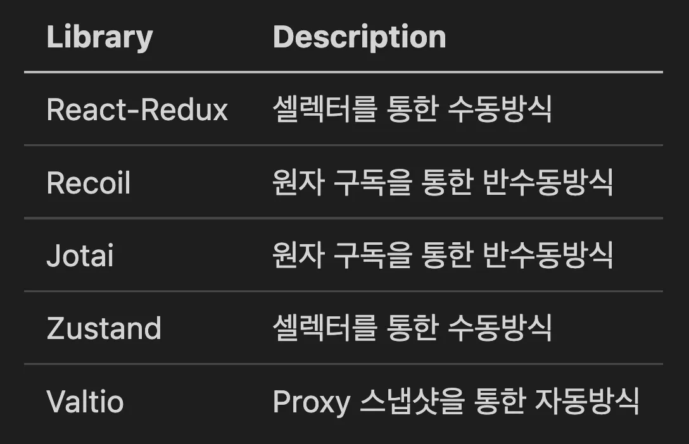

**메모리 사용을 최적화하는 메커니즘을 제공**

- 리액트 런타임 외부의 상태를 모듈 상태로 저장하는 상태 관리
  - 특정 컴포넌트에 연결되지 않고 수동으로 관리해야 할 수도 있음을 의미(redux)
- 리액트 런타임 내부의 상태로 저장하는 상태관리
  - 리액트 라이프사이클에 연결하면 컴포넌트가 마운트 해제될 때 자동 가비지 컬렉션을 더 쉽게 활용
    - context api, recoil, jotai

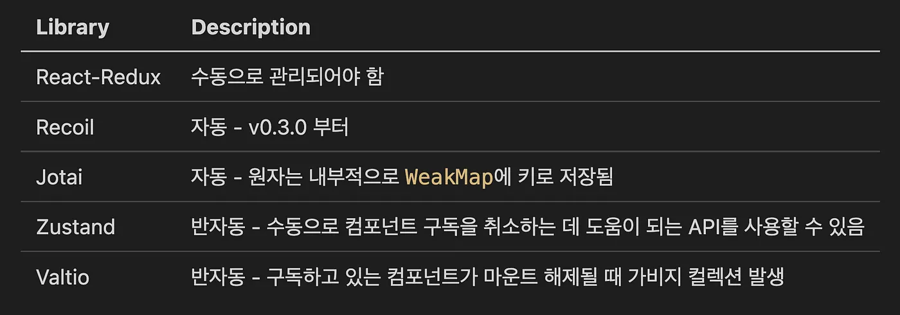

**전역 상태 관리 라이브러리 및 패턴의 새로운 흐름(상향식 접근법 등장)**

- 하향식(top down) 접근법: 리덕스를 포함한 이전까지 나온 상태관리 솔루션
  - 필요한 상태를 모두 컴포넌트 트리 상단의 Store가 가지고 있으면서 하위 컴포넌트에서 필요한 상태를 가져다 쓰는 방식
- 상향식(bottom up) 접근법
  - 리액트 hook의 등장과 함께 작은 상태나 로직을 가진 hook들을 조합해가며 복잡한 상태까지 관리하는 방식이 유용할 수 있다고 알려짐에 따라서 상향식 접근법이 논의됨에 따라서 원자 단위의 스토어를 가지게 됨.
  - 원자가 변경된 경우 원자를 구독한 컴포넌트가 리렌더링 되는 방식
  - recoil, jotai

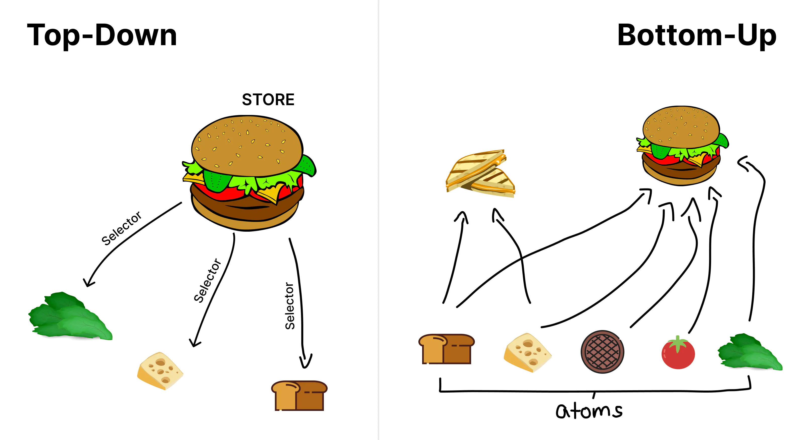

**컴포넌트 중심 애플리케이션 vs 데이터 중심 애플리케이션**

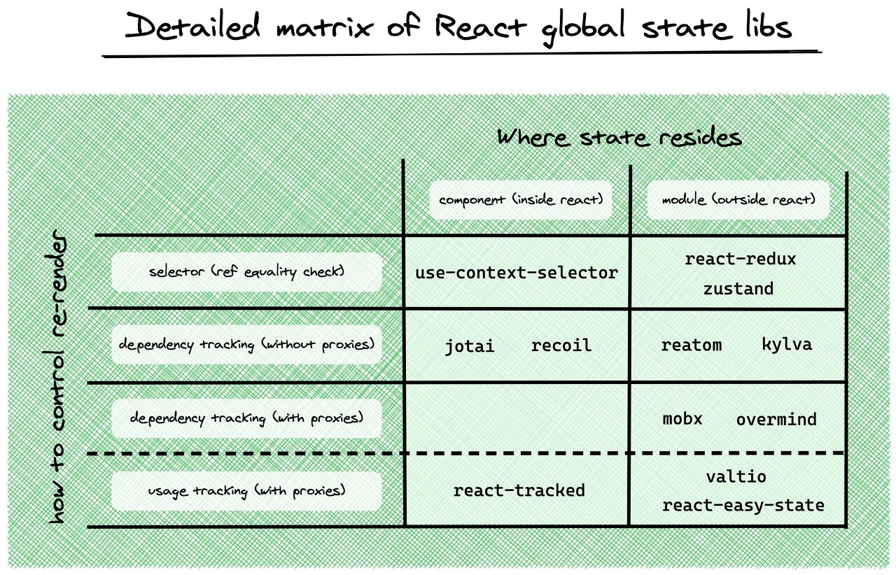

**원격 상태 관리 문제를 해결하기 위해 특별히 제작된 라이브러리**

- CRUD 스타일의 애플리케이션인 대부분의 웹 애플리케이션의 경우 전용 원격 상태 관리 라이브러리
- 중복 제거 요청, 재시도, 폴링, 뮤테이션 같은 처리
  - [React query](https://react-query.tanstack.com/overview), [SWR](https://github.com/vercel/swr), [Apollo](https://www.apollographql.com/), [Relay](https://relay.dev/),  [RTK Query](https://redux-toolkit.js.org/introduction/getting-started#rtk-query) 포함

# 상태관리 라이브러리 요약

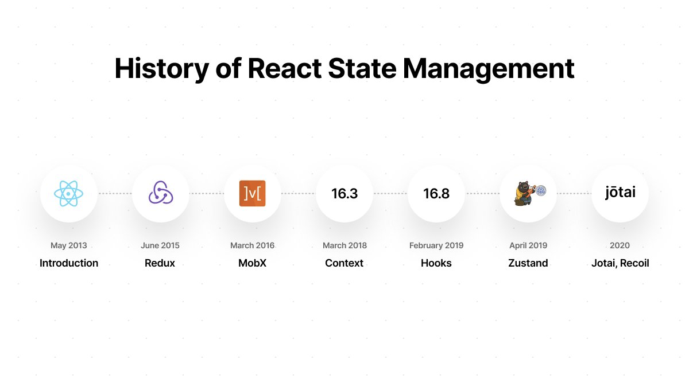

**상태관리 트렌드**

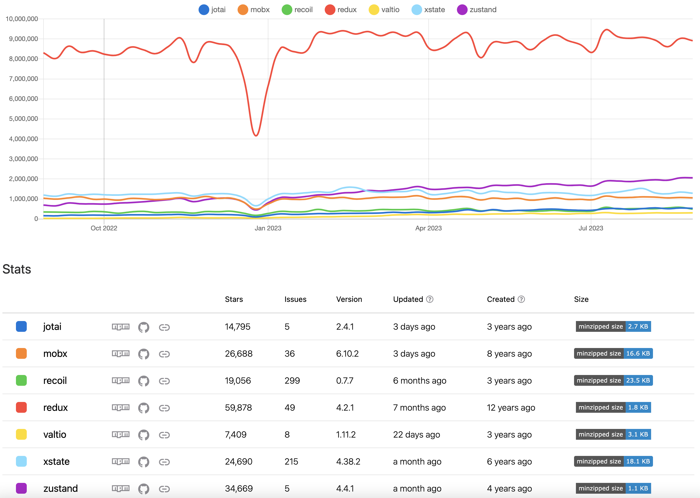

[https://npmtrends.com/jotai-vs-mobx-vs-recoil-vs-redux-vs-valtio-vs-xstate-vs-zustand](https://npmtrends.com/jotai-vs-mobx-vs-recoil-vs-redux-vs-valtio-vs-xstate-vs-zustand)

## ContextAPI

정적인 데이터 위주로 처리하거나 업데이트가 자주 발생하지 않을 때 사용하기 적합

복잡한 업데이트를 처리 시 비효율적인데 그 이유는 **Provider로 감싸진 부분의 업데이트가 되지 않은 state에도 리렌더링이 발생하기 때문이다.**

## Flux (Redux, Zustand)

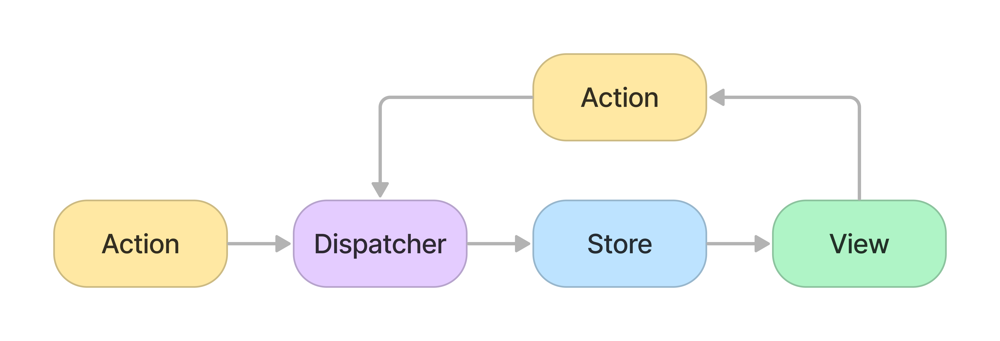

**Store** 라는 상태 저장소를 기반으로, **Action 타입을 Reducer에 전달**하면 해당 타입에 맞는 동작에 따라 상태값을 갱신 컴포넌트는 **Selector** 를 사용해 Store에서 **필요한 상태값을 구독(subscribing)** 하는 형태

**비즈니스 로직을 리액트 컴포넌트에서 분리할 목적으로 사용할 경우**

- Redux
  - Redux는 오직 하나의 store만 가지며, 하나의 객체 트리를 가지기 때문에 디버깅이 용이하다.
  - store 내부 상태는 action 객체에 의해서만 변경이 가능하다. 모든 state 변화들이 하나의 store에만 집중되어 있고 단방향으로 일어나기 때문에 예측 가능한 결과가 나타난다.
  - reducer는 순수함수이기 때문에 상태를 변경하는 것이 아닌 새로운 상태를 반환한다.
  - 보일러플레이트 코드가 많다는 단점이 있지만, 해당 이슈를 보완하기 위해서 redux-toolkit이 나오게 되었다.
- Zustand
  - store 구현 방식 및 변경 방식이 간단함(redux에 비해 보일러플레이트 코드가 적다)
  - Provider로 래핑할 필요가 없다.
  - 다양한 middleware 라이브러리를 제공(redux, immer, selector(상태변경 시 자동 호출), redux-devtools)

## Atomic (Recoil, Jotai)

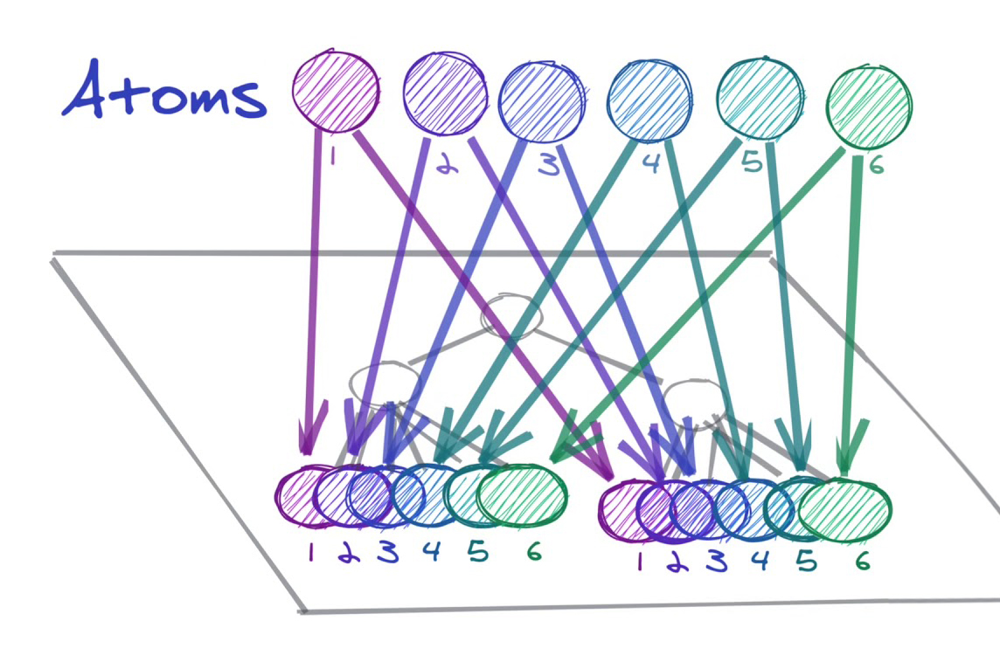

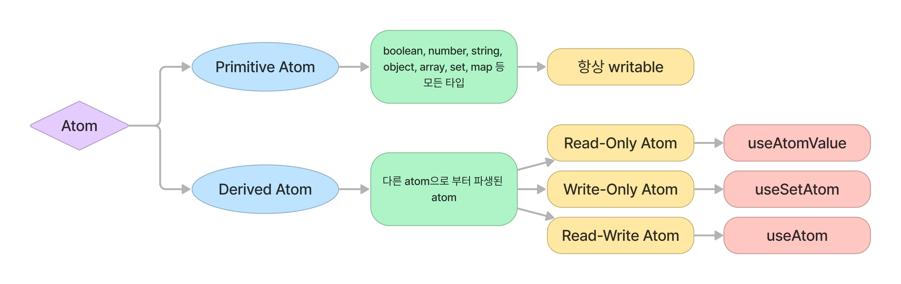

- jotai
  - 1달에 한번씩 버전 업데이트가 이루어지며 신기능, 버그 수정이 빠름 (열린 PR이 없는 정도)
  - Recoil에 비해 용량이 매우 적음
  - Typescript 기반
  - unique 한 키 값을 생성하지 않아도 된다.(내부에서는 weakMap사용)
  - suspense 지원
  - devtool 강력함.
- recoil
  - facebook에서 개발
  - 리액트 "외부 요인" 으로써의 상태가 아니라 내부 state를 이용하기 때문에 스케줄러에 접근 가능
  - snapshot 기능을 제공하고 있으며, 이전 상태값으로 변경이 가능하다.
  - persist: recoil-persist
    - atom을 생성할 때 key를 넣는 이유 (unique key를 통해 디버깅, persist 가능)
  - 업데이트 주기가 길다. 🥶

## Proxy (MobX, Valtio, overmind)

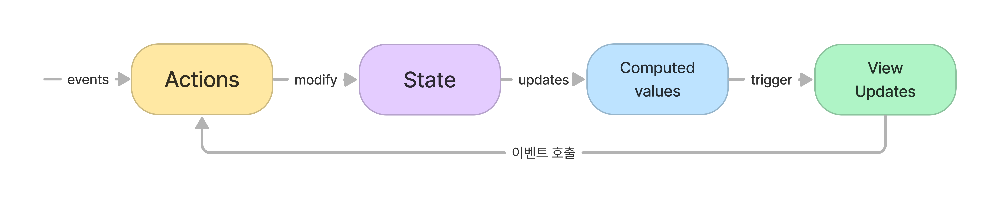

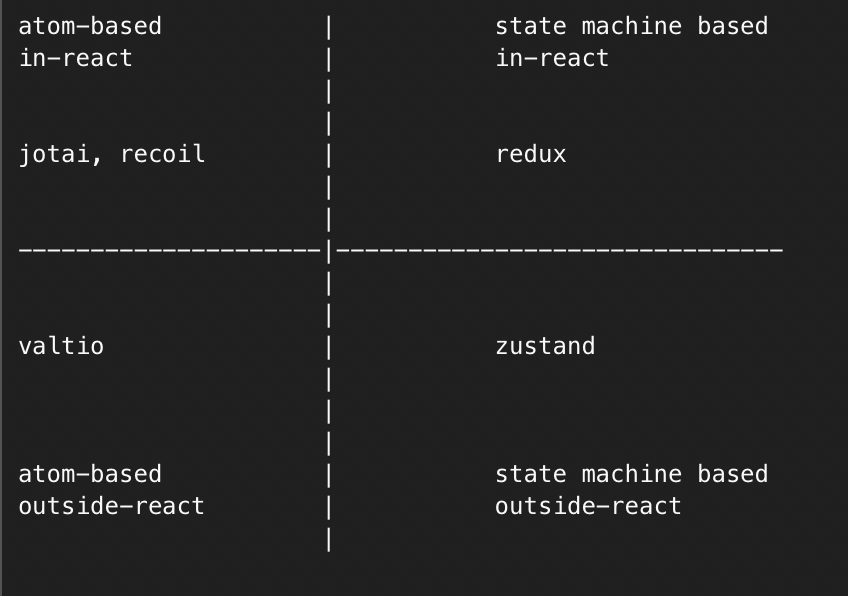

전체 상태(Proxy)들을 모아놓고 엑세스를 제공하며, 컴포넌트에서 사용되는 일부 상태를 자동으로 감지하고 업데이트를 인지하는 패턴

- Valtio
  - 렌더링 최적화 방식을 Hooks 사용
  - [https://itchallenger.tistory.com/631](https://itchallenger.tistory.com/631)
  - [https://itchallenger.tistory.com/632](https://itchallenger.tistory.com/632)
- Mobx
  - 고차함수(hoc) 함수를 사용

## Server State(react-query, swr)

- react-query
  - [react-query](https://seungahhong.github.io/blog/2022/12/2022-12-30-react-query/)
  - [react-query-v4](https://seungahhong.github.io/blog/2023/06/2023-06-30-react-query-v4/)
  - [react-query-v5](https://seungahhong.github.io/blog/2023/07/2023-07-23-react-query-v5/)
- SWR
  - [SWR](https://seungahhong.github.io/blog/2022/03/2022-03-30-SWR/)

## XState

- 특정한 상태들에 따라 동작을 달리해야 하는 경우, 상태의 개수에 따라 복잡도가 매우 증가하게 되는데, 이런 상황을 해결하기 위해서 FSM(유한 상태 기계)에 제한된 구조와 몇 가지 제약으로 복잡하게 얽힌 코드를 정리하기 위한 기술 패턴이 사용된 라이브러리
- 특히, 복잡한 상태 변화/흐름을 flowchart로 도식화가 가능해서 개발 관련 담당자들과 협업시 효율적인 커뮤니케이션이 가능

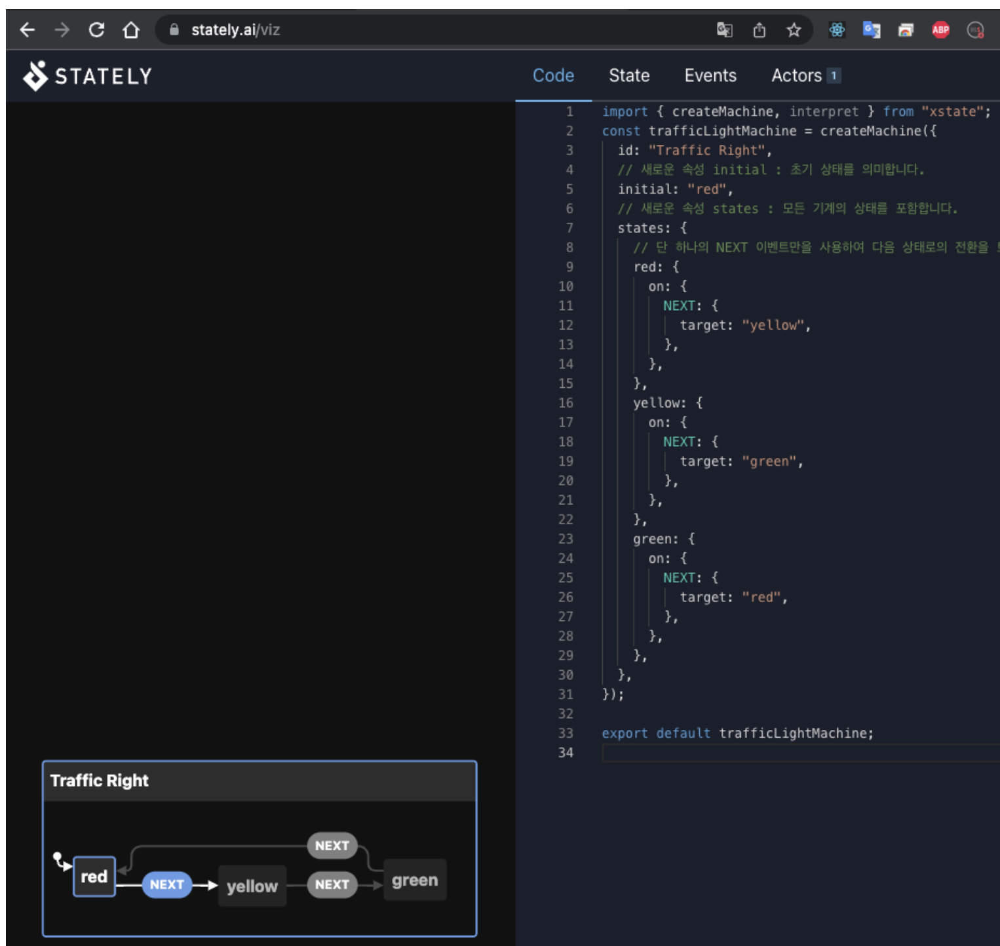

- 일반적으로 FSM은 다섯 부분으로 구성됩니다.([문서](https://xstate.js.org/docs/about/concepts.html#finite-state-machines))

  - 하나의 초기 상태(An **initial state)**
  - 유한개의 상태(A finite number of **states**)
  - 유한개의 이벤트(A finite number of **events**)
  - 현재 상태와 이벤트로 다음 상태를 결정하는 전이 함수(A **transition function** that determines the next state given the current state and event)
  - 유한 개의 최종 상태(A (possibly empty) set of **final states**)
  - 예제 코드
    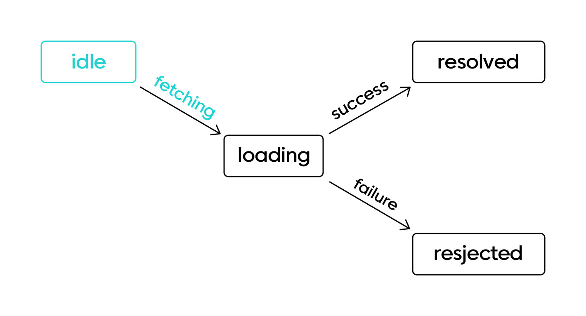

    ```tsx
    // 초기 상태: idle
    // 유한개의 상태: idle, loading, resolved, rejected
    // 유한개의 이벤트: fetching, success, failure
    // 전이 함수: fetching: idle → loading, success: loading → resolved, failure: loading → rejected
    // 최종 상태: 최종 상태: resolved

    const fetchMachine = createMachine({
      id: 'fetch',
      initial: 'idle',
      states: {
        idle: {
          on: {
            FETCHING: {
              target: 'loading',
            },
          },
        },
        loading: {
          on: {
            SUCCESS: {
              target: 'resolved',
            },
            FAILURE: {
              target: 'rejected',
            },
          },
        },
        resolved: {
          type: 'final',
        },
        rejected: {},
      },
    });
    ```

- 주요 특징
  **설치**

  ```bash
  npm i xstate @xstate/react
  ```

  **상태**

  - initial: 초기 상태값(states 객체의 키 속성)
  - states: 상태 노드
    - empty, hold 값이 내부 노드값을 가리킨다.

  ```tsx
  const cartMachine = createMachine({
    id: 'cart',
    initial: 'empty',
    states: {
      empty: {},
      hold: {},
    },
  });
  ```

  **이벤트**

  - on: 상태 노드안에 on 으로 객체들 만들어서 이벤트 생성
  - empty 상태에서 실행될 수 있는 이벤트 ADD_ITEM 추가

  ```tsx
  // 선언
  const cartMachine = createMachine({
    id: 'cart',
    initial: 'empty',
    states: {
      empty: {
        on: {
          ADD_ITEM: {
            target: 'hold',
          },
        },
      },
      hold: {},
    },
  });

  // 실행
  import { useMachine } from '@xstate/react';

  const Cart = () => {
    const [state, send] = useMachine(cartMachine);
    // State { value: { 'empty ' } ... }

    return (
      <div>
        <p>{state.value}</p>
        <button
          onClick={() => {
            send('ADD_ITEM');
          }}
        >
          Add Item
        </button>
      </div>
    );
  };
  ```

  **context, action**

  - context: 상태 노드값과 구별되는 부가적인 데이터
  - action: 컨텍스트의 값을 변경하거나 추가할 때 사용
    - assign: spread 연산을 사용해도 되지만, 편의상 assign 함수를 제공

  ```tsx
  // 선언
  const cartMachine = createMachine<Context>(
    {
      id: 'cart',
      initial: 'empty',
      context: {
        items: [],
      },
      states: {
        empty: {
          on: {
            ADD_ITEM: {
              target: 'hold',
              actions: ['addItem'],
            },
          },
        },
        hold: {},
      },
    },
    {
      actions: {
        addItem: assign({
          items: ({ items }, event) => [...items, event.item],
        }),
      },
    },
  );
  ```

  **guards, always**
  특정 상태로 전이됐을 때 **상황**에 따라 다른 상태로 곧바로 전이되야 할 경우에 사용이 가능

  ```tsx
  {
    actions: {
      // ...
    },
    guards: {
      isEmpty: ({ items }) => items.length === 0
    }
  }

  hold: {
    always: { // hold 상태에서 전이 될 될 경우 guards 함수를 실행해서 참일경우 다른 상태로 다시 전이
      target: 'empty',
      cond: 'isEmpty',
    },
    on: {
  	  OPEN: [
  	    { target: 'opened', cond: 'isAdmin' },
  	    { target: '.error', cond: 'shouldAlert' },
  	    { target: '.idle' }
  	  ]
  	}
  }
  ```

  **invoke**
  XState는 비동기 작업을 포함해 상태 기계를 외부와 연동하는 방법으로 invoke를 제공

  ```tsx
  purchasing: {
    invoke: {
      id: 'purchasing',
      src: (context) => postPurchase(context.items),
      onDone: {
        target: 'done',
        actions: ['purchased'],
      },
      onError: {
        // ...
      }
    },
  },
  ```

  **service**
  이벤트 리스너 완료된 이후에 전달된 콜백 함수를 다시 받을 경우 service를 통해서 설정이 가능

  ```tsx
  const [state, send, service] = useMachine(cartMachine);

  useEffect(() => {
    const listener = () => console.log('done');

    service.onDone(listener);

    return () => service.off(listener);
  }, []);
  ```

# 그렇다면.. 어떤 경우에 상태관리를 써야할까??

## npm 상태관리 동향 -> redux 👍, react-query 👍

- client state: redux > zustand > XState > mobx > jotai > recoil > valtio

- server state: react-query > swr

## 정적인 데이터 위주 처리, 업데이트 자주 발생하지 않을 경우 → context API 👍

## 상향식 접근법, 메모리 사용을 최적화, 리액트 생태계만 사용할 경우 → jotai 👍

- recoil: 리액트 "외부 요인" 으로써의 상태가 아니라 내부 state를 이용하기 때문에 스케줄러에 접근 가능(facebook 자체 라이브러리)
- jotai: Typescript 기반, Recoil에 비해 용량이 매우 적음, unique 키 필요하지 않음

## 하향식 접근법, 많은 모듈에서 데이터를 공유 해야할 경우 → redux 👍

- Redux: 다양한 middleware 라이브러리를 제공, 가장 널리 사용되는 라이브러리
- zustand: provider 래핑 필요없음, 용량/코드 양이 리덕스보다 작다

## 자동 최적화(proxy) 사용하고 싶은 경우 → valtio 👍, mobx

- valtio: react hook 지원
- mobx는 객체지향 컴포넌트, hoc 방식의 함수를 사용, decorator 지원

## flowchart 도식화를 통한 커뮤니케이션 중요할 경우 → XState 👍

## 서버 상태관리를 사용해야하는 경우 → react-query 👍, swr

- react-query: React 어플리케이션에 서버 상태를 가져오고, 캐싱하고, 동기화하고, 업데이트하는 것을 쉽게 해 준다. graphql을 추가적으로 제공한다.
- swr: 먼저 캐시에서 데이터를 반환한 다음, 서버에 데이터를 가져오는 요청을 보내고, 마지막으로 최신 데이터를 제공하는 전략이다. nextjs 환경 세팅이 용이하다.

## GrpahQL 개발 환경인 경우 → Apollo Client 👍

# 참고페이지

- [18 Best React State Management Libraries in 2023](https://fe-tool.com/awesome-react-state-management)
- [리액트 상태관리 트렌드의 변화](https://www.nextree.io/riaegteu-sangtaegwanri-teurendeuyi-byeonhwa-2/)
- [상태 관리 라이브러리 - Jotai](https://velog.io/@sasha1107/상태-관리-라이브러리-Jotai)
- [[번역] Jotai vs Recoil: 어떤 차이점이 있나요?](https://parang.gatsbyjs.io/react/2022-react-16/)
- [Jotai vs. Recoil: What are the differences? - LogRocket Blog](https://blog.logrocket.com/jotai-vs-recoil-what-are-the-differences/)
- [Can valtio replace jotai completely? · Issue #141 · pmndrs/valtio](https://github.com/pmndrs/valtio/issues/141#issuecomment-891214314)
- [[번역] 리액트 상태 관리의 새로운 흐름](https://medium.com/@yujso66/번역-리액트-상태-관리의-새로운-흐름-6e5ed0022e39)
- [Finite state machine & statecharts - XState – 화해 블로그 | 기술 블로그](https://blog.hwahae.co.kr/all/tech/6707)
- [리액트로 XState 시작하기](https://itchallenger.tistory.com/entry/리액트로-XState-시작하기)
- [자바스크립트로 만든 유한 상태 기계 XState | 카카오엔터테인먼트 FE 기술블로그](https://fe-developers.kakaoent.com/2022/220922-make-cart-with-xstate/)
