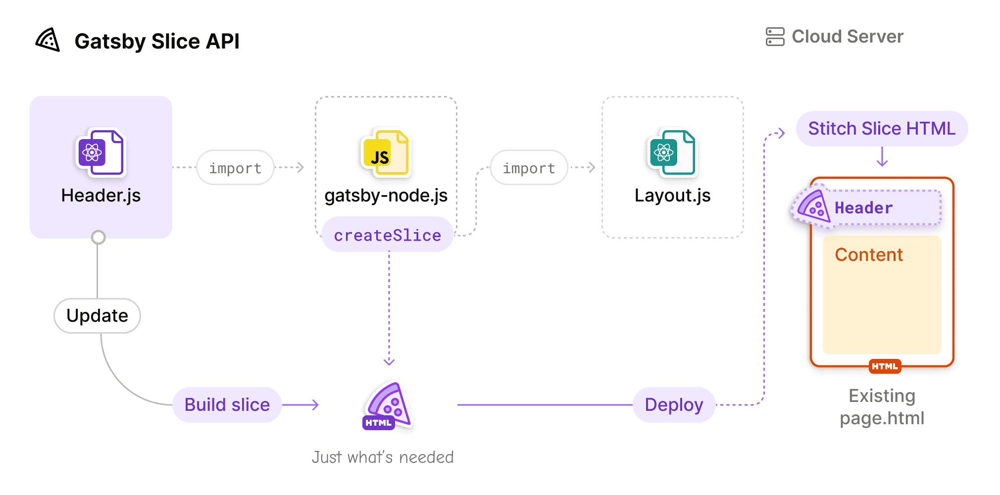
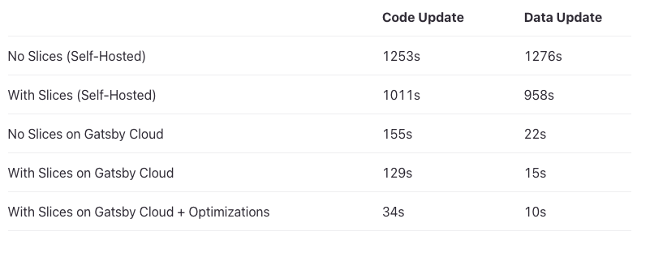
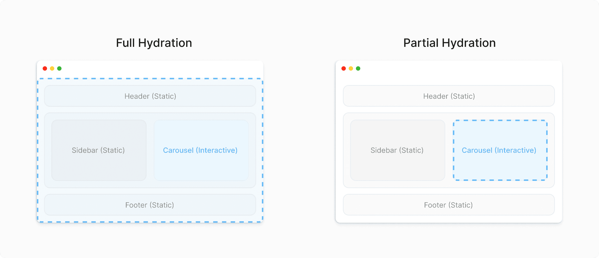
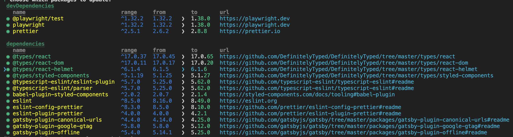
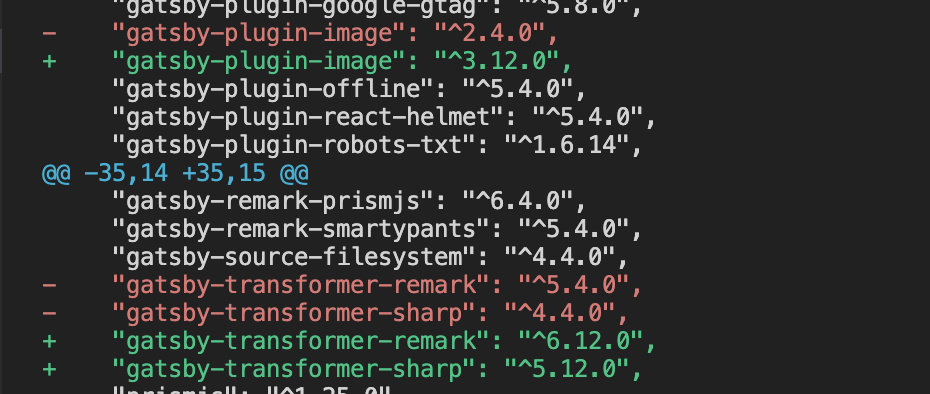
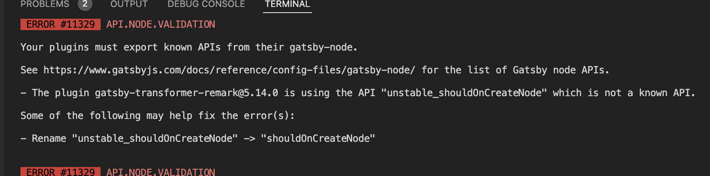
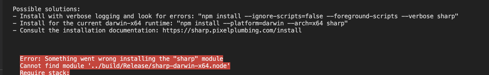
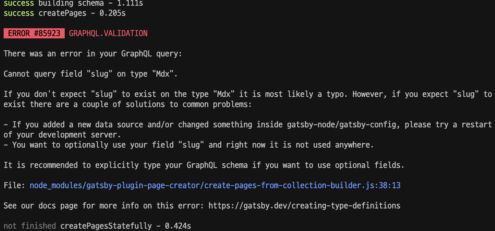

## Key Features

### Slice API

Common components can now be built just once, which improves build performance.

In other words, when a component split out as a Slice changes, it is built only once and then merged into other parts of the site, so there is no need to rebuild everything as before.

```tsx
// gatsby-config.js
exports.createPages = async ({ actions }) => {
  actions.createSlice({
    id: `header`,
    component: require.resolve(`./src/components/header.js`),
  })
}

// layout.js
import { Slice } from "gatsby"
import { Footer } from "./footer"

export const DefaultLayout = ({ children, headerClassName }) => {
  return (
    <div className={styles.defaultLayout} />
      <Slice alias="header" className={headerClassName} />
      {children}
      <Footer />
    </div>
  )
}
```





### Partial Hydration (Beta)

Adds the partial hydration feature introduced in React 18 (note: this is a Beta feature).



### GraphiQL v2

Gatsby's integrated GraphQL development environment (IDE) has been upgraded from v1 to v2.

- Dark Mode
- Tabs
- Persisted State/Tabs using `localStorage`
- Better documentation explorer through search and markdown support
- Plugin ecosystem

## Changes

### Minimal Node.js version 18.0.0

As support for Node 14 and 16 is nearly discontinued, the minimum supported Node version is set to 18.

### Minimal required React version is 18

React 18 or higher is now the minimum supported version; version 18 or above is required to support partial hydration.

### Non-ESM browsers are not polyfilled by default

Polyfill support is discontinued for browsers that do not support ES6 modules (like Internet Explorer).

### GraphQL schema: Changes to sort and aggregation fields

The `sort,` and `field` arguments have changed from enums to nested objects.

To make the migration from v4 to v5 easier, a codemod is provided.

```bash
npx gatsby-codemods@latest sort-and-aggr-graphql .
```

Changes

```tsx
// Before
{
  allMarkdownRemark(sort: { fields: [frontmatter___date], order: DESC }) {
    nodes {
      ...fields
    }
  }
}

// After
{
  allMarkdownRemark(sort: { frontmatter: { date: DESC } }) {
    nodes {
      ...fields
    }
  }
}
```

```tsx
// Before
{
  allMarkdownRemark {
    distinct(field: frontmatter___category)
  }
}

// After
{
  allMarkdownRemark {
    distinct(field: { frontmatter: { category: SELECT } })
  }
}
```

### trailingSlash is set to always

In Gatsby 5, the default trailingSlash option changed from legacy to always. This means that a trailing `/` is unconditionally appended to every URL.

```tsx
// gatsby-config.js
module.exports = {
  trailingSlash: `always`,
};
```

### Removal of useNavigate hook

To support React 18 and React server components, useNavigate has been changed to navigate.

```tsx
- import { useNavigate } from "@gatsbyjs/reach-router"
+ import { navigate } from "gatsby"
```

### Removal of obsolete flags and environment variables

The environment variables and features that were experimentally introduced in Gatsby v3 and v4 to extend functionality are now provided by default in v5. As a result, the environment variables listed below are no longer used (they will have no effect even if they are still set).

```tsx
QUERY_ON_DEMAND
LAZY_IMAGES
PRESERVE_WEBPACK_CACHE
DEV_WEBPACK_CACHE
LMDB_STORE
PARALLEL_QUERY_RUNNING
GRAPHQL_TYPEGEN (can be enabled through gatsby-config)
```

### shouldOnCreateNode is Stable

The previously unstable `unstable_shouldOnCreateNode` API has been changed to the stable `shouldOnCreateNode` API.

shouldOnCreateNode: You can receive a response via a callback function when a Node is created.

```tsx
exports.shouldOnCreateNode = ({ node }, pluginOptions) =>
  node.internal.type === 'Image';
```

### Removal of nodeModel.runQuery and nodeModel.getAllNodes

runQuery and getAllNodes are replaced by findOne and findAll.

### graphql 16

graphql has been upgraded from version 15 to 16.

## Migration Guide

### Handling deprecations

Before migrating to Gatsby version 5, if you have not updated your plugins, it is recommended to first update to the latest v4.

As shown in the image below, select the packages you want to update with the space bar and press enter to install them automatically.

```bash
npm outdated or yarn upgrade-interactive
```



### Update Gatsby version

```tsx
yarn add gatsby@latest

// Add the following command if your npm version is 7 or higher
npm install gatsby@latest --legacy-peer-deps

// package.json
{
  "dependencies": {
    "gatsby": "^5.0.0"
  }
}
```


### Update React version

```tsx
yarn add react@latest react-dom@latest @types/react@latest @types/react-dom@latest

// Add the following command if your npm version is 7 or higher
npm install react@latest react-dom@latest --legacy-peer-deps

// package.json
{
  "dependencies": {
    "react": "^18.0.0",
    "react-dom": "^18.0.0"
  }
}
```


### Update react-helmet → react-helmet-async

Since React 17 no longer supports the legacy React `component~~` functions, switch to react-helmet-async.

- https://github.com/nfl/react-helmet/issues/548

```tsx
yarn add react-helmet-async @types/react-helmet-async gatsby-plugin-react-helmet-async

// gatsby-config.js
module.exports = {
  'gatsby-plugin-react-helmet-async',
};
```

### Update Gatsby related packages

Update all packages that start with `gatsby-*` to their @latest version, one by one.

However, after each update, be sure to run yarn build to check whether any errors occur.



### If you get the "unstable_sholdOnCreateNode which is not a known API" error

Check the error log and then reinstall the relevant plugin.



### If you get the "cannot find module '../build/Release/sharp-darwin-x64.node" error

This issue occurs because of previously cached data in node_modules, so apply the commands below.

```tsx
rm -rf node_modules/sharp
yarn install --check-files
```



### Errors in GraphQL queries

If you get an error like the one below during deployment, create an .npmrc file and add the command below.

```tsx
npx gatsby-codemods@latest sort-and-aggr-graphql
// If you want to apply it only to a specific file/directory, append <filepath> at the end
```

Looking through the official documentation, I found that this update changed part of the GraphQL syntax, which was causing errors with the existing syntax. The [official documentation](https://www.notion.so/7cc77e741c3348e78bc1d477191fc8ea?pvs=21) provides a codemod feature that converts existing queries to the new syntax and reads them without requiring the user to change anything, and applying the command below resolved the issue.



### No more 'import React ...'

The `Import React` statement is no longer needed from React 17 onward, so it can be removed.

- **React 17 new JSX Transform: ReferenceError: React is not defined**

  Removing the `Import React` statement caused an error when Gatsby was restarted, so you need to add the `runtime: 'automatic'` property in babelrc.

  [https://github.com/gatsbyjs/gatsby/issues/28657](https://github.com/gatsbyjs/gatsby/issues/28657)

  ```tsx
  {
    "presets": [
      [
        "babel-preset-gatsby",
        {
          "reactRuntime": "automatic"
        }
      ]
    ]
  }
  ```

## References

- [Migrating from v4 to v5 | Gatsby](https://www.gatsbyjs.com/docs/reference/release-notes/migrating-from-v4-to-v5/)
