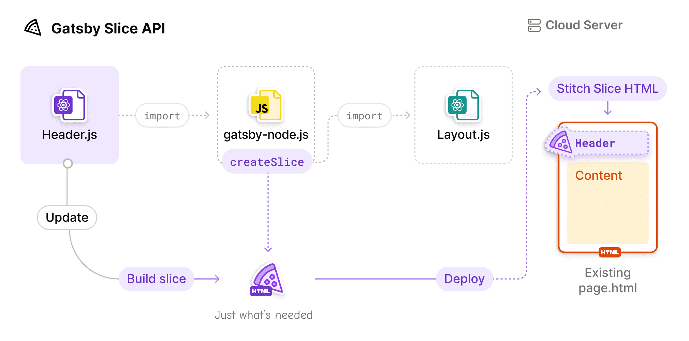
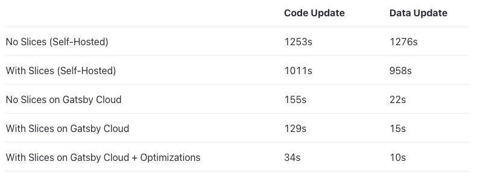
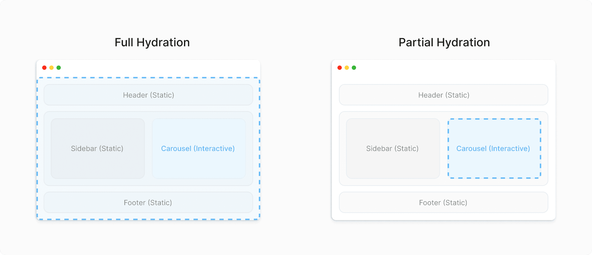
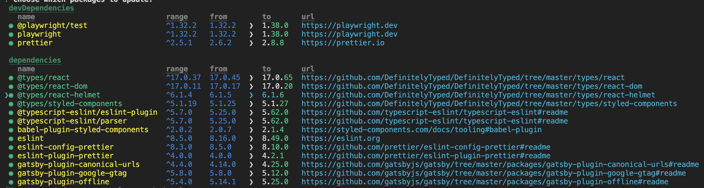
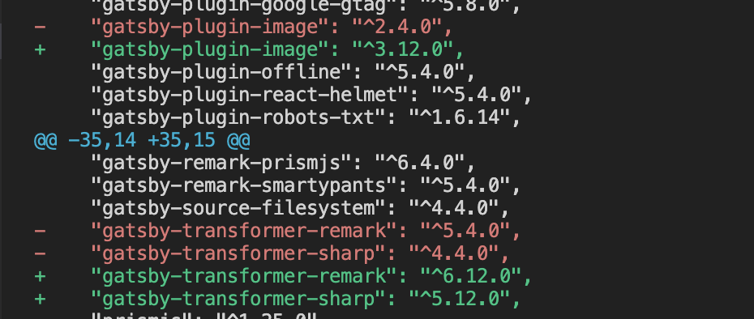
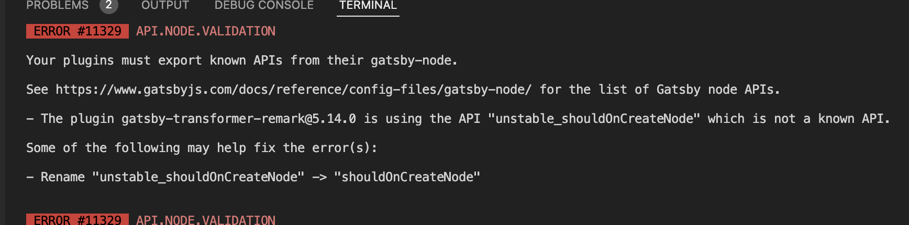
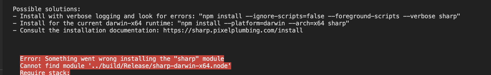
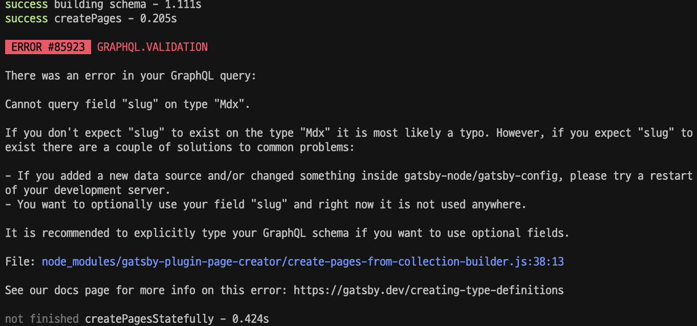

## 주요 기능

### Slice API
    
    공통 구성요소를 한번만 빌드하게 해서 빌드 성능을 높일 수 있게 되었다.
    
    즉, Slice로 분리된 컴포넌트가 변경 시 한번만 빌드 후에 다른 구성요소에 합쳐지게 됨으로 이전처럼 전체를 빌드할 필요가 없습니다.
    
    ```tsx
    // gatsby-config.js
    exports.createPages = async ({ actions }) => {
      actions.createSlice({
        id: `header`,
        component: require.resolve(`./src/components/header.js`),
      })
    }
    
    // layout.js
    import { Slice } from "gatsby"
    import { Footer } from "./footer"
    
    export const DefaultLayout = ({ children, headerClassName }) => {
      return (
        <div className={styles.defaultLayout} />
          <Slice alias="header" className={headerClassName} />
          {children}
          <Footer />
        </div>
      )
    }
    ```
    
    
    
    
    
### Partial Hydration (Beta)
    
    react 18에 추가된 부분 Hydration 기능 추가(단, Beta 기능)
    
    
    
### GraphiQL v2
    
    Gatsby의 통합 GraphQL 개발 환경(IDE)이 v1 → v2로 변경
    
    - Dark Mode
    - Tabs
    - Persisted State/Tabs using `localStorage`
    - Better documentation explorer through search and markdown support
    - Plugin ecosystem

## 변경 사항

### Minimal Node.js version 18.0.0
    
  Node 14 and 16 버전의 지원이 거의 중단됨에 따라서 최소 Node 버전 지원을 18로 세팅
    
### Minimal required React version is 18
    
  최소 React 18 버전 이상 지원, 부분 hidration 지원을 위해서 18 버전 이상 지원요구
    
### Non-ESM browsers are not polyfilled by default
    
  es6-module 지원하지 않는 브라우저(like Internet Explorer)에 대해서는 폴리필 지원 중단됩니다.
    
### GraphQL schema: Changes to sort and aggregation fields
    
  `sort,` `field` 인수가 열거형에서 중첩된 개체로 변경됨
  
  v4 → v5 쉽게 변경하기 위해서 codemod 를 지원
  
  ```bash
  npx gatsby-codemods@latest sort-and-aggr-graphql .
  ```
  
  변경사항
  
  ```tsx
  // 변경 전
  {
    allMarkdownRemark(sort: { fields: [frontmatter___date], order: DESC }) {
      nodes {
        ...fields
      }
    }
  }
  
  // 변경 후
  {
    allMarkdownRemark(sort: { frontmatter: { date: DESC } }) {
      nodes {
        ...fields
      }
    }
  }
  ```
  
  ```tsx
  // 변경 전
  {
    allMarkdownRemark {
      distinct(field: frontmatter___category)
    }
  }
  
  // 변경 후
  {
    allMarkdownRemark {
      distinct(field: { frontmatter: { category: SELECT } })
    }
  }
  ```
    
### trailingSlash is set to always
    
  Gatsby 5 trailingSlash 디폴트 옵션 legacy → always로 변경 되었습니다. 모든 URL 뒤에 / 무조건 추가된다는 걸 뜻합니다.
  
    
  
  ```tsx
  // gatsby-config.js
  module.exports = {
    trailingSlash: `always`,
  }
  ```
    
### Removal of useNavigate hook
    
  React 18 and React server components 지원을 위해서 useNavigaction → navigate로 변경
  
  ```tsx
  - import { useNavigate } from "@gatsbyjs/reach-router"
  + import { navigate } from "gatsby"
  ```
    
### Removal of obsolete flags and environment variables
    
  gatsby v3, v4에서 기능 확장을 위해서 실험적으로 도입된 환경변수/기능들이 v5에서는 기본 제공으로 변경됨에 따라서 아래 나열된 환경변수를 미사용(추가가 되어 있더라도 동작하지 않음)
  
  ```tsx
  QUERY_ON_DEMAND
  LAZY_IMAGES
  PRESERVE_WEBPACK_CACHE
  DEV_WEBPACK_CACHE
  LMDB_STORE
  PARALLEL_QUERY_RUNNING
  GRAPHQL_TYPEGEN (can be enabled through gatsby-config)
  ```
    
### shouldOnCreateNode is Stable
    
  이전에 안정화 되지 않는 unstable_shouldOnCreateNode API가 shouldOnCreateNode API 로 변경
  
  shouldOnCreateNode: Node가 생성 시 callback 함수로 응답을 받을 수 있다.
  
  ```tsx
  exports.shouldOnCreateNode = ({node}, pluginOptions) => node.internal.type === 'Image'
  ```
    
### Removal of nodeModel.runQuery and nodeModel.getAllNodes
    
  runQuery, getAllNodes → findOne, findAll 대체
    
### graphql 16
    
  graphql 15 → 16 version upgrade
    

## Migration Guide

### Handling deprecations
    
  gatsby 버전 5로 변환하기 전에 plugin 업데이트를 하지 않는다면 최신 v4으로 업데이트 권고
  
  아래 이미지와 같이 space로 업데이트 할 패키지 선택 후 enter 입력 시 자동 설치됨.
  
  ```bash
  npm outdated or yarn upgrade-interactive
  ```
  
  
    
### Update Gatsby version
    
  ```tsx
  yarn add gatsby@latest
  
  // npm 버전이 7이거나 그 이상일때 뒤의 명령어 추가
  npm install gatsby@latest --legacy-peer-deps
  
  // package.json
  {
    "dependencies": {
      "gatsby": "^5.0.0"
    }
  }
  ```
  
  
    
### Update React version
  
  ```tsx
  yarn add react@latest react-dom@latest @types/react@latest @types/react-dom@latest
  
  // npm 버전이 7이거나 그 이상일때 뒤의 명령어 추가
  npm install react@latest react-dom@latest --legacy-peer-deps
  
  // package.json
  {
    "dependencies": {
      "react": "^18.0.0",
      "react-dom": "^18.0.0"
    }
  }
  ```
  
  
    
### Update react-helmet → react-helmet-async
    
  react 17 이후 부터는 이전 react 함수인 component~~ 함수를 지원하지 않아서 react-helmet-async 변경
  
  - https://github.com/nfl/react-helmet/issues/548
  
  ```tsx
  yarn add react-helmet-async @types/react-helmet-async gatsby-plugin-react-helmet-async
  
  // gatsby-config.js
  module.exports = {
    'gatsby-plugin-react-helmet-async',
  };
  ```
    
### Update Gatsby related packages
    
  gatsby-*로 시작하는 모든 패키지들을 @latest 버전으로 하나씩 업데이트
  
  단, 업데이트 이후에 꼭 yarn build로 실행해서 에러 여부를 체크해야 함.
  
  
    
### unstable_sholdOnCreateNode which is not a known API 에러가 날 경우
    
  에러 로그를 확인 후에 해당 plugin을 재설치
  
  
    
### cannot find module ‘../build/Release/sharp-darwin-x64.node 에러가 날 경우
    
  node_modules에 기존에 캐싱된 데이터가 있어서 나온 이슈라서 아래와 같은 명령어를 적용해주세요.
  
  ```tsx
  rm -rf node_modules/sharp
  yarn install --check-files
  ```
  
  
    
### GraphQL Query에 에러
    
  배포 할 때 아래와 같이 에러가 날 경우 .npmrc 파일을 만들어서 아래 명령어를 추가
  
  ```tsx
  npx gatsby-codemods@latest sort-and-aggr-graphql
  // 만약 특정 파일/디렉토리에만 적용하고 싶다면 뒤에 <filepath>를 붙여주기
  ```
  
  공식문서를 찾아보니 이번 업데이트에서 graphQL 문법이 변경된 부분이 있어 기존 syntax에서 에러가 나는 것이었다. [공식문서](https://www.notion.so/7cc77e741c3348e78bc1d477191fc8ea?pvs=21)에서는 기존에 작성된 쿼리를 사용자가 변경할 일이 없이 새로운 syntax로 변환해서 읽어주는 codemod라는 기능을 제공하고 있어 아래 명령어를 적용하니 해결되었다.
  
  
  

## 참고페이지

- [Migrating from v4 to v5 | Gatsby](https://www.gatsbyjs.com/docs/reference/release-notes/migrating-from-v4-to-v5/)