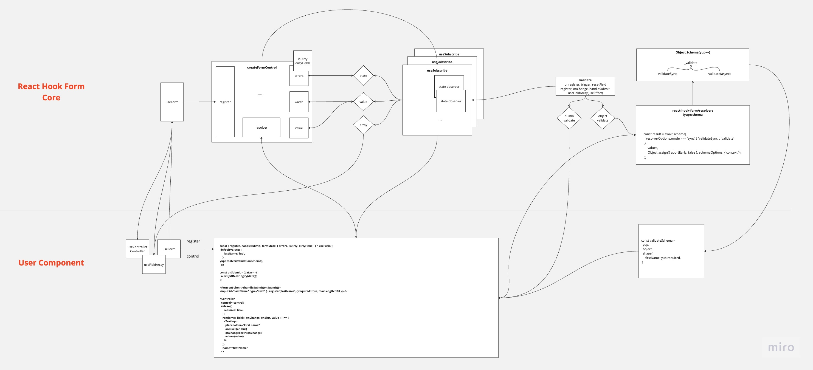

# useForm



## Form 객체 생성

useForm에서 데이터를 최초 세팅 후 defaultValues 세팅 이후에 다시 변경 시 변경이 안되는 경우가 있는데 아래 코드 처럼 useRef 최초 1회 생성 시에만 defaultValues를 세팅함으로 변경이 안되는거 였다.

해당 이슈를 해결을 위해서는 데이터를 얻어온 이후에 useForm을 호출해주는 방향으로 설계를 해야할 것 같다.

```tsx
const _formControl = React.useRef<
  UseFormReturn<TFieldValues, TContext, TTransformedValues> | undefined
>();

const [formState, updateFormState] = React.useState<FormState<TFieldValues>>({
  isDirty: false,
  isValidating: false,
  isLoading: isFunction(props.defaultValues),
  isSubmitted: false,
  isSubmitting: false,
  isSubmitSuccessful: false,
  isValid: false,
  submitCount: 0,
  dirtyFields: {},
  touchedFields: {},
  errors: {},
  defaultValues: isFunction(props.defaultValues)
    ? undefined
    : props.defaultValues,
});

if (!_formControl.current) {
  _formControl.current = {
    ...createFormControl(props, () =>
      updateFormState(formState => ({ ...formState })),
    ),
    formState,
  };
}

const control = _formControl.current.control;
control._options = props;

export function useSubscribe<T>(props: Props<T>) {
  const _props = React.useRef(props);
  _props.current = props;

  React.useEffect(() => {
    const subscription =
      !props.disabled &&
      _props.current.subject &&
      // 최초 구독 처리하고 2번째 인자로 넘어온 함수를 실행한다.
      _props.current.subject.subscribe({
        next: _props.current.next,
      });

    return () => {
      subscription && subscription.unsubscribe();
    };
  }, [props.disabled]);
}

useSubscribe({
  // form 전체에 대한 상태값 관리하는 객체
  subject: control._subjects.state,
  //
  next: (
    value: Partial<FormState<TFieldValues>> & { name?: InternalFieldName },
  ) => {
    // 객체 생성 함수 로직에서 value 넘어온 value값을 구독한 지점에 업데이트(watch, register)
    if (
      // 생성한 폼 객체의 상태값을 변경하기 위한 함수
      shouldRenderFormState(
        value,
        control._proxyFormState,
        control._updateFormState,
        true,
      )
    ) {
      // 폼 객체의 상태값을 변경 이후에 useState 상태를 세팅함으로써 렌더링 되게 처리
      updateFormState({ ...control._formState });
    }
  },
});

React.useEffect(() => {
  // 서버에서 받아온 values 값을 업데이트 할 경우
  if (props.values && !deepEqual(props.values, _values.current)) {
    control._reset(props.values, control._options.resetOptions);
    _values.current = props.values;
  } else {
    // 기본값일 경우에는 디폴트 밸류 함수로 세팅한다.
    control._resetDefaultValues();
  }
}, [props.values, control]);

React.useEffect(() => {
  if (!control._state.mount) {
    // 최초 1회 form 객체 생성(createFormControl)
    control._updateValid(); // 유효성 체크
    control._state.mount = true; // form 생명주기 상태값으로 mount 처리
  }

  if (control._state.watch) {
    // watch 모드가 세팅 될 경우
    control._state.watch = false; // watch  모드 끄고
    control._subjects.state.next({ ...control._formState }); // useSubscribed 훅의 next를 실행
  }

  // element name 값으로 엘리먼트의 상태값을 관리 중 unMount가 있는경우 제거한다.(option.shouldUnregister 세팅된 경우)
  control._removeUnmounted();
});

// useState를 통해서 변경된 데이터를 내부 폼 전체 객체 상태값을 업데이트(상태값을 ref에 저장)
_formControl.current.formState = getProxyFormState(formState, control);

// 컴포넌틀는 리랜더링 하더라도 useRef의 최신 상태값을 얻어오도록 ref에 current값을 리턴한다.
return _formControl.current;
```

## 최초 1회 Form 객체 생성 로직(createFormControl)

createFormControl 함수에 대한 설명을 해보겠습니다.

props는 useForm 인자 props를 전달한다.

```tsx
const defaultOptions = {
  mode: VALIDATION_MODE.onSubmit,
  reValidateMode: VALIDATION_MODE.onChange,
  shouldFocusError: true,
} as const;

export function createFormControl<
  TFieldValues extends FieldValues = FieldValues,
  TContext = any,
>(
  props: UseFormProps<TFieldValues, TContext> = {},
  flushRootRender: () => void,
): Omit<UseFormReturn<TFieldValues, TContext>, 'formState'> {}

// 기본 값을 세팅
let _defaultValues =
  isObject(_options.defaultValues) || isObject(_options.values)
    ? cloneObject(_options.defaultValues || _options.values) || {}
    : {};

// formValues 값을 세팅
let _formValues = _options.shouldUnregister // unmount 될 경우 입력데이터 손실처리
  ? {}
  : cloneObject(_defaultValues);

// form 생명주기 상태값을 관리
let _state = {
  action: false,
  mount: false,
  watch: false,
};

// element name 값으로 엘리먼트의 상태값을 관리
let _names: Names = {
  mount: new Set(), // register, unregister 실행 시 name 값을 map으로 관리
  unMount: new Set(),
  array: new Set(),
  watch: new Set(),
};

// form 전체에 대한 상태값 관리
const _proxyFormState = {
  isDirty: false,
  dirtyFields: false,
  touchedFields: false,
  isValidating: false,
  isValid: false,
  errors: false,
};

// 옵저버 패턴 객체 생성
const _subjects: Subjects<TFieldValues> = {
  values: createSubject(),
  array: createSubject(),
  state: createSubject(),
};

// 사용자의 인터렉션에 대해서만 dirty 세팅(DirtyFields and isDirty)
const shouldCaptureDirtyFields =
  props.resetOptions && props.resetOptions.keepDirtyValues;

// 제출 이전, 이후에 유효성 체크 로직 분리
const validationModeBeforeSubmit = getValidationModes(_options.mode);
const validationModeAfterSubmit = getValidationModes(_options.reValidateMode);
```

### register

```tsx
const register: UseFormRegister<TFieldValues> = (name, options = {}) => {
  // <input type="radio" {...register('radio')} value="1" />
  // element name값을 fields로 관리
  let field = get(_fields, name);
  const disabledIsDefined = isBoolean(options.disabled);

  // register 실행 후에 _fileds에서 name, mount: true, options값을 세팅
  set(_fields, name, {
    ...(field || {}),
    _f: {
      ...(field && field._f ? field._f : { ref: { name } }),
      name,
      mount: true,
      ...options,
    },
  });

  // 마운트된 name값을 관리
  _names.mount.add(name);

  // 이미 element name이 있는경우
  //   <input type="radio" {...register('radio')} value="1" />
  //   <input type="radio" {...register('radio')} value="2" />
  //   <input type="radio" {...register('radio')} value="3" />
  if (field) {
    _updateDisabledField({
      field,
      disabled: options.disabled,
      name,
    });
  } else {
    updateValidAndValue(name, true, options.value);
  }
};
```

- \_updateDisabledField: disabled 속성이 있는 경우에 field를 업데이트 해주는 함수
  ```tsx
  // _updateDisabledField
  const _updateDisabledField: Control<TFieldValues>['_updateDisabledField'] = ({
    disabled,
    name,
    field,
    fields,
  }) => {
    // disabled 속성이 있는 경우 element값을 undefine로 채운다.
    if (isBoolean(disabled)) {
      const value = disabled
        ? undefined
        : get(
            _formValues,
            name,
            getFieldValue(field ? field._f : get(fields, name)._f),
          );
      set(_formValues, name, value);
      updateTouchAndDirty(name, value, false, false, true);
    }
  };
  ```
- \_updateValid: form의 유효성을 여부를 얻어와서 업데이트 해주는 함수

  ```tsx
  const _updateValid = async (shouldUpdateValid?: boolean) => {
    // form 전체 유효한 경우, 강제 유효성 검증을 해야할 경우
    if (_proxyFormState.isValid || shouldUpdateValid) {
      // resolver가 있는경우
      const isValid = _options.resolver
        ? isEmptyObject((await _executeSchema()).errors)
        : await executeBuiltInValidation(_fields, true);

      //
      if (isValid !== _formState.isValid) {
        _subjects.state.next({
          isValid,
        });
      }
    }
  };
  ```

- updateValidAndValue: 값을 업데이트하고 유효성을 체크하는 함수

  ```tsx
  // updateValidAndValue
  const updateValidAndValue = (
    name: InternalFieldName,
    shouldSkipSetValueAs: boolean,
    value?: unknown,
    ref?: Ref,
  ) => {
    // element에 name 키값으로 내부의 _fields 값을 얻어옴
    const field: Field = get(_fields, name);

    if (field) {
      // 초기에 값을 얻어오는 로직
      const defaultValue = get(
        _formValues,
        name,
        isUndefined(value) ? get(_defaultValues, name) : value,
      );

      // 초기값 X or defaultChecked(radio, checkbox)
      // setValue 무시여부
      isUndefined(defaultValue) ||
      (ref && (ref as HTMLInputElement).defaultChecked) ||
      shouldSkipSetValueAs
        ? set(
            _formValues,
            name,
            shouldSkipSetValueAs ? defaultValue : getFieldValue(field._f),
          )
        : setFieldValue(name, defaultValue);

      // 마운트될 경우 유효성 체크하도록 처리
      _state.mount && _updateValid();
    }
  };
  ```

- updateTouchAndDirty: field값이 변경될 경우 isDirty, dirtyFields가 업데이트 해주는 함수

  ```tsx
  const updateTouchAndDirty = (
    name: InternalFieldName,
    fieldValue: unknown,
    isBlurEvent?: boolean,
    shouldDirty?: boolean,
    shouldRender?: boolean,
  ): Partial<
    Pick<FormState<TFieldValues>, 'dirtyFields' | 'isDirty' | 'touchedFields'>
  > => {
    let shouldUpdateField = false;
    let isPreviousDirty = false;
    const output: Partial<FormState<TFieldValues>> & { name: string } = {
      name,
    };

    if (!isBlurEvent || shouldDirty) {
      // 폼 전체 상태값 isDirty이 true일 경우에만 dirty가 세팅된다.
      if (_proxyFormState.isDirty) {
        isPreviousDirty = _formState.isDirty;
        _formState.isDirty = output.isDirty = _getDirty();
        shouldUpdateField = isPreviousDirty !== output.isDirty;
      }

      const isCurrentFieldPristine = deepEqual(
        get(_defaultValues, name),
        fieldValue,
      );

      isPreviousDirty = get(_formState.dirtyFields, name);
      // setValue를 통해서 shouldDirty값이 true일 경우 dirtyfields가 호출되고
      // 코드를 통해서 업데이트 할 경우 isDirty, dirtyFields값이 상이할 수 있다.
      isCurrentFieldPristine
        ? unset(_formState.dirtyFields, name)
        : set(_formState.dirtyFields, name, true);
      output.dirtyFields = _formState.dirtyFields;
      shouldUpdateField =
        shouldUpdateField ||
        (_proxyFormState.dirtyFields &&
          isPreviousDirty !== !isCurrentFieldPristine);
    }

    if (isBlurEvent) {
      const isPreviousFieldTouched = get(_formState.touchedFields, name);

      if (!isPreviousFieldTouched) {
        set(_formState.touchedFields, name, isBlurEvent);
        output.touchedFields = _formState.touchedFields;
        shouldUpdateField =
          shouldUpdateField ||
          (_proxyFormState.touchedFields &&
            isPreviousFieldTouched !== isBlurEvent);
      }
    }

    shouldUpdateField && shouldRender && _subjects.state.next(output);

    return shouldUpdateField ? output : {};
  };
  ```

## resolver

### resolver 개요

각 필드별로 builtin schema(register: required, min, max, minLength, maxLength.., control: rule)를 통해서 유효성 검증을 하는게 가능하지만, resolver를 통해서 object schema 사용 할 경우 schema를 하나로 통합해서 관리가 가능하며, 각 schema plugin 특성에 맞게 확장이 가능하기 때문에 react-hook-form resolver를 사용하기도 합니다.

**Usage example(사용예제)**

```tsx
// resolver: 선호하는 스키마 라이브러리의 유효성 검증 로직 통합을 위해서 사용
// context: 스키마 라이브러리에서 사용하기 위한 전역 객체
// getResolverOptions: resolver options 값을 주입해주기 위한 함수

// builtin schema 사용
<form onSubmit={handleSubmit(onSubmit)}>
  <input
    {...register('firstName', { required: true })}
    placeholder="firstName"
  />
  {errors.firstName && <p>firstName error</p>}
</form>;

// resolver schema 사용(yup 사용 예)
const validationSchema = yup
  .object()
  .shape(
    {
      firstName: yup
        .string()
        .required()
        .when('$type', (type, schema) => {
          console.log(type);
          if (type === 'one') {
            return schema.required();
          }
          return;
        }),
    },
    [['exclusivelyRequiredOne', 'exclusivelyRequiredTwo']],
  )
  .required();

let dynamicValue = condition ? 'one' : 'two';
const {
  control,
  register,
  handleSubmit,
  formState: { errors },
} = useForm<{
  firstName: string;
}>({
  // resolver: 선호하는 스키마 라이브러리의 유효성 검증 로직 통합을 위해서 사용
  resolver: yupResolver(validationSchema),
  mode: mode as keyof ValidationMode,
  context: { type: 'one' },
});

<form onSubmit={handleSubmit(onSubmit)}>
  <input {...register('firstName')} placeholder="firstName" />
  {errors.firstName && <p>firstName error</p>}
</form>;
```

**resolver 설명**


- 직접 custom resolver 구현한다면..

```tsx
import { Resolver, FieldError } from 'react-hook-form';
import get from 'lodash/get';

export interface FormData {
  name: string;
  city: string;
  street: string;
}

function validateLength(
  name: string,
  value: any,
  errors: Record<string, FieldError>,
) {
  if (!value || value.length < 6) {
    return {
      ...errors,
      [name]: {
        type: `min-length-${minLength}`,
        message: `The field "${name}" must be at least ${minLength} chars`,
      },
    };
  }

  return errors;
}

export const customResolver: Resolver<FormData> = (
  values,
  _context,
  { names },
) => {
  let errors = {};
  if (names) {
    // Validate only changed fields
    errors = names.reduce((acc, name) => {
      const value = get(values, name);

      return validateLength(name, value, acc);
    }, {});
  } else {
    // Validate all fields on submit event
    errors = Object.entries(values).reduce(
      (acc, [name, value]) => validateLength(name, value, acc),
      {},
    );
  }

  return { values, errors };
};

const {
  register,
  handleSubmit,
  formState: { errors },
} = useForm<FormData>({
  mode: 'onChange',
  resolver: customResolver,
});
```

- react-hook-form에서 지원해주는 resovler(총 14개)

[](https://github.com/react-hook-form/resolvers/blob/master/yup/src/yup.ts)

- react-hook-form 지원하는 validation library 비교
  ajv
  - AJV는 JSON 스키마를 사용하여 데이터의 유효성을 검사하며, 이는 다양한 언어로 수행될 수 있습니다.
  - Github에 별이 12,000개에 달하고 매주 npm 다운로드가 8,500만 건에 달하는 대규모 커뮤니티입니다.
  - AJV는 현재 json-schema-benchmarks에 따르면 가장 빠른 json 스키마 유효성 검사기 라이브러리입니다.
    joi
  - Github에서 약 19,000개의 스타를 보유한 최대 규모의 커뮤니티 및 지원을 제공합니다.
  - 번들 크기는 약 149kb로 축소되었습니다.
  - 서버측을 위해 더 많이 구축되었으며 서버측 작업 시 권장됩니다.
  - Joi는 매우 큰 API를 가지고 있어 문서화가 잘 되어 있어 학습 곡선이 단축됩니다.
    yup
  - Schema는 Joi와 유사하며, 비슷한 방식을 가지고 있습니다.
  - 주로 클라이언트 측에서 사용되며 클라이언트 측 유효성 검사를 지원합니다.
  - ~60kb의 번들 크기가 축소되었습니다. 이는 AJV 및 Joi보다 낮지만 Zod보다 큽니다.
  - 예, 정적 유형 추론을 지원하지만 반드시 TypeScript와 일치할 필요는 없습니다.
    zod
  - zod는 정적 유형 추론을 지원하며 TypeScript와 잘 작동합니다.
  - 번들 크기는 약 45kb입니다.

### inside resolver

### inside resolver initialize

```tsx
const validationSchema = yup
  .object()
  .shape(
    {
      firstName: yup
        .string()
        .required()
        .when('$type', (type, schema) => {
          console.log(type);
          if (type === 'one') {
            return schema.required();
          }
          return;
        }),
    },
    [['exclusivelyRequiredOne', 'exclusivelyRequiredTwo']],
  )
  .required();

const {
  control,
  register,
  handleSubmit,
  formState: { errors },
} = useForm<{
  firstName: string;
}>({
  resolver: yupResolver(validationSchema),
  mode: mode as keyof ValidationMode,
  context: { type: 'one' },
});

// react-hook-form/resolvers/blob/master/yup/src/yup.ts
// useForm에 yupResolver 함수 호출 후 기본 인자값을 세팅
// schema: 사용자가 선언한 외부 통합을 위한 라이브러리 schema
// schemaOptions: 외부 라이브러리 초기 옵션
// resolverOptions: 동기/비동기 모드
export const yupResolver: Resolver =
  (schema, schemaOptions = {}, resolverOptions = {}) =>
  async (values, context, options) => {
    try {
      if (schemaOptions.context && process.env.NODE_ENV === 'development') {
        // eslint-disable-next-line no-console
        console.warn(
          "You should not used the yup options context. Please, use the 'useForm' context object instead",
        );
      }

      const result = await schema[
        resolverOptions.mode === 'sync' ? 'validateSync' : 'validate'
      ](
        values,
        Object.assign({ abortEarly: false }, schemaOptions, { context }),
      );

      // 브라우저 기본 유효성 검사를 사용할지 여부를 설정이 있는경우 네이티브 유효성도 같이 검증
      options.shouldUseNativeValidation && validateFieldsNatively({}, options);

      return {
        values: result,
        errors: {},
      };
    } catch (e: any) {
      if (!e.inner) {
        throw e;
      }

      return {
        values: {},
        errors: toNestError(
          parseErrorSchema(
            e,
            !options.shouldUseNativeValidation &&
              options.criteriaMode === 'all',
          ),
          options,
        ),
      };
    }
  };
```

### inside resolver validation check

- 호출 동선
  - unregister, triggeer, resetField > \_updateValid > \_executeSchema
  - register > updateValidAndValue > \_updateValid > \_executeSchema
  - onChange, handleSubmit, useFieldArray(useEffect) > \_executeSchema
  ```tsx
  // unregister, triggerm, resetField > _updateValid > _executeSchema
  // register > updateValidAndValue > _updateValid > _executeSchema
  // onChange, handleSubmit, useFieldArray(useEffect) > _executeSchema
  const _executeSchema = async (
    name?: InternalFieldName[], // name 값이 없는경우 전체 스키마를 검사
  ) =>
    _options.resolver!(
      _formValues as TFieldValues, // { fieldName: fieldValue -> firstName: HONG)
      _options.context, // resolver schema에 주입을 위한 용도
      getResolverOptions(
        // resolver options 값을 주입해주기 위한 함수
        name || _names.mount, // name 있는경우: 특정 필드, _names.mount: 마운트 된 필드에 키값을 배열로 넘김
        _fields, // 마운트된 필드의 dom 엘리먼트, 네임을 저장하는 set 객체
        _options.criteriaMode, // 기준모드: 모든 유효성 검사 오류를 전체 표시, 한번에 하나씩 표기
        _options.shouldUseNativeValidation, // 브라우저 기본 유효성 검사를 사용할지 여부를 설정합니다. false로 설정하면 React Hook Form의 내장 유효성 검사를 사용합니다.
      ),
    );
  ```
