# Overview

CORS (Cross-Origin Resource Sharing) is a mechanism that tells the browser whether it is allowed to access resources from a different origin (origin: protocol, host, port).

When you load a resource from a different origin, access is restricted unless the correct CORS headers are included.

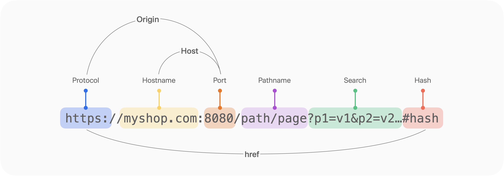

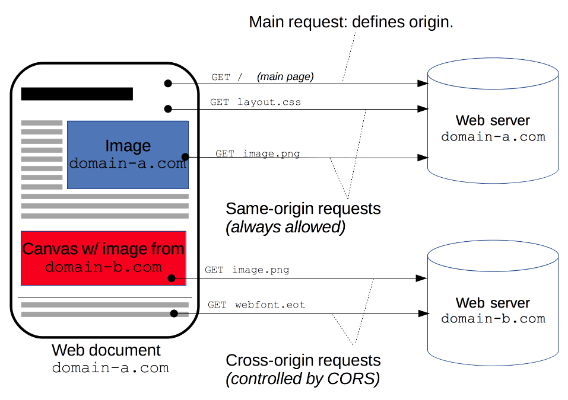

# CORS Use Cases

- [XMLHttpRequest](https://developer.mozilla.org/ko/docs/Web/API/XMLHttpRequest) and [Fetch API](https://developer.mozilla.org/ko/docs/Web/API/Fetch_API) calls.
- Web fonts (when using cross-domain fonts via @font-face in CSS), [so that servers can deploy TrueType fonts that can only be cross-site loaded and used by web sites that are permitted to do so.](https://www.w3.org/TR/css-fonts-3/#font-fetching-requirements)
- [WebGL textures](https://developer.mozilla.org/ko/docs/Web/API/WebGL_API/Tutorial/Using_textures_in_WebGL).
- Images/video frames drawn onto a canvas using [drawImage() (en-US)](https://developer.mozilla.org/en-US/docs/Web/API/CanvasRenderingContext2D/drawImage).
- [CSS Shapes extracted from images. (en-US)](https://developer.mozilla.org/en-US/docs/Web/CSS/CSS_shapes/Shapes_from_images)

# Let's Reproduce It Simply (Cross-Origin GET Method)

- If you run two servers on ports 4000 and 4001, and then call http://localhost:3000/cors, the HTML file calls http://localhost:4001/response.json. Because these are not the same origin, a CORS error occurs as shown in the image below.
- To determine whether a cross-origin resource is allowed, the browser checks the Access-Control-Allow-Origin attribute value in the server's response. Since the response headers below do not include any allowed origin, a CORS error occurs.

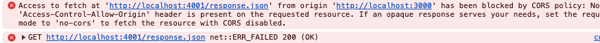

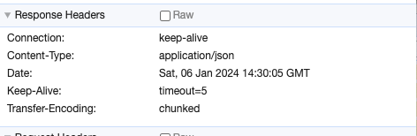

**GET call**

```tsx
// public/cross-origin/index.html
<!DOCTYPE html>
<html lang="en">
  <head>
    <meta charset="UTF-8" />
    <meta name="viewport" content="width=device-width, initial-scale=1.0" />
    <title>Cors Origin</title>
    <script>
      (async () => {
        const res = await fetch('http://localhost:4001/response.json');
        const json = await res.json();
        var newNode = document.createElement('div');
        newNode.innerHTML = JSON.stringify(json);
        document.body.appendChild(newNode);
      })();
    </script>
  </head>
  <body></body>
</html>

// express server (PORT: 4000, 4001)
import {
  createServer,
  IncomingMessage,
  OutgoingHttpHeaders,
  ServerResponse,
} from 'http';
import fs from 'fs';

// 다른 포트에도 서버를 띄우기 위해 포트 번호를 환경 변수로 받았다.
const port = process.env.PORT || 4000

const server = http.createServer((req, res) => {
  const responseServer = ({
    path,
    contentType,
    allowOption = {},
  }: ResponseArgument) => {
    fs.readFile(path, (err, content) => {
      if (err) {
        res.writeHead(500);
        res.end('Error');
        return;
      }

      res.writeHead(200, {
        'Content-Type': contentType,
        ...allowOption,
      });
      res.end(content);
    });
  };

	if (req.url === '/response.json') {
		responseServer({
      path: './public/response.json',
      contentType: 'application/json',
    });
	}

	if (req.url === '/cors') {
    responseServer({
      path: './public/cross-origin/index.html',
      contentType: 'text/html',
    });
  }
})

server.listen(port, () =>
  console.log(`Server Start Listening on port ${port}`)
);
```

# Simple requests

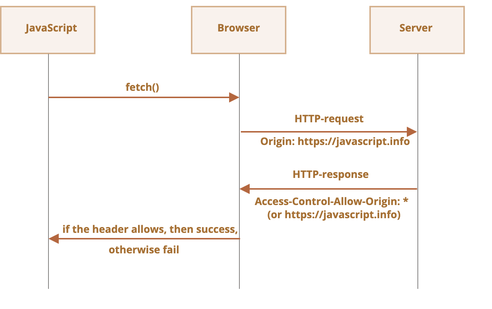

As in the example above, a request for which the browser only checks the cross-origin attribute is called a simple request, and some requests do not trigger a [CORS preflight](https://developer.mozilla.org/ko/docs/Glossary/Preflight_request). A simple request is one that satisfies all of the conditions below.

- One of the following methods
  - [GET](https://developer.mozilla.org/ko/docs/Web/HTTP/Methods/GET)
  - [HEAD](https://developer.mozilla.org/ko/docs/Web/HTTP/Methods/HEAD)
  - [POST](https://developer.mozilla.org/ko/docs/Web/HTTP/Methods/POST)
- Apart from the headers automatically set by the user agent (for example, [Connection](https://developer.mozilla.org/ko/docs/Web/HTTP/Headers/Connection), [User-Agent (en-US)](https://developer.mozilla.org/en-US/docs/Web/HTTP/Headers/User-Agent), and [the headers defined as "forbidden header name" in the Fetch spec](https://fetch.spec.whatwg.org/#forbidden-header-name)), the only headers that may be set manually are [those defined as "CORS-safelisted request-header" in the Fetch spec](https://fetch.spec.whatwg.org/#cors-safelisted-request-header).
  - [Accept](https://developer.mozilla.org/ko/docs/Web/HTTP/Headers/Accept)
  - [Accept-Language](https://developer.mozilla.org/ko/docs/Web/HTTP/Headers/Accept-Language)
  - [Content-Language](https://developer.mozilla.org/ko/docs/Web/HTTP/Headers/Content-Language)
  - [Content-Type](https://developer.mozilla.org/ko/docs/Web/HTTP/Headers/Content-Type) (note the additional requirements below.)
- The [Content-Type](https://developer.mozilla.org/ko/docs/Web/HTTP/Headers/Content-Type) header allows only the following values.
  - application/x-www-form-urlencoded
  - multipart/form-data
  - text/plain

**Solution**

The server sends the origin that is allowed to use the resource back to the client via Access-Control-Allow-Origin, and the browser checks the allowed origin address so that it can use the server's resource.

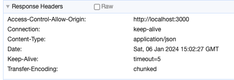

```tsx
// public/cross-origin/index_post.html
<!DOCTYPE html>
<html lang="en">
  <head>
    <meta charset="UTF-8" />
    <meta name="viewport" content="width=device-width, initial-scale=1.0" />
    <title>Cors Origin</title>
    <script>
      (async () => {
        const res = await fetch('http://localhost:4001/response.json', {
          method: 'POST',
        });
        const json = await res.json();
        var newNode = document.createElement('div');
        newNode.innerHTML = JSON.stringify(json);
        document.body.appendChild(newNode);
      })();
			(async () => {
        const res = await fetch('http://localhost:4001/response.json');
        const json = await res.json();
        var newNode = document.createElement('div');
        newNode.innerHTML = JSON.stringify(json);
        document.body.appendChild(newNode);
      })();
    </script>
  </head>
  <body></body>
</html>

// express server (PORT: 4000, 4001)
if (req.url === '/response.json') {
    responseServer({
      path: './public/response.json',
      contentType: 'application/json',
      allowOption: {
        // 자원을 허용할 출처를 지정한다.
        // 단순 요청(Simple requests)
        // Accept, Accept-Language, Content-Language, Content-Type
        'Access-Control-Allow-Origin': 'http://localhost:3000',
      },
    });
  }
```

# Preflight request

**Unsafe requests**

In the past, browsers were not expected to send API requests using anything other than GET and POST. So when later-introduced methods such as PATCH, DELETE, and PUT are called, the browser assumes the request may not have originated from itself and checks the access permission. The mechanism used to check that access permission is called a preflight request.

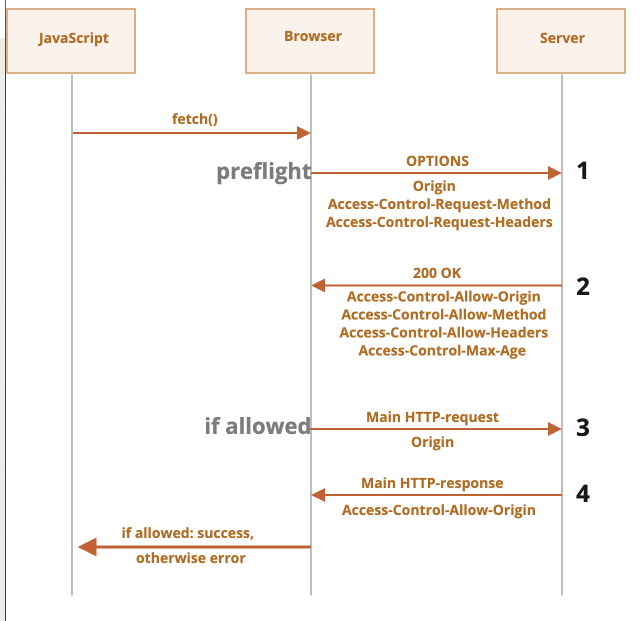

When there is a preflight request, it uses the OPTIONS method, includes two headers, and has an empty body.

A preflight request uses the OPTIONS method, includes two headers, and has an empty body.

- Access-Control-Request-Method header – contains the method information used in the unsafe request.
- Access-Control-Request-Headers header – contains the list of headers used in the unsafe request. Each header is separated by a comma.

If the server agrees to allow the unsafe request, it sends a response with an empty body and status code 200 to the browser, together with headers such as the following.

- Access-Control-Allow-Origin – must be the origin that sent the request.
- Access-Control-Allow-Methods – contains the allowed method information.
- Access-Control-Allow-Headers – contains the list of allowed headers.
- Access-Control-Max-Age – specifies how many seconds the permission check result should be cached. Once the permission information is cached, the browser can skip the preflight request for a certain period and send the unsafe request directly.

Shall we take a look at the code, then?

```jsx
// express server (PORT: 4000, 4001)
const responseServer = ({
  path,
  contentType,
  allowOption = {},
}: ResponseArgument) => {
  fs.readFile(path, (err, content) => {
    if (err) {
      res.writeHead(500);
      res.end('Error');
      return;
    }

    res.writeHead(200, {
      'Content-Type': contentType,
      ...allowOption,
    });
    res.end(content);
  });
};

if (req.url === '/cors/header') {
  responseServer({
    path: './public/cross-origin/index_header.html',
    contentType: 'text/html',
  });
}

if (req.url === '/cors/put') {
  responseServer({
    path: './public/cross-origin/index_put.html',
    contentType: 'text/html',
  });
}

// ./public/cross-origin/index_header.html
// 안전하지 않는 헤더를 사용할 경우
<script>
  (async () => {
    const res = await fetch('http://localhost:4001/response.json', {
      headers: {
        unsafe: 'hello',
      },
    });
    const json = await res.json();
    var newNode = document.createElement('div');
    newNode.innerHTML = JSON.stringify(json);
    document.body.appendChild(newNode);
  })();
</script>

// ./public/cross-origin/index_put.html
// GET, POST외에 메서드를 사용하는 경우
<script>
  (async () => {
    const res = await fetch('http://localhost:4001/response.json', {
      method: 'PUT',
    });
    const json = await res.json();
    var newNode = document.createElement('div');
    newNode.innerHTML = JSON.stringify(json);
    document.body.appendChild(newNode);
  })();
</script>
```

When the port-4001 server receives an unsafe header or method request, the following two headers are included together. To allow such a request, the server can add attribute values to the response headers, and then the client can access the server's resource.

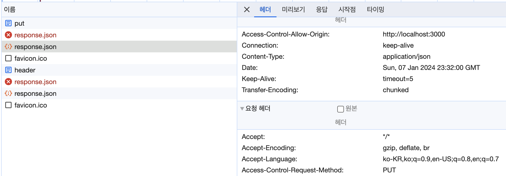

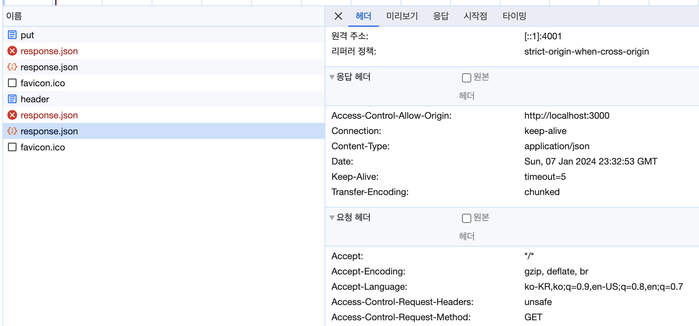

However, if the server does not return the response value, a CORS error like the one below occurs.

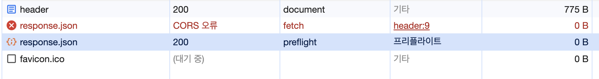

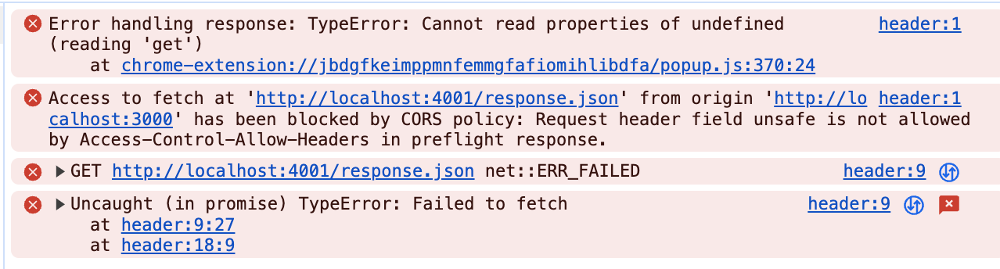

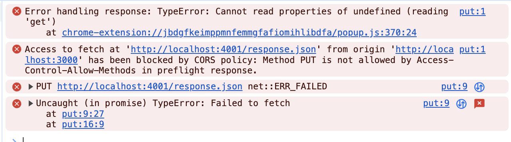

So, can we add code on the server to allow the request? A simple implementation can be found below.

For unsafe headers, add them to the value of the Access-Control-Allow-Headers attribute, and for methods, add them to the value of the Access-Control-Allow-Methods attribute.

```jsx
// express server (PORT: 4000, 4001)
responseServer({
  path: './public/response.json',
  contentType: 'application/json',
  allowOption: {
    // 자원을 허용할 출처를 지정한다.
    // 단순 요청(Simple requests)
    // Accept, Accept-Language, Content-Language, Content-Type
    'Access-Control-Allow-Origin': 'http://localhost:4000',
    // 교차 출처 요청의 unsafe 헤더 사용을 허용한다.
    'Access-Control-Allow-Headers': 'unsafe',
    // 교차 출처의 PUT, DELETE, PATCH 요청을 허용한다.
    'Access-Control-Allow-Methods': 'PUT, DELETE, PATCH',
  },
});
```

# Accessing Unsafe Headers (Expose-Headers)

To access unsafe response headers using JavaScript, the server must add and send a header called Access-Control-Expose-Headers.

Once it is added to the headers, the client can access it through the response headers.

So, which headers are safe?

- Cache-Control, Content-Language, Content-Length, Content-Type, Expires, Last-Modified, Pragma

For access to headers other than those above, the server must add the header before the client can access it.

```tsx
// express server (PORT: 4000, 4001)
const responseServer = ({
    path,
    contentType,
    allowOption = {},
  }: ResponseArgument) => {
    fs.readFile(path, (err, content) => {
      if (err) {
        res.writeHead(500);
        res.end('Error');
        return;
      }

      res.writeHead(200, {
        'Content-Type': contentType,
        'Content-Length': content.length,
        'Content-Encoding': 'UTF-8', // 안전하지 않는 헤더
        ...allowOption,
      });
      res.end(content);
    });
  };

responseServer({
  path: './public/response.json',
  contentType: 'application/json',
  allowOption: {
    // 자원을 허용할 출처를 지정한다.
    // 단순 요청(Simple requests)
    // Accept, Accept-Language, Content-Language, Content-Type
    'Access-Control-Allow-Origin': 'http://localhost:4000',
    // 교차 출처 요청의 unsafe 헤더 사용을 허용한다.
    'Access-Control-Allow-Headers': 'unsafe',
    // 안전하지 않는 응답의 헤더를 접근하려고 할 경우 서버에서 아래와 같이 설정이 필요하다.
    // 자바스크립트 접근을 허용하는 안전하지 않은 헤더 목록이 담겨있습니다(안전한 header: Cache-Control, Content-Language, Content-Length, Content-Type, Expires, Last-Modified, Pragma)
    'Access-Control-Expose-Headers': 'Content-Encoding', // 안전하지 않는 헤더 설정
    // 교차 출처의 PUT, DELETE, PATCH 요청을 허용한다.
    'Access-Control-Allow-Methods': 'PUT, DELETE, PATCH',
    // preflight 요청 없이 크로스 오리진 요청을 바로 보낼지에 대한 정보를 요청
    'Access-Control-Max-Age': '5',
  },
});

// ./public/cross-origin/index.html
<script>
  (async () => {
    const res = await fetch('http://localhost:4001/response.json');
    // console.log(res.headers.get('Cache-Control'));
    const json = await res.json();
    var newNode = document.createElement('div');
    newNode.innerHTML = JSON.stringify(json);
    document.body.appendChild(newNode);
  })();
</script>
```

# Credentials

When you send a cross-origin request with JavaScript, credentials such as cookies or HTTP authentication are not sent along by default. So to send credential information via cookies, you need to add the credential setting to the header when sending the request.

For credentials, you can add the corresponding attribute to the options, such as fetch (credentials: "include") or axios (withCredentials: true).

To handle CORS for this attribute, the server must set the Access-Control-Allow-Credentials attribute to true.

Note that when there is a request that carries credentials, you cannot use a wildcard (\*) as the value of the Access-Control-Allow-Origin attribute.

```jsx
(async () => {
  const res = await fetch('http://localhost:4001/credentials/response.json', {
    credentials: 'include',
  });
  const json = await res.json();
  var newNode = document.createElement('div');
  newNode.innerHTML = JSON.stringify(json);
  document.body.appendChild(newNode);
})();

// express server (PORT: 4000, 4001)
responseServer({
  path: './public/response.json',
  contentType: 'application/json',
  allowOption: {
    // 자원을 허용할 출처를 지정한다.
    // 단순 요청(Simple requests)
    // Accept, Accept-Language, Content-Language, Content-Type
    'Access-Control-Allow-Origin': 'http://localhost:4000',
    // 교차 출처 요청의 unsafe 헤더 사용을 허용한다.
    'Access-Control-Allow-Headers': 'unsafe',
    // 교차 출처의 PUT, DELETE, PATCH 요청을 허용한다.
    'Access-Control-Allow-Methods': 'PUT, DELETE, PATCH',
    // 서로 다른 도메인(크로스 도메인)에 요청을 보낼 때 요청에 credential 정보를 담아서 보낼 지를 결정하는 항목
    // credential 정보가 포함되어 있는 요청: 쿠키를 첨부해서 보내는 요청, 헤더에 Authorization 항목이 있는 요청
    // Access-Control-Allow: *(와일드 카드 제외)
    'Access-Control-Allow-Credentials': 'true',
  },
});
```

If the server does not add the Access-Control-Allow-Credentials attribute, the error below occurs.

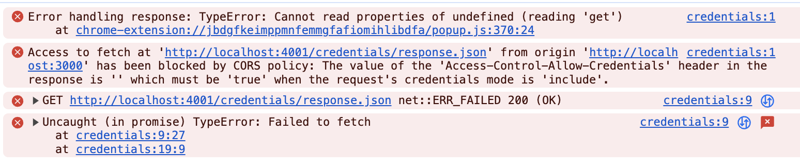

Also, if Access-Control-Allow-Credentials is set but a wildcard (\*) is applied to the origin, the error below occurs.

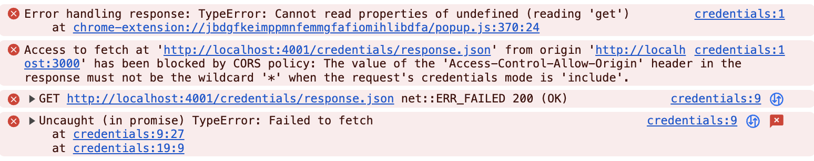

On the server, you can check the cookie-related data of the calling origin through the request argument.

```tsx
const server = createServer(function (
  req: IncomingMessage,
  res: ServerResponse
) {
  if (req.url?.match(/credentials/g)) {
    console.log(req.headers.cookie);
  }
}
```

# Caching (Max Age)

You can set, in seconds, whether a cross-origin request can be sent directly without a preflight request.

This is configured through the value of the Access-Control-Max-Age attribute in the options.

```tsx
if (req.url === '/' || req.url === '/response.json') {
  responseServer({
    path: './public/response.json',
    contentType: 'application/json',
    allowOption: {
      // 자원을 허용할 출처를 지정한다.
      // 단순 요청(Simple requests)
      // Accept, Accept-Language, Content-Language, Content-Type
      'Access-Control-Allow-Origin': 'http://localhost:4000',
      // 교차 출처 요청의 unsafe 헤더 사용을 허용한다.
      'Access-Control-Allow-Headers': 'unsafe',
      // 교차 출처의 PUT, DELETE, PATCH 요청을 허용한다.
      'Access-Control-Allow-Methods': 'PUT, DELETE, PATCH',
      // preflight 요청 없이 크로스 오리진 요청을 바로 보낼지에 대한 정보를 요청
      'Access-Control-Max-Age': '5',
    },
  });
}
```

Looking at the image below, you can see that when you reload within 5 seconds, the browser does not send a preflight request.

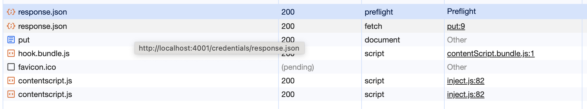

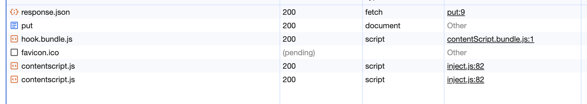

# Example Code

- [https://github.com/seungahhong/cors](https://github.com/seungahhong/cors)

# References

- [교차 출처 리소스 공유 (CORS) - HTTP | MDN](https://developer.mozilla.org/ko/docs/Web/HTTP/CORS#기능적_개요)
- [CORS](https://youhavetosleep.dev/cors/)
- [HTTP Ajax 요청시 사용하는 withCredentials 옵션의 의미](https://junglast.com/blog/http-ajax-withcredential)
- [CORS](https://ko.javascript.info/fetch-crossorigin)
- [CORS-safelisted response header - MDN Web Docs Glossary: Definitions of Web-related terms | MDN](https://developer.mozilla.org/en-US/docs/Glossary/CORS-safelisted_response_header)
