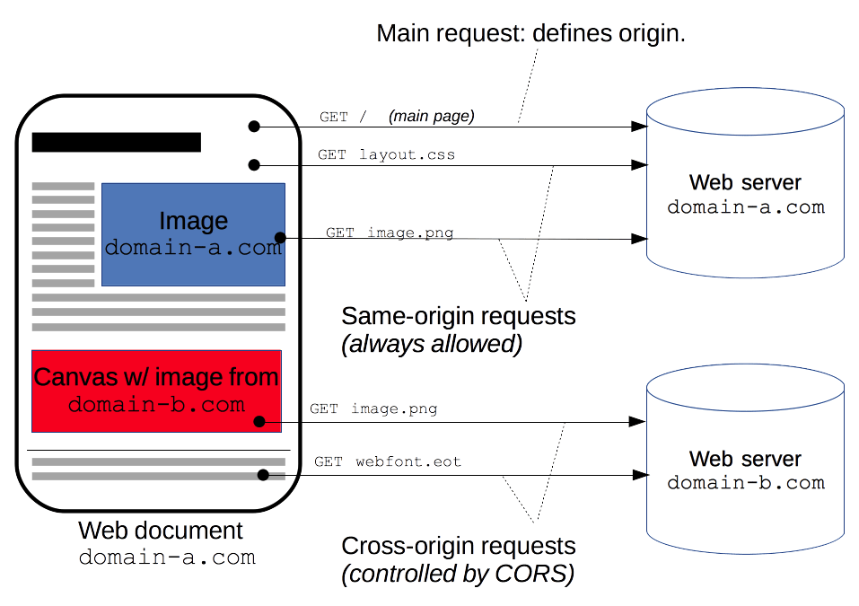
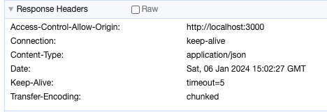
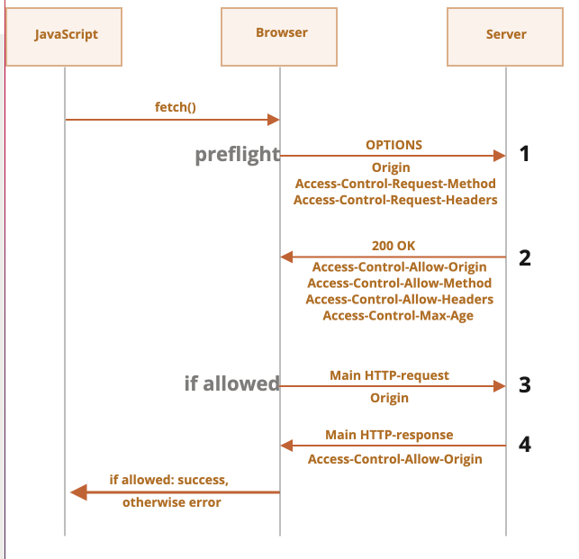
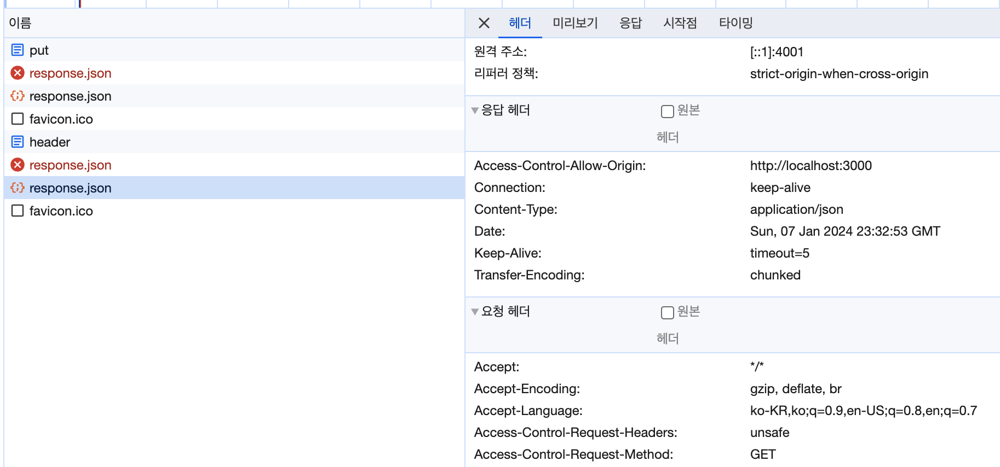

# 개요

CORS(교차 출처 리소스 공유)는 다른 출처(origin:프로토콜, 호스트, 포트)출처의 자원을 접근할 수 있도록 알려주는 것을 것을 뜻한다.

다른 출처의 리소스를 불러올 때 올바를 CORS 헤더를 포함하지 않는다면 접근이 제한됨을 뜻합니다.




# CORS 사용 사례

- [XMLHttpRequest](https://developer.mozilla.org/ko/docs/Web/API/XMLHttpRequest)와 [Fetch API](https://developer.mozilla.org/ko/docs/Web/API/Fetch_API) 호출.
- 웹 폰트(CSS 내 @font-face에서 교차 도메인 폰트 사용 시), [so that servers can deploy TrueType fonts that can only be cross-site loaded and used by web sites that are permitted to do so.](https://www.w3.org/TR/css-fonts-3/#font-fetching-requirements)
- [WebGL 텍스쳐](https://developer.mozilla.org/ko/docs/Web/API/WebGL_API/Tutorial/Using_textures_in_WebGL).
- [drawImage() (en-US)](https://developer.mozilla.org/en-US/docs/Web/API/CanvasRenderingContext2D/drawImage)를 사용해 캔버스에 그린 이미지/비디오 프레임.
- [이미지로부터 추출하는 CSS Shapes. (en-US)](https://developer.mozilla.org/en-US/docs/Web/CSS/CSS_shapes/Shapes_from_images)

# 간단하게 재현해보자(다른 출처 GET 메서드)

- 서버를 4000, 4001 포트로 해서 2개를 띄운 이후에 http://localhost:3000/cors 호출한다면 html 파일에서 http://localhost:4001/response.json 호출하게 되고 동일 출처가 아니라서 아래 이미지와 같이 CORS에러가 발생합니다.
- 브라우저는 교차 출처에 리소스 자원 허용을 확인하기 위해서는 서버 응답에 Access-Control-Allow-Origin 속성값을 확인하게 되는데, 아래 응답 헤더에서는 따로 허용 출처가 없기 때문에 CORS가 발생하게 됩니다.


**GET 호출**

```tsx
// public/cross-origin/index.html
<!DOCTYPE html>
<html lang="en">
  <head>
    <meta charset="UTF-8" />
    <meta name="viewport" content="width=device-width, initial-scale=1.0" />
    <title>Cors Origin</title>
    <script>
      (async () => {
        const res = await fetch('http://localhost:4001/response.json');
        const json = await res.json();
        var newNode = document.createElement('div');
        newNode.innerHTML = JSON.stringify(json);
        document.body.appendChild(newNode);
      })();
    </script>
  </head>
  <body></body>
</html>

// express server (PORT: 4000, 4001)
import {
  createServer,
  IncomingMessage,
  OutgoingHttpHeaders,
  ServerResponse,
} from 'http';
import fs from 'fs';

// 다른 포트에도 서버를 띄우기 위해 포트 번호를 환경 변수로 받았다.
const port = process.env.PORT || 4000

const server = http.createServer((req, res) => {
  const responseServer = ({
    path,
    contentType,
    allowOption = {},
  }: ResponseArgument) => {
    fs.readFile(path, (err, content) => {
      if (err) {
        res.writeHead(500);
        res.end('Error');
        return;
      }

      res.writeHead(200, {
        'Content-Type': contentType,
        ...allowOption,
      });
      res.end(content);
    });
  };

	if (req.url === '/response.json') {
		responseServer({
      path: './public/response.json',
      contentType: 'application/json',
    });
	}

	if (req.url === '/cors') {
    responseServer({
      path: './public/cross-origin/index.html',
      contentType: 'text/html',
    });
  }
})

server.listen(port, () =>
  console.log(`Server Start Listening on port ${port}`)
);
```

# Simple requests(단순요청)


위에 예제처럼 교차 출처(origin) 속성만 브라우저가 확인하는 요청을 단순요청이라고 하며, 일부 요청은 [CORS preflight](https://developer.mozilla.org/ko/docs/Glossary/Preflight_request) 트리거를 하지 않습니다. 해당 단순 요청은 아래 조건을 모두 충족하는 요청입니다.

- 다음 중 하나의 메서드
  - [GET](https://developer.mozilla.org/ko/docs/Web/HTTP/Methods/GET)
  - [HEAD](https://developer.mozilla.org/ko/docs/Web/HTTP/Methods/HEAD)
  - [POST](https://developer.mozilla.org/ko/docs/Web/HTTP/Methods/POST)
- 유저 에이전트가 자동으로 설정 한 헤더 (예를들어, [Connection](https://developer.mozilla.org/ko/docs/Web/HTTP/Headers/Connection), [User-Agent (en-US)](https://developer.mozilla.org/en-US/docs/Web/HTTP/Headers/User-Agent), [Fetch 명세에서 "forbidden header name"으로 정의한 헤더](https://fetch.spec.whatwg.org/#forbidden-header-name))외에, 수동으로 설정할 수 있는 헤더는 오직 [Fetch 명세에서 "CORS-safelisted request-header"로 정의한 헤더](https://fetch.spec.whatwg.org/#cors-safelisted-request-header) 뿐입니다.
  - [Accept](https://developer.mozilla.org/ko/docs/Web/HTTP/Headers/Accept)
  - [Accept-Language](https://developer.mozilla.org/ko/docs/Web/HTTP/Headers/Accept-Language)
  - [Content-Language](https://developer.mozilla.org/ko/docs/Web/HTTP/Headers/Content-Language)
  - [Content-Type](https://developer.mozilla.org/ko/docs/Web/HTTP/Headers/Content-Type) (아래의 추가 요구 사항에 유의하세요.)
- [Content-Type](https://developer.mozilla.org/ko/docs/Web/HTTP/Headers/Content-Type) 헤더는 다음의 값들만 허용됩니다.
  - application/x-www-form-urlencoded
  - multipart/form-data
  - text/plain

**해결방안**

서버는 자원을 제공하는 출처를 Access-Control-Allow-Origin 설정해서 클라이언트에 응답으로 보내주게 되며, 브라우저가 허용 출처 주소를 확인해서 서버 자원 사용이 가능하게 됩니다.



```tsx
// public/cross-origin/index_post.html
<!DOCTYPE html>
<html lang="en">
  <head>
    <meta charset="UTF-8" />
    <meta name="viewport" content="width=device-width, initial-scale=1.0" />
    <title>Cors Origin</title>
    <script>
      (async () => {
        const res = await fetch('http://localhost:4001/response.json', {
          method: 'POST',
        });
        const json = await res.json();
        var newNode = document.createElement('div');
        newNode.innerHTML = JSON.stringify(json);
        document.body.appendChild(newNode);
      })();
			(async () => {
        const res = await fetch('http://localhost:4001/response.json');
        const json = await res.json();
        var newNode = document.createElement('div');
        newNode.innerHTML = JSON.stringify(json);
        document.body.appendChild(newNode);
      })();
    </script>
  </head>
  <body></body>
</html>

// express server (PORT: 4000, 4001)
if (req.url === '/response.json') {
    responseServer({
      path: './public/response.json',
      contentType: 'application/json',
      allowOption: {
        // 자원을 허용할 출처를 지정한다.
        // 단순 요청(Simple requests)
        // Accept, Accept-Language, Content-Language, Content-Type
        'Access-Control-Allow-Origin': 'http://localhost:3000',
      },
    });
  }
```

# 사전 전달 요청(Preflight request)

**안전하지 않은 요청**

과거에는 GET, POST 외에는 브라우저에서 API 요청을 보낼 거라고 생각을 못했었기 때문에, 추후에 등장한 PATCH, DELETE, PUT 같은 메서드 호출 시 브라우저가 보낸 것이 아니라고 판단해서 접근 권한을 확인하게 됩니다. 해당 접근 권한을 확인할 때 사용하는 것이 사전 전달 요청이라고 합니다.



사전 전달 요청이 있는 경우에는 options 메서드를 사용하고 두 헤더가 함께 들어가며, 본문은 비어 있습니다.

preflight 요청은 OPTIONS 메서드를 사용하고 두 헤더가 함께 들어가며, 본문은 비어있습니다.

- Access-Control-Request-Method 헤더 – 안전하지 않은 요청에서 사용하는 메서드 정보가 담겨있습니다.
- Access-Control-Request-Headers 헤더 – 안전하지 않은 요청에서 사용하는 헤더 목록이 담겨있습니다. 각 헤더는 쉼표로 구분됩니다.

안전하지 않은 요청을 허용하기로 협의하였다면 서버는 본문이 비어있고 상태 코드가 200인 응답을 다음과 같은 헤더와 함께 브라우저로 보냅니다.

- Access-Control-Allow-Origin – 요청을 보낸 오리진 이어야 합니다
- Access-Control-Allow-Methods – 허용된 메서드 정보가 담겨있습니다.
- Access-Control-Allow-Headers – 허용된 헤더 목록이 담겨있습니다.
- Access-Control-Max-Age – 퍼미션 체크 여부를 몇 초간 캐싱해 놓을지를 명시합니다. 이렇게 퍼미션 정보를 캐싱해 놓으면 브라우저는 일정 기간 동안 preflight 요청을 생략하고 안전하지 않은 요청을 보낼 수 있습니다.

그러면 한번 코드로 확인해볼까요??

```jsx
// express server (PORT: 4000, 4001)
const responseServer = ({
  path,
  contentType,
  allowOption = {},
}: ResponseArgument) => {
  fs.readFile(path, (err, content) => {
    if (err) {
      res.writeHead(500);
      res.end('Error');
      return;
    }

    res.writeHead(200, {
      'Content-Type': contentType,
      ...allowOption,
    });
    res.end(content);
  });
};

if (req.url === '/cors/header') {
  responseServer({
    path: './public/cross-origin/index_header.html',
    contentType: 'text/html',
  });
}

if (req.url === '/cors/put') {
  responseServer({
    path: './public/cross-origin/index_put.html',
    contentType: 'text/html',
  });
}

// ./public/cross-origin/index_header.html
// 안전하지 않는 헤더를 사용할 경우
<script>
  (async () => {
    const res = await fetch('http://localhost:4001/response.json', {
      headers: {
        unsafe: 'hello',
      },
    });
    const json = await res.json();
    var newNode = document.createElement('div');
    newNode.innerHTML = JSON.stringify(json);
    document.body.appendChild(newNode);
  })();
</script>

// ./public/cross-origin/index_put.html
// GET, POST외에 메서드를 사용하는 경우
<script>
  (async () => {
    const res = await fetch('http://localhost:4001/response.json', {
      method: 'PUT',
    });
    const json = await res.json();
    var newNode = document.createElement('div');
    newNode.innerHTML = JSON.stringify(json);
    document.body.appendChild(newNode);
  })();
</script>
```

4001번 포트 서버에서 안전하지 않은 header, methods 요청 시 아래와 같은 두 헤더가 함께 들어가게 되고 서버에서는 해당 요청에 대해서 허용을 위해서는 응답 헤더에 속성값을 추가해서 보내줄 경우에 서버의 자원을 접근할 수 있게 됩니다.




단, 서버에 응답값을 주지 않을 경우 아래와 같은 CORS 에러가 발생하게 됩니다.


그렇다면, 서버에서 요청에 대해서 허용하는 코드를 추가할 수 있을까요?? 간단하게 구현된 코드는 아래서 확인이 가능합니다.

안전하지 않는 header에 대해서는 Access-Control-Allow-Headers 속성의 값으로 추가, method에 대해서는 Access-Control-Allow-Methods 속성의 값으로 추가합니다.

```jsx
// express server (PORT: 4000, 4001)
responseServer({
  path: './public/response.json',
  contentType: 'application/json',
  allowOption: {
    // 자원을 허용할 출처를 지정한다.
    // 단순 요청(Simple requests)
    // Accept, Accept-Language, Content-Language, Content-Type
    'Access-Control-Allow-Origin': 'http://localhost:4000',
    // 교차 출처 요청의 unsafe 헤더 사용을 허용한다.
    'Access-Control-Allow-Headers': 'unsafe',
    // 교차 출처의 PUT, DELETE, PATCH 요청을 허용한다.
    'Access-Control-Allow-Methods': 'PUT, DELETE, PATCH',
  },
});
```

# 안전하지 않는 헤더 접근(Expose-Headers)

자바스크립트를 사용해 안전하지 않은 응답 헤더에 접근하려면 서버에서 Access-Control-Expose-Headers라는 헤더를 추가해서 보내줘야합니다.

headers에 추가가 될 경우 클라이언트에서 응답 헤더를 통해서 접근이 가능합니다.

그렇다면 안전한 헤더는 어떤게 있을까요??

- Cache-Control, Content-Language, Content-Length, Content-Type, Expires, Last-Modified, Pragma

위에 헤더외에 접근에서 대해서는 서버에서 헤더를 추가해줘야지 클라이언트에서 접근이 가능합니다.

```tsx
// express server (PORT: 4000, 4001)
const responseServer = ({
    path,
    contentType,
    allowOption = {},
  }: ResponseArgument) => {
    fs.readFile(path, (err, content) => {
      if (err) {
        res.writeHead(500);
        res.end('Error');
        return;
      }

      res.writeHead(200, {
        'Content-Type': contentType,
        'Content-Length': content.length,
        'Content-Encoding': 'UTF-8', // 안전하지 않는 헤더
        ...allowOption,
      });
      res.end(content);
    });
  };

responseServer({
  path: './public/response.json',
  contentType: 'application/json',
  allowOption: {
    // 자원을 허용할 출처를 지정한다.
    // 단순 요청(Simple requests)
    // Accept, Accept-Language, Content-Language, Content-Type
    'Access-Control-Allow-Origin': 'http://localhost:4000',
    // 교차 출처 요청의 unsafe 헤더 사용을 허용한다.
    'Access-Control-Allow-Headers': 'unsafe',
    // 안전하지 않는 응답의 헤더를 접근하려고 할 경우 서버에서 아래와 같이 설정이 필요하다.
    // 자바스크립트 접근을 허용하는 안전하지 않은 헤더 목록이 담겨있습니다(안전한 header: Cache-Control, Content-Language, Content-Length, Content-Type, Expires, Last-Modified, Pragma)
    'Access-Control-Expose-Headers': 'Content-Encoding', // 안전하지 않는 헤더 설정
    // 교차 출처의 PUT, DELETE, PATCH 요청을 허용한다.
    'Access-Control-Allow-Methods': 'PUT, DELETE, PATCH',
    // preflight 요청 없이 크로스 오리진 요청을 바로 보낼지에 대한 정보를 요청
    'Access-Control-Max-Age': '5',
  },
});

// ./public/cross-origin/index.html
<script>
  (async () => {
    const res = await fetch('http://localhost:4001/response.json');
    // console.log(res.headers.get('Cache-Control'));
    const json = await res.json();
    var newNode = document.createElement('div');
    newNode.innerHTML = JSON.stringify(json);
    document.body.appendChild(newNode);
  })();
</script>
```

# 자격 증명(Credential)

자바스크립트로 크로스 오리진 요청을 보내는 경우, 기본적으로 쿠키나 HTTP 인증 같은 자격 증명(credential)이 함께 전송되지 않기 때문에, 자격 증명 정보를 쿠키에 보내기 위해서는 자격 증명 설정을 header에 추가해서 보내줘야합니다.

자격 증명도 options에 속성으로 fetch(creidentials: “include”), axios(withCredentials: true) 추가해서 보내주면 됩니다.

해당 속성에 대한 CORS 대응을 위해서는 서버에서는 Access-Control-Allow-Credentials 속성을 true로 설정해줘야 합니다.

단, 자격 증명이 함께 전송된는 요청이 있는 경우에는 Access-Control-Allow-Origin 속성값에 와일드 카드(\*)를 사용할 수 없습니다.

```jsx
(async () => {
  const res = await fetch('http://localhost:4001/credentials/response.json', {
    credentials: 'include',
  });
  const json = await res.json();
  var newNode = document.createElement('div');
  newNode.innerHTML = JSON.stringify(json);
  document.body.appendChild(newNode);
})();

// express server (PORT: 4000, 4001)
responseServer({
  path: './public/response.json',
  contentType: 'application/json',
  allowOption: {
    // 자원을 허용할 출처를 지정한다.
    // 단순 요청(Simple requests)
    // Accept, Accept-Language, Content-Language, Content-Type
    'Access-Control-Allow-Origin': 'http://localhost:4000',
    // 교차 출처 요청의 unsafe 헤더 사용을 허용한다.
    'Access-Control-Allow-Headers': 'unsafe',
    // 교차 출처의 PUT, DELETE, PATCH 요청을 허용한다.
    'Access-Control-Allow-Methods': 'PUT, DELETE, PATCH',
    // 서로 다른 도메인(크로스 도메인)에 요청을 보낼 때 요청에 credential 정보를 담아서 보낼 지를 결정하는 항목
    // credential 정보가 포함되어 있는 요청: 쿠키를 첨부해서 보내는 요청, 헤더에 Authorization 항목이 있는 요청
    // Access-Control-Allow: *(와일드 카드 제외)
    'Access-Control-Allow-Credentials': 'true',
  },
});
```

서버에서 Access-Control-Allow-Credentials 속성을 추가하지 않을 경우 아래와 같은 에러가 발생합니다.


또한, Access-Control-Allow-Credentials 설정 했으나 origin에 와일드카드(\*)를 적용된 경우 아래와 같은 에러가 발생합니다.


서버에서는 request 인자를 통해서 호출 출처의 cookie 관련 데이터를 확인할 수 있습니다.

```tsx
const server = createServer(function (
  req: IncomingMessage,
  res: ServerResponse
) {
  if (req.url?.match(/credentials/g)) {
    console.log(req.headers.cookie);
  }
}
```

# 캐싱 (Max Age)

preflight 요청 없이 크로스 오리진 요청을 바로 보낼지에 여부를 초 단위로 설정을 할 수 있습니다.

설정은 Access-Control-Max-Age 속성의 값을 옵션에 설정할 수 있습니다.

```tsx
if (req.url === '/' || req.url === '/response.json') {
  responseServer({
    path: './public/response.json',
    contentType: 'application/json',
    allowOption: {
      // 자원을 허용할 출처를 지정한다.
      // 단순 요청(Simple requests)
      // Accept, Accept-Language, Content-Language, Content-Type
      'Access-Control-Allow-Origin': 'http://localhost:4000',
      // 교차 출처 요청의 unsafe 헤더 사용을 허용한다.
      'Access-Control-Allow-Headers': 'unsafe',
      // 교차 출처의 PUT, DELETE, PATCH 요청을 허용한다.
      'Access-Control-Allow-Methods': 'PUT, DELETE, PATCH',
      // preflight 요청 없이 크로스 오리진 요청을 바로 보낼지에 대한 정보를 요청
      'Access-Control-Max-Age': '5',
    },
  });
}
```

아래 이미지를 보시면 5초 전에 재로딩 할 경우에는 Preflight를 요청하지 않는 것을 확인할 수 있습니다.


# 예제코드

- [https://github.com/seungahhong/cors](https://github.com/seungahhong/cors)

# 참고페이지

- [교차 출처 리소스 공유 (CORS) - HTTP | MDN](https://developer.mozilla.org/ko/docs/Web/HTTP/CORS#기능적_개요)
- [CORS](https://youhavetosleep.dev/cors/)
- [HTTP Ajax 요청시 사용하는 withCredentials 옵션의 의미](https://junglast.com/blog/http-ajax-withcredential)
- [CORS](https://ko.javascript.info/fetch-crossorigin)
- [CORS-safelisted response header - MDN Web Docs Glossary: Definitions of Web-related terms | MDN](https://developer.mozilla.org/en-US/docs/Glossary/CORS-safelisted_response_header)
